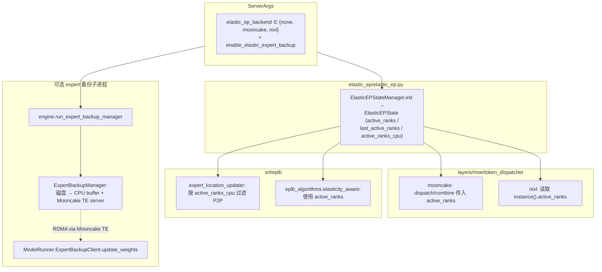

# `srt/elastic_ep` — Elastic Expert Parallelism（rank 活性 + 权重备份）

## Summary

`srt/elastic_ep/`（**3** `.py` 文件 / ~16 KB）= 两类协作能力：

1. **`ElasticEPStateManager`** ([`elastic_ep.py:30-73`](d:\design\sglang\python\sglang\srt\elastic_ep\elastic_ep.py)) 持有的全局 `active_ranks` 掩码，供 MoE token dispatcher（Mooncake / Nixl EP）与 EPLB 在「专家并行 rank 活性变化」时协同。
2. **可选 expert 权重备份**：独立子进程 [`ExpertBackupManager`](d:\design\sglang\python\sglang\srt\elastic_ep\expert_backup_manager.py) 从磁盘加载本节点负责的 expert 子集到连续 CPU buffer，经 Mooncake Transfer Engine + worker 侧 [`ExpertBackupClient`](d:\design\sglang\python\sglang\srt\elastic_ep\expert_backup_client.py) 做批量 RDMA 读回，配合 EPLB logical↔physical 映射更新权重。

> synthesis: 与 [comparison/topics/distributed.md](../../comparison/topics/distributed.md) 一致——MindIE 无等价模块；**vLLM 也有** [`vllm/distributed/elastic_ep/`](d:\design\vllm\vllm\distributed\elastic_ep)（**API/状态机不同**），不可与本目录混称为同一实现。**SGLang 没有 `--enable-elastic-ep` flag**（vLLM 才有），对应能力由 `--elastic-ep-backend ∈ {mooncake, nixl, none}` + `--enable-elastic-expert-backup` 组合表达。

## Sources

| 文件 | 行数（约） | 职责 |
|---|---|---|
| [elastic_ep.py](d:\design\sglang\python\sglang\srt\elastic_ep\elastic_ep.py) | 73 | `ElasticEPState` ([L12-27](d:\design\sglang\python\sglang\srt\elastic_ep\elastic_ep.py)) / `ElasticEPStateManager` ([L30-73](d:\design\sglang\python\sglang\srt\elastic_ep\elastic_ep.py))：全局 EP rank 活性张量 + CPU 镜像 |
| [expert_backup_client.py](d:\design\sglang\python\sglang\srt\elastic_ep\expert_backup_client.py) | 173 | ZMQ 订阅各 engine DRAM 映射；Mooncake TE `batch_transfer_sync_read` 拉取远端 expert 权重到本地参数 |
| [expert_backup_manager.py](d:\design\sglang\python\sglang\srt\elastic_ep\expert_backup_manager.py) | 186 | 子进程：磁盘迭代 expert 权重 → 连续 CPU buffer；ZMQ PUB 映射；Mooncake TE `register_memory` |
| **CLI / 校验** | [server_args.py:526-554](d:\design\sglang\python\sglang\srt\server_args.py)、[L2974-2987 `_handle_elastic_ep`](d:\design\sglang\python\sglang\srt\server_args.py)、[L5401-5421 argparse](d:\design\sglang\python\sglang\srt\server_args.py) | — |
| **集成（外部文件）** | [model_runner.py:563-580 ModelRunner.__init__](d:\design\sglang\python\sglang\srt\model_executor\model_runner.py)、[L2886-2905 forward 触发 rebalance](d:\design\sglang\python\sglang\srt\model_executor\model_runner.py)、[entrypoints/engine.py:683-687 run_expert_backup_manager](d:\design\sglang\python\sglang\srt\entrypoints\engine.py) | — |

## Architecture / Data flow

- 启用 `elastic_ep_backend` 时 [`ModelRunner.__init__`](d:\design\sglang\python\sglang\srt\model_executor\model_runner.py) 调用 [`ElasticEPStateManager.init`](d:\design\sglang\python\sglang\srt\elastic_ep\elastic_ep.py)，构造全 1 的 `active_ranks`（[`healthy_rank_state`](d:\design\sglang\python\sglang\srt\elastic_ep\elastic_ep.py)）。
- Mooncake EP dispatcher 在 [`_dispatch_core` / `_combine_core`](d:\design\sglang\python\sglang\srt\layers\moe\token_dispatcher\mooncake.py) 将 `ElasticEPStateManager.instance().active_ranks` 传入 Mooncake `Buffer.dispatch` / `combine`。
- Nixl dispatcher 在构造时缓存 [`elastic_state.active_ranks`](d:\design\sglang\python\sglang\srt\layers\moe\token_dispatcher\nixl.py)（可为 `None` 则不走 elastic 掩码分支）。
- 若 `enable_elastic_expert_backup` 且 `elastic_ep_backend` 非空，[`ModelRunner`](d:\design\sglang\python\sglang\srt\model_executor\model_runner.py) 构造 `ExpertBackupClient`；引擎入口 [`run_expert_backup_manager`](d:\design\sglang\python\sglang\srt\entrypoints\engine.py) 启动 `ExpertBackupManager` 子进程。

## Key classes / API

| 名称 | 锚点 | 作用 |
|---|---|---|
| `ElasticEPState` | [elastic_ep.py:12-27](d:\design\sglang\python\sglang\srt\elastic_ep\elastic_ep.py) | `active_ranks` / `last_active_ranks` / `active_ranks_cpu`；`is_active_equal_last`、`sync_active_to_cpu`、`snapshot_active_to_last` |
| `ElasticEPStateManager` | [elastic_ep.py:30-73](d:\design\sglang\python\sglang\srt\elastic_ep\elastic_ep.py) | 单例 `init` / `instance`；`_build_state` / `healthy_rank_state`（默认全 1） |
| `ExpertBackupClient` | [expert_backup_client.py:31-173](d:\design\sglang\python\sglang\srt\elastic_ep\expert_backup_client.py) | ZMQ + Mooncake TE；`update_weights` 按 [`get_global_expert_location_metadata`](d:\design\sglang\python\sglang\srt\eplb\expert_location.py) 做 logical→physical 解析并 `batch_transfer_sync_read` |
| `ExpertBackupManager` | [expert_backup_manager.py:34-156](d:\design\sglang\python\sglang\srt\elastic_ep\expert_backup_manager.py) | `backup_weights_from_disk`、`start_transfer_server`；按 node 划分 expert id 区间 [`idmn`,`idmx`)（[L45-46](d:\design\sglang\python\sglang\srt\elastic_ep\expert_backup_manager.py)） |
| `run_expert_backup_manager` | [expert_backup_manager.py:177-186](d:\design\sglang\python\sglang\srt\elastic_ep\expert_backup_manager.py) | `multiprocessing.Process` 包装 `run_expert_backup_manager_process` |

## CLI / config 字段

| 字段 / flag | 类型 / 默认 | 锚点 |
|---|---|---|
| `ServerArgs.elastic_ep_backend` | `Literal[None, "mooncake", "nixl"]`，默认 `None` | [server_args.py:552](d:\design\sglang\python\sglang\srt\server_args.py) |
| `--elastic-ep-backend` | `choices=["none", "mooncake", "nixl"]` | [server_args.py:5401-5406](d:\design\sglang\python\sglang\srt\server_args.py)；help 写明 mooncake 与 nixl |
| `ServerArgs.enable_elastic_expert_backup` | bool, False | [server_args.py:553](d:\design\sglang\python\sglang\srt\server_args.py) |
| `--enable-elastic-expert-backup` | `store_true` | [server_args.py:5408-5412](d:\design\sglang\python\sglang\srt\server_args.py) |
| `_handle_elastic_ep()` | 校验方法 | `elastic_ep_backend` 非空时：若 `enable_eplb` 则把 `eplb_algorithm` 约束为 `elasticity_aware` 系；`mooncake` 时校验 IB 设备 [server_args.py:2974-2987](d:\design\sglang\python\sglang\srt\server_args.py) |

> [!warning] CONTRADICTION（CLI 命名陷阱）：用户口语中的 `--enable-elastic-ep` 在 **SGLang** 中**未出现**；vLLM 才使用 `--enable-elastic-ep`。SGLang 对应开关为 **`--elastic-ep-backend`** + **`--enable-elastic-expert-backup`** 两个 flag 组合。

## ModelRunner / MoE / EPLB 关系

- **与 [`eplb/`](eplb.md)**：`enable_eplb` + `elastic_ep_backend` 时，[`_handle_elastic_ep`](d:\design\sglang\python\sglang\srt\server_args.py) 强制 `eplb_algorithm` 为 `elasticity_aware` 或 `elasticity_aware_hierarchical`。EPLB 算法入口 [eplb_algorithms/__init__.py:50-69](d:\design\sglang\python\sglang\srt\eplb\eplb_algorithms\__init__.py) 在该分支传入 `ElasticEPStateManager.instance().active_ranks`。[`ExpertLocationUpdater._filter_p2p_ops`](d:\design\sglang\python\sglang\srt\eplb\expert_location_updater.py) 用 `active_ranks_cpu` 过滤失效 peer 的 P2P。
- **与 MoE**：[`mooncake.py`](d:\design\sglang\python\sglang\srt\layers\moe\token_dispatcher\mooncake.py) / [`nixl.py`](d:\design\sglang\python\sglang\srt\layers\moe\token_dispatcher\nixl.py) 引用 `ElasticEPStateManager`（见上 Architecture）。
- **ModelRunner.forward**：[model_runner.py:2886-2893](d:\design\sglang\python\sglang\srt\model_executor\model_runner.py)：当 `elastic_ep_state` 存在且 `active_ranks` 相对 `last_active_ranks` 变化时，快照并同步 CPU，触发 `eplb_manager.rebalance()` 后再跑一轮 `_forward_raw`（[L2894-2905](d:\design\sglang\python\sglang\srt\model_executor\model_runner.py)）。

> synthesis: **EPLB 负责固定专家集合上的重平衡**；**elastic_ep 提供 rank 活性状态 + 可选磁盘备份**——使「专家放置 / 通信 / 权重拉取」在活性变化时仍能衔接。两个模块**职责正交**但**强协作**。

## §跨子系统引用（§5 step 3）

按 [AGENTS.md §5 step 3](../../AGENTS.md#5-ingest-工作流) 5 类全仓库 grep。

### 1. 跨语言绑定（C++ / sgl-kernel）

- **`elastic_ep` / `ElasticEPStateManager` / `ExpertBackupClient` / `ExpertBackupManager`**：**在 [`d:\design\sglang\sgl-kernel\`](d:\design\sglang\python\sglang\kernels\aot) 全树 grep 0 命中**

### 2. 协作伙伴跨子系统引用

| 符号 | 命中模块 |
|---|---|
| `ElasticEPStateManager` | [model_runner.py](d:\design\sglang\python\sglang\srt\model_executor\model_runner.py)、[layers/moe/token_dispatcher/mooncake.py](d:\design\sglang\python\sglang\srt\layers\moe\token_dispatcher\mooncake.py)、[layers/moe/token_dispatcher/nixl.py](d:\design\sglang\python\sglang\srt\layers\moe\token_dispatcher\nixl.py)、[eplb/expert_location_updater.py](d:\design\sglang\python\sglang\srt\eplb\expert_location_updater.py)、[eplb/eplb_algorithms/__init__.py](d:\design\sglang\python\sglang\srt\eplb\eplb_algorithms\__init__.py) |
| `ExpertBackupClient` / `run_expert_backup_manager` | [model_runner.py](d:\design\sglang\python\sglang\srt\model_executor\model_runner.py)、[entrypoints/engine.py](d:\design\sglang\python\sglang\srt\entrypoints\engine.py) |

### 3. 配置 / 共享数据结构

- `elastic_ep_backend` / `enable_elastic_expert_backup` 定义于 [server_args.py:552-553](d:\design\sglang\python\sglang\srt\server_args.py)
- **在 [`d:\design\sglang\`](d:\design\sglang) 下 `*.yaml` / `*.json` 全树 grep `elastic_ep` / `elastic-ep`：0 命中**

### 4. 测试覆盖反查

- **`d:\design\sglang\tests\` 路径不存在**（仓库测试树为 `d:\design\sglang\test\`）
- 实际命中（`d:\design\sglang\test\`）：
  - [test/manual/kv_transfer/test_mooncake_transfer_engine_init.py](d:\design\sglang\test\manual\kv_transfer\test_mooncake_transfer_engine_init.py)（含 `elastic_ep_backend` / `enable_elastic_expert_backup`）
  - [test/manual/ep/test_mooncake_expert_backup.py](d:\design\sglang\test\manual\ep\test_mooncake_expert_backup.py)
  - [test/manual/ep/test_nixl_ep.py](d:\design\sglang\test\manual\ep\test_nixl_ep.py)（类名含 `ElasticEP`）

### 5. doc / config / yaml 反查

- [docs/advanced_features/server_arguments.md](d:\design\sglang\docs\docs\advanced_features\server_arguments.mdx) 表格含 `--elastic-ep-backend`
- [docs/platforms/ascend/ascend_npu_support_features.md](d:\design\sglang\docs\docs\hardware-platforms\ascend-npus\reference\support_features.mdx) 列出该 flag

## 跨项目对照（synthesis）

| 维度 | MindIE | vLLM | SGLang（本模块） |
|---|---|---|---|
| 对应实现 | ❌ N/A（[`d:\design\MindIE-LLM\`](d:\design\MindIE-LLM) 全树 grep `elastic_ep` / `ElasticEPStateManager` 0 命中） | ⚠️ **有但不同**：[`vllm/distributed/elastic_ep/`](d:\design\vllm\vllm\distributed\elastic_ep) + [`--enable-elastic-ep`](d:\design\vllm\vllm\engine\arg_utils.py) | ✅ `srt/elastic_ep/` 3 .py（rank 活性 + Mooncake/NIXL 权重备份） |
| Backend 模型 | N/A | （vLLM 详细未本轮 ingest） | `Literal[None, "mooncake", "nixl"]` |
| 权重备份 | N/A | （vLLM 是否有 ExpertBackup 等价物未确认） | ✅ `ExpertBackupClient` + `ExpertBackupManager` 子进程 + Mooncake TE RDMA |
| CLI 命名 | N/A | `--enable-elastic-ep` | **不同**：`--elastic-ep-backend` + `--enable-elastic-expert-backup` |

> synthesis: 三仓对比的权威落点仍是 [comparison/topics/distributed.md](../../comparison/topics/distributed.md)；本模块页只锚定 SGLang 源码。**写作时应表述为"实现不同"而非"仅 SGLang 有"**——后者会与 vLLM 现有 elastic_ep 冲突。

## Notes / Caveats

> [!warning] CONTRADICTION（数据可能误导）：若外部材料写「仅 SGLang 有 Elastic EP」而忽略 vLLM 的 [`distributed/elastic_ep/`](d:\design\vllm\vllm\distributed\elastic_ep)，会与 [comparison/topics/distributed.md](../../comparison/topics/distributed.md) 及 vLLM 源码**冲突**——应表述为「**实现不同**」。CLI 同样不同（vLLM `--enable-elastic-ep` ≠ SGLang `--elastic-ep-backend` + `--enable-elastic-expert-backup`）。

> [!todo] VERIFY: ~~**`ElasticEPState.active_ranks` 在 Python 侧除初始化外无显式赋值**（本目录 3 文件 + 全仓库 grep `ElasticEPStateManager` 其余命中）。`ModelRunner.forward` 依赖 [`is_active_equal_last()`](d:\design\sglang\python\sglang\srt\elastic_ep\elastic_ep.py) 判断变化——**弱锚点**：活性张量是否由 Mooncake EP / 运行时原地改写，需结合 `mooncake-transfer-engine` Python 包或后续提交确认。~~
> **RESOLVED 2026-04-19**: 活性张量由 **Nixl token dispatcher 原地改写**——[`layers/moe/token_dispatcher/nixl.py:153, 327`](d:\design\sglang\python\sglang\srt\layers\moe\token_dispatcher\nixl.py)：`self.active_ranks = ElasticEPStateManager.instance().active_ranks`（缓存引用），随后 `self.active_ranks.copy_(1 - self._mask_buffer)`（原地写入）。Mooncake 路径仅**读**该张量传给 Mooncake `Buffer.dispatch/combine`（[mooncake.py:212, 252](d:\design\sglang\python\sglang\srt\layers\moe\token_dispatcher\mooncake.py)）；写入由 NIXL 侧 mask buffer 触发。

> [!todo] VERIFY: ~~[`ElasticEPStateManager.instance`](d:\design\sglang\python\sglang\srt\elastic_ep\elastic_ep.py) 标注返回 `ElasticEPState`，但实现返回 `cls._instance`（可为 `None`），与类型注解不一致。~~
> **RESOLVED 2026-04-19**: 类型注解错误已确认——[`elastic_ep.py:33-35`](d:\design\sglang\python\sglang\srt\elastic_ep\elastic_ep.py)：`def instance(cls) -> ElasticEPState: return cls._instance`，但 `cls._instance: Optional[ElasticEPState] = None`（[L31](d:\design\sglang\python\sglang\srt\elastic_ep\elastic_ep.py)），且 `init` 仅在 `elastic_ep_backend is not None` 时设值（[L42-44](d:\design\sglang\python\sglang\srt\elastic_ep\elastic_ep.py)）；正确签名应为 `Optional[ElasticEPState]`，调用方需自行 None-check（属源码注解 bug）。

> [!todo] VERIFY: ~~Ascend 文档将 `--elastic-ep-backend` 与 GPU 特性表并列 [docs/platforms/ascend/ascend_npu_support_features.md:267](d:\design\sglang\docs\docs\hardware-platforms\ascend-npus\reference\support_features.mdx)——但 `ExpertBackupManager` 在 [L167-171](d:\design\sglang\python\sglang\srt\elastic_ep\expert_backup_manager.py) 仅初始化 `gpu_id=0` 的 CUDA 子进程；NPU 适用边界需结合目标平台再 VERIFY。~~
> **RESOLVED 2026-04-19**: **NPU 不被支持**——[`ElasticEPStateManager._select_device`](d:\design\sglang\python\sglang\srt\elastic_ep\elastic_ep.py) 显式 `raise NotImplementedError("Only CUDA and CPU support elastic ep now.")`；`ExpertBackupManager` 在 [L163-171](d:\design\sglang\python\sglang\srt\elastic_ep\expert_backup_manager.py) 硬编码 `gpu_id=0` 且 import `mooncake_transfer_engine`。Ascend 文档列出 `--elastic-ep-backend` 仅说明 flag 存在，与本模块的 CUDA-only 实现是矛盾，应在 Ascend 侧加 N/A 说明。

## See also

- [sglang/modules/distributed.md](distributed.md)
- [sglang/modules/eplb.md](eplb.md)（姊妹模块；`elasticity_aware` 算法的状态来源就是本模块的 `ElasticEPStateManager`）
- [sglang/modules/model_executor.md](model_executor.md)
- [comparison/topics/distributed.md](../../comparison/topics/distributed.md)
- [comparison/dimensions.md §dim-distributed](../../comparison/dimensions.md)
