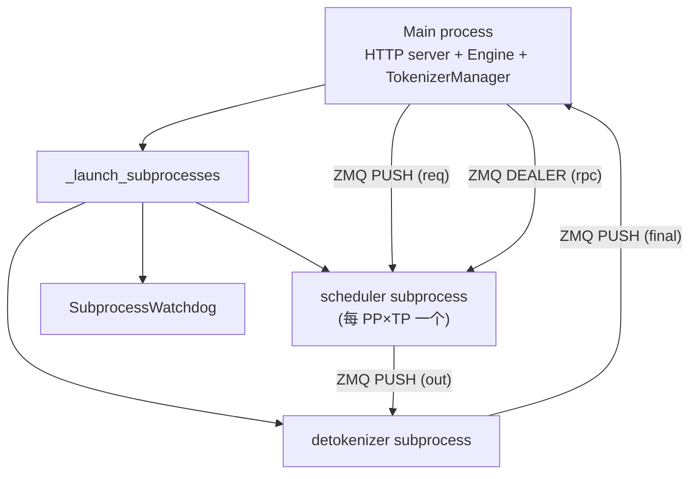

# `srt/entrypoints` — Entrypoints module

## Summary
synthesis: `srt/entrypoints` 是 SGLang 服务运行时的"**进程入口与多协议门面**"。核心是 `Engine` 类（[entrypoints/engine.py:143](d:\design\sglang\python\sglang\srt\entrypoints\engine.py)），它在 `__init__` 里 fork 出 **scheduler 子进程 + detokenizer 子进程**，自己留在主进程跑 `TokenizerManager`。HTTP / gRPC / OpenAI / Anthropic / Ollama 多 API 兼容层都在本模块下。

## Sources
- 模块目录：[d:\design\sglang\python\sglang\srt\entrypoints\](d:\design\sglang\python\sglang\srt\entrypoints)（39 .py）
- 主类：[engine.py](d:\design\sglang\python\sglang\srt\entrypoints\engine.py)（1300+ 行）
- 抽象基类：[EngineBase.py](d:\design\sglang\python\sglang\srt\entrypoints\EngineBase.py)
- HTTP server：[http_server.py](d:\design\sglang\python\sglang\srt\entrypoints\http_server.py), [http_server_engine.py](d:\design\sglang\python\sglang\srt\entrypoints\http_server_engine.py)
- gRPC server：[grpc_server.py](d:\design\sglang\python\sglang\srt\entrypoints\grpc_server.py)
- OpenAI 兼容：[openai/](d:\design\sglang\python\sglang\srt\entrypoints\openai) 含 `serving_chat.py` / `serving_completions.py` / `serving_embedding.py` / `serving_responses.py` / `serving_score.py` / `serving_rerank.py` / `serving_classify.py` / `serving_tokenize.py` / `serving_transcription.py` / `streaming_asr.py`
- Anthropic 兼容：[anthropic/](d:\design\sglang\python\sglang\srt\entrypoints\anthropic) 含 `serving.py`, `protocol.py`
- Ollama 兼容：[ollama/](d:\design\sglang\python\sglang\srt\entrypoints\ollama) 含 `serving.py`, `protocol.py`, `smart_router.py`
- bootstrap server：[engine_info_bootstrap_server.py](d:\design\sglang\python\sglang\srt\entrypoints\engine_info_bootstrap_server.py)

## 文件清单（核心）

| 文件 | 角色 |
|---|---|
| `EngineBase.py` | 抽象基类 [EngineBase.py](d:\design\sglang\python\sglang\srt\entrypoints\EngineBase.py)，定义 generate / encode / shutdown 等抽象 API |
| `engine.py` | `Engine` 类 + `init_tokenizer_manager` + `_set_envs_and_config` + `_wait_for_scheduler_ready` + `_calculate_rank_ranges` + `_compute_parallelism_ranks` 一组工厂函数 |
| `engine_score_mixin.py` | `EngineScoreMixin` (rerank / score) |
| `http_server.py` | FastAPI / uvicorn 入口 |
| `http_server_engine.py` | HTTP 层使用的 Engine 包装 |
| `grpc_server.py` | gRPC 入口 |
| `engine_info_bootstrap_server.py` | bootstrap server (transfer engine info)，被 PD 分离用 |
| `context.py` | request context 数据 |
| `tool.py` | tool 抽象 |
| `warmup.py` | server-side warmup 入口 |
| `ssl_utils.py` | TLS 工具 |
| `harmony_utils.py` | OpenAI Harmony |
| `v1_loads.py` | OpenAI v1 路由聚合 |

## `Engine` 类 — 顶层入口

来自 [entrypoints/engine.py:143-238](d:\design\sglang\python\sglang\srt\entrypoints\engine.py)：

> The engine consists of three components:
> 1. TokenizerManager: Tokenizes the requests and sends them to the scheduler.
> 2. Scheduler (subprocess): Receives requests from the Tokenizer Manager, schedules batches, forwards them, and sends the output tokens to the Detokenizer Manager.
> 3. DetokenizerManager (subprocess): Detokenizes the output tokens and sends the result back to the Tokenizer Manager.
>
> Note:
> 1. The HTTP server, Engine, and TokenizerManager all run in the main process.
> 2. Inter-process communication is done through IPC (each process uses a different port) via the ZMQ library.

注释来自 [entrypoints/engine.py:143-155](d:\design\sglang\python\sglang\srt\entrypoints\engine.py)，是 wiki 的 **权威定义**。

### `Engine.__init__` 启动序列（[engine.py:164-238](d:\design\sglang\python\sglang\srt\entrypoints\engine.py)）

1. 解析 `server_args` ([engine.py:171-181](d:\design\sglang\python\sglang\srt\entrypoints\engine.py))
2. `atexit.register(self.shutdown)` ([engine.py:188](d:\design\sglang\python\sglang\srt\entrypoints\engine.py))
3. **`_launch_subprocesses(...)`**（[engine.py:191-202, 627](d:\design\sglang\python\sglang\srt\entrypoints\engine.py)）— **fork scheduler + detokenizer + 启动 SubprocessWatchdog**
4. 接收 `tokenizer_manager`, `template_manager`, `port_args`, `scheduler_init_result`, `subprocess_watchdog` ([engine.py:191-208](d:\design\sglang\python\sglang\srt\entrypoints\engine.py))
5. 主进程创建 `send_to_rpc` ZMQ DEALER socket，仅 `node_rank==0` ([engine.py:215-222](d:\design\sglang\python\sglang\srt\entrypoints\engine.py))
6. tracing 初始化 ([engine.py:225-232](d:\design\sglang\python\sglang\srt\entrypoints\engine.py))
7. 设置 asyncio loop ([engine.py:234-238](d:\design\sglang\python\sglang\srt\entrypoints\engine.py))

### 子进程 fork：`_launch_scheduler_processes`（[engine.py:522-625](d:\design\sglang\python\sglang\srt\entrypoints\engine.py)）

按 `dp_size` 分两条路径：

- **`dp_size == 1`**（[engine.py:537-587](d:\design\sglang\python\sglang\srt\entrypoints\engine.py)）：
  - 计算 rank 范围：`_calculate_rank_ranges(nnodes, pp_size, tp_size, node_rank)` → `(pp_rank_range, tp_rank_range, pp_size_per_node, tp_size_per_node)` ([engine.py:544-551](d:\design\sglang\python\sglang\srt\entrypoints\engine.py))
  - 双层循环 `pp_rank × tp_rank`：每个组合一个 `mp.Pipe(duplex=False)` (reader/writer) + 算 `gpu_id` + 启 `mp.Process(target=run_scheduler_process_func, ...)` ([engine.py:553-587](d:\design\sglang\python\sglang\srt\entrypoints\engine.py))
  - 子进程上下文用 `memory_saver_adapter.configure_subprocess()` + `numa_utils.configure_subprocess(server_args, gpu_id)` ([engine.py:581-583](d:\design\sglang\python\sglang\srt\entrypoints\engine.py))
- **`dp_size > 1`**（[engine.py:588-602](d:\design\sglang\python\sglang\srt\entrypoints\engine.py)）：fork 一个 `DataParallelController` 进程，由它再 fork 各 DP 内的 scheduler

返回 `SchedulerInitResult`（含 `scheduler_infos`、`wait_for_ready`、`wait_for_completion` 三个 closure）+ `scheduler_procs` 列表。

> [!todo] VERIFY: ~~`_launch_subprocesses` 完整序列（在 [engine.py:628-762](d:\design\sglang\python\sglang\srt\entrypoints\engine.py)，本轮未完整读完，已知它创建 `port_args`、`tokenizer_manager`、`template_manager`、`subprocess_watchdog` 与 detokenizer 进程）。~~
>
> **RESOLVED 2026-04-19**: 完整序列为 `configure_logger` → [`_set_envs_and_config`](d:\design\sglang\python\sglang\srt\entrypoints\engine.py) → `server_args.check_server_args` → `_set_gc` → [`PortArgs.init_new`](d:\design\sglang\python\sglang\srt\entrypoints\engine.py) → 可选 [`EngineInfoBootstrapServer`](d:\design\sglang\python\sglang\srt\entrypoints\engine.py)（仅 `node_rank==0` 且开启 `remote_instance_weight_loader_start_seed_via_transfer_engine`，[engine.py:658-673](d:\design\sglang\python\sglang\srt\entrypoints\engine.py)）→ `cls._launch_scheduler_processes` → 可选 `run_expert_backup_manager`（[engine.py:683-687](d:\design\sglang\python\sglang\srt\entrypoints\engine.py)） → `node_rank>=1` 早退分支（[engine.py:689-715](d:\design\sglang\python\sglang\srt\entrypoints\engine.py)） → `mp.Process(target=run_detokenizer_process_func, ...).start()`（[engine.py:717-725](d:\design\sglang\python\sglang\srt\entrypoints\engine.py)） → `init_tokenizer_manager_func` 或 `MultiTokenizerRouter`（按 `tokenizer_worker_num`，[engine.py:728-735](d:\design\sglang\python\sglang\srt\entrypoints\engine.py)） → `scheduler_init_result.wait_for_ready()` → 写回 `max_req_input_len` → `SubprocessWatchdog(processes=[*scheduler_procs, detoken_proc], ...).start()`（[engine.py:745-754](d:\design\sglang\python\sglang\srt\entrypoints\engine.py)）。

### `Engine` 主要 API

| 方法 | 行号 | 说明 |
|---|---|---|
| `generate(...)` | [271-440](d:\design\sglang\python\sglang\srt\entrypoints\engine.py) | 文本生成 |
| `encode(...)` | [441-507](d:\design\sglang\python\sglang\srt\entrypoints\engine.py) | embedding |
| `rerank(...)` | [508-521](d:\design\sglang\python\sglang\srt\entrypoints\engine.py) | rerank |
| `shutdown()` | [764-772](d:\design\sglang\python\sglang\srt\entrypoints\engine.py) | 关 subprocess |
| `flush_cache()` | [780-782](d:\design\sglang\python\sglang\srt\entrypoints\engine.py) | 清 KV cache |
| `open_session(...)` / `close_session(session_id)` | [783-821](d:\design\sglang\python\sglang\srt\entrypoints\engine.py) | session 管理 |
| `start_profile / stop_profile` | [822-827](d:\design\sglang\python\sglang\srt\entrypoints\engine.py) | profiling |
| `start_expert_distribution_record / stop / dump` | [828-842](d:\design\sglang\python\sglang\srt\entrypoints\engine.py) | EPLB 分布统计 |
| `init/destroy_weights_update_group` | [854-887](d:\design\sglang\python\sglang\srt\entrypoints\engine.py) | RLHF 权重更新 group |
| `update_weights_from_distributed/tensor/disk/ipc` | [888-967](d:\design\sglang\python\sglang\srt\entrypoints\engine.py) | RLHF 权重更新 |
| `get_weights_by_name(name, truncate_size)` | [968-974](d:\design\sglang\python\sglang\srt\entrypoints\engine.py) | 取权重快照 |
| `load_lora_adapter / unload_lora_adapter / load_lora_adapter_from_tensors` | [975-1047](d:\design\sglang\python\sglang\srt\entrypoints\engine.py) | LoRA 管理 |
| `release_memory_occupation / resume_memory_occupation` | [1048-1059](d:\design\sglang\python\sglang\srt\entrypoints\engine.py) | sleep / wake 模式 |
| `freeze_gc()` | [1060-1078](d:\design\sglang\python\sglang\srt\entrypoints\engine.py) | 冻 GC |
| `collective_rpc(method, **kwargs)` | [1079-1085](d:\design\sglang\python\sglang\srt\entrypoints\engine.py) | 通用 RPC |
| `save_remote_model / save_sharded_model` | [1086-1093](d:\design\sglang\python\sglang\srt\entrypoints\engine.py) | 保存 |

## OpenAI / Anthropic / Ollama 兼容层

`entrypoints/openai/` 下 9 个 `serving_*.py` 文件分别实现：

| 协议端点 | 文件 |
|---|---|
| `/v1/chat/completions` | [serving_chat.py](d:\design\sglang\python\sglang\srt\entrypoints\openai\serving_chat.py) |
| `/v1/completions` | [serving_completions.py](d:\design\sglang\python\sglang\srt\entrypoints\openai\serving_completions.py) |
| `/v1/embeddings` | [serving_embedding.py](d:\design\sglang\python\sglang\srt\entrypoints\openai\serving_embedding.py) |
| `/v1/responses` | [serving_responses.py](d:\design\sglang\python\sglang\srt\entrypoints\openai\serving_responses.py) |
| `/v1/score`（generative） | [serving_score.py](d:\design\sglang\python\sglang\srt\entrypoints\openai\serving_score.py) |
| `/v1/rerank` | [serving_rerank.py](d:\design\sglang\python\sglang\srt\entrypoints\openai\serving_rerank.py) |
| `/v1/classify` | [serving_classify.py](d:\design\sglang\python\sglang\srt\entrypoints\openai\serving_classify.py) |
| `/v1/tokenize` | [serving_tokenize.py](d:\design\sglang\python\sglang\srt\entrypoints\openai\serving_tokenize.py) |
| `/v1/audio/transcriptions` | [serving_transcription.py](d:\design\sglang\python\sglang\srt\entrypoints\openai\serving_transcription.py)，含 [streaming_asr.py](d:\design\sglang\python\sglang\srt\entrypoints\openai\streaming_asr.py) |
| transcription 适配 | [transcription_adapters/whisper.py](d:\design\sglang\python\sglang\srt\entrypoints\openai\transcription_adapters\whisper.py), [qwen3_asr.py](d:\design\sglang\python\sglang\srt\entrypoints\openai\transcription_adapters\qwen3_asr.py) |
| 工具调用 | [tool_server.py](d:\design\sglang\python\sglang\srt\entrypoints\openai\tool_server.py) |

`entrypoints/anthropic/` 与 `entrypoints/ollama/` 是另两套 API 兼容层。

## 启动入口拓扑

## See also
- [modules/managers.md](managers.md)
- [entities/TokenizerManager.md](../entities/TokenizerManager.md)
- [entities/Scheduler.md](../entities/Scheduler.md)
- [topics/manager-pipeline.md](../topics/manager-pipeline.md)
- [topics/request-lifecycle.md](../topics/request-lifecycle.md)
