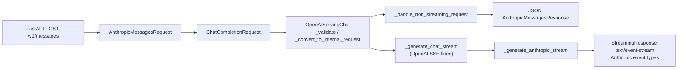

# `srt/entrypoints/anthropic` — Anthropic Messages API 兼容层

## Summary

本模块实现 **Anthropic Messages API** 的 Pydantic 协议模型，以及 [`AnthropicServing`](d:\design\sglang\python\sglang\srt\entrypoints\anthropic\serving.py)：将 [`AnthropicMessagesRequest`](d:\design\sglang\python\sglang\srt\entrypoints\anthropic\protocol.py) 转为 OpenAI 的 [`ChatCompletionRequest`](d:\design\sglang\python\sglang\srt\entrypoints\openai\protocol.py)，再委托 [`OpenAIServingChat`](d:\design\sglang\python\sglang\srt\entrypoints\openai\serving_chat.py) 的内部路径（校验、`_convert_to_internal_request`、非流式 `_handle_non_streaming_request` 或流式 `_generate_chat_stream`），最后把结果转回 Anthropic 的 JSON 或 **Anthropic 形态的 SSE**。

> [!warning] CONTRADICTION: ~~既有 wiki 推断 3 .py，subagent Glob 实测 **2 .py**（无 `__init__.py`）：[`serving.py`](d:\design\sglang\python\sglang\srt\entrypoints\anthropic\serving.py) + [`protocol.py`](d:\design\sglang\python\sglang\srt\entrypoints\anthropic\protocol.py)。~~
>
> **RESOLVED 2026-04-19**: 复核 Glob 实测仍为 **2 .py**（[`serving.py`](d:\design\sglang\python\sglang\srt\entrypoints\anthropic\serving.py) + [`protocol.py`](d:\design\sglang\python\sglang\srt\entrypoints\anthropic\protocol.py)），无 `anthropic/__init__.py`，与既有 wiki 旧推断的 3 .py 不一致；以源码 Glob 为准（[d:\design\sglang\python\sglang\srt\entrypoints\anthropic\](d:\design\sglang\python\sglang\srt\entrypoints\anthropic)）。

## Sources

| 文件 | 作用 |
|------|------|
| [serving.py](d:\design\sglang\python\sglang\srt\entrypoints\anthropic\serving.py) | `AnthropicServing`：请求/响应/流式转换与 `count_tokens` |
| [protocol.py](d:\design\sglang\python\sglang\srt\entrypoints\anthropic\protocol.py) | `AnthropicMessagesRequest`、`AnthropicContentBlock`、流式 `AnthropicStreamEvent` 等 |
| [http_server.py](d:\design\sglang\python\sglang\srt\entrypoints\http_server.py) | 路由注册与 `AnthropicServing` 构造（注入 `openai_serving_chat`） |

## Architecture / Data flow

- 入口：[`handle_messages`](d:\design\sglang\python\sglang\srt\entrypoints\anthropic\serving.py) 调用 [`_convert_to_chat_completion_request`](d:\design\sglang\python\sglang\srt\entrypoints\anthropic\serving.py)，再分支流式/非流式（[L85-88](d:\design\sglang\python\sglang\srt\entrypoints\anthropic\serving.py)）。
- 非流式：[`_handle_non_streaming`](d:\design\sglang\python\sglang\srt\entrypoints\anthropic\serving.py) 使用 `OpenAIServingChat._validate_request`、`_convert_to_internal_request`、`_handle_non_streaming_request`（[L320-344](d:\design\sglang\python\sglang\srt\entrypoints\anthropic\serving.py)），再 [`_convert_response`](d:\design\sglang\python\sglang\srt\entrypoints\anthropic\serving.py)。
- 流式：[`_handle_streaming`](d:\design\sglang\python\sglang\srt\entrypoints\anthropic\serving.py) 返回 `StreamingResponse`，body 来自 [`_generate_anthropic_stream`](d:\design\sglang\python\sglang\srt\entrypoints\anthropic\serving.py)；内部消费 OpenAI 侧 `_generate_chat_stream` 产出的 **SSE 行**（解析 `data: ` 后为 JSON，校验为 `ChatCompletionStreamResponse`，[L437-496](d:\design\sglang\python\sglang\srt\entrypoints\anthropic\serving.py)），再按 Anthropic 事件类型写出（[L54-56](d:\design\sglang\python\sglang\srt\entrypoints\anthropic\serving.py) `_wrap_sse_event`）。
- 中止：流式 `StreamingResponse` 的 `background` 使用 `tokenizer_manager.create_abort_task`（[L411-413](d:\design\sglang\python\sglang\srt\entrypoints\anthropic\serving.py)）。

## File inventory

| 路径 | 行数（约） | 说明 |
|------|----------|------|
| [protocol.py](d:\design\sglang\python\sglang\srt\entrypoints\anthropic\protocol.py) | 179 | 协议模型 |
| [serving.py](d:\design\sglang\python\sglang\srt\entrypoints\anthropic\serving.py) | 764 | 转换与处理 |

## Key APIs / Entities

| 名称 | 位置 | 作用 |
|------|------|------|
| `AnthropicServing` | [serving.py:59](d:\design\sglang\python\sglang\srt\entrypoints\anthropic\serving.py) | 主处理类；构造注入 `OpenAIServingChat`（[L66-67](d:\design\sglang\python\sglang\srt\entrypoints\anthropic\serving.py)） |
| `STOP_REASON_MAP` | [serving.py:47-51](d:\design\sglang\python\sglang\srt\entrypoints\anthropic\serving.py) | OpenAI `finish_reason` → Anthropic `stop_reason` |
| `AnthropicMessagesRequest` | [protocol.py:100-114](d:\design\sglang\python\sglang\srt\entrypoints\anthropic\protocol.py) | 请求体模型 |
| `AnthropicStreamEvent` / `AnthropicDelta` | [protocol.py:131-163](d:\design\sglang\python\sglang\srt\entrypoints\anthropic\protocol.py) | 流式事件与 delta |
| `handle_count_tokens` | [serving.py:708](d:\design\sglang\python\sglang\srt\entrypoints\anthropic\serving.py) | `/v1/messages/count_tokens` |

## Tool / streaming 翻译要点

**请求侧（Anthropic → OpenAI）**（[serving.py:177-307](d:\design\sglang\python\sglang\srt\entrypoints\anthropic\serving.py)）：

- `tool_use` → OpenAI `tool_calls`（含 `function.name` 与 `arguments` JSON 字符串）（[L199-208](d:\design\sglang\python\sglang\srt\entrypoints\anthropic\serving.py)）。
- `tool_result`：用户消息时拆成 OpenAI `role: tool` 消息（[L218-225](d:\design\sglang\python\sglang\srt\entrypoints\anthropic\serving.py)）；非用户角色时退化为文本 `Tool result: ...`（[L227-232](d:\design\sglang\python\sglang\srt\entrypoints\anthropic\serving.py)）。
- `tools` → OpenAI `Tool(type=function, ...)`（[L274-287](d:\design\sglang\python\sglang\srt\entrypoints\anthropic\serving.py)）；`tool_choice`：`any` → `required`（[L295-296](d:\design\sglang\python\sglang\srt\entrypoints\anthropic\serving.py)）。
- 流式时设置 `stream_options=StreamOptions(include_usage=True)`（[L267-269](d:\design\sglang\python\sglang\srt\entrypoints\anthropic\serving.py)）。

**响应侧（OpenAI → Anthropic）**：

- 非流式：[`_convert_response`](d:\design\sglang\python\sglang\srt\entrypoints\anthropic\serving.py) 将文本与 `tool_calls` 转为 `AnthropicContentBlock`（[L656-677](d:\design\sglang\python\sglang\srt\entrypoints\anthropic\serving.py)）。
- 流式：首个 chunk 发 `message_start`（[L498-518](d:\design\sglang\python\sglang\srt\entrypoints\anthropic\serving.py)）；文本用 `content_block_start` + `content_block_delta`（`text_delta`）（[L612-638](d:\design\sglang\python\sglang\srt\entrypoints\anthropic\serving.py)）；工具流用 `content_block_start`（`tool_use`）与 `input_json_delta`（[L544-609](d:\design\sglang\python\sglang\srt\entrypoints\anthropic\serving.py)）；`[DONE]` 后 `message_delta`（usage + stop_reason）与 `message_stop`（[L443-479](d:\design\sglang\python\sglang\srt\entrypoints\anthropic\serving.py)）。

## CLI / 配置

- **HTTP 路由**：固定 `/v1/messages` 与 `/v1/messages/count_tokens`（[http_server.py:1743-1760](d:\design\sglang\python\sglang\srt\entrypoints\http_server.py)），未见 `--anthropic-*` 形式的服务端开关与上述路径绑定。

## §跨子系统检索

| 类别 | 结果 |
|------|------|
| **sgl-kernel** | `anthropic/` 内 **0** 处匹配 |
| **Import `from sglang.srt.entrypoints.anthropic`** | 仅 [http_server.py:64-68](d:\design\sglang\python\sglang\srt\entrypoints\http_server.py)、[test_anthropic_server.py:22-23](d:\design\sglang\test\registered\unit\entrypoints\anthropic\test_serving.py) |
| **`http_server` 路由** | [`/v1/messages`](d:\design\sglang\python\sglang\srt\entrypoints\http_server.py)、[`/v1/messages/count_tokens`](d:\design\sglang\python\sglang\srt\entrypoints\http_server.py) |
| **CLI `--anthropic-*`** | `python/sglang` 下 **未** 发现服务端 argparse 的 `--anthropic-*`；[`scripts/ci_monitor/ci_auto_bisect.py`](d:\design\sglang\scripts\ci_monitor\ci_auto_bisect.py) 含 `--anthropic-api-key`（CI 工具） |
| **Tests** | [test/registered/openai_server/basic/test_anthropic_server.py](d:\design\sglang\test\registered\unit\entrypoints\anthropic\test_serving.py)、[test/registered/openai_server/function_call/test_anthropic_tool_use.py](d:\design\sglang\test\registered\openai_server\function_call\test_anthropic_tool_use.py)、[test/manual/vlm/test_anthropic_vision.py](d:\design\sglang\test\manual\vlm\test_anthropic_vision.py) |
| **Docs** | `docs/` 下 **未** 检索到 dedicated 的 Anthropic HTTP `/v1/messages` 说明 |

## Notes / Caveats

- **与「`handle_request` 单入口」表述的差异**：实际调用链见上文；若对外文档写 `handle_request`，属于 **synthesis 与源码不一致**，应改为上述私有方法名。
- **流式协议**：上游为 OpenAI 风格 SSE chunk；下游为 Anthropic `event:` + `data:`。

## See also

- [entrypoints_openai.md](entrypoints_openai.md)
- [entrypoints.md](entrypoints.md)
- [openai/serving_chat.py](d:\design\sglang\python\sglang\srt\entrypoints\openai\serving_chat.py)
