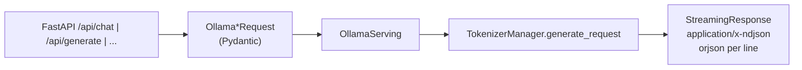

# `srt/entrypoints/ollama` — Ollama 兼容 API（独立 protocol）

## Summary

[`OllamaServing`](d:\design\sglang\python\sglang\srt\entrypoints\ollama\serving.py) 直接持有 [`TokenizerManager`](d:\design\sglang\python\sglang\srt\managers\tokenizer_manager.py)（见 [http_server.py:346](d:\design\sglang\python\sglang\srt\entrypoints\http_server.py)），通过 [`GenerateReqInput`](d:\design\sglang\python\sglang\srt\managers\io_struct.py) 与 `tokenizer_manager.generate_request` 完成 `/api/chat` 与 `/api/generate`；**不** import `openai.serving_*` 或 `OpenAIServingChat`（[serving.py](d:\design\sglang\python\sglang\srt\entrypoints\ollama\serving.py) 全文检索无匹配）。`smart_router.py` 是 **客户端侧** 路由示例，依赖 `pip install ollama` 的 `ollama.Client`，与 `OllamaServing` 无运行时耦合。

## Sources

| 文件 | 作用 |
|------|------|
| [protocol.py](d:\design\sglang\python\sglang\srt\entrypoints\ollama\protocol.py) | `OllamaChatRequest`、`OllamaGenerateRequest`、`OllamaShowResponse` 等 |
| [serving.py](d:\design\sglang\python\sglang\srt\entrypoints\ollama\serving.py) | `OllamaServing` |
| [smart_router.py](d:\design\sglang\python\sglang\srt\entrypoints\ollama\smart_router.py) | `SmartRouter`（可选客户端工具） |
| [http_server.py](d:\design\sglang\python\sglang\srt\entrypoints\http_server.py) | 路由与环境变量前缀 `SGLANG_OLLAMA_*` |

## Architecture / Data flow

- Chat：[`handle_chat`](d:\design\sglang\python\sglang\srt\entrypoints\ollama\serving.py:68) 用 `apply_chat_template` 得到 `prompt_ids`，组装 `GenerateReqInput(input_ids=..., stream=...)`（[L74-94](d:\design\sglang\python\sglang\srt\entrypoints\ollama\serving.py)）。
- Generate：[`handle_generate`](d:\design\sglang\python\sglang\srt\entrypoints\ollama\serving.py:173) 拼接 `system`+`prompt`，`GenerateReqInput(text=...)`（[L207-212](d:\design\sglang\python\sglang\srt\entrypoints\ollama\serving.py)）；空 prompt 早退（[L184-202](d:\design\sglang\python\sglang\srt\entrypoints\ollama\serving.py)）。

## File inventory（4 文件）

| 文件 | 说明 |
|------|------|
| [protocol.py](d:\design\sglang\python\sglang\srt\entrypoints\ollama\protocol.py) | Ollama API 形状（注释指向 upstream API 文档）[L4-6](d:\design\sglang\python\sglang\srt\entrypoints\ollama\protocol.py) |
| [serving.py](d:\design\sglang\python\sglang\srt\entrypoints\ollama\serving.py) | 核心 serving |
| [smart_router.py](d:\design\sglang\python\sglang\srt\entrypoints\ollama\smart_router.py) | LLM judge 在本地/远端 Ollama 协议主机间分流 |
| [__init__.py](d:\design\sglang\python\sglang\srt\entrypoints\ollama\__init__.py) | 仅注释「Ollama-compatible API for SGLang」 |

## Key APIs / Entities

| 名称 | 位置 | 作用 |
|------|------|------|
| `OllamaServing` | [serving.py:31](d:\design\sglang\python\sglang\srt\entrypoints\ollama\serving.py) | `__init__(tokenizer_manager)`（[L34-35](d:\design\sglang\python\sglang\srt\entrypoints\ollama\serving.py)） |
| `_convert_options_to_sampling_params` | [serving.py:41](d:\design\sglang\python\sglang\srt\entrypoints\ollama\serving.py) | Ollama `options` → SGLang sampling；默认 `max_new_tokens` 2048（[L62-64](d:\design\sglang\python\sglang\srt\entrypoints\ollama\serving.py)） |
| `get_tags` / `get_show` | [serving.py:289](d:\design\sglang\python\sglang\srt\entrypoints\ollama\serving.py)、[L310](d:\design\sglang\python\sglang\srt\entrypoints\ollama\serving.py) | 列出模型与展示信息（占位 digest、`model_config.context_len` 等） |
| `SmartRouter` | [smart_router.py:23](d:\design\sglang\python\sglang\srt\entrypoints\ollama\smart_router.py) | 独立客户端，不是 server 插件 |

## protocol.py 要点

- Chat：`OllamaChatRequest` 含 `model`, `messages`, `stream`, `options` 等（[L21-30](d:\design\sglang\python\sglang\srt\entrypoints\ollama\protocol.py)）。
- Generate：`OllamaGenerateRequest`（[L59-74](d:\design\sglang\python\sglang\srt\entrypoints\ollama\protocol.py)）。
- Show：`OllamaShowRequest` / `OllamaShowResponse`（[L121-137](d:\design\sglang\python\sglang\srt\entrypoints\ollama\protocol.py)）。

## NDJSON 流式与 OpenAI token 流差异

- 本实现流式 **`media_type="application/x-ndjson"`**，每行 `orjson.dumps(...) + b"\n"`（[L168-171](d:\design\sglang\python\sglang\srt\entrypoints\ollama\serving.py) chat、[L284-287](d:\design\sglang\python\sglang\srt\entrypoints\ollama\serving.py) generate）。
- **增量语义**：通过维护 `previous_text` 与当前完整 `text` 做后缀切片得到 `delta`（[L137-147](d:\design\sglang\python\sglang\srt\entrypoints\ollama\serving.py)），与 OpenAI SSE 中「每 chunk 仅含新增 token 文本」的字段形状不同。
- 结束 chunk：`done=True` 时 chat 侧 `message.content` 为空字符串（[L151-157](d:\design\sglang\python\sglang\srt\entrypoints\ollama\serving.py)）；generate 侧 `response=""`（[L266-272](d:\design\sglang\python\sglang\srt\entrypoints\ollama\serving.py)）。

## HTTP 路由

[http_server.py:1714-1737](d:\design\sglang\python\sglang\srt\entrypoints\http_server.py) 仅注册：

- `POST /api/chat`（env 覆盖 `SGLANG_OLLAMA_CHAT_ROUTE`）
- `POST /api/generate`（`SGLANG_OLLAMA_GENERATE_ROUTE`）
- `GET /api/tags`（`SGLANG_OLLAMA_TAGS_ROUTE`）
- `POST /api/show`（`SGLANG_OLLAMA_SHOW_ROUTE`）
- 可选根路径：若设置 `SGLANG_OLLAMA_ROOT_ROUTE`，在该路径上注册 GET/HEAD 返回 `"Ollama is running"`（[L1696-1703](d:\design\sglang\python\sglang\srt\entrypoints\http_server.py)）；否则根路径 `/` 为 **「SGLang is running」**（[L1707-1711](d:\design\sglang\python\sglang\srt\entrypoints\http_server.py)）

> [!warning] CONTRADICTION: ~~**未**在 `http_server.py` 中发现 `/api/version` 或 `/api/pull` 的路由注册，与既有 wiki 推断不一致。~~
>
> **RESOLVED 2026-04-19**: 复核 grep `http_server.py` 全文 `api/version|api/pull|api/embed|api/ps|api/copy|api/delete|api/create` 全部 **0 命中**；仅注册 `/api/chat`（[L1714](d:\design\sglang\python\sglang\srt\entrypoints\http_server.py)）、`/api/generate`（[L1720](d:\design\sglang\python\sglang\srt\entrypoints\http_server.py)）、`/api/tags`（[L1728](d:\design\sglang\python\sglang\srt\entrypoints\http_server.py)）、`/api/show`（[L1734](d:\design\sglang\python\sglang\srt\entrypoints\http_server.py)）。旧推断已被否证。

## §跨子系统检索

| 类别 | 结果 |
|------|------|
| **sgl-kernel** | `ollama/` 内 **0** 处 |
| **Import `from sglang.srt.entrypoints.ollama`** | [http_server.py:75-80](d:\design\sglang\python\sglang\srt\entrypoints\http_server.py)、[smart_router.py docstring](d:\design\sglang\python\sglang\srt\entrypoints\ollama\smart_router.py) |
| **路由** | 见上节；环境变量前缀 `SGLANG_OLLAMA_*` |
| **CLI** | 无 `--ollama-*` 专用参数；路由可通过 **环境变量** 改写 |
| **Tests** | 全仓库 `ollama` (case-insensitive) 文件名 grep **0 命中**于 `d:\design\sglang\test\`；仅 `python/sglang/srt/entrypoints/ollama/`、`docs/basic_usage/ollama_api.md`、`docs/index.rst` 含相关文本（**RESOLVED 2026-04-19**：确无注册测试） |
| **Docs** | [docs/basic_usage/ollama_api.md](d:\design\sglang\docs\basic_usage\ollama_api.md)；[ollama/README.md](d:\design\sglang\python\sglang\srt\entrypoints\ollama\README.md)（文档内链） |

## Notes / Caveats

- **独立性**：`ollama/serving.py` 仅依赖 `protocol`、`GenerateReqInput`、`TokenizerManager` 路径；**确认**无 OpenAI serving import。
- **根路径行为**：默认 `/` 非 Ollama 字符串，与 [ollama_api.md](d:\design\sglang\docs\basic_usage\ollama_api.md) 表格中「`/` Health check for Ollama CLI」并存时，应核对客户端是否依赖响应正文。

## See also

- [docs/basic_usage/ollama_api.md](d:\design\sglang\docs\basic_usage\ollama_api.md)
- [entrypoints_openai.md](entrypoints_openai.md)（对比：OpenAI 走 `OpenAIServingChat`，Ollama 直连 `TokenizerManager`）
- [entrypoints.md](entrypoints.md)
