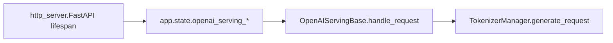

# `srt/entrypoints/openai` — OpenAI 兼容 HTTP 协议与 Serving 层

## Summary

本目录实现 **OpenAI 风格的 Pydantic 协议**（[`protocol.py`](d:\design\sglang\python\sglang\srt\entrypoints\openai\protocol.py)）与 **按端点拆分的 `OpenAIServing*` 处理器**；统一入口为 [`OpenAIServingBase.handle_request`](d:\design\sglang\python\sglang\srt\entrypoints\openai\serving_base.py)，由上层 [`http_server.py`](d:\design\sglang\python\sglang\srt\entrypoints\http_server.py) 在 `lifespan` 中实例化并挂到 `app.state`。**HTTP 路由与进程入口在 `http_server.py`，不在本目录。** Anthropic 兼容层通过 [`AnthropicServing`](d:\design\sglang\python\sglang\srt\entrypoints\anthropic\serving.py) 将请求转为 `ChatCompletionRequest` 后复用 [`OpenAIServingChat`](d:\design\sglang\python\sglang\srt\entrypoints\openai\serving_chat.py)；Ollama 层 [`OllamaServing`](d:\design\sglang\python\sglang\srt\entrypoints\ollama\serving.py) **不** import 本目录，直接走 `TokenizerManager` 与 Ollama 自有 protocol。

> [!todo] VERIFY: ~~既有 wiki / 索引推断本目录 21 .py，subagent Glob 实测 **20 .py**（无包根 `__init__.py`）。以源码 Glob 为准。~~
>
> **RESOLVED 2026-04-19**: 复核 Glob 实测 **20 .py**（16 在 `openai/` 根 + 4 在 `transcription_adapters/`，包括 `transcription_adapters/__init__.py`），`openai/` 根目录确无 `__init__.py`（[d:\design\sglang\python\sglang\srt\entrypoints\openai\](d:\design\sglang\python\sglang\srt\entrypoints\openai)）。

## Sources

| 区域 | 锚点 |
|---|---|
| FastAPI 装配与 `/v1/*` 路由 | [`http_server.py:286-375`](d:\design\sglang\python\sglang\srt\entrypoints\http_server.py)、[`http_server.py:1462-1691`](d:\design\sglang\python\sglang\srt\entrypoints\http_server.py) |
| 抽象 serving 与 `handle_request` | [`serving_base.py:26-133`](d:\design\sglang\python\sglang\srt\entrypoints\openai\serving_base.py) |
| 协议模型与 `OpenAIServingRequest` 联合类型 | [`protocol.py:53-1513`](d:\design\sglang\python\sglang\srt\entrypoints\openai\protocol.py)、[`protocol.py:1126-1135`](d:\design\sglang\python\sglang\srt\entrypoints\openai\protocol.py) |
| Chat / tool / reasoning | [`serving_chat.py:89-130`](d:\design\sglang\python\sglang\srt\entrypoints\openai\serving_chat.py)、[`serving_chat.py:344-375`](d:\design\sglang\python\sglang\srt\entrypoints\openai\serving_chat.py)、[`serving_chat.py:987-1018`](d:\design\sglang\python\sglang\srt\entrypoints\openai\serving_chat.py) |
| Completions | [`serving_completions.py:42-100`](d:\design\sglang\python\sglang\srt\entrypoints\openai\serving_completions.py) |
| Responses API | [`serving_responses.py:1-100`](d:\design\sglang\python\sglang\srt\entrypoints\openai\serving_responses.py) |
| Embeddings 响应拼装 | [`serving_embedding.py:186-209`](d:\design\sglang\python\sglang\srt\entrypoints\openai\serving_embedding.py) |
| MCP / Demo tool server | [`tool_server.py:1-176`](d:\design\sglang\python\sglang\srt\entrypoints\openai\tool_server.py) |
| CLI | [`server_args.py:431-441`](d:\design\sglang\python\sglang\srt\server_args.py)、[`server_args.py:4763-4832`](d:\design\sglang\python\sglang\srt\server_args.py) |
| Anthropic 桥接 | [`anthropic/serving.py:1-92`](d:\design\sglang\python\sglang\srt\entrypoints\anthropic\serving.py) |

## Architecture / Data flow

- **装配**：[`lifespan`](d:\design\sglang\python\sglang\srt\entrypoints\http_server.py) 创建 [`OpenAIServingCompletion`](d:\design\sglang\python\sglang\srt\entrypoints\openai\serving_completions.py)、[`OpenAIServingChat`](d:\design\sglang\python\sglang\srt\entrypoints\openai\serving_chat.py)、[`OpenAIServingEmbedding`](d:\design\sglang\python\sglang\srt\entrypoints\openai\serving_embedding.py) 等并写入 `fast_api_app.state`（[`http_server.py:316-343`](d:\design\sglang\python\sglang\srt\entrypoints\http_server.py)）；[`OpenAIServingResponses`](d:\design\sglang\python\sglang\srt\entrypoints\openai\serving_responses.py) 在 try 块中可选初始化（[`http_server.py:365-378`](d:\design\sglang\python\sglang\srt\entrypoints\http_server.py)）。
- **统一处理模板**：[`OpenAIServingBase.handle_request`](d:\design\sglang\python\sglang\srt\entrypoints\openai\serving_base.py) 顺序为：`_validate_request` → `_convert_to_internal_request` → 若 `stream` 则 `_handle_streaming_request` 否则 `_handle_non_streaming_request`（[`serving_base.py:73-109`](d:\design\sglang\python\sglang\srt\entrypoints\openai\serving_base.py)）。
- **路由到 handler**：例如 `/v1/chat/completions` 调用 `openai_serving_chat.handle_request`（[`http_server.py:1473-1480`](d:\design\sglang\python\sglang\srt\entrypoints\http_server.py)）；`/v1/responses` **不**走 `handle_request`，而是 `ResponsesRequest(**request)` 后 `create_responses`（[`http_server.py:1648-1665`](d:\design\sglang\python\sglang\srt\entrypoints\http_server.py)）。

## File inventory（**20** `.py`，无包根 `__init__.py`）

| 文件 | 角色 |
|---|---|
| [`serving_base.py`](d:\design\sglang\python\sglang\srt\entrypoints\openai\serving_base.py) | 抽象基类 `OpenAIServingBase`：`handle_request`、错误响应、LoRA `model:adapter` 解析等 |
| [`protocol.py`](d:\design\sglang\python\sglang\srt\entrypoints\openai\protocol.py) | OpenAI 兼容 Pydantic 模型、`OpenAIServingRequest` 联合类型 |
| [`serving_chat.py`](d:\design\sglang\python\sglang\srt\entrypoints\openai\serving_chat.py) | `OpenAIServingChat`：chat completions、tool/reasoning 集成 |
| [`serving_completions.py`](d:\design\sglang\python\sglang\srt\entrypoints\openai\serving_completions.py) | `OpenAIServingCompletion`：legacy completions |
| [`serving_responses.py`](d:\design\sglang\python\sglang\srt\entrypoints\openai\serving_responses.py) | `OpenAIServingResponses`：扩展 `OpenAIServingChat`，Responses API |
| [`serving_embedding.py`](d:\design\sglang\python\sglang\srt\entrypoints\openai\serving_embedding.py) | `OpenAIServingEmbedding` |
| [`serving_score.py`](d:\design\sglang\python\sglang\srt\entrypoints\openai\serving_score.py) | `OpenAIServingScore` |
| [`serving_rerank.py`](d:\design\sglang\python\sglang\srt\entrypoints\openai\serving_rerank.py) | `OpenAIServingRerank` |
| [`serving_classify.py`](d:\design\sglang\python\sglang\srt\entrypoints\openai\serving_classify.py) | `OpenAIServingClassify` |
| [`serving_tokenize.py`](d:\design\sglang\python\sglang\srt\entrypoints\openai\serving_tokenize.py) | `OpenAIServingTokenize` / `OpenAIServingDetokenize` |
| [`serving_transcription.py`](d:\design\sglang\python\sglang\srt\entrypoints\openai\serving_transcription.py) + [`streaming_asr.py`](d:\design\sglang\python\sglang\srt\entrypoints\openai\streaming_asr.py) | 语音转写与流式 |
| [`transcription_adapters/*`](d:\design\sglang\python\sglang\srt\entrypoints\openai\transcription_adapters) | Whisper / Qwen3 ASR 适配 |
| [`tool_server.py`](d:\design\sglang\python\sglang\srt\entrypoints\openai\tool_server.py) | `ToolServer` / `MCPToolServer` / `DemoToolServer` |
| [`utils.py`](d:\design\sglang\python\sglang\srt\entrypoints\openai\utils.py)、[`usage_processor.py`](d:\design\sglang\python\sglang\srt\entrypoints\openai\usage_processor.py) | 日志概率、usage 等辅助 |
| [`encoding_dsv32.py`](d:\design\sglang\python\sglang\srt\entrypoints\openai\encoding_dsv32.py) | DeepSeek V3.2 消息编码 |

## `OpenAIServing*` 类矩阵

| 类 | 基类 | 锚点 |
|---|---|---|
| `OpenAIServingBase` | `ABC` | [`serving_base.py:26`](d:\design\sglang\python\sglang\srt\entrypoints\openai\serving_base.py) |
| `OpenAIServingChat` | `OpenAIServingBase` | [`serving_chat.py:89`](d:\design\sglang\python\sglang\srt\entrypoints\openai\serving_chat.py) |
| `OpenAIServingCompletion` | `OpenAIServingBase` | [`serving_completions.py:42`](d:\design\sglang\python\sglang\srt\entrypoints\openai\serving_completions.py) |
| `OpenAIServingResponses` | `OpenAIServingChat` | [`serving_responses.py:70`](d:\design\sglang\python\sglang\srt\entrypoints\openai\serving_responses.py) |
| `OpenAIServingEmbedding` | `OpenAIServingBase` | [`serving_embedding.py:26`](d:\design\sglang\python\sglang\srt\entrypoints\openai\serving_embedding.py) |
| `OpenAIServingScore` | `OpenAIServingBase` | [`serving_score.py:19`](d:\design\sglang\python\sglang\srt\entrypoints\openai\serving_score.py) |
| `OpenAIServingRerank` | `OpenAIServingBase` | [`serving_rerank.py:202`](d:\design\sglang\python\sglang\srt\entrypoints\openai\serving_rerank.py) |
| `OpenAIServingClassify` | `OpenAIServingBase` | [`serving_classify.py:28`](d:\design\sglang\python\sglang\srt\entrypoints\openai\serving_classify.py) |
| `OpenAIServingTokenize` / `OpenAIServingDetokenize` | `OpenAIServingBase` | [`serving_tokenize.py:19`](d:\design\sglang\python\sglang\srt\entrypoints\openai\serving_tokenize.py)、[`serving_tokenize.py:73`](d:\design\sglang\python\sglang\srt\entrypoints\openai\serving_tokenize.py) |
| `OpenAIServingTranscription` | `OpenAIServingBase` | [`serving_transcription.py:59`](d:\design\sglang\python\sglang\srt\entrypoints\openai\serving_transcription.py) |

> synthesis: 命名上常见误称「`OpenAIServing`」——源码基类为 **`OpenAIServingBase`**，无单独 `OpenAIServing` 类。

## Endpoints（由 `http_server` 绑定）

| HTTP | Handler / 方法 | 锚点 |
|---|---|---|
| `POST /v1/completions` | `OpenAIServingCompletion.handle_request` | [`http_server.py:1465-1470`](d:\design\sglang\python\sglang\srt\entrypoints\http_server.py) |
| `POST /v1/chat/completions` | `OpenAIServingChat.handle_request` | [`http_server.py:1473-1480`](d:\design\sglang\python\sglang\srt\entrypoints\http_server.py) |
| `POST /v1/embeddings` | `OpenAIServingEmbedding.handle_request` | [`http_server.py:1483-1492`](d:\design\sglang\python\sglang\srt\entrypoints\http_server.py) |
| `POST /v1/classify` | `OpenAIServingClassify.handle_request` | [`http_server.py:1495-1504`](d:\design\sglang\python\sglang\srt\entrypoints\http_server.py) |
| `POST /v1/tokenize`、`/tokenize` | `OpenAIServingTokenize.handle_request` | [`http_server.py:1507-1522`](d:\design\sglang\python\sglang\srt\entrypoints\http_server.py) |
| `POST /v1/detokenize`、`/detokenize` | `OpenAIServingDetokenize.handle_request` | [`http_server.py:1525-1540`](d:\design\sglang\python\sglang\srt\entrypoints\http_server.py) |
| `POST /v1/audio/transcriptions` | `OpenAIServingTranscription` | [`http_server.py:1543+`](d:\design\sglang\python\sglang\srt\entrypoints\http_server.py) |
| `POST /v1/score` | `OpenAIServingScore.handle_request` | [`http_server.py:1640-1645`](d:\design\sglang\python\sglang\srt\entrypoints\http_server.py) |
| `POST /v1/responses` | `OpenAIServingResponses.create_responses`（非 `handle_request`） | [`http_server.py:1648-1665`](d:\design\sglang\python\sglang\srt\entrypoints\http_server.py) |
| `POST /v1/rerank` | `OpenAIServingRerank.handle_request` | [`http_server.py:1684-1691`](d:\design\sglang\python\sglang\srt\entrypoints\http_server.py) |
| `POST /v1/messages` | `AnthropicServing`（内部转 Chat） | [`http_server.py:1743+`](d:\design\sglang\python\sglang\srt\entrypoints\http_server.py) |

## Protocol：`OpenAIServingRequest` 与 Pydantic 规模

- **联合类型** [`OpenAIServingRequest`](d:\design\sglang\python\sglang\srt\entrypoints\openai\protocol.py) 当前包含：`ChatCompletionRequest`、`CompletionRequest`、`EmbeddingRequest`、`ClassifyRequest`、`ScoringRequest`、`V1RerankReqInput`、`TokenizeRequest`、`DetokenizeRequest`（[`protocol.py:1126-1135`](d:\design\sglang\python\sglang\srt\entrypoints\openai\protocol.py)）。
- **`ResponsesRequest` 不在上述 Union 中**；路由层手动构造（[`http_server.py:1652`](d:\design\sglang\python\sglang\srt\entrypoints\http_server.py)）。
- **Pydantic `BaseModel` 子类数量**：在 [`protocol.py`](d:\design\sglang\python\sglang\srt\entrypoints\openai\protocol.py) 内 `class …(BaseModel)` **77** 处（全文件 grep 计数）；另含 `MessageProcessingResult` 等非 `BaseModel` 类型（[`protocol.py:1408+`](d:\design\sglang\python\sglang\srt\entrypoints\openai\protocol.py)）。

代表性模型：[`ModelCard`](d:\design\sglang\python\sglang\srt\entrypoints\openai\protocol.py)、[`ChatCompletionRequest`](d:\design\sglang\python\sglang\srt\entrypoints\openai\protocol.py)、[`CompletionRequest`](d:\design\sglang\python\sglang\srt\entrypoints\openai\protocol.py)、[`EmbeddingRequest`](d:\design\sglang\python\sglang\srt\entrypoints\openai\protocol.py)、[`ResponsesRequest`](d:\design\sglang\python\sglang\srt\entrypoints\openai\protocol.py)、[`TranscriptionRequest`](d:\design\sglang\python\sglang\srt\entrypoints\openai\protocol.py) 等。

## `tool_server.py`（MCP / Demo）

- **谱系**：文件头标注 vLLM 版权行（[`tool_server.py:1-3`](d:\design\sglang\python\sglang\srt\entrypoints\openai\tool_server.py)）。
- **抽象基类** [`ToolServer`](d:\design\sglang\python\sglang\srt\entrypoints\openai\tool_server.py)：`has_tool` / `get_tool_description` / `get_tool_session`（[`tool_server.py:73-84`](d:\design\sglang\python\sglang\srt\entrypoints\openai\tool_server.py)）。
- **[`MCPToolServer`](d:\design\sglang\python\sglang\srt\entrypoints\openai\tool_server.py)**：SSE 连接 MCP，组装 `ToolNamespaceConfig`（[`tool_server.py:87-117`](d:\design\sglang\python\sglang\srt\entrypoints\openai\tool_server.py)）。
- **[`DemoToolServer`](d:\design\sglang\python\sglang\srt\entrypoints\openai\tool_server.py)**：从 [`sglang.srt.entrypoints.tool`](d:\design\sglang\python\sglang\srt\entrypoints\tool.py) 懒加载 `HarmonyBrowserTool` / `HarmonyPythonTool`（[`tool_server.py:143-158`](d:\design\sglang\python\sglang\srt\entrypoints\openai\tool_server.py)）。
- **装配**：[`http_server.py:353-374`](d:\design\sglang\python\sglang\srt\entrypoints\http_server.py) 按 `server_args.tool_server` 选择 `DemoToolServer` 或 `MCPToolServer`，并传入 [`OpenAIServingResponses`](d:\design\sglang\python\sglang\srt\entrypoints\openai\serving_responses.py)。

## Reasoning + function_call + constrained 集成

- **`ReasoningParser`**：[`OpenAIServingChat`](d:\design\sglang\python\sglang\srt\entrypoints\openai\serving_chat.py) 非流式响应路径 [`ReasoningParser(...)`](d:\design\sglang\python\sglang\srt\entrypoints\openai\serving_chat.py)（约 [`serving_chat.py:996-1002`](d:\design\sglang\python\sglang\srt\entrypoints\openai\serving_chat.py)）；流式字典 `reasoning_parser_dict`（约 [`serving_chat.py:1249-1259`](d:\design\sglang\python\sglang\srt\entrypoints\openai\serving_chat.py)）；[`OpenAIServingResponses`](d:\design\sglang\python\sglang\srt\entrypoints\openai\serving_responses.py)（约 [`serving_responses.py:534`](d:\design\sglang\python\sglang\srt\entrypoints\openai\serving_responses.py)）。**`OpenAIServingEmbedding`** 文件**无** `ReasoningParser` 引用。
- **`FunctionCallParser`**：在 [`_process_messages`](d:\design\sglang\python\sglang\srt\entrypoints\openai\serving_chat.py) 中创建，[`get_structure_constraint`](d:\design\sglang\python\sglang\srt\function_call\function_call_parser.py) / [`get_json_schema_constraint`](d:\design\sglang\python\sglang\srt\function_call\utils.py)（[`serving_chat.py:359-375`](d:\design\sglang\python\sglang\srt\entrypoints\openai\serving_chat.py)）。流式：[`serving_chat.py:1345-1391`](d:\design\sglang\python\sglang\srt\entrypoints\openai\serving_chat.py)（与 [`function_call.md`](function_call.md) 一致）。
- **constrained / structural tag**：[`is_legacy_structural_tag`](d:\design\sglang\python\sglang\srt\constrained\utils.py) 文档指向 `protocol.StructuralTagResponseFormat`（[`constrained/utils.py:4-12`](d:\design\sglang\python\sglang\srt\constrained\utils.py)）。

## SSE / 流式模式

- 本仓库 **`entrypoints/openai` 内无 `_get_chunk` / `_create_chunk` 符号**（grep 0）。
- **Chat**：[`StreamingResponse`](d:\design\sglang\python\sglang\srt\entrypoints\openai\serving_chat.py) + `media_type="text/event-stream"`（[`serving_chat.py:633-635`](d:\design\sglang\python\sglang\srt\entrypoints\openai\serving_chat.py)）；chunk 为 `data: {json}\n\n` 与 `[DONE]`（[`serving_chat.py:911-926`](d:\design\sglang\python\sglang\srt\entrypoints\openai\serving_chat.py)）。
- **Completions**：[`serving_completions.py:201-203`](d:\design\sglang\python\sglang\srt\entrypoints\openai\serving_completions.py)。
- **Responses**：[`http_server.py:1658-1662`](d:\design\sglang\python\sglang\srt\entrypoints\http_server.py) 对 `AsyncGenerator` 包 `StreamingResponse`。
- **Transcription**：[`serving_transcription.py:189-197`](d:\design\sglang\python\sglang\srt\entrypoints\openai\serving_transcription.py)。

## CLI / `server_args`（摘录）

| 标志 / 字段 | 锚点 |
|---|---|
| `--api-key` / `api_key` | [`server_args.py:431`](d:\design\sglang\python\sglang\srt\server_args.py)、[`server_args.py:4763-4766`](d:\design\sglang\python\sglang\srt\server_args.py) |
| `--served-model-name` / `served_model_name` | [`server_args.py:433`](d:\design\sglang\python\sglang\srt\server_args.py)、[`server_args.py:4778-4780`](d:\design\sglang\python\sglang\srt\server_args.py)、默认回退 [`1015-1016`](d:\design\sglang\python\sglang\srt\server_args.py) |
| `--chat-template` | [`server_args.py:435`](d:\design\sglang\python\sglang\srt\server_args.py)、[`4790-4793`](d:\design\sglang\python\sglang\srt\server_args.py) |
| `--reasoning-parser` | [`server_args.py:440`](d:\design\sglang\python\sglang\srt\server_args.py)、[`4820-4823`](d:\design\sglang\python\sglang\srt\server_args.py) |
| `--tool-call-parser` | [`server_args.py:441`](d:\design\sglang\python\sglang\srt\server_args.py)、[`4826-4832`](d:\design\sglang\python\sglang\srt\server_args.py) |
| `--enable-tokenizer-batch-encode` | [`server_args.py:630`](d:\design\sglang\python\sglang\srt\server_args.py)、[`5784`](d:\design\sglang\python\sglang\srt\server_args.py) |
| **CORS** | `http_server` 固定 `CORSMiddleware(allow_origins=["*"])`（[`http_server.py:408-414`](d:\design\sglang\python\sglang\srt\entrypoints\http_server.py)）；**`server_args.py` 内 grep `cors`：0 命中**（无 `--cors-allowed-origins` 类 CLI） |

## §跨子系统引用（AGENTS §5 step 3）

1. **sgl-kernel C++ 绑定**：`d:\design\sglang\sgl-kernel\` 全树 grep `OpenAIServing` → **0 命中**；`serving_chat` → **0 命中**。
2. **`srt` 内协作 import（排除 `entrypoints/openai/` 自身）** `from sglang.srt.entrypoints.openai`：
   - [`parser/reasoning_parser.py`](d:\design\sglang\python\sglang\srt\parser\reasoning_parser.py)、[`parser/conversation.py`](d:\design\sglang\python\sglang\srt\parser\conversation.py)、[`parser/code_completion_parser.py`](d:\design\sglang\python\sglang\srt\parser\code_completion_parser.py)
   - [`function_call/*.py`](d:\design\sglang\python\sglang\srt\function_call)（多文件引用 `Tool` / `ToolChoice` 等）
   - [`entrypoints/harmony_utils.py`](d:\design\sglang\python\sglang\srt\entrypoints\harmony_utils.py)
   - [`entrypoints/http_server.py`](d:\design\sglang\python\sglang\srt\entrypoints\http_server.py)（**主装配**）
   - [`entrypoints/anthropic/serving.py`](d:\design\sglang\python\sglang\srt\entrypoints\anthropic\serving.py)
   - [`constrained/utils.py`](d:\design\sglang\python\sglang\srt\constrained\utils.py)
   - **`entrypoints/engine.py`**：grep `entrypoints.openai` → **0 命中**（引擎入口不直接 import 本包）
3. **配置 / CLI**：见上节；`--served-model-name` 为字符串（禁 `:` 除 Run:ai URI 外，[`server_args.py:6485-6490`](d:\design\sglang\python\sglang\srt\server_args.py)）。
4. **测试**：`d:\design\sglang\test\` 下 grep `OpenAIServingChat|serving_chat|openai_server` → **13** 个文件，例如 [`test_serving_chat.py`](d:\design\sglang\test\registered\openai_server\basic\test_serving_chat.py)、[`test_openai_server.py`](d:\design\sglang\test\registered\openai_server\basic\test_openai_server.py)、[`test_structural_tag.py`](d:\design\sglang\test\manual\openai_server\features\test_structural_tag.py)。
5. **文档**：[`docs/basic_usage/openai_api.rst`](d:\design\sglang\docs\basic_usage\openai_api.rst)、[`openai_api_completions.ipynb`](d:\design\sglang\docs\basic_usage\openai_api_completions.ipynb)、[`openai_api_embeddings.ipynb`](d:\design\sglang\docs\basic_usage\openai_api_embeddings.ipynb)、[`sampling_params.md`](d:\design\sglang\docs\basic_usage\sampling_params.md)。

## Lineage / 与 vLLM

- [`serving_responses.py:2`](d:\design\sglang\python\sglang\srt\entrypoints\openai\serving_responses.py) 明示 *Adapted from vLLM's OpenAIServingResponses*。
- [`tool_server.py:2`](d:\design\sglang\python\sglang\srt\entrypoints\openai\tool_server.py) SPDX 指向 vLLM 贡献者。

## Notes / Caveats

> [!todo] VERIFY: pin 从 `34fef07a` → `06f32bab`（2026-08-10 increment）后本页未深 verify；文件数量/行号可能漂移。优先对照 [entities/Scheduler.md](../entities/Scheduler.md) / 新模块页。

> [!warning] CONTRADICTION: ~~[`EmbeddingResponse.model`](d:\design\sglang\python\sglang\srt\entrypoints\openai\serving_embedding.py) 使用 `model_path` 字段填充（[`serving_embedding.py:202-204`](d:\design\sglang\python\sglang\srt\entrypoints\openai\serving_embedding.py)），与「始终等于 `--served-model-name`」的直觉可能不一致，需与 `TokenizerManager.served_model_name` 行为交叉验证。~~
>
> **RESOLVED 2026-04-19**: 行为已经源码确认：[`EmbeddingResponse.model = self.tokenizer_manager.model_path`](d:\design\sglang\python\sglang\srt\entrypoints\openai\serving_embedding.py)（[serving_embedding.py:202-209](d:\design\sglang\python\sglang\srt\entrypoints\openai\serving_embedding.py)），其中 [`TokenizerManager.model_path = server_args.model_path`](d:\design\sglang\python\sglang\srt\managers\tokenizer_manager.py)（[tokenizer_manager.py:265](d:\design\sglang\python\sglang\srt\managers\tokenizer_manager.py)），与 `served_model_name`（[tokenizer_manager.py:266](d:\design\sglang\python\sglang\srt\managers\tokenizer_manager.py)）是**两个独立字段**。对照 [`ChatCompletionResponse(... model=request.model ...)`](d:\design\sglang\python\sglang\srt\entrypoints\openai\serving_chat.py)（[serving_chat.py:1053-1061](d:\design\sglang\python\sglang\srt\entrypoints\openai\serving_chat.py)）可见两端口策略不同：Chat 回显请求方传入的 `model`，Embedding 固定回服务端 `model_path`。属真实差异，非笔误。

## See also

- [`sglang/modules/function_call.md`](function_call.md)
- [`sglang/modules/parser.md`](parser.md)
- [`sglang/modules/constrained.md`](constrained.md)
- [`sglang/modules/entrypoints.md`](entrypoints.md)（父级 entrypoints/）
- Anthropic 桥接：[`anthropic/serving.py`](d:\design\sglang\python\sglang\srt\entrypoints\anthropic\serving.py)
- Ollama（独立 protocol）：[`ollama/serving.py`](d:\design\sglang\python\sglang\srt\entrypoints\ollama\serving.py)
