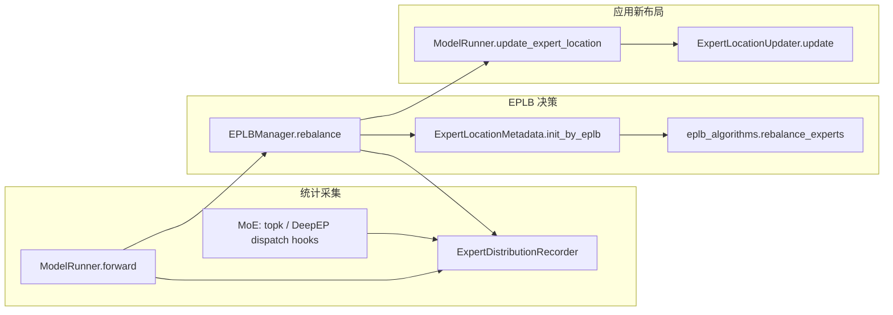

# `srt/eplb` — Expert Parallelism Load Balancing

## Summary

`srt/eplb/`（**12** `.py` 文件 / ~117 KB）实现 **基于专家激活统计的 EP 负载均衡**：通过全局 [`ExpertDistributionRecorder`](d:\design\sglang\python\sglang\srt\eplb\expert_distribution.py) 累积 logical 层负载 → [`EPLBManager`](d:\design\sglang\python\sglang\srt\eplb\eplb_manager.py) 按迭代周期触发 [`rebalance()`](d:\design\sglang\python\sglang\srt\eplb\eplb_manager.py:52-84) → [`ExpertLocationMetadata.init_by_eplb`](d:\design\sglang\python\sglang\srt\eplb\expert_location.py:163-177) 调用 `eplb_algorithms.rebalance_experts` 计算新 `physical_to_logical_map` → [`ModelRunner.update_expert_location`](d:\design\sglang\python\sglang\srt\model_executor\model_runner.py:1399-1410) + [`ExpertLocationUpdater`](d:\design\sglang\python\sglang\srt\eplb\expert_location_updater.py) 更新 MoE 权重布局。

> synthesis: 与 [comparison/topics/distributed.md](../../comparison/topics/distributed.md) 一致——**MindIE 无 EPLB**；vLLM 在 [`vllm/distributed/eplb/`](d:\design\vllm\vllm\distributed\eplb) + [`v1/worker/gpu/eplb_utils.py`](d:\design\vllm\vllm\v1\worker\gpu\eplb_utils.py)；SGLang 本模块 + 姊妹 [`srt/elastic_ep/`](elastic_ep.md) 协作（`elasticity_aware` 算法读 `ElasticEPStateManager.active_ranks`）。**算法实现**头注明拷贝自上游 [deepseek-ai/EPLB](https://github.com/deepseek-ai/EPLB)（[deepseek.py:1](d:\design\sglang\python\sglang\srt\eplb\eplb_algorithms\deepseek.py)）。

## Sources

| 区域 | 锚点 |
|---|---|
| 模块根（12 `.py`） | [d:\design\sglang\python\sglang\srt\eplb](d:\design\sglang\python\sglang\srt\eplb) |
| Manager 主体 | [eplb_manager.py](d:\design\sglang\python\sglang\srt\eplb\eplb_manager.py)（`EPLBManager` L21+ / `_entrypoint` L45-50 / `rebalance()` L52-84 / `_check_rebalance_needed` L93-106 / `on_forward_pass_end` L41-42） |
| 统计累积 | [expert_distribution.py](d:\design\sglang\python\sglang\srt\eplb\expert_distribution.py)（`ExpertDistributionRecorder` / `_StatAccumulator.dump`） |
| Location metadata | [expert_location.py](d:\design\sglang\python\sglang\srt\eplb\expert_location.py)（`ExpertLocationMetadata` / `init_by_eplb` L163-177 / `init_trivial` / `init_by_mapping` / `_compute_logical_to_all_physical_map`） |
| 权重更新 | [expert_location_updater.py](d:\design\sglang\python\sglang\srt\eplb\expert_location_updater.py)（`ExpertLocationUpdater.update` + `_filter_p2p_ops` L457-478） |
| Dispatch 辅助 | [expert_location_dispatch.py](d:\design\sglang\python\sglang\srt\eplb\expert_location_dispatch.py)（`ExpertLocationDispatchInfo` / `topk_ids_logical_to_physical` / `transform_select_experts_inputs`） |
| Algorithms | [eplb_algorithms/__init__.py](d:\design\sglang\python\sglang\srt\eplb\eplb_algorithms\__init__.py)（`EplbAlgorithm` enum / `rebalance_experts` / `compute_algorithm` L75-87） + [deepseek.py](d:\design\sglang\python\sglang\srt\eplb\eplb_algorithms\deepseek.py) + [deepseek_vec.py](d:\design\sglang\python\sglang\srt\eplb\eplb_algorithms\deepseek_vec.py) + [elasticity_aware.py](d:\design\sglang\python\sglang\srt\eplb\eplb_algorithms\elasticity_aware.py) |
| Simulator | [eplb_simulator/__init__.py](d:\design\sglang\python\sglang\srt\eplb\eplb_simulator\__init__.py) + [eplb_simulator/reader.py](d:\design\sglang\python\sglang\srt\eplb\eplb_simulator\reader.py)（`read_mode_per_pass` L16-51） |
| ModelRunner 集成 | [model_executor/model_runner.py:286, 547-561, 1399-1410, 2875-2917](d:\design\sglang\python\sglang\srt\model_executor\model_runner.py) |
| CLI | [server_args.py:537-549, 2959-2999, 5325-5387](d:\design\sglang\python\sglang\srt\server_args.py) |

## Architecture / Data flow

- **周期推进**：[`EPLBManager._entrypoint`](d:\design\sglang\python\sglang\srt\eplb\eplb_manager.py:45-50) 在 `eplb_rebalance_num_iterations` 次 `yield` 后进入 [`rebalance()`](d:\design\sglang\python\sglang\srt\eplb\eplb_manager.py:52-84)；每步 forward 结束由 [`on_forward_pass_end`](d:\design\sglang\python\sglang\srt\eplb\eplb_manager.py:41-42) 驱动 generator（[model_runner.py:2916-2917](d:\design\sglang\python\sglang\srt\model_executor\model_runner.py)）。
- **统计 → logical 计数**：[`_StatAccumulator.dump`](d:\design\sglang\python\sglang\srt\eplb\expert_distribution.py) 输出 `logical_count` 等（[eplb_manager.py:61-67](d:\design\sglang\python\sglang\srt\eplb\eplb_manager.py)）。
- **容错触发即时重平衡**：EP 活跃 rank 变化时 [`ModelRunner.forward`](d:\design\sglang\python\sglang\srt\model_executor\model_runner.py:2886-2894) 直接调用 `self.eplb_manager.rebalance()`。

## File inventory（12 文件）

| 分组 | 文件 | 角色 |
|---|---|---|
| **Orchestration** | [eplb_manager.py](d:\design\sglang\python\sglang\srt\eplb\eplb_manager.py) | `EPLBManager`：周期 `rebalance`、阈值门控、按层 chunk `update_expert_location` |
| **Location / mapping** | [expert_location.py](d:\design\sglang\python\sglang\srt\eplb\expert_location.py) | `ExpertLocationMetadata`、`init_by_eplb` / `init_trivial` / `init_by_mapping`、`_compute_logical_to_all_physical_map` |
| **Weights** | [expert_location_updater.py](d:\design\sglang\python\sglang\srt\eplb\expert_location_updater.py) | EPLB 后更新各层 routed expert 权重张量；可与 Elastic EP 容错联动（`_filter_p2p_ops` 用 `active_ranks_cpu`） |
| **Dispatch** | [expert_location_dispatch.py](d:\design\sglang\python\sglang\srt\eplb\expert_location_dispatch.py) | `ExpertLocationDispatchInfo`、`topk_ids_logical_to_physical` 与路由 / dispatch 辅助 |
| **Recording** | [expert_distribution.py](d:\design\sglang\python\sglang\srt\eplb\expert_distribution.py) | `ExpertDistributionRecorder`、accumulator、指标与 dump |
| **Algorithms** | [eplb_algorithms/__init__.py](d:\design\sglang\python\sglang\srt\eplb\eplb_algorithms\__init__.py)、[deepseek.py](d:\design\sglang\python\sglang\srt\eplb\eplb_algorithms\deepseek.py)、[deepseek_vec.py](d:\design\sglang\python\sglang\srt\eplb\eplb_algorithms\deepseek_vec.py)、[elasticity_aware.py](d:\design\sglang\python\sglang\srt\eplb\eplb_algorithms\elasticity_aware.py) | `EplbAlgorithm` enum + `rebalance_experts` + `compute_algorithm` 分发 |
| **Simulator** | [eplb_simulator/__init__.py](d:\design\sglang\python\sglang\srt\eplb\eplb_simulator\__init__.py)、[eplb_simulator/reader.py](d:\design\sglang\python\sglang\srt\eplb\eplb_simulator\reader.py) | 读盘工具（**非**仿真引擎），扫描 `.pt` dump 聚合各 rank 的 `global_physical_count` |
| **包顶 init** | [__init__.py](d:\design\sglang\python\sglang\srt\eplb\__init__.py) | 模块导出 |

## `EPLBManager` class

| 要点 | 锚点 |
|---|---|
| 构造：读 `eplb_rebalance_layers_per_chunk` / `eplb_rebalance_num_iterations`；断言 `num_iterations >= recorder_buffer_size` | [eplb_manager.py:21-30](d:\design\sglang\python\sglang\srt\eplb\eplb_manager.py) |
| 若 recorder 未在录则 `start_record()` | [eplb_manager.py:32-33](d:\design\sglang\python\sglang\srt\eplb\eplb_manager.py) |
| `_entrypoint` 主循环：每 N 次 yield 后 `yield from self.rebalance()` | [eplb_manager.py:45-50](d:\design\sglang\python\sglang\srt\eplb\eplb_manager.py) |
| `rebalance()`：dump_record → `_check_rebalance_needed` → `init_by_eplb` → 按 chunk 调用 `model_runner.update_expert_location` | [eplb_manager.py:52-84](d:\design\sglang\python\sglang\srt\eplb\eplb_manager.py) |
| 利用率高于 `eplb_min_rebalancing_utilization_threshold` 时跳过 | [eplb_manager.py:93-106](d:\design\sglang\python\sglang\srt\eplb\eplb_manager.py) |
| `on_forward_pass_end`：`next(self._main_generator)` | [eplb_manager.py:41-42](d:\design\sglang\python\sglang\srt\eplb\eplb_manager.py) |

## Algorithms

[`EplbAlgorithm`](d:\design\sglang\python\sglang\srt\eplb\eplb_algorithms\__init__.py) 枚举 + 工厂 `compute_algorithm("auto", ...)`（[L75-87](d:\design\sglang\python\sglang\srt\eplb\eplb_algorithms\__init__.py)：`auto` → `num_groups` 可被 `num_nodes` 整除时选 `deepseek_hierarchical`，否则 `deepseek`）：

| 算法值 | 实现 |
|---|---|
| `deepseek` / `deepseek_hierarchical` | [deepseek.rebalance_experts](d:\design\sglang\python\sglang\srt\eplb\eplb_algorithms\deepseek.py) |
| `deepseek_vec` / `deepseek_vec_hierarchical` | [deepseek_vec.rebalance_experts](d:\design\sglang\python\sglang\srt\eplb\eplb_algorithms\deepseek_vec.py) |
| `elasticity_aware` / `elasticity_aware_hierarchical` | [elasticity_aware.rebalance_experts](d:\design\sglang\python\sglang\srt\eplb\eplb_algorithms\elasticity_aware.py)（传入 `ElasticEPStateManager.active_ranks`，[__init__.py:54-69](d:\design\sglang\python\sglang\srt\eplb\eplb_algorithms\__init__.py)） |

[`ExpertLocationMetadata.init_by_eplb`](d:\design\sglang\python\sglang\srt\eplb\expert_location.py:163-177) 调用 `rebalance_experts` 与 `compute_algorithm(server_args.eplb_algorithm, ...)`。

## Simulator

[`eplb_simulator`](d:\design\sglang\python\sglang\srt\eplb\eplb_simulator) 并非独立仿真引擎，而是 **读盘工具**：[`reader.read_mode_per_pass`](d:\design\sglang\python\sglang\srt\eplb\eplb_simulator\reader.py:16-51) 扫描目录下 `*.pt`，聚合各 rank 的 `global_physical_count`，供离线分析。包 [`__init__.py`](d:\design\sglang\python\sglang\srt\eplb\eplb_simulator\__init__.py) 仅 `from . import reader`。

> synthesis: dimensions.md "含 simulator + 多算法" 中的 simulator 实为 **dump 读取分析器**，不是 EPLB 在线仿真器；建议 cross-compare 不要把它当 vLLM EPLB-utils 的对偶物。

## CLI / config 字段

| 字段 / CLI | 默认 / 类型 | 锚点 |
|---|---|---|
| `enable_eplb` / `--enable-eplb` | bool, False | [server_args.py:540, 5344-5346](d:\design\sglang\python\sglang\srt\server_args.py) |
| `eplb_algorithm` / `--eplb-algorithm` | str, `auto` | [L541, 5348-5352](d:\design\sglang\python\sglang\srt\server_args.py)；Elastic EP 下限制见 `_handle_elastic_ep` [L2974-2982](d:\design\sglang\python\sglang\srt\server_args.py) |
| `eplb_rebalance_num_iterations` / `--eplb-rebalance-num-iterations` | int, 1000 | [L542, 5354-5358](d:\design\sglang\python\sglang\srt\server_args.py) |
| `eplb_rebalance_layers_per_chunk` / `--eplb-rebalance-layers-per-chunk` | Optional[int] | [L543, 5360-5364](d:\design\sglang\python\sglang\srt\server_args.py) |
| `eplb_min_rebalancing_utilization_threshold` / `--eplb-min-rebalancing-utilization-threshold` | float, 1.0 | [L544, 5366-5370](d:\design\sglang\python\sglang\srt\server_args.py) |
| `expert_distribution_recorder_mode` / `--expert-distribution-recorder-mode` | `stat` / `stat_approx` / `per_pass` / `per_token` | [L545-547, 5372-5376](d:\design\sglang\python\sglang\srt\server_args.py)；启用 EPLB 时若 None 自动设 `stat` [L2959-2964](d:\design\sglang\python\sglang\srt\server_args.py) |
| `expert_distribution_recorder_buffer_size` / `--expert-distribution-recorder-buffer-size` | Optional[int]，`-1` 表示无限 buffer | [L548, 5378-5382](d:\design\sglang\python\sglang\srt\server_args.py) |
| `enable_expert_distribution_metrics` / `--enable-expert-distribution-metrics` | bool | [L549, 5384-5387](d:\design\sglang\python\sglang\srt\server_args.py) |
| `ep_num_redundant_experts` / `--ep-num-redundant-experts` | int, 0 | [L537, 5325-5329](d:\design\sglang\python\sglang\srt\server_args.py)；参与 `_init_common` 物理专家总数计算 |
| `ep_dispatch_algorithm` / `--ep-dispatch-algorithm` | Optional, `static`/`dynamic`/`fake` | [L538, 5331-5335](d:\design\sglang\python\sglang\srt\server_args.py)；EPLB + 非 trivial init 时默认 `static` [L2966-2969](d:\design\sglang\python\sglang\srt\server_args.py) |
| `init_expert_location` / `--init-expert-location` | str, `trivial` | [L539, 5337-5341](d:\design\sglang\python\sglang\srt\server_args.py) |

## ModelRunner / MoE integration

1. **初始化**：[model_runner.py:547-561](d:\design\sglang\python\sglang\srt\model_executor\model_runner.py)
   - `set_global_expert_distribution_recorder(ExpertDistributionRecorder.init_new(...))`
   - 若 `enable_eplb` 且非 draft worker → `self.eplb_manager = EPLBManager(self)`
   - `self.expert_location_updater = ExpertLocationUpdater()`
2. **Forward**：[model_runner.py:2875-2917](d:\design\sglang\python\sglang\srt\model_executor\model_runner.py)
   - `with get_global_expert_distribution_recorder().with_forward_pass(...)`
   - 结束时 `eplb_manager.on_forward_pass_end()`
3. **应用新 metadata**：[`update_expert_location`](d:\design\sglang\python\sglang\srt\model_executor\model_runner.py:1399-1410) → `expert_location_updater.update(...)`
4. **MoE / dispatcher 钩子**：[`layers/moe/topk.py`](d:\design\sglang\python\sglang\srt\layers\moe\topk.py) `on_select_experts`；[`token_dispatcher/deepep.py`](d:\design\sglang\python\sglang\srt\layers\moe\token_dispatcher\deepep.py) `on_deepep_dispatch_*`

## §跨子系统引用（§5 step 3）

按 [AGENTS.md §5 step 3](../../AGENTS.md#5-ingest-工作流) 5 类全仓库 grep。

### 1. 跨语言绑定（C++ / sgl-kernel）

- **EPLB / `ExpertDistribution` / `EPLBManager` / `ExpertLocationMetadata`**：**在 [`d:\design\sglang\sgl-kernel\`](d:\design\sglang\sgl-kernel) 全树 grep 0 命中**

### 2. 协作伙伴跨子系统引用

| 符号 | 代表消费方 |
|---|---|
| `EPLBManager` | 仅 [model_runner.py](d:\design\sglang\python\sglang\srt\model_executor\model_runner.py) + [eplb_manager.py](d:\design\sglang\python\sglang\srt\eplb\eplb_manager.py) |
| `get_global_expert_distribution_recorder` | 大量 MoE 模型、[layers/moe/topk.py](d:\design\sglang\python\sglang\srt\layers\moe\topk.py)、[token_dispatcher/*](d:\design\sglang\python\sglang\srt\layers\moe\token_dispatcher)、[managers/scheduler.py](d:\design\sglang\python\sglang\srt\managers\scheduler.py)、[models/transformers.py](d:\design\sglang\python\sglang\srt\models\transformers.py) 等 |
| `ExpertLocationMetadata` / `init_by_eplb` | `eplb_manager` / `expert_distribution` / `expert_location_updater` / `model_runner` |
| `compute_logical_to_rank_dispatch_physical_map` | 定义于 [expert_location.py:391-444](d:\design\sglang\python\sglang\srt\eplb\expert_location.py)；测试 [test_compute_logical_to_rank_dispatch_physical_map.py](d:\design\sglang\test\registered\unit\eplb\test_compute_logical_to_rank_dispatch_physical_map.py) |
| `ElasticEPStateManager` | `elasticity_aware` 算法 [eplb_algorithms/__init__.py:54-55](d:\design\sglang\python\sglang\srt\eplb\eplb_algorithms\__init__.py)；`forward` 中 rank 变化触发 `eplb_manager.rebalance()` [model_runner.py:2886-2894](d:\design\sglang\python\sglang\srt\model_executor\model_runner.py) |

### 3. 配置 / 共享数据结构

`ServerArgs` 中 EPLB 相关字段与 `_handle_eplb_and_dispatch` / `_handle_expert_distribution_metrics` / `_handle_elastic_ep` 交叉约束见 [server_args.py:2959-2999](d:\design\sglang\python\sglang\srt\server_args.py)。

### 4. 测试覆盖反查

- [test/registered/unit/eplb/test_balanced_packing.py](d:\design\sglang\test\registered\unit\eplb\test_balanced_packing.py)
- [test/registered/unit/eplb/test_compute_logical_to_rank_dispatch_physical_map.py](d:\design\sglang\test\registered\unit\eplb\test_compute_logical_to_rank_dispatch_physical_map.py)
- [test/manual/test_eplb.py](d:\design\sglang\test\manual\test_eplb.py)
- [test/manual/test_expert_distribution.py](d:\design\sglang\test\manual\test_expert_distribution.py)
- [test/manual/test_expert_location_updater.py](d:\design\sglang\test\manual\test_expert_location_updater.py)
- EP 集成测试：[test/registered/ep/test_deepep_large.py](d:\design\sglang\test\registered\ep\test_deepep_large.py) 等含 `--enable-eplb` / `--eplb-algorithm`
- **`d:\design\sglang\tests\` 路径不存在**（仓库测试树为 `d:\design\sglang\test\`）

### 5. doc / config / yaml 反查

- [docs/advanced_features/expert_parallelism.md](d:\design\sglang\docs\advanced_features\expert_parallelism.md)
- [docs/advanced_features/server_arguments.md](d:\design\sglang\docs\advanced_features\server_arguments.md)
- [docs/references/environment_variables.md](d:\design\sglang\docs\references\environment_variables.md)（`SGLANG_EPLB_HEATMAP_COLLECTION_INTERVAL`）
- 多节点部署 yaml 中含 `--eplb-*` 等

## 跨项目对照（synthesis）

| 维度 | MindIE | vLLM | SGLang（本模块） |
|---|---|---|---|
| EPLB | ❌ N/A（[comparison/topics/distributed.md](../../comparison/topics/distributed.md) 表行明示"MindIE 无 `eplb`"） | ✅ [`vllm/distributed/eplb/`](d:\design\vllm\vllm\distributed\eplb) + [`v1/worker/gpu/eplb_utils.py`](d:\design\vllm\vllm\v1\worker\gpu\eplb_utils.py) | ✅ `srt/eplb/` 12 .py + ModelRunner 集成 |
| 算法多样性 | N/A | （vLLM 实测细节待 ingest） | **3 套实现**（DeepSeek / DeepSeek-vec / Elasticity-aware）+ hierarchical 变种 = **6 种 enum** |
| Elastic EP 协作 | N/A | 独立 [`distributed/elastic_ep/`](d:\design\vllm\vllm\distributed\elastic_ep) | 姊妹模块 [`srt/elastic_ep/`](elastic_ep.md)；`elasticity_aware` 算法读 `ElasticEPStateManager.active_ranks` |
| Simulator | N/A | （未确认） | **离线 reader**（非在线仿真），用于 `.pt` dump 分析 |

详细 9 子维度对比见 [comparison/topics/distributed.md](../../comparison/topics/distributed.md)；维度索引 [comparison/dimensions.md §dim-distributed](../../comparison/dimensions.md)。

## Increment 2026-08-18 (06f32bab → f7101b0a)

- 本期 `eplb/` 仅 1 文件变更：[expert_distribution.py](d:\design\sglang\python\sglang\srt\eplb\expert_distribution.py) +43/-28（上游 f61f584347 #34998 "Add explicit EPLB balancedness reporting modes"——balancedness 上报模式显式化）。其余 11 文件 0 变更。
- > [!todo] VERIFY: 本页正文锚点为 2026-04-19 快照，未随 2026-08-10 / 2026-08-18 两轮增量逐点复核；本期改动面小，但 4→8 月间该目录是否有其它漂移未确认。

## Notes / Caveats

> [!todo] VERIFY: ~~`--eplb-rebalance-layers-per-chunk` 的 argparse 文案写"per forward pass"（[server_args.py:5360-5364](d:\design\sglang\python\sglang\srt\server_args.py)），而 [`EPLBManager._compute_update_layer_ids_chunks`](d:\design\sglang\python\sglang\srt\eplb\eplb_manager.py) 是在**单次 rebalance** 内按层分块并在块间 `yield`（可能跨多个 forward）。文案与实现是否一致需人工对照。~~
> **RESOLVED 2026-04-19**: 文案与实现一致——[`EPLBManager.rebalance`](d:\design\sglang\python\sglang\srt\eplb\eplb_manager.py:78-83) 在 `len(chunks) > 1` 时每个 chunk 之间 `yield`，由 [`_entrypoint`](d:\design\sglang\python\sglang\srt\eplb\eplb_manager.py:45-50) `yield from` 转发；`on_forward_pass_end` ([L41-42](d:\design\sglang\python\sglang\srt\eplb\eplb_manager.py)) 在 ModelRunner 每次 forward 末尾 `next(generator)`，因此 1 个 chunk 处理跨越 1 次 forward，"per forward pass" 字面准确。

> [!todo] VERIFY: ~~[`ExpertLocationDispatchInfo`](d:\design\sglang\python\sglang\srt\eplb\expert_location_dispatch.py) 标注的 `ep_dispatch_algorithm: Literal["static", "random"]` 与 [`transform_select_experts_inputs`](d:\design\sglang\python\sglang\srt\eplb\expert_location_dispatch.py) 中 `== "fake"` 分支并存；与 `ServerArgs.ep_dispatch_algorithm` 的 `fake` 语义关系需对照调用链确认。~~
> **RESOLVED 2026-04-19**: **类型标注错误**——dataclass 字段 `Literal["static", "random"]` ([expert_location_dispatch.py:26](d:\design\sglang\python\sglang\srt\eplb\expert_location_dispatch.py)) 与运行时分支不符；运行时实际接受 `"static"` / `"dynamic"` / `"fake"` 三值（[L82, 84-86](d:\design\sglang\python\sglang\srt\eplb\expert_location_dispatch.py)），其中 `"fake"` 在 `transform_select_experts_inputs` 中触发桩值（[L69](d:\design\sglang\python\sglang\srt\eplb\expert_location_dispatch.py)）；`ServerArgs.ep_dispatch_algorithm` 的 choices 为 `static`/`dynamic`/`fake` 与运行时一致——**Literal 注解需修为 `Literal["static", "dynamic", "fake"]`**（属源码 typo，非运行时 bug）。

> [!todo] VERIFY: `eplb_simulator` 命名暗示"在线仿真"但实际仅离线 reader——是否未来会扩展为完整仿真引擎，或应该重命名为 `eplb_dump_reader`？

## See also

- [sglang/modules/distributed.md](distributed.md)（明确不包含 EPLB；本模块是其姊妹）
- [sglang/modules/elastic_ep.md](elastic_ep.md)（`elasticity_aware` 算法的状态来源）
- [sglang/modules/model_executor.md](model_executor.md)（`ModelRunner` 集成主路径）
- [comparison/topics/distributed.md](../../comparison/topics/distributed.md)
- [comparison/dimensions.md §dim-distributed](../../comparison/dimensions.md)
