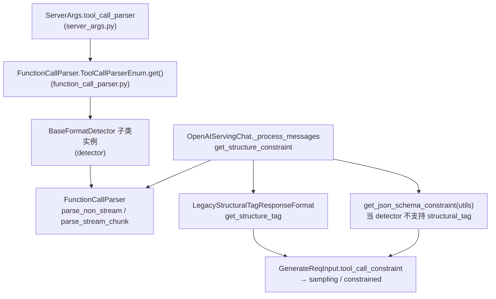

# `srt/function_call` — Tool / function call 解析与约束装配

## Summary

[`function_call`](d:\design\sglang\python\sglang\srt\function_call)（**26** 个 `.py`，**无** 包级 `__init__.py` —— 目录清单经 Glob 核对）实现 **OpenAI 风格 tool calls 的模型输出解析**：[`FunctionCallParser`](d:\design\sglang\python\sglang\srt\function_call\function_call_parser.py) 按 CLI [`--tool-call-parser`](d:\design\sglang\python\sglang\srt\server_args.py) 从 **字典注册表** 选取具体 [`BaseFormatDetector`](d:\design\sglang\python\sglang\srt\function_call\base_format_detector.py) 子类，提供 **非流式** [`detect_and_parse`](d:\design\sglang\python\sglang\srt\function_call\base_format_detector.py) 与 **流式** [`parse_streaming_increment`](d:\design\sglang\python\sglang\srt\function_call\base_format_detector.py) / [`parse_stream_chunk`](d:\design\sglang\python\sglang\srt\function_call\function_call_parser.py)；并与 [`get_structure_constraint`](d:\design\sglang\python\sglang\srt\function_call\function_call_parser.py) 生成 **`structural_tag` 或 `json_schema`** 约束，供采样层与 grammar 后端消费。**MCP / demo tool server** 不在本目录，而在 [`entrypoints/openai/tool_server.py`](d:\design\sglang\python\sglang\srt\entrypoints\openai\tool_server.py) + [`http_server.py`](d:\design\sglang\python\sglang\srt\entrypoints\http_server.py) 装配。

## Sources

| 区域 | 锚点 |
|---|---|
| 编排与注册表 | [`function_call_parser.py:44-244`](d:\design\sglang\python\sglang\srt\function_call\function_call_parser.py)（`FunctionCallParser` / `ToolCallParserEnum` / `get_structure_tag` / `get_structure_constraint`） |
| 抽象检测器与流式状态机 | [`base_format_detector.py:26-363`](d:\design\sglang\python\sglang\srt\function_call\base_format_detector.py) |
| 类型 | [`core_types.py:1-34`](d:\design\sglang\python\sglang\srt\function_call\core_types.py) |
| JSON / schema 工具 | [`utils.py:1-254`](d:\design\sglang\python\sglang\srt\function_call\utils.py) |
| JSON 数组兜底解析器 | [`json_array_parser.py:8-51`](d:\design\sglang\python\sglang\srt\function_call\json_array_parser.py) |
| Chat 集成 | [`serving_chat.py:344-384`](d:\design\sglang\python\sglang\srt\entrypoints\openai\serving_chat.py)、[`serving_chat.py:1345-1391`](d:\design\sglang\python\sglang\srt\entrypoints\openai\serving_chat.py) |
| HTTP 原生解析 API | [`http_server.py:1398-1417`](d:\design\sglang\python\sglang\srt\entrypoints\http_server.py) |
| Server 参数 | [`server_args.py:441-442`](d:\design\sglang\python\sglang\srt\server_args.py)、[`server_args.py:4826-4838`](d:\design\sglang\python\sglang\srt\server_args.py) |
| Grammar 后端（间接） | [`xgrammar_backend.py:269-315`](d:\design\sglang\python\sglang\srt\constrained\xgrammar_backend.py) |

## Architecture / Data flow

> synthesis: 本模块**不**直接 `import` `constrained/` 或组装 EBNF 字符串；它产出 **约束元组**（`structural_tag` 的 JSON 描述或 `json_schema` dict），后续由 tokenizer / scheduler 路径写入采样参数并由 [`xgrammar_backend.dispatch_structural_tag`](d:\design\sglang\python\sglang\srt\constrained\xgrammar_backend.py) 等编译为 grammar。



- **注册 / 工厂**：[`FunctionCallParser.__init__`](d:\design\sglang\python\sglang\srt\function_call\function_call_parser.py) 使用 **`ToolCallParserEnum.get(tool_call_parser)`**（纯 **dict 映射 → Type[BaseFormatDetector]**），未命中则 `ValueError`（[`function_call_parser.py:80-85`](d:\design\sglang\python\sglang\srt\function_call\function_call_parser.py)）。
- **约束分支**：[`get_structure_constraint`](d:\design\sglang\python\sglang\srt\function_call\function_call_parser.py) 若 [`supports_structural_tag()`](d:\design\sglang\python\sglang\srt\function_call\base_format_detector.py) 为真且满足 `tool_choice`/strict 条件则返回 `("structural_tag", tag)`；否则在 **required/named** 场景退回 **`("json_schema", json_schema)`**（[`function_call_parser.py:221-244`](d:\design\sglang\python\sglang\srt\function_call\function_call_parser.py)）。[`OpenAIServingChat._process_messages`](d:\design\sglang\python\sglang\srt\entrypoints\openai\serving_chat.py) 在 `tool_call_constraint is None` 时再补 `get_json_schema_constraint`（[`serving_chat.py:364-375`](d:\design\sglang\python\sglang\srt\entrypoints\openai\serving_chat.py)）。
- **流式 tool_choice 特殊路径**：当 `tool_choice` 为 required/named 且 detector **不支持** `structural_tag` 时，[`_process_tool_call_stream`](d:\design\sglang\python\sglang\srt\entrypoints\openai\serving_chat.py) 选用 [`JsonArrayParser`](d:\design\sglang\python\sglang\srt\function_call\json_array_parser.py) 复用基类 **partial JSON** 流式逻辑（[`serving_chat.py:1356-1376`](d:\design\sglang\python\sglang\srt\entrypoints\openai\serving_chat.py)）。

## File inventory（26 `.py`）

| 文件 | 职责摘要 |
|---|---|
| [`function_call_parser.py`](d:\design\sglang\python\sglang\srt\function_call\function_call_parser.py) | `FunctionCallParser`：注册表、非流式/流式 API、`get_structure_tag` / `get_structure_constraint` |
| [`base_format_detector.py`](d:\design\sglang\python\sglang\srt\function_call\base_format_detector.py) | `BaseFormatDetector`：流式缓冲、`parse_base_json`、`parse_streaming_increment` 默认实现 |
| [`core_types.py`](d:\design\sglang\python\sglang\srt\function_call\core_types.py) | `ToolCallItem`、`StreamingParseResult`（Pydantic）、`StructureInfo`（dataclass）、`_GetInfoFunc` |
| [`utils.py`](d:\design\sglang\python\sglang\srt\function_call\utils.py) | `_partial_json_loads`、`_is_complete_json`、`get_json_schema_constraint`、`infer_type_from_json_schema` 等 |
| [`json_array_parser.py`](d:\design\sglang\python\sglang\srt\function_call\json_array_parser.py) | `JsonArrayParser`：`detect_and_parse` / `structure_info` 显式 `NotImplementedError`，流式委托基类 |
| 20× `*_detector.py` / [`minimax_m2.py`](d:\design\sglang\python\sglang\srt\function_call\minimax_m2.py) | 各模型格式检测器（见下表） |

## Key APIs / 工厂表

### `ToolCallParserEnum`（字符串 → 类）

锚点：[`function_call_parser.py:53-78`](d:\design\sglang\python\sglang\srt\function_call\function_call_parser.py)。**CLI choices** 由 [`list(FunctionCallParser.ToolCallParserEnum.keys())`](d:\design\sglang\python\sglang\srt\server_args.py) 动态生成（[`server_args.py:4826-4832`](d:\design\sglang\python\sglang\srt\server_args.py)）。

| CLI 键 | 类 | 备注 |
|---|---|---|
| `deepseekv3` | [`DeepSeekV3Detector`](d:\design\sglang\python\sglang\srt\function_call\deepseekv3_detector.py) | Unicode + ```json 代码块等 |
| `deepseekv31` | [`DeepSeekV31Detector`](d:\design\sglang\python\sglang\srt\function_call\deepseekv31_detector.py) | 分隔符与 v3 略有不同 |
| `deepseekv32` | [`DeepSeekV32Detector`](d:\design\sglang\python\sglang\srt\function_call\deepseekv32_detector.py) | DSML / XML 参数或直出 JSON |
| `glm` / `glm45` | [`Glm4MoeDetector`](d:\design\sglang\python\sglang\srt\function_call\glm4_moe_detector.py) | `<tool_call>` + `<arg_key>` / `<arg_value>` 状态机 |
| `glm47` | [`Glm47MoeDetector`](d:\design\sglang\python\sglang\srt\function_call\glm47_moe_detector.py) | GLM-4.7 变体（同文件内 XML→JSON 管线） |
| `gpt-oss` | [`GptOssDetector`](d:\design\sglang\python\sglang\srt\function_call\gpt_oss_detector.py) | 委托 [`HarmonyParser`](d:\design\sglang\python\sglang\srt\parser\harmony_parser.py) |
| `kimi_k2` | [`KimiK2Detector`](d:\design\sglang\python\sglang\srt\function_call\kimik2_detector.py) | Kimi 专用 redacted 标记 |
| `lfm2` | [`Lfm2Detector`](d:\design\sglang\python\sglang\srt\function_call\lfm2_detector.py) | Pythonic + JSON 双模式 |
| `llama3` | [`Llama32Detector`](d:\design\sglang\python\sglang\srt\function_call\llama32_detector.py) | `<\|python_tag\|>` JSON |
| `mimo` | [`MiMoDetector`](d:\design\sglang\python\sglang\srt\function_call\mimo_detector.py) | 注释标明部分逻辑来自 vLLM |
| `mistral` | [`MistralDetector`](d:\design\sglang\python\sglang\srt\function_call\mistral_detector.py) | `[TOOL_CALLS]` JSON 数组或紧凑格式 |
| `pythonic` | [`PythonicDetector`](d:\design\sglang\python\sglang\srt\function_call\pythonic_detector.py) | Python 列表调用语法 |
| `qwen` / `qwen25` | [`Qwen25Detector`](d:\design\sglang\python\sglang\srt\function_call\qwen25_detector.py) | `<tool_call>` 换行包裹 JSON |
| `qwen3_coder` / `step3p5` | [`Qwen3CoderDetector`](d:\design\sglang\python\sglang\srt\function_call\qwen3_coder_detector.py) | `<function=` / `<parameter=` XML 管线 |
| `step3` | [`Step3Detector`](d:\design\sglang\python\sglang\srt\function_call\step3_detector.py) | steptml invoke |
| `minimax-m2` | [`MinimaxM2Detector`](d:\design\sglang\python\sglang\srt\function_call\minimax_m2.py) | `<minimax:tool_call>` / `<invoke>` |
| `trinity` | [`TrinityDetector`](d:\design\sglang\python\sglang\srt\function_call\trinity_detector.py) | 继承 `Qwen25Detector`，剥离 thinking 标签 |
| `interns1` | [`InternlmDetector`](d:\design\sglang\python\sglang\srt\function_call\internlm_detector.py) | `<\|action_start\|>` / `<\|plugin\|>`（文件头注明来自 lmdeploy） |
| `hermes` | [`HermesDetector`](d:\design\sglang\python\sglang\srt\function_call\hermes_detector.py) | 同行 `<tool_call>{json}</tool_call>` |
| `gigachat3` | [`GigaChat3Detector`](d:\design\sglang\python\sglang\srt\function_call\gigachat3_detector.py) | 多正则从片段提取 name/arguments |
| `gemma4` | [`Gemma4Detector`](d:\design\sglang\python\sglang\srt\function_call\gemma4_detector.py) | 自定义 `<\|tool_call>` / `<tool_call\|>` 值语法 |

### `BaseFormatDetector` 流式 vs 非流式

| 方法 | 作用 | 返回 |
|---|---|---|
| [`detect_and_parse`](d:\design\sglang\python\sglang\srt\function_call\base_format_detector.py) | 一次性全文解析 | [`StreamingParseResult`](d:\design\sglang\python\sglang\srt\function_call\core_types.py)（`normal_text` + `calls`） |
| [`has_tool_call`](d:\design\sglang\python\sglang\srt\function_call\base_format_detector.py) | 前缀探测 | `bool` |
| [`parse_streaming_increment`](d:\design\sglang\python\sglang\srt\function_call\base_format_detector.py) | 增量流式；维护 `_buffer`、`current_tool_id`、`streamed_args_for_tool` 等 | `StreamingParseResult` |
| [`structure_info`](d:\design\sglang\python\sglang\srt\function_call\base_format_detector.py) | 生成 per-tool `StructureInfo(begin,end,trigger)` | `_GetInfoFunc` |
| [`supports_structural_tag`](d:\design\sglang\python\sglang\srt\function_call\base_format_detector.py) | 是否可走 `structural_tag` 约束 | 默认 `True`；部分 detector 覆盖为 `False`（如 [`json_array_parser.py:45-51`](d:\design\sglang\python\sglang\srt\function_call\json_array_parser.py) 通过 `NotImplementedError` 拒绝 `structure_info`） |

### `core_types.py` 数据模型

- [`ToolCallItem`](d:\design\sglang\python\sglang\srt\function_call\core_types.py)：`tool_index`、`name?`、`parameters`（JSON 字符串）。
- [`StreamingParseResult`](d:\design\sglang\python\sglang\srt\function_call\core_types.py)：`normal_text`、`calls`。
- [`StructureInfo`](d:\design\sglang\python\sglang\srt\function_call\core_types.py)：**唯一** `@dataclass`（`begin` / `end` / `trigger`）。

**计数**：显式 `@dataclass` **1 个**；Pydantic `BaseModel` **2 个**（`ToolCallItem`、`StreamingParseResult`）。

### `utils.py`：`_partial_json_loads` 家族

- [`_partial_json_loads`](d:\design\sglang\python\sglang\srt\function_call\utils.py) 包装 `partial_json_parser.loads`，并在 `"Extra data"` 时退回 `json.JSONDecoder.raw_decode`（[`utils.py:23-49`](d:\design\sglang\python\sglang\srt\function_call\utils.py)）。
- [`_is_complete_json`](d:\design\sglang\python\sglang\srt\function_call\utils.py) 用 `orjson.loads` 判定完整性（[`utils.py:52-57`](d:\design\sglang\python\sglang\srt\function_call\utils.py)）。

### `json_array_parser.py`

[`JsonArrayParser`](d:\design\sglang\python\sglang\srt\function_call\json_array_parser.py) 将 `bot_token`/`eot_token` 设为 `[` / `]`，用于 **JSON Schema 强约束下** 的通用数组解析（类文档 [`json_array_parser.py:8-14`](d:\design\sglang\python\sglang\srt\function_call\json_array_parser.py)），与 **模型专属 detector** 互补。

### `ebnf_composer` / `constrained/`

- **本目录内**对 `ebnf_composer` **无引用**（已对 `d:\design\sglang\python\sglang\srt\function_call\` grep）。
- **grammar 编译**发生在 **`srt/constrained/`**，例如 [`XGrammarBackend.dispatch_structural_tag`](d:\design\sglang\python\sglang\srt\constrained\xgrammar_backend.py) / [`dispatch_ebnf`](d:\design\sglang\python\sglang\srt\constrained\xgrammar_backend.py)；`function_call` 仅 upstream 提供 **structural_tag JSON** 或 **json_schema**。

### synthesis：解析策略三分法

1. **特殊 token + JSON / 代码块**（DeepSeek 系、Qwen、Mistral、Kimi 等）。
2. **XML / 类 HTML 参数块**（GLM4/47、Step3、Qwen3 Coder、MiniMax M2 等）。
3. **非 JSON：Pythonic / AST**（[`PythonicDetector`](d:\design\sglang\python\sglang\srt\function_call\pythonic_detector.py)、[`Lfm2Detector`](d:\design\sglang\python\sglang\srt\function_call\lfm2_detector.py) 的 Pythonic 分支等）。

**本模块内**未见对 **xgrammar / outlines / llguidance** 的直接 import；约束通过 **sampling 参数** 间接进入 `constrained`（见 [`xgrammar_backend.py:285-315`](d:\design\sglang\python\sglang\srt\constrained\xgrammar_backend.py)）。

### 代码血缘（节选）

- [`InternlmDetector`](d:\design\sglang\python\sglang\srt\function_call\internlm_detector.py) 文件头：`modified from` lmdeploy（[`internlm_detector.py:1`](d:\design\sglang\python\sglang\srt\function_call\internlm_detector.py)）。
- [`MiMoDetector`](d:\design\sglang\python\sglang\srt\function_call\mimo_detector.py)：`Adapted from vllm-project/vllm`（[`mimo_detector.py:45-46`](d:\design\sglang\python\sglang\srt\function_call\mimo_detector.py)）。

## CLI / ServerArgs

| 字段 / 参数 | 锚点 | 默认值 | 说明 |
|---|---|---|---|
| `ServerArgs.tool_call_parser` | [`server_args.py:441`](d:\design\sglang\python\sglang\srt\server_args.py) | `None` | 与 `--tool-call-parser` 绑定 |
| `--tool-call-parser` | [`server_args.py:4827-4832`](d:\design\sglang\python\sglang\srt\server_args.py) | 同上 | `choices=FunctionCallParser.ToolCallParserEnum.keys()` |
| `ServerArgs.tool_server` | [`server_args.py:442`](d:\design\sglang\python\sglang\srt\server_args.py) | `None` | 见下节 |
| `--tool-server` | [`server_args.py:4834-4838`](d:\design\sglang\python\sglang\srt\server_args.py) | `None` | `'demo'` 或逗号分隔 MCP URL |

**弃用别名**（运行时改写）：[`deprecated_tool_call_parsers`](d:\design\sglang\python\sglang\srt\server_args.py) `qwen25→qwen`、`glm45→glm`（[`server_args.py:989-994`](d:\design\sglang\python\sglang\srt\server_args.py)）。

## §跨子系统引用（§5 step 3）

### 1. 跨语言绑定（C++ / sgl-kernel）

在 [`d:\design\sglang\sgl-kernel\`](d:\design\sglang\sgl-kernel) 全树 grep `function_call` / `FunctionCall` / `ToolCall`：**0 命中**（本模块纯 Python）。

### 2. 协作 import（`srt/`，排除 `function_call/`）

| 文件 | 行 | 内容 |
|---|---|---|
| [`server_args.py`](d:\design\sglang\python\sglang\srt\server_args.py) | 32 | `from sglang.srt.function_call.function_call_parser import FunctionCallParser` |
| [`serving_chat.py`](d:\design\sglang\python\sglang\srt\entrypoints\openai\serving_chat.py) | 47-50 | `ToolCallItem`、`FunctionCallParser`、`JsonArrayParser`、`get_json_schema_constraint` |
| [`http_server.py`](d:\design\sglang\python\sglang\srt\entrypoints\http_server.py) | 110 | `FunctionCallParser`（`parse_function_call`） |

**相关但非 import**：[`detokenizer_manager.py:116-167`](d:\design\sglang\python\sglang\srt\managers\detokenizer_manager.py) 仅比较 `server_args.tool_call_parser == "gpt-oss"`，**不**引用 `function_call` 包。

### 3. 配置 / 共享结构

- [`ParseFunctionCallReq`](d:\design\sglang\python\sglang\srt\managers\io_struct.py) 承载 `/parse_function_call` 请求体（[`io_struct.py:1754-1761`](d:\design\sglang\python\sglang\srt\managers\io_struct.py)），**不** import `function_call` 模块。

### 4. 测试（`d:\design\sglang\test\`）

对 `function_call` / `FunctionCallParser` / `tool_call` 联合 grep：**13** 个测试文件命中，例如：

- [`test/registered/unit/function_call/test_function_call_parser.py`](d:\design\sglang\test\registered\unit\function_call\test_function_call_parser.py)
- [`test/registered/unit/function_call/test_hermes_detector.py`](d:\design\sglang\test\registered\unit\function_call\test_hermes_detector.py)
- [`test/registered/openai_server/function_call/test_openai_function_calling.py`](d:\design\sglang\test\registered\openai_server\function_call\test_openai_function_calling.py)

### 5. 文档（`d:\design\sglang\docs\`）

用户可见说明示例：[`docs/advanced_features/tool_parser.ipynb`](d:\design\sglang\docs\advanced_features\tool_parser.ipynb)、[`docs/basic_usage/deepseek_v3.md`](d:\design\sglang\docs\basic_usage\deepseek_v3.md)、[`docs/references/environment_variables.md`](d:\design\sglang\docs\references\environment_variables.md)（`SGLANG_TOOL_STRICT_LEVEL` 等）。

## `tool_server`（MCP）位置

- 实现：[`MCPToolServer` / `DemoToolServer`](d:\design\sglang\python\sglang\srt\entrypoints\openai\tool_server.py)（例如 `add_tool_server`）。
- 启动装配：[`http_server.py:354-363`](d:\design\sglang\python\sglang\srt\entrypoints\http_server.py) 读取 `server_args.tool_server`。
- **与 `function_call/` 解耦**：tool server 服务 **工具清单 / MCP 会话**；**输出解析**仍由 `FunctionCallParser` 路径负责。

## 数字核对

| 项 | 值 |
|---|---|
| `function_call/*.py` 文件数 | **26**（Glob；**无** `__init__.py`） |
| `ToolCallParserEnum` 字符串键 | **24**（含别名键；见 [`function_call_parser.py:53-78`](d:\design\sglang\python\sglang\srt\function_call\function_call_parser.py)） |
| 独立 detector 源文件 | **21**（另 5 个为核心/工具/编排/json_array） |
| DeepSeek 变体 | 代码上 **3** 个类 + **3** 个 CLI 键（v3/v31/v32）；CLI 与类均为三分 |

## Notes / Caveats

> [!todo] VERIFY: pin 从 `34fef07a` → `06f32bab`（2026-08-10 increment）后本页未深 verify；文件数量/行号可能漂移。优先对照 [entities/Scheduler.md](../entities/Scheduler.md) / 新模块页。

> [!todo] VERIFY: ~~`BaseFormatDetector.detect_and_parse` 标为 `@abstractmethod` 但基类仍带默认实现（[`base_format_detector.py:97-104`](d:\design\sglang\python\sglang\srt\function_call\base_format_detector.py)）；各子类均完整覆盖，实际行为以子类为准。~~
> **RESOLVED 2026-04-19**: 已逐字核对 [`base_format_detector.py:97-104`](d:\design\sglang\python\sglang\srt\function_call\base_format_detector.py)：`@abstractmethod` 装饰下方法体为 `action = orjson.loads(text); return StreamingParseResult(calls=self.parse_base_json(action, tools))`。这是合法 Python 模式（ABC 抽象方法可有默认实现），由 `class BaseFormatDetector(ABC)`（[base_format_detector.py:26](d:\design\sglang\python\sglang\srt\function_call\base_format_detector.py)）强制子类 override；本目录下 21 个 `*_detector.py` + `JsonArrayParser` 均显式覆盖此方法。

> [!warning] CONTRADICTION: ~~上游文档 [`docs/advanced_features/tool_parser.ipynb`](d:\design\sglang\docs\advanced_features\tool_parser.ipynb) 仍写「在 `sglang/srt/function_call_parser.py` 增加 detector」（仓库内路径已为 [`function_call/function_call_parser.py`](d:\design\sglang\python\sglang\srt\function_call\function_call_parser.py)）。~~
> **RESOLVED 2026-04-19**: 矛盾确证存在 — 上游 ipynb 第 823 / 833 行仍写老路径 `sglang/srt/function_call_parser.py`；同文件第 454 行的代码片段反而用了正确的 `sglang.srt.function_call.function_call_parser`。这是上游文档自身不一致，**仍未在上游修复**，需以源码 [`function_call/function_call_parser.py`](d:\design\sglang\python\sglang\srt\function_call\function_call_parser.py) 为准（保留此 CONTRADICTION 作为面向上游的提醒）。

> [!warning] CONTRADICTION（与旧叙述）: 若外部资料仍称「function_call 直接调用 EBNF 组合器」，与源码不符：**EBNF/grammar 编译在 `constrained/`**，见 [`xgrammar_backend.py:269-315`](d:\design\sglang\python\sglang\srt\constrained\xgrammar_backend.py)。

## See also

- [sglang/modules/connector.md](connector.md)（frontmatter/章节结构参考）
- [sglang/modules/constrained.md](constrained.md)（grammar 后端编译消费方）
- [sglang/modules/parser.md](parser.md)（同栈：reasoning + harmony 输出解析）
- [sglang/index.md](../index.md)
- [comparison/index.md](../../comparison/index.md)（function_call 跨框架对比仍为 TODO 时引用）
- 源码根：[`d:\design\sglang\python\sglang\srt\function_call\`](d:\design\sglang\python\sglang\srt\function_call)
