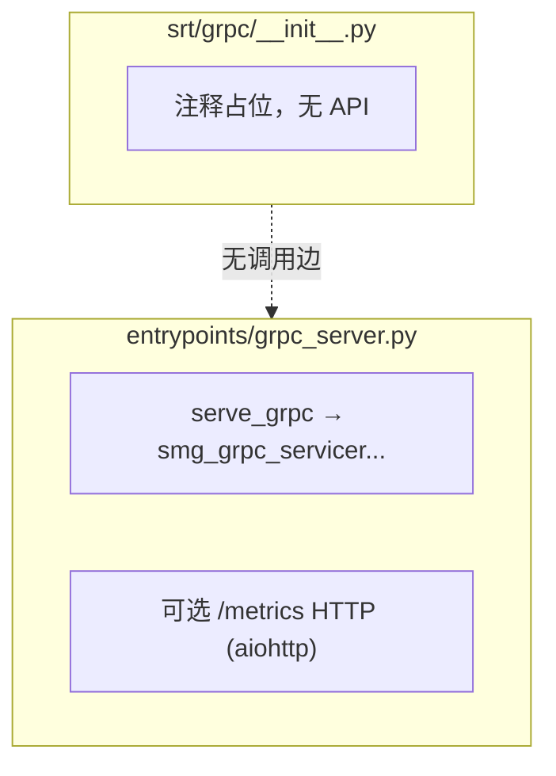

# `srt/grpc/` 与 gRPC 相关实现（占位 + 真实在 `entrypoints/`）

> [!warning] 2026-08-18 增量：`srt/grpc/` 目录已被上游删除
>
> commit `67e12131df` "Build Rust extensions on demand in source checkouts" (#34994) 删除了 ~~`python/sglang/srt/grpc/__init__.py`~~（文件已随 #34994 删除）（该 commit stat 中 `python/sglang/srt/grpc/__init__.py | 1 -`），整个 `srt/grpc/` 目录在 HEAD `f7101b0a` 下**已不存在**。本页下文对占位包的描述保留作历史记录；gRPC 实现本来就不在该占位包内，仍在 `entrypoints/grpc_server.py`（委托外部 `smg-grpc-servicer` 包）与 `entrypoints/grpc_bridge.py`（Rust 原生 gRPC 的 Python 桥）。

## Summary

~~`d:\design\sglang\python\sglang\srt\grpc\__init__.py`~~（文件已随 #34994 删除） 仅含一行注释 `# SGLang gRPC module`，**无**可执行代码、无 `grpcio` import，可视为 **空包占位**。**实际** gRPC 服务入口在 [`d:\design\sglang\python\sglang\srt\entrypoints\grpc_server.py`](d:\design\sglang\python\sglang\srt\entrypoints\grpc_server.py)：[`serve_grpc`](d:\design\sglang\python\sglang\srt\entrypoints\grpc_server.py) 委托外部包 `smg_grpc_servicer.sglang.server.serve_grpc`，缺失依赖时抛出明确 `ImportError`（[L69-76](d:\design\sglang\python\sglang\srt\entrypoints\grpc_server.py)）；同文件还包含可选 Prometheus metrics HTTP（[L13-63](d:\design\sglang\python\sglang\srt\entrypoints\grpc_server.py)）。

> [!warning] CONTRADICTION（命名 — 必读）
>
> **目录名** `srt/grpc/` 易让人以为实现位于此包内；**事实**是核心逻辑在外部 `smg-grpc-servicer`，且仓库内另有多处 **其它** gRPC 用途（如测试里 `grpc` + `smg_grpc_proto` 多模态 encoder），与 `srt/grpc/__init__.py` **无** import 关系。

## Sources

- ~~d:\design\sglang\python\sglang\srt\grpc\__init__.py~~（文件已随 #34994 删除）（**1 .py / 22 字节占位**）
- [d:\design\sglang\python\sglang\srt\entrypoints\grpc_server.py](d:\design\sglang\python\sglang\srt\entrypoints\grpc_server.py)（服务启动与 metrics）

## Architecture（占位 vs 实际）

## §跨子系统检索

| 类别 | 结果 |
|------|------|
| **sgl-kernel** | `srt/grpc/__init__.py` **不适用**；内容无 kernel 引用 |
| **`from sglang.srt.grpc` / `srt.grpc`** | 全 `python/sglang` 下 **0** 处匹配（裸包未被引用） |
| **`grpc_server.py`** | 唯一命中：[entrypoints/grpc_server.py](d:\design\sglang\python\sglang\srt\entrypoints\grpc_server.py) |
| **`grpcio` / `grpc.`** | 分布于测试与分布式等（例：`test/registered/distributed/test_epd_disaggregation.py` 含 `import grpc`）；与 `srt/grpc/` **无**直接文件级耦合 |
| **`*.proto` / `protos/`** | 仓库内存在 **其它** gRPC 生成桩引用（如测试中 `smg_grpc_proto` / `sglang_encoder_pb2`），**不**在 `srt/grpc/` 内 |

## Increment 2026-08-18 (06f32bab → f7101b0a)

- **`srt/grpc/` 占位包已删除**：commit `67e12131df` (#34994) 删除 `python/sglang/srt/grpc/__init__.py`（原本仅 1 行注释占位）；HEAD 下 `srt/grpc/` 目录不存在（实地 ls 确认）。本页 frontmatter `sources` 已相应移除该路径。
- **实现位置不变**：外部包委托入口 [`serve_grpc`](d:\design\sglang\python\sglang\srt\entrypoints\grpc_server.py) 仍在，但行号漂移至 [`grpc_server.py:L156-166`](d:\design\sglang\python\sglang\srt\entrypoints\grpc_server.py)（`ImportError` 提示在 [L160-166](d:\design\sglang\python\sglang\srt\entrypoints\grpc_server.py)）；文件已扩展为「gRPC + HTTP sidecar」结构：sidecar 在 `--smg-http-sidecar-port`（默认 `--port + 1`）暴露 `/metrics`、`/start_profile`、`/stop_profile`（[`grpc_server.py:L1-11`](d:\design\sglang\python\sglang\srt\entrypoints\grpc_server.py)、[L26-37](d:\design\sglang\python\sglang\srt\entrypoints\grpc_server.py)、[L152-153](d:\design\sglang\python\sglang\srt\entrypoints\grpc_server.py)），正文旧锚点 `serve_grpc:L66` / metrics `L13-63` 已失效。
- **新增第三条 gRPC 路径（Rust 原生）**：[`grpc_bridge.py`](d:\design\sglang\python\sglang\srt\entrypoints\grpc_bridge.py) 提供 `RuntimeHandle`——Rust gRPC server 经 PyO3 同步调用 TokenizerManager 的桥（[`grpc_bridge.py:L1-7`](d:\design\sglang\python\sglang\srt\entrypoints\grpc_bridge.py)）；由 [`http_server.py:L2728-2754`](d:\design\sglang\python\sglang\srt\entrypoints\http_server.py) 的 `_start_native_grpc_server_for_runtime` 经 `load_rust_extension("sglang.srt.rust_extensions._grpc")` 启动，详见 [rust_extensions.md](rust_extensions.md)。
- synthesis: 原「CONTRADICTION（命名）」块的核心告诫（不要在 `srt/grpc/` 下找实现）随目录删除而自然消解，但保留有助理解历史 anchor。

## Notes / Caveats

- 若 wiki 页标题写「`srt/grpc` 模块」，应在正文首段声明：**实现空洞**，避免读者在 `srt/grpc/` 下查找服务逻辑。
- 与 HTTP 主入口文档的关系：`serve_grpc` 为 **并行** serving 模式入口（与 `launch_server` 流程相关）。
- gRPC 模式下 metrics HTTP 由 [`grpc_server.py`](d:\design\sglang\python\sglang\srt\entrypoints\grpc_server.py) 在独立端口暴露；详见 [observability.md](observability.md) `--metrics-http-port` 字段。

## See also

- [entrypoints/grpc_server.py](d:\design\sglang\python\sglang\srt\entrypoints\grpc_server.py)（实际实现）
- [rust_extensions.md](rust_extensions.md)（Rust 原生 gRPC 扩展 `_grpc` 的加载机制）
- [observability.md](observability.md)（gRPC 模式的 metrics HTTP）
- [entrypoints_openai.md](entrypoints_openai.md)（HTTP 模式对照）
