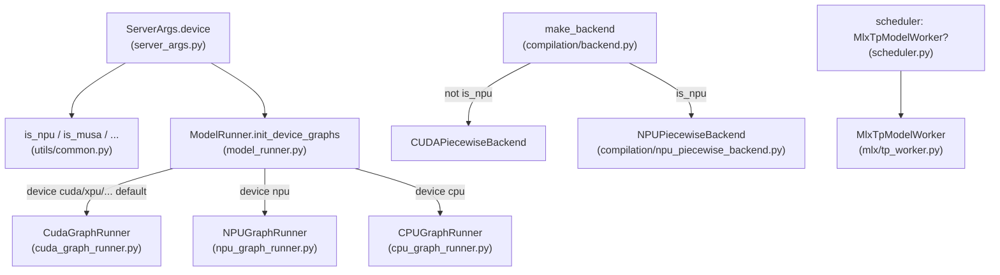

# `srt/hardware_backend` — 设备专属后端（NPU / MUSA / MLX）

## Summary

[`hardware_backend`](d:\design\sglang\python\sglang\srt\hardware_backend)（**22** `.py`，Glob 核对；**无** 包级 `__init__.py`）收纳 **非 CUDA 默认路径** 下的设备实现：**Ascend NPU**（`npu/`，含 `torch.npu` 图、`sgl_kernel_npu`、注意力/量化/MoE/图捕获辅助）、**摩尔线程 MUSA**（`musa/attention`，[`MusaFlashAttentionBackend`](d:\design\sglang\python\sglang\srt\hardware_backend\musa\attention\flashattention_backend.py)）、**Apple Silicon MLX**（`mlx/`，[`MlxTpModelWorker`](d:\design\sglang\python\sglang\srt\hardware_backend\mlx\tp_worker.py) 绕过 PyTorch 权重加载）。

**主推理图调度**在 [`ModelRunner.init_device_graphs`](d:\design\sglang\python\sglang\srt\model_executor\model_runner.py)：`device=="npu"` 时选用 [`NPUGraphRunner`](d:\design\sglang\python\sglang\srt\hardware_backend\npu\graph_runner\npu_graph_runner.py)，否则默认 [`CudaGraphRunner`](d:\design\sglang\python\sglang\srt\model_executor\cuda_graph_runner.py)。**分块编译 + NPU 图池**由 [`compilation/backend.py`](d:\design\sglang\python\sglang\srt\compilation\backend.py) 在 `is_npu()` 时选用 [`NPUPiecewiseBackend`](d:\design\sglang\python\sglang\srt\compilation\npu_piecewise_backend.py)（**文件在 `compilation/`，不在本目录**）。

**运行时设备判定**集中在 [`sglang.srt.utils.common`](d:\design\sglang\python\sglang\srt\utils\common.py)（`is_npu` / `is_cuda` / `is_musa` 等），本包多为 **消费方** 与 **设备内核扩展**。

## Sources

| 区域 | 锚点 |
|---|---|
| NPU 初始化与默认 ServerArgs | [`npu/utils.py:44-107`](d:\design\sglang\python\sglang\srt\hardware_backend\npu\utils.py)（`set_default_server_args` / `init_npu_backend`） |
| NPU 主 decode 图 | [`npu/graph_runner/npu_graph_runner.py:54-214`](d:\design\sglang\python\sglang\srt\hardware_backend\npu\graph_runner\npu_graph_runner.py)（`NPUGraphRunner`） |
| CUDA 基类（对比用） | [`cuda_graph_runner.py:512+`](d:\design\sglang\python\sglang\srt\model_executor\cuda_graph_runner.py)（`CudaGraphRunner`）、[`cuda_graph_runner.py:824-862`](d:\design\sglang\python\sglang\srt\model_executor\cuda_graph_runner.py)（`_capture_graph` / `_create_device_graph`） |
| 图 runner 选择 | [`model_runner.py:2567-2584`](d:\design\sglang\python\sglang\srt\model_executor\model_runner.py) |
| NPU 分块编译后端 | [`compilation/npu_piecewise_backend.py:16-109`](d:\design\sglang\python\sglang\srt\compilation\npu_piecewise_backend.py) |
| 编译后端工厂 | [`compilation/backend.py:38-62`](d:\design\sglang\python\sglang\srt\compilation\backend.py) |
| 设备探测 API | [`utils/common.py:128-192`](d:\design\sglang\python\sglang\srt\utils\common.py) |
| CLI `--device` / NPU 特化 | [`server_args.py:4406-4410`](d:\design\sglang\python\sglang\srt\server_args.py)、[`server_args.py:1119-1130`](d:\design\sglang\python\sglang\srt\server_args.py) |

## Architecture / Data flow

> synthesis: `hardware_backend` **不是** 统一的 `BaseHardwareBackend` 注册表；模式为 **基类在 `model_executor`/`multimodal`/`speculative`**，本目录提供 **NPU/MLX/MUSA 覆盖实现**，并由 `server_args` / `is_*()` / `attention_registry` 等调度。

## File inventory（22 `.py`）

| 文件 | 职责摘要 |
|---|---|
| [`npu/utils.py`](d:\design\sglang\python\sglang\srt\hardware_backend\npu\utils.py) | NPU 默认 `ServerArgs`、`init_npu_backend`、`sgl_kernel_npu` / `torch_npu`、格式 cast、流与枚举 |
| [`npu/cmo.py`](d:\design\sglang\python\sglang\srt\hardware_backend\npu\cmo.py) | Cache Management Operation：预取权重流、`torch_npu.npu_prefetch` |
| [`npu/allocator_npu.py`](d:\design\sglang\python\sglang\srt\hardware_backend\npu\allocator_npu.py) | NPU KV / token 分配器钩子（被 mem_cache 引用） |
| [`npu/memory_pool_npu.py`](d:\design\sglang\python\sglang\srt\hardware_backend\npu\memory_pool_npu.py) | NPU 内存池特化 |
| [`npu/attention/ascend_backend.py`](d:\design\sglang\python\sglang\srt\hardware_backend\npu\attention\ascend_backend.py) | Ascend 注意力后端组装 |
| [`npu/attention/ascend_torch_native_backend.py`](d:\design\sglang\python\sglang\srt\hardware_backend\npu\attention\ascend_torch_native_backend.py) | Ascend + torch 原生路径 |
| [`npu/attention/mla_preprocess.py`](d:\design\sglang\python\sglang\srt\hardware_backend\npu\attention\mla_preprocess.py) | MLA 预处理（NPU 格式） |
| [`npu/moe/topk.py`](d:\design\sglang\python\sglang\srt\hardware_backend\npu\moe\topk.py) | `fused_topk_npu` |
| [`npu/quantization/linear_method_npu.py`](d:\design\sglang\python\sglang\srt\hardware_backend\npu\quantization\linear_method_npu.py) | 线性层量化 NPU |
| [`npu/quantization/fused_moe_method_npu.py`](d:\design\sglang\python\sglang\srt\hardware_backend\npu\quantization\fused_moe_method_npu.py) | Fused MoE 量化 NPU |
| [`npu/modules/deepseek_v2_attention_mla_npu.py`](d:\design\sglang\python\sglang\srt\hardware_backend\npu\modules\deepseek_v2_attention_mla_npu.py) | DeepSeek V2 MLA NPU 模块 |
| [`npu/modules/qwen_vl_processor.py`](d:\design\sglang\python\sglang\srt\hardware_backend\npu\modules\qwen_vl_processor.py) | Qwen VL 处理器 NPU |
| [`npu/graph_runner/npu_graph_runner.py`](d:\design\sglang\python\sglang\srt\hardware_backend\npu\graph_runner\npu_graph_runner.py) | **`NPUGraphRunner`** |
| [`npu/graph_runner/vit_npu_graph_runner.py`](d:\design\sglang\python\sglang\srt\hardware_backend\npu\graph_runner\vit_npu_graph_runner.py) | **`ViTNpuGraphRunner`**（ViT 图） |
| [`npu/graph_runner/eagle_draft_npu_graph_runner.py`](d:\design\sglang\python\sglang\srt\hardware_backend\npu\graph_runner\eagle_draft_npu_graph_runner.py) | EAGLE draft NPU 图 |
| [`npu/graph_runner/eagle_draft_extend_npu_graph_runner.py`](d:\design\sglang\python\sglang\srt\hardware_backend\npu\graph_runner\eagle_draft_extend_npu_graph_runner.py) | EAGLE draft-extend NPU 图 |
| [`musa/__init__.py`](d:\design\sglang\python\sglang\srt\hardware_backend\musa\__init__.py) | 包导出（空壳） |
| [`musa/attention/__init__.py`](d:\design\sglang\python\sglang\srt\hardware_backend\musa\attention\__init__.py) | 导出 `MusaFlashAttentionBackend` |
| [`musa/attention/flashattention_backend.py`](d:\design\sglang\python\sglang\srt\hardware_backend\musa\attention\flashattention_backend.py) | MUSA FlashAttention 后端 |
| [`mlx/tp_worker.py`](d:\design\sglang\python\sglang\srt\hardware_backend\mlx\tp_worker.py) | **`MlxTpModelWorker`** |
| [`mlx/model_runner.py`](d:\design\sglang\python\sglang\srt\hardware_backend\mlx\model_runner.py) | **`MlxModelRunner`** |
| [`mlx/model_runner_stub.py`](d:\design\sglang\python\sglang\srt\hardware_backend\mlx\model_runner_stub.py) | **`MlxModelRunnerStub`** |

## 抽象与分层（本目录内）

- **无** 名为 `BaseHardwareBackend` / `DeviceContext` / `BaseGraphRunner` 的公共基类出现在 `hardware_backend/`。
- **图 runner 继承**：[`NPUGraphRunner`](d:\design\sglang\python\sglang\srt\hardware_backend\npu\graph_runner\npu_graph_runner.py) **子类化** [`CudaGraphRunner`](d:\design\sglang\python\sglang\srt\model_executor\cuda_graph_runner.py)（[`npu_graph_runner.py:73`](d:\design\sglang\python\sglang\srt\hardware_backend\npu\graph_runner\npu_graph_runner.py)）；EAGLE/ViT 变体分别继承 `speculative` / `multimodal` 下 CUDA 对应类。
- **NPUPiecewiseBackend**：定义于 [`compilation/npu_piecewise_backend.py:16`](d:\design\sglang\python\sglang\srt\compilation\npu_piecewise_backend.py)，继承 [`CUDAPiecewiseBackend`](d:\design\sglang\python\sglang\srt\compilation\cuda_piecewise_backend.py)，由 [`make_backend`](d:\design\sglang\python\sglang\srt\compilation\backend.py) 在 `is_npu()` 时选用。

## Per-device 子系统

### NPU（Ascend）

- **入口**：[`init_npu_backend`](d:\design\sglang\python\sglang\srt\hardware_backend\npu\utils.py) 在 [`model_runner.py:207-210`](d:\design\sglang\python\sglang\srt\model_executor\model_runner.py) 于 `is_npu()` 时调用；导入 **`sgl_kernel_npu`**、配置 `torch_npu`（[`npu/utils.py:99-107`](d:\design\sglang\python\sglang\srt\hardware_backend\npu\utils.py)）。
- **默认参数**：[`set_default_server_args`](d:\design\sglang\python\sglang\srt\hardware_backend\npu\utils.py) 将 attention 固定为 **`ascend`**、分页与 `cuda_graph_max_bs` 等按显存档位默认（[`npu/utils.py:49-77`](d:\design\sglang\python\sglang\srt\hardware_backend\npu\utils.py)）；[`server_args._handle_npu_backends`](d:\design\sglang\python\sglang\srt\server_args.py) 强制 `piecewise_cuda_graph_compiler='eager'`（[`server_args.py:1125-1130`](d:\design\sglang\python\sglang\srt\server_args.py)）。
- **通信/同步**：[`cmo.py`](d:\design\sglang\python\sglang\srt\hardware_backend\npu\cmo.py) 提供 **独立 NPU stream** 上的权重预取，与 [`layers/communicator.py`](d:\design\sglang\python\sglang\srt\layers\communicator.py) 的 `prepare_weight_cache` 钩子配合（非 `distributed/` 内 NCCL 抽象）。

### MUSA

- **主类**：[`MusaFlashAttentionBackend`](d:\design\sglang\python\sglang\srt\hardware_backend\musa\attention\flashattention_backend.py)，由 [`attention_registry.py`](d:\design\sglang\python\sglang\srt\layers\attention\attention_registry.py) 条件导入。

### MLX（Apple Silicon）

- **主类**：[`MlxTpModelWorker`](d:\design\sglang\python\sglang\srt\hardware_backend\mlx\tp_worker.py) 替换标准 `TpModelWorker` 的 model runner 为 stub + [`MlxModelRunner`](d:\design\sglang\python\sglang\srt\hardware_backend\mlx\model_runner.py)；[`scheduler.py`](d:\design\sglang\python\sglang\srt\managers\scheduler.py) 条件导入。

## Graph runner（`hardware_backend` 内子类）

| 类 | 文件 | 父类 |
|---|---|---|
| `NPUGraphRunner` | [`npu/graph_runner/npu_graph_runner.py:73`](d:\design\sglang\python\sglang\srt\hardware_backend\npu\graph_runner\npu_graph_runner.py) | `CudaGraphRunner` |
| `ViTNpuGraphRunner` | [`vit_npu_graph_runner.py:33`](d:\design\sglang\python\sglang\srt\hardware_backend\npu\graph_runner\vit_npu_graph_runner.py) | `ViTCudaGraphRunner` |
| `EAGLEDraftNpuGraphRunner` | [`eagle_draft_npu_graph_runner.py:47`](d:\design\sglang\python\sglang\srt\hardware_backend\npu\graph_runner\eagle_draft_npu_graph_runner.py) | `EAGLEDraftCudaGraphRunner` |
| `EAGLEDraftExtendNpuGraphRunner` | [`eagle_draft_extend_npu_graph_runner.py:33`](d:\design\sglang\python\sglang\srt\hardware_backend\npu\graph_runner\eagle_draft_extend_npu_graph_runner.py) | `EAGLEDraftExtendCudaGraphRunner` |

**`NPUGraphRunner` vs `CudaGraphRunner`（源码差异要点）**

| 维度 | `CudaGraphRunner` | `NPUGraphRunner` |
|---|---|---|
| 设备图对象 | `torch.cuda.CUDAGraph()`（及 breakable 分支） | `torch.npu.NPUGraph()` |
| 捕获上下文 | `self.device_module.graph`（CUDA） | `torch.npu.graph(..., auto_dispatch_capture=True)`（[`npu_graph_runner.py:110-116`](d:\design\sglang\python\sglang\srt\hardware_backend\npu\graph_runner\npu_graph_runner.py)） |
| `torch.compile` patch | 默认 `patch_model` | `patch_model_npu` + `get_compiler_backend("npugraph_ex")`（[`npu_graph_runner.py:54-78`](d:\design\sglang\python\sglang\srt\hardware_backend\npu\graph_runner\npu_graph_runner.py)） |
| Replay | CUDA 路径 | `graphs[bs].update(cpu_update_input=...)` + 线程更新序列长度（[`npu_graph_runner.py:125-191`](d:\design\sglang\python\sglang\srt\hardware_backend\npu\graph_runner\npu_graph_runner.py)） |
| Profiling | `torch.profiler`（CPU/CUDA） | `torch_npu.profiler` NPU/CPU（[`npu_graph_runner.py:136-158`](d:\design\sglang\python\sglang\srt\hardware_backend\npu\graph_runner\npu_graph_runner.py)） |

## CLI / config

- **`--device`**：[`server_args.py:4406-4410`](d:\design\sglang\python\sglang\srt\server_args.py) — 文档字符串列 `'cuda', 'xpu', 'hpu', 'npu', 'cpu'`。
- **NPU**：[`_handle_npu_backends`](d:\design\sglang\python\sglang\srt\server_args.py) 调用 `set_default_server_args` 并约束 piecewise 编译器。

## §跨子系统 — 5 类检索（Step 3）

### 1) `sgl-kernel` C++ / 绑定

- 在 `d:\design\sglang\sgl-kernel\` 内检索 `hardware_backend`：**0** 处匹配。**Python `hardware_backend` 消费 PyTorch / `torch_npu` / `sgl_kernel_npu` 等**，与 `sgl-kernel` 树无直接符号耦合。

### 2) `srt/` 内 `from sglang.srt.hardware_backend`（节选，含行号）

| 消费者 | 行 |
|---|---|
| [`speculative/eagle_worker.py`](d:\design\sglang\python\sglang\srt\speculative\eagle_worker.py) | 8 |
| [`speculative/eagle_worker_v2.py`](d:\design\sglang\python\sglang\srt\speculative\eagle_worker_v2.py) | 9, 12 |
| [`speculative/draft_utils.py`](d:\design\sglang\python\sglang\srt\speculative\draft_utils.py) | 195, 258 |
| [`server_args.py`](d:\design\sglang\python\sglang\srt\server_args.py) | 1121 |
| [`multimodal/processors/base_processor.py`](d:\design\sglang\python\sglang\srt\multimodal\processors\base_processor.py) | 429 |
| [`models/xverse_moe.py`](d:\design\sglang\python\sglang\srt\models\xverse_moe.py)、[`models/qwen3_vl.py`](d:\design\sglang\python\sglang\srt\models\qwen3_vl.py)、[`models/qwen3.py`](d:\design\sglang\python\sglang\srt\models\qwen3.py)、[`models/glm4_moe.py`](d:\design\sglang\python\sglang\srt\models\glm4_moe.py)、[`models/deepseek_v2.py`](d:\design\sglang\python\sglang\srt\models\deepseek_v2.py)、[`models/dbrx.py`](d:\design\sglang\python\sglang\srt\models\dbrx.py) | 多文件 |
| [`model_executor/model_runner.py`](d:\design\sglang\python\sglang\srt\model_executor\model_runner.py) | 95, 208 |
| [`model_executor/model_runner_kv_cache_mixin.py`](d:\design\sglang\python\sglang\srt\model_executor\model_runner_kv_cache_mixin.py) | 288, 321, 341, 546 |
| [`mem_cache/memory_pool.py`](d:\design\sglang\python\sglang\srt\mem_cache\memory_pool.py) | 1266, 1287 |
| [`mem_cache/swa_memory_pool.py`](d:\design\sglang\python\sglang\srt\mem_cache\swa_memory_pool.py) | 19 |
| [`managers/scheduler.py`](d:\design\sglang\python\sglang\srt\managers\scheduler.py) | 631 |
| [`layers/quantization/*`](d:\design\sglang\python\sglang\srt\layers\quantization)（unquant、awq、gptq、modelslim、compressed_tensors 等多文件） | 多处 |
| [`layers/moe/topk.py`](d:\design\sglang\python\sglang\srt\layers\moe\topk.py) | 386 |
| [`layers/moe/ep_moe/layer.py`](d:\design\sglang\python\sglang\srt\layers\moe\ep_moe\layer.py) | 10, 357 |
| [`layers/communicator.py`](d:\design\sglang\python\sglang\srt\layers\communicator.py) | 98 |
| [`layers/attention/nsa/nsa_indexer.py`](d:\design\sglang\python\sglang\srt\layers\attention\nsa\nsa_indexer.py) | 45 |
| [`layers/attention/attention_registry.py`](d:\design\sglang\python\sglang\srt\layers\attention\attention_registry.py) | 81, 153 |

- **`entrypoints/`**、**`distributed/`**：本次 grep **无** `from sglang.srt.hardware_backend` 命中。

### 3) CLI / `--device` / device 相关

- 已列 `--device`；**`--enable-*` 设备专项**未在本页逐条展开（需单独 grep `server_args` 中 `npu`/`ascend`/`musa`/`mlx` 字符串）。

### 4) Tests（`d:\design\sglang\test\`）

- 检索 `hardware_backend` / `NPUGraphRunner`：**均 0** 匹配。
- **Ascend / NPU**：大量集成测试在 [`test/registered/ascend/`](d:\design\sglang\test\registered\ascend)、[`test/run_suite.py`](d:\design\sglang\test\run_suite.py) 中 `HWBackend.NPU` 等（**不**直接 import `hardware_backend` 模块名）。

### 5) Docs（`docs/platforms/`）

- Ascend 文档簇：例如 [`docs/platforms/ascend/ascend_npu_environment_variables.md`](d:\design\sglang\docs\platforms\ascend\ascend_npu_environment_variables.md)、[`ascend_npu_support_models.md`](d:\design\sglang\docs\platforms\ascend\ascend_npu_support_models.md)、[`ascend_npu_best_practice.md`](d:\design\sglang\docs\platforms\ascend\ascend_npu_best_practice.md) 等。

## Hidden / 包关系

- **`sgl-kernel-npu`**：工作区 `d:\design\sglang\` 下 **Glob 未找到** `sgl-kernel-npu/` 目录；运行时依赖以 **`import sgl_kernel_npu`** 形式出现（[`npu/utils.py:99`](d:\design\sglang\python\sglang\srt\hardware_backend\npu\utils.py)）。
- **Triton**：本目录 **无** 集中 Triton kernel 选择逻辑；多在 `layers/` 与 `is_cuda()` 守卫中（全局）。
- **`Adapted from vllm`**：**`hardware_backend/` 内无** 匹配；[`compilation/backend.py:1`](d:\design\sglang\python\sglang\srt\compilation\backend.py) 文件头注明来自 vLLM。

## Numbers（核对）

| 指标 | 值 |
|---|---|
| `hardware_backend` 下 `.py` 文件数 | **22**（Glob） |
| 子目录级 **设备后端**（顶层子包） | **3**：`npu/`、`musa/`、`mlx/` |
| `hardware_backend` 内 **`*GraphRunner` 子类**（显式 `class .*GraphRunner`） | **4** |

## Increment 2026-08-18 (06f32bab → f7101b0a)

- 高 churn 只登记不深核：子树 diff = **22 文件 / +3764 / -1775**（≈5539 行 churn）。**注意口径**：正文/Numbers 的「22 `.py`」是 2026-04-19 的 Glob 文件数，与本期 diff 的「22 文件」数字巧合同值但含义不同；`git ls-tree` 重计文件数 @06f32bab = **73** → HEAD = **79**（+6），2026-04-19 口径早已失效。
- 新增文件（`git diff --name-status` 实测）：[`npu/dsv4/c128_sidecar_component.py`](d:\design\sglang\python\sglang\srt\hardware_backend\npu\dsv4\c128_sidecar_component.py)、[`npu/attention/ascend_kda_backend.py`](d:\design\sglang\python\sglang\srt\hardware_backend\npu\attention\ascend_kda_backend.py)、[`npu/extra_ops_loader.py`](d:\design\sglang\python\sglang\srt\hardware_backend\npu\extra_ops_loader.py)、[`npu/modules/minimax_m3_processor.py`](d:\design\sglang\python\sglang\srt\hardware_backend\npu\modules\minimax_m3_processor.py)、[`mlx/models/muse_glimmer_mlx.py`](d:\design\sglang\python\sglang\srt\hardware_backend\mlx\models\muse_glimmer_mlx.py)、[`mlx/remote_code_gate.py`](d:\design\sglang\python\sglang\srt\hardware_backend\mlx\remote_code_gate.py)。NPU 侧主题为 "[NPU] Support DeepSeek-V4 DSpark and refactor DSV4 cache management"（#33676）。本页标 `status: stale`。

## Notes / Caveats

> [!todo] VERIFY: 独立仓库 / wheel 中 `sgl_kernel_npu` 包的实际布局与本地路径 `sgl-kernel-npu` 命名对照（本地工作区 Glob 未找到）。

> [!warning] CONTRADICTION: ~~**`NPUPiecewiseBackend` 命名**：实例字段仍用 `entry.cudagraph` 等 CUDA 语义（[`npu_piecewise_backend.py:62-109`](d:\design\sglang\python\sglang\srt\compilation\npu_piecewise_backend.py)），实为 **`torch.npu.NPUGraph`** —— 阅读时按 NPU 理解。~~
> **RESOLVED 2026-04-19**: 已源码确认——[`npu_piecewise_backend.py:52, 62, 90, 108`](d:\design\sglang\python\sglang\srt\compilation\npu_piecewise_backend.py) 全部用 `entry.cudagraph` 字段名承载 `torch.npu.NPUGraph()`（L62 `npugraph = torch.npu.NPUGraph()`、L90 `entry.cudagraph = npugraph`、L108 `entry.cudagraph.replay()`），并在 L73 `torch.npu.empty_cache`、L76 `torch.npu.graph(...)` 中捕获——**字段名沿用 CUDA 语义但底层是 NPU**，需按 NPU 理解。

> [!todo] VERIFY: ~~MUSA / MLX 无 顶层 `*GraphRunner` 落在 `hardware_backend/`（图捕获仍以 CUDA/NPU/CPU 主路径为主）。~~
> **RESOLVED 2026-04-19**: 全树 grep `class .*GraphRunner` 在 [`hardware_backend/`](d:\design\sglang\python\sglang\srt\hardware_backend) 下仅命中 4 个 NPU 子类（`NPUGraphRunner` / `ViTNpuGraphRunner` / `EAGLEDraftNpuGraphRunner` / `EAGLEDraftExtendNpuGraphRunner`），**MUSA / MLX 子树 0 命中**，确认无独立 GraphRunner。

## Cross-project synthesis（vs vLLM `vllm/platforms/`）

> synthesis: vLLM 倾向 **`vllm/platforms/` 统一平台接口**；SGLang 在本快照将 **设备探测** 放在 [`utils/common.py`](d:\design\sglang\python\sglang\srt\utils\common.py)，将 **Ascend/MUSA/MLX 专用代码** 收敛到 **`srt/hardware_backend/`** 及 **`compilation/*npu*`**，与 **`model_executor`** 中的 **CUDA 默认实现** 形成并列扩展，而非单文件平台注册表。

## See also

- [`model_executor.md`](model_executor.md) — `init_device_graphs` 设备 dispatch
- [`compilation.md`](compilation.md) — `make_backend` / NPU 分块编译
- [`multimodal.md`](multimodal.md) — `ViTCudaGraphRunner` 父类
- [`utils/common.py`](d:\design\sglang\python\sglang\srt\utils\common.py) — `is_npu` / `is_musa` / `is_cuda`
- [`docs/platforms/ascend/`](d:\design\sglang\docs\platforms\ascend) — Ascend 用户文档
