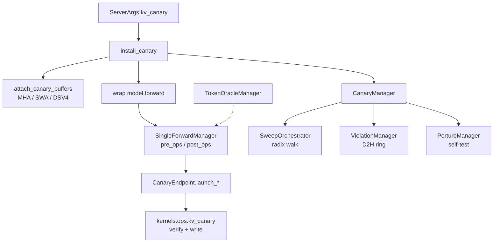

# `srt/kv_canary` — KV cache 完整性金丝雀

## Summary

[`python/sglang/srt/kv_canary/`](d:\design\sglang\python\sglang\srt\kv_canary) 约 **50** 个 `.py`，是生产可开关的 **KV 池完整性校验子系统**：在 `model.forward` 前后插入 verify/write CUDA kernel，检测 slot 复用错误、错误 token/position、real-KV 哈希漂移等。模式 `none|log|raise`（[`CanaryMode`](d:\design\sglang\python\sglang\srt\kv_canary\config.py)，[L16-L19](d:\design\sglang\python\sglang\srt\kv_canary\config.py)）；入口 [`install_canary`](d:\design\sglang\python\sglang\srt\kv_canary\api.py) 由 [`ModelRunner`](d:\design\sglang\python\sglang\srt\model_executor\model_runner.py) 调用（[api.py:30-100](d:\design\sglang\python\sglang\srt\kv_canary\api.py)、model_runner ~L831）。

> synthesis: 不是调试 dump 工具（对比 [`debug_utils`](debug_utils.md)），而是可挂在推理热路径上的 **online integrity monitor**；配套 `token_oracle` 采样后端与 `perturb` 自测注入。

## Sources

| 子系统 | 路径 | 角色 |
|---|---|---|
| 安装入口 | [`api.py`](d:\design\sglang\python\sglang\srt\kv_canary\api.py) | `install_canary` + patch `model.forward` |
| 配置 | [`config.py`](d:\design\sglang\python\sglang\srt\kv_canary\config.py) | `CanaryConfig` / `CanaryMode`（冻结 dataclass） |
| Endpoint | [`endpoint.py`](d:\design\sglang\python\sglang\srt\kv_canary\endpoint.py) | HEAD/TAIL/SWEEP × K/V × FULL/SWA 启动点 |
| Runner | [`runner/`](d:\design\sglang\python\sglang\srt\kv_canary\runner) | `CanaryManager`、sweep、violation、health、stats |
| Pool patcher | [`pool_patcher/`](d:\design\sglang\python\sglang\srt\kv_canary\pool_patcher) | 给 MHA/SWA/DSV4 池挂 canary buffer |
| Token oracle | [`token_oracle/`](d:\design\sglang\python\sglang\srt\kv_canary\token_oracle) | 确定性 expected token + sampler 后端 |
| Single forward | [`single_forward_manager/`](d:\design\sglang\python\sglang\srt\kv_canary\single_forward_manager) | 单次 `model.forward` 的 pre/post 状态机 |
| Perturb | [`perturb/`](d:\design\sglang\python\sglang\srt\kv_canary\perturb) | 故意破坏 KV / req_to_token 以自测 canary |
| 内核 | `sglang.kernels.ops.kv_canary.*` | `launch_canary_verify_kernel` / `launch_canary_write_kernel` |

## Architecture / Data flow

### api / config

- [`install_canary`](d:\design\sglang\python\sglang\srt\kv_canary\api.py)（[L30-L100](d:\design\sglang\python\sglang\srt\kv_canary\api.py)）：`CanaryMode.NONE` → 返回 `None`；否则断言 **非** piecewise cuda-graph prefill（[L40-L44](d:\design\sglang\python\sglang\srt\kv_canary\api.py)），`attach_canary_buffers`，构造 `CanaryManager`，`wrap_method(model, "forward", ...)`。
- [`CanaryConfig.from_env`](d:\design\sglang\python\sglang\srt\kv_canary\config.py)（[L62-L80](d:\design\sglang\python\sglang\srt\kv_canary\config.py)）：读 `server_args.kv_canary` / `kv_canary_sweep_interval` / `kv_canary_real_data` + env（`SGLANG_KV_CANARY_*`）。更深栈 **不再**读 env（[L24-L28](d:\design\sglang\python\sglang\srt\kv_canary\config.py)）。

### pool_patcher

- 注册表 `_POOL_ATTACHERS`：`MHATokenToKVPool` / `MHATokenToKVPoolFP4` → `attach_mha`；`SWAKVPool` → `attach_swa`；`DeepSeekV4TokenToKVPool` → `attach_dsv4`（[pool_patcher/api.py:26-31](d:\design\sglang\python\sglang\srt\kv_canary\pool_patcher\api.py)）。
- 未注册池类 → `NotImplementedError`（[L51-L55](d:\design\sglang\python\sglang\srt\kv_canary\pool_patcher\api.py)）。
- Draft worker：`kv_token_id_vs_position_offset=1`（EAGLE input_ids 旋转）（[api.py:48-56](d:\design\sglang\python\sglang\srt\kv_canary\api.py)）。

### endpoint

- [`CanaryEndpoint`](d:\design\sglang\python\sglang\srt\kv_canary\endpoint.py)：`launch_per_forward` = verify + write；`launch_sweep` 仅 verify（[L40-L111](d:\design\sglang\python\sglang\srt\kv_canary\endpoint.py)）。
- Layout：FULL/SWA 各 6 tag（HEAD/TAIL/SWEEP × K/V）（[L166-L183](d:\design\sglang\python\sglang\srt\kv_canary\endpoint.py)）。

### runner / CanaryManager

- [`CanaryManager`](d:\design\sglang\python\sglang\srt\kv_canary\runner\canary_manager.py) 聚合：device state、endpoints、`ViolationManager`、`SweepOrchestrator`、`PerturbManager`、`KernelRunCounterHealthChecker`、`PeriodicCanaryStatsLogger`、多个 `SingleForwardManager`（spec steps）（[L42-L149](d:\design\sglang\python\sglang\srt\kv_canary\runner\canary_manager.py)）。
- 独立 `torch.cuda.Stream` 做 D2H（[L93](d:\design\sglang\python\sglang\srt\kv_canary\runner\canary_manager.py)）。
- Warmup 期间关闭 chain-position assert（[L75-L77](d:\design\sglang\python\sglang\srt\kv_canary\runner\canary_manager.py)）。

### single_forward_manager

- [`SingleForwardManager`](d:\design\sglang\python\sglang\srt\kv_canary\single_forward_manager\manager.py) 拥有一次 inner `model.forward` 的相位（`IDLE → AFTER_PRE_* → AFTER_POST_*`）（[L37-L41](d:\design\sglang\python\sglang\srt\kv_canary\single_forward_manager\manager.py)、[L58-L59](d:\design\sglang\python\sglang\srt\kv_canary\single_forward_manager\manager.py)）。
- Nested `model.forward` 只允许最外层跑 canary（[api.py:105-110](d:\design\sglang\python\sglang\srt\kv_canary\api.py)）。

### token_oracle

- [`TokenOracleManager.fill_expected_inputs`](d:\design\sglang\python\sglang\srt\kv_canary\token_oracle\oracle_manager.py)（[L18-L47](d:\design\sglang\python\sglang\srt\kv_canary\token_oracle\oracle_manager.py)）：extend 用真实 `input_ids`；decode 用 oracle。
- [`install_token_oracle_from_env`](d:\design\sglang\python\sglang\srt\kv_canary\token_oracle\install.py)：仅当 `sampling_backend == "token_oracle"` 安装；注册 `_OracleSampler`（[sampler.py](d:\design\sglang\python\sglang\srt\kv_canary\token_oracle\sampler.py)）。
- `server_args` 把 `"token_oracle"` 加入 `SAMPLING_BACKEND_CHOICES`（[server_args.py:113](d:\design\sglang\python\sglang\srt\server_args.py)）。

### perturb

- [`PerturbManager`](d:\design\sglang\python\sglang\srt\kv_canary\perturb\manager.py)：`perturb_req_to_token` / `perturb_real_kv_used` / `perturb_real_kv_unused_cache` / post-forward 路径（[L47-L61](d:\design\sglang\python\sglang\srt\kv_canary\perturb\manager.py)）；用于 canary 自测，非生产默认路径。

## Key APIs / Entities

| 名称 | 位置 | 作用 |
|---|---|---|
| `install_canary` | [api.py:30-100](d:\design\sglang\python\sglang\srt\kv_canary\api.py) | 安装入口 |
| `CanaryConfig` / `CanaryMode` | [config.py:16-80](d:\design\sglang\python\sglang\srt\kv_canary\config.py) | 冻结配置 |
| `CanaryManager` | [runner/canary_manager.py:42+](d:\design\sglang\python\sglang\srt\kv_canary\runner\canary_manager.py) | 顶层编排 |
| `CanaryEndpoint` | [endpoint.py:30-129](d:\design\sglang\python\sglang\srt\kv_canary\endpoint.py) | 单 buffer × half 的 kernel 发射 |
| `attach_canary_buffers` | [pool_patcher/api.py:38-74](d:\design\sglang\python\sglang\srt\kv_canary\pool_patcher\api.py) | 池适配器分发 |
| `SingleForwardManager` | [single_forward_manager/manager.py:58+](d:\design\sglang\python\sglang\srt\kv_canary\single_forward_manager\manager.py) | 单 forward 生命周期 |
| `TokenOracleManager` | [token_oracle/oracle_manager.py:14+](d:\design\sglang\python\sglang\srt\kv_canary\token_oracle\oracle_manager.py) | expected token 填充 |
| `PerturbManager` | [perturb/manager.py:22+](d:\design\sglang\python\sglang\srt\kv_canary\perturb\manager.py) | 故障注入自测 |
| `SweepOrchestrator` | [runner/sweep.py](d:\design\sglang\python\sglang\srt\kv_canary\runner\sweep.py) | 周期 radix 全池扫描 |

## 使用方调用清单 / 跨子系统引用

1. **跨语言绑定**：Python 调 `sglang.kernels.ops.kv_canary.{verify,write,consts}`（见 [endpoint.py:8-21](d:\design\sglang\python\sglang\srt\kv_canary\endpoint.py)）。C++ entity 名 `kv_canary`：在本 pin 的 `d:\design\sglang\python\sglang\srt\` 外无独立 `sgl-kernel` 树检出；内核入口以 `kernels.ops` Python 绑定为准。
2. **协作伙伴**：
   - [`ModelRunner.init_token_oracle` / `install_canary`](d:\design\sglang\python\sglang\srt\model_executor\model_runner.py)（~L724-L834）
   - [`ForwardBatch`](d:\design\sglang\python\sglang\srt\model_executor\forward_batch_info.py) import `req_to_expected_token_ids_manager`
   - [`mem_cache` SWA / MHA / DSV4 pools](d:\design\sglang\python\sglang\srt\mem_cache) + `walk_for_kv_canary`（`unified_tree_core.py`）
   - Spec：[`eagle_worker_v2`](d:\design\sglang\python\sglang\srt\speculative\eagle_worker_v2.py) import `context_tuple`；[`dspark_*`](d:\design\sglang\python\sglang\srt\speculative\dspark_components) 复用 `FutureTensors` / `DelayedDeviceHostHandler`
3. **配置**：`ServerArgs.kv_canary` / `kv_canary_real_data` / `kv_canary_sweep_interval`（[server_args.py:3297-3308](d:\design\sglang\python\sglang\srt\server_args.py)）；env `SGLANG_KV_CANARY_*`（[config.py:74-79](d:\design\sglang\python\sglang\srt\kv_canary\config.py)）。
4. **测试**：`violation_reporter.py` 注释指向 `python/sglang/test/kv_canary/*`（[violation_reporter.py:111-112](d:\design\sglang\python\sglang\srt\kv_canary\runner\violation_reporter.py)）；本 checkout **无** `python/sglang/test/` 目录，故完整测试文件列表：在检出树内不可枚举。
5. **doc**：`kv_canary` / `kv-canary`：在 `d:\design\sglang\docs\` 全树 grep 0 命中。

## Notes / Caveats

- Piecewise cuda-graph prefill 与当前 `SingleForwardManager` **不兼容**（[api.py:40-44](d:\design\sglang\python\sglang\srt\kv_canary\api.py)）。
- `log` 模式生产可观测；`raise` 供 CI（[config.py:31-33](d:\design\sglang\python\sglang\srt\kv_canary\config.py)）。
- `future_tensor` 被 speculative DSpark 复用——命名上属 canary，语义上是通用 delayed D2H helper。

## See also

- [sglang/modules/mem_cache.md](mem_cache.md)
- [sglang/topics/kv-cache.md](../topics/kv-cache.md)
- [sglang/modules/model_executor.md](model_executor.md)
- [sglang/modules/speculative.md](speculative.md)
- [sglang/modules/debug_utils.md](debug_utils.md)
- [sglang/overview.md](../overview.md)
