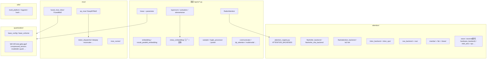

# `srt/layers` — 推理侧 NN 层与内核子系统矩阵

## Summary

[`d:\design\sglang\python\sglang\srt\layers\`](d:\design\sglang\python\sglang\srt\layers\) 是 SGLang **`srt` 中体量最大的 Python 子树之一**（本工作区 Glob `**/*.py`：**248** 个文件；既有 wiki 推断 252 — 加 VERIFY）。它把 **通用 `nn.Module` 层**（RMSNorm、并行 Linear、Embedding、RadixAttention、RoPE、Sampler 等）与 **四大内核向量子目录**——[`attention/`](d:\design\sglang\python\sglang\srt\layers\attention)、[`moe/`](d:\design\sglang\python\sglang\srt\layers\moe)、[`quantization/`](d:\design\sglang\python\sglang\srt\layers\quantization)、[`rotary_embedding/`](d:\design\sglang\python\sglang\srt\layers\rotary_embedding) 及 [`utils/`](d:\design\sglang\python\sglang\srt\layers\utils)——组合成可插拔矩阵：

- **注意力后端**由 [`ATTENTION_BACKENDS`](d:\design\sglang\python\sglang\srt\layers\attention\attention_registry.py) 注册表 + [`ServerArgs.attention_backend`](d:\design\sglang\python\sglang\srt\server_args.py) 选择
- **MoE EP/A2A** 由 [`moe_a2a_backend`](d:\design\sglang\python\sglang\srt\server_args.py) + [`DeepEPMoE`](d:\design\sglang\python\sglang\srt\layers\moe\ep_moe\layer.py) / [`FusedMoE`](d:\design\sglang\python\sglang\srt\layers\moe\fused_moe_triton\layer.py) 等实现
- **量化**走 [`QuantizationConfig.get_quant_method` → `QuantizeMethodBase.apply`](d:\design\sglang\python\sglang\srt\layers\quantization\base_config.py) 与可选 [`process_weights_after_loading`](d:\design\sglang\python\sglang\srt\layers\quantization\base_config.py)

大量热点路径同时依赖 **`sgl_kernel` C++/CUDA 绑定**与 **Triton `@triton.jit`**。

## Sources

| 区域 | 锚点 |
|---|---|
| 注意力注册表 | [`attention_registry.py:20-28`](d:\design\sglang\python\sglang\srt\layers\attention\attention_registry.py) `ATTENTION_BACKENDS` / `register_attention_backend`；[`attention_registry.py:31-271`](d:\design\sglang\python\sglang\srt\layers\attention\attention_registry.py) 各 `create_*_backend` |
| FlashInfer 后端入口 | [`flashinfer_backend.py:114-150`](d:\design\sglang\python\sglang\srt\layers\attention\flashinfer_backend.py) `FlashInferAttnBackend.__init__` |
| RadixAttention | [`radix_attention.py:47-135`](d:\design\sglang\python\sglang\srt\layers\radix_attention.py) `RadixAttention` / `forward` |
| LayerNorm / RMSNorm | [`layernorm.py:23-67`](d:\design\sglang\python\sglang\srt\layers\layernorm.py) batch-invariant + `sgl_kernel` 融合算子导入 |
| 并行 Linear 家族 | [`linear.py:1-150`](d:\design\sglang\python\sglang\srt\layers\linear.py) 文件头 vLLM 血缘 + `LinearBase` + `WEIGHT_LOADER_V2_SUPPORTED` |
| RoPE 工厂 | [`factory.py:63-100`](d:\design\sglang\python\sglang\srt\layers\rotary_embedding\factory.py) `get_rope` |
| 量化抽象 | [`base_config.py:18-41`](d:\design\sglang\python\sglang\srt\layers\quantization\base_config.py) `QuantizeMethodBase.apply` / `process_weights_after_loading` |
| MoE | [`fused_moe.py:50-66`](d:\design\sglang\python\sglang\srt\layers\moe\fused_moe_triton\fused_moe.py) `sgl_kernel` 激活融合；[`ep_moe/layer.py:70-74`](d:\design\sglang\python\sglang\srt\layers\moe\ep_moe\layer.py) `DeepEPMoE(FusedMoE)` |
| TBO 包装注意力 | [`tbo_backend.py:13-24`](d:\design\sglang\python\sglang\srt\layers\attention\tbo_backend.py) `TboAttnBackend` 组合子后端 |
| CLI | [`server_args.py:528-530`](d:\design\sglang\python\sglang\srt\server_args.py) `moe_a2a_backend` Literal；[`server_args.py:479-481`](d:\design\sglang\python\sglang\srt\server_args.py) `attention_backend` 等字段；[`server_args.py:4161`](d:\design\sglang\python\sglang\srt\server_args.py) `--quantization` 参数 |

## Architecture / Data flow

- **层组合**：典型模式为 `torch.nn.Module`，`forward` 返回 `Tensor`；[`RadixAttention.forward`](d:\design\sglang\python\sglang\srt\layers\radix_attention.py) 在非 extend piecewise 路径上调用 `forward_batch.attn_backend.forward(...)`（[L127-135](d:\design\sglang\python\sglang\srt\layers\radix_attention.py)）。
- **TBO**：[`TboAttnBackend`](d:\design\sglang\python\sglang\srt\layers\attention\tbo_backend.py) **不是** `ATTENTION_BACKENDS` 里的名字字符串，而是 **包装** 一个 primary 与两个 child [`AttentionBackend`](d:\design\sglang\python\sglang\srt\layers\attention\tbo_backend.py)，与 [`two_batch_overlap`](d:\design\sglang\python\sglang\srt\batch_overlap\two_batch_overlap.py) 协同。

## File inventory（按子系统聚合）

> 仅聚合 **子目录**；不逐文件枚举。计数来自本工作区 Glob `d:\design\sglang\python\sglang\srt\layers\**\*.py`。

| 分组 | `.py` 数量（本仓库快照） | 职责摘要 | 代表性锚点 |
|---|---:|---|---|
| **顶层** `layers/*.py`（不含子目录） | **31** | 并行 Linear、RadixAttention、Sampler、DP attention、多模态辅助等 | [`radix_attention.py`](d:\design\sglang\python\sglang\srt\layers\radix_attention.py)、[`linear.py`](d:\design\sglang\python\sglang\srt\layers\linear.py)、[`sampler.py`](d:\design\sglang\python\sglang\srt\layers\sampler.py) |
| **`attention/`** | **94** | 注意力后端实现、Triton 扩展算子、NSA、Mamba/FLA 线性注意力、vision 辅助等 | [`attention_registry.py`](d:\design\sglang\python\sglang\srt\layers\attention\attention_registry.py)、[`flashinfer_backend.py`](d:\design\sglang\python\sglang\srt\layers\attention\flashinfer_backend.py)、[`triton_ops/`](d:\design\sglang\python\sglang\srt\layers\attention\triton_ops) |
| **`quantization/`** | **66** | 多方案量化 Linear/MoE/KV；compressed-tensors、ModelSlim、Quark 等子包 | [`base_config.py`](d:\design\sglang\python\sglang\srt\layers\quantization\base_config.py)、[`fp8.py`](d:\design\sglang\python\sglang\srt\layers\quantization\fp8.py) |
| **`moe/`** | **42** | FusedMoE、DeepEPMoE、token 调度、top-k、Cutlass/Marlin 变体、moe_runner | [`fused_moe_triton/layer.py`](d:\design\sglang\python\sglang\srt\layers\moe\fused_moe_triton\layer.py)、[`ep_moe/layer.py`](d:\design\sglang\python\sglang\srt\layers\moe\ep_moe\layer.py)、[`token_dispatcher/`](d:\design\sglang\python\sglang\srt\layers\moe\token_dispatcher) |
| **`rotary_embedding/`** | **9** | RoPE 基类、M-RoPE、YaRN、多模型缩放变体、Triton RoPE | [`factory.py`](d:\design\sglang\python\sglang\srt\layers\rotary_embedding\factory.py)、[`base.py`](d:\design\sglang\python\sglang\srt\layers\rotary_embedding\base.py) |
| **`utils/`** | **6** | 跨平台算子封装、logprob、hash、CP 辅助 | [`multi_platform.py`](d:\design\sglang\python\sglang\srt\layers\utils\multi_platform.py) |
| **合计** | **248** | — | — |

**顶层子目录个数（直接子文件夹）**：**5**（`attention/`、`moe/`、`quantization/`、`rotary_embedding/`、`utils/`）。

## Top-level 模块表（精选）

| 模块 / 类 | 文件 | 作用 |
|---|---|---|
| **RMSNorm / LayerNorm 融合** | [`layernorm.py`](d:\design\sglang\python\sglang\srt\layers\layernorm.py) | 对接 [`batch_invariant_ops`](batch_invariant_ops.md)（[L23-26](d:\design\sglang\python\sglang\srt\layers\layernorm.py)）；CUDA 上 `sgl_kernel` RMSNorm（[L62-67](d:\design\sglang\python\sglang\srt\layers\layernorm.py)）；可选 FlashInfer / aiter / ROCm 路径 |
| **Linear 家族** | [`linear.py`](d:\design\sglang\python\sglang\srt\layers\linear.py) | 继承结构源自 vLLM（[L1](d:\design\sglang\python\sglang\srt\layers\linear.py)）；维护量化方法白名单 `WEIGHT_LOADER_V2_SUPPORTED`（[L55-76](d:\design\sglang\python\sglang\srt\layers\linear.py)） |
| **`RadixAttention`** | [`radix_attention.py`](d:\design\sglang\python\sglang\srt\layers\radix_attention.py) | 构造期 `quant_config.get_quant_method`（[L89-92](d:\design\sglang\python\sglang\srt\layers\radix_attention.py)）；`forward` 委托 `attn_backend`（[L127-135](d:\design\sglang\python\sglang\srt\layers\radix_attention.py)） |
| **RoPE** | [`rotary_embedding/factory.py`](d:\design\sglang\python\sglang\srt\layers\rotary_embedding\factory.py) | [`get_rope`](d:\design\sglang\python\sglang\srt\layers\rotary_embedding\factory.py) 聚合多种缩放实现（[L63-73](d:\design\sglang\python\sglang\srt\layers\rotary_embedding\factory.py)） |
| **Sampler** | [`sampler.py`](d:\design\sglang\python\sglang\srt\layers\sampler.py) | 采样算子（wiki 主叙事见 [sampling.md](sampling.md)） |
| **`TboAttnBackend`** | [`attention/tbo_backend.py`](d:\design\sglang\python\sglang\srt\layers\attention\tbo_backend.py) | 两 batch overlap 的注意力包装（[L13-24](d:\design\sglang\python\sglang\srt\layers\attention\tbo_backend.py)） |

> 其他顶层文件：[`embedding.py`](d:\design\sglang\python\sglang\srt\layers\embedding.py)、[`vocab_parallel_embedding.py`](d:\design\sglang\python\sglang\srt\layers\vocab_parallel_embedding.py)、[`activation.py`](d:\design\sglang\python\sglang\srt\layers\activation.py)、[`communicator.py`](d:\design\sglang\python\sglang\srt\layers\communicator.py)、[`parameter.py`](d:\design\sglang\python\sglang\srt\layers\parameter.py)、[`dp_attention.py`](d:\design\sglang\python\sglang\srt\layers\dp_attention.py)、[`logits_processor.py`](d:\design\sglang\python\sglang\srt\layers\logits_processor.py)、[`pooler.py`](d:\design\sglang\python\sglang\srt\layers\pooler.py)、`mamba_*.py` 等。

## `attention/` 子系统：后端矩阵

### `ATTENTION_BACKENDS` 注册名（共 **17** 项）

下列名称由 [`@register_attention_backend("...")`](d:\design\sglang\python\sglang\srt\layers\attention\attention_registry.py) 填入 [`ATTENTION_BACKENDS`](d:\design\sglang\python\sglang\srt\layers\attention\attention_registry.py)：

| # | CLI / 注册名 | 工厂入口 |
|---:|---|---|
| 1 | `flashinfer` | `create_flashinfer_backend` |
| 2 | `trtllm_mla` | `create_trtllm_mla_backend` |
| 3 | `aiter` | `create_aiter_backend` |
| 4 | `wave` | `create_wave_backend` |
| 5 | `ascend` | `create_ascend_backend`（委托 `hardware_backend`） |
| 6 | `nsa` | `create_nsa_backend` |
| 7 | `triton` | `create_triton_backend`（可转 `DoubleSparseAttnBackend`） |
| 8 | `torch_native` | `create_torch_native_backend` |
| 9 | `flex_attention` | `create_flex_attention_backend` |
| 10 | `flashmla` | `create_flashmla_backend` |
| 11 | `fa3` | `create_flashattention_v3_backend` |
| 12 | `fa4` | `create_flashattention_v4_backend` |
| 13 | `cutlass_mla` | `create_cutlass_mla_backend` |
| 14 | `trtllm_mha` | `create_trtllm_mha_backend` |
| 15 | `intel_amx` | `create_intel_amx_backend` |
| 16 | `dual_chunk_flash_attn` | `create_dual_chunk_flash_attn_backend` |
| 17 | `intel_xpu` | `create_intel_xpu_backend` |

**补充**：[`attn_backend_wrapper`](d:\design\sglang\python\sglang\srt\layers\attention\attention_registry.py) 在 hybrid / Mamba / GDN / KDA / Lightning 等场景组装 [`HybridLinearAttnBackend`](d:\design\sglang\python\sglang\srt\layers\attention\attention_registry.py)（[L199-261](d:\design\sglang\python\sglang\srt\layers\attention\attention_registry.py)）。

**FlashInfer 后端类**：[`FlashInferAttnBackend`](d:\design\sglang\python\sglang\srt\layers\attention\flashinfer_backend.py) 使用 FlashInfer batch decode/prefill wrapper（[L114-150](d:\design\sglang\python\sglang\srt\layers\attention\flashinfer_backend.py)）。

## `moe/` 子系统

- **核心模块类**：[`FusedMoE`](d:\design\sglang\python\sglang\srt\layers\moe\fused_moe_triton\layer.py)（[L138](d:\design\sglang\python\sglang\srt\layers\moe\fused_moe_triton\layer.py)）；[`DeepEPMoE(FusedMoE)`](d:\design\sglang\python\sglang\srt\layers\moe\ep_moe\layer.py)（[L70](d:\design\sglang\python\sglang\srt\layers\moe\ep_moe\layer.py)）。
- **融合算子**：[`inplace_fused_experts`](d:\design\sglang\python\sglang\srt\layers\moe\fused_moe_triton\fused_moe.py) 在 CUDA/HIP 上导入 `sgl_kernel` 的 `gelu_and_mul` / `silu_and_mul` 等（[L50-55](d:\design\sglang\python\sglang\srt\layers\moe\fused_moe_triton\fused_moe.py)）。
- **A2A 后端枚举（ServerArgs）**：[`moe_a2a_backend: Literal["none", "deepep", "mooncake", "nixl", "mori", "ascend_fuseep", "flashinfer"]`](d:\design\sglang\python\sglang\srt\server_args.py)（[L528-530](d:\design\sglang\python\sglang\srt\server_args.py)）——共 **7** 个字符串取值（含 `"none"`）。
- **调度**：[`token_dispatcher/`](d:\design\sglang\python\sglang\srt\layers\moe\token_dispatcher) 含 [`deepep.py`](d:\design\sglang\python\sglang\srt\layers\moe\token_dispatcher\deepep.py) 中 [`DeepEPDispatcher`](d:\design\sglang\python\sglang\srt\layers\moe\token_dispatcher\deepep.py) 等。

## `quantization/` 子系统

- **抽象**：[`QuantizeMethodBase.apply`](d:\design\sglang\python\sglang\srt\layers\quantization\base_config.py) / [`process_weights_after_loading`](d:\design\sglang\python\sglang\srt\layers\quantization\base_config.py)（[L29-41](d:\design\sglang\python\sglang\srt\layers\quantization\base_config.py)）。
- **体量**：**66** 个 `.py` 文件（Glob），覆盖 FP8/INT8/AWQ/GPTQ/GGUF、[`compressed_tensors/`](d:\design\sglang\python\sglang\srt\layers\quantization\compressed_tensors)、[`modelslim/`](d:\design\sglang\python\sglang\srt\layers\quantization\modelslim)、[`quark/`](d:\design\sglang\python\sglang\srt\layers\quantization\quark) 等子包。
- **与加载管线**：交叉引用 [model_loader.md](model_loader.md) 中关于 `process_weights_after_loading` 的叙事。

## Triton：`@triton.jit` 抽样统计

- **覆盖范围**：在 `layers/` 下，`@triton.jit` 出现于 **60** 个 `.py` 文件（2026-04-19 复测；累计出现 **≈176** 次）。
- **高密度文件示例**：[`moe/ep_moe/kernels.py`](d:\design\sglang\python\sglang\srt\layers\moe\ep_moe\kernels.py)（rg 报告 **21** 处）、[`attention/utils.py`](d:\design\sglang\python\sglang\srt\layers\attention\utils.py)（**11** 处）、[`quantization/fp8_kernel.py`](d:\design\sglang\python\sglang\srt\layers\quantization\fp8_kernel.py)（**12** 处）。
- **`attention/triton_ops/`**：**7** 个文件（Glob），命名型 prefill/decode/extend/double_sparsity 等内核。

## `sgl_kernel` C++ 绑定消费模式

- **import 规模**：`from sgl_kernel import` 在 `layers/` 内命中 **33** 个 `.py`（`files_with_matches`）。
- **示例路径**：
  - [`layernorm.py:62-67`](d:\design\sglang\python\sglang\srt\layers\layernorm.py) `rmsnorm` / `fused_add_rmsnorm` 等；
  - [`moe/fused_moe_triton/fused_moe.py:50-55`](d:\design\sglang\python\sglang\srt\layers\moe\fused_moe_triton\fused_moe.py) MoE 激活融合；
  - [`quantization/fp8_kernel.py`](d:\design\sglang\python\sglang\srt\layers\quantization\fp8_kernel.py)、[`activation.py`](d:\design\sglang\python\sglang\srt\layers\activation.py) 等。

## CLI 交叉引用（ServerArgs）

| 参数 / 字段 | 锚点 |
|---|---|
| `attention_backend` / `decode_attention_backend` / `prefill_attention_backend` | [server_args.py:479-481](d:\design\sglang\python\sglang\srt\server_args.py) |
| `moe_a2a_backend` | [server_args.py:528-530](d:\design\sglang\python\sglang\srt\server_args.py) |
| `quantization` | [server_args.py:332](d:\design\sglang\python\sglang\srt\server_args.py)、[server_args.py:4161](d:\design\sglang\python\sglang\srt\server_args.py) `--quantization` |
| `moe_runner_backend` | [server_args.py:531](d:\design\sglang\python\sglang\srt\server_args.py) |

## §跨子系统（§5 step 3）五路检索摘要

1. **`sgl-kernel`**：见上节 **`sgl_kernel` import**；热点为 LayerNorm、MoE、FP8/INT8、部分 attention 路径。
2. **协作 import**：`srt/models/` 下大量模型文件 `from sglang.srt.layers...`（示例：`deepseek_v2.py` **26** 行命中、[`bailing_moe_linear.py`](d:\design\sglang\python\sglang\srt\models\bailing_moe_linear.py) **21** 行等）。
3. **`model_executor/`**：[`model_runner.py`](d:\design\sglang\python\sglang\srt\model_executor\model_runner.py) **14** 行、[`forward_batch_info.py`](d:\design\sglang\python\sglang\srt\model_executor\forward_batch_info.py) **6** 行等。
4. **`batch_overlap/`**：[`two_batch_overlap.py`](d:\design\sglang\python\sglang\srt\batch_overlap\two_batch_overlap.py) **9** 行命中；与 [`TboAttnBackend`](d:\design\sglang\python\sglang\srt\layers\attention\tbo_backend.py) 直接 import 关联。
5. **测试**：[`d:\design\sglang\test\registered\unit\layers\`](d:\design\sglang\test\registered\unit\layers)、[`d:\design\sglang\test\registered\layers\`](d:\design\sglang\test\registered\layers)（含 `mamba/`）、[`d:\design\sglang\test\manual\layers\`](d:\design\sglang\test\manual\layers)（MoE / NSA 手动测）。

> **说明**：`srt/sampling/` 目录下 **未** grep 到 `from sglang.srt.layers`（本快照）；采样 wiki 仍应链至顶层 [`layers/sampler.py`](d:\design\sglang\python\sglang\srt\layers\sampler.py)。

## Notes / Caveats

> [!todo] VERIFY: pin 从 `34fef07a` → `06f32bab`（2026-08-10 increment）后本页未深 verify；文件数量/行号可能漂移。优先对照 [entities/Scheduler.md](../entities/Scheduler.md) / 新模块页。

> [!todo] VERIFY: ~~本工作区 `layers/**/*.py` **Glob 计数为 248**，与既有 wiki 推断的 **252** 不一致；请用上游 commit `34fef07a` 重新对齐。~~
> **RESOLVED 2026-04-19**: 复测 Glob `d:\design\sglang\python\sglang\srt\layers\**\*.py` = **248**（[d:\design\sglang\python\sglang\srt\layers](d:\design\sglang\python\sglang\srt\layers)）；"252" 为旧 wiki 推断，应以本快照 248 为准。

> [!todo] VERIFY: ~~`@triton.jit` **总出现次数**需对全树 `rg -c` 求和；本页仅给出 **文件数 71** 与高密度文件样例。~~
> **RESOLVED 2026-04-19**: 复测 Grep `@triton\.jit` 计数 — 命中 **60 个 `.py` 文件**（不是先前估计的 71；旧值偏高），所有文件出现次数累加 **≈176** 次（高密度仍由 [moe/ep_moe/kernels.py:21](d:\design\sglang\python\sglang\srt\layers\moe\ep_moe\kernels.py)、[quantization/fp8_kernel.py:12](d:\design\sglang\python\sglang\srt\layers\quantization\fp8_kernel.py)、[attention/utils.py:11](d:\design\sglang\python\sglang\srt\layers\attention\utils.py) 三文件领跑）。

> synthesis: **`tbo`** 并非 `ATTENTION_BACKENDS` 注册键；其为 **包装器** `TboAttnBackend`，与 **two-batch overlap** 调度协同。

## Cross-project synthesis（vs vLLM `vllm/model_executor/layers/`）

> synthesis: 多处源码显式标注 **Adapted from vLLM**（例如 [`linear.py:1`](d:\design\sglang\python\sglang\srt\layers\linear.py)、[`fused_moe.py:2`](d:\design\sglang\python\sglang\srt\layers\moe\fused_moe_triton\fused_moe.py)、[`quantization/base_config.py:1`](d:\design\sglang\python\sglang\srt\layers\quantization\base_config.py)）。相对 vLLM，本树更强调 **SGLang 特有注意力后端矩阵**（FlashInfer、NSA、双 chunk、硬件分支）、**RadixAttention + mem_cache** 集成、以及 **`sgl_kernel` / Triton** 双轨内核；详细并列应以 `d:\design\vllm\vllm\model_executor\layers\` 实文件对照（见 [comparison/index.md](../../comparison/index.md)）。

## See also

- [sampling.md](sampling.md)（[`layers/sampler.py`](d:\design\sglang\python\sglang\srt\layers\sampler.py)）
- [model_loader.md](model_loader.md)（权重加载 / `process_weights_after_loading`）
- [batch_invariant_ops.md](batch_invariant_ops.md)（与 [`layernorm.py`](d:\design\sglang\python\sglang\srt\layers\layernorm.py) 交叉）
- [batch_overlap.md](batch_overlap.md)（`TboAttnBackend` 协同）
- [models.md](models.md)（消费方 — 模型实现矩阵）
- [hardware_backend.md](hardware_backend.md)（NPU 等设备分支与 `sgl_kernel_npu`）
- [constrained.md](constrained.md)、[lora.md](lora.md)
- [comparison/index.md](../../comparison/index.md)
