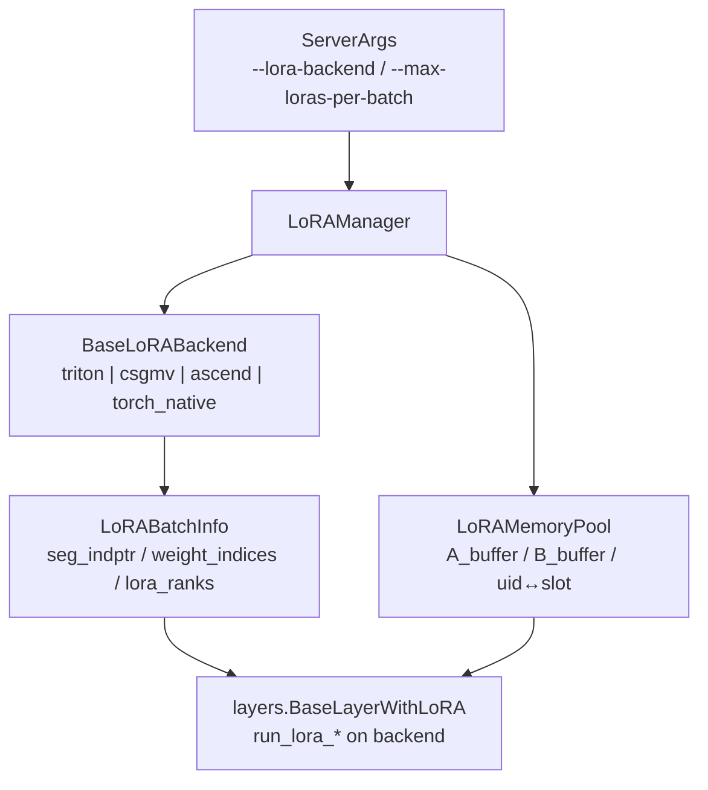

# `srt/lora` — 多适配器 LoRA 服务（S-LoRA / Punica 风格 SGMV）

## Summary

[`d:\design\sglang\python\sglang\srt\lora\`](d:\design\sglang\python\sglang\srt\lora)（**33** 个 `.py`，Glob 核对；**无**包级 `__init__.py`）实现 **同一 batch 内多 LoRA 适配器共 forward**：[`LoRAManager`](d:\design\sglang\python\sglang\srt\lora\lora_manager.py) 负责 **加载/卸载**、与 [`LoRAMemoryPool`](d:\design\sglang\python\sglang\srt\lora\mem_pool.py) 协同维护 **GPU 上固定槽位**的 A/B 权重缓冲；[`BaseLoRABackend`](d:\design\sglang\python\sglang\srt\lora\backend\base_backend.py) 子类执行 **分段 SGEMM（Triton `_sgemm_lora_*_kernel`）** 或 **Chunked SGMV（`_chunked_lora_shrink_kernel` / `_chunked_lora_expand_kernel`，文档注释指向 Punica 论文）**。文件头与注释写明融合 **S-LoRA** 与 **Punica** 思路（[`lora_manager.py:15-16`](d:\design\sglang\python\sglang\srt\lora\lora_manager.py)）。

**在线增删**：HTTP `/load_lora_adapter`、`/unload_lora_adapter` 经 `TokenizerManager` → `Scheduler` → `TpWorker` → [`ModelRunner.load_lora_adapter`](d:\design\sglang\python\sglang\srt\model_executor\model_runner.py)。**张量直灌**路径支持 `load_format == "flattened_bucket"`，在 [`tp_worker.load_lora_adapter_from_tensors`](d:\design\sglang\python\sglang\srt\managers\tp_worker.py) 反序列化后构造 [`FlattenedTensorBucket`](d:\design\sglang\python\sglang\srt\weight_sync\tensor_bucket.py) 并交给 `ModelRunner`。

## Sources

| 区域 | 锚点 |
|---|---|
| 编排入口 | [`lora_manager.py:53-327`](d:\design\sglang\python\sglang\srt\lora\lora_manager.py)（`LoRAManager` / `prepare_lora_batch` / `fetch_new_loras`） |
| 批元数据 | [`utils.py:11-49`](d:\design\sglang\python\sglang\srt\lora\utils.py)（`LoRABatchInfo`） |
| 内存池 | [`mem_pool.py:48-120`](d:\design\sglang\python\sglang\srt\lora\mem_pool.py)（`LoRAMemoryPool` 缓冲与 `uid_to_buffer_id`） |
| 后端注册 | [`backend/lora_registry.py:8-61`](d:\design\sglang\python\sglang\srt\lora\backend\lora_registry.py) |
| Triton 后端 | [`backend/triton_backend.py:22-110`](d:\design\sglang\python\sglang\srt\lora\backend\triton_backend.py) |
| Chunked SGMV | [`backend/chunked_backend.py:24-32`](d:\design\sglang\python\sglang\srt\lora\backend\chunked_backend.py)（Punica 引用） |
| SGEMM kernel | [`triton_ops/sgemm_lora_a.py:9-52`](d:\design\sglang\python\sglang\srt\lora\triton_ops\sgemm_lora_a.py) |
| Chunked shrink | [`triton_ops/chunked_sgmv_shrink.py:10-47`](d:\design\sglang\python\sglang\srt\lora\triton_ops\chunked_sgmv_shrink.py) |
| HTTP | [`http_server.py:1302-1339`](d:\design\sglang\python\sglang\srt\entrypoints\http_server.py) |
| TP 侧 flattened | [`tp_worker.py:187-208`](d:\design\sglang\python\sglang\srt\managers\tp_worker.py) |
| CLI | [`server_args.py:4905-4974`](d:\design\sglang\python\sglang\srt\server_args.py) |

## Architecture / Data flow

> synthesis: 一次 forward 前 [`prepare_lora_batch`](d:\design\sglang\python\sglang\srt\lora\lora_manager.py) 根据 `forward_batch.lora_ids` 写入 **每段的 `weight_indices`（池内槽位）** 与各槽 **rank/scaling**，再调用 `lora_backend.prepare_lora_batch`（[`lora_manager.py:300-327`](d:\design\sglang\python\sglang\srt\lora\lora_manager.py)）。这与 **「按 adapter 分组 + 分段矩阵乘」** 的 S-LoRA / SGMV 叙述一致（见 `LoRABatchInfo` 字段注释 [`utils.py:19-21`](d:\design\sglang\python\sglang\srt\lora\utils.py)）。

## File inventory（33 `.py`，按子目录）

| 分组 | 文件 | 职责摘要 |
|---|---|---|
| 根目录 | [`lora_manager.py`](d:\design\sglang\python\sglang\srt\lora\lora_manager.py) | `LoRAManager`：加载、批准备、`init_memory_pool` |
| 根目录 | [`lora.py`](d:\design\sglang\python\sglang\srt\lora\lora.py) | `LoRAAdapter`、权重组织 |
| 根目录 | [`lora_config.py`](d:\design\sglang\python\sglang\srt\lora\lora_config.py) | 从 HF 路径解析 rank / target modules |
| 根目录 | [`lora_registry.py`](d:\design\sglang\python\sglang\srt\lora\lora_registry.py) | `LoRARef` 等注册类型（与 `server_args` 协同） |
| 根目录 | [`layers.py`](d:\design\sglang\python\sglang\srt\lora\layers.py) | `*WithLoRA` 包装各并行 Linear / MoE / Embedding |
| 根目录 | [`mem_pool.py`](d:\design\sglang\python\sglang\srt\lora\mem_pool.py) | `LoRAMemoryPool`、驱逐、`prepare_lora_batch` |
| 根目录 | [`utils.py`](d:\design\sglang\python\sglang\srt\lora\utils.py) | `LoRABatchInfo`、维度与模块名工具 |
| 根目录 | [`eviction_policy.py`](d:\design\sglang\python\sglang\srt\lora\eviction_policy.py) | LRU / FIFO |
| 根目录 | [`lora_moe_runners.py`](d:\design\sglang\python\sglang\srt\lora\lora_moe_runners.py) | MoE 路径 LoRA hook / Triton 调用 |
| 根目录 | [`lora_moe_runner_marlin.py`](d:\design\sglang\python\sglang\srt\lora\lora_moe_runner_marlin.py) | Marlin 量化路径 |
| 根目录 | [`lora_overlap_loader.py`](d:\design\sglang\python\sglang\srt\lora\lora_overlap_loader.py) | `LoRAOverlapLoader` 异步 H2D 与 compute 重叠 |
| `backend/` | [`base_backend.py`](d:\design\sglang\python\sglang\srt\lora\backend\base_backend.py)、[`triton_backend.py`](d:\design\sglang\python\sglang\srt\lora\backend\triton_backend.py)、[`chunked_backend.py`](d:\design\sglang\python\sglang\srt\lora\backend\chunked_backend.py)、[`torch_backend.py`](d:\design\sglang\python\sglang\srt\lora\backend\torch_backend.py)、[`ascend_backend.py`](d:\design\sglang\python\sglang\srt\lora\backend\ascend_backend.py)、[`lora_registry.py`](d:\design\sglang\python\sglang\srt\lora\backend\lora_registry.py)、[`lmhead_mixing.py`](d:\design\sglang\python\sglang\srt\lora\backend\lmhead_mixing.py) | 后端抽象与设备特化 |
| `triton_ops/` | [`sgemm_lora_a.py`](d:\design\sglang\python\sglang\srt\lora\triton_ops\sgemm_lora_a.py) 等 + [`__init__.py`](d:\design\sglang\python\sglang\srt\lora\triton_ops\__init__.py) | 对外导出 `sgemm_lora_*_fwd`、`chunked_sgmv_*`、`fused_moe_lora` 等 |
| `triton_ops/csgmv_configs/` | `*.json`（非 `.py`） | H200 等设备上的 autotune 记录 |
| `torch_ops/` | [`lora_ops.py`](d:\design\sglang\python\sglang\srt\lora\torch_ops\lora_ops.py) | `torch_native` 后端用 CPU/GPU 参考实现 |

## `LoRAManager` 生命周期（节选）

| 阶段 / API | 作用 | 锚点 |
|---|---|---|
| 构造 | 选后端 `get_backend_from_name`、记录 `max_loras_per_batch` / overlap 等 | [`lora_manager.py:53-108`](d:\design\sglang\python\sglang\srt\lora\lora_manager.py) |
| `init_state` | `init_lora_adapters` → `init_lora_shapes` → `init_lora_modules` → **`init_memory_pool`** → `update_lora_info` | [`lora_manager.py:413-448`](d:\design\sglang\python\sglang\srt\lora\lora_manager.py) |
| `load_lora_adapter` | 校验 + `LoRAConfig` + `load_lora_weights` + 登记 `lora_refs` | [`lora_manager.py:151-186`](d:\design\sglang\python\sglang\srt\lora\lora_manager.py) |
| `unload_lora_adapter` | 从 `configs` / `loras` / `lora_refs` 删除 | [`lora_manager.py:228-251`](d:\design\sglang\python\sglang\srt\lora\lora_manager.py) |
| `fetch_new_loras` / `prepare_lora_batch` | 池内准备当前 batch 活跃适配器；写 `weight_indices` 与后端 `batch_info` | [`lora_manager.py:284-327`](d:\design\sglang\python\sglang\srt\lora\lora_manager.py) |
| `validate_lora_batch` | 批量中 adapter 数 ≤ `max_loras_per_batch`；pinned 与槽位约束 | [`lora_manager.py:253-282`](d:\design\sglang\python\sglang\srt\lora\lora_manager.py) |
| CUDA Graph | `init_cuda_graph_batch_info` / `init_cuda_graph_moe_buffers` | [`lora_manager.py:110-137`](d:\design\sglang\python\sglang\srt\lora\lora_manager.py) |

**状态（已加载适配器）**：`self.loras`、`self.configs`、`self.lora_refs`（[`lora_manager.py:151-178`](d:\design\sglang\python\sglang\srt\lora\lora_manager.py)）；**GPU 槽位映射**：`LoRAMemoryPool.uid_to_buffer_id` / `buffer_id_to_uid`（[`mem_pool.py:98-106`](d:\design\sglang\python\sglang\srt\lora\mem_pool.py)）。

## Backend matrix

| 注册名 | 类 | 说明 |
|---|---|---|
| `triton` | `TritonLoRABackend` | 分段 SGEMM：`sgemm_lora_a_fwd` / `sgemm_lora_b_fwd` 等（[`backend/triton_backend.py:7-12`](d:\design\sglang\python\sglang\srt\lora\backend\triton_backend.py)） |
| `csgmv` | `ChunkedSgmvLoRABackend` | Chunked SGMV + `--max-lora-chunk-size`（[`backend/chunked_backend.py:24-43`](d:\design\sglang\python\sglang\srt\lora\backend\chunked_backend.py)） |
| `ascend` | `AscendLoRABackend` | NPU 路径 |
| `torch_native` | `TorchNativeLoRABackend` | [`torch_ops/lora_ops.py`](d:\design\sglang\python\sglang\srt\lora\torch_ops\lora_ops.py) |
| `flashinfer` | — | **已弃用**：注册函数直接 `raise ValueError`（[`backend/lora_registry.py:47-51`](d:\design\sglang\python\sglang\srt\lora\backend\lora_registry.py)） |

**可运行后端实现类数量**：**4**（上表前四行；不含已弃用占位）。

CLI 可选集合：[`LORA_BACKEND_CHOICES = ["triton", "csgmv", "ascend", "torch_native"]`](d:\design\sglang\python\sglang\srt\server_args.py)（约 [`server_args.py:210`](d:\design\sglang\python\sglang\srt\server_args.py)）。

## Memory pool（`LoRAMemoryPool`）

- **缓冲结构**：`A_buffer` / `B_buffer` 按 target module 名映射到 **每层** 张量列表；注释说明形状含 `[num_loras, rank, hidden]` 或 MoE 4D（[`mem_pool.py:82-87`](d:\design\sglang\python\sglang\srt\lora\mem_pool.py)）。
- **槽位与驱逐**：`uid_to_buffer_id`、`buffer_id_to_uid` + `eviction_policy`（[`mem_pool.py:79-106`](d:\design\sglang\python\sglang\srt\lora\mem_pool.py)）。
- **batch 装配**：`prepare_lora_batch` 将 **当前 batch 需要的 uid** 映射进池（与 `fetch_new_loras` 配合，见 [`lora_manager.py:284-297`](d:\design\sglang\python\sglang\srt\lora\lora_manager.py)）。

## Online load / unload（HTTP + 调度）

| HTTP 路径 | 处理 | 锚点 |
|---|---|---|
| `POST /load_lora_adapter` | `tokenizer_manager.load_lora_adapter` | [`http_server.py:1302-1306`](d:\design\sglang\python\sglang\srt\entrypoints\http_server.py) |
| `POST /load_lora_adapter_from_tensors` | 支持张量直灌（含 flattened） | [`http_server.py:1320-1327`](d:\design\sglang\python\sglang\srt\entrypoints\http_server.py) |
| `POST /unload_lora_adapter` | 卸载名 | [`http_server.py:1335-1339`](d:\design\sglang\python\sglang\srt\entrypoints\http_server.py) |

调度器将 `LoadLoRAAdapterReqInput` 等映射到 TP worker（[`scheduler.py`](d:\design\sglang\python\sglang\srt\managers\scheduler.py) 中 `load_lora_adapter` 调用 `self.tp_worker.load_lora_adapter`）。

## `flattened_bucket` 与 `FlattenedTensorBucket`

[`tp_worker.load_lora_adapter_from_tensors`](d:\design\sglang\python\sglang\srt\managers\tp_worker.py)：`load_format == "flattened_bucket"` 时反序列化字典，构造 `FlattenedTensorBucket(flattened_tensor=..., metadata=...)`，再 `bucket.reconstruct_tensors()` → `model_runner.load_lora_adapter_from_tensors`（[`tp_worker.py:192-207`](d:\design\sglang\python\sglang\srt\managers\tp_worker.py)）。注释说明 LoRA 的 TP 切分由 `layers.slice_lora_*` / `mem_pool` 路径处理（同段注释）。

## sgl-kernel（C++ / CUDA）与 Triton：`lora` 检索结论

### C++ / CUDA（`d:\design\sglang\sgl-kernel\csrc\`）

对 `lora` / `LoRA` / `Lora` / `BatchedLoRA` 的检索中，**命中主要为 DeepSeek MLA 的 `q_lora_rank` / `kv_lora_rank` 维度**（例：[`sgl-kernel/csrc/cpu/qkv_proj.cpp`](d:\design\sglang\python\sglang\kernels\aot\csrc\cpu\qkv_proj.cpp) 大量 `q_lora_rank`），**并非** `srt/lora` 的 adapter serving kernel。

对 `sgmv|SGMV|bgmv|punica|BatchedLoRA`（大小写不敏感）在 `csrc` 下 **0 命中**。

**结论（source-anchored）**：**面向本模块的多 LoRA adapter 计算路径以 Python + Triton 为主**；**未在 `sgl-kernel/csrc` 中列出可绑定的独立「LoRA SGMV」CUDA kernel 名称**。若需「CUDA kernel 个数」用于对比 vLLM Punica，当前计为 **0**（adapter LoRA serving）。

### Triton：`@triton.jit` 内核（**13** 个）

| # | 函数名 | 文件 |
|---:|---|---|
| 1 | `_sgemm_lora_a_kernel` | [`triton_ops/sgemm_lora_a.py`](d:\design\sglang\python\sglang\srt\lora\triton_ops\sgemm_lora_a.py) |
| 2 | `_sgemm_lora_b_kernel` | [`triton_ops/sgemm_lora_b.py`](d:\design\sglang\python\sglang\srt\lora\triton_ops\sgemm_lora_b.py) |
| 3 | `_qkv_lora_b_kernel` | [`triton_ops/qkv_lora_b.py`](d:\design\sglang\python\sglang\srt\lora\triton_ops\qkv_lora_b.py) |
| 4 | `_gate_up_lora_b_kernel` | [`triton_ops/gate_up_lora_b.py`](d:\design\sglang\python\sglang\srt\lora\triton_ops\gate_up_lora_b.py) |
| 5 | `_embedding_lora_a_kernel` | [`triton_ops/embedding_lora_a.py`](d:\design\sglang\python\sglang\srt\lora\triton_ops\embedding_lora_a.py) |
| 6 | `_chunked_lora_shrink_kernel` | [`triton_ops/chunked_sgmv_shrink.py`](d:\design\sglang\python\sglang\srt\lora\triton_ops\chunked_sgmv_shrink.py) |
| 7 | `_chunked_lora_expand_kernel` | [`triton_ops/chunked_sgmv_expand.py`](d:\design\sglang\python\sglang\srt\lora\triton_ops\chunked_sgmv_expand.py) |
| 8 | `_chunked_embedding_lora_a_kernel` | [`triton_ops/chunked_embedding_lora_a.py`](d:\design\sglang\python\sglang\srt\lora\triton_ops\chunked_embedding_lora_a.py) |
| 9 | `_fused_moe_lora_kernel` | [`triton_ops/fused_moe_lora_kernel.py`](d:\design\sglang\python\sglang\srt\lora\triton_ops\fused_moe_lora_kernel.py) |
| 10 | `_fused_virtual_topk_ids_kernel` | [`triton_ops/virtual_experts.py`](d:\design\sglang\python\sglang\srt\lora\triton_ops\virtual_experts.py) |
| 11 | `_fused_sanitize_expert_ids_kernel` | 同上 |
| 12 | `_moe_lora_shrink_splitk_kernel` | 同上 |
| 13 | `_resolve_token_positions` | [`triton_ops/kernel_utils.py`](d:\design\sglang\python\sglang\srt\lora\triton_ops\kernel_utils.py) |

**对外导出**见 [`triton_ops/__init__.py`](d:\design\sglang\python\sglang\srt\lora\triton_ops\__init__.py)。

**精确命名（SGMV / BGMV）**：代码中使用 **「chunked SGMV」**、内核标识 `_chunked_lora_shrink_kernel` / `_chunked_lora_expand_kernel`；**未**使用字符串 `BGMV` 作为符号名。**Punica** 仅在 `ChunkedSgmvLoRABackend` 文档字符串出现（[`chunked_backend.py:26-30`](d:\design\sglang\python\sglang\srt\lora\backend\chunked_backend.py)）。

## CLI / `ServerArgs`（节选）

| 参数 | 锚点 | 说明 |
|---|---|---|
| `--enable-lora` | [`server_args.py:4905-4911`](d:\design\sglang\python\sglang\srt\server_args.py) | 显式开启；`--lora-paths` 时自动为 True |
| `--max-lora-rank` | [`server_args.py:4918-4923`](d:\design\sglang\python\sglang\srt\server_args.py) | 与池配置兼容 |
| `--lora-paths` | [`server_args.py:4934-4941`](d:\design\sglang\python\sglang\srt\server_args.py) | 初始加载列表 |
| `--max-loras-per-batch` | [`server_args.py:4942-4947`](d:\design\sglang\python\sglang\srt\server_args.py) | 默认可认为含 base-only |
| `--max-loaded-loras` | [`server_args.py:4948-4953`](d:\design\sglang\python\sglang\srt\server_args.py) | **CPU** 侧同时加载上限 |
| `--lora-backend` | [`server_args.py:4961-4967`](d:\design\sglang\python\sglang\srt\server_args.py) | 见 `LORA_BACKEND_CHOICES` |
| `--max-lora-chunk-size` | [`server_args.py:4968-4974`](d:\design\sglang\python\sglang\srt\server_args.py) | 仅 `csgmv` |
| `--enable-lora-overlap-loading` | [`server_args.py:4912-4917`](d:\design\sglang\python\sglang\srt\server_args.py) | 与 `LoRAOverlapLoader` 配合 |

## §跨子系统引用（§5 step 3）

### 1. sgl-kernel C++ / CUDA

见上文「sgl-kernel」小节：**0** 个可单独命名的 adapter-LoRA CUDA kernel；`lora` 字面命中需区分 MLA。

### 2. 协作 `import`（`srt/`，排除 `lora/` 自身）

| 文件 | 说明 |
|---|---|
| [`server_args.py`](d:\design\sglang\python\sglang\srt\server_args.py) | `from sglang.srt.lora.lora_registry import LoRARef` |
| [`model_executor/model_runner.py`](d:\design\sglang\python\sglang\srt\model_executor\model_runner.py) | `LoRAManager`、`LoRARef`、条件 import `FusedMoEWithLoRA` |
| [`managers/tokenizer_manager.py`](d:\design\sglang\python\sglang\srt\managers\tokenizer_manager.py) | `LoRARef` / `LoRARegistry` |
| [`managers/scheduler.py`](d:\design\sglang\python\sglang\srt\managers\scheduler.py) | `LoRAOverlapLoader` |
| [`managers/io_struct.py`](d:\design\sglang\python\sglang\srt\managers\io_struct.py) | `LoRARef` |
| [`layers/moe/moe_runner/runner.py`](d:\design\sglang\python\sglang\srt\layers\moe\moe_runner\runner.py) | `LoRAHooks` / Marlin 路径 |

`entrypoints/` **无**直接 `from sglang.srt.lora`（HTTP 经 `tokenizer_manager`）。

### 3. 测试（`d:\design\sglang\test\`）

对 `lora`（`-i`）在 `test/**/*.py`：**46** 个文件命中。显式 `LoRAManager` 字符串：**1** 文件 [`test/registered/lora/test_lora_overlap_loading.py`](d:\design\sglang\test\registered\lora\test_lora_overlap_loading.py)。

专项：[`test/manual/lora/test_lora_spec_decoding.py`](d:\design\sglang\test\manual\lora\test_lora_spec_decoding.py) 用 `use_spec_decoding=True`（L27-33）。

### 4. 文档（`d:\design\sglang\docs\`）

- [`docs/index.rst`](d:\design\sglang\docs\index.rst) 列出 `advanced_features/lora.ipynb`。
- 平台特性表含 LoRA 参数（例：[`docs/platforms/ascend/ascend_npu_support_features.md`](d:\design\sglang\docs\platforms\ascend\ascend_npu_support_features.md) §LoRA）。

## Notes / Caveats

> [!todo] VERIFY: pin 从 `34fef07a` → `06f32bab`（2026-08-10 increment）后本页未深 verify；文件数量/行号可能漂移。优先对照 [entities/Scheduler.md](../entities/Scheduler.md) / 新模块页。

> [!todo] VERIFY: **PD 分离 / overlap scheduler** 与 LoRA 的交互需结合 `scheduler` 全文件与 PD 专题页交叉阅读；本稿仅确认 `LoRAOverlapLoader` 在 [`scheduler.py`](d:\design\sglang\python\sglang\srt\managers\scheduler.py) 被引用。

> [!warning] CONTRADICTION（命名）: 代码与注释混用 **SGMV / segmented GEMM / chunked SGMV**；**BGMV** 作为 vLLM/Punica 社区常用缩写 **未** 在 `srt/lora` 内核名中出现——对比他栈时需对齐 **实际符号**（上表 13 个 Triton 内核）。

> [!warning] CONTRADICTION（弃用）: ~~`flashinfer` 后端仍注册但 **直接抛错**（[`backend/lora_registry.py:47-51`](d:\design\sglang\python\sglang\srt\lora\backend\lora_registry.py)），与「可选后端」直觉不符。~~
> **RESOLVED 2026-04-19**: 已确认这是上游有意保留的"已弃用占位"（用 `raise ValueError` 提示用户切换至 triton/csgmv），并非可启用后端；CLI `LORA_BACKEND_CHOICES` 4 项中也无 `flashinfer`，对外 surface 一致（[backend/lora_registry.py](d:\design\sglang\python\sglang\srt\lora\backend\lora_registry.py)、[server_args.py](d:\design\sglang\python\sglang\srt\server_args.py) `LORA_BACKEND_CHOICES`）。

## Cross-project synthesis（vs vLLM `vllm/lora/`）

- **直接血缘**：[`fused_moe_lora_kernel.py:1`](d:\design\sglang\python\sglang\srt\lora\triton_ops\fused_moe_lora_kernel.py) 标明自 vLLM `fused_moe_lora_op.py` 临时移植；[`lora.py:19`](d:\design\sglang\python\sglang\srt\lora\lora.py) 注释指向 vLLM `vllm/lora/layers.py` 历史提交。
- **synthesis**：vLLM 栈常突出 **Punica / BGMV** CUDA 路径；SGLang 本树 **adapter LoRA** 以 **Triton 分段 SGEMM + Chunked SGMV 后端** 为主，**sgl-kernel** 中 **未见** 同名 CUDA kernel 绑定（本节数字：**CUDA adapter LoRA = 0**；**Triton = 13**）。

## 数字核对

| 项 | 值 |
|---|---|
| `srt/lora/**/*.py` | **33**（Glob） |
| 可运行 LoRA 后端类 | **4** |
| `sgl-kernel/csrc` 内 adapter-LoRA CUDA kernel（本检索定义） | **0** |
| `@triton.jit` LoRA 相关内核 | **13** |
| `test/**/*.py` 命中 `lora`（`-i`） | **46** 文件 |
| 命中 `LoRAManager` 的测试文件 | **1** |

## See also

- [sglang/modules/connector.md](connector.md)、[sglang/modules/weight_sync.md](weight_sync.md)、[sglang/modules/model_loader.md](model_loader.md) — 权重通道相关
- [sglang/modules/managers.md](managers.md)（`tp_worker.load_lora_adapter_from_tensors`）
- 源码根：[`d:\design\sglang\python\sglang\srt\lora\`](d:\design\sglang\python\sglang\srt\lora)
