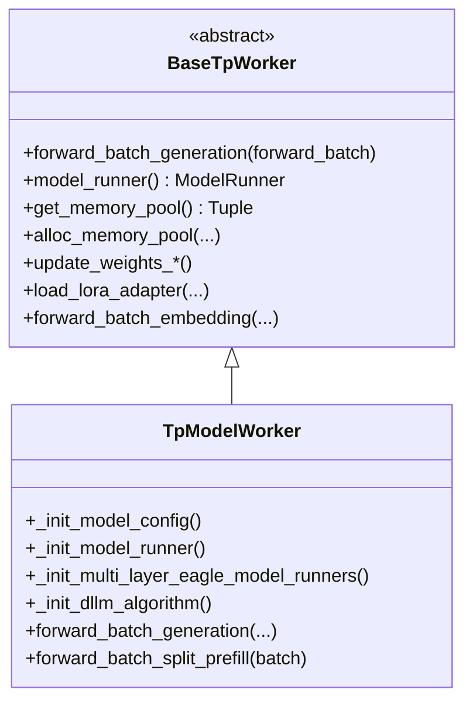
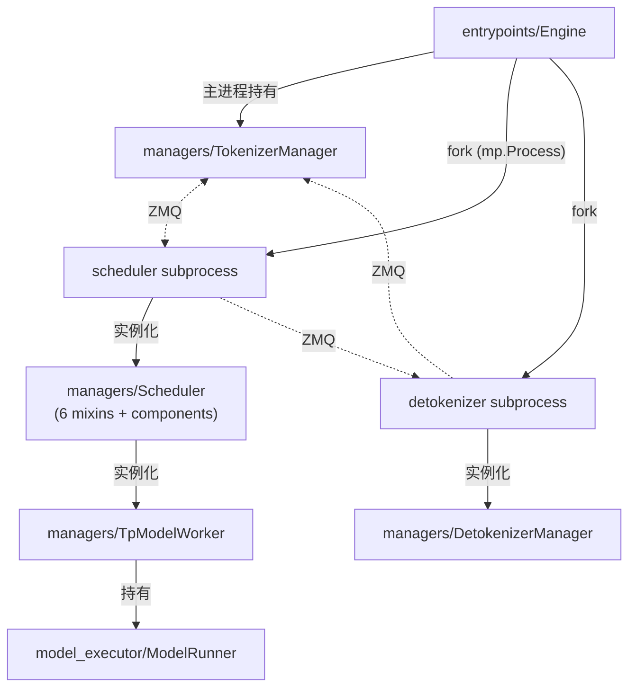

# `srt/managers` — Managers module (核心进程层)

## Summary
synthesis: `srt/managers` 是 SGLang **进程级管理**的核心，定义了 `TokenizerManager` / `Scheduler` / `DetokenizerManager` / `TpModelWorker` / `DataParallelController` 等核心组件。HEAD `f7101b0a` 上 `Scheduler` 为 **6 个职责 mixin + 条件性 `SchedulerMlxOverlapMixin`**，原先 Output/Weights/Profiler/Metrics/RuntimeChecker/DPAttn 等已迁到 [`scheduler_components/`](d:\design\sglang\python\sglang\srt\managers\scheduler_components) **组合对象**（权威页：[entities/Scheduler.md](../entities/Scheduler.md)）。目录下共 **49** 个 `.py`（含 `scheduler_components/` 内模块；@2026-08-18 复核数量不变）。

## Sources
- 模块目录：[d:\design\sglang\python\sglang\srt\managers\](d:\design\sglang\python\sglang\srt\managers)（49 `.py`，含 `scheduler_components/`）
- 关键文件：[scheduler.py](d:\design\sglang\python\sglang\srt\managers\scheduler.py)（~5085 行）、[scheduler_components/](d:\design\sglang\python\sglang\srt\managers\scheduler_components)、[tokenizer_manager.py](d:\design\sglang\python\sglang\srt\managers\tokenizer_manager.py)（~3665 行）、[detokenizer_manager.py](d:\design\sglang\python\sglang\srt\managers\detokenizer_manager.py)、[tp_worker.py](d:\design\sglang\python\sglang\srt\managers\tp_worker.py)、[schedule_policy.py](d:\design\sglang\python\sglang\srt\managers\schedule_policy.py)、[schedule_batch.py](d:\design\sglang\python\sglang\srt\managers\schedule_batch.py)、[data_parallel_controller.py](d:\design\sglang\python\sglang\srt\managers\data_parallel_controller.py)

## 文件分组

### 三个进程主体
| 文件 | 进程角色 |
|---|---|
| `tokenizer_manager.py` | **进程 #1 / 主进程**：接 HTTP 请求 → tokenize → 发给 scheduler |
| `scheduler.py` | **进程 #2 / 子进程**（每 PP×TP 一个）：跑 batching + worker forward |
| `detokenizer_manager.py` | **进程 #3 / 子进程**：detokenize → 回给 tokenizer manager |

详见 [topics/manager-pipeline.md](../topics/manager-pipeline.md)。

### Scheduler：6 mixin + `scheduler_components/` composition

> ~~[!warning] CONTRADICTION: 本节仍描述 **11 mixin** 与已删除的 `scheduler_*_mixin.py` / `scheduler_recv_skipper.py`。~~
> **RESOLVED 2026-08-10**: 与 [entities/Scheduler.md](../entities/Scheduler.md) / [topics/scheduler-mixins.md](../topics/scheduler-mixins.md) 对齐——MRO 为 6 mixin + 条件性 `SchedulerMlxOverlapMixin`；`IdleSleeper` / `SchedulerRecvSkipper` / 原 Output/Weights/Profiler/Metrics/RuntimeChecker/DPAttn 职责迁入 [scheduler_components/](d:\design\sglang\python\sglang\srt\managers\scheduler_components)。topic 页已 re-ingest（不再 stale）。

精确 class 定义来自 [scheduler.py:383-390](d:\design\sglang\python\sglang\srt\managers\scheduler.py)：

```python
class Scheduler(
    SchedulerDisaggregationDecodeMixin,
    SchedulerDisaggregationPrefillMixin,
    SchedulerMultiplexMixin,
    SchedulerPPMixin,
    SchedulerDllmMixin,
    SchedulerMlxOverlapMixin,
):
```

| # | Mixin | 来源 | 职责 |
|---|---|---|---|
| 1 | `SchedulerDisaggregationDecodeMixin` | [disaggregation/decode.py](d:\design\sglang\python\sglang\srt\disaggregation\decode.py) | PD 分离 decoder 端调度 |
| 2 | `SchedulerDisaggregationPrefillMixin` | [disaggregation/prefill.py](d:\design\sglang\python\sglang\srt\disaggregation\prefill.py) | PD 分离 prefill 端调度 |
| 3 | `SchedulerMultiplexMixin` | [multiplex/multiplexing_mixin.py](d:\design\sglang\python\sglang\srt\multiplex\multiplexing_mixin.py) | 多任务复用（PD-Multiplexing） |
| 4 | `SchedulerPPMixin` | [scheduler_pp_mixin.py](d:\design\sglang\python\sglang\srt\managers\scheduler_pp_mixin.py) | Pipeline Parallel 调度 |
| 5 | `SchedulerDllmMixin` | [dllm/mixin/scheduler.py](d:\design\sglang\python\sglang\srt\dllm\mixin\scheduler.py) | Diffusion LLM 调度 |
| 6 | `SchedulerMlxOverlapMixin` | [hardware_backend/mlx/scheduler_mixin.py](d:\design\sglang\python\sglang\srt\hardware_backend\mlx\scheduler_mixin.py)（非 MPS 时 stub） | MLX overlap |

#### 前 mixin → 现 composition（摘要）

| 旧 mixin（源文件已删） | 现组件 |
|---|---|
| `SchedulerOutputProcessorMixin` | `SchedulerBatchResultProcessor` + `SchedulerOutputStreamer` + `SchedulerLogprobResultProcessor` |
| `SchedulerUpdateWeightsMixin` | `SchedulerWeightUpdaterManager` |
| `SchedulerProfilerMixin` | `SchedulerProfilerManager` |
| `SchedulerMetricsMixin` | `SchedulerMetricsReporter` |
| `SchedulerRuntimeCheckerMixin` | `SchedulerInvariantChecker` |
| `SchedulerDPAttnMixin` | `SchedulerDPAttnAdapter` |
| （辅助）`IdleSleeper` / `SchedulerRecvSkipper` / `SenderWrapper` | `scheduler_components/idle_sleeper.py` / `recv_skipper.py` / `output_sender.py` 等 |

另有独立辅助类（仍在 `managers/` 顶层）：

| 类 | 文件 | 用途 |
|---|---|---|
| `SchedulerInputBlocker` | [scheduler_input_blocker.py](d:\design\sglang\python\sglang\srt\managers\scheduler_input_blocker.py) | 输入背压控制 |

完整映射与 init 锚点见 [entities/Scheduler.md](../entities/Scheduler.md)。

### Tokenizer 相关
| 文件 | 角色 |
|---|---|
| `tokenizer_manager.py` | `TokenizerManager` 主体 |
| `tokenizer_manager_score_mixin.py` | `TokenizerManagerScoreMixin` (score / rerank) |
| `tokenizer_control_mixin.py` | `TokenizerControlMixin`（control-plane：weights / cache / lora / profile；**原 `tokenizer_communicator_mixin.py` 已删除**） |
| `multi_tokenizer_mixin.py` | 多 tokenizer worker 模式 + `MultiTokenizerRouter` / `TokenizerWorker` |
| `async_dynamic_batch_tokenizer.py` | 动态批 tokenize |
| `communicator.py` | `FanOutCommunicator` 等 |
| `load_snapshot.py` | DP 负载快照 reader/writer |

> synthesis: `TemplateManager` 已迁至 [parser/template_manager.py](d:\design\sglang\python\sglang\srt\parser\template_manager.py)；`SessionController` 在 [session/session_controller.py](d:\design\sglang\python\sglang\srt\session\session_controller.py)——均不在本目录。

### 调度核心
| 文件 | 角色 |
|---|---|
| `schedule_policy.py` | 调度策略（FCFS / priority / 等） |
| `schedule_batch.py` | `ScheduleBatch` / `Req` / `ModelWorkerBatch` 数据结构 |
| `prefill_delayer.py` | prefill 延迟（PD 分离背压用） |
| `min_free_slots_delayer.py` | free-slots 延迟 |
| `mm_schedule.py` | 多模态调度辅助 |

### Worker 与并行
| 文件 | 角色 |
|---|---|
| `tp_worker.py` | `BaseTpWorker` (ABC) + `TpModelWorker`（直接持有 `ModelRunner`） |
| `data_parallel_controller.py` | `DataParallelController`（DP > 1 时，dp 上层调度，再 fork 各 DP 内的 scheduler） |

### Multimodal / Disaggregation
| 文件 | 角色 |
|---|---|
| `multimodal_processor.py` / `mm_utils.py` | 多模态预处理 |
| `disagg_service.py` | PD 分离的 service 层（被 Scheduler 在 `init_disaggregation` 调用） |
| `embed_types.py` | embedding 数据类型 |

### 其它
| 文件 | 角色 |
|---|---|
| `cache_controller.py` | KV cache 控制 |
| `hisparse_coordinator.py` | HiSparse 稀疏 attention 协调 |
| `overlap_utils.py` | overlap 模式辅助 |
| `io_struct.py` | scheduler IO 数据结构（很多 `*ReqInput` / `*ReqOutput` Msg） |
| `utils.py` | 通用工具 |
| `configure_logging.py` | 日志配置 |
| `rust_server.py` | Rust server 相关入口辅助 |
| `detokenizer_manager.py` | DetokenizerManager 进程主体 |
| `scheduler_components/*.py` | Scheduler 组合组件（~19 模块 + `__init__.py`） |

## TpModelWorker 类层次（[tp_worker.py:74-299](d:\design\sglang\python\sglang\srt\managers\tp_worker.py)）



要点：

- `BaseTpWorker` 是 ABC（[tp_worker.py:74](d:\design\sglang\python\sglang\srt\managers\tp_worker.py)），抽象方法为 `forward_batch_generation` + `model_runner` property
- `TpModelWorker` 内 `_init_model_runner()`（[tp_worker.py:463](d:\design\sglang\python\sglang\srt\managers\tp_worker.py)）创建 `ModelRunner`（来自 [srt/model_executor/](d:\design\sglang\python\sglang\srt\model_executor)；部分逻辑在 `model_runner_components/`）
- **直接被 Scheduler 调用**——SGLang 没有独立的 Executor 层（vLLM 有 `Executor` 抽象，SGLang 没有）。这是架构上的关键差异

## 与 entrypoints 的关系



## Increment 2026-08-18 (06f32bab → f7101b0a)

本期 `managers/` churn = **26 文件 / +1171/-484（≈1655 行）**（`git diff --stat 06f32bab..HEAD -- python/sglang/srt/managers`）。**骨架论断全部复核不变**：目录仍 49 个 `.py`（29 顶层 + `scheduler_components/` 20），文件清单无增删；`Scheduler` MRO 仍 6 mixin。逐项：

- **scheduler.py +109/-70**（现 ~5085 行）：`class Scheduler(` L375 → [L383](d:\design\sglang\python\sglang\srt\managers\scheduler.py)；`dispatch_event_loop` → [L4902](d:\design\sglang\python\sglang\srt\managers\scheduler.py)（PP 判定改用 `configured_pp_size()`）；`init_metrics_reporter` 前移至 [L1198](d:\design\sglang\python\sglang\srt\managers\scheduler.py)。详细锚点映射见 [topics/scheduler-mixins.md](../topics/scheduler-mixins.md) §Increment。
- **tokenizer_manager.py ±209**（现 ~3665 行）：主要是 config-bags 系列 commit（#35022-#35028，`get_*()` 配置袋替代散读 `server_args`）+ VLM content-addressed 预处理缓存基建（#34398）。
- **cache_controller.py +116/-111**：HiCache L2 传输执行扁平化（#34793）——`HiCacheController` 改持 [`L2TransferEngine`](d:\design\sglang\python\sglang\srt\mem_cache\l2_transfer.py)（import @ [cache_controller.py:L40](d:\design\sglang\python\sglang\srt\managers\cache_controller.py)、实例化 @ [L321](d:\design\sglang\python\sglang\srt\managers\cache_controller.py)、`submit_device_to_host` @ [L719](d:\design\sglang\python\sglang\srt\managers\cache_controller.py)），传输原语移入 `mem_cache/l2_transfer.py`。
- **hisparse_coordinator.py +214**：HiSparse shared-index（IndexShare）plan-then-IO swap-in prefetch（#34329）；`HiSparseCoordinator` 现 @ [L111](d:\design\sglang\python\sglang\srt\managers\hisparse_coordinator.py)，新增 `HiSparseAct` / `HiSparseTokenStats` NamedTuple（[L35/L41](d:\design\sglang\python\sglang\srt\managers\hisparse_coordinator.py)）。
- **io_struct.py +92**：请求结构体增 `cache_salt` 字段并归一化（[io_struct.py:L337](d:\design\sglang\python\sglang\srt\managers\io_struct.py)、[L500](d:\design\sglang\python\sglang\srt\managers\io_struct.py)，#30827）+ VLM 预处理缓存相关消息（#34398）。
- **prefill_delayer.py +65**：新增 `RecentPrefillBatchSizeTracker`（[prefill_delayer.py:L22](d:\design\sglang\python\sglang\srt\managers\prefill_delayer.py)，#34284——按近期真实 admission 跟踪 max prefill batch size）。
- **overlap_utils.py +48**：`FutureMap`（[overlap_utils.py:L246](d:\design\sglang\python\sglang\srt\managers\overlap_utils.py)）扩展以中继 ngram accept tokens（#35198）与 confidence relay 结构（`ResolvedConfidence`/`ConfidenceRelay` @ [L123/L167](d:\design\sglang\python\sglang\srt\managers\overlap_utils.py)）。
- **mm_schedule.py +42**：VLM 多模态 placeholder 计数去同步（#34995）+ 预处理缓存（#34398）；`init_mm_embedding_cache` 现 @ [mm_schedule.py:L23](d:\design\sglang\python\sglang\srt\managers\mm_schedule.py)。
- **tp_worker.py +25 行内小改**：`BaseTpWorker` L73 → [L74](d:\design\sglang\python\sglang\srt\managers\tp_worker.py)、`TpModelWorker` @ [L299](d:\design\sglang\python\sglang\srt\managers\tp_worker.py)、`_init_model_runner` L450 → [L463](d:\design\sglang\python\sglang\srt\managers\tp_worker.py)。
- synthesis: 本期 managers/ 无结构性重组（无文件增删、无 mixin/组件边界移动）；churn 集中在 config-bags 迁移、HiCache L2 重构的 controller 侧、HiSparse prefetch 与 spec/VLM 功能增强。

## See also
- [modules/entrypoints.md](entrypoints.md)
- [entities/TokenizerManager.md](../entities/TokenizerManager.md)
- [entities/Scheduler.md](../entities/Scheduler.md)
- [entities/TpModelWorker.md](../entities/TpModelWorker.md)
- [entities/DataParallelController.md](../entities/DataParallelController.md)
- [entities/Engine.md](../entities/Engine.md)
- [topics/manager-pipeline.md](../topics/manager-pipeline.md)
- [topics/request-lifecycle.md](../topics/request-lifecycle.md)
