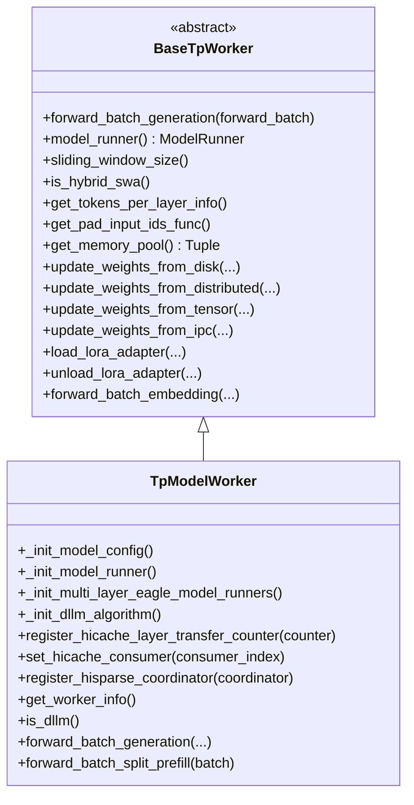
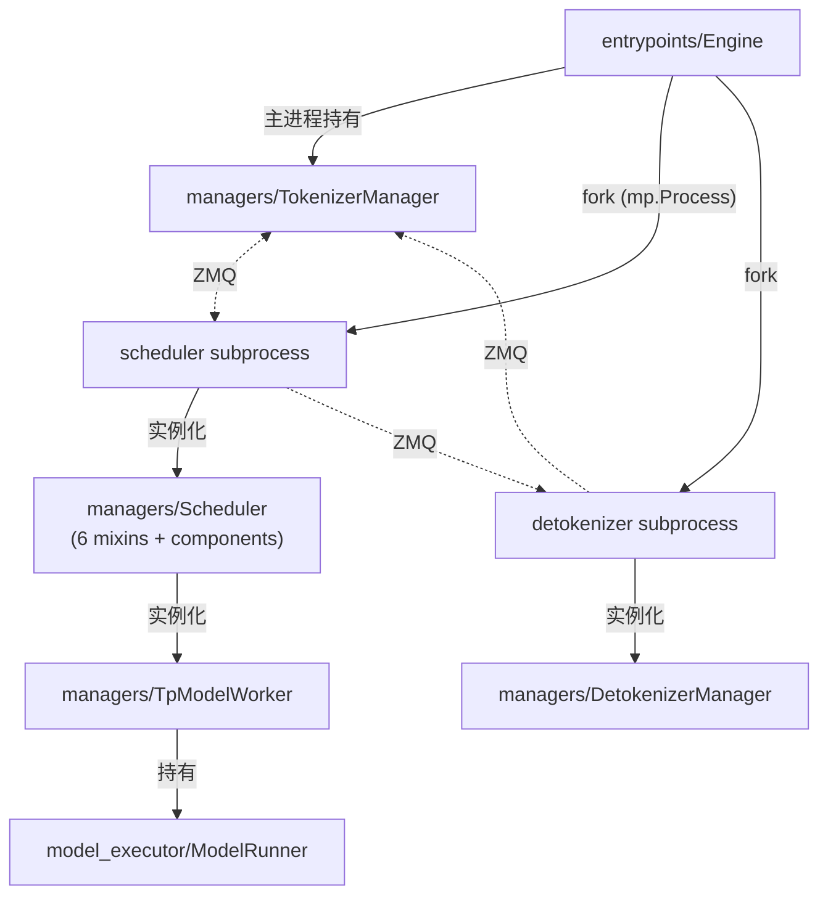

# `srt/managers` — Managers module (核心进程层)

## Summary
synthesis: `srt/managers` 是 SGLang **进程级管理**的核心，定义了 `TokenizerManager` / `Scheduler` / `DetokenizerManager` / `TpModelWorker` / `DataParallelController` 等核心组件。最复杂的是 `Scheduler`，本身用 **11 个 mixin** 拼装（精确 class 定义见 [scheduler.py:317-329](d:\design\sglang\python\sglang\srt\managers\scheduler.py)，详见本页 §"Scheduler 的 11 个 mixin"）；连辅助类（`SchedulerInputBlocker`, `SchedulerRecvSkipper` 等独立文件）一起共 32 个 .py。

## Sources
- 模块目录：[d:\design\sglang\python\sglang\srt\managers\](d:\design\sglang\python\sglang\srt\managers)（32 .py）
- 关键 7 文件：[scheduler.py](d:\design\sglang\python\sglang\srt\managers\scheduler.py)（3700+ 行）、[tokenizer_manager.py](d:\design\sglang\python\sglang\srt\managers\tokenizer_manager.py)（2700+ 行）、[detokenizer_manager.py](d:\design\sglang\python\sglang\srt\managers\detokenizer_manager.py)、[tp_worker.py](d:\design\sglang\python\sglang\srt\managers\tp_worker.py)、[schedule_policy.py](d:\design\sglang\python\sglang\srt\managers\schedule_policy.py)、[schedule_batch.py](d:\design\sglang\python\sglang\srt\managers\schedule_batch.py)、[data_parallel_controller.py](d:\design\sglang\python\sglang\srt\managers\data_parallel_controller.py)

## 文件分组

### 三个进程主体
| 文件 | 进程角色 |
|---|---|
| `tokenizer_manager.py` | **进程 #1 / 主进程**：接 HTTP 请求 → tokenize → 发给 scheduler |
| `scheduler.py` | **进程 #2 / 子进程**（每 PP×TP 一个）：跑 batching + worker forward |
| `detokenizer_manager.py` | **进程 #3 / 子进程**：detokenize → 回给 tokenizer manager |

详见 [topics/manager-pipeline.md](../topics/manager-pipeline.md)。

### Scheduler 的 11 个 mixin

> [!warning] CONTRADICTION: 本节仍描述 **11 mixin** 与已删除的 `scheduler_*_mixin.py` / `scheduler_recv_skipper.py`。HEAD `06f32bab` 为 **6 mixin + MlxOverlap** + [scheduler_components/](d:\design\sglang\python\sglang\srt\managers\scheduler_components) composition（含迁出的 `IdleSleeper` / `SenderWrapper` / `SchedulerRecvSkipper`）。权威页：[entities/Scheduler.md](../entities/Scheduler.md)（2026-08-10）。

精确 class 定义来自 [scheduler.py:317-329](d:\design\sglang\python\sglang\srt\managers\scheduler.py)：

```python
class Scheduler(
    SchedulerOutputProcessorMixin,
    SchedulerUpdateWeightsMixin,
    SchedulerProfilerMixin,
    SchedulerMetricsMixin,
    SchedulerDisaggregationDecodeMixin,
    SchedulerDisaggregationPrefillMixin,
    SchedulerMultiplexMixin,
    SchedulerRuntimeCheckerMixin,
    SchedulerPPMixin,
    SchedulerDPAttnMixin,
    SchedulerDllmMixin,
):
```

| # | Mixin | 来源 | 职责 |
|---|---|---|---|
| 1 | `SchedulerOutputProcessorMixin` | [scheduler_output_processor_mixin.py](d:\design\sglang\python\sglang\srt\managers\scheduler_output_processor_mixin.py) | 输出处理 |
| 2 | `SchedulerUpdateWeightsMixin` | [scheduler_update_weights_mixin.py](d:\design\sglang\python\sglang\srt\managers\scheduler_update_weights_mixin.py) | 权重更新（RLHF） |
| 3 | `SchedulerProfilerMixin` | [scheduler_profiler_mixin.py](d:\design\sglang\python\sglang\srt\managers\scheduler_profiler_mixin.py) | profiling |
| 4 | `SchedulerMetricsMixin` | [observability/scheduler_metrics_mixin.py:91](d:\design\sglang\python\sglang\srt\observability\scheduler_metrics_mixin.py) | metrics |
| 5 | `SchedulerDisaggregationDecodeMixin` | [disaggregation/decode.py](d:\design\sglang\python\sglang\srt\disaggregation\decode.py) | PD 分离 decoder 端调度 |
| 6 | `SchedulerDisaggregationPrefillMixin` | [disaggregation/prefill.py](d:\design\sglang\python\sglang\srt\disaggregation\prefill.py) | PD 分离 prefill 端调度 |
| 7 | `SchedulerMultiplexMixin` | [multiplex/multiplexing_mixin.py:32](d:\design\sglang\python\sglang\srt\multiplex\multiplexing_mixin.py) | 多任务复用（PD-Multiplexing 同卡多 stream，非 HTTP 多路复用） |
| 8 | `SchedulerRuntimeCheckerMixin` | [scheduler_runtime_checker_mixin.py](d:\design\sglang\python\sglang\srt\managers\scheduler_runtime_checker_mixin.py) | 运行时一致性检查 |
| 9 | `SchedulerPPMixin` | [scheduler_pp_mixin.py](d:\design\sglang\python\sglang\srt\managers\scheduler_pp_mixin.py) | Pipeline Parallel 调度 |
| 10 | `SchedulerDPAttnMixin` | [scheduler_dp_attn_mixin.py](d:\design\sglang\python\sglang\srt\managers\scheduler_dp_attn_mixin.py) | DP attention（同步 batch） |
| 11 | `SchedulerDllmMixin` | [dllm/mixin/scheduler.py:20](d:\design\sglang\python\sglang\srt\dllm\mixin\scheduler.py) | Diffusion LLM 调度 |

另有 2 个独立辅助类（不是 mixin）：

| 类 | 文件 | 用途 |
|---|---|---|
| `SchedulerInputBlocker` | [scheduler_input_blocker.py](d:\design\sglang\python\sglang\srt\managers\scheduler_input_blocker.py) | 输入背压控制 |
| `SchedulerRecvSkipper` | [scheduler_recv_skipper.py](d:\design\sglang\python\sglang\srt\managers\scheduler_recv_skipper.py) | 慢消费时跳过 recv |

> [!todo] VERIFY: ~~`SchedulerMetricsMixin`、`SchedulerDisaggregationDecode/PrefillMixin`、`SchedulerMultiplexMixin`、`SchedulerDllmMixin` 5 个 mixin 的具体文件位置（不在 `managers/` 目录的明显文件名里，可能在 [srt/disaggregation/](d:\design\sglang\python\sglang\srt\disaggregation) / [srt/multiplex/](d:\design\sglang\python\sglang\srt\multiplex) / [srt/dllm/](d:\design\sglang\python\sglang\srt\dllm) / [srt/metrics/](d:\design\sglang\python\sglang\srt\metrics) 下）。~~
> **RESOLVED 2026-04-19**: 5 个 mixin 的真实位置已逐一定位 — `SchedulerMetricsMixin` → [observability/scheduler_metrics_mixin.py:91](d:\design\sglang\python\sglang\srt\observability\scheduler_metrics_mixin.py)（**非** `srt/metrics/`）；`SchedulerDisaggregationDecodeMixin` → [disaggregation/decode.py](d:\design\sglang\python\sglang\srt\disaggregation\decode.py)；`SchedulerDisaggregationPrefillMixin` → [disaggregation/prefill.py](d:\design\sglang\python\sglang\srt\disaggregation\prefill.py)；`SchedulerMultiplexMixin` → [multiplex/multiplexing_mixin.py:32](d:\design\sglang\python\sglang\srt\multiplex\multiplexing_mixin.py)；`SchedulerDllmMixin` → [dllm/mixin/scheduler.py:20](d:\design\sglang\python\sglang\srt\dllm\mixin\scheduler.py)。`scheduler.py:44-57` 处的 import 链与多重继承列表（[scheduler.py:317-329](d:\design\sglang\python\sglang\srt\managers\scheduler.py)）一致。

### Tokenizer 相关
| 文件 | 角色 |
|---|---|
| `tokenizer_manager.py` | `TokenizerManager` 主体 |
| `tokenizer_manager_score_mixin.py` | `TokenizerManagerScoreMixin` (score / rerank) |
| `tokenizer_communicator_mixin.py` | `TokenizerCommunicatorMixin`（与 scheduler 通信封装） |
| `multi_tokenizer_mixin.py` | 多 tokenizer worker 模式 + `SenderWrapper` |
| `async_dynamic_batch_tokenizer.py` | 动态批 tokenize |
| `template_manager.py` | chat template |

### 调度核心
| 文件 | 角色 |
|---|---|
| `schedule_policy.py` | 调度策略（FCFS / priority / 等） |
| `schedule_batch.py` | `ScheduleBatch` / `Req` / `ModelWorkerBatch` 数据结构 |
| `prefill_delayer.py` | prefill 延迟（PD 分离背压用） |

### Worker 与并行
| 文件 | 角色 |
|---|---|
| `tp_worker.py` | `BaseTpWorker` (ABC) + `TpModelWorker`（直接持有 `ModelRunner`） |
| `data_parallel_controller.py` | `DataParallelController`（DP > 1 时，dp 上层调度，再 fork 各 DP 内的 scheduler） |

### Multimodal / Disaggregation
| 文件 | 角色 |
|---|---|
| `multimodal_processor.py` / `mm_utils.py` | 多模态预处理 |
| `disagg_service.py` | PD 分离的 service 层（被 Scheduler 在 `init_disaggregation` 调用） |
| `embed_types.py` | embedding 数据类型 |

### 其它
| 文件 | 角色 |
|---|---|
| `cache_controller.py` | KV cache 控制 |
| `hisparse_coordinator.py` | HiSparse 稀疏 attention 协调 |
| `session_controller.py` | session 管理 |
| `overlap_utils.py` | overlap 模式辅助 |
| `io_struct.py` | scheduler IO 数据结构（很多 `*ReqInput` / `*ReqOutput` Msg） |
| `utils.py` | 通用工具 |
| `configure_logging.py` | 日志配置 |
| `detokenizer_manager.py` | DetokenizerManager 进程主体 |

## TpModelWorker 类层次（[tp_worker.py:62-411](d:\design\sglang\python\sglang\srt\managers\tp_worker.py)）



要点：

- `BaseTpWorker` 是 ABC（[tp_worker.py:62](d:\design\sglang\python\sglang\srt\managers\tp_worker.py)），抽象方法只有 `forward_batch_generation`
- 19 个 default 方法（update_weights / load_lora 等）让子类只实现一两个就能用
- `TpModelWorker` 内 `_init_model_runner()`（[tp_worker.py:340](d:\design\sglang\python\sglang\srt\managers\tp_worker.py)）创建 `ModelRunner`（来自 [srt/model_executor/](d:\design\sglang\python\sglang\srt\model_executor)）
- **直接被 Scheduler 调用**——SGLang 没有独立的 Executor 层（vLLM 有 `Executor` 抽象，SGLang 没有）。这是架构上的关键差异

## 与 entrypoints 的关系



## See also
- [modules/entrypoints.md](entrypoints.md)
- [entities/TokenizerManager.md](../entities/TokenizerManager.md)
- [entities/Scheduler.md](../entities/Scheduler.md)
- [topics/manager-pipeline.md](../topics/manager-pipeline.md)
- [topics/request-lifecycle.md](../topics/request-lifecycle.md)
