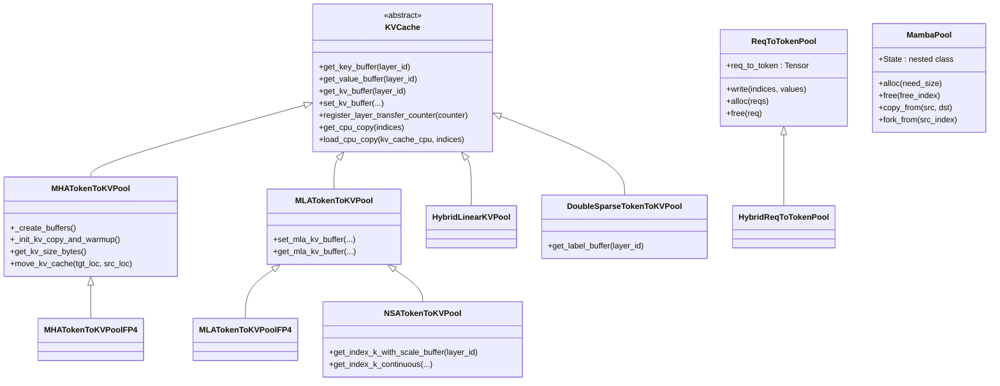

# `srt/mem_cache` — Memory cache module

## Summary
synthesis: SGLang 的 KV cache 体系是三个项目里**最大、最分散**的——`srt/mem_cache/` 单目录就有 **62 个 .py 文件**。它通过 4 层抽象组合：(1) `BasePrefixCache` 接口 + 多种 prefix cache 实现（RadixCache / HiRadixCache / SWA / Mamba / ChunkCache）；(2) `BaseTokenToKVPoolAllocator` 接口 + 2 种 allocator（标准 / Paged）；(3) 各种 `KVCache` pool 实现（MHA / MLA / NSA / DoubleSparse 等，含 FP4 量化版）；(4) `HiCache` 多层存储后端（mooncake / nixl / hf3fs / lmcache / aibrix / eic / simm）。

## Sources
- 模块根：[d:\design\sglang\python\sglang\srt\mem_cache\](d:\design\sglang\python\sglang\srt\mem_cache)（62 文件）
- 接口：[base_prefix_cache.py](d:\design\sglang\python\sglang\srt\mem_cache\base_prefix_cache.py), [allocator.py](d:\design\sglang\python\sglang\srt\mem_cache\allocator.py), [hicache_storage.py](d:\design\sglang\python\sglang\srt\mem_cache\hicache_storage.py)
- 主 prefix cache：[radix_cache.py](d:\design\sglang\python\sglang\srt\mem_cache\radix_cache.py), [hiradix_cache.py](d:\design\sglang\python\sglang\srt\mem_cache\hiradix_cache.py), [chunk_cache.py](d:\design\sglang\python\sglang\srt\mem_cache\chunk_cache.py)
- 主 KV pool：[memory_pool.py](d:\design\sglang\python\sglang\srt\mem_cache\memory_pool.py)（约 2070 行）

## 文件分组

### 1. 接口与基础设施
| 文件 | 角色 |
|---|---|
| `base_prefix_cache.py` | `BasePrefixCache(ABC)` 接口 + 8 个数据 class（`MatchPrefixParams`, `InsertParams`, `MatchResult`, `EvictParams`, `EvictResult`, `IncLockRefResult`, `DecLockRefParams`, `InitLoadBackParams`） |
| `allocator.py` | `BaseTokenToKVPoolAllocator(abc.ABC)` 接口 + `TokenToKVPoolAllocator` + `PagedTokenToKVPoolAllocator` |
| `cache_init_params.py` | `CacheInitParams` 配置 dataclass |
| `common.py` | 通用工具 |
| `utils.py` | 工具 |
| `flush_cache.py` | 清 cache 工具 |
| `evict_policy.py` | LRU/LFU/FIFO/MRU/FILO/Priority/SLRU 7 种 evict 策略 |

### 2. RadixCache 家族（核心 prefix cache）
| 文件 | 角色 |
|---|---|
| `radix_cache.py` | `RadixCache(BasePrefixCache)` + `TreeNode` + `RadixKey` |
| `radix_cache_cpp.py` | C++ 加速版 |
| `cpp_radix_tree/radix_tree.py` | C++ radix tree binding |
| `chunk_cache.py` | `ChunkCache(BasePrefixCache)` + `SWAChunkCache` |
| `hiradix_cache.py` | `HiRadixCache(RadixCache)` — **HiCache 二层存储版** |
| `swa_radix_cache.py` | sliding window attention 版 |
| `unified_radix_cache.py` | 统一接口 |
| `mamba_radix_cache.py` | Mamba 状态 |
| `hi_mamba_radix_cache.py` | Mamba + HiCache |
| `lmc_radix_cache.py`（在 storage/lmcache/） | LM Cache 集成 |
| `session_aware_cache.py` | 会话感知 |

### 3. KV pool 实现
| 文件 / 类 | 角色 |
|---|---|
| `memory_pool.py: ReqToTokenPool` | request_id → token_ids 映射池 |
| `memory_pool.py: HybridReqToTokenPool` | hybrid 模型版本 |
| `memory_pool.py: KVCache(abc.ABC)` | KV pool 抽象基类 |
| `memory_pool.py: MHATokenToKVPool` | MHA / GQA 标准 KV pool（含 FP4 子类） |
| `memory_pool.py: MLATokenToKVPool` | DeepSeek MLA KV pool（含 FP4 子类） |
| `memory_pool.py: NSATokenToKVPool` | NSA（Native Sparse Attention） |
| `memory_pool.py: HybridLinearKVPool` | Hybrid 线性 attention KV pool |
| `memory_pool.py: DoubleSparseTokenToKVPool` | DoubleSparse |
| `memory_pool.py: MambaPool` | Mamba 状态池（含 SpeculativeState） |
| `memory_pool_host.py` | Host (CPU) KV pool |
| `swa_memory_pool.py` | SWA 专用 |
| `hisparse_memory_pool.py` | HiSparse |

### 4. Unified cache components
| 文件 | 角色 |
|---|---|
| `unified_cache_components/full_component.py` | full attention 组件 |
| `unified_cache_components/tree_component.py` | tree 组件 |
| `unified_cache_components/swa_component.py` | sliding window 组件 |
| `unified_cache_components/mamba_component.py` | Mamba 组件 |

### 5. Hybrid cache（多 cache 类型混合）
| 文件 | 角色 |
|---|---|
| `hybrid_cache/hybrid_cache_controller.py` | 控制器 |
| `hybrid_cache/hybrid_pool_assembler.py` | pool 装配 |

### 6. HiCache storage 后端（二层存储）
`HiCache` 抽象，把 KV cache 分层到 device → host → 远端 / 持久化存储。`HiCacheStorage(ABC)` 接口在 [hicache_storage.py:95](d:\design\sglang\python\sglang\srt\mem_cache\hicache_storage.py)。

| 后端 | 路径 | 说明 |
|---|---|---|
| HF3FS | [storage/hf3fs/](d:\design\sglang\python\sglang\srt\mem_cache\storage\hf3fs) | HuggingFace 3FS 协议（含 `mini_3fs_metadata_server.py`） |
| Mooncake Store | [storage/mooncake_store/](d:\design\sglang\python\sglang\srt\mem_cache\storage\mooncake_store) | Mooncake KV store（含 embedding store） |
| NIXL | [storage/nixl/](d:\design\sglang\python\sglang\srt\mem_cache\storage\nixl) | NVIDIA NIXL |
| LMCache | [storage/lmcache/](d:\design\sglang\python\sglang\srt\mem_cache\storage\lmcache) | LM Cache 集成（含独立 radix cache） |
| AIBrix | [storage/aibrix_kvcache/](d:\design\sglang\python\sglang\srt\mem_cache\storage\aibrix_kvcache) | 字节 AIBrix |
| EIC | [storage/eic/](d:\design\sglang\python\sglang\srt\mem_cache\storage\eic) | EIC |
| SIMM | [storage/simm/](d:\design\sglang\python\sglang\srt\mem_cache\storage\simm) | SIMM |
| 工厂 | [storage/backend_factory.py](d:\design\sglang\python\sglang\srt\mem_cache\storage\backend_factory.py) | 后端选择 |

`HiCacheFile` ([hicache_storage.py:274](d:\design\sglang\python\sglang\srt\mem_cache\hicache_storage.py)) 是文件系统后端的默认实现。

### 7. Sparsity（稀疏注意力 KV）
| 文件 | 角色 |
|---|---|
| `sparsity/factory.py` | 工厂 |
| `sparsity/algorithms/base_algorithm.py` | 基类 |
| `sparsity/algorithms/quest_algorithm.py` | Quest 算法 |
| `sparsity/algorithms/deepseek_nsa.py` | DeepSeek NSA |
| `sparsity/backend/backend_adaptor.py` | 后端适配 |
| `sparsity/core/sparse_coordinator.py` | 协调器 |

### 8. 其它
| 文件 | 角色 |
|---|---|
| `multimodal_cache.py` | 多模态 encoder 输出缓存（与 KV 平行，类似 vLLM 的 EncoderCacheManager） |

## `BasePrefixCache` 接口 （[base_prefix_cache.py:150-271](d:\design\sglang\python\sglang\srt\mem_cache\base_prefix_cache.py)）

`PrefixCacheTrait(Protocol)` ([base_prefix_cache.py:28](d:\design\sglang\python\sglang\srt\mem_cache\base_prefix_cache.py)) 定义元能力，`BasePrefixCache(ABC, PrefixCacheTrait)` 是抽象基类。

核心 API：

| 方法 | 行号 | 角色 |
|---|---|---|
| `match_prefix(MatchPrefixParams)` | [178](d:\design\sglang\python\sglang\srt\mem_cache\base_prefix_cache.py) | **prefix cache 命中**，返 `MatchResult` |
| `cache_finished_req(req, is_insert)` | [182](d:\design\sglang\python\sglang\srt\mem_cache\base_prefix_cache.py) | 请求完成时缓存 |
| `cache_unfinished_req(req)` | [186](d:\design\sglang\python\sglang\srt\mem_cache\base_prefix_cache.py) | 未完成时缓存（chunked prefill） |
| `evict(EvictParams)` | [190](d:\design\sglang\python\sglang\srt\mem_cache\base_prefix_cache.py) | 驱逐 |
| `inc_lock_ref(node)` / `dec_lock_ref(...)` | [194-202](d:\design\sglang\python\sglang\srt\mem_cache\base_prefix_cache.py) | 引用计数（防止使用中的块被 evict） |
| `evictable_size / full_evictable_size / swa_evictable_size` | [203-209](d:\design\sglang\python\sglang\srt\mem_cache\base_prefix_cache.py) | 可驱逐块数 |
| `protected_size / full_protected_size / swa_protected_size` | [212-218](d:\design\sglang\python\sglang\srt\mem_cache\base_prefix_cache.py) | 不可驱逐 |
| `total_size()` | [221](d:\design\sglang\python\sglang\srt\mem_cache\base_prefix_cache.py) | 总块数 |
| `init_load_back(...)` | [227](d:\design\sglang\python\sglang\srt\mem_cache\base_prefix_cache.py) | HiCache：从 host/storage 加载回 device |
| `ready_to_load_host_cache()` | [236](d:\design\sglang\python\sglang\srt\mem_cache\base_prefix_cache.py) | HiCache：检查 host 加载就绪 |
| `flush_write_through_acks()` | [242](d:\design\sglang\python\sglang\srt\mem_cache\base_prefix_cache.py) | HiCache：write-through ack |
| `check_hicache_events()` | [250](d:\design\sglang\python\sglang\srt\mem_cache\base_prefix_cache.py) | HiCache：事件 |
| `take_events()` | [256](d:\design\sglang\python\sglang\srt\mem_cache\base_prefix_cache.py) | KV cache events |
| `supports_swa() / supports_mamba() / is_chunk_cache() / is_tree_cache()` | [259-268](d:\design\sglang\python\sglang\srt\mem_cache\base_prefix_cache.py) | capability 查询 |

## `RadixCache` （[radix_cache.py:285-896](d:\design\sglang\python\sglang\srt\mem_cache\radix_cache.py)）

SGLang 最常用的 prefix cache。基于 **radix tree** 共享前缀。

### 关键数据结构
- `RadixKey` ([radix_cache.py:71](d:\design\sglang\python\sglang\srt\mem_cache\radix_cache.py))：`token_ids + extra_key`，`extra_key` 用于 LoRA / cache version 隔离（[radix_cache.py:380-386 注释](d:\design\sglang\python\sglang\srt\mem_cache\radix_cache.py)）
- `TreeNode` ([radix_cache.py:121](d:\design\sglang\python\sglang\srt\mem_cache\radix_cache.py))：树节点，含 `id / priority / lock_ref / hash_value / value / host_value` 等
- `EvictionStrategy` 子类：LRU / LFU / FIFO / MRU / FILO / Priority / SLRU 7 种 ([radix_cache.py:313-326 选择逻辑](d:\design\sglang\python\sglang\srt\mem_cache\radix_cache.py))

### 关键 API
| 方法 | 行号 | 角色 |
|---|---|---|
| `__init__(params)` | [286-335](d:\design\sglang\python\sglang\srt\mem_cache\radix_cache.py) | 解析 page_size / eviction_policy / req_to_token_pool / token_to_kv_pool_allocator |
| `match_prefix(params)` | [374-445](d:\design\sglang\python\sglang\srt\mem_cache\radix_cache.py) | 沿 radix tree 找最长匹配前缀 |
| `insert(params)` | [446-462](d:\design\sglang\python\sglang\srt\mem_cache\radix_cache.py) | 插入新节点 |
| `cache_finished_req(req, is_insert)` | [463-509](d:\design\sglang\python\sglang\srt\mem_cache\radix_cache.py) | 完成时插 + 驱逐 |
| `cache_unfinished_req(req, chunked)` | [510-574](d:\design\sglang\python\sglang\srt\mem_cache\radix_cache.py) | 未完成时插 |
| `evict(params)` | [582-610](d:\design\sglang\python\sglang\srt\mem_cache\radix_cache.py) | 按策略驱逐 |
| `inc_lock_ref(node)` / `dec_lock_ref(...)` | [611-646](d:\design\sglang\python\sglang\srt\mem_cache\radix_cache.py) | 引用计数 |
| `_match_prefix_helper(node, key)` | [667-692](d:\design\sglang\python\sglang\srt\mem_cache\radix_cache.py) | 递归匹配 |
| `_split_node(key, child, split_len)` | [693-714](d:\design\sglang\python\sglang\srt\mem_cache\radix_cache.py) | 分裂节点 |

### 与 page_size 配合（[radix_cache.py:306-311](d:\design\sglang\python\sglang\srt\mem_cache\radix_cache.py)）
- `page_size == 1` → `_key_match_page_size1`（无对齐）
- `page_size > 1` → `_key_match_paged`（按 page 对齐）

## `HiRadixCache` HiCache 二层 （[hiradix_cache.py:65-1473](d:\design\sglang\python\sglang\srt\mem_cache\hiradix_cache.py)）

继承 `RadixCache`，新增**device → host → storage** 三层存储管理：

- `attach_storage_backend(...)` ([hiradix_cache.py:246](d:\design\sglang\python\sglang\srt\mem_cache\hiradix_cache.py)) — 接入 HiCache 后端（mooncake / nixl / 等）
- `write_backup(node)` ([hiradix_cache.py:652](d:\design\sglang\python\sglang\srt\mem_cache\hiradix_cache.py)) / `write_backup_storage(node)` ([hiradix_cache.py:685](d:\design\sglang\python\sglang\srt\mem_cache\hiradix_cache.py)) — write-back / write-through
- `evict_host(num_tokens)` ([hiradix_cache.py:905](d:\design\sglang\python\sglang\srt\mem_cache\hiradix_cache.py)) — host 层驱逐
- `load_back(...)` ([hiradix_cache.py:940](d:\design\sglang\python\sglang\srt\mem_cache\hiradix_cache.py)) — 从 host/storage 拉回 device
- `prefetch_from_storage(...)` ([hiradix_cache.py:1245](d:\design\sglang\python\sglang\srt\mem_cache\hiradix_cache.py)) — 预取
- `check_prefetch_progress(req_id)` ([hiradix_cache.py:1127](d:\design\sglang\python\sglang\srt\mem_cache\hiradix_cache.py)) — 预取状态轮询

## `BaseTokenToKVPoolAllocator` 与 2 种实现 （[allocator.py](d:\design\sglang\python\sglang\srt\mem_cache\allocator.py)）

| 类 | 行号 | 适用 |
|---|---|---|
| `BaseTokenToKVPoolAllocator(abc.ABC)` | [35-115](d:\design\sglang\python\sglang\srt\mem_cache\allocator.py) | 抽象基类，提供 alloc / free / backup_state / restore_state / merge_and_sort_free / alloc_extend / alloc_decode 等抽象 |
| `TokenToKVPoolAllocator` | [117-171](d:\design\sglang\python\sglang\srt\mem_cache\allocator.py) | 标准 allocator |
| `PagedTokenToKVPoolAllocator` | [356-518](d:\design\sglang\python\sglang\srt\mem_cache\allocator.py) | **paged**（按 page 对齐分配） |

辅助函数：

- `alloc_extend_naive(...)` ([allocator.py:174-234](d:\design\sglang\python\sglang\srt\mem_cache\allocator.py))
- `alloc_extend_kernel(...)` ([allocator.py:235-320](d:\design\sglang\python\sglang\srt\mem_cache\allocator.py))
- `alloc_decode_kernel(...)` ([allocator.py:321-355](d:\design\sglang\python\sglang\srt\mem_cache\allocator.py))

## KV pool 类层次 （[memory_pool.py](d:\design\sglang\python\sglang\srt\mem_cache\memory_pool.py)）

> synthesis: 与 vLLM 的"`KVCacheSpec` 多态分类"不同，SGLang 把不同 attention 类型的 KV pool 直接做成**独立 class 实现**（MHA / MLA / NSA / DoubleSparse / Hybrid），同时还有 FP4 量化子类。这种设计内聚性更高（每个 pool 自带 set/get buffer），代价是需要 `Hybrid*Pool` 来组合多种类型。

## `HiCacheStorage` 接口 （[hicache_storage.py:95-272](d:\design\sglang\python\sglang\srt\mem_cache\hicache_storage.py)）

| 方法 | 行号 | 角色 |
|---|---|---|
| `register_mem_pool_host(mem_pool_host)` | [102](d:\design\sglang\python\sglang\srt\mem_cache\hicache_storage.py) | 注册 host KV pool |
| `register_mem_host_pool_v2(host_pool, host_pool_name)` | [105](d:\design\sglang\python\sglang\srt\mem_cache\hicache_storage.py) | v2 接口 |
| `batch_exists_v2 / batch_get_v2 / batch_set_v2` | [110-164](d:\design\sglang\python\sglang\srt\mem_cache\hicache_storage.py) | v2 批量接口 |
| `batch_get_v1 / batch_set_v1` | [165-189](d:\design\sglang\python\sglang\srt\mem_cache\hicache_storage.py) | v1 批量接口 |
| `get / set / exists / batch_*` | [190-265](d:\design\sglang\python\sglang\srt\mem_cache\hicache_storage.py) | 单 / 批量 KV |
| `clear()` | [267](d:\design\sglang\python\sglang\srt\mem_cache\hicache_storage.py) | 清 |
| `get_stats()` | [270](d:\design\sglang\python\sglang\srt\mem_cache\hicache_storage.py) | 统计 |

`HiCacheStorageConfig` ([hicache_storage.py:17](d:\design\sglang\python\sglang\srt\mem_cache\hicache_storage.py))、`HiCacheStorageExtraInfo` ([hicache_storage.py:34](d:\design\sglang\python\sglang\srt\mem_cache\hicache_storage.py))、`PoolName` / `PoolHitPolicy` enum ([hicache_storage.py:39-58](d:\design\sglang\python\sglang\srt\mem_cache\hicache_storage.py)) 描述配置。

## 与 Scheduler 的关系

`Scheduler.init_cache_with_memory_pool()` ([sglang/managers/scheduler.py:754](d:\design\sglang\python\sglang\srt\managers\scheduler.py)) 在初始化时创建：

- 一个 `BasePrefixCache` 子类实例（默认 RadixCache，HiCache 时 HiRadixCache）
- 一个 `BaseTokenToKVPoolAllocator` 子类实例
- 一组 KV pool（`MHATokenToKVPool` / `MLATokenToKVPool` 等，按 model 配置）
- `ReqToTokenPool`

> [!todo] VERIFY: ~~`init_cache_with_memory_pool` 内部具体的工厂逻辑（按 model_config.attention_type / dtype / FP4 / NSA / DoubleSparse / Hybrid 等条件分支）。~~
> **RESOLVED 2026-04-19**: 工厂在 [`Scheduler.init_cache_with_memory_pool`](d:\design\sglang\python\sglang\srt\managers\scheduler.py)（[L754-L915](d:\design\sglang\python\sglang\srt\managers\scheduler.py)）按以下优先级 **10 分支** 构造 `tree_cache`（即 10 种可被实例化的 `tree_cache` 类）：①`disable_radix_cache + chunked_prefill` → `ChunkCache` 或 `SWAChunkCache`（L819-827，含 2 个独立类）→ ②`SGLANG_EXPERIMENTAL_CPP_RADIX_TREE` env → `RadixCacheCpp`（L830-835）→ ③`enable_hierarchical_cache` + `is_hybrid_ssm` → `HiMambaRadixCache`，否则 `HiRadixCache`（L836-853，含 2 个独立类）→ ④`SGLANG_ENABLE_UNIFIED_RADIX_TREE` env → `UnifiedRadixCache`（L854-868）→ ⑤`is_hybrid_swa` → `SWARadixCache`（L869-872）→ ⑥`is_hybrid_ssm` → `MambaRadixCache`（L873-876）→ ⑦`enable_lmcache` → `LMCRadixCache`（L877-888）→ ⑧默认 `RadixCache`（L890）。`enable_streaming_session` 再外裹 `SessionAwareCache`（L892-893）。KV pool 与 allocator 由 `tp_worker.get_memory_pool()` 提供（L779-781），不在本函数内分支。
>
> **完整 10 类清单**：`ChunkCache` / `SWAChunkCache` / `RadixCacheCpp` / `HiMambaRadixCache` / `HiRadixCache` / `UnifiedRadixCache` / `SWARadixCache` / `MambaRadixCache` / `LMCRadixCache` / `RadixCache`。详 [sglang/topics/kv-cache.md §10 个 `tree_cache` 实现矩阵](../topics/kv-cache.md)。
>
> **NOTE 2026-04-19 lint fix**: 8 → 10 branches stale 修复（含 `SWARadixCache` / `MambaRadixCache` / `LMCRadixCache` 3 子类显式列出；之前的 8 是按"if/elif 顶层分支"计，实际可被构造的 `tree_cache` 类数为 10）。

## 与 vLLM 对比的设计差异（synthesis）

| 维度 | SGLang | vLLM |
|---|---|---|
| 抽象层数 | 4 层（PrefixCache / Allocator / KVCache / Storage） | 3 层（KVCacheManager / Coordinator / BlockPool） |
| Prefix cache | radix tree 显式 | hash map 显式 |
| 多 attention 类型 | 独立 Pool class | KVCacheSpec 多态 |
| 多层存储 | HiCache 一等公民 | 通过 KVConnector 钩子 |
| 量化 | FP4 独立子类 | 通过 `KVQuantMode` enum |

## Notes / Caveats

> [!todo] VERIFY: pin 从 `34fef07a` → `06f32bab`（2026-08-10 increment）后本页未深 verify；文件数量/行号可能漂移。优先对照 [entities/Scheduler.md](../entities/Scheduler.md) / 新模块页。
> [!todo] VERIFY: ~~`unified_cache_components/` 与 `unified_radix_cache.py` 的关系（疑是新一代统一接口，旧 RadixCache 在迁移）。~~
> **RESOLVED 2026-04-19**: `unified_cache_components/` 提供 `FullComponent` / `SWAComponent` / `MambaComponent` / `TreeComponent` 等组件（[unified_radix_cache.py L31-L41 import](d:\design\sglang\python\sglang\srt\mem_cache\unified_radix_cache.py)），由 `UnifiedRadixCache(BasePrefixCache)` 组合 `tree_components` 元组（FULL + 可选 SWA/MAMBA）。**触发**：env `SGLANG_ENABLE_UNIFIED_RADIX_TREE`（[scheduler.py L854-L868](d:\design\sglang\python\sglang\srt\managers\scheduler.py)），优先级位于 hierarchical/HiCache 之后、`SWARadixCache`/`MambaRadixCache` 之前——确认是新一代统一接口，旧多个 RadixCache 子类按 env 显式切换，**未默认启用**。
> [!todo] VERIFY: ~~`multimodal_cache.py` 与各 entrypoint 的串联（多模态 encoder 输出 cache）。~~
> **RESOLVED 2026-04-19**: `multimodal_cache.py` 提供 `MultiModalStaticCache` / `EmbeddingResult`（[mm_utils.py L25 import](d:\design\sglang\python\sglang\srt\managers\mm_utils.py)），由 `init_mm_embedding_cache(max_size)` 函数初始化（[mm_utils.py L355](d:\design\sglang\python\sglang\srt\managers\mm_utils.py)）。串联点：`Scheduler.init_cache_with_memory_pool` 末尾按 `SGLANG_VLM_CACHE_SIZE_MB` env 调用（[scheduler.py L914-L915](d:\design\sglang\python\sglang\srt\managers\scheduler.py)）；另在 `multimodal/evs/evs_module.py` 与 `disaggregation/encode_server.py` 中也消费——属 process 内全局单例，与 KV pool 平行。
> [!todo] VERIFY: ~~`radix_cache_cpp.py` 的 C++ 加速路径触发条件。~~
> **RESOLVED 2026-04-19**: 触发条件 = env `SGLANG_EXPERIMENTAL_CPP_RADIX_TREE`（[scheduler.py L830-L835](d:\design\sglang\python\sglang\srt\managers\scheduler.py)），lazy import `RadixCacheCpp`，logger 提示 "Using experimental C++ radix tree implementation."；优先级最高（`disable_radix_cache + chunked_prefill` 之后第一分支）；与 hierarchical/HiCache 互斥。

## See also
- [entities/Scheduler.md](../entities/Scheduler.md)
- [topics/request-lifecycle.md](../topics/request-lifecycle.md)
- [topics/kv-cache.md](../topics/kv-cache.md) — SGLang KV cache 全景（§10 个 `tree_cache` 实现矩阵 = `Scheduler.init_cache_with_memory_pool` 工厂详解）
- [comparison/topics/kv-cache.md](../../comparison/topics/kv-cache.md)
- [comparison/topics/prefix-cache.md](../../comparison/topics/prefix-cache.md) — 三家 prefix cache 深度对比（SGLang `RadixCache` trie 派 + 10 实现工厂分支详解）
