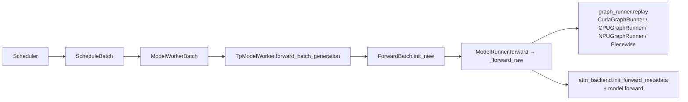

# `srt/model_executor` — Per-worker model running infrastructure

## Summary

> **命名陷阱（必读）**：SGLang 的 `srt/model_executor/` **不是** vLLM 风格里常见的 **`Executor` 分布式进程抽象**。在 SGLang 中，多进程扩展由 **多个 Scheduler 进程 + NCCL** 等完成（详 [`comparison/topics/executor-worker.md`](../../comparison/topics/executor-worker.md)，"SGLang 无 Executor 抽象"是顶层 synthesis）。**`model_executor/` 表示 worker 进程内的「模型运行基础设施」**：以 [`ModelRunner`](d:\design\sglang\python\sglang\srt\model_executor\model_runner.py) 为中心，承载前向、`ForwardBatch` 张量批、CUDA/CPU/NPU 图捕获，并与 [`layers/attention/`](d:\design\sglang\python\sglang\srt\layers\attention) 中的注意力后端协作。

`srt/model_executor/`（**13** `.py` 文件 / ~373 KB；与背景资料"14"略有出入，本轮实测 13）= **11 顶层 .py + 2 子目录 .py**（`breakable_cuda_graph/` 含 2 个文件）。`ModelRunner` 单文件 ~3192 行，是本模块绝对核心，承担：模型加载 / KV 池初始化 / 注意力 backend 选择 / 设备图捕获 / 前向分发。

> synthesis: 概念上更接近 vLLM 的 [`vllm/v1/worker/gpu_model_runner.py`](d:\design\vllm\vllm\v1\worker\gpu_model_runner.py) + [`vllm/v1/attention/backends/`](d:\design\vllm\vllm\v1\attention\backends) **组合**，而非 vLLM `Executor` 类层次（`abstract.py` + `MultiprocExecutor` 等）。MindIE 对应物是 [`mindie_llm/runtime/model_runner/`](d:\design\MindIE-LLM\mindie_llm\runtime\model_runner)。

## Sources

| 区域 | 锚点 |
|---|---|
| 模块根（13 `.py`） | [d:\design\sglang\python\sglang\srt\model_executor](d:\design\sglang\python\sglang\srt\model_executor) |
| 主类 | [model_runner.py](d:\design\sglang\python\sglang\srt\model_executor\model_runner.py)（~3192 行；`ModelRunner` L290+） |
| 批数据 | [forward_batch_info.py](d:\design\sglang\python\sglang\srt\model_executor\forward_batch_info.py)（~1215 行；`ForwardBatch` / `ForwardMode` / `init_new`） |
| CUDA 图 | [cuda_graph_runner.py](d:\design\sglang\python\sglang\srt\model_executor\cuda_graph_runner.py)（~1352 行；`CudaGraphRunner` L512+） |
| CPU 图 | [cpu_graph_runner.py](d:\design\sglang\python\sglang\srt\model_executor\cpu_graph_runner.py) |
| 分段图 | [piecewise_cuda_graph_runner.py](d:\design\sglang\python\sglang\srt\model_executor\piecewise_cuda_graph_runner.py) |
| 内存池配置 | [pool_configurator.py](d:\design\sglang\python\sglang\srt\model_executor\pool_configurator.py) |
| KV mixin | [model_runner_kv_cache_mixin.py](d:\design\sglang\python\sglang\srt\model_executor\model_runner_kv_cache_mixin.py) |
| 输入 buffer | [input_buffers.py](d:\design\sglang\python\sglang\srt\model_executor\input_buffers.py) |
| Hook | [hook_manager.py](d:\design\sglang\python\sglang\srt\model_executor\hook_manager.py) |
| MindSpore | [mindspore_runner.py](d:\design\sglang\python\sglang\srt\model_executor\mindspore_runner.py) |
| DeepSeek MHA mixin | [forward_batch_deepseek_mha_mixin.py](d:\design\sglang\python\sglang\srt\model_executor\forward_batch_deepseek_mha_mixin.py) |
| 可断 CUDA 图（子目录） | [breakable_cuda_graph/breakable_cuda_graph.py](d:\design\sglang\python\sglang\srt\model_executor\breakable_cuda_graph\breakable_cuda_graph.py)、[breakable_cuda_graph/cuda_utils.py](d:\design\sglang\python\sglang\srt\model_executor\breakable_cuda_graph\cuda_utils.py) |
| Worker 集成 | [managers/tp_worker.py:340-388, 431-472](d:\design\sglang\python\sglang\srt\managers\tp_worker.py) |
| Attention 注册表 | [layers/attention/attention_registry.py:20-28](d:\design\sglang\python\sglang\srt\layers\attention\attention_registry.py) |
| NPU 图（不在本目录） | [hardware_backend/npu/graph_runner/npu_graph_runner.py](d:\design\sglang\python\sglang\srt\hardware_backend\npu\graph_runner\npu_graph_runner.py)（`NPUGraphRunner` 子类化 `CudaGraphRunner`） |
| 配置 | [server_args.py:479-481, 619-625, 647-653](d:\design\sglang\python\sglang\srt\server_args.py) |

## Architecture / Data flow

文档化数据流 [`forward_batch_info.py:17-27`](d:\design\sglang\python\sglang\srt\model_executor\forward_batch_info.py)：`ScheduleBatch -> ModelWorkerBatch -> ForwardBatch`。

**入口链**：[`TpModelWorker.forward_batch_generation`](d:\design\sglang\python\sglang\srt\managers\tp_worker.py:443-472) 中先 `ForwardBatch.init_new(model_worker_batch, self.model_runner)`，再 `self.model_runner.forward(forward_batch, ...)`。**注意：`forward_batch_generation` 在 TpModelWorker 实体页**，不在 ModelRunner——本模块页讲文件与数据流，详细 worker 协作见 [`sglang/entities/TpModelWorker.md`](../entities/TpModelWorker.md)。

**图路径**：[`ModelRunner._forward_raw`](d:\design\sglang\python\sglang\srt\model_executor\model_runner.py)（约 L2932-2955）在 `can_run_graph` 时走 `self.graph_runner.replay`；否则走 MLP sync / attn TP scatter 再进入常规前向。

## File inventory（13 文件）

| 分组 | 文件 | 角色 |
|---|---|---|
| **核心前向** | [`model_runner.py`](d:\design\sglang\python\sglang\srt\model_executor\model_runner.py) | `ModelRunner` 主类 / `forward` / `forward_decode` / `forward_extend` / `_forward_raw` / `init_attention_backend` / `init_device_graphs` 等 |
| **批数据** | [`forward_batch_info.py`](d:\design\sglang\python\sglang\srt\model_executor\forward_batch_info.py) | `ForwardBatch` / `ForwardMode` / `init_new` 工厂 / DeepSeek MHA mixin 应用点 |
| **KV / 池** | [`model_runner_kv_cache_mixin.py`](d:\design\sglang\python\sglang\srt\model_executor\model_runner_kv_cache_mixin.py) | KV / Mamba / 内存池逻辑 mixin（`init_memory_pool` 等） |
| **池配置** | [`pool_configurator.py`](d:\design\sglang\python\sglang\srt\model_executor\pool_configurator.py) | KV / token pool 容量与 dtype 计算 |
| **设备图** | [`cuda_graph_runner.py`](d:\design\sglang\python\sglang\srt\model_executor\cuda_graph_runner.py) | `CudaGraphRunner`：捕获 / 回放、bs bucket、`DecodeInputBuffers` |
| **设备图** | [`cpu_graph_runner.py`](d:\design\sglang\python\sglang\srt\model_executor\cpu_graph_runner.py) | CPU 图路径（device == "cpu"） |
| **设备图** | [`piecewise_cuda_graph_runner.py`](d:\design\sglang\python\sglang\srt\model_executor\piecewise_cuda_graph_runner.py) | 分段 CUDA 图（极长 prompt / spec decode 场景） |
| **可断图（子目录）** | [`breakable_cuda_graph/breakable_cuda_graph.py`](d:\design\sglang\python\sglang\srt\model_executor\breakable_cuda_graph\breakable_cuda_graph.py) + [`cuda_utils.py`](d:\design\sglang\python\sglang\srt\model_executor\breakable_cuda_graph\cuda_utils.py) | 可中断 CUDA 图（非 HIP 路径） |
| **输入** | [`input_buffers.py`](d:\design\sglang\python\sglang\srt\model_executor\input_buffers.py) | 前向输入 buffer 抽象 |
| **Hook** | [`hook_manager.py`](d:\design\sglang\python\sglang\srt\model_executor\hook_manager.py) | 前向 hook 注册（debug / profiling） |
| **MindSpore** | [`mindspore_runner.py`](d:\design\sglang\python\sglang\srt\model_executor\mindspore_runner.py) | MindSpore 后端运行器（与 ModelRunner 平行） |
| **DeepSeek mixin** | [`forward_batch_deepseek_mha_mixin.py`](d:\design\sglang\python\sglang\srt\model_executor\forward_batch_deepseek_mha_mixin.py) | DeepSeek MHA 批处理 mixin（`ForwardBatch` 应用） |

> **不在本目录但密切协作**：[`hardware_backend/npu/graph_runner/npu_graph_runner.py`](d:\design\sglang\python\sglang\srt\hardware_backend\npu\graph_runner\npu_graph_runner.py)（`NPUGraphRunner` **子类化** `CudaGraphRunner`）；`ModelRunner.init_device_graphs` 按 `device` 选择实例化哪种（[model_runner.py:2547-2584](d:\design\sglang\python\sglang\srt\model_executor\model_runner.py)）。

> synthesis: **`expert_distribution` MoE 指标 NOT 在本模块**——`ModelRunner` 从 `sglang.srt.eplb.expert_distribution` 包导入（[model_runner.py:82-87](d:\design\sglang\python\sglang\srt\model_executor\model_runner.py)）。本目录不含 `expert_distribution.py`，与背景资料"或 `expert_distribution.py`"猜测不符。

## `ModelRunner` 类

- **职责**：模块头注释 *"ModelRunner runs the forward passes of the models."*（[model_runner.py:14](d:\design\sglang\python\sglang\srt\model_executor\model_runner.py)、[L290-291](d:\design\sglang\python\sglang\srt\model_executor\model_runner.py)）。
- **`__init__`**：接收 `ModelConfig` / `ServerArgs` / 各并行 rank / 可选 `req_to_token_pool` + `token_to_kv_pool_allocator`（[model_runner.py:293-314](d:\design\sglang\python\sglang\srt\model_executor\model_runner.py)）。
- **初始化主流程 `initialize`**（[model_runner.py:524-735](d:\design\sglang\python\sglang\srt\model_executor\model_runner.py)）：
  1. `load_model`
  2. `configure_kv_cache_dtype`
  3. `init_memory_pool`
  4. `init_attention_backend`
  5. `kernel_warmup`
  6. `init_device_graphs`
  7. `init_piecewise_cuda_graphs`
- **前向**：对外 `forward` 调 `_forward_raw`（[model_runner.py:2865-2906](d:\design\sglang\python\sglang\srt\model_executor\model_runner.py)）；模式拆分 `forward_decode` / `forward_extend`（[model_runner.py:2751-2823](d:\design\sglang\python\sglang\srt\model_executor\model_runner.py)）。
- **注意力 backend 选择**：`init_attention_backend` → `_get_attention_backend_from_str` 使用 `ATTENTION_BACKENDS` 注册表（[model_runner.py:2080-2154](d:\design\sglang\python\sglang\srt\model_executor\model_runner.py)、注册表 [layers/attention/attention_registry.py:20-28](d:\design\sglang\python\sglang\srt\layers\attention\attention_registry.py)）。

## `ForwardBatch` dataclass

- **构造工厂**：`ForwardBatch.init_new(batch: ModelWorkerBatch, model_runner: ModelRunner)`（[forward_batch_info.py:442-447](d:\design\sglang\python\sglang\srt\model_executor\forward_batch_info.py)）。
- **关键字段**（节选 [forward_batch_info.py:283-375](d:\design\sglang\python\sglang\srt\model_executor\forward_batch_info.py)）：
  - 模式：`forward_mode`
  - 张量：`input_ids` / `req_pool_indices` / `seq_lens` / `out_cache_loc`
  - 池引用：`req_to_token_pool` / `token_to_kv_pool` / `attn_backend`

## `CudaGraphRunner` / Graph capture

- **类**：[`CudaGraphRunner`](d:\design\sglang\python\sglang\srt\model_executor\cuda_graph_runner.py) docstring [L512-513](d:\design\sglang\python\sglang\srt\model_executor\cuda_graph_runner.py)
- **批大小决策**：`get_batch_sizes_to_capture` 读取 `server_args.cuda_graph_bs` + `req_to_token_pool.size`（[cuda_graph_runner.py:462-496](d:\design\sglang\python\sglang\srt\model_executor\cuda_graph_runner.py)）
- **构造**：`__init__` 中 `attn_backend.init_cuda_graph_state` + `capture`（[cuda_graph_runner.py:583-655](d:\design\sglang\python\sglang\srt\model_executor\cuda_graph_runner.py)）
- **能否运行**：`can_run`（[cuda_graph_runner.py:666-735](d:\design\sglang\python\sglang\srt\model_executor\cuda_graph_runner.py)）
- **挂载点**：`ModelRunner.init_device_graphs` 按 `device` 选 `CudaGraphRunner` / `CPUGraphRunner` / `NPUGraphRunner`（[model_runner.py:2547-2584](d:\design\sglang\python\sglang\srt\model_executor\model_runner.py)）

## Attention backend dispatch

- **注册表**：[`ATTENTION_BACKENDS`](d:\design\sglang\python\sglang\srt\layers\attention\attention_registry.py) + `register_attention_backend` decorator（[layers/attention/attention_registry.py:20-28](d:\design\sglang\python\sglang\srt\layers\attention\attention_registry.py)）
- **构造**：`ModelRunner._get_attention_backend_from_str` → `ATTENTION_BACKENDS[backend_str](self)` → `attn_backend_wrapper`（[model_runner.py:2147-2154](d:\design\sglang\python\sglang\srt\model_executor\model_runner.py)）
- **混合 prefill / decode**：`prefill_attention_backend_str` / `decode_attention_backend_str` 不等时走 `HybridAttnBackend`（[model_runner.py:2110-2134](d:\design\sglang\python\sglang\srt\model_executor\model_runner.py)）

## CLI / config 字段

| 字段 | 锚点 |
|---|---|
| `attention_backend` / `decode_attention_backend` / `prefill_attention_backend` | [server_args.py:479-481](d:\design\sglang\python\sglang\srt\server_args.py) |
| `cuda_graph_max_bs` / `cuda_graph_bs` | [server_args.py:619-620](d:\design\sglang\python\sglang\srt\server_args.py) |
| `disable_cuda_graph` / `disable_cuda_graph_padding` | [server_args.py:621-622](d:\design\sglang\python\sglang\srt\server_args.py) |
| `enable_profile_cuda_graph` / `debug_cuda_graph` | [server_args.py:623-625](d:\design\sglang\python\sglang\srt\server_args.py) |
| Piecewise 相关 | [server_args.py:647-653](d:\design\sglang\python\sglang\srt\server_args.py) |

## Worker integration

| 场景 | 行为 | 锚点 |
|---|---|---|
| **默认单 ModelRunner** | `TpModelWorker._init_model_runner` 创建 `self._model_runner = ModelRunner(...)` | [tp_worker.py:340-361](d:\design\sglang\python\sglang\srt\managers\tp_worker.py) |
| **Multi-layer EAGLE** | `model_runner_list` 追加多个 `ModelRunner`（每个 `draft_model_idx` 一份） | [tp_worker.py:256-388](d:\design\sglang\python\sglang\srt\managers\tp_worker.py) |
| **dLLM** | `_forward_batch_generation_dllm` 调 `dllm_algorithm.run(self.model_runner, forward_batch)` | [tp_worker.py:431-436](d:\design\sglang\python\sglang\srt\managers\tp_worker.py) |
| **bench / profiling** | `bench_one_batch.py` / `engine_info_bootstrap` 直接构造 `ModelRunner` | （详 §跨子系统引用 §2） |

> synthesis: **`ModelRunner` 是横切运行时核心**——TpModelWorker 不是唯一消费者。spec decode (multi-layer EAGLE / EAGLE V2) / dLLM / benchmark / hardware backend stub 都直接构造或持有 `ModelRunner` 实例。

## §跨子系统引用（§5 step 3）

按 [AGENTS.md §5 step 3](../../AGENTS.md#5-ingest-工作流) 5 类全仓库 grep。

### 1. 跨语言绑定（C++ / sgl-kernel）

- `ModelRunner`：**在 [`d:\design\sglang\sgl-kernel\`](d:\design\sglang\sgl-kernel) 全 C++ 树 grep 0 命中**
- `ForwardBatch`：**在 `d:\design\sglang\sgl-kernel\` 全 C++ 树 grep 0 命中**
- `CudaGraphRunner`：**在 `d:\design\sglang\sgl-kernel\` 全 C++ 树 grep 0 命中**

> synthesis: 本模块 **0** 跨语言绑定——所有自研 C++ kernel（attention / quantization / activation 等）通过 `torch.ops.sgl_kernel.*` 在 attention backend / layers 层调用，**`model_executor/` 自身不直接持 sgl-kernel 算子**。

### 2. 协作伙伴跨子系统引用

非穷举，已确认（`ModelRunner` 类全仓库 grep）：

| 协作模块 | 文件 / 路径 |
|---|---|
| **TpModelWorker** | [managers/tp_worker.py:340-388](d:\design\sglang\python\sglang\srt\managers\tp_worker.py) |
| **Speculative**（multi-layer EAGLE / EAGLE V2） | `srt/speculative/multi_layer_eagle_worker*.py`、`srt/speculative/eagle_info_v2.py` 等 |
| **Layers / attention** | `srt/layers/attention/*_backend.py`（消费 `ATTENTION_BACKENDS` 注册） |
| **DLLM** | `srt/dllm/algorithm/*.py`（直接调 `model_runner.forward`） |
| **Benchmark** | `srt/bench_one_batch.py` |
| **Hardware backend stub** | `srt/hardware_backend/mlx/model_runner_stub.py`（MLX 平台 stub） |
| **EPLB** | `srt/eplb/eplb_manager.py`（间接通过 ModelRunner 拿专家分布） |

### 3. 配置 / `ServerArgs`

- 见上节 §CLI / config 字段表
- `get_batch_sizes_to_capture` 使用 `server_args.cuda_graph_bs`（[cuda_graph_runner.py:462-464](d:\design\sglang\python\sglang\srt\model_executor\cuda_graph_runner.py)）

### 4. 测试覆盖反查

- `ModelRunner` 类引用：`test/registered/unit/model_executor/test_pool_configurator.py`、`test/manual/test_forward_split_prefill.py` 等
- `ForwardBatch` 引用：`test/registered/kernels/test_nsa_indexer.py`、`test/registered/debug_utils/test_dumper.py` 等
- **`CudaGraphRunner` 符号**：在 [`d:\design\sglang\test\`](d:\design\sglang\test) **全树 grep 0 命中**——图路径多经集成 / 间接覆盖（端到端测试），无单元测试

### 5. doc / config 反查

- [`docs/supported_models/extending/support_new_models.md`](d:\design\sglang\docs\supported_models\extending\support_new_models.md) 含 `forward_batch_info` / `ModelRunner.forward_decode` 引用
- [`docs/platforms/ascend/ascend_npu_support_features.md`](d:\design\sglang\docs\platforms\ascend\ascend_npu_support_features.md) 列出 `--cuda-graph-max-bs` 等

## 跨项目对照（synthesis）

| 维度 | MindIE | vLLM | SGLang（本模块） |
|---|---|---|---|
| **概念对齐** | [`mindie_llm/runtime/model_runner/`](d:\design\MindIE-LLM\mindie_llm\runtime\model_runner) | [`vllm/v1/worker/gpu_model_runner.py`](d:\design\vllm\vllm\v1\worker\gpu_model_runner.py)（`GPUModelRunner`） + [`vllm/v1/attention/backends/`](d:\design\vllm\vllm\v1\attention\backends) | `model_executor/`：**每 worker 基础设施**，**非分布式 Executor** |
| **Executor 抽象** | ❌ 无（Generator 直挂 PluginManager.forward_thread） | ✅ `Executor` 抽象 + 4 实现 | ❌ 无（Scheduler 直接持 `TpModelWorker`） |
| **forward+sample 拆分** | ❌ 单 method | ✅ 拆为 `execute_model` + `sample_tokens` 两 method | ⚠️ 同 method + 可选 `delay_sample_func` closure |
| **Graph capture** | aclgraph（NPU） | cudagraph_utils + encoder_cudagraph | **本模块**：CUDA / CPU / Piecewise CUDA / 可断图；NPU 在 hardware_backend/ |
| **Attention backend dispatch** | C++ 内嵌 + Python wrapper | 多 backend（FlashAttention / FlexAttention / Triton 等） | `ATTENTION_BACKENDS` 注册表 + 混合 prefill/decode 路径 |

详细 11 子维度对比见 [`comparison/topics/executor-worker.md`](../../comparison/topics/executor-worker.md)；维度索引 [`comparison/dimensions.md §dim-executor`](../../comparison/dimensions.md)。

## Notes / Caveats

> [!todo] VERIFY: pin 从 `34fef07a` → `06f32bab`（2026-08-10 increment）后本页未深 verify；文件数量/行号可能漂移。优先对照 [entities/Scheduler.md](../entities/Scheduler.md) / 新模块页。

> [!warning] CONTRADICTION（命名陷阱）：本模块名为 `model_executor` 但 **不是** vLLM/MindIE 风格的 "Executor" 分布式抽象。**SGLang 没有 Executor 类层次**（详 [`comparison/topics/executor-worker.md`](../../comparison/topics/executor-worker.md)）；本目录是"per-worker model running infra"。三家 cross compare 时不可按目录名同义套等价。

> [!todo] VERIFY: ~~背景材料称 `model_executor/` 约 **14** 个 `.py`；本仓库实测 **13**。版本差异？需在 [source-versions.md](../../source-versions.md) commit 升级时复测。~~
> **RESOLVED 2026-04-19**: 当前快照 `model_executor/**/*.py` Glob 计数 **13**（11 顶层 + `breakable_cuda_graph/` 子包 2），背景材料"14"为旧值；本快照锁定 13（[d:\design\sglang\python\sglang\srt\model_executor](d:\design\sglang\python\sglang\srt\model_executor)）。

> [!todo] VERIFY: ~~`expert_distribution` 在 [`sglang.srt.eplb`](d:\design\sglang\python\sglang\srt\eplb) 包，**不在** 本目录。本模块 [model_runner.py:82-86](d:\design\sglang\python\sglang\srt\model_executor\model_runner.py) 仅 import；EPLB 主入口在 sister 模块（待独立 ingest）。~~
> **RESOLVED 2026-04-19**: 已确认 — `model_runner.py` L82-87 `from sglang.srt.eplb.expert_distribution import (ExpertDistributionMetrics, ExpertDistributionRecorder, get_global_expert_distribution_recorder, set_global_expert_distribution_recorder)`，本目录 0 命中；EPLB 主入口在 [eplb 包](d:\design\sglang\python\sglang\srt\eplb)（[model_runner.py:82-87](d:\design\sglang\python\sglang\srt\model_executor\model_runner.py)）。

> [!todo] VERIFY: ~~`MindSporeRunner`（[mindspore_runner.py](d:\design\sglang\python\sglang\srt\model_executor\mindspore_runner.py)）与 `ModelRunner` 的关系——是平行替换（按 `device` 切换）还是装饰？是否在生产路径已用？本轮未深读，仅记目录存在。~~
> **RESOLVED 2026-04-19**: `mindspore_runner.py` **无 `MindSporeRunner` 类**，仅暴露模块级函数（`init_ms_distributed` / `set_ms_parallel_env` / `reuse_hccl_comm` / `run_scheduler_init`）；由 `ModelRunner.init_mindspore_runner` 在 `model_impl.lower() == ModelImpl.MINDSPORE and _is_npu` 时调用 `init_ms_distributed`，**不是平行 Runner，而是 NPU 上 MindSpore 通信初始化的辅助 hook**（[model_runner.py:510-522](d:\design\sglang\python\sglang\srt\model_executor\model_runner.py)、[mindspore_runner.py:108-120](d:\design\sglang\python\sglang\srt\model_executor\mindspore_runner.py)）。

## See also

- [sglang/entities/TpModelWorker.md](../entities/TpModelWorker.md) — Worker 持有 `model_runner_list: List[ModelRunner]`、`forward_batch_generation` 4 分支
- [sglang/entities/Scheduler.md](../entities/Scheduler.md) — Scheduler 通过 TpModelWorker 间接消费本模块
- [sglang/modules/managers.md](managers.md) — TpModelWorker 所属模块
- [sglang/modules/distributed.md](distributed.md) — `init_distributed_environment` 主消费方在本模块（`ModelRunner.init_distributed`）
- [sglang/modules/mem_cache.md](mem_cache.md) — `req_to_token_pool` / `token_to_kv_pool_allocator` 来源
- [comparison/topics/executor-worker.md](../../comparison/topics/executor-worker.md) — 三家 11 子维度（含 SGLang 无 Executor 抽象的 synthesis）
- [comparison/topics/engine-architecture.md](../../comparison/topics/engine-architecture.md) — §5 Engine↔Worker 边界
- [comparison/dimensions.md §dim-executor](../../comparison/dimensions.md)
