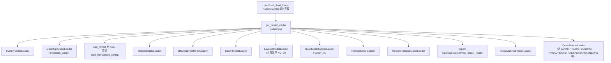

# `srt/model_loader` — 启动期权重管线（`LoadFormat` → `*ModelLoader`）

## Summary

[`model_loader`](d:\design\sglang\python\sglang\srt\model_loader) 目录共 **6** 个 `.py`（Glob 核对），是 SGLang **进程启动时**把 HuggingFace / 远程 / 实例间 / 量化等 **checkpoint 张量**灌进 `nn.Module` 的枢纽：包入口 [`get_model`](d:\design\sglang\python\sglang\srt\model_loader\__init__.py) 调用 [`get_model_loader`](d:\design\sglang\python\sglang\srt\model_loader\loader.py) 选取具体 [`BaseModelLoader`](d:\design\sglang\python\sglang\srt\model_loader\loader.py) 子类，再执行 [`load_model`](d:\design\sglang\python\sglang\srt\model_loader\loader.py)。

> synthesis: **「四条权重通道」收束**（与 [`connector.md`](connector.md)、[`weight_sync.md`](weight_sync.md)、[`checkpoint_engine.md`](checkpoint_engine.md) 对照）：
>
> 1. **本地 / HF 磁盘**：[`DefaultModelLoader`](d:\design\sglang\python\sglang\srt\model_loader\loader.py) + [`weight_utils`](d:\design\sglang\python\sglang\srt\model_loader\weight_utils.py) 的多种迭代器（`safetensors` / `pt` / `npcache` / `fastsafetensors` / Mistral 命名规则等）。
> 2. **远端对象存储 / KV（connector）**：[`LoadFormat.REMOTE`](d:\design\sglang\python\sglang\srt\configs\load_config.py) → [`RemoteModelLoader`](d:\design\sglang\python\sglang\srt\model_loader\loader.py)，经 `create_remote_connector` 分流 KV / FS。
> 3. **跨 SGLang 实例（NCCL / TransferEngine / ModelExpress）**：[`LoadFormat.REMOTE_INSTANCE`](d:\design\sglang\python\sglang\srt\configs\load_config.py) → [`RemoteInstanceModelLoader`](d:\design\sglang\python\sglang\srt\model_loader\loader.py)，与 [`remote_instance_weight_loader_utils`](d:\design\sglang\python\sglang\srt\model_loader\remote_instance_weight_loader_utils.py) 协作。
> 4. **运行中更新 vs 启动加载**：[`weight_sync`](weight_sync.md) 描述的 **在线张量 / 分布式更新** 不走本页「首次 `load_model`」主路径；[`checkpoint_engine`](checkpoint_engine.md) 通过 **IPC + `model.load_weights`** 复用加载后量化钩子（见下文）。**本模块**负责 **冷启动** 的格式选择与迭代器；**热路径** 多由 `ModelRunner` / `weight_sync` / checkpoint IPC 触达同一套 `load_weights` / `process_weights_after_loading`。

## Sources

| 区域 | 锚点 |
|---|---|
| 包入口与导出 | [`__init__.py:1-40`](d:\design\sglang\python\sglang\srt\model_loader\__init__.py) |
| `LoadFormat` / `LoadConfig` | [`load_config.py:15-34`](d:\design\sglang\python\sglang\srt\configs\load_config.py)、[`load_config.py:37-146`](d:\design\sglang\python\sglang\srt\configs\load_config.py) |
| 抽象基类 + 全部具体 Loader + 工厂 | [`loader.py:284-304`](d:\design\sglang\python\sglang\srt\model_loader\loader.py)、[`loader.py:306+`](d:\design\sglang\python\sglang\srt\model_loader\loader.py)、[`loader.py:3142-3229`](d:\design\sglang\python\sglang\srt\model_loader\loader.py) |
| 量化配置装配 | [`loader.py:192-258`](d:\design\sglang\python\sglang\srt\model_loader\loader.py)、[`weight_utils.py:165+`](d:\design\sglang\python\sglang\srt\model_loader\weight_utils.py)（`get_quant_config`） |
| 默认加载后处理 | [`loader.py:701-714`](d:\design\sglang\python\sglang\srt\model_loader\loader.py)、[`utils.py:250-259`](d:\design\sglang\python\sglang\srt\model_loader\utils.py) |
| TP / 分片辅助 | [`weight_utils.py:1008-1075`](d:\design\sglang\python\sglang\srt\model_loader\weight_utils.py) |
| 远端实例 | [`loader.py:2084-2177`](d:\design\sglang\python\sglang\srt\model_loader\loader.py)、[`remote_instance_weight_loader_utils.py:15-19`](d:\design\sglang\python\sglang\srt\model_loader\remote_instance_weight_loader_utils.py) |
| 远端 KV/FS | [`loader.py:2450-2594`](d:\design\sglang\python\sglang\srt\model_loader\loader.py) |
| CLI | [`server_args.py:83-99`](d:\design\sglang\python\sglang\srt\server_args.py)、[`server_args.py:3981-4008`](d:\design\sglang\python\sglang\srt\server_args.py)、[`server_args.py:4160-4165`](d:\design\sglang\python\sglang\srt\server_args.py) |
| 调度入口 | [`model_runner.py:1260-1267`](d:\design\sglang\python\sglang\srt\model_executor\model_runner.py) |

## Architecture / Data flow

> synthesis: [`get_model_loader`](d:\design\sglang\python\sglang\srt\model_loader\loader.py) 在 **ModelOpt / 量化标志**、**显式 Loader 类**（`load_format` 为 `type`）、以及 **`LoadFormat` 枚举** 之间做优先级判断；未特殊处理时 **回落** 到 `DefaultModelLoader`。

**关键分支锚点**（[`loader.py:3147-3229`](d:\design\sglang\python\sglang\srt\model_loader\loader.py)）：`DUMMY` → `DummyModelLoader`；`modelopt_quant` / `quantization in modelopt_*` → `ModelOptModelLoader`；`load_format == type` → 自定义类构造；`SHARDED_STATE` / `BITSANDBYTES` / `GGUF` / `LAYERED` / `FLASH_RL` / `REMOTE` / `REMOTE_INSTANCE` / `PRIVATE` / `RUNAI_STREAMER` 各对应一行 `return`；**其余** → `DefaultModelLoader`。

## File inventory（6 `.py`）

| 文件 | 职责摘要 |
|---|---|
| [`__init__.py`](d:\design\sglang\python\sglang\srt\model_loader\__init__.py) | `get_model` 编排；导出 `get_model_loader`、`BaseModelLoader`、`get_architecture_class_name`、`get_model_architecture` |
| [`loader.py`](d:\design\sglang\python\sglang\srt\model_loader\loader.py) | **主文件**：`BaseModelLoader`、全部 `*ModelLoader`、`get_model_loader`、`device_loading_context`、`_get_quantization_config`、`_initialize_model` 等 |
| [`weight_utils.py`](d:\design\sglang\python\sglang\srt\model_loader\weight_utils.py) | HF 下载、锁、各类 **权重迭代器**、`default_weight_loader` / 分片 loader、GGUF / Runai 相关 |
| [`utils.py`](d:\design\sglang\python\sglang\srt\model_loader\utils.py) | `set_default_torch_dtype`、`get_model_architecture` 解析、`post_load_weights` |
| [`remote_instance_weight_loader_utils.py`](d:\design\sglang\python\sglang\srt\model_loader\remote_instance_weight_loader_utils.py) | `RemoteInstanceWeightLoaderBackend`（`nccl` / `transfer_engine` / `modelexpress`）、HTTP 触发、TransferEngine 元数据 |
| [`ci_weight_validation.py`](d:\design\sglang\python\sglang\srt\model_loader\ci_weight_validation.py) | **仅 CI**：校验 / 清理 / 重试下载，由 `weight_utils` 在 `is_in_ci()` 下调用 |

## `LoadFormat` 枚举（全量）

锚点：[`load_config.py:15-34`](d:\design\sglang\python\sglang\srt\configs\load_config.py)。

| 成员 | 值 |
|---|---|
| `AUTO` | `auto` |
| `PT` | `pt` |
| `SAFETENSORS` | `safetensors` |
| `NPCACHE` | `npcache` |
| `DUMMY` | `dummy` |
| `SHARDED_STATE` | `sharded_state` |
| `GGUF` | `gguf` |
| `BITSANDBYTES` | `bitsandbytes` |
| `MISTRAL` | `mistral` |
| `LAYERED` | `layered` |
| `FLASH_RL` | `flash_rl` |
| `JAX` | `jax` |
| `REMOTE` | `remote` |
| `REMOTE_INSTANCE` | `remote_instance` |
| `RDMA` | `rdma` |
| `LOCAL_CACHED` | `local_cached` |
| `FASTSAFETENSORS` | `fastsafetensors` |
| `PRIVATE` | `private` |
| `RUNAI_STREAMER` | `runai_streamer` |

**计数**：`LoadFormat` **19** 个成员。

**CLI 对照**：[`LOAD_FORMAT_CHOICES`](d:\design\sglang\python\sglang\srt\server_args.py) 为 **16** 项（[`server_args.py:83-99`](d:\design\sglang\python\sglang\srt\server_args.py)），**未**包含 `jax` / `rdma` / `local_cached`。详见 **Notes / Caveats**。

## Loader 子类矩阵（继承 + `get_model_loader` 映射）

**计数**：继承 [`BaseModelLoader`](d:\design\sglang\python\sglang\srt\model_loader\loader.py) 的具体类 **11** 个（不含抽象基类本身）。

| 类 | 父类 | `get_model_loader` 触发条件（摘要） | 锚点 |
|---|---|---|---|
| `DefaultModelLoader` | `BaseModelLoader` | 默认回落；承担 `AUTO`/`PT`/`SAFETENSORS`/`NPCACHE`/`MISTRAL`/`FASTSAFETENSORS` 等 **磁盘**路径 | [`loader.py:306`](d:\design\sglang\python\sglang\srt\model_loader\loader.py)、[`loader.py:3229`](d:\design\sglang\python\sglang\srt\model_loader\loader.py) |
| `LayeredModelLoader` | `DefaultModelLoader` | `LoadFormat.LAYERED`（构造器内 `load_format = AUTO` 再调父类） | [`loader.py:716-723`](d:\design\sglang\python\sglang\srt\model_loader\loader.py)、[`loader.py:3187-3188`](d:\design\sglang\python\sglang\srt\model_loader\loader.py) |
| `QuantizedRLModelLoader` | `DefaultModelLoader` | `LoadFormat.FLASH_RL` | [`loader.py:790`](d:\design\sglang\python\sglang\srt\model_loader\loader.py)、[`loader.py:3191-3209`](d:\design\sglang\python\sglang\srt\model_loader\loader.py) |
| `ModelOptModelLoader` | `DefaultModelLoader` | `modelopt_quant` 或 `quantization in modelopt_*` 等 | [`loader.py:2631`](d:\design\sglang\python\sglang\srt\model_loader\loader.py)、[`loader.py:3150-3173`](d:\design\sglang\python\sglang\srt\model_loader\loader.py) |
| `DummyModelLoader` | `BaseModelLoader` | `LoadFormat.DUMMY` | [`loader.py:1263`](d:\design\sglang\python\sglang\srt\model_loader\loader.py)、[`loader.py:3147-3148`](d:\design\sglang\python\sglang\srt\model_loader\loader.py) |
| `ShardedStateLoader` | `BaseModelLoader` | `LoadFormat.SHARDED_STATE` | [`loader.py:1319`](d:\design\sglang\python\sglang\srt\model_loader\loader.py)、[`loader.py:3178-3179`](d:\design\sglang\python\sglang\srt\model_loader\loader.py) |
| `BitsAndBytesModelLoader` | `BaseModelLoader` | `LoadFormat.BITSANDBYTES` | [`loader.py:1500`](d:\design\sglang\python\sglang\srt\model_loader\loader.py)、[`loader.py:3181-3182`](d:\design\sglang\python\sglang\srt\model_loader\loader.py) |
| `GGUFModelLoader` | `BaseModelLoader` | `LoadFormat.GGUF` | [`loader.py:1978`](d:\design\sglang\python\sglang\srt\model_loader\loader.py)、[`loader.py:3184-3185`](d:\design\sglang\python\sglang\srt\model_loader\loader.py) |
| `RemoteInstanceModelLoader` | `BaseModelLoader` | `LoadFormat.REMOTE_INSTANCE` | [`loader.py:2084`](d:\design\sglang\python\sglang\srt\model_loader\loader.py)、[`loader.py:3213-3215`](d:\design\sglang\python\sglang\srt\model_loader\loader.py) |
| `RemoteModelLoader` | `BaseModelLoader` | `LoadFormat.REMOTE` | [`loader.py:2450`](d:\design\sglang\python\sglang\srt\model_loader\loader.py)、[`loader.py:3211-3212`](d:\design\sglang\python\sglang\srt\model_loader\loader.py) |
| `RunaiModelStreamerLoader` | `BaseModelLoader` | `LoadFormat.RUNAI_STREAMER` | [`loader.py:2903`](d:\design\sglang\python\sglang\srt\model_loader\loader.py)、[`loader.py:3226-3227`](d:\design\sglang\python\sglang\srt\model_loader\loader.py) |

**说明**

- **不存在**名为 `FastSafetensorsLoader` 的类：`LoadFormat.FASTSAFETENSORS` 在 [`DefaultModelLoader._get_weights_iterator`](d:\design\sglang\python\sglang\srt\model_loader\loader.py) 内切换到 [`fastsafetensors_weights_iterator`](d:\design\sglang\python\sglang\srt\model_loader\weight_utils.py)（[`loader.py:513-516`](d:\design\sglang\python\sglang\srt\model_loader\loader.py)）。
- **`PRIVATE`**：动态 `import sglang.private.private_model_loader`（[`loader.py:3216-3224`](d:\design\sglang\python\sglang\srt\model_loader\loader.py)），非开源树内类名固定为 `PrivateModelLoader`（字符串级事实以私有包为准）。

## `weight_utils.py` 关键辅助（节选）

锚点：顶层 `def` 列表见 [`weight_utils.py:79-1398+`](d:\design\sglang\python\sglang\srt\model_loader\weight_utils.py)。

| 类别 | 符号 | 作用 |
|---|---|---|
| 下载 / 缓存 | `download_weights_from_hf`、`download_safetensors_index_file_from_hf`、`filter_duplicate_safetensors_files`、`filter_files_not_needed_for_inference`、`maybe_add_mtp_safetensors` | HF 快照与分片索引处理 |
| 迭代器 | `np_cache_weights_iterator`、`safetensors_weights_iterator`、`buffered_multi_thread_safetensors_weights_iterator`、`multi_thread_safetensors_weights_iterator`、`fastsafetensors_weights_iterator`、`pt_weights_iterator`、`multi_thread_pt_weights_iterator`、`gguf_quant_weights_iterator`、`runai_safetensors_weights_iterator` | 按格式产出 `(name, tensor)` 流 |
| 锁 / 工具 | `get_lock`、`convert_bin_to_safetensor_file`、`replace_prefix`、`replace_substrings` | 缓存锁与键名变换 |
| 量化配置入口 | `get_quant_config` | 与 `layers/quantization` 集成 |
| 写入参数 | `default_weight_loader`、`row_parallel_weight_loader`、`sharded_weight_loader`、`composed_weight_loader`、`kv_cache_scales_loader`、`narrow_padded_param_and_loaded_weight` 等 | 与模型 `load_weights` 对接 |
| Runai 环境 | `set_runai_streamer_env` | [`RemoteModelLoader.__init__`](d:\design\sglang\python\sglang\srt\model_loader\loader.py) 亦调用（[`loader.py:2453-2456`](d:\design\sglang\python\sglang\srt\model_loader\loader.py)） |
| 占位 / dummy | `initialize_dummy_weights` | 与 `DummyModelLoader` 路径协同 |

## Quantization integration

1. **构造期**：[`_get_quantization_config`](d:\design\sglang\python\sglang\srt\model_loader\loader.py) 在 `model_config.quantization` 非空时调用 [`get_quant_config`](d:\design\sglang\python\sglang\srt\model_loader\weight_utils.py)（[`loader.py:226-257`](d:\design\sglang\python\sglang\srt\model_loader\loader.py)），并把 `QuantizationConfig` 传入 [`_initialize_model`](d:\design\sglang\python\sglang\srt\model_loader\loader.py) 的 `quant_config`（[`loader.py:261-281`](d:\design\sglang\python\sglang\srt\model_loader\loader.py)）。
2. **加载后**：[`DefaultModelLoader.load_weights_and_postprocess`](d:\design\sglang\python\sglang\srt\model_loader\loader.py) 在 `model.load_weights(weights)` 之后，对每个带 `quant_method` 的模块调用 [`quant_method.process_weights_after_loading`](d:\design\sglang\python\sglang\srt\model_loader\loader.py)（[`loader.py:701-714`](d:\design\sglang\python\sglang\srt\model_loader\loader.py)），并用 [`device_loading_context`](d:\design\sglang\python\sglang\srt\model_loader\loader.py) 处理 CPU offload 场景。
3. **模型级二阶段**：[`post_load_weights`](d:\design\sglang\python\sglang\srt\model_loader\utils.py) 注释写明两阶段（[`utils.py:250-254`](d:\design\sglang\python\sglang\srt\model_loader\utils.py)），若干 Loader 在远程 / sharded 路径上显式调用。

## Sharding / TP-aware loading

> synthesis: 分片 **不**在 `model_loader` 内做单一万能切分；而是由 **(a)** 各模型 `load_weights` 使用 `default_weight_loader` / `row_parallel_weight_loader` / `sharded_weight_loader`（[`weight_utils.py:1008-1075`](d:\design\sglang\python\sglang\srt\model_loader\weight_utils.py)），结合 `get_tensor_model_parallel_rank` / `get_attention_tp_rank`；**(b)** 远程 Loader 在 KV 路径用 `get_tensor_model_parallel_rank()` 取 **per-rank 迭代器**（[`loader.py:2463-2465`](d:\design\sglang\python\sglang\srt\model_loader\loader.py)）。

## CLI / ServerArgs

| 参数 / 字段 | 锚点 | 说明 |
|---|---|---|
| `--load-format` | [`server_args.py:3982-4001`](d:\design\sglang\python\sglang\srt\server_args.py) | `choices=LOAD_FORMAT_CHOICES`（[`server_args.py:83-99`](d:\design\sglang\python\sglang\srt\server_args.py)） |
| `--model-loader-extra-config` | [`server_args.py:4004-4008`](d:\design\sglang\python\sglang\srt\server_args.py) | JSON 字符串，写入 `LoadConfig.model_loader_extra_config`（[`load_config.py:70`](d:\design\sglang\python\sglang\srt\configs\load_config.py)）；`DefaultModelLoader` 仅允许 `enable_multithread_load` / `num_threads`（[`loader.py:348-357`](d:\design\sglang\python\sglang\srt\model_loader\loader.py)） |
| `--quantization` | [`server_args.py:4161-4165`](d:\design\sglang\python\sglang\srt\server_args.py) | `choices=QUANTIZATION_CHOICES`（与 `_get_quantization_config` 联动） |
| `--rl-quant-profile` | [`server_args.py:4228-4231`](d:\design\sglang\python\sglang\srt\server_args.py) | 与 `LoadConfig.rl_quant_profile`（[`load_config.py:97-100`](d:\design\sglang\python\sglang\srt\configs\load_config.py)）对应 |

## LoRA 交叉引用

[`LoRAAdapter.initialize_weights`](d:\design\sglang\python\sglang\srt\lora\lora.py) 直接构造 [`DefaultModelLoader(self.load_config)`](d:\design\sglang\python\sglang\srt\lora\lora.py)（[`lora.py:76-78`](d:\design\sglang\python\sglang\srt\lora\lora.py)），与主模型 **同一套** HF 权重迭代逻辑。

## checkpoint_engine 集成

[`SGLangCheckpointEngineWorkerExtensionImpl.get_model_loader`](d:\design\sglang\python\sglang\srt\checkpoint_engine\checkpoint_engine_worker.py) 返回 `self.model_runner.model.load_weights`（[`checkpoint_engine_worker.py:115-117`](d:\design\sglang\python\sglang\srt\checkpoint_engine\checkpoint_engine_worker.py)）；`get_post_hook` 复刻 `DefaultModelLoader` 的量化后处理 + `post_load_weights`（[`checkpoint_engine_worker.py:122-139`](d:\design\sglang\python\sglang\srt\checkpoint_engine\checkpoint_engine_worker.py)）。

## `ModelRunner` 热路径

- 启动加载：[`get_model_loader(self.load_config, self.model_config)`](d:\design\sglang\python\sglang\srt\model_executor\model_runner.py) → [`loader.load_model`](d:\design\sglang\python\sglang\srt\model_executor\model_runner.py)（[`model_runner.py:1260-1267`](d:\design\sglang\python\sglang\srt\model_executor\model_runner.py)）。
- **磁盘在线更新**：[`update_weights_from_disk`](d:\design\sglang\python\sglang\srt\model_executor\model_runner.py) 要求 `isinstance(loader, DefaultModelLoader)`（[`model_runner.py:1458-1462`](d:\design\sglang\python\sglang\srt\model_executor\model_runner.py)），并复用 [`load_weights_and_postprocess`](d:\design\sglang\python\sglang\srt\model_executor\model_runner.py)（[`model_runner.py:1475-1477`](d:\design\sglang\python\sglang\srt\model_executor\model_runner.py)）。

## §跨子系统（§5 step 3）

### 1. `sgl-kernel` C++ 绑定

在 [`d:\design\sglang\sgl-kernel\`](d:\design\sglang\sgl-kernel) 全树 grep `model_loader` / `ModelLoader`：**0 命中**（本模块纯 Python + PyTorch）。

### 2. 协作 import（`srt/`，排除 `model_loader/` 自身）

| 文件 | 行 | 内容 |
|---|---|---|
| [`model_runner.py`](d:\design\sglang\python\sglang\srt\model_executor\model_runner.py) | 146 | `DefaultModelLoader, get_model_loader` |
| [`model_runner.py`](d:\design\sglang\python\sglang\srt\model_executor\model_runner.py) | 1260-1263 | `get_model_loader(...)` |
| [`model_runner.py`](d:\design\sglang\python\sglang\srt\model_executor\model_runner.py) | 3114, 3122 | `RemoteModelLoader`、`ShardedStateLoader`（惰性 import） |
| [`encode_server.py`](d:\design\sglang\python\sglang\srt\disaggregation\encode_server.py) | 39 | `from sglang.srt.model_loader import get_model` |
| [`lora.py`](d:\design\sglang\python\sglang\srt\lora\lora.py) | 32 | `DefaultModelLoader` |
| [`elastic_ep/expert_backup_manager.py`](d:\design\sglang\python\sglang\srt\elastic_ep\expert_backup_manager.py) | 13, 82 | `get_model_loader` |
| [`eplb/expert_location.py`](d:\design\sglang\python\sglang\srt\eplb\expert_location.py) | 526 | `from sglang.srt.model_loader import get_model_architecture` |
| [`configs/update_config.py`](d:\design\sglang\python\sglang\srt\configs\update_config.py) | 14 | `_get_quantization_config` |
| [`checkpoint_engine_worker.py`](d:\design\sglang\python\sglang\srt\checkpoint_engine\checkpoint_engine_worker.py) | 125 | `device_loading_context` |
| [`models/grok.py`](d:\design\sglang\python\sglang\srt\models\grok.py) | 61 | `DefaultModelLoader` |
| [`models/clip.py`](d:\design\sglang\python\sglang\srt\models\clip.py) | 510 | `DefaultModelLoader` |

**更广义的 `weight_utils` 消费者**：`srt/models/*.py` **大量** `from sglang.srt.model_loader.weight_utils import default_weight_loader`（单文件 grep 可达数十个模型文件；架构上为 **逐层 `load_weights`** 回调）。

**`weight_sync/`**：对 `model_loader` 字符串 **0 命中**（该目录不直接 import 本包；在线更新路径见 [`weight_sync.md`](weight_sync.md) 与 `ModelRunner`）。

### 3. 配置 / CLI

见上文 **CLI / ServerArgs**；`LoadConfig` 另有远端实例专用字段（[`load_config.py:74-87`](d:\design\sglang\python\sglang\srt\configs\load_config.py)）。

### 4. 测试（`d:\design\sglang\test\`）

对 `ModelLoader` / `load_format` grep：**11** 个文件命中：

- [`test/registered/unit/model_loader/test_modelopt_loader.py`](d:\design\sglang\test\registered\unit\model_loader\test_modelopt_loader.py)
- [`test/registered/unit/model_loader/test_modelopt_export.py`](d:\design\sglang\test\registered\unit\model_loader\test_modelopt_export.py)
- [`test/registered/model_loading/test_runai_model_loader.py`](d:\design\sglang\test\registered\model_loading\test_runai_model_loader.py)
- [`test/registered/model_loading/test_utils_update_weights.py`](d:\design\sglang\test\registered\model_loading\test_utils_update_weights.py)
- [`test/registered/distributed/test_load_weights_from_remote_instance.py`](d:\design\sglang\test\registered\distributed\test_load_weights_from_remote_instance.py)
- [`test/registered/distributed/test_load_weights_from_remote_instance_npu.py`](d:\design\sglang\test\registered\distributed\test_load_weights_from_remote_instance_npu.py)
- [`test/registered/rl/test_update_weights_from_tensor.py`](d:\design\sglang\test\registered\rl\test_update_weights_from_tensor.py)
- [`test/registered/rl/test_update_weights_from_distributed.py`](d:\design\sglang\test\registered\rl\test_update_weights_from_distributed.py)
- [`test/registered/rl/test_lora_load_from_tensor.py`](d:\design\sglang\test\registered\rl\test_lora_load_from_tensor.py)
- [`test/registered/unit/test_runai_utils.py`](d:\design\sglang\test\registered\unit\test_runai_utils.py)
- [`test/manual/test_weight_version.py`](d:\design\sglang\test\manual\test_weight_version.py)

### 5. 文档（`d:\design\sglang\docs\`）

- [`docs/advanced_features/server_arguments.md`](d:\design\sglang\docs\advanced_features\server_arguments.md)：`--load-format` / `--model-loader-extra-config` 长表。
- [`docs/advanced_features/sglang_for_rl.md`](d:\design\sglang\docs\advanced_features\sglang_for_rl.md)：`load_format` 与 `flattened_bucket` 出现在 **Engine API `update_weights_*`** 语境（与 **启动期** `LoadFormat` **非同一枚举** — 见 Caveats）。
- [`docs/advanced_features/checkpoint_engine.md`](d:\design\sglang\docs\advanced_features\checkpoint_engine.md)：checkpoint 加载与多机场景。
- [`docs/advanced_features/quantization.md`](d:\design\sglang\docs\advanced_features\quantization.md)：离线量化模型加载限制。
- [`docs/advanced_features/object_storage.md`](d:\design\sglang\docs\advanced_features\object_storage.md)：对象存储与权重流式说明。

## 代码血缘（vs vLLM）

- [`__init__.py:1`](d:\design\sglang\python\sglang\srt\model_loader\__init__.py)：`Adapted from vllm ... v0.6.4.post1 ... model_loader/__init__.py`
- [`loader.py:1`](d:\design\sglang\python\sglang\srt\model_loader\loader.py)：`Adapted from vllm ... v0.6.3.post1 ... model_loader/loader.py`
- [`weight_utils.py:1`](d:\design\sglang\python\sglang\srt\model_loader\weight_utils.py)：`Adapted from vllm ... v0.6.4.post1 ... weight_utils.py`
- [`utils.py:1`](d:\design\sglang\python\sglang\srt\model_loader\utils.py)：`Adapted from vllm ... v0.6.4.post1 ... utils.py`
- [`load_config.py:1`](d:\design\sglang\python\sglang\srt\configs\load_config.py)：`Adapted from vllm ... v0.6.4.post1 ... config.py`（`LoadFormat` 定义处）

SGLang 在之上叠加：`REMOTE` / `REMOTE_INSTANCE` / `FLASH_RL` / `RUNAI_STREAMER` / `PRIVATE` / ModelOpt / QuantizedRL / connector / TransferEngine / ModelExpress 等。

## Cross-project synthesis

> synthesis: 与 vLLM 对齐的是 **HF 磁盘 + 量化钩子 + `default_weight_loader` 族**；SGLang 将 **生产环境** 常见的 **远端与多实例** 权重来源提升为 **一等 `LoadFormat` 分支**，并与 **connector**、**MoE / EP**（`elastic_ep`）、**PD 编码器**（`encode_server` 的 `get_model`）等子系统交叉。

## 数字核对

| 项 | 值 |
|---|---|
| `model_loader/*.py` 文件数 | **6** |
| `LoadFormat` 枚举成员数 | **19** |
| `BaseModelLoader` 的具体子类数 | **11** |
| `LOAD_FORMAT_CHOICES`（CLI）项数 | **16** |

## Increment 2026-08-18 (06f32bab → f7101b0a)

- **GGUF 原生加载**（commit `fde9ad2531` #34262，随 Muse Glimmer 模型族引入）：新文件 [`model_loader/gguf_name_maps.py`](d:\design\sglang\python\sglang\srt\model_loader\gguf_name_maps.py)（72 行）为 **上游 gguf-py 不认识的架构**手写 `{gguf_tensor_name: hf_param_name}` 映射表（docstring [gguf_name_maps.py:L16-23](d:\design\sglang\python\sglang\srt\model_loader\gguf_name_maps.py)，供 `GGUFModelLoader` / `gguf_quant_weights_iterator` 使用，消费方 [`loader.py`](d:\design\sglang\python\sglang\srt\model_loader\loader.py)）；配套新文件 [`utils/hf_transformers/gguf_native.py`](d:\design\sglang\python\sglang\srt\utils\hf_transformers\gguf_native.py)（258 行）从 transformers `load_gguf_checkpoint` 拒绝的架构 GGUF 中直接读 config/tokenizer（docstring [gguf_native.py:L15-21](d:\design\sglang\python\sglang\srt\utils\hf_transformers\gguf_native.py)；被 `utils/hf_transformers/` 的 `tokenizer.py` / `common.py` / `config.py` 引用）。
- **启动期 checkpoint staging 与 CUDA graph capture 重叠**（commit `6b94d39f13` #32017）：新文件 [`model_executor/model_runner_components/startup_weight_load.py`](d:\design\sglang\python\sglang\srt\model_executor\model_runner_components\startup_weight_load.py)（589 行，`StartupWeightLoadManager` [L238](d:\design\sglang\python\sglang\srt\model_executor\model_runner_components\startup_weight_load.py)）；由 `--startup-weight-load-mode overlap` 触发（[`server_args.py:L3226`](d:\design\sglang\python\sglang\srt\server_args.py)、[L8961-8962](d:\design\sglang\python\sglang\srt\server_args.py)），scheduler 在 [`scheduler.py:L996-997`](d:\design\sglang\python\sglang\srt\managers\scheduler.py) / [L1014-1015](d:\design\sglang\python\sglang\srt\managers\scheduler.py) 调 `tp_worker.start_startup_weight_load()` / `finalize_startup_weight_load()`。synthesis: 该文件属 `model_executor` 树但功能上是本页「启动期权重管线」的延伸，双方页面均记一笔。
- **文件数修正**：HEAD 下 `model_loader/` = **8** 个 `.py`（+`gguf_name_maps.py`）；`git ls-tree` 核对 pin `06f32bab` 时已是 **7** 个（`auto_loader.py` 在 pin 前已存在），正文「6 个 `.py`」为 2026-04-19 旧口径。本子树 06f32bab→HEAD diff：`loader.py` +220/-、`weight_utils.py` +162/-，行号锚点可能有小幅漂移。

> [!todo] VERIFY: `auto_loader.py`（pin 前新增）尚未纳入正文 Loader 清单；`LoadFormat` 枚举成员数（19）与 `LOAD_FORMAT_CHOICES`（16）是否因 GGUF 相关新格式变化未重数。

## Notes / Caveats

> [!todo] VERIFY: ~~`LoadFormat` 含 `JAX` / `RDMA` / `LOCAL_CACHED`（[`load_config.py:27-31`](d:\design\sglang\python\sglang\srt\configs\load_config.py)），但 [`get_model_loader`](d:\design\sglang\python\sglang\srt\model_loader\loader.py) **无**对应分支；若落到 `DefaultModelLoader._prepare_weights` 可能触发 `Unknown load_format`（[`loader.py:420-421`](d:\design\sglang\python\sglang\srt\model_loader\loader.py)）。需确认是否仅保留占位或由其他入口使用。~~
> **RESOLVED 2026-04-19**: 已确认 — `get_model_loader` L3147-3229 全部 if 链对 `JAX` / `RDMA` / `LOCAL_CACHED` 0 分支，最终 `return DefaultModelLoader(load_config)`；`DefaultModelLoader._prepare_weights` L400-419 仅识别 `AUTO`/`SAFETENSORS`/`FASTSAFETENSORS`/`MISTRAL`/`PT`/`NPCACHE`/`DUMMY`，三者落到 `else: raise ValueError("Unknown load_format: ...")`（确认死路径，仅占位）（[loader.py:3142-3229](d:\design\sglang\python\sglang\srt\model_loader\loader.py)、[loader.py:420-421](d:\design\sglang\python\sglang\srt\model_loader\loader.py)）。

> [!warning] CONTRADICTION: ~~**CLI** [`LOAD_FORMAT_CHOICES`](d:\design\sglang\python\sglang\srt\server_args.py)（16 项）**缺少** `jax` / `rdma` / `local_cached`，与 **枚举 19 项** 不一致。~~
> **RESOLVED 2026-04-19**: 已确认且已与 VERIFY 同源 — `LoadFormat` 19 成员（[load_config.py:15-34](d:\design\sglang\python\sglang\srt\configs\load_config.py)），`LOAD_FORMAT_CHOICES` 16 项（[server_args.py:83-100](d:\design\sglang\python\sglang\srt\server_args.py)），缺失 3 项 `jax`/`rdma`/`local_cached` 在代码中均无 dispatcher 分支（见上条 RESOLVED）。**结论**：CLI 与 enum 差距是**有意为之**的占位，不是 bug。

> [!warning] CONTRADICTION: 文档 [`sglang_for_rl.md`](d:\design\sglang\docs\advanced_features\sglang_for_rl.md) 中 `flattened_bucket` 出现在 `update_weights_*` API 的 `load_format` 说明，与 **启动期** [`LoadFormat`](d:\design\sglang\python\sglang\srt\configs\load_config.py) **不是同一概念**；勿与 `--load-format` 混用叙述。

## See also

- [sglang/modules/connector.md](connector.md)（`RemoteModelLoader` + `create_remote_connector`）
- [sglang/modules/weight_sync.md](weight_sync.md)（运行中权重更新与三通道正交叙述）
- [sglang/modules/checkpoint_engine.md](checkpoint_engine.md)（IPC 权重与 `load_weights` 钩子）
- [sglang/modules/lora.md](lora.md)（`DefaultModelLoader` 复用）
- [sglang/index.md](../index.md)
- 源码根：[`d:\design\sglang\python\sglang\srt\model_loader\`](d:\design\sglang\python\sglang\srt\model_loader)
