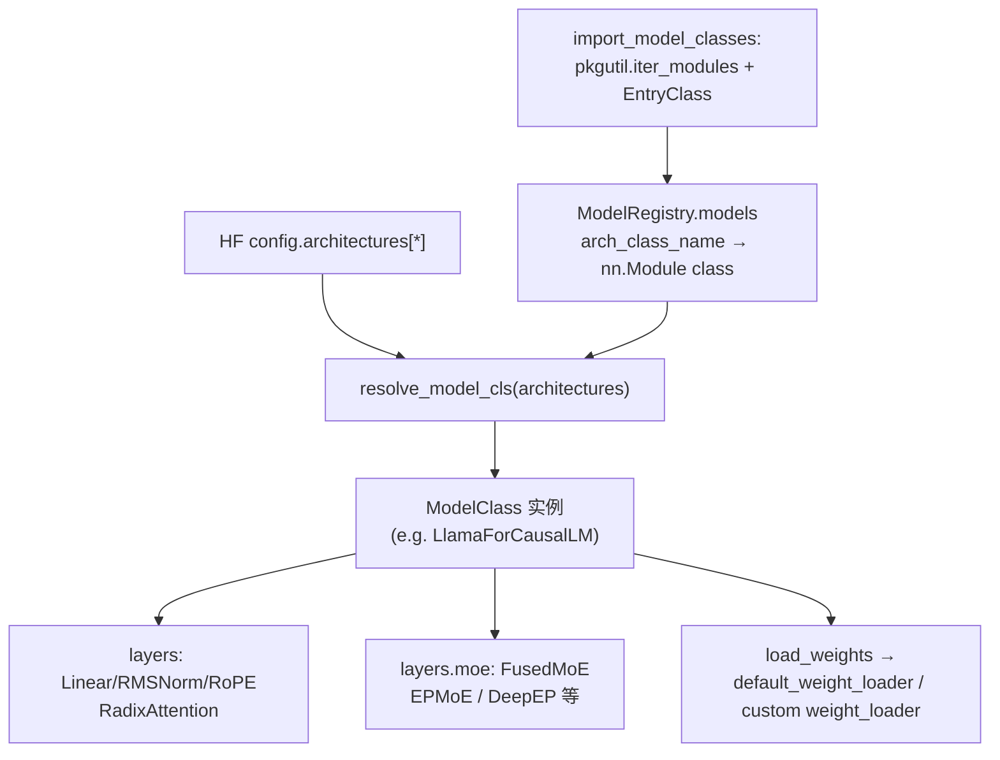

# `srt/models` — HF 权重上的推理模型实现矩阵

## Summary

[`models`](d:\design\sglang\python\sglang\srt\models) 是 SGLang **`srt` 中体量最大的子树**：Glob（`**/*.py`）核对为 **185** 个 `.py` 文件（含 [`deepseek_common/`](d:\design\sglang\python\sglang\srt\models\deepseek_common) 子包；既有 wiki 推断 186，差 1 — 加 VERIFY）。**无** 包级 `__init__.py`（与多数 `srt` 子目录一致）；**注册入口**集中在 [`registry.py`](d:\design\sglang\python\sglang\srt\models\registry.py) 的 [`ModelRegistry.register("sglang.srt.models")`](d:\design\sglang\python\sglang\srt\models\registry.py)。

职责可概括为：

1. **按 HF `config.architectures[*]` 类名** 解析出 `nn.Module` 实现（[`import_model_classes`](d:\design\sglang\python\sglang\srt\models\registry.py) 扫描子模块上的 **`EntryClass`**，键为 **Python 类名** → 值 `Type[nn.Module]`）。
2. **每层** 组合 `sglang.srt.layers` 中的并行线性、RMSNorm、RoPE、[`RadixAttention`](d:\design\sglang\python\sglang\srt\layers\radix_attention.py)、（可选）[`FusedMoE`](d:\design\sglang\python\sglang\srt\layers\moe\fused_moe_triton\layer.py) / [`get_moe_impl_class`](d:\design\sglang\python\sglang\srt\layers\moe\ep_moe\layer.py) 等。
3. **`load_weights`**：遍历 HF 权重名，经 `stacked_params_mapping` 等映射到并行参数，并调用 `param.weight_loader` 或 [`default_weight_loader`](d:\design\sglang\python\sglang\srt\model_loader\weight_utils.py)（详见 [model_loader.md](model_loader.md)）。
4. **多模态**：Vision/Audio 塔与 `MultimodalInputs` 路径常出现在 `*_vl.py`、`llava.py`、`mllama.py` 等；**占位符与 Processor 注册**在 [`multimodal/`](d:\design\sglang\python\sglang\srt\multimodal)（见 [multimodal.md](multimodal.md)）。

> synthesis: 本页是 **家族级** 索引，不逐文件枚举；具体架构以各文件内 **`EntryClass`** 与 HF 类名为准。

## Sources

| 区域 | 锚点 |
|---|---|
| 模型注册表 / 自动发现 | [`registry.py:17-125`](d:\design\sglang\python\sglang\srt\models\registry.py)（`_ModelRegistry` / `import_model_classes` / `EntryClass` list 或单类）、[`registry.py:128-132`](d:\design\sglang\python\sglang\srt\models\registry.py)（`ModelRegistry.register` + 外部包覆盖） |
| 架构解析与 Transformers 回退 | [`utils.py:193-228`](d:\design\sglang\python\sglang\srt\model_loader\utils.py)（`get_model_architecture` → `ModelRegistry.resolve_model_cls`）、[`utils.py:250-259`](d:\design\sglang\python\sglang\srt\model_loader\utils.py)（`post_load_weights` 特例） |
| 「模板」Llama 因果 LM | [`llama.py:121-198`](d:\design\sglang\python\sglang\srt\models\llama.py)（`LlamaAttention` + `RadixAttention`）、[`llama.py:610-635`](d:\design\sglang\python\sglang\srt\models\llama.py)（`LlamaForCausalLM.load_weights`）、[`llama.py:824-829`](d:\design\sglang\python\sglang\srt\models\llama.py)（`EntryClass` 多架构别名） |
| DeepSeek V2/V3 + MLA + MoE | [`deepseek_v2.py:88-96`](d:\design\sglang\python\sglang\srt\models\deepseek_v2.py)（`FusedMoE` / `get_moe_impl_class`）、[`deepseek_v2.py:171-173`](d:\design\sglang\python\sglang\srt\models\deepseek_v2.py)（CUDA 上 `sgl_kernel`：`dsv3_fused_a_gemm`、`dsv3_router_gemm`）、[`deepseek_v2.py:2397`](d:\design\sglang\python\sglang\srt\models\deepseek_v2.py)（`EntryClass`）、[`deepseek_common/`](d:\design\sglang\python\sglang\srt\models\deepseek_common) |
| Qwen3-VL | [`qwen3_vl.py:29-76`](d:\design\sglang\python\sglang\srt\models\qwen3_vl.py)、[`qwen3_vl.py:1389`](d:\design\sglang\python\sglang\srt\models\qwen3_vl.py)（`EntryClass = Qwen3VLForConditionalGeneration`） |
| LLaDA2 MoE（DLLM 族） | [`llada2.py:58-61`](d:\design\sglang\python\sglang\srt\models\llada2.py)、[`llada2.py:946`](d:\design\sglang\python\sglang\srt\models\llada2.py)（`EntryClass = LLaDA2MoeModelLM`） |
| 嵌入模型（小文件示例） | [`llama_embedding.py:14-87`](d:\design\sglang\python\sglang\srt\models\llama_embedding.py) |
| Transformers 后端包装 | [`transformers.py:48-51`](d:\design\sglang\python\sglang\srt\models\transformers.py)、[`transformers.py:15-17`](d:\design\sglang\python\sglang\srt\models\transformers.py)（vLLM 溯源注释） |
| CLI | [`server_args.py:4041-4052`](d:\design\sglang\python\sglang\srt\server_args.py)（`--model-impl`：`auto` / `sglang` / `transformers` / `mindspore`） |

## Architecture

> synthesis: 调度侧 **`get_model_architecture`** 决定 **原生模块类** 或 **`TransformersForCausalLM` 包装**；一旦类实例化，**前向 / KV / MoE** 均在 `ModelRunner` 路径上执行。

## Common patterns（从代表文件归纳）

### 1) `nn.Module` + `forward` 签名

典型因果模型：[`LlamaForCausalLM.forward`](d:\design\sglang\python\sglang\srt\models\llama.py) 接收 `input_ids`、`positions`、[`ForwardBatch`](d:\design\sglang\python\sglang\srt\model_executor\forward_batch_info.py)，返回 [`LogitsProcessorOutput`](d:\design\sglang\python\sglang\srt\layers\logits_processor.py)。嵌入模型则返回 [`EmbeddingPoolerOutput`](d:\design\sglang\python\sglang\srt\models\llama_embedding.py)。

### 2) `EntryClass` 注册

[`import_model_classes`](d:\design\sglang\python\sglang\srt\models\registry.py) 读取模块属性 **`EntryClass`**：可为 **列表**（多 HF 架构共用实现，如 [llama.py:824-829](d:\design\sglang\python\sglang\srt\models\llama.py)）或 **单个类**（如 [qwen3_vl.py:1389](d:\design\sglang\python\sglang\srt\models\qwen3_vl.py)）；注册表键为 **`tmp.__name__`**（类名字符串，与 HF `architectures` 对齐）。

### 3) 层组合（`layers`）

代表：[llama.py:31-47](d:\design\sglang\python\sglang\srt\models\llama.py) — `RMSNorm`、`MergedColumnParallelLinear` / `QKVParallelLinear` / `RowParallelLinear`、`get_rope`、`RadixAttention`、`ParallelLMHead` / `VocabParallelEmbedding`；构造普遍带 `quant_config: Optional[QuantizationConfig]`。

### 4) Attention 绑定

标准解码自注意力：在 `LlamaAttention` 内实例化 [`RadixAttention`](d:\design\sglang\python\sglang\srt\models\llama.py)（layer_id、head 布局、可选 `quant_config`）。DeepSeek 族在 [`deepseek_v2.py`](d:\design\sglang\python\sglang\srt\models\deepseek_v2.py) 使用 [`AttentionBackendRegistry`](d:\design\sglang\python\sglang\srt\models\deepseek_common\attention_backend_handler.py) + [`deepseek_common/attention_forward_methods/`](d:\design\sglang\python\sglang\srt\models\deepseek_common\attention_forward_methods) 在 **MLA / MHA / NSA** 等路径间切换。

### 5) MoE 集成

常见模式：`get_moe_impl_class(...)` 选取 EP / DeepEP 等实现 + [`FusedMoE`](d:\design\sglang\python\sglang\srt\layers\moe\fused_moe_triton\layer.py) 封装专家计算；[`llada2.py`](d:\design\sglang\python\sglang\srt\models\llada2.py)、[`deepseek_v2.py`](d:\design\sglang\python\sglang\srt\models\deepseek_v2.py)、[`transformers.py`](d:\design\sglang\python\sglang\srt\models\transformers.py) 均可见。

### 6) `load_weights`

典型循环：[`LlamaForCausalLM.load_weights`](d:\design\sglang\python\sglang\srt\models\llama.py) 维护 `stacked_params_mapping`，按名称匹配 `named_parameters()`，再 `weight_loader(param, loaded_weight, shard_id)`；未分片则 `getattr(param, "weight_loader", default_weight_loader)`。

## File inventory（按家族分组，矩阵行）

> 说明：**文件数** 为 Glob 按前缀/通配符统计的近似值，用于导航；**不等于** HF 架构数量（一个文件可有多个 `EntryClass`）。**代表性 `EntryClass`** 摘自文件末尾或文内主类。

| 家族 | 约文件数 | 代表性 `EntryClass` / 锚点 | 备注 |
|---|---:|---|---|
| **Registry / 通用** | 4 | [`registry.py`](d:\design\sglang\python\sglang\srt\models\registry.py) `ModelRegistry` | 另含 [`utils.py`](d:\design\sglang\python\sglang\srt\models\utils.py)、[`transformers.py`](d:\design\sglang\python\sglang\srt\models\transformers.py)（HF 包装）、[`torch_native_llama.py`](d:\design\sglang\python\sglang\srt\models\torch_native_llama.py)、[`mindspore.py`](d:\design\sglang\python\sglang\srt\models\mindspore.py) |
| **Qwen 全系** | 21 | [`qwen3.py`](d:\design\sglang\python\sglang\srt\models\qwen3.py)、[`qwen2_moe.py`](d:\design\sglang\python\sglang\srt\models\qwen2_moe.py)、[`qwen3_vl.py`](d:\design\sglang\python\sglang\srt\models\qwen3_vl.py) | Glob `qwen*.py`；含 RM/分类/MTP/ASR/Omni 等变体 |
| **Llama / 衍生** | 7 | [`llama.py`](d:\design\sglang\python\sglang\srt\models\llama.py) `LlamaForCausalLM` 等 | `llama_*.py`；Eagle/分类/Reward |
| **Mllama / Llama4** | 2 | [`mllama.py`](d:\design\sglang\python\sglang\srt\models\mllama.py)、[`mllama4.py`](d:\design\sglang\python\sglang\srt\models\mllama4.py) | 与 Meta 多模态 Llama 相关 |
| **Nemotron** | 4 | [`nemotron_h.py`](d:\design\sglang\python\sglang\srt\models\nemotron_h.py)、[`nano_nemotron_vl.py`](d:\design\sglang\python\sglang\srt\models\nano_nemotron_vl.py) | 含 NAS、MTP、VL |
| **DeepSeek + common** | 6 + 9 | [`deepseek_v2.py`](d:\design\sglang\python\sglang\srt\models\deepseek_v2.py)、[`deepseek_common/`](d:\design\sglang\python\sglang\srt\models\deepseek_common) | V2/V3/NextN/VL2/OCR/Janus 等；MLA 子系统在 `deepseek_common` |
| **ChatGLM / GLM4** | 9 | [`glm4.py`](d:\design\sglang\python\sglang\srt\models\glm4.py)、[`glm4v.py`](d:\design\sglang\python\sglang\srt\models\glm4v.py)、[`glm4_moe.py`](d:\design\sglang\python\sglang\srt\models\glm4_moe.py) | 含 OCR/ASR/MoE lite |
| **Gemma** | 12 | [`gemma.py`](d:\design\sglang\python\sglang\srt\models\gemma.py)、[`gemma3_mm.py`](d:\design\sglang\python\sglang\srt\models\gemma3_mm.py)、[`gemma4_causal.py`](d:\design\sglang\python\sglang\srt\models\gemma4_causal.py) | 多代 causal / MM / audio / vision 拆分 |
| **Mistral / Mixtral / Ministral** | 5+ | [`mistral.py`](d:\design\sglang\python\sglang\srt\models\mistral.py)、[`mixtral.py`](d:\design\sglang\python\sglang\srt\models\mixtral.py)、[`ministral3.py`](d:\design\sglang\python\sglang\srt\models\ministral3.py) | 另含 `mistral_large_3*`、Eagle、量化 Mixtral |
| **InternVL / InternLM / InternS1** | 5 | [`internvl.py`](d:\design\sglang\python\sglang\srt\models\internvl.py)、[`internlm2.py`](d:\design\sglang\python\sglang\srt\models\internlm2.py) | _reward 变体 |
| **Kimi** | 3+ | [`kimi_vl.py`](d:\design\sglang\python\sglang\srt\models\kimi_vl.py)、[`kimi_linear.py`](d:\design\sglang\python\sglang\srt\models\kimi_linear.py)、[`kimi_k25.py`](d:\design\sglang\python\sglang\srt\models\kimi_k25.py) | 另含 `kimi_vl_moonvit.py` |
| **Phi / Pixtral** | 5+ | [`phi.py`](d:\design\sglang\python\sglang\srt\models\phi.py)、[`phi4mm.py`](d:\design\sglang\python\sglang\srt\models\phi4mm.py)、[`pixtral.py`](d:\design\sglang\python\sglang\srt\models\pixtral.py) | `phi3_small`、`phi4mm_*` |
| **OLMo / OLMoE** | 3 | [`olmo.py`](d:\design\sglang\python\sglang\srt\models\olmo.py)、[`olmoe.py`](d:\design\sglang\python\sglang\srt\models\olmoe.py) | |
| **Granite / Grok / DBRX** | 若干 | [`granite.py`](d:\design\sglang\python\sglang\srt\models\granite.py)、[`grok.py`](d:\design\sglang\python\sglang\srt\models\grok.py)、[`dbrx.py`](d:\design\sglang\python\sglang\srt\models\dbrx.py) | 含 `granitemoe*.py` |
| **Exaone / Ernie / Bailing / AFMoE** | 若干 | [`exaone_moe.py`](d:\design\sglang\python\sglang\srt\models\exaone_moe.py)、[`ernie45_vl.py`](d:\design\sglang\python\sglang\srt\models\ernie45_vl.py)、[`bailing_moe.py`](d:\design\sglang\python\sglang\srt\models\bailing_moe.py) | 中韩系 MoE 族 |
| **Step / MiniMax / MiMo / LongCat** | 若干 | [`step3_vl.py`](d:\design\sglang\python\sglang\srt\models\step3_vl.py)、[`minimax_m2.py`](d:\design\sglang\python\sglang\srt\models\minimax_m2.py)、[`mimo.py`](d:\design\sglang\python\sglang\srt\models\mimo.py)、[`longcat_flash.py`](d:\design\sglang\python\sglang\srt\models\longcat_flash.py) | 多含 MTP/Flash/NextN |
| **NVILA / Jet / YIVL / Dots** | 若干 | [`nvila.py`](d:\design\sglang\python\sglang\srt\models\nvila.py)、[`jet_vlm.py`](d:\design\sglang\python\sglang\srt\models\jet_vlm.py)、[`dots_vlm.py`](d:\design\sglang\python\sglang\srt\models\dots_vlm.py) | |
| **LLaVA / 视觉塔杂项** | 若干 | [`llava.py`](d:\design\sglang\python\sglang\srt\models\llava.py)、[`llavavid.py`](d:\design\sglang\python\sglang\srt\models\llavavid.py)、[`idefics2.py`](d:\design\sglang\python\sglang\srt\models\idefics2.py) | 与 [multimodal.md](multimodal.md) 处理器交叉 |
| **音频 / 语音** | 若干 | [`whisper.py`](d:\design\sglang\python\sglang\srt\models\whisper.py)、[`voxtral.py`](d:\design\sglang\python\sglang\srt\models\voxtral.py)、[`qwen2_audio.py`](d:\design\sglang\python\sglang\srt\models\qwen2_audio.py) | |
| **OCR / 文档** | 若干 | [`deepseek_ocr.py`](d:\design\sglang\python\sglang\srt\models\deepseek_ocr.py)、[`paddleocr_vl.py`](d:\design\sglang\python\sglang\srt\models\paddleocr_vl.py)、[`lightonocr.py`](d:\design\sglang\python\sglang\srt\models\lightonocr.py) | |
| **扩散 / DLLM** | 若干 | [`llada2.py`](d:\design\sglang\python\sglang\srt\models\llada2.py)、[`sdar.py`](d:\design\sglang\python\sglang\srt\models\sdar.py) | 调度见 [dllm.md](dllm.md) |
| **嵌入 / 池化** | 1+ | [`llama_embedding.py`](d:\design\sglang\python\sglang\srt\models\llama_embedding.py) | `LlamaEmbeddingModel`、`MistralModel` 别名 |
| **其它开源权重** | 若干 | [`opt.py`](d:\design\sglang\python\sglang\srt\models\opt.py)、[`gpt2.py`](d:\design\sglang\python\sglang\srt\models\gpt2.py)、[`baichuan.py`](d:\design\sglang\python\sglang\srt\models\baichuan.py)、[`xverse.py`](d:\design\sglang\python\sglang\srt\models\xverse.py) | 覆盖经典堆栈 |

> **`*_embedding.py` / bge / gte**：Glob 仅 [`llama_embedding.py`](d:\design\sglang\python\sglang\srt\models\llama_embedding.py)；**检索类嵌入**更多在 **Reward/分类** 文件或 Transformers 路径（见 [`docs/supported_models/retrieval_ranking/embedding_models.md`](d:\design\sglang\docs\supported_models\retrieval_ranking\embedding_models.md)）。

## Models registration mechanism

1. [`ModelRegistry.register("sglang.srt.models")`](d:\design\sglang\python\sglang\srt\models\registry.py) 在 **import `registry` 模块时** 执行。
2. [`import_model_classes`](d:\design\sglang\python\sglang\srt\models\registry.py)：`pkgutil.iter_modules` 遍历 **顶层 `*.py`**（**不递归子目录**）；子包如 [`deepseek_common/`](d:\design\sglang\python\sglang\srt\models\deepseek_common) **由 `deepseek_v2.py` 等显式 import**，不单独注册。
3. 每个模块的 **`EntryClass`** 映射到 **`arch_class_name` → 类**；重复注册会 `assert` 失败（除非外部包 `overwrite`，见 [registry.py:131-132](d:\design\sglang\python\sglang\srt\models\registry.py)）。
4. [`get_model_architecture`](d:\design\sglang\python\sglang\srt\model_loader\utils.py) 读取 HF `architectures`，必要时 **追加 `TransformersForCausalLM`** 作为回退（[registry.py:73-76](d:\design\sglang\python\sglang\srt\models\registry.py) 的 `_normalize_archs`），并处理 `model_impl` / MindSpore 等分支。

## Layer composition cross-link

- **并行与归一化**：[`layers/layernorm`](d:\design\sglang\python\sglang\srt\layers\layernorm.py)、[`layers/linear`](d:\design\sglang\python\sglang\srt\layers\linear.py)。
- **RoPE**：[`layers/rotary_embedding`](d:\design\sglang\python\sglang\srt\layers\rotary_embedding.py)。
- **注意力**：[`layers/radix_attention.py`](d:\design\sglang\python\sglang\srt\layers\radix_attention.py)（与 `mem_cache` / flashinfer 后端在运行时装配）。
- **MoE**：[`layers/moe/`](d:\design\sglang\python\sglang\srt\layers\moe)。
- **量化**：`QuantizationConfig` 贯穿模块 `__init__`。

详见 [layers.md](layers.md)。

## Lineage（vLLM / Transformers）

- 大量文件头部含 **`# Adapted from`**；`grep "Adapted from" **/*.py` 的 `files_with_matches` 约 **90** 个文件。
- 显式 **`vllm-project/vllm`** URL：`grep` `files_with_matches` 为 **54** 个文件（含 [`registry.py`](d:\design\sglang\python\sglang\srt\models\registry.py)、[`deepseek_common/.../forward_mha.py`](d:\design\sglang\python\sglang\srt\models\deepseek_common\attention_forward_methods\forward_mha.py)）。
- **Transformers/HF** 溯源常出现在 Qwen/Gemma/多模态等（例：[qwen3_vl.py:1-14](d:\design\sglang\python\sglang\srt\models\qwen3_vl.py)）。

## CLI cross-link

- **`--model-path`**：见 [`server_args.py`](d:\design\sglang\python\sglang\srt\server_args.py)（常规模型目录）。
- **`--model-impl`**：[server_args.py:4041-4052](d:\design\sglang\python\sglang\srt\server_args.py) — `auto` 优先原生 `EntryClass`，否则可回落 **`transformers`** 实现（与 [`get_model_architecture`](d:\design\sglang\python\sglang\srt\model_loader\utils.py) 协同）。

## §跨子系统（5 类 grep / 导航）

1. **`sgl_kernel` / `sgl_kernel_npu`**（模型侧调用点，节选）：[`deepseek_v2.py:171-173`](d:\design\sglang\python\sglang\srt\models\deepseek_v2.py)（`dsv3_*`）、[`glm4_moe_lite.py`](d:\design\sglang\python\sglang\srt\models\glm4_moe_lite.py)（`dsv3_router_gemm`）、[`deepseek_common/.../forward_mla.py`](d:\design\sglang\python\sglang\srt\models\deepseek_common\attention_forward_methods\forward_mla.py)（`bmm_fp8`）、[`forward_mha.py`](d:\design\sglang\python\sglang\srt\models\deepseek_common\attention_forward_methods\forward_mha.py)（`concat_mla_k`、`merge_state_v2`）、[`sarvam_moe.py`](d:\design\sglang\python\sglang\srt\models\sarvam_moe.py) / [`longcat_flash.py`](d:\design\sglang\python\sglang\srt\models\longcat_flash.py)（`awq_dequantize`）等。
2. **主要消费者**：[`model_loader/loader.py`](d:\design\sglang\python\sglang\srt\model_loader\loader.py) 调用 [`get_model_architecture`](d:\design\sglang\python\sglang\srt\model_loader\utils.py)；`srt` 其余位置大量 **动态**依赖具体架构。
3. **CLI**：见上节 `--model-impl`。
4. **测试**：[`test/registered/models/*.py`](d:\design\sglang\test\registered\models) — Glob **14** 个文件（生成、Qwen、VLM、Transformers、压缩量化等）。
5. **文档**：[ `docs/supported_models/text_generation/generative_models.md` ](d:\design\sglang\docs\supported_models\text_generation\generative_models.md)、[ `multimodal_language_models.md` ](d:\design\sglang\docs\supported_models\text_generation\multimodal_language_models.md)、[ `diffusion_language_models.md` ](d:\design\sglang\docs\supported_models\text_generation\diffusion_language_models.md)。

## Numbers（本次工作区核对）

| 指标 | 值 | 方法 |
|---|---:|---|
| `**/*.py` 总数 | **185**（既有 wiki 推断 186，差 1） | Glob `d:\design\sglang\python\sglang\srt\models` |
| 家族行（上表） | **~22 行** | 人工聚合（非互斥统计） |
| 文件名含 `moe` | **23** | Glob `*moe*.py` |
| 文件名含 `vl`（`*_vl*`） | **17** | Glob `*_vl*.py`；**更广义的 VLM/多模态** 另见下 |
| 内容级 `FusedMoE` / `get_moe_impl_class` | **~57** | `files_with_matches`（含 `transformers.py` 包装） |
| `Adapted from` 头注释 | **~90** 文件 | `files_with_matches` |
| `vllm-project/vllm` URL | **54** 文件 | `files_with_matches` |

## Notes / caveats

- **`import_model_classes` 不递归子目录**：仅顶层模块注册 `EntryClass`；[`deepseek_common`](d:\design\sglang\python\sglang\srt\models\deepseek_common) 为 **共享实现**而非独立注册表项。
- **`qwen3_vl.py` 的 `EntryClass`** 为 **单对象**（非 list），与 [registry.py:109-123](d:\design\sglang\python\sglang\srt\models\registry.py) 的分支兼容。
- **VLM 计数**：文件名 `*_vl*` **低估**（例：`llava.py` 不含 `vl`）；内容 grep **高估**（部分因果模型也命中 `vision_tower` 字符串）。**准确列表**应以 HF `architectures` + `EntryClass` 对照为准。

## Cross-project synthesis（vs vLLM `vllm/model_executor/models/`）

> synthesis: 双方均为 **「每架构一个 Python 文件 + 层组合 + HF 权重映射」**；SGLang 将注意力接到 **Radix KV / 调度语义**，MoE 则与 **`layers/moe` + EPLB/EP 路径** 深度集成。注册机制上 vLLM 亦采用 **扫描 `EntryClass` 式**模式（SGLang [`registry.py`](d:\design\sglang\python\sglang\srt\models\registry.py) 头部即标明 **Adapted from vLLM `registry.py`**）。

## See also

- [`model_loader.md`](model_loader.md) — 权重加载与 `get_model_architecture` 调用链
- [`multimodal.md`](multimodal.md) — Processor 与占位符
- [`dllm.md`](dllm.md) — 扩散式 / mask 填充实例调度
- [`mem_cache.md`](mem_cache.md) — KV / Radix 与注意力后端
- [`hardware_backend.md`](hardware_backend.md) — NPU 等分支与 `sgl_kernel_npu`
- [`layers.md`](layers.md) — Layer 组合细节
- [`lora.md`](lora.md) — LoRA 适配
- [`comparison/index.md`](../../comparison/index.md) — 跨框架主题入口
