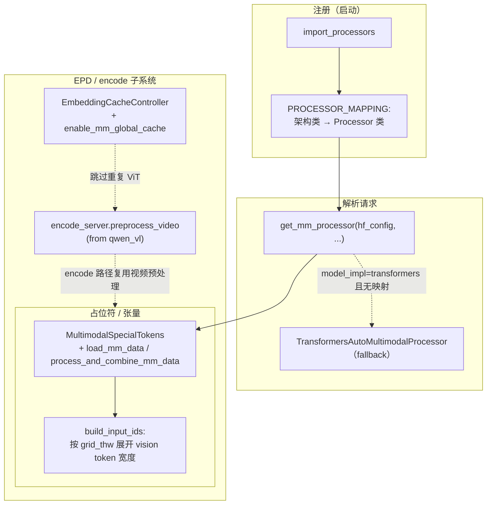

# `srt/multimodal` — 多模态预处理、占位符展开与 ViT 辅助

## Summary

[`multimodal`](d:\design\sglang\python\sglang\srt\multimodal)（@f7101b0a **81** 个 `.py`，2026-08-18 实地统计；~~46 个、无包级 `__init__.py`~~ 为 2026-04-19 旧口径，详见 Increment 小节）承载 **VLM/语音多模态的 HF Processor 封装、占位符切分、I/O 并行加载与特征张量组织**：核心抽象为 [`BaseMultimodalProcessor`](d:\design\sglang\python\sglang\srt\multimodal\processors\base_processor.py) + [`MultimodalSpecialTokens`](d:\design\sglang\python\sglang\srt\multimodal\processors\base_processor.py)；**按模型架构类名** 在 [`PROCESSOR_MAPPING`](d:\design\sglang\python\sglang\srt\managers\multimodal_processor.py) 注册（[`import_processors`](d:\design\sglang\python\sglang\srt\managers\multimodal_processor.py) 扫描 [`processors/`](d:\design\sglang\python\sglang\srt\multimodal\processors)）。

**Vision 编码器本体**在 [`srt/models/*`](d:\design\sglang\python\sglang\srt\models)（如 Qwen-VL / LLaVA / InternVL）；本目录提供 **DP 分片 ViT 辅助**（[`mm_utils.py`](d:\design\sglang\python\sglang\srt\multimodal\mm_utils.py)）、**CUDA Graph ViT runner**（[`vit_cuda_graph_runner.py`](d:\design\sglang\python\sglang\srt\multimodal\vit_cuda_graph_runner.py)）、**EVS 视频 token 剪枝**（[`evs/`](d:\design\sglang\python\sglang\srt\multimodal\evs)）。

**EPD（encode 侧）**在 [`encode_server.py`](d:\design\sglang\python\sglang\srt\disaggregation\encode_server.py) **import** [`preprocess_video`](d:\design\sglang\python\sglang\srt\multimodal\processors\qwen_vl.py) —— **单向依赖**：`disaggregation` 依赖 `multimodal` 的工具函数；`multimodal/` **不** import `disaggregation/`。

## Sources

| 区域 | 锚点 |
|---|---|
| 抽象与 I/O / token 切分 | [`base_processor.py:47-172`](d:\design\sglang\python\sglang\srt\multimodal\processors\base_processor.py)（`BaseMultiModalProcessorOutput`、`MultimodalSpecialTokens`）、[`base_processor.py:175-339`](d:\design\sglang\python\sglang\srt\multimodal\processors\base_processor.py)（`BaseMultimodalProcessor`、`build_input_ids`）、[`base_processor.py:381-453`](d:\design\sglang\python\sglang\srt\multimodal\processors\base_processor.py)（`process_mm_data`） |
| 注册表 | [`multimodal_processor.py:13-82`](d:\design\sglang\python\sglang\srt\managers\multimodal_processor.py)（`PROCESSOR_MAPPING` / `import_processors` / `get_mm_processor`） |
| LLaVA-NeXT 风格图像网格 | [`mm_utils.py:15-28`](d:\design\sglang\python\sglang\srt\multimodal\mm_utils.py)（文件头溯源 LLaVA-NeXT） |
| 自定义 HF Processor 注册 | [`customized_mm_processor_utils.py:6-35`](d:\design\sglang\python\sglang\srt\multimodal\customized_mm_processor_utils.py)（`_CUSTOMIZED_MM_PROCESSOR`、`register_customized_processor`） |
| Qwen-VL 系列占位符与视频 | [`qwen_vl.py:239-275`](d:\design\sglang\python\sglang\srt\multimodal\processors\qwen_vl.py)（`QwenVLImageProcessor.models`、`MultimodalSpecialTokens`） |
| Server CLI | [`server_args.py:6300-6352`](d:\design\sglang\python\sglang\srt\server_args.py)、[`server_args.py:4028-4029`](d:\design\sglang\python\sglang\srt\server_args.py)、[`server_args.py:5034-5047`](d:\design\sglang\python\sglang\srt\server_args.py) |
| Encode 侧引用 | [`encode_server.py:40`](d:\design\sglang\python\sglang\srt\disaggregation\encode_server.py)、[`encode_server.py:252-266`](d:\design\sglang\python\sglang\srt\disaggregation\encode_server.py)（`EmbeddingCacheController` / `mm_global_cache`） |
| 嵌入缓存（非本目录） | [`multimodal_cache.py:76-80`](d:\design\sglang\python\sglang\srt\mem_cache\multimodal_cache.py)（`MultiModalStaticCache`） |
| CUDA IPC 特征池 | [`base_processor.py:254-260`](d:\design\sglang\python\sglang\srt\multimodal\processors\base_processor.py)、[`cuda_ipc_transport_utils.py:16-121`](d:\design\sglang\python\sglang\srt\utils\cuda_ipc_transport_utils.py)（`MM_FEATURE_CACHE_SIZE`、`MmItemMemoryPool`） |

## Architecture / Data flow

> synthesis: 调度路径上，[`tokenizer_manager.py`](d:\design\sglang\python\sglang\srt\managers\tokenizer_manager.py) / [`scheduler.py`](d:\design\sglang\python\sglang\srt\managers\scheduler.py) 在启动时 `import_processors("sglang.srt.multimodal.processors")`，[`get_mm_processor`](d:\design\sglang\python\sglang\srt\managers\multimodal_processor.py) 按 `hf_config.architectures` 与 `model_impl` 选中具体处理器；**Transformers 后端**可退回 [`TransformersAutoMultimodalProcessor`](d:\design\sglang\python\sglang\srt\multimodal\processors\transformers_auto.py)。

- **三模态枚举**：`Modality.IMAGE | VIDEO | AUDIO` 在 `BaseMultiModalProcessorOutput.organize_results` 与属性映射 `ATTR_NAME_TO_MODALITY` 中一致使用（[`base_processor.py:67-76`](d:\design\sglang\python\sglang\srt\multimodal\processors\base_processor.py)）。
- **Token 展开（grid 驱动）**：[`build_input_ids`](d:\design\sglang\python\sglang\srt\multimodal\processors\base_processor.py) 根据 `img_grid_thw` / `video_grid_thw` / `audio_seq_lens` 在 **单个占位 vision/audio token 之后** 插入对应 **宽度的同 id token**（[`base_processor.py:310-334`](d:\design\sglang\python\sglang\srt\multimodal\processors\base_processor.py)）。
- **Qwen 系占位符串**：[`QwenVLImageProcessor`](d:\design\sglang\python\sglang\srt\multimodal\processors\qwen_vl.py) 使用 **组合 image_token 字符串 + regex**（[`qwen_vl.py:270-275`](d:\design\sglang\python\sglang\srt\multimodal\processors\qwen_vl.py)），与 **纯单 token** 模型（如 Gemma3 的 `<start_of_image>`，[`gemma3.py:22-30`](d:\design\sglang\python\sglang\srt\multimodal\processors\gemma3.py)）形成对照。

## File inventory（46 `.py`，分组）

| 分组 | 路径 / 说明 |
|---|---|
| 根目录 | [`mm_utils.py`](d:\design\sglang\python\sglang\srt\multimodal\mm_utils.py)（anyres、DP ViT 辅助等）、[`internvl_utils.py`](d:\design\sglang\python\sglang\srt\multimodal\internvl_utils.py)、[`vit_cuda_graph_runner.py`](d:\design\sglang\python\sglang\srt\multimodal\vit_cuda_graph_runner.py)、[`internvl_vit_cuda_graph_runner.py`](d:\design\sglang\python\sglang\srt\multimodal\internvl_vit_cuda_graph_runner.py)、[`customized_mm_processor_utils.py`](d:\design\sglang\python\sglang\srt\multimodal\customized_mm_processor_utils.py) |
| [`processors/`](d:\design\sglang\python\sglang\srt\multimodal\processors) | **37** 个 `.py`：**1** 个 [`base_processor.py`](d:\design\sglang\python\sglang\srt\multimodal\processors\base_processor.py) + **36** 个按模型族划分的实现（`qwen_vl`、`llava`、`internvl`、`gemma3`/`gemma3n`/`gemma4`、`glm4v`、`deepseek_*`、`kimi_*`、`minicpm`、`nvila`、`pixtral`、`phi4mm`、`step3_vl`、`transformers_auto`、`whisper`、`voxtral` 等） |
| [`evs/`](d:\design\sglang\python\sglang\srt\multimodal\evs) | EVS 视频 token 剪枝：**4** 个 `.py` + [`README.md`](d:\design\sglang\python\sglang\srt\multimodal\evs\README.md)（非 `.py` 不计入 46） |

## Per-modality（图像 / 视频 / 音频）

| 模态 | 源码锚点 |
|---|---|
| **图像** | `Modality.IMAGE`；[`_load_single_item`](d:\design\sglang\python\sglang\srt\multimodal\processors\base_processor.py) 分支 `load_image` |
| **视频** | `Modality.VIDEO`；`load_video`；Qwen 侧 [`preprocess_video`](d:\design\sglang\python\sglang\srt\multimodal\processors\qwen_vl.py)（被 [`encode_server`](d:\design\sglang\python\sglang\srt\disaggregation\encode_server.py) 引用） |
| **音频** | `Modality.AUDIO`；[`_load_single_item`](d:\design\sglang\python\sglang\srt\multimodal\processors\base_processor.py) `load_audio`；专用处理器例：[`Qwen2AudioMultimodalProcessor`](d:\design\sglang\python\sglang\srt\multimodal\processors\qwen_audio.py)、[`WhisperProcessor`](d:\design\sglang\python\sglang\srt\multimodal\processors\whisper.py)、[`GlmAsrProcessor`](d:\design\sglang\python\sglang\srt\multimodal\processors\glmasr.py)、[`Qwen3ASRMultimodalProcessor`](d:\design\sglang\python\sglang\srt\multimodal\processors\qwen3_asr.py) |

## Processor matrix（架构注册类 → 处理器模块）

下表按 **各文件内 `models = [...]`**（或等价列表推导）归纳；一文件多类时拆行。

| 代表模型族 / 架构类（节选） | 处理器类 | 文件 |
|---|---|---|
| Qwen2/2.5/3 VL、Qwen3.5、Qwen3-Omni | `QwenVLImageProcessor` | [`qwen_vl.py`](d:\design\sglang\python\sglang\srt\multimodal\processors\qwen_vl.py) |
| LLaVA / Mistral3 等 | `LlavaImageProcessor`、`LlavaMultimodalProcessor` | [`llava.py`](d:\design\sglang\python\sglang\srt\multimodal\processors\llava.py) |
| InternVL、InternS1 | `InternVLProcessor` | [`internvl.py`](d:\design\sglang\python\sglang\srt\multimodal\processors\internvl.py) |
| InternS1-Pro | `InternS1_1ImageProcessor` | [`interns1pro.py`](d:\design\sglang\python\sglang\srt\multimodal\processors\interns1pro.py) |
| Gemma3 / Gemma3n / Gemma4 | `Gemma3SGLangImageProcessor` 等 | [`gemma3.py`](d:\design\sglang\python\sglang\srt\multimodal\processors\gemma3.py)、[`gemma3n.py`](d:\design\sglang\python\sglang\srt\multimodal\processors\gemma3n.py)、[`gemma4.py`](d:\design\sglang\python\sglang\srt\multimodal\processors\gemma4.py) |
| GLM-4V / MoE / OCR | `Glm4vImageProcessor` | [`glm4v.py`](d:\design\sglang\python\sglang\srt\multimodal\processors\glm4v.py) |
| Ernie4.5-VL | `Ernie4_5_VLImageProcessor` | [`ernie45_vl.py`](d:\design\sglang\python\sglang\srt\multimodal\processors\ernie45_vl.py) |
| DeepSeek-VL2、DeepSeek-OCR | `DeepseekVL2ImageProcessor`、`DeepseekOCRProcessor` | [`deepseek_vl_v2.py`](d:\design\sglang\python\sglang\srt\multimodal\processors\deepseek_vl_v2.py)、[`deepseek_ocr.py`](d:\design\sglang\python\sglang\srt\multimodal\processors\deepseek_ocr.py) |
| DotsVLM / Dots-OCR | `DotsVLMImageProcessor` | [`dots_vlm.py`](d:\design\sglang\python\sglang\srt\multimodal\processors\dots_vlm.py) |
| Kimi-VL、Kimi-K2.5 | `KimiVLImageProcessor`、`KimiK2_5VLImageProcessor` | [`kimi_vl.py`](d:\design\sglang\python\sglang\srt\multimodal\processors\kimi_vl.py)、[`kimi_k25.py`](d:\design\sglang\python\sglang\srt\multimodal\processors\kimi_k25.py) |
| NVILA / JetVLM | `NVILAMultimodalProcessor` | [`nvila.py`](d:\design\sglang\python\sglang\srt\multimodal\processors\nvila.py) |
| Pixtral / LightOn OCR | `PixtralProcessor`、`LightOnOCRProcessor` | [`pixtral.py`](d:\design\sglang\python\sglang\srt\multimodal\processors\pixtral.py)、[`lightonocr.py`](d:\design\sglang\python\sglang\srt\multimodal\processors\lightonocr.py) |
| Phi-4-MM、MiniCPM、Janus-Pro、Step3-VL | `Phi4MMMultimodalProcessor`、`MiniCPMMultimodalProcessor`、`JanusProImageProcessor`、`Step3VLImageProcessor` | [`phi4mm.py`](d:\design\sglang\python\sglang\srt\multimodal\processors\phi4mm.py)、[`minicpm.py`](d:\design\sglang\python\sglang\srt\multimodal\processors\minicpm.py)、[`janus_pro.py`](d:\design\sglang\python\sglang\srt\multimodal\processors\janus_pro.py)、[`step3_vl.py`](d:\design\sglang\python\sglang\srt\multimodal\processors\step3_vl.py) |
| Mllama / Llama4、Nano Nemotron VL | `MllamaImageProcessor`、`Mllama4ImageProcessor`、`NanoNemotronVLImageProcessor` | [`mlama.py`](d:\design\sglang\python\sglang\srt\multimodal\processors\mlama.py)、[`mllama4.py`](d:\design\sglang\python\sglang\srt\multimodal\processors\mllama4.py)、[`nano_nemotron_vl.py`](d:\design\sglang\python\sglang\srt\multimodal\processors\nano_nemotron_vl.py) |
| LFM2-VL、CLIP、Whisper、Voxtral、Qwen-Audio/ASR、GLM-ASR | 各文件内同名 `*Processor` | [`lfm2_vl.py`](d:\design\sglang\python\sglang\srt\multimodal\processors\lfm2_vl.py)、[`clip.py`](d:\design\sglang\python\sglang\srt\multimodal\processors\clip.py)、[`whisper.py`](d:\design\sglang\python\sglang\srt\multimodal\processors\whisper.py)、[`voxtral.py`](d:\design\sglang\python\sglang\srt\multimodal\processors\voxtral.py)、[`qwen_audio.py`](d:\design\sglang\python\sglang\srt\multimodal\processors\qwen_audio.py)、[`qwen3_asr.py`](d:\design\sglang\python\sglang\srt\multimodal\processors\qwen3_asr.py)、[`glmasr.py`](d:\design\sglang\python\sglang\srt\multimodal\processors\glmasr.py) |
| 兜底 | `TransformersAutoMultimodalProcessor`（`models=[]`） | [`transformers_auto.py`](d:\design\sglang\python\sglang\srt\multimodal\processors\transformers_auto.py) |

## Token expansion / merging

- **占位符 → 多 token 展开**：[`build_input_ids`](d:\design\sglang\python\sglang\srt\multimodal\processors\base_processor.py) 在检测到 `image_token_id`/`video_token_id`/`audio_token_id` **前导位置**后，用 **grid 推导的 `mm_token_num`** 插入重复 token（[`base_processor.py:310-334`](d:\design\sglang\python\sglang\srt\multimodal\processors\base_processor.py)）。
- **预计算嵌入对齐**：[`get_mm_data`](d:\design\sglang\python\sglang\srt\multimodal\processors\base_processor.py) 将 `embeddings` 按 offset 宽度切片到 `MultimodalDataItem.precomputed_embeddings`（[`base_processor.py:341-378`](d:\design\sglang\python\sglang\srt\multimodal\processors\base_processor.py)）。
- **HF Processor 批处理**：[`process_mm_data`](d:\design\sglang\python\sglang\srt\multimodal\processors\base_processor.py) 调用 `self._processor.__call__(text=[input_text], ...)`（[`base_processor.py:436-441`](d:\design\sglang\python\sglang\srt\multimodal\processors\base_processor.py)）。

## EPD / encode 子系统交叉

- **直接 import**：[`encode_server.py:40`](d:\design\sglang\python\sglang\srt\disaggregation\encode_server.py) `from sglang.srt.multimodal.processors.qwen_vl import preprocess_video`。
- **全局嵌入缓存（encode 侧）**：[`enable_mm_global_cache`](d:\design\sglang\python\sglang\srt\server_args.py) → [`EmbeddingCacheController`](d:\design\sglang\python\sglang\srt\mem_cache\storage\mooncake_store\embedding_cache_controller.py)（[`encode_server.py:252-266`](d:\design\sglang\python\sglang\srt\disaggregation\encode_server.py)），与 **本目录** 的 **CUDA IPC `MmItemMemoryPool`** 是 **不同层次**（后者见 [`base_processor.py:256-260`](d:\design\sglang\python\sglang\srt\multimodal\processors\base_processor.py)）。

## CLI / ServerArgs

| 参数 / 字段 | 锚点 | 说明 |
|---|---|---|
| `--enable-multimodal` | [`server_args.py:4028-4029`](d:\design\sglang\python\sglang\srt\server_args.py) | 总开关字段 `enable_multimodal` |
| `--mm-attention-backend` | [`server_args.py:5034-5047`](d:\design\sglang\python\sglang\srt\server_args.py) | 多模态 attention 后端 |
| `--mm-process-config` | [`server_args.py:6307-6311`](d:\design\sglang\python\sglang\srt\server_args.py) | JSON：`image` / `video` / `audio` |
| `--mm-enable-dp-encoder` | [`server_args.py:6313-6317`](d:\design\sglang\python\sglang\srt\server_args.py) | 编码器数据并行 |
| `--limit-mm-data-per-request` | [`server_args.py:6319-6325`](d:\design\sglang\python\sglang\srt\server_args.py) | 每请求模态数量上限 |
| `--enable-prefix-mm-cache` | [`server_args.py:6340-6344`](d:\design\sglang\python\sglang\srt\server_args.py) | 前缀多模态 cache |
| `--enable-mm-global-cache` | [`server_args.py:6347-6352`](d:\design\sglang\python\sglang\srt\server_args.py) | 全局嵌入 cache（跳过重复 ViT） |
| `--enable-broadcast-mm-inputs-process` | [`server_args.py:6301-6305`](d:\design\sglang\python\sglang\srt\server_args.py) | scheduler 广播 mm 预处理 |

## §跨子系统（§5 step 3）

### 1. sgl-kernel C++ / Python 绑定

在 [`d:\design\sglang\sgl-kernel\`](d:\design\sglang\python\sglang\kernels\aot) 全树 grep `Multimodal`、`MMEncoder`：**0 命中**（与多模态子系统无直接符号绑定）。

> [!todo] VERIFY: ~~模式 `mm_` 在 `sgl-kernel` 内会命中 `bmm_fp8` / `moe_mm` 等 **矩阵乘** 符号，**非** `srt/multimodal` 语义；不应解读为多模态专用内核。~~
>
> > **RESOLVED 2026-04-19**: 在 [`d:\design\sglang\sgl-kernel\`](d:\design\sglang\python\sglang\kernels\aot) grep `mm_` 实测命中 [`test_bmm_fp8.py`](d:\design\sglang\python\sglang\kernels\aot\tests\test_bmm_fp8.py)、[`test_cutlass_w4a8_moe_mm.py`](d:\design\sglang\python\sglang\kernels\aot\tests\test_cutlass_w4a8_moe_mm.py)、[`gemm.py`](d:\design\sglang\python\sglang\kernels\aot\python\sgl_kernel\gemm.py) 等矩阵乘符号，确认 `mm_` 在 sgl-kernel 内**仅**指 matrix multiplication，与 `srt/multimodal` 子系统无关。

### 2. 协作 import（`srt/`，字面 `from sglang.srt.multimodal`）

| 文件 | 行 | 内容 |
|---|---|---|
| [`utils/hf_transformers/processor.py`](d:\design\sglang\python\sglang\srt\utils\hf_transformers\processor.py) | 26 | `customized_mm_processor_utils._CUSTOMIZED_MM_PROCESSOR` |
| [`models/qwen3_vl.py`](d:\design\sglang\python\sglang\srt\models\qwen3_vl.py) | 72-73 | `mm_utils`、`vit_cuda_graph_runner` |
| [`models/qwen2_5_vl.py`](d:\design\sglang\python\sglang\srt\models\qwen2_5_vl.py) | 77-78 | 同上 |
| [`models/llava.py`](d:\design\sglang\python\sglang\srt\models\llava.py) | 49+ | `mm_utils` |
| [`models/internvl.py`](d:\design\sglang\python\sglang\srt\models\internvl.py) | 41-44 | `internvl_vit_cuda_graph_runner`、`mm_utils` |
| [`models/glm4v.py`](d:\design\sglang\python\sglang\srt\models\glm4v.py) | 59 | `mm_utils` |
| [`models/kimi_k25.py`](d:\design\sglang\python\sglang\srt\models\kimi_k25.py) | 41 | `mm_utils` |
| [`models/nano_nemotron_vl.py`](d:\design\sglang\python\sglang\srt\models\nano_nemotron_vl.py) | 39 | `evs` |
| [`managers/mm_utils.py`](d:\design\sglang\python\sglang\srt\managers\mm_utils.py) | 27 | `evs.EVSEmbeddingResult` |
| [`managers/io_struct.py`](d:\design\sglang\python\sglang\srt\managers\io_struct.py) | 34 | `mm_utils.has_valid_data` |
| [`hardware_backend/npu/graph_runner/vit_npu_graph_runner.py`](d:\design\sglang\python\sglang\srt\hardware_backend\npu\graph_runner\vit_npu_graph_runner.py) | 29 | `ViTCudaGraphRunner` |
| [`entrypoints/openai/transcription_adapters/qwen3_asr.py`](d:\design\sglang\python\sglang\srt\entrypoints\openai\transcription_adapters\qwen3_asr.py) | 12 | `qwen3_asr.DEFAULT_ASR_PROMPT` |
| [`disaggregation/encode_server.py`](d:\design\sglang\python\sglang\srt\disaggregation\encode_server.py) | 40 | `qwen_vl.preprocess_video` |
| [`configs/qwen3_asr.py`](d:\design\sglang\python\sglang\srt\configs\qwen3_asr.py) | 11 | `register_customized_processor` |
| [`configs/nano_nemotron_vl.py`](d:\design\sglang\python\sglang\srt\configs\nano_nemotron_vl.py) | 22 | `internvl_utils` 常量 |
| [`configs/janus_pro.py`](d:\design\sglang\python\sglang\srt\configs\janus_pro.py) | 22 | `mm_utils.expand2square` |
| [`configs/deepseek_ocr.py`](d:\design\sglang\python\sglang\srt\configs\deepseek_ocr.py) | 14 | `register_customized_processor` |

**相关但非字面 `from sglang.srt.multimodal`**：[`managers/multimodal_processor.py`](d:\design\sglang\python\sglang\srt\managers\multimodal_processor.py) 被 [`tokenizer_manager.py`](d:\design\sglang\python\sglang\srt\managers\tokenizer_manager.py)、[`scheduler.py`](d:\design\sglang\python\sglang\srt\managers\scheduler.py)、[`disaggregation/encode_receiver.py`](d:\design\sglang\python\sglang\srt\disaggregation\encode_receiver.py) 用于 `import_processors` / `get_mm_processor`。

### 3. 配置 / 共享结构

- **自定义 Processor**：[`register_customized_processor`](d:\design\sglang\python\sglang\srt\multimodal\customized_mm_processor_utils.py) 与 [`configs/*.py`](d:\design\sglang\python\sglang\srt\configs) 中若干模型 config 交叉。
- **mm_process_config**：`--mm-process-config` JSON 键 `image`/`video`/`audio` 注入 `BaseMultimodalProcessor.__init__`（[`base_processor.py:187-190`](d:\design\sglang\python\sglang\srt\multimodal\processors\base_processor.py)）。

### 4. 测试（`d:\design\sglang\test\`）

`MMEncoder` 无命中；`multimodal` 命中包括但不限于：

- [`test/registered/vlm/test_vlm_input_format.py`](d:\design\sglang\test\registered\vlm\test_vlm_input_format.py)
- [`test/registered/vlm/test_evs.py`](d:\design\sglang\test\registered\vlm\test_evs.py)
- [`test/registered/core/test_mm_process_config.py`](d:\design\sglang\test\registered\core\test_mm_process_config.py)
- [`test/manual/test_vlm_accuracy.py`](d:\design\sglang\test\manual\test_vlm_accuracy.py)
- [`test/registered/distributed/test_epd_disaggregation.py`](d:\design\sglang\test\registered\distributed\test_epd_disaggregation.py)

### 5. 文档（`d:\design\sglang\docs\`）

- [`docs/supported_models/text_generation/multimodal_language_models.md`](d:\design\sglang\docs\supported_models\text_generation\multimodal_language_models.md)
- [`docs/supported_models/extending/support_new_models.md`](d:\design\sglang\docs\supported_models\extending\support_new_models.md)

## Hidden cross-references（`configs/` / `models/`）

- **`srt/configs/`**：[`qwen3_asr.py`](d:\design\sglang\python\sglang\srt\configs\qwen3_asr.py)、[`deepseek_ocr.py`](d:\design\sglang\python\sglang\srt\configs\deepseek_ocr.py)、[`janus_pro.py`](d:\design\sglang\python\sglang\srt\configs\janus_pro.py)、[`nano_nemotron_vl.py`](d:\design\sglang\python\sglang\srt\configs\nano_nemotron_vl.py) 直接引用本目录工具或 `register_customized_processor`。
- **`srt/models/`**：Vision 前向与 **DP 分片** 从 [`mm_utils`](d:\design\sglang\python\sglang\srt\multimodal\mm_utils.py) 拉取辅助函数；**EVS** 在 [`nano_nemotron_vl.py`](d:\design\sglang\python\sglang\srt\models\nano_nemotron_vl.py) 装配。
- **血缘标注**：[`mm_utils.py:15`](d:\design\sglang\python\sglang\srt\multimodal\mm_utils.py) 标明源自 **LLaVA-NeXT**；[`gemma3.py:11-12`](d:\design\sglang\python\sglang\srt\multimodal\processors\gemma3.py) 标明自 **Hugging Face transformers** 复制图像处理逻辑。

## 数字核对

| 项 | 值 |
|---|---|
| `srt/multimodal/**/*.py` | **46**（Glob `**/*.py`） |
| `processors/*.py` | **37**（含 `base_processor.py`） |
| `BaseMultimodalProcessor` 具体子类（含同一文件内多个注册类） | **约 40**（手工自 `processors/` 内 `class ...(` 与 `models=` 枚举；精确 CI 可用 AST 再扫） |
| 模态枚举 | **3**：`IMAGE`、`VIDEO`、`AUDIO`（[`base_processor.py:67-76`](d:\design\sglang\python\sglang\srt\multimodal\processors\base_processor.py)） |

## Increment 2026-08-18 (06f32bab → f7101b0a)

pin 移动后本目录新增 **3 个子包 + 2 个独立新文件**，文件数从 index @06f32bab 记录的 70 增至 **81 个 `.py`**（实地 `rg --files` 统计：根 10 + `processors/` 53 + `inkling/` 5 + `evs/` 4 + `cache/` 3 + `transport/` 3 + `media_artifacts/` 3；正文旧口径 46/37 系 2026-04-19 数据，已双重失效）。包级 [`__init__.py`](d:\design\sglang\python\sglang\srt\multimodal\__init__.py) 现已存在（1 行注释），正文「无包级 `__init__.py`」论断失效。

- **`multimodal/cache/`**（commit `e8c7dddfa0` "[VLM] add content-addressed preprocessing cache infrastructure" #34398）：[`identity.py`](d:\design\sglang\python\sglang\srt\multimodal\cache\identity.py) 提供多模态输入与 processor 产物的**内容寻址稳定标识**（`MediaSnapshot` [L65](d:\design\sglang\python\sglang\srt\multimodal\cache\identity.py)、`snapshot_media` [L144](d:\design\sglang\python\sglang\srt\multimodal\cache\identity.py)、`build_artifact_key` [L309](d:\design\sglang\python\sglang\srt\multimodal\cache\identity.py)、`build_processor_fingerprint` [L378](d:\design\sglang\python\sglang\srt\multimodal\cache\identity.py)）；[`preprocess_cache.py`](d:\design\sglang\python\sglang\srt\multimodal\cache\preprocess_cache.py) 为**按字节记账的 LRU CPU 存储 + single-flight 并发去重**（docstring [L1-6](d:\design\sglang\python\sglang\srt\multimodal\cache\preprocess_cache.py)；核心类 `MultimodalPreprocessCache` [L121](d:\design\sglang\python\sglang\srt\multimodal\cache\preprocess_cache.py)）。
- **`multimodal/transport/`**（commit `443b62db57` "stream-order cuda-ipc feature pool lifecycle and streamline multimodal transport module" #33949）：原 `utils/cuda_ipc_transport_utils.py` 的 CUDA IPC 特征传输**迁入本目录**——[`cuda_ipc.py`](d:\design\sglang\python\sglang\srt\multimodal\transport\cuda_ipc.py) 含 `MmItemMemoryPool`（[L92](d:\design\sglang\python\sglang\srt\multimodal\transport\cuda_ipc.py)）与 `CudaIpcTensorTransportProxy`（[L170](d:\design\sglang\python\sglang\srt\multimodal\transport\cuda_ipc.py)）；[`memory_pool.py`](d:\design\sglang\python\sglang\srt\multimodal\transport\memory_pool.py) 提供 stream-ordered GPU 特征池生命周期（`StreamOrderedMmFeaturePool` [L156](d:\design\sglang\python\sglang\srt\multimodal\transport\memory_pool.py)、`StreamOrderedPoolConsumerMixin` [L80](d:\design\sglang\python\sglang\srt\multimodal\transport\memory_pool.py)、`PoolLease` [L146](d:\design\sglang\python\sglang\srt\multimodal\transport\memory_pool.py)）。正文「CUDA IPC 特征池」小节指向 `utils/cuda_ipc_transport_utils.py` 的锚点需按此更新。
- **`multimodal/media_artifacts/`**（commit `3d3194f6c3` "vlm: cache kimi-k3 per-image processor artifacts" #34404）：[`base.py`](d:\design\sglang\python\sglang\srt\multimodal\media_artifacts\base.py) 定义 **prompt 无关、可复用的 per-media 产物契约**（`MediaArtifact` Protocol [L49](d:\design\sglang\python\sglang\srt\multimodal\media_artifacts\base.py)、`MediaArtifactCacheMixin` [L94](d:\design\sglang\python\sglang\srt\multimodal\media_artifacts\base.py)）；[`kimi_k3.py`](d:\design\sglang\python\sglang\srt\multimodal\media_artifacts\kimi_k3.py) 为 Kimi-K3 每图 processor 产物缓存实现。synthesis: `media_artifacts/` 产出的产物即存入 `cache/preprocess_cache.py`（其 docstring 明言"Model processors store prompt-independent ``MediaArtifact`` values here"，[preprocess_cache.py:L3-4](d:\design\sglang\python\sglang\srt\multimodal\cache\preprocess_cache.py)）——三个新子包构成一条「标识 → 缓存 → 产物」链。
- **独立新文件**：[`encoder_preprocessing.py`](d:\design\sglang\python\sglang\srt\multimodal\encoder_preprocessing.py)（commit `418975ba64` "[EPD] pipeline owner-only multimodal preprocessing" #34206；`EncoderPreprocessOutput` [L58](d:\design\sglang\python\sglang\srt\multimodal\encoder_preprocessing.py)）、[`processors/muse_glimmer.py`](d:\design\sglang\python\sglang\srt\multimodal\processors\muse_glimmer.py)（commit `fde9ad2531` Muse Glimmer 模型族 #34262，Processor matrix 需增行）。

> [!todo] VERIFY: 本 increment 仅覆盖新增子包与文件数；正文 Processor matrix（37 → 53 个 processors 文件）、`inkling/` 子包（Rust 图像预处理，关联 [rust_extensions.md](rust_extensions.md)）与既有锚点行号未逐一重核。

## Notes / Caveats

> [!todo] VERIFY: pin 从 `34fef07a` → `06f32bab`（2026-08-10 increment）后本页未深 verify；文件数量/行号可能漂移。优先对照 [entities/Scheduler.md](../entities/Scheduler.md) / 新模块页。

> [!todo] VERIFY: ~~是否存在名为 `MMEmbeddingCache` 的类：当前在 `srt/` grep **无** 该标识符；缓存相关见 [`MultiModalStaticCache`](d:\design\sglang\python\sglang\srt\mem_cache\multimodal_cache.py) 与 [`EmbeddingCacheController`](d:\design\sglang\python\sglang\srt\mem_cache\storage\mooncake_store\embedding_cache_controller.py)。~~
>
> > **RESOLVED 2026-04-19**: 在 [`d:\design\sglang\python\sglang\srt`](d:\design\sglang\python\sglang\srt) grep `MMEmbeddingCache` **0 命中**，确认无该类；多模态嵌入缓存实际由 [`MultiModalStaticCache`](d:\design\sglang\python\sglang\srt\mem_cache\multimodal_cache.py) 与 [`EmbeddingCacheController`](d:\design\sglang\python\sglang\srt\mem_cache\storage\mooncake_store\embedding_cache_controller.py) 承担。

> [!warning] CONTRADICTION: 外部文档若写「多模态仅 `multimodal/`」易忽略：**全局 cache / Mooncake** 在 `mem_cache/` + `disaggregation/encode_server.py`，与 **本目录** IPC 池并存，需分层次叙述。

## Cross-project synthesis

- **vLLM**：上游存在平行目录 [`vllm/multimodal/`](d:\design\vllm\vllm\multimodal)（registry、processing、cache、EVS 等 **112** 个 `.py` 量级，Glob），与 SGLang 的 **按 `processors/*.py` + `managers/multimodal_processor` 映射** 同属「**模型侧多模态输入管线**」，但 SGLang 额外与 **SGLang 调度 / EPD encode**、**`mm_process_config` CLI** 紧耦合。
- **MindIE**：本任务未在 `d:\design\MindIE-LLM\` 做对称 grep；若需对比表应单独 ingest。

## See also

- [sglang/modules/disaggregation.md](disaggregation.md)（EPD / encode_server）
- [sglang/modules/rust_extensions.md](rust_extensions.md)（`inkling/` Rust 图像预处理经 `_multimodal` 扩展）
- [sglang/modules/hardware_backend.md](hardware_backend.md)（`ViTNpuGraphRunner` 子类化 `ViTCudaGraphRunner`）
- [sglang/index.md](../index.md)
- 源码根：[`d:\design\sglang\python\sglang\srt\multimodal\`](d:\design\sglang\python\sglang\srt\multimodal)
