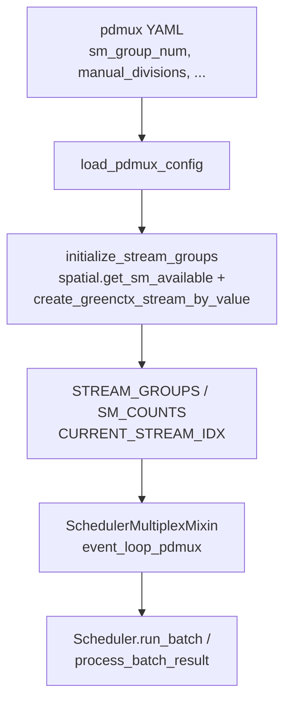

# `srt/multiplex` — PD-Multiplexing（GPU 上 Prefill/Decode 流复用）

## Summary

`srt/multiplex/` 共 **2** 个 `.py`（[`pdmux_context.py`](d:\design\sglang\python\sglang\srt\multiplex\pdmux_context.py)、[`multiplexing_mixin.py`](d:\design\sglang\python\sglang\srt\multiplex\multiplexing_mixin.py)），实现 **PD-Multiplexing**：在**同一 GPU** 上为 **Prefill** 与 **Decode** 分配多组 **CUDA stream**（含 `sgl_kernel.spatial` 的 **green context** 流），并在 [`Scheduler`](d:\design\sglang\python\sglang\srt\managers\scheduler.py) 上通过 [`SchedulerMultiplexMixin`](d:\design\sglang\python\sglang\srt\multiplex\multiplexing_mixin.py:32-33) 替换默认事件循环为 [`event_loop_pdmux`](d:\design\sglang\python\sglang\srt\multiplex\multiplexing_mixin.py:95-218)。

> [!warning] CONTRADICTION（命名）：名称里的「multiplex」指 **Prefill/Decode 计算在 SM 分区与多 stream 上的复用/交织**，**不是** HTTP/多租户「请求多路复用」。与 **PD 分离（disaggregation）** 互斥，见 [`server_args` 校验 L6510-6523](d:\design\sglang\python\sglang\srt\server_args.py)。

## Sources

| 区域 | 锚点 |
|---|---|
| PD 流与 SM 划分 | [`PDMuxConfig`](d:\design\sglang\python\sglang\srt\multiplex\pdmux_context.py:14-21)、[`load_pdmux_config`](d:\design\sglang\python\sglang\srt\multiplex\pdmux_context.py:24-51)、[`initialize_stream_groups`](d:\design\sglang\python\sglang\srt\multiplex\pdmux_context.py:104-141) |
| 全局 stream 状态 | [`STREAM_GROUPS`](d:\design\sglang\python\sglang\srt\multiplex\pdmux_context.py:7-10)、[`set_current_stream_idx`](d:\design\sglang\python\sglang\srt\multiplex\pdmux_context.py:143-149)、[`get_stream_groups`](d:\design\sglang\python\sglang\srt\multiplex\pdmux_context.py:152-154) |
| Scheduler 集成 | [`SchedulerMultiplexMixin.init_pdmux`](d:\design\sglang\python\sglang\srt\multiplex\multiplexing_mixin.py:34-46)、[`adjust_stream_groups`](d:\design\sglang\python\sglang\srt\multiplex\multiplexing_mixin.py:49-79)、[`event_loop_pdmux`](d:\design\sglang\python\sglang\srt\multiplex\multiplexing_mixin.py:95-218) |
| 类继承与分发 | [`Scheduler` MRO 含 `SchedulerMultiplexMixin`](d:\design\sglang\python\sglang\srt\managers\scheduler.py:317-324)、[`enable_pdmux` 时 `init_pdmux`](d:\design\sglang\python\sglang\srt\managers\scheduler.py:377-413)、[`dispatch_event_loop` 选 `event_loop_pdmux`](d:\design\sglang\python\sglang\srt\managers\scheduler.py:3632-3640) |
| Split prefill 转发 | [`enable_pdmux` + `split_prefill` 分支](d:\design\sglang\python\sglang\srt\managers\scheduler.py:2808-2810) |
| CLI / 约束 | [`enable_pdmux` / `pdmux_config_path`](d:\design\sglang\python\sglang\srt\server_args.py:735-737)、[argparse](d:\design\sglang\python\sglang\srt\server_args.py:6274-6284)、[互斥断言](d:\design\sglang\python\sglang\srt\server_args.py:6510-6523) |

## Architecture / Data flow

- **配置**：[`load_pdmux_config`](d:\design\sglang\python\sglang\srt\multiplex\pdmux_context.py:24-51) 从 YAML 读入 `sm_group_num`（≥3）、可选 `manual_divisions`、`split_forward_token_budget`、`decode_bs_divisor`。
- **Stream 组**：[`initialize_stream_groups`](d:\design\sglang\python\sglang\srt\multiplex\pdmux_context.py:104-141) 用 [`spatial.get_sm_available`](d:\design\sglang\python\sglang\srt\multiplex\pdmux_context.py:110) 与 [`divide_sm`](d:\design\sglang\python\sglang\srt\multiplex\pdmux_context.py:70-101)（或手工划分）构造多组 `(prefill_stream, decode_stream)`；中间组为 green context，首尾为普通 prefill-only / decode-only 流（见 [`STREAM_GROUPS.append` 逻辑](d:\design\sglang\python\sglang\srt\multiplex\pdmux_context.py:124-138)）。
- **调度循环**：[`event_loop_pdmux`](d:\design\sglang\python\sglang\srt\multiplex\multiplexing_mixin.py:95-218) 在 decode/prefill stream 间交替：`recv_requests` / `update_running_batch` / `run_batch`（decode 与 [`ForwardMode.SPLIT_PREFILL`](d:\design\sglang\python\sglang\srt\multiplex\multiplexing_mixin.py:87-90) 的 split prefill），并通过 [`set_pdmux_status`](d:\design\sglang\python\sglang\srt\multiplex\multiplexing_mixin.py:112-117) 与分布式并行状态协作；流组切换前 [`synchronize`](d:\design\sglang\python\sglang\srt\multiplex\multiplexing_mixin.py:133-135)。
- **Attention**：[`adjust_stream_groups`](d:\design\sglang\python\sglang\srt\multiplex\multiplexing_mixin.py:49-79) 调用 [`update_decode_attn_backend`](d:\design\sglang\python\sglang\srt\model_executor\model_runner.py:2748-2749)，与 [`init_attention_backend` 中 `decode_attn_backend_group`](d:\design\sglang\python\sglang\srt\model_executor\model_runner.py:2082-2087) 对应。

## File inventory（2 文件）

| 文件 | 职责 |
|---|---|
| [pdmux_context.py](d:\design\sglang\python\sglang\srt\multiplex\pdmux_context.py) | `PDMuxConfig`、YAML 加载、SM 划分、`initialize_stream_groups`、全局 stream 索引 API |
| [multiplexing_mixin.py](d:\design\sglang\python\sglang\srt\multiplex\multiplexing_mixin.py) | `SchedulerMultiplexMixin`：`init_pdmux`、`adjust_stream_groups`、`update_split_prefill_batch`、`event_loop_pdmux` |

## Key APIs / Entities

| 名称 | 位置 | 作用 |
|---|---|---|
| `PDMuxConfig` | [pdmux_context.py:14-21](d:\design\sglang\python\sglang\srt\multiplex\pdmux_context.py) | PD multiplex YAML 对应的数据类 |
| `load_pdmux_config` | [pdmux_context.py:24-51](d:\design\sglang\python\sglang\srt\multiplex\pdmux_context.py) | 读 YAML → `PDMuxConfig`；空 path 则默认配置 |
| `initialize_stream_groups` | [pdmux_context.py:104-141](d:\design\sglang\python\sglang\srt\multiplex\pdmux_context.py) | 初始化全局 `STREAM_GROUPS` / `SM_COUNTS` |
| `SchedulerMultiplexMixin` | [multiplexing_mixin.py:32-218](d:\design\sglang\python\sglang\srt\multiplex\multiplexing_mixin.py) | 挂到 `Scheduler` 的 PD multiplex 调度逻辑 |

## CLI / `ServerArgs`

| 字段 / 标志 | 锚点 |
|---|---|
| `enable_pdmux`, `pdmux_config_path` | [server_args.py:735-737](d:\design\sglang\python\sglang\srt\server_args.py) |
| `--enable-pdmux`, `--pdmux-config-path`, `--sm-group-num` | [server_args.py:6274-6291](d:\design\sglang\python\sglang\srt\server_args.py) |
| 与 `pp_size`、chunked prefill、disaggregation、overlap 互斥 | [server_args.py:6510-6523](d:\design\sglang\python\sglang\srt\server_args.py) |

## §跨子系统引用（§5 hidden grep）

| # | 类别 | 结果 |
|---:|---|---|
| 1 | **sgl-kernel C++ / 树** | `multiplex` / `Multiplex`：在 `d:\design\sglang\sgl-kernel\` 全树 grep **0** 命中（Python 侧通过 `sgl_kernel.spatial` 调用，见 [pdmux_context.py:105](d:\design\sglang\python\sglang\srt\multiplex\pdmux_context.py)） |
| 2 | **`srt/` 协作 import** | [`multiplexing_mixin.py:16-22`](d:\design\sglang\python\sglang\srt\multiplex\multiplexing_mixin.py)（包内）；[`scheduler.py:195`](d:\design\sglang\python\sglang\srt\managers\scheduler.py)；[`cuda_graph_runner.py:68`](d:\design\sglang\python\sglang\srt\model_executor\cuda_graph_runner.py)（`get_current_stream_idx`, `get_stream_groups`） |
| 3 | **配置 / CLI** | 见上节；[`sm_group_num` 与 `ModelRunner` 中 `decode_attn_backend_group` 数量](d:\design\sglang\python\sglang\srt\model_executor\model_runner.py:2082-2087) |
| 4 | **测试** | `multiplex` / `Multiplex` / `pdmux` / `PDMux`：在 `d:\design\sglang\test\` 全树 grep **0** 命中 |
| 5 | **文档** | `d:\design\sglang\docs\`：`server_arguments.md`、`platforms/ascend/ascend_npu_support_features.md` 含 PD-Multiplexing 表格；[`index.rst:61`](d:\design\sglang\docs\index.rst) 列出 `advanced_features/pd_multiplexing.md`（当前工作区未见该文件，见 Notes） |

## Notes / Caveats

> [!todo] VERIFY: ~~文档源树中是否存在 `docs/advanced_features/pd_multiplexing.md`；本工作区未检出该路径，仅 [`index.rst:61`](d:\design\sglang\docs\index.rst) 引用。~~
> **RESOLVED 2026-04-19**: 文件**确实缺失**——`d:\design\sglang\docs\advanced_features\pd_multiplexing*` Glob 返回 0 命中；[`index.rst:61`](d:\design\sglang\docs\index.rst) 列项但物理路径不存在。这是上游 docs 的悬空 toctree 条目，非本仓库 wiki 问题。

> [!warning] CONTRADICTION（命名）：**PD-Multiplexing** 与 **[disaggregation](disaggregation.md)**（PD 分离）在 [`server_args` L6518-6520](d:\design\sglang\python\sglang\srt\server_args.py) 中**不可同时开启**——二者都含 "PD" 但语义不同。

- [`adjust_stream_groups`](d:\design\sglang\python\sglang\srt\multiplex\multiplexing_mixin.py:49-52) 标注为 temporary demo；手动 `manual_divisions` 分支若未命中阈值可能未设置 `stream_idx`（依赖 Python 作用域内上次值），属实现细节风险。

## See also

- [managers.md](managers.md)（`Scheduler` / `dispatch_event_loop`）
- [disaggregation.md](disaggregation.md)（与 `enable_pdmux` 互斥）
- [hardware_backend.md](hardware_backend.md)（`sgl_kernel.spatial` 设备能力）
- 源码根：[`d:\design\sglang\python\sglang\srt\multiplex\`](d:\design\sglang\python\sglang\srt\multiplex)
