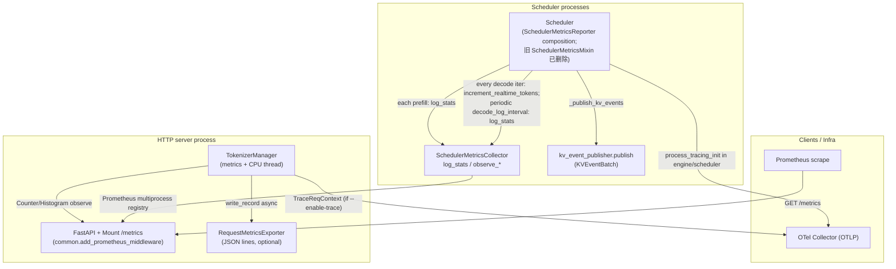

# `srt/observability` — Prometheus / OTel / 请求耗时 / KV 事件桥接

## Summary

[`python/sglang/srt/observability/`](d:\design\sglang\python\sglang\srt\observability)（**10** 个 `.py`，**无** `__init__.py` 包入口）集中实现：**Prometheus 指标注册与更新**（[`SchedulerMetricsCollector`](d:\design\sglang\python\sglang\srt\observability\metrics_collector.py) 等）、**OpenTelemetry 请求追踪**（[`trace.py`](d:\design\sglang\python\sglang\srt\observability\trace.py)）、**跨阶段耗时与 GenAI span 属性**（[`req_time_stats.py`](d:\design\sglang\python\sglang\srt\observability\req_time_stats.py)）、**按请求导出 JSON 行日志**（[`request_metrics_exporter.py`](d:\design\sglang\python\sglang\srt\observability\request_metrics_exporter.py)），以及与 **Scheduler** 集成的 mixin（[`scheduler_metrics_mixin.py`](d:\design\sglang\python\sglang\srt\observability\scheduler_metrics_mixin.py) — 含 PD KV 传输直方图、**KV cache 事件发布** 调用）。

**HTTP `/metrics`** 由 [`add_prometheus_middleware`](d:\design\sglang\python\sglang\srt\utils\common.py) 挂在主 ASGI 应用；**gRPC 模式**下另有独立 HTTP 服务暴露 `/metrics`（[`grpc_server.py`](d:\design\sglang\python\sglang\srt\entrypoints\grpc_server.py)）。

> synthesis: 本目录**不**定义 `KVCacheEvent` 消息体本身；事件类型在 [`disaggregation/kv_events.py`](d:\design\sglang\python\sglang\srt\disaggregation\kv_events.py)，发布逻辑在 scheduler mixin 的 [`_publish_kv_events`](d:\design\sglang\python\sglang\srt\observability\scheduler_metrics_mixin.py)。

## Sources

| 区域 | 锚点 |
|---|---|
| 指标核心 | [`metrics_collector.py`](d:\design\sglang\python\sglang\srt\observability\metrics_collector.py)（`SchedulerStats` L77-145、`SchedulerMetricsCollector` L178-1143、`TokenizerMetricsCollector` L1146-1455、`StorageMetricsCollector` L1466-1557、`ExpertDispatchCollector` L1560-1570、`RadixCacheMetricsCollector` L1573-1667） |
| Scheduler 集成 | [`scheduler_metrics_mixin.py`](d:\design\sglang\python\sglang\srt\observability\scheduler_metrics_mixin.py)（`init_metrics` L92-173、`report_prefill_stats` / `report_decode_stats`） |
| 请求阶段耗时 | [`req_time_stats.py`](d:\design\sglang\python\sglang\srt\observability\req_time_stats.py) |
| OTel | [`trace.py`](d:\design\sglang\python\sglang\srt\observability\trace.py)（`process_tracing_init` L160-201） |
| 文件导出 | [`request_metrics_exporter.py`](d:\design\sglang\python\sglang\srt\observability\request_metrics_exporter.py) |
| 工具 | [`utils.py`](d:\design\sglang\python\sglang\srt\observability\utils.py)、[`label_transform.py`](d:\design\sglang\python\sglang\srt\observability\label_transform.py) |
| 辅助指标 | [`func_timer.py`](d:\design\sglang\python\sglang\srt\observability\func_timer.py)、[`cpu_monitor.py`](d:\design\sglang\python\sglang\srt\observability\cpu_monitor.py)、[`startup_func_log_and_timer.py`](d:\design\sglang\python\sglang\srt\observability\startup_func_log_and_timer.py) |
| `/metrics` 挂载 | [`common.py`](d:\design\sglang\python\sglang\srt\utils\common.py)（`set_prometheus_multiproc_dir` L1313-1328、`add_prometheus_middleware` L1331-1341、HTTP 请求计数 L1364+） |
| HTTP 入口初始化 | [`http_server.py`](d:\design\sglang\python\sglang\srt\entrypoints\http_server.py)（metrics + trace lifespan L302-314） |
| CLI | [`server_args.py`](d:\design\sglang\python\sglang\srt\server_args.py)（L4618-4758 等） |
| 上游文档 | [`docs/advanced_features/observability.md`](d:\design\sglang\docs\advanced_features\observability.md) |
| Grafana 示例 | [`examples/monitoring/grafana/dashboards/json/sglang-dashboard.json`](d:\design\sglang\examples\monitoring\grafana\dashboards\json\sglang-dashboard.json) |

## Architecture / Data flow

- **Multiprocess Prometheus**：[`set_prometheus_multiproc_dir`](d:\design\sglang\python\sglang\srt\utils\common.py) 设置 `PROMETHEUS_MULTIPROC_DIR`（注释 L1314-1317）；[`add_prometheus_middleware`](d:\design\sglang\python\sglang\srt\utils\common.py) 使用 `MultiProcessCollector` + `Mount("/metrics", ...)` L1331-1341。
- **Scheduler 侧刷新**：非独立后台 "stats 线程"；在 **decode** 路径上，[`report_decode_stats`](d:\design\sglang\python\sglang\srt\observability\scheduler_metrics_mixin.py) 每个 forward 更新 realtime token 等（L470-492），并按 [`decode_log_interval`](d:\design\sglang\python\sglang\srt\server_args.py) 周期性调用 [`metrics_collector.log_stats`](d:\design\sglang\python\sglang\srt\observability\metrics_collector.py)（L494-648）。**Prefill** 每个 batch 在 [`report_prefill_stats`](d:\design\sglang\python\sglang\srt\observability\scheduler_metrics_mixin.py) 末尾 `log_stats`（L458）。
- **Tokenizer 侧**：[`TokenizerManager.init_metric_collector_watchdog`](d:\design\sglang\python\sglang\srt\managers\tokenizer_manager.py) 构造 [`TokenizerMetricsCollector`](d:\design\sglang\python\sglang\srt\observability\metrics_collector.py) 并 [`start_cpu_monitor_thread("tokenizer")`](d:\design\sglang\python\sglang\srt\managers\tokenizer_manager.py) L453-476。
- **OTLP**：[`process_tracing_init`](d:\design\sglang\python\sglang\srt\observability\trace.py) 配置 `BatchSpanProcessor`（L187-191）；HTTP tokenizer lifespan 中调用 L307-314。

## File inventory（10 文件，无 `__init__.py`）

| 文件 | 职责 |
|---|---|
| [`metrics_collector.py`](d:\design\sglang\python\sglang\srt\observability\metrics_collector.py) | `SchedulerStats` 数据结构；5 类 Collector 与 `log_stats` |
| [`scheduler_metrics_mixin.py`](d:\design\sglang\python\sglang\srt\observability\scheduler_metrics_mixin.py) | `Scheduler` 的 `init_metrics`、`report_prefill_stats` / `report_decode_stats`、KV 指标 IPC、KV 事件发布 |
| [`req_time_stats.py`](d:\design\sglang\python\sglang\srt\observability\req_time_stats.py) | `APIServerReqTimeStats` / `SchedulerReqTimeStats`；`observe_per_stage_req_latency` 与 OTel `TraceReqContext` 联动 |
| [`trace.py`](d:\design\sglang\python\sglang\srt\observability\trace.py) | OpenTelemetry 初始化、`TraceReqContext` 切片/事件、`SpanAttributes`（Gen AI 语义约定字段名） |
| [`request_metrics_exporter.py`](d:\design\sglang\python\sglang\srt\observability\request_metrics_exporter.py) | `RequestMetricsExporter` 抽象；`FileRequestMetricsExporter` 写 JSON 行；`RequestMetricsExporterManager` |
| [`utils.py`](d:\design\sglang\python\sglang\srt\observability\utils.py) | `exponential_buckets` / `generate_buckets` / `two_sides_exponential_buckets`（直方图分桶） |
| [`label_transform.py`](d:\design\sglang\python\sglang\srt\observability\label_transform.py) | `transform_priority`（限制优先级标签基数） |
| [`func_timer.py`](d:\design\sglang\python\sglang\srt\observability\func_timer.py) | `sglang:func_latency_seconds` 直方图与 `time_func_latency` 装饰器 |
| [`cpu_monitor.py`](d:\design\sglang\python\sglang\srt\observability\cpu_monitor.py) | `sglang:process_cpu_seconds_total`，daemon 线程周期 `inc` |
| [`startup_func_log_and_timer.py`](d:\design\sglang\python\sglang\srt\observability\startup_func_log_and_timer.py) | `sglang:startup_latency_breakdown_seconds_max` Gauge |

## Metrics inventory（Prometheus `name=` 与类型）

> 完整指标列表（Counter/Histogram/Gauge/Summary 共 70+ 个）见 [`metrics_collector.py`](d:\design\sglang\python\sglang\srt\observability\metrics_collector.py) 全文；以下为核心子集。

### `SchedulerMetricsCollector` 关键指标

| 类型 | `name` | 锚点 |
|---|---|---|
| Gauge | `sglang:num_running_reqs` | [L199-204](d:\design\sglang\python\sglang\srt\observability\metrics_collector.py) |
| Gauge | `sglang:token_usage` | [L211-216](d:\design\sglang\python\sglang\srt\observability\metrics_collector.py) |
| Gauge | `sglang:gen_throughput` | [L247-252](d:\design\sglang\python\sglang\srt\observability\metrics_collector.py) |
| Gauge | `sglang:cache_hit_rate` | [L271-276](d:\design\sglang\python\sglang\srt\observability\metrics_collector.py) |
| Gauge | `sglang:spec_accept_length` / `spec_accept_rate` | [L305-316](d:\design\sglang\python\sglang\srt\observability\metrics_collector.py) |
| Counter | `sglang:num_retracted_requests_total` | [L325-330](d:\design\sglang\python\sglang\srt\observability\metrics_collector.py) |
| **PD 传输 Histogram** | `sglang:kv_transfer_speed_gb_s` / `kv_transfer_latency_ms` / `kv_transfer_bootstrap_ms` / `kv_transfer_alloc_ms` / `kv_transfer_total_mb` | [L387-416](d:\design\sglang\python\sglang\srt\observability\metrics_collector.py) |
| Histogram | `sglang:queue_time_seconds` | [L447-489](d:\design\sglang\python\sglang\srt\observability\metrics_collector.py) |
| **Grammar Histogram** | `sglang:grammar_compilation_time_seconds` / `grammar_schema_count` / `grammar_ebnf_size` | [L492-585](d:\design\sglang\python\sglang\srt\observability\metrics_collector.py) |
| Histogram | `sglang:per_stage_req_latency_seconds` | [L619-625](d:\design\sglang\python\sglang\srt\observability\metrics_collector.py) |
| Counter | `sglang:realtime_tokens_total` / `gpu_execution_seconds_total` / `gpu_overlap_wait_seconds_total` | [L726-749](d:\design\sglang\python\sglang\srt\observability\metrics_collector.py) |
| Counter | `sglang:estimated_flops_per_gpu_total` / `estimated_read_bytes_*` / `estimated_write_bytes_*` | [L750-773](d:\design\sglang\python\sglang\srt\observability\metrics_collector.py) |
| Histogram | `sglang:prefill_delayer_wait_*` | [L793-833](d:\design\sglang\python\sglang\srt\observability\metrics_collector.py) |

### `TokenizerMetricsCollector` 关键指标

| 类型 | `name` | 锚点 |
|---|---|---|
| Counter | `sglang:prompt_tokens_total` / `generation_tokens_total` / `cached_tokens_total` / `num_requests_total` | [L1162-1247](d:\design\sglang\python\sglang\srt\observability\metrics_collector.py) |
| Histogram | `sglang:time_to_first_token_seconds` / `inter_token_latency_seconds` / `e2e_request_latency_seconds` | [L1324-1343](d:\design\sglang\python\sglang\srt\observability\metrics_collector.py) |
| Histogram | `sglang:num_retractions` | [L1346-1371](d:\design\sglang\python\sglang\srt\observability\metrics_collector.py) |

### 其它收集器

| 收集器 | 关键指标 | 锚点 |
|---|---|---|
| `StorageMetricsCollector` | `sglang:prefetched_tokens_total`、`backuped_tokens_total`、`prefetch_bandwidth`、`backup_bandwidth` | [L1475-1530](d:\design\sglang\python\sglang\srt\observability\metrics_collector.py) |
| `ExpertDispatchCollector` | `sglang:eplb_gpu_physical_count`（Histogram） | [L1565-1570](d:\design\sglang\python\sglang\srt\observability\metrics_collector.py) |
| `RadixCacheMetricsCollector` | `sglang:eviction_duration_seconds`、`evicted_tokens_total`、`load_back_*` | [L1631-1655](d:\design\sglang\python\sglang\srt\observability\metrics_collector.py) |

### HTTP 中间件指标（[`common.py`](d:\design\sglang\python\sglang\srt\utils\common.py)）

| `name` | 锚点 |
|---|---|
| `sglang:http_requests_total` / `http_responses_total` / `http_requests_active` / `routing_keys_active` | [L1364-1392](d:\design\sglang\python\sglang\srt\utils\common.py) |

## Tracing（OpenTelemetry）

- **初始化**：[`process_tracing_init(otlp_endpoint, server_name)`](d:\design\sglang\python\sglang\srt\observability\trace.py) 创建 `Resource(SERVICE_NAME=...)`、`TracerProvider`+[`TraceCustomIdGenerator`](d:\design\sglang\python\sglang\srt\observability\trace.py)（避免多 TP 进程 trace id 冲突，L113-128）、`BatchSpanProcessor` L187-191；导出器由 [`get_otlp_span_exporter`](d:\design\sglang\python\sglang\srt\observability\trace.py) 按 `OTEL_EXPORTER_OTLP_TRACES_PROTOCOL` 选择 gRPC 或 HTTP L208-221。
- **请求上下文**：[`TraceReqContext`](d:\design\sglang\python\sglang\srt\observability\trace.py) 提供 `trace_req_start` / `trace_slice_start|end` / `trace_event` 等。
- **W3C 头**：`TRACE_HEADERS = ["traceparent", "tracestate"]` L37；[`extract_trace_headers`](d:\design\sglang\python\sglang\srt\observability\trace.py) L70-71。
- **语义属性名**：[`SpanAttributes`](d:\design\sglang\python\sglang\srt\observability\trace.py) 与 Gen AI 约定对齐；[`APIServerReqTimeStats.convert_to_gen_ai_span_attrs`](d:\design\sglang\python\sglang\srt\observability\req_time_stats.py) L432-458 填充延迟类属性。

## KV cache events（与 Prometheus 并列的另一条导出路径）

- **类型定义**：[`KVCacheEvent`](d:\design\sglang\python\sglang\srt\disaggregation\kv_events.py) 基类与 `BlockStored` / `BlockRemoved` / `AllBlocksCleared`（L49-100）；**实现位于 `disaggregation/`，非 `observability/`**。
- **Scheduler 发布**：[`init_kv_events`](d:\design\sglang\python\sglang\srt\observability\scheduler_metrics_mixin.py) 在 [`--kv-events-config`](d:\design\sglang\python\sglang\srt\server_args.py) 非空且 `attn_tp_rank==0` 时创建 `EventPublisherFactory.create` L175-181；[`_publish_kv_events`](d:\design\sglang\python\sglang\srt\observability\scheduler_metrics_mixin.py) 从 `tree_cache.take_events()` 取事件并 `publish` L687-694。
- **CLI 说明**：[`--kv-events-config`](d:\design\sglang\python\sglang\srt\server_args.py) 文档字符串写明 *NVIDIA dynamo KV event publishing*（L4731-4734）。

## CLI / 端口

| 开关 | 作用 | 锚点 |
|---|---|---|
| `--enable-metrics` | 启用 Prometheus 指标 | [L4618-4622](d:\design\sglang\python\sglang\srt\server_args.py) |
| `--metrics-http-port` | **仅 gRPC 模式**：独立 metrics HTTP 端口 | [L4623-4629](d:\design\sglang\python\sglang\srt\server_args.py) |
| `--enable-metrics-for-all-schedulers` | 非仅 TP0 记录 scheduler 指标 | [L4636-4642](d:\design\sglang\python\sglang\srt\server_args.py) |
| `--enable-mfu-metrics` | 估计 FLOPs/带宽类 counter | [L4631-4635](d:\design\sglang\python\sglang\srt\server_args.py) |
| `--decode-log-interval` | 周期性 `log_stats` 间隔 | [L4718-4723](d:\design\sglang\python\sglang\srt\server_args.py) |
| `--enable-trace` / `--otlp-traces-endpoint` | OTel 导出 | [L4736-4746](d:\design\sglang\python\sglang\srt\server_args.py) |
| `--kv-events-config` | KV 事件发布 JSON 配置 | [L4730-4734](d:\design\sglang\python\sglang\srt\server_args.py) |
| `--export-metrics-to-file` / `--export-metrics-to-file-dir` | 每请求 JSON 行文件 | [L4748-4758](d:\design\sglang\python\sglang\srt\server_args.py) |
| tokenizer 自定义标签 / 直方图分桶 | `--tokenizer-metrics-*`、`--bucket-*`、`--collect-tokens-histogram` | [L4643-4711](d:\design\sglang\python\sglang\srt\server_args.py) |

## §跨子系统（5 类 grep）

| # | 子系统 | 结论 |
|---|---|---|
| 1 | sgl-kernel C++ | grep `observability` / `prometheus` / `metrics` → **0 命中** |
| 2 | 协作 import | [`tokenizer_manager.py`](d:\design\sglang\python\sglang\srt\managers\tokenizer_manager.py)、[`scheduler.py`](d:\design\sglang\python\sglang\srt\managers\scheduler.py)、[`data_parallel_controller.py`](d:\design\sglang\python\sglang\srt\managers\data_parallel_controller.py)、[`http_server.py`](d:\design\sglang\python\sglang\srt\entrypoints\http_server.py)、[`engine.py`](d:\design\sglang\python\sglang\srt\entrypoints\engine.py)、[`grpc_server.py`](d:\design\sglang\python\sglang\srt\entrypoints\grpc_server.py)、[`mem_cache/*`](d:\design\sglang\python\sglang\srt\mem_cache)、[`eplb/expert_distribution.py`](d:\design\sglang\python\sglang\srt\eplb\expert_distribution.py)、[`disaggregation/prefill.py`](d:\design\sglang\python\sglang\srt\disaggregation\prefill.py) / [`decode.py`](d:\design\sglang\python\sglang\srt\disaggregation\decode.py) |
| 3 | CLI / `server_args` | 见上节 |
| 4 | 测试 | [`test/registered/unit/observability/test_request_metrics_exporter.py`](d:\design\sglang\test\registered\unit\observability\test_request_metrics_exporter.py)、[`test_metrics_utils.py`](d:\design\sglang\test\registered\unit\observability\test_metrics_utils.py)、[`test/registered/observability/test_priority_metrics.py`](d:\design\sglang\test\registered\observability\test_priority_metrics.py)、[`test_metrics.py`](d:\design\sglang\test\registered\observability\test_metrics.py) |
| 5 | 文档 / Dashboard | [`docs/advanced_features/observability.md`](d:\design\sglang\docs\advanced_features\observability.md)、[`docs/references/production_metrics.md`](d:\design\sglang\docs\references\production_metrics.md)、[`examples/monitoring/`](d:\design\sglang\examples\monitoring) Grafana JSON |

## Cross-project synthesis

| 项目 | 路径 / 角色 |
|---|---|
| **SGLang（本页）** | 指标集中在 [`observability/metrics_collector.py`](d:\design\sglang\python\sglang\srt\observability\metrics_collector.py)；与调度强耦合的 mixin [`scheduler_metrics_mixin.py`](d:\design\sglang\python\sglang\srt\observability\scheduler_metrics_mixin.py)；OTel 在 [`trace.py`](d:\design\sglang\python\sglang\srt\observability\trace.py) |
| **vLLM** | [`vllm/v1/metrics/`](d:\design\vllm\vllm\v1\metrics)（如 [`prometheus.py`](d:\design\vllm\vllm\v1\metrics\prometheus.py) 的 `setup_multiprocess_prometheus`）—— synthesis: 同样使用 `PROMETHEUS_MULTIPROC_DIR` + 多进程收集器模式 |
| **MindIE** | 本工作区 `mindie/` wiki 已删除（2026-08-10）；MindIE 通常有独立监控导出管线 |

## Notes / Caveats

- **无 `__init__.py`**：本目录在源码树中不作为 Python package 文件列出；以路径 `sglang.srt.observability` 导入。
- **KV 事件 vs Prometheus**：[`_emit_kv_metrics`](d:\design\sglang\python\sglang\srt\observability\scheduler_metrics_mixin.py) 通过 IPC 发送 `KvMetrics`（L668-685），与 [`_publish_kv_events`](d:\design\sglang\python\sglang\srt\observability\scheduler_metrics_mixin.py) 并行；勿混淆。

## See also

- [disaggregation.md](disaggregation.md)（PD 与 KV 传输实现）
- [grpc.md](grpc.md)（gRPC 模式 metrics HTTP）
- [vllm/topics/kv-connector.md](../../vllm/topics/kv-connector.md)
- [docs/references/production_metrics.md](d:\design\sglang\docs\references\production_metrics.md)
