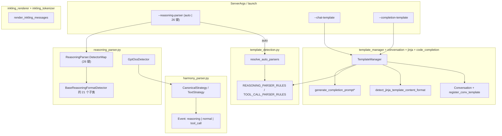

# `srt/parser` — 推理流解析、Harmony、对话模板、模板自动检测与 FIM 补全

## Summary

[`python/sglang/srt/parser/`](d:\design\sglang\python\sglang\srt\parser) 共 **9** 个 `.py` 文件，覆盖三块职责：① **解码输出侧**——[`reasoning_parser.py`](d:\design\sglang\python\sglang\srt\parser\reasoning_parser.py)（1993 行，22 个 detector 类）从模型增量输出中拆分「推理 / 正文」，[`harmony_parser.py`](d:\design\sglang\python\sglang\srt\parser\harmony_parser.py) 解析 GPT-OSS / Harmony 风格 `<|channel|>...` 流；② **编码请求侧**——[`conversation.py`](d:\design\sglang\python\sglang\srt\parser\conversation.py)（FastChat 系对话模板注册表）、[`jinja_template_utils.py`](d:\design\sglang\python\sglang\srt\parser\jinja_template_utils.py)（Jinja `chat_template` 内容格式检测）、[`code_completion_parser.py`](d:\design\sglang\python\sglang\srt\parser\code_completion_parser.py)（FIM 补全串）、[`inkling_renderer.py`](d:\design\sglang\python\sglang\srt\parser\inkling_renderer.py) / [`inkling_tokenizer.py`](d:\design\sglang\python\sglang\srt\parser\inkling_tokenizer.py)（Inkling 模型的 token 级消息渲染）；③ **模板管理与自动检测**——[`template_manager.py`](d:\design\sglang\python\sglang\srt\parser\template_manager.py)（自 `managers/` 迁入，#26052）与 [`template_detection.py`](d:\design\sglang\python\sglang\srt\parser\template_detection.py)（从 chat template + tokenizer 词表规则式推断 reasoning / tool-call parser，支撑 `--reasoning-parser auto`）。

CLI 上，[`--reasoning-parser`](d:\design\sglang\python\sglang\srt\server_args.py) 的 `choices` = `["auto"] + list(ReasoningParser.DetectorMap.keys())`（26 键，[server_args.py:L8664-8674](d:\design\sglang\python\sglang\srt\server_args.py)）；`auto` 由 [`template_detection.resolve_auto_parsers`](d:\design\sglang\python\sglang\srt\parser\template_detection.py) 在 engine 初始化时就地解析（[template_detection.py:L702-781](d:\design\sglang\python\sglang\srt\parser\template_detection.py)）。

> synthesis: 目录名 `parser` 语义上是「OpenAI 兼容层附近的文本与模板工具箱」：解码侧（reasoning / harmony）+ 编码侧（conversation / FIM / Jinja / Inkling 渲染）+ 模板自动检测三合一，而非单一语法解析器子系统。2026-08 版相比 4 月版的最大结构变化是 TemplateManager 迁入与 `auto` parser 检测链（template_detection.py）的出现。

## Sources

| 主题 | 锚点 |
|---|---|
| 推理解析与分派 | [reasoning_parser.py](d:\design\sglang\python\sglang\srt\parser\reasoning_parser.py)（`StreamingParseResult` L50-59；`BaseReasoningFormatDetector` L62-311；`ReasoningParser` L1860-1993；`DetectorMap` L1875-1902） |
| Harmony 流 | [harmony_parser.py](d:\design\sglang\python\sglang\srt\parser\harmony_parser.py)（`Event`/`Token` L6-22；`prefix_hold` L24；`iter_tokens` L46；`CanonicalStrategy` L123-416；`TextStrategy` L419-498；`HarmonyParser` L501-588） |
| 对话模板 | [conversation.py](d:\design\sglang\python\sglang\srt\parser\conversation.py)（`SeparatorStyle` L41-72；`Conversation` L74-498；注册表 L502-530；27 处顶格注册 L719-1084；路径匹配函数 L1113-1237） |
| Jinja 辅助 | [jinja_template_utils.py](d:\design\sglang\python\sglang\srt\parser\jinja_template_utils.py)（`detect_jinja_template_content_format` L81-120；`process_content_for_template_format` L123-240） |
| FIM 补全 | [code_completion_parser.py](d:\design\sglang\python\sglang\srt\parser\code_completion_parser.py)（`FimPosition`/`CompletionTemplate` L27-52；注册 L109-138） |
| 模板自动检测 | [template_detection.py](d:\design\sglang\python\sglang\srt\parser\template_detection.py)（`TemplateDetectionContext` L38-55；`REASONING_MODE_RULES` L147；parser 规则表 L433-495；`resolve_auto_parsers` L702-781） |
| 模板管理 | [template_manager.py](d:\design\sglang\python\sglang\srt\parser\template_manager.py)（`TemplateManager` L54-388） |
| Inkling 渲染/分词 | [inkling_renderer.py](d:\design\sglang\python\sglang\srt\parser\inkling_renderer.py)（`render_inkling_messages` L38-176）；[inkling_tokenizer.py](d:\design\sglang\python\sglang\srt\parser\inkling_tokenizer.py)（token 常量 L7-70；`InklingTokenizer` L84-105） |
| Server CLI | [server_args.py](d:\design\sglang\python\sglang\srt\server_args.py)（字段 L1379-1424；动态 choices CLI L8658-8684） |

## Architecture / Data flow

- **推理分派**：[`ReasoningParser.__init__`](d:\design\sglang\python\sglang\srt\parser\reasoning_parser.py) 用 `model_type.lower()` 查表 `DetectorMap` 构造对应 detector（[L1904-1962](d:\design\sglang\python\sglang\srt\parser\reasoning_parser.py)）；对接受 `tokenizer` / `tool_call_parser_active` 参数的 detector 用 `inspect.signature` 条件传参（[L1952-1960](d:\design\sglang\python\sglang\srt\parser\reasoning_parser.py)）。
- **GPT-OSS 路径**：[`GptOssDetector`](d:\design\sglang\python\sglang\srt\parser\reasoning_parser.py)（[L689-757](d:\design\sglang\python\sglang\srt\parser\reasoning_parser.py)）委托 [`HarmonyParser`](d:\design\sglang\python\sglang\srt\parser\harmony_parser.py) 将流拆成 `reasoning` / `normal` / `tool_call` 事件。
- **模板加载**：[`TemplateManager`](d:\design\sglang\python\sglang\srt\parser\template_manager.py) 聚合 `code_completion_parser` + `conversation` + `jinja_template_utils` + `template_detection`（import [L27-49](d:\design\sglang\python\sglang\srt\parser\template_manager.py)），在 `load_chat_template` 时顺带跑模板检测并暴露 `suggested_reasoning_parser` / `suggested_tool_call_parser`（[L112-184](d:\design\sglang\python\sglang\srt\parser\template_manager.py)）。
- **auto 检测**：[`resolve_auto_parsers`](d:\design\sglang\python\sglang\srt\parser\template_detection.py) 在任何组件发布 `server_args` 前就地把 `reasoning_parser="auto"` / `tool_call_parser="auto"` 解析为具体值；chat template 检测失败时回退到模型架构推断（`KimiK3*` / `DeepseekV4*` / `DeepseekV3*`，[L665-699](d:\design\sglang\python\sglang\srt\parser\template_detection.py)），由 [entrypoints/engine.py:L99](d:\design\sglang\python\sglang\srt\entrypoints\engine.py) 调用。

## File inventory（9 文件）

| 文件 | 行数 | 职责摘要 |
|---|---|---|
| [reasoning_parser.py](d:\design\sglang\python\sglang\srt\parser\reasoning_parser.py) | 1993 | `StreamingParseResult`；`BaseReasoningFormatDetector` + 21 个模型 detector；`ReasoningParser` 门面（`DetectorMap` 26 键） |
| [conversation.py](d:\design\sglang\python\sglang\srt\parser\conversation.py) | 1237 | `SeparatorStyle`、`Conversation`、`chat_templates` 注册表、27 处内置模板注册、模型路径匹配函数 |
| [template_detection.py](d:\design\sglang\python\sglang\srt\parser\template_detection.py) | 781 | 规则式模板检测：reasoning 模式/toggle、reasoning parser、tool-call parser；`resolve_auto_parsers` |
| [harmony_parser.py](d:\design\sglang\python\sglang\srt\parser\harmony_parser.py) | 588 | Harmony 词法 `iter_tokens`；`CanonicalStrategy` / `TextStrategy`；`HarmonyParser` 门面 |
| [template_manager.py](d:\design\sglang\python\sglang\srt\parser\template_manager.py) | 388 | chat / completion 模板集中管理（自 `managers/` 迁入，#26052）；HF 模板回退与命名模板选择 |
| [inkling_renderer.py](d:\design\sglang\python\sglang\srt\parser\inkling_renderer.py) | 332 | Inkling 消息 → input_ids 纯渲染器（媒体占位符 1 个/项） |
| [jinja_template_utils.py](d:\design\sglang\python\sglang\srt\parser\jinja_template_utils.py) | 240 | Jinja AST 检测 `openai` vs `string`；多模态 content 归一 |
| [code_completion_parser.py](d:\design\sglang\python\sglang\srt\parser\code_completion_parser.py) | 138 | `CompletionTemplate`、FIM 拼接、全局 `completion_template_name` |
| [inkling_tokenizer.py](d:\design\sglang\python\sglang\srt\parser\inkling_tokenizer.py) | 105 | Inkling 特殊 token 常量表 + `InklingTokenizer` 覆盖层 |

## `reasoning_parser.py`

### 基类与结果类型

- [`StreamingParseResult`](d:\design\sglang\python\sglang\srt\parser\reasoning_parser.py)：`normal_text` / `reasoning_text`（[L50-59](d:\design\sglang\python\sglang\srt\parser\reasoning_parser.py)）。
- [`BaseReasoningFormatDetector`](d:\design\sglang\python\sglang\srt\parser\reasoning_parser.py)（[L62-311](d:\design\sglang\python\sglang\srt\parser\reasoning_parser.py)）构造参数已扩展为 11 个（[L65-78](d:\design\sglang\python\sglang\srt\parser\reasoning_parser.py)）：`think_start_token`、`think_end_token`、`think_excluded_tokens`、`force_reasoning`、`stream_reasoning`、`tool_start_token`、`continue_final_message`、`previous_content`、`thinks_internally`、`reasoning_default`、`force_nonempty_content`。相对 4 月版新增的语义：
  - `continue_final_message` + `previous_content`：从上一条 assistant 消息恢复推理态——`previous_content` 中含 `think_start_token` 则入推理态、含 `think_end_token` 则出（[L104-107](d:\design\sglang\python\sglang\srt\parser\reasoning_parser.py)）。
  - `force_nonempty_content`：解析结果 `normal_text` 为空时把 `reasoning_text` 交换为正文（[`_maybe_apply_force_nonempty_content` L109-114](d:\design\sglang\python\sglang\srt\parser\reasoning_parser.py)）；流式下累计 `_accumulated_reasoning`，在 `finish()` 时兑现（[L181-187](d:\design\sglang\python\sglang\srt\parser\reasoning_parser.py)、[L300-305](d:\design\sglang\python\sglang\srt\parser\reasoning_parser.py)）。
  - `thinks_internally` / `reasoning_default`：记录该模型「思考开关」的默认语义（如 `enable_thinking` / `explicit_thinking`），供 serving 层与模板检测联动（赋值 [L86-87](d:\design\sglang\python\sglang\srt\parser\reasoning_parser.py)）。
- [`detect_and_parse`](d:\design\sglang\python\sglang\srt\parser\reasoning_parser.py)（一次性，[L116-169](d:\design\sglang\python\sglang\srt\parser\reasoning_parser.py)）：剥离起始标签（可重复出现，`while startswith` [L134-135](d:\design\sglang\python\sglang\srt\parser\reasoning_parser.py)）；无结束标签时若命中 `tool_start_token` 则在其处切分并把 token 保留在 `normal_text`（[L141-154](d:\design\sglang\python\sglang\srt\parser\reasoning_parser.py)），否则整段视为被截断的推理（[L156](d:\design\sglang\python\sglang\srt\parser\reasoning_parser.py)）。
- [`finish()`](d:\design\sglang\python\sglang\srt\parser\reasoning_parser.py)（[L283-310](d:\design\sglang\python\sglang\srt\parser\reasoning_parser.py)，4 月版无此接口）：流在结束标签前被截断（如 max_tokens）时冲刷残余缓冲，而不是静默丢弃。

### 流式状态机要点（`_parse_streaming_increment_impl` L189-265）

- **缓冲区**：`_buffer` 累加 chunk；若当前文本是 `think_start_text` / `think_end_token` / `tool_start_token` 的**真前缀**，返回空结果等待更多字节（[L195-203](d:\design\sglang\python\sglang\srt\parser\reasoning_parser.py)）。
- **起始标签**：首次见到 `think_start_token + think_start_self_label` 时剥离并进入推理态（[L205-211](d:\design\sglang\python\sglang\srt\parser\reasoning_parser.py)）。
- **结束标签**：推理态下出现 `think_end_token` 即截断推理正文、清空缓冲，余下为 `normal_text`（[L213-225](d:\design\sglang\python\sglang\srt\parser\reasoning_parser.py)）。
- **工具打断**：推理态命中 `tool_start_token` 时把后续划给 `normal_text`（保留 token 本身，[L229-240](d:\design\sglang\python\sglang\srt\parser\reasoning_parser.py)）。
- **holdback 机制**（4 月版无）：`stream_reasoning=True` 时对每个可能跨 chunk 分裂的标记算 [`_ends_with_partial_token`](d:\design\sglang\python\sglang\srt\parser\reasoning_parser.py)（最长后缀=标记真前缀，[L273-281](d:\design\sglang\python\sglang\srt\parser\reasoning_parser.py)），只发出去掉 holdback 尾巴的推理增量（[L241-256](d:\design\sglang\python\sglang\srt\parser\reasoning_parser.py)）——这就是 #34458「chunk-invariant」修复的核心 pattern。
- **无推理块**：未进入 `_in_reasoning` 时整段作为 `normal_text` 发出并清空缓冲（[L260-263](d:\design\sglang\python\sglang\srt\parser\reasoning_parser.py)）。

### 具体 Detector 类（22 个 class，基类 + 21 个模型 detector）

| # | 类名 | 锚点 | 标记 / 说明 |
|---|------|------|------|
| 1 | `BaseReasoningFormatDetector` | [L62-311](d:\design\sglang\python\sglang\srt\parser\reasoning_parser.py) | 基类，`<start>...<end>` 通用状态机 |
| 2 | `DeepSeekR1Detector` | [L313-353](d:\design\sglang\python\sglang\srt\parser\reasoning_parser.py) | `<think>...</think>`，构造时硬编码 `force_reasoning=True`（[L346](d:\design\sglang\python\sglang\srt\parser\reasoning_parser.py)） |
| 3 | `Qwen3Detector` | [L355-400](d:\design\sglang\python\sglang\srt\parser\reasoning_parser.py) | `<think>...</think>`；`tool_start_token="<tool_call>"`（隐式闭合推理）；`reasoning_default="enable_thinking"` |
| 4 | `KimiDetector` | [L402-428](d:\design\sglang\python\sglang\srt\parser\reasoning_parser.py) | `◁think▷...◁/think▷` |
| 5 | `KimiK2Detector` | [L430-472](d:\design\sglang\python\sglang\srt\parser\reasoning_parser.py) | `<think>` + `tool_start_token="<|tool_calls_section_begin|>"` |
| 6 | `KimiK3Detector` | [L474-648](d:\design\sglang\python\sglang\srt\parser\reasoning_parser.py) | XTML think channel（`<|open|>think<|sep|>`，标记常量来自 [function_call/kimik3_format.py](d:\design\sglang\python\sglang\srt\function_call\kimik3_format.py)，import [L15-25](d:\design\sglang\python\sglang\srt\parser\reasoning_parser.py)） |
| 7 | `Glm45Detector` | [L650-687](d:\design\sglang\python\sglang\srt\parser\reasoning_parser.py) | `<think>` + `tool_start_token="<tool_call>"` |
| 8 | `GptOssDetector` | [L689-757](d:\design\sglang\python\sglang\srt\parser\reasoning_parser.py) | 委托 `HarmonyParser`；tool_call 事件保留 `raw_text` 结构标记（[L725-727](d:\design\sglang\python\sglang\srt\parser\reasoning_parser.py)） |
| 9 | `MiniMaxAppendThinkDetector` | [L759-792](d:\design\sglang\python\sglang\srt\parser\reasoning_parser.py) | 只在首 chunk 前补 `<think>`，不做拆分 |
| 10 | `Nemotron3Detector` | [L794-820](d:\design\sglang\python\sglang\srt\parser\reasoning_parser.py) | 同 R1 格式 + `tool_start_token="<tool_call>"` |
| 11 | `MiniMaxM3Detector` | [L822-873](d:\design\sglang\python\sglang\srt\parser\reasoning_parser.py) | `<mm:think>`；丢弃多轮对话残留的一个开头裸 `</mm:think>`（[L857-872](d:\design\sglang\python\sglang\srt\parser\reasoning_parser.py)） |
| 12 | `MistralDetector` | [L875-903](d:\design\sglang\python\sglang\srt\parser\reasoning_parser.py) | `[THINK]...[/THINK]`；`reasoning_default="mistral"` |
| 13 | `HunyuanDetector` | [L905-936](d:\design\sglang\python\sglang\srt\parser\reasoning_parser.py) | token 由 [`resolve_hunyuan_tokens(tokenizer)`](d:\design\sglang\python\sglang\srt\function_call\hunyuan_detector.py) 动态解析（唯一接受 `tokenizer` 参数的 detector） |
| 14 | `Gemma4Detector` | [L938-960](d:\design\sglang\python\sglang\srt\parser\reasoning_parser.py) | `<|channel>` / `<channel|>` + `think_start_self_label="thought\n"`（[L959](d:\design\sglang\python\sglang\srt\parser\reasoning_parser.py)） |
| 15 | `InklingDetector` | [L976-1137](d:\design\sglang\python\sglang\srt\parser\reasoning_parser.py) | Inkling 类型化内容块（`<|message_model|><|content_thinking|>...<|end_message|>`），控制符字母表共享自 [inkling_tokenizer.py](d:\design\sglang\python\sglang\srt\parser\inkling_tokenizer.py) |
| 16 | `_DeepSeekV3Detector` | [L1139-1144](d:\design\sglang\python\sglang\srt\parser\reasoning_parser.py) | 继承 `Qwen3Detector`，`reasoning_default="explicit_thinking"` |
| 17 | `DeepSeekV4Detector` | [L1147-1170](d:\design\sglang\python\sglang\srt\parser\reasoning_parser.py) | token 来自 [entrypoints/openai/encoding_dsv4.py](d:\design\sglang\python\sglang\srt\entrypoints\openai\encoding_dsv4.py)（import [L5-12](d:\design\sglang\python\sglang\srt\parser\reasoning_parser.py)）；`tool_start_token=f"<{dsml_token}"`；#34458 chunk-invariant 修复主要落在基类 holdback |
| 18 | `_MimoDetector` | [L1172-1177](d:\design\sglang\python\sglang\srt\parser\reasoning_parser.py) | 继承 `Qwen3Detector`，`reasoning_default="explicit_enable_thinking"` |
| 19 | `_PoolsideV1Detector` | [L1180-1186](d:\design\sglang\python\sglang\srt\parser\reasoning_parser.py) | 继承 `Qwen3Detector`（Laguna-XS.2），同上 |
| 20 | `Apertus2509Detector` | [L1189-1393](d:\design\sglang\python\sglang\srt\parser\reasoning_parser.py) | `<|inner_prefix|>...<|inner_suffix|>`；额外提供 `detect_and_parse_block_sequence`（有序块序列，[L1230](d:\design\sglang\python\sglang\srt\parser\reasoning_parser.py)） |
| 21 | `CohereCommand4Detector` | [L1395-1651](d:\design\sglang\python\sglang\srt\parser\reasoning_parser.py) | `<|START_THINKING|>/<|END_THINKING|>` + `<|START_TEXT|>/<|END_TEXT|>` / `<|START_ACTION|>` 三态流式状态机（[L1452-1462](d:\design\sglang\python\sglang\srt\parser\reasoning_parser.py)） |
| 22 | `MuseGlimmerDetector` | [L1653-1858](d:\design\sglang\python\sglang\srt\parser\reasoning_parser.py) | **本期新增**（#34262）：recipient-channel 格式，`to=self` 通道=推理、`to=user`=正文、其它 recipient=工具调用（ATEM 块保留原始标记）；标记常量来自 [function_call/muse_glimmer_format.py](d:\design\sglang\python\sglang\srt\function_call\muse_glimmer_format.py)（import [L26-36](d:\design\sglang\python\sglang\srt\parser\reasoning_parser.py)）；唯一接受 `tool_call_parser_active` 参数的 detector（[L1698](d:\design\sglang\python\sglang\srt\parser\reasoning_parser.py)） |

### `DetectorMap`（26 键）→ CLI `--reasoning-parser` 字符串

[`ReasoningParser.DetectorMap`](d:\design\sglang\python\sglang\srt\parser\reasoning_parser.py) 定义于 [L1875-1902](d:\design\sglang\python\sglang\srt\parser\reasoning_parser.py)，26 个键映射到 21 个 detector 类（`Qwen3Detector` 承接 4 键、`DeepSeekR1Detector` 承接 3 键）：

| 键 | detector 类 | 键 | detector 类 |
|---|---|---|---|
| `apertus2509` | `Apertus2509Detector` | `muse` | `MuseGlimmerDetector`（本期新增） |
| `deepseek-r1` | `DeepSeekR1Detector` | `poolside_v1` | `_PoolsideV1Detector` |
| `deepseek-v3` | `_DeepSeekV3Detector` | `qwen3` | `Qwen3Detector` |
| `deepseek-v4` | `DeepSeekV4Detector` | `qwen3-thinking` | `Qwen3Detector` |
| `glm45` | `Glm45Detector` | `minimax` | `Qwen3Detector` |
| `hunyuan` | `HunyuanDetector` | `minimax-append-think` | `MiniMaxAppendThinkDetector` |
| `gpt-oss` | `GptOssDetector` | `minimax-m3` | `MiniMaxM3Detector` |
| `kimi` | `KimiDetector` | `step3` | `DeepSeekR1Detector` |
| `kimi_k2` | `KimiK2Detector` | `step3p5` | `DeepSeekR1Detector` |
| `kimi_k3` | `KimiK3Detector` | `mistral` | `MistralDetector` |
| `mimo` | `_MimoDetector` | `nemotron_3` | `Nemotron3Detector` |
| `interns1` | `Qwen3Detector` | `gemma4` | `Gemma4Detector` |
| `inkling` | `InklingDetector` | `cohere_command4` | `CohereCommand4Detector` |

### `ReasoningParser` 门面（L1860-1993）

- **force_reasoning 强制清单**：`qwen3-thinking` / `gpt-oss` / `minimax` 无条件 `force_reasoning=True`（[L1923-1928](d:\design\sglang\python\sglang\srt\parser\reasoning_parser.py)）；`minimax-m3` 在未显式指定时按 `chat_template_kwargs.thinking_mode == "enabled"` 决定（[L1930-1933](d:\design\sglang\python\sglang\srt\parser\reasoning_parser.py)）。
- **continue_final_message**：请求最后一条消息是 assistant 且 `continue_final_message=True` 时把其内容作为 `previous_content` 传入 detector（[L1940-1947](d:\design\sglang\python\sglang\srt\parser\reasoning_parser.py)）。
- **条件传参**：`tokenizer`（Hunyuan 用）与 `tool_call_parser_active`（Muse 用）经 `inspect.signature` 探测后才传（[L1952-1960](d:\design\sglang\python\sglang\srt\parser\reasoning_parser.py)）。
- **四个公开方法**：`parse_non_stream`（[L1964](d:\design\sglang\python\sglang\srt\parser\reasoning_parser.py)）、`parse_non_stream_blocks`（有序块序列，优先走 detector 的 `detect_and_parse_block_sequence`，[L1969-1980](d:\design\sglang\python\sglang\srt\parser\reasoning_parser.py)）、`parse_stream_chunk`（[L1982](d:\design\sglang\python\sglang\srt\parser\reasoning_parser.py)）、`parse_stream_end`（冲刷 detector 缓冲，[L1989-1993](d:\design\sglang\python\sglang\srt\parser\reasoning_parser.py)）。后两个非流/流收尾接口是 4 月版没有的。

## `harmony_parser.py`（GPT-OSS / Harmony 格式）

- 文件 **未** `import openai_harmony`：纯 Python 标记扫描 + 策略解析（全文 [harmony_parser.py](d:\design\sglang\python\sglang\srt\parser\harmony_parser.py)）。
- **数据结构**：[`Event`](d:\design\sglang\python\sglang\srt\parser\harmony_parser.py)（`event_type` / `content` / `raw_text`，[L6-13](d:\design\sglang\python\sglang\srt\parser\harmony_parser.py)）、[`Token`](d:\design\sglang\python\sglang\srt\parser\harmony_parser.py)（[L15-22](d:\design\sglang\python\sglang\srt\parser\harmony_parser.py)）；模块级工具 [`prefix_hold`](d:\design\sglang\python\sglang\srt\parser\harmony_parser.py)（[L24-43](d:\design\sglang\python\sglang\srt\parser\harmony_parser.py)）与词法器 [`iter_tokens`](d:\design\sglang\python\sglang\srt\parser\harmony_parser.py)（[L46-120](d:\design\sglang\python\sglang\srt\parser\harmony_parser.py)）。
- **Channel 与事件**：[`CanonicalStrategy`](d:\design\sglang\python\sglang\srt\parser\harmony_parser.py)（[L123-416](d:\design\sglang\python\sglang\srt\parser\harmony_parser.py)）的 [`_extract_channel_type`](d:\design\sglang\python\sglang\srt\parser\harmony_parser.py)（[L246-258](d:\design\sglang\python\sglang\srt\parser\harmony_parser.py)）识别 `analysis` / `commentary` / `final`；[`_parse_block`](d:\design\sglang\python\sglang\srt\parser\harmony_parser.py)（[L260-](d:\design\sglang\python\sglang\srt\parser\harmony_parser.py)）产出 `reasoning` / `normal` / `tool_call` 事件。
- **流式策略选择**：[`HarmonyParser.parse`](d:\design\sglang\python\sglang\srt\parser\harmony_parser.py)（[L514-528](d:\design\sglang\python\sglang\srt\parser\harmony_parser.py)）缓冲至可判定 `CanonicalStrategy`（含 `<|channel|>` / `<|start|>`）或 `TextStrategy`（正则 `analysis|commentary|assistantfinal`，[L419-498](d:\design\sglang\python\sglang\srt\parser\harmony_parser.py)）。
- **commentary 过滤**：工具调用（`tool_call` 事件或缓冲尾 `<|call|>`）之后的 `commentary` 填充词会被跨 chunk 累积匹配并过滤（[L536-588](d:\design\sglang\python\sglang\srt\parser\harmony_parser.py)）。
- **与 function_call 的复用**：[`function_call/gpt_oss_detector.py`](d:\design\sglang\python\sglang\srt\function_call\gpt_oss_detector.py) 单独 `import HarmonyParser`（[L14](d:\design\sglang\python\sglang\srt\function_call\gpt_oss_detector.py)）做工具调用检测，与 `reasoning_parser.GptOssDetector` 职责不同（工具探测 vs 推理拆分）。

## `conversation.py`

- **谱系**：文件头标注 *Adapted from* FastChat `conversation.py`（[L26-27](d:\design\sglang\python\sglang\srt\parser\conversation.py)）；多模态补全逻辑旁注 *adapted from* vLLM `chat_utils.py`（[L584](d:\design\sglang\python\sglang\srt\parser\conversation.py)）。
- [`SeparatorStyle`](d:\design\sglang\python\sglang\srt\parser\conversation.py)：`IntEnum`（[L41-72](d:\design\sglang\python\sglang\srt\parser\conversation.py)）。
- [`Conversation`](d:\design\sglang\python\sglang\srt\parser\conversation.py)：`dataclass`（[L74 起](d:\design\sglang\python\sglang\srt\parser\conversation.py)），[`get_prompt`](d:\design\sglang\python\sglang\srt\parser\conversation.py) 按 `sep_style` 分支（[L108 起](d:\design\sglang\python\sglang\srt\parser\conversation.py)）。
- **注册表**：全局 [`chat_templates`](d:\design\sglang\python\sglang\srt\parser\conversation.py)（[L502](d:\design\sglang\python\sglang\srt\parser\conversation.py)）+ [`register_conv_template`](d:\design\sglang\python\sglang\srt\parser\conversation.py)（[L506-513](d:\design\sglang\python\sglang\srt\parser\conversation.py)）；[`matching_function_registry`](d:\design\sglang\python\sglang\srt\parser\conversation.py)（[L503](d:\design\sglang\python\sglang\srt\parser\conversation.py)）+ [`get_conv_template_by_model_path`](d:\design\sglang\python\sglang\srt\parser\conversation.py)（[L520-525](d:\design\sglang\python\sglang\srt\parser\conversation.py)）。
- **入口构造函数**：[`generate_embedding_convs`](d:\design\sglang\python\sglang\srt\parser\conversation.py)（[L532](d:\design\sglang\python\sglang\srt\parser\conversation.py)）与 [`generate_chat_conv`](d:\design\sglang\python\sglang\srt\parser\conversation.py)（[L603](d:\design\sglang\python\sglang\srt\parser\conversation.py)）。
- **内置模板数量**：顶格 `register_conv_template(` 调用 **27** 次（[L719-1084](d:\design\sglang\python\sglang\srt\parser\conversation.py)）；模型路径匹配函数（`match_internvl` 等 `@register_conv_template_matching_function`）在 [L1113-1237](d:\design\sglang\python\sglang\srt\parser\conversation.py)。

## `jinja_template_utils.py`

- **谱系**：注释指明改编自 vLLM `chat_utils` 的模板 AST 检测（[L16-25](d:\design\sglang\python\sglang\srt\parser\jinja_template_utils.py)）。
- [`detect_jinja_template_content_format`](d:\design\sglang\python\sglang\srt\parser\jinja_template_utils.py)：解析 Jinja AST，存在对 `message['content']` 的迭代则 `openai`，否则 `string`（[L81-120](d:\design\sglang\python\sglang\srt\parser\jinja_template_utils.py)）。
- [`process_content_for_template_format`](d:\design\sglang\python\sglang\srt\parser\jinja_template_utils.py)：按格式压平或保留结构化 content，抽取 image/video/audio 到并行列表（[L123-240](d:\design\sglang\python\sglang\srt\parser\jinja_template_utils.py)）。

> [!todo] VERIFY: ~~用户提纲中「tool_choice rendering」在本文件 **未出现**；若指 OpenAI 入口其它模块，应另立锚点。~~
> **RESOLVED 2026-04-19**（2026-08-18 re-ingest 复核仍成立）：本文件全文对 `tool_choice` 0 命中；`tool_choice` 渲染在 OpenAI 入口侧（[`entrypoints/openai/serving_chat.py`](d:\design\sglang\python\sglang\srt\entrypoints\openai\serving_chat.py)，与 [function_call.md](function_call.md) 主述一致），不属本模块职责。

## `code_completion_parser.py`（FIM）

- [`FimPosition`](d:\design\sglang\python\sglang\srt\parser\code_completion_parser.py)：`MIDDLE` | `END`（[L27-33](d:\design\sglang\python\sglang\srt\parser\code_completion_parser.py)）；[`CompletionTemplate`](d:\design\sglang\python\sglang\srt\parser\code_completion_parser.py)（[L35-52](d:\design\sglang\python\sglang\srt\parser\code_completion_parser.py)）；全局注册表 [`completion_templates`](d:\design\sglang\python\sglang\srt\parser\code_completion_parser.py)（[L55](d:\design\sglang\python\sglang\srt\parser\code_completion_parser.py)）。
- [`generate_completion_prompt`](d:\design\sglang\python\sglang\srt\parser\code_completion_parser.py)：按 `fim_position` 拼接（[L93-106](d:\design\sglang\python\sglang\srt\parser\code_completion_parser.py)）；请求入口 [`generate_completion_prompt_from_request`](d:\design\sglang\python\sglang\srt\parser\code_completion_parser.py)（[L83-90](d:\design\sglang\python\sglang\srt\parser\code_completion_parser.py)）。
- **内置三套**：

| name | begin | middle | end | position |
|------|-------|--------|-----|----------|
| `deepseek_coder` | `<｜fim▁begin｜>` | `<｜fim▁hole｜>` | `<｜fim▁end｜>` | `MIDDLE`（[L109-117](d:\design\sglang\python\sglang\srt\parser\code_completion_parser.py)） |
| `star_coder` | `<fim_prefix>` | `<fim_middle>` | `<fim_suffix>` | `END`（[L120-128](d:\design\sglang\python\sglang\srt\parser\code_completion_parser.py)） |
| `qwen_coder` | `<\|fim_prefix\|>` | `<\|fim_middle\|>` | `<\|fim_suffix\|>` | `END`（[L130-138](d:\design\sglang\python\sglang\srt\parser\code_completion_parser.py)） |

## `template_detection.py`（新增小节：模板自动检测）

规则式检测器，从 chat template 文本 + tokenizer 词表推断三类信息（文件头 docstring [L14-19](d:\design\sglang\python\sglang\srt\parser\template_detection.py)）：

- **数据结构**：[`TemplateDetectionContext`](d:\design\sglang\python\sglang\srt\parser\template_detection.py)（`has_text` / `has_vocab` / `has_pattern` / `has_vocab_pattern` 四种谓词原语，[L38-55](d:\design\sglang\python\sglang\srt\parser\template_detection.py)）、[`DetectionRule`](d:\design\sglang\python\sglang\srt\parser\template_detection.py)（[L59-62](d:\design\sglang\python\sglang\srt\parser\template_detection.py)）、[`ReasoningToggleConfig`](d:\design\sglang\python\sglang\srt\parser\template_detection.py)（toggle 参数名 / 默认开关 / effort kwarg，[L66-74](d:\design\sglang\python\sglang\srt\parser\template_detection.py)）。
- **Jinja AST 级检测**：[`_has_toggle_default_assignment`](d:\design\sglang\python\sglang\srt\parser\template_detection.py)（[L90-](d:\design\sglang\python\sglang\srt\parser\template_detection.py)）解析模板 AST 找 `enable_thinking | default(...)` 型 toggle；[`_GenerationTagExtension`](d:\design\sglang\python\sglang\srt\parser\template_detection.py)（[L77-87](d:\design\sglang\python\sglang\srt\parser\template_detection.py)）提供 `` 块的 parse-only 支持。
- **三张规则表**：`REASONING_MODE_RULES`（[L147 起](d:\design\sglang\python\sglang\srt\parser\template_detection.py)，判定 reasoning 是否/如何开启）；[`REASONING_PARSER_RULES`](d:\design\sglang\python\sglang\srt\parser\template_detection.py)（21 条，[L433-461](d:\design\sglang\python\sglang\srt\parser\template_detection.py)）与 [`TOOL_CALL_PARSER_RULES`](d:\design\sglang\python\sglang\srt\parser\template_detection.py)（25 条，[L467-495](d:\design\sglang\python\sglang\srt\parser\template_detection.py)）复用同一组 `_is_*` 谓词（[L246-426](d:\design\sglang\python\sglang\srt\parser\template_detection.py)）但映射到不同 parser 名。规则**有序**，先命中先赢（[`match_rules` L529-546](d:\design\sglang\python\sglang\srt\parser\template_detection.py)）。
- **入口函数**：[`detect_reasoning_pattern`](d:\design\sglang\python\sglang\srt\parser\template_detection.py)（[L549-566](d:\design\sglang\python\sglang\srt\parser\template_detection.py)）、[`detect_reasoning_parser`](d:\design\sglang\python\sglang\srt\parser\template_detection.py) / [`detect_tool_call_parser`](d:\design\sglang\python\sglang\srt\parser\template_detection.py)（[L569-596](d:\design\sglang\python\sglang\srt\parser\template_detection.py)）、[`detect_inline_system_support`](d:\design\sglang\python\sglang\srt\parser\template_detection.py)（沙箱渲染探针判定 mid-conversation system 消息是否内联，[L599-627](d:\design\sglang\python\sglang\srt\parser\template_detection.py)；被 [entrypoints/anthropic/serving.py:L56](d:\design\sglang\python\sglang\srt\entrypoints\anthropic\serving.py) 消费）。
- **[`resolve_auto_parsers`](d:\design\sglang\python\sglang\srt\parser\template_detection.py)**（[L702-781](d:\design\sglang\python\sglang\srt\parser\template_detection.py)）：`--reasoning-parser auto` / `--tool-call-parser auto` 的解析入口，轻量加载 tokenizer 后按模板规则检测；模板不可用时回退模型架构映射（`KimiK3*`→`kimi_k3`、`DeepseekV4*`→`deepseek-v4`+`deepseekv4`、`DeepseekV3*`→`deepseek-v3`+`deepseekv32`，[`_architecture_auto_parsers` L665-699](d:\design\sglang\python\sglang\srt\parser\template_detection.py)）；结果经 [`declare_late_resolution`](d:\design\sglang\python\sglang\srt\arg_groups\overrides.py) 就地写回 `server_args`（[L780-781](d:\design\sglang\python\sglang\srt\parser\template_detection.py)）。

## `template_manager.py`（新增小节：模板集中管理，迁入自 `managers/`）

原 `managers/template_manager.py` 已随上游 #26052 "Move template manager files under parser" 迁入本目录；旧路径死链。

- [`TemplateManager`](d:\design\sglang\python\sglang\srt\parser\template_manager.py)（[L54-388](d:\design\sglang\python\sglang\srt\parser\template_manager.py)）持有 `chat_template_name` / `completion_template_name` / `jinja_template_content_format`（默认 `"openai"`，[L66](d:\design\sglang\python\sglang\srt\parser\template_manager.py)）及模板检测产物 `force_reasoning` / `reasoning_config` / `suggested_reasoning_parser` / `suggested_tool_call_parser`（[L63-70](d:\design\sglang\python\sglang\srt\parser\template_manager.py)、properties [L72-110](d:\design\sglang\python\sglang\srt\parser\template_manager.py)）。
- **chat template 加载链**（[`load_chat_template` L131-184](d:\design\sglang\python\sglang\srt\parser\template_manager.py)）：显式参数（内置名 / `.jinja` / `.json`，[L186-205](d:\design\sglang\python\sglang\srt\parser\template_manager.py)）→ 模型路径猜测（[L207-217](d:\design\sglang\python\sglang\srt\parser\template_manager.py)）→ HF tokenizer/processor 模板回退（含 dict 多命名模板经 `--hf-chat-template-name` 选择，[L336-388](d:\design\sglang\python\sglang\srt\parser\template_manager.py)）；加载后统一跑 [`_run_template_detection`](d:\design\sglang\python\sglang\srt\parser\template_manager.py)（一次构建 context 复用于 reasoning + tool-call 两轮检测，[L112-129](d:\design\sglang\python\sglang\srt\parser\template_manager.py)）。
- **completion template 加载**（[`load_completion_template` L219-239](d:\design\sglang\python\sglang\srt\parser\template_manager.py)）：内置名或 JSON 文件，最终 `set_completion_template` 写回 `code_completion_parser` 的全局状态。
- 统一入口 [`initialize_templates`](d:\design\sglang\python\sglang\srt\parser\template_manager.py)（[L241-262](d:\design\sglang\python\sglang\srt\parser\template_manager.py)）由 [entrypoints/engine.py:L100](d:\design\sglang\python\sglang\srt\entrypoints\engine.py) / [entrypoints/http_server.py:L166](d:\design\sglang\python\sglang\srt\entrypoints\http_server.py) 消费。

## `inkling_renderer.py` + `inkling_tokenizer.py`（新增小节：Inkling 渲染/分词辅助）

- [`inkling_tokenizer.py`](d:\design\sglang\python\sglang\srt\parser\inkling_tokenizer.py)：Inkling 特殊 token 字面量与固定 ID 覆盖表（`<|message_model|>` / `<|content_thinking|>` / `<|end_message|>` 等，[L7-44](d:\design\sglang\python\sglang\srt\parser\inkling_tokenizer.py)）；`INKLING_CONTROL_TOKENS` 是 reasoning parser 与 tool-call detector **必须共享**的控制符字母表（注释明言"一方可见另一方不可见会让畸形 header 漏过"，[L48-58](d:\design\sglang\python\sglang\srt\parser\inkling_tokenizer.py)）；[`InklingTokenizer`](d:\design\sglang\python\sglang\srt\parser\inkling_tokenizer.py) 是基础 tokenizer + framing ID 覆盖层（[L84-105](d:\design\sglang\python\sglang\srt\parser\inkling_tokenizer.py)）。
- [`inkling_renderer.py`](d:\design\sglang\python\sglang\srt\parser\inkling_renderer.py)：[`render_inkling_messages`](d:\design\sglang\python\sglang\srt\parser\inkling_renderer.py)（[L38-176](d:\design\sglang\python\sglang\srt\parser\inkling_renderer.py)）把 OpenAI 消息列表直接渲染成 input_ids（**纯渲染器**：每个 image/audio 部件只发 1 个占位 ID，1→N 展开在 MM processor 做）；会话级 `reasoning_effort` 指令默认 0.9（[L35](d:\design\sglang\python\sglang\srt\parser\inkling_renderer.py)）。
- **消费方**：[entrypoints/openai/chat_encoding.py:L163-164](d:\design\sglang\python\sglang\srt\entrypoints\openai\chat_encoding.py)、[serving_chat.py:L464-465](d:\design\sglang\python\sglang\srt\entrypoints\openai\serving_chat.py)（渲染）；[multimodal/processors/inkling.py:L47-52](d:\design\sglang\python\sglang\srt\multimodal\processors\inkling.py)（占位 ID 展开）；[function_call/inkling_detector.py:L16](d:\design\sglang\python\sglang\srt\function_call\inkling_detector.py) 与 [reasoning_parser.py:L38-47](d:\design\sglang\python\sglang\srt\parser\reasoning_parser.py)（共享控制符字母表）。

## CLI / config 字段摘要

server_args 的 CLI 生成方式已重构：绝大多数参数由 `Annotated[..., Arg(...)]` 字段元数据自动生成（[`add_cli_args_from_dataclass` 调用于 L8661-8662](d:\design\sglang\python\sglang\srt\server_args.py)），只有动态 choices 的两个参数仍显式 `add_argument`（[L8664-8684](d:\design\sglang\python\sglang\srt\server_args.py)）。

| 字段 / 参数 | 默认 | 锚点 |
|-------------|------|------|
| `chat_template` / `--chat-template` | `None` | 字段 [L1379-1383](d:\design\sglang\python\sglang\srt\server_args.py)（CLI 自动生成） |
| `hf_chat_template_name` / `--hf-chat-template-name` | `None` | 字段 [L1384-1388](d:\design\sglang\python\sglang\srt\server_args.py)（CLI 自动生成） |
| `completion_template` / `--completion-template` | `None` | 字段 [L1389-1393](d:\design\sglang\python\sglang\srt\server_args.py)（CLI 自动生成） |
| `reasoning_parser` / `--reasoning-parser` | `None`；`choices=["auto"]+DetectorMap.keys()`（27 个选项） | 字段 [L1402](d:\design\sglang\python\sglang\srt\server_args.py)；CLI [L8665-8674](d:\design\sglang\python\sglang\srt\server_args.py) |
| `tool_call_parser` / `--tool-call-parser` | `None`；`choices=["auto"]+FunctionCallParser.ToolCallParserEnum.keys()` | 字段 [L1424](d:\design\sglang\python\sglang\srt\server_args.py)；CLI [L8675-8684](d:\design\sglang\python\sglang\srt\server_args.py) |
| `default_chat_template_kwargs` / `--default-chat-template-kwargs` | `None`（JSON dict；per-request `chat_template_kwargs` 优先） | 字段 [L1403-1413](d:\design\sglang\python\sglang\srt\server_args.py) |

## §跨子系统引用（§5 step 3，2026-08-18 重跑）

### 1. 跨语言绑定

- **C++/kernel**：`d:\design\sglang\` 仓库顶层已无 `sgl-kernel/` 目录（HEAD f7101b0a 实地 ls 核实）；kernel 相关跨语言绑定 N/A。
- **Rust 镜像（新发现）**：[`rust/sglang-server/src/api_server/openai/reasoning.rs`](d:\design\sglang\rust\sglang-server\src\api_server\openai\reasoning.rs) 文件头注释明言 *"Mirrors the Python frontend (`sglang.srt.parser.reasoning_parser` ...)"*（[L3](d:\design\sglang\rust\sglang-server\src\api_server\openai\reasoning.rs)），且 parser 名字空间对齐 *"The names come from Python's `ReasoningParser.DetectorMap`"*（[L20](d:\design\sglang\rust\sglang-server\src\api_server\openai\reasoning.rs)）——**非** FFI 绑定，而是 Rust 侧独立实现语义镜像；`DetectorMap` 键集合变化时 Rust 侧需同步。[`sgl-model-gateway`](d:\design\sglang\sgl-model-gateway\src\main.rs) 只把 `reasoning_parser` 作为配置字符串透传（[main.rs:L459](d:\design\sglang\sgl-model-gateway\src\main.rs)、[core/worker.rs:L314-317](d:\design\sglang\sgl-model-gateway\src\core\worker.rs)）。
- pybind / ctypes / cffi / capsule：在 `d:\design\sglang\python\` 全树对 parser 模块类名 grep 0 命中（无 C 绑定入口）。

### 2. 使用方调用清单（`from sglang.srt.parser`，在 `d:\design\sglang\python\sglang\srt\` 全树 grep，不含 `parser/` 自身）

| 模块 | 行 | 导入内容 |
|------|-----|----------|
| [server_args.py](d:\design\sglang\python\sglang\srt\server_args.py) | 67 | `ReasoningParser`（供 CLI choices） |
| [managers/scheduler.py](d:\design\sglang\python\sglang\srt\managers\scheduler.py) | 288 | `ReasoningParser` |
| [entrypoints/engine.py](d:\design\sglang\python\sglang\srt\entrypoints\engine.py) | 99-100 | `resolve_auto_parsers` + `TemplateManager`（新增消费方） |
| [entrypoints/http_server.py](d:\design\sglang\python\sglang\srt\entrypoints\http_server.py) | 165-166 | `ReasoningParser` + `TemplateManager` |
| [entrypoints/openai/serving_chat.py](d:\design\sglang\python\sglang\srt\entrypoints\openai\serving_chat.py) | 74-76, 464-465 | `generate_chat_conv`、`process_content_for_template_format`、`ReasoningParser`；Inkling 渲染（延迟 import） |
| [entrypoints/openai/serving_completions.py](d:\design\sglang\python\sglang\srt\entrypoints\openai\serving_completions.py) | 32-39 | `code_completion_parser` 多符号 + `TemplateManager`（TYPE_CHECKING） |
| [entrypoints/openai/serving_embedding.py](d:\design\sglang\python\sglang\srt\entrypoints\openai\serving_embedding.py) | 22-27 | `generate_embedding_convs`、`process_content_for_template_format`、`TemplateManager` |
| [entrypoints/openai/serving_responses.py](d:\design\sglang\python\sglang\srt\entrypoints\openai\serving_responses.py) | 75, 80 | `ReasoningParser`、`TemplateManager` |
| [entrypoints/openai/serving_classify.py](d:\design\sglang\python\sglang\srt\entrypoints\openai\serving_classify.py) | 23 | `TemplateManager`（TYPE_CHECKING，新增消费方） |
| [entrypoints/openai/chat_encoding.py](d:\design\sglang\python\sglang\srt\entrypoints\openai\chat_encoding.py) | 163-164 | `render_inkling_messages` + `InklingTokenizer`（新增消费方） |
| [entrypoints/anthropic/serving.py](d:\design\sglang\python\sglang\srt\entrypoints\anthropic\serving.py) | 56 | `detect_inline_system_support`（新增消费方） |
| [constrained/base_grammar_backend.py](d:\design\sglang\python\sglang\srt\constrained\base_grammar_backend.py) | 24 | `ReasoningParser`（新增消费方） |
| [constrained/reasoner_grammar_backend.py](d:\design\sglang\python\sglang\srt\constrained\reasoner_grammar_backend.py) | 23 | `ReasoningParser`（新增消费方） |
| [function_call/gpt_oss_detector.py](d:\design\sglang\python\sglang\srt\function_call\gpt_oss_detector.py) | 14 | `HarmonyParser` |
| [function_call/inkling_detector.py](d:\design\sglang\python\sglang\srt\function_call\inkling_detector.py) | 16 | `inkling_tokenizer` 控制符（新增消费方） |
| [multimodal/processors/inkling.py](d:\design\sglang\python\sglang\srt\multimodal\processors\inkling.py) | 47-52 | `inkling_tokenizer` token 常量 + 占位 ID（新增消费方） |

相对 4 月版的变化：`managers/template_manager.py` 从「使用方」变成**本模块成员**；新增 8 个消费方（engine、anthropic serving、constrained×2、chat_encoding、serving_classify、inkling_detector、multimodal inkling processor）；存量行号全部漂移（scheduler 207→288、serving_chat 52-54→74-76、http_server 161→165-166、server_args 35→67）。

- 反向依赖（parser → 外部）：[reasoning_parser.py](d:\design\sglang\python\sglang\srt\parser\reasoning_parser.py) import `entrypoints/openai/encoding_dsv4`、`function_call/hunyuan_detector`、`function_call/kimik3_format`、`function_call/muse_glimmer_format`（[L5-36](d:\design\sglang\python\sglang\srt\parser\reasoning_parser.py)）——detector 的标记常量与 function_call 侧共享单一来源。

### 3. 配置 / 共享结构

- 无独立 `parser` YAML；行为由 `ServerArgs` 字段 + `TemplateManager` 加载路径 + `resolve_auto_parsers` 的就地改写（`declare_late_resolution`，[template_detection.py:L780-781](d:\design\sglang\python\sglang\srt\parser\template_detection.py)）驱动。

### 4. 测试覆盖（`d:\design\sglang\test\`，目录已重组为 `registered/` 分层）

| 位置 | 文件 |
|------|------|
| [test/registered/unit/parser/](d:\design\sglang\test\registered\unit\parser) | `test_reasoning_parser.py`、`test_harmony_parser.py`、`test_kimik3_reasoning_parser.py`、`test_inkling_renderer.py`、`test_template_manager.py`、`test_reasoning_content_without_parser.py` |
| [test/registered/unit/function_call/](d:\design\sglang\test\registered\unit\function_call) | `test_muse_glimmer_detector.py`（Muse 推理+工具联合覆盖） |
| [test/registered/reasoning/](d:\design\sglang\test\registered\reasoning) | `test_reasoning.py`（端到端） |
| [test/registered/models_e2e/](d:\design\sglang\test\registered\models_e2e) | `test_inkling.py` |
| 其它命中 | `unit/constrained/test_*grammar*`（ReasoningParser 与 grammar backend 联动）、`unit/entrypoints/openai/test_serving_chat.py` / `test_serving_responses*.py`、`unit/entrypoints/anthropic/test_serving.py` |

### 5. 文档（`d:\design\sglang\docs\`，已整体重构为 mdx 站点）

4 月版引用的 `.ipynb` / `.md` 路径（`basic_usage/openai_api_completions.ipynb`、`advanced_features/separate_reasoning.ipynb`、`references/custom_chat_template.md`、`platforms/ascend/ascend_npu_support_features.md`）**全部不存在**（HEAD 实地 ls 核实）。现等价页：

- **Reasoning**：[docs/docs/advanced_features/separate_reasoning.mdx](d:\design\sglang\docs\docs\advanced_features\separate_reasoning.mdx)、[structured_outputs_for_reasoning_models.mdx](d:\design\sglang\docs\docs\advanced_features\structured_outputs_for_reasoning_models.mdx)。
- **Chat template**：[docs/docs/references/custom_chat_template.mdx](d:\design\sglang\docs\docs\references\custom_chat_template.mdx)。
- **平台子集**：[docs/docs/hardware-platforms/ascend-npus/reference/support_features.mdx](d:\design\sglang\docs\docs\hardware-platforms\ascend-npus\reference\support_features.mdx)（`--reasoning-parser` 见其 L1008 附近；仍为源码 DetectorMap 的子集——见 Notes）。
- **模型配置片段**：`docs/src/snippets/configs/*.jsx` 大量按模型给出 `--reasoning-parser` 推荐值（如 [muse-glimmer.jsx](d:\design\sglang\docs\src\snippets\configs\meta-models\muse-glimmer.jsx)、[inkling.jsx](d:\design\sglang\docs\src\snippets\configs\thinkingmachines\inkling.jsx)、[kimi-k3.jsx](d:\design\sglang\docs\src\snippets\configs\moonshotai\kimi-k3.jsx)）。

## Lineage / 包边界说明

| 文件 | 标注 |
|------|------|
| [conversation.py](d:\design\sglang\python\sglang\srt\parser\conversation.py) | *Adapted from FastChat*（[L26-27](d:\design\sglang\python\sglang\srt\parser\conversation.py)）；多模态文本自 vLLM 思路（[L584](d:\design\sglang\python\sglang\srt\parser\conversation.py)） |
| [jinja_template_utils.py](d:\design\sglang\python\sglang\srt\parser\jinja_template_utils.py) | 注释指向 vLLM `chat_utils` AST 检测（[L16-25](d:\design\sglang\python\sglang\srt\parser\jinja_template_utils.py)） |
| [code_completion_parser.py](d:\design\sglang\python\sglang\srt\parser\code_completion_parser.py) / [template_manager.py](d:\design\sglang\python\sglang\srt\parser\template_manager.py) / [template_detection.py](d:\design\sglang\python\sglang\srt\parser\template_detection.py) | SGLang Apache 头（各文件 L1-13） |
| [harmony_parser.py](d:\design\sglang\python\sglang\srt\parser\harmony_parser.py) / [inkling_renderer.py](d:\design\sglang\python\sglang\srt\parser\inkling_renderer.py) / [inkling_tokenizer.py](d:\design\sglang\python\sglang\srt\parser\inkling_tokenizer.py) | 无 FastChat/vLLM 文件头；自洽实现 |

**边界归纳**：`parser/` 同时承担 **解码输出侧**（reasoning、harmony）、**编码请求侧**（conversation、FIM、Jinja、Inkling 渲染）与 **模板管理/自动检测**（template_manager、template_detection）。synthesis: 若需单一主题名，可称 *「OpenAI 兼容 API 的文本与模板适配层」*；否则如实标为**能力聚合目录**。

## Increment 2026-08-18 (06f32bab → f7101b0a)

> [!warning] CONTRADICTION（**重大补漏**：本页 2026-04-19 后从未随增量复核，正文多处计数在 pin `06f32bab` 时就已失效）：
> - 「5 个 `.py`」→ pin 时已是 **9 个**（`git ls-tree 06f32bab` 核实）：新增 [inkling_renderer.py](d:\design\sglang\python\sglang\srt\parser\inkling_renderer.py)（332 行）、[inkling_tokenizer.py](d:\design\sglang\python\sglang\srt\parser\inkling_tokenizer.py)（105 行）、[template_detection.py](d:\design\sglang\python\sglang\srt\parser\template_detection.py)（781 行），且 `managers/template_manager.py` 已**迁入本目录**为 [parser/template_manager.py](d:\design\sglang\python\sglang\srt\parser\template_manager.py)（上游 #26052 "Move template manager files under parser"）——本页正文所有指向 `managers\template_manager.py` 的链接均已死链。
> - detector 子类「10 个」→ pin 时已 21 个、HEAD 现为 **22 个**；`DetectorMap`「17 键」→ pin 时已 25 键、HEAD 现为 **26 键**（[reasoning_parser.py:L1875-1902](d:\design\sglang\python\sglang\srt\parser\reasoning_parser.py)）。
> - 正文 `reasoning_parser.py` 小节的全部细粒度行号锚点（基于 ~586 行的 4 月版文件；HEAD 已 1993 行）**全部失效**，整节需按 ingest 流程重做；本次增量仅修正计数并锚定新版类表首行：`BaseReasoningFormatDetector` [L62](d:\design\sglang\python\sglang\srt\parser\reasoning_parser.py)、`DeepSeekR1Detector` [L313](d:\design\sglang\python\sglang\srt\parser\reasoning_parser.py)、`MuseGlimmerDetector` [L1653](d:\design\sglang\python\sglang\srt\parser\reasoning_parser.py)、`DetectorMap` [L1875](d:\design\sglang\python\sglang\srt\parser\reasoning_parser.py)。

本期（`06f32bab..f7101b0a`）parser/ 自身的真实增量（`git log 06f32bab..HEAD -- python/sglang/srt/parser/` 共 3 commits）：

- **Muse Glimmer 模型族接入**（上游 fde9ad2531 #34262）：新增 `MuseGlimmerDetector`（[reasoning_parser.py:L1653](d:\design\sglang\python\sglang\srt\parser\reasoning_parser.py)），`DetectorMap` 新增键 `"muse"`（[L1887](d:\design\sglang\python\sglang\srt\parser\reasoning_parser.py)）；配套 detector/format 文件落在 `function_call/`（见 [function_call.md](function_call.md)）。
- **DeepSeek-V4 流式解析 chunk-invariant 修复**（上游 5899674504 #34458）：`DeepSeekV4Detector`（[reasoning_parser.py:L1147](d:\design\sglang\python\sglang\srt\parser\reasoning_parser.py)）的 reasoning/tool-call 流式解析改为分块不变；`reasoning_parser.py` 本期 +271/-17 行。
- [jinja_template_utils.py](d:\design\sglang\python\sglang\srt\parser\jinja_template_utils.py) 仅 +1 行（随 VLM 预处理缓存 e8c7dddfa0 #34398 的边缘改动）。

~~synthesis: 本模块目录本身在本期是低 churn（3 commits），但页面欠账来自 4 月至 8 月 pin 之间的漂移；已标 `status: stale`，待对 `reasoning_parser.py` / `template_detection.py` / `inkling_*` 重跑 ingest。~~
**RESOLVED 2026-08-18**：本页已完成重 ingest——正文全部小节按 HEAD f7101b0a 重写（22 detector 表、26 键 DetectorMap、9 文件清单、template_detection / template_manager / inkling 三个新小节、使用方调用清单与 CLI 表更新），`status: verified`。

## Notes / Caveats

> [!warning] CONTRADICTION（同名类型）：[`sglang.srt.parser.reasoning_parser.StreamingParseResult`](d:\design\sglang\python\sglang\srt\parser\reasoning_parser.py)（普通类，L50）与 [`sglang.srt.function_call.core_types.StreamingParseResult`](d:\design\sglang\python\sglang\srt\function_call\core_types.py)（`BaseModel`，L15）同名异类；阅读调用链时需按模块区分（2026-08-18 复核仍并存）。

> [!warning] CONTRADICTION（文档枚举 ⊄ 源码）：Ascend 文档 [`support_features.mdx`](d:\design\sglang\docs\docs\hardware-platforms\ascend-npus\reference\support_features.mdx) 中 `--reasoning-parser`（L1008 附近）列出的选项 **少于** 源码 `DetectorMap` 全量 26 键；以源码 `choices=` 为准。

> [!todo] VERIFY: [`Gemma4Detector`](d:\design\sglang\python\sglang\srt\parser\reasoning_parser.py) 使用 `<|channel>` 与 `<channel|>` 作为起止标记（[L950-951](d:\design\sglang\python\sglang\srt\parser\reasoning_parser.py)，2026-08-18 复核 token 未变）是否与上游 Gemma4 真实输出一致。

> [!todo] VERIFY: ~~`argparse` 中 `--reasoning-parser` 的 `choices` 为 17 个字符串而 `default=None` 不在列表内；需确认启动器是否始终显式传入或使用了自定义处理。~~
> **RESOLVED 2026-04-19**（2026-08-18 锚点更新）：`argparse` 的 `default` 不被 `choices` 校验，仅显式传参时校验。现版本 [`server_args.py:L8665-8674`](d:\design\sglang\python\sglang\srt\server_args.py) 设 `choices=["auto"]+DetectorMap.keys()`、`default=ServerArgs.reasoning_parser`（`None`）；不指定时 reasoning 路径不启用，指定 `auto` 时由 [`resolve_auto_parsers`](d:\design\sglang\python\sglang\srt\parser\template_detection.py) 解析。

> [!todo] VERIFY: Rust 镜像 [`rust/sglang-server/src/api_server/openai/reasoning.rs`](d:\design\sglang\rust\sglang-server\src\api_server\openai\reasoning.rs) 与 Python `DetectorMap` 的键集合是否完全同步（注释自述名字来源于 DetectorMap 且"differs"——具体差异未逐键比对）。

## 数字核对

| 项 | 值（2026-04-19） | 值（2026-08-18 @ f7101b0a） |
|---|---|---|
| `parser/` 下 `.py` 文件数 | ~~5~~ | **9**（+inkling_renderer / inkling_tokenizer / template_detection / template_manager） |
| detector 类数（`class *Detector` + 基类） | ~~10~~ | **22**（基类 + 21 模型 detector，[reasoning_parser.py](d:\design\sglang\python\sglang\srt\parser\reasoning_parser.py) 骨架逐类核实） |
| `--reasoning-parser` 的 `DetectorMap` 键数 | ~~17~~ | **26**（[L1875-1902](d:\design\sglang\python\sglang\srt\parser\reasoning_parser.py)；CLI choices 另含 `auto` 共 27 项） |
| `conversation.py` 中顶格 `register_conv_template(` 注册次数 | 28 | **27**（[L719-1084](d:\design\sglang\python\sglang\srt\parser\conversation.py)；注：28 为含 `def` 行的全字符串命中数，顶格注册调用实为 27——re-ingest 修正口径） |
| `reasoning_parser.py` 行数 | ~586 | **1993** |

## See also

- [sglang/modules/managers.md](managers.md) — `TemplateManager` 原属地（已迁入本模块）与 scheduler 消费方
- [sglang/modules/connector.md](connector.md) — 命名与边界对照范例
- [sglang/modules/function_call.md](function_call.md) — Harmony / Muse / Kimi-K3 / Inkling 标记常量的共享方与工具调用解析
- 上游文档：[`docs/docs/references/custom_chat_template.mdx`](d:\design\sglang\docs\docs\references\custom_chat_template.mdx)、[`docs/docs/advanced_features/separate_reasoning.mdx`](d:\design\sglang\docs\docs\advanced_features\separate_reasoning.mdx)
