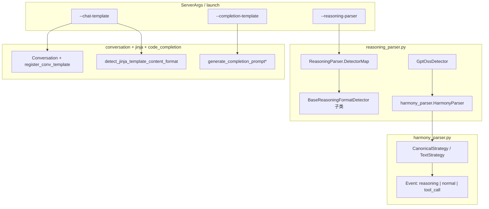

# `srt/parser` — 推理流解析、Harmony、对话模板与 FIM 补全

## Summary

[`python/sglang/srt/parser/`](d:\design\sglang\python\sglang\srt\parser) 共 **5** 个 `.py` 文件：① [`reasoning_parser.py`](d:\design\sglang\python\sglang\srt\parser\reasoning_parser.py) 从模型增量输出中拆分「推理 / 正文」；② [`harmony_parser.py`](d:\design\sglang\python\sglang\srt\parser\harmony_parser.py) 解析 GPT-OSS / Harmony 风格 `<|channel|>...` 流；③ [`conversation.py`](d:\design\sglang\python\sglang\srt\parser\conversation.py) 内置 FastChat 系对话模板注册表与 `Conversation`/`SeparatorStyle`；④ [`jinja_template_utils.py`](d:\design\sglang\python\sglang\srt\parser\jinja_template_utils.py) 对 tokenizer 的 Jinja `chat_template` 做 **string vs openai 内容格式** 检测与消息预处理；⑤ [`code_completion_parser.py`](d:\design\sglang\python\sglang\srt\parser\code_completion_parser.py) 为代码补全构造 FIM（fill-in-middle）串。

CLI 上，[`--reasoning-parser`](d:\design\sglang\python\sglang\srt\server_args.py) 的 `choices` 直接绑定 [`ReasoningParser.DetectorMap`](d:\design\sglang\python\sglang\srt\parser\reasoning_parser.py)；[`--chat-template`](d:\design\sglang\python\sglang\srt\server_args.py) / [`--completion-template`](d:\design\sglang\python\sglang\srt\server_args.py) 由 [`TemplateManager`](d:\design\sglang\python\sglang\srt\managers\template_manager.py) 与 OpenAI 入口消费。

> synthesis: 目录名 `parser` 在语义上覆盖 **流式输出解析**（reasoning / harmony）与 **请求侧 prompt 拼装**（conversation / FIM / Jinja 辅助），更像「OpenAI 兼容层附近的文本与模板工具箱」，而非单一语法解析器子系统。

## Sources

| 主题 | 锚点 |
|---|---|
| 推理解析与分派 | [reasoning_parser.py](d:\design\sglang\python\sglang\srt\parser\reasoning_parser.py)（`StreamingParseResult` L7-16；`BaseReasoningFormatDetector` L19-174；`ReasoningParser` / `DetectorMap` L506-535） |
| Harmony 流 | [harmony_parser.py](d:\design\sglang\python\sglang\srt\parser\harmony_parser.py)（`Event`/`Token` L6-21；`HarmonyParser` L501-588；`CanonicalStrategy` L123-416；`TextStrategy` L419-498） |
| 对话模板 | [conversation.py](d:\design\sglang\python\sglang\srt\parser\conversation.py)（`SeparatorStyle` L41-69；`Conversation` L72-398；`chat_templates` / `register_conv_template` L481-493） |
| Jinja 辅助 | [jinja_template_utils.py](d:\design\sglang\python\sglang\srt\parser\jinja_template_utils.py)（`detect_jinja_template_content_format` L81-120；`process_content_for_template_format` L123-230） |
| FIM 补全 | [code_completion_parser.py](d:\design\sglang\python\sglang\srt\parser\code_completion_parser.py)（`CompletionTemplate` / `FimPosition` L27-51；注册 L109-137） |
| Server CLI | [server_args.py](d:\design\sglang\python\sglang\srt\server_args.py)（字段 L435-441；`--reasoning-parser` L4819-4825；`--chat-template` / `--completion-template` L4789-4806） |
| 模板加载集成 | [template_manager.py](d:\design\sglang\python\sglang\srt\managers\template_manager.py)（import L28-42） |

## Architecture / Data flow

- **推理分派**：[`ReasoningParser.__init__`](d:\design\sglang\python\sglang\srt\parser\reasoning_parser.py) 用 `model_type.lower()` 查表 [`DetectorMap`](d:\design\sglang\python\sglang\srt\parser\reasoning_parser.py)，构造对应 detector（[L537-573](d:\design\sglang\python\sglang\srt\parser\reasoning_parser.py)）。
- **GPT-OSS 路径**：[`GptOssDetector`](d:\design\sglang\python\sglang\srt\parser\reasoning_parser.py) 委托 [`HarmonyParser`](d:\design\sglang\python\sglang\srt\parser\harmony_parser.py) 将流拆成 `reasoning` / `normal` / `tool_call` 事件（[reasoning_parser.py L327-390](d:\design\sglang\python\sglang\srt\parser\reasoning_parser.py)）。
- **模板**：[`TemplateManager`](d:\design\sglang\python\sglang\srt\managers\template_manager.py) 聚合 `conversation`、`code_completion_parser`、`jinja_template_utils`（[L28-42](d:\design\sglang\python\sglang\srt\managers\template_manager.py)）。

## File inventory（5 文件）

| 文件 | 行数（约） | 职责摘要 |
|---|---|---|
| [reasoning_parser.py](d:\design\sglang\python\sglang\srt\parser\reasoning_parser.py) | ~586 | `StreamingParseResult`；`BaseReasoningFormatDetector` + 多模型 detector；[`ReasoningParser`](d:\design\sglang\python\sglang\srt\parser\reasoning_parser.py) 门面 |
| [harmony_parser.py](d:\design\sglang\python\sglang\srt\parser\harmony_parser.py) | ~589 | Harmony 词法 `iter_tokens`；`CanonicalStrategy` / `TextStrategy`；[`HarmonyParser.parse`](d:\design\sglang\python\sglang\srt\parser\harmony_parser.py) |
| [conversation.py](d:\design\sglang\python\sglang\srt\parser\conversation.py) | ~1158 | `SeparatorStyle`、`Conversation`、`chat_templates`、`register_conv_template`、大量内置模板 |
| [jinja_template_utils.py](d:\design\sglang\python\sglang\srt\parser\jinja_template_utils.py) | ~231 | Jinja AST 检测 `openai` vs `string`；多模态 content 归一 |
| [code_completion_parser.py](d:\design\sglang\python\sglang\srt\parser\code_completion_parser.py) | ~139 | `CompletionTemplate`、FIM 拼接、全局 `completion_template_name` |

## `reasoning_parser.py`

### 基类与结果类型

- [`StreamingParseResult`](d:\design\sglang\python\sglang\srt\parser\reasoning_parser.py)：`normal_text` / `reasoning_text`（[L7-16](d:\design\sglang\python\sglang\srt\parser\reasoning_parser.py)）。
- [`BaseReasoningFormatDetector`](d:\design\sglang\python\sglang\srt\parser\reasoning_parser.py)：一次性 [`detect_and_parse`](d:\design\sglang\python\sglang\srt\parser\reasoning_parser.py) 与流式 [`parse_streaming_increment`](d:\design\sglang\python\sglang\srt\parser\reasoning_parser.py)（[L55-174](d:\design\sglang\python\sglang\srt\parser\reasoning_parser.py)）。构造参数含 `think_start_token`、`think_end_token`、`force_reasoning`、`stream_reasoning`、`tool_start_token`、`continue_final_message`（[L22-30](d:\design\sglang\python\sglang\srt\parser\reasoning_parser.py)）。

### 具体 Detector 子类（共 **10** 个，均继承 `BaseReasoningFormatDetector`）

| # | 类名 | 锚点 |
|---|------|------|
| 1 | `DeepSeekR1Detector` | [L177-214](d:\design\sglang\python\sglang\srt\parser\reasoning_parser.py) |
| 2 | `Qwen3Detector` | [L217-247](d:\design\sglang\python\sglang\srt\parser\reasoning_parser.py) |
| 3 | `KimiDetector` | [L250-273](d:\design\sglang\python\sglang\srt\parser\reasoning_parser.py) |
| 4 | `KimiK2Detector` | [L276-301](d:\design\sglang\python\sglang\srt\parser\reasoning_parser.py) |
| 5 | `Glm45Detector` | [L304-324](d:\design\sglang\python\sglang\srt\parser\reasoning_parser.py) |
| 6 | `GptOssDetector` | [L327-390](d:\design\sglang\python\sglang\srt\parser\reasoning_parser.py) |
| 7 | `MiniMaxAppendThinkDetector` | [L393-423](d:\design\sglang\python\sglang\srt\parser\reasoning_parser.py) |
| 8 | `Nemotron3Detector` | [L426-455](d:\design\sglang\python\sglang\srt\parser\reasoning_parser.py) |
| 9 | `MistralDetector` | [L458-482](d:\design\sglang\python\sglang\srt\parser\reasoning_parser.py) |
| 10 | `Gemma4Detector` | [L485-503](d:\design\sglang\python\sglang\srt\parser\reasoning_parser.py) |

### `DetectorMap` → CLI `--reasoning-parser` 字符串

[`ReasoningParser.DetectorMap`](d:\design\sglang\python\sglang\srt\parser\reasoning_parser.py) 含 **17** 个键（与 [`server_args.py` `choices=list(ReasoningParser.DetectorMap.keys())`](d:\design\sglang\python\sglang\srt\server_args.py) 一致）：

`deepseek-r1`、`deepseek-v3`、`glm45`、`gpt-oss`、`kimi`、`kimi_k2`、`mimo`、`qwen3`、`qwen3-thinking`、`minimax`、`minimax-append-think`、`step3`、`step3p5`、`mistral`、`nemotron_3`、`interns1`、`gemma4`（[L517-535](d:\design\sglang\python\sglang\srt\parser\reasoning_parser.py)）。

[`ReasoningParser.__init__`](d:\design\sglang\python\sglang\srt\parser\reasoning_parser.py) 对 `qwen3-thinking` / `gpt-oss` / `minimax` **强制** `force_reasoning = True`（[L551-553](d:\design\sglang\python\sglang\srt\parser\reasoning_parser.py)）。

### 流式状态机要点

- **缓冲区**：[`_buffer`](d:\design\sglang\python\sglang\srt\parser\reasoning_parser.py) 累加 chunk；若当前文本是 `think_start_text` / `think_end_token` / `tool_start_token` 的**真前缀**，则返回空结果以等待更多字节（[L119-127](d:\design\sglang\python\sglang\srt\parser\reasoning_parser.py)）。
- **起始标签**：首次见到 `think_start_token + think_start_self_label` 时去掉起始标签并进入推理态（[L129-133](d:\design\sglang\python\sglang\srt\parser\reasoning_parser.py)）。
- **结束标签**：推理态下若出现 `think_end_token`，截断推理正文、清空缓冲，余下为 `normal_text`（[L136-147](d:\design\sglang\python\sglang\srt\parser\reasoning_parser.py)）。
- **工具打断**：若配置了 `tool_start_token`，可在结束标签前将后续划给 `normal_text`（[L151-161](d:\design\sglang\python\sglang\srt\parser\reasoning_parser.py)）。
- **无推理块**：若未进入 `_in_reasoning`，整段作为 `normal_text` 发出并清空缓冲（[L169-172](d:\design\sglang\python\sglang\srt\parser\reasoning_parser.py)）。

## `harmony_parser.py`（GPT-OSS / Harmony 格式）

### 依赖

- 文件 **未** `import openai_harmony`：实现为纯 Python 的标记扫描与策略解析（全文见 [harmony_parser.py](d:\design\sglang\python\sglang\srt\parser\harmony_parser.py)）。

### 数据结构

- [`Event`](d:\design\sglang\python\sglang\srt\parser\harmony_parser.py)：`event_type`（如 `reasoning` / `normal` / `tool_call`）、`content`、`raw_text`（[L6-12](d:\design\sglang\python\sglang\srt\parser\harmony_parser.py)）。
- [`Token`](d:\design\sglang\python\sglang\srt\parser\harmony_parser.py)：`type` / `start` / `end`（[L15-21](d:\design\sglang\python\sglang\srt\parser\harmony_parser.py)）。

### Channel 与事件

[`CanonicalStrategy._extract_channel_type`](d:\design\sglang\python\sglang\srt\parser\harmony_parser.py) 识别 `analysis` / `commentary` / `final`（[L246-258](d:\design\sglang\python\sglang\srt\parser\harmony_parser.py)）。[`_parse_block`](d:\design\sglang\python\sglang\srt\parser\harmony_parser.py) 将 `analysis`+`<|end|>` 归为 `reasoning`，`commentary` 多为 `normal`，`final` 在 `<|return|>` 等处结束（[L310-360](d:\design\sglang\python\sglang\srt\parser\harmony_parser.py)）；`<|call|>` 可产生 `tool_call` 并带 `raw_text`（[L339-349](d:\design\sglang\python\sglang\srt\parser\harmony_parser.py)）。

### 流式策略选择

[`HarmonyParser.parse`](d:\design\sglang\python\sglang\srt\parser\harmony_parser.py)：缓冲直到判定 `CanonicalStrategy`（含 `<|channel|>` / `<|start|>`）或 `TextStrategy`（正则匹配 `analysis|commentary|assistantfinal`）（[L514-528](d:\design\sglang\python\sglang\srt\parser\harmony_parser.py)）。

### 与 function_call 的复用

[`sglang.srt.function_call.gpt_oss_detector.GptOssDetector`](d:\design\sglang\python\sglang\srt\function_call\gpt_oss_detector.py) 单独 `import HarmonyParser` 做工具调用检测（[L14-31](d:\design\sglang\python\sglang\srt\function_call\gpt_oss_detector.py)），与 `reasoning_parser.GptOssDetector` 职责不同（推理拆分 vs 工具探测）。

## `conversation.py`

- **谱系**：文件头标注 *Adapted from* [FastChat `conversation.py`](https://github.com/lm-sys/FastChat/blob/main/fastchat/conversation.py)（[L26-27](d:\design\sglang\python\sglang\srt\parser\conversation.py)）。多模态补全逻辑旁注 *adapted from* vLLM `chat_utils.py`（[L564-565](d:\design\sglang\python\sglang\srt\parser\conversation.py)）。
- [`SeparatorStyle`](d:\design\sglang\python\sglang\srt\parser\conversation.py)：`IntEnum`，含 `LLAMA2`/`LLAMA3`/`CHATML`/`DeepSeekVL2` 等（[L41-69](d:\design\sglang\python\sglang\srt\parser\conversation.py)）。
- [`Conversation`](d:\design\sglang\python\sglang\srt\parser\conversation.py)：`dataclass`，[`get_prompt`](d:\design\sglang\python\sglang\srt\parser\conversation.py) 按 `sep_style` 分支（[L107-398](d:\design\sglang\python\sglang\srt\parser\conversation.py)）。
- **注册表**：全局 [`chat_templates`](d:\design\sglang\python\sglang\srt\parser\conversation.py) + [`register_conv_template`](d:\design\sglang\python\sglang\srt\parser\conversation.py)（[L481-493](d:\design\sglang\python\sglang\srt\parser\conversation.py)）；[`matching_function_registry`](d:\design\sglang\python\sglang\srt\parser\conversation.py) + [`get_conv_template_by_model_path`](d:\design\sglang\python\sglang\srt\parser\conversation.py)（[L500-505](d:\design\sglang\python\sglang\srt\parser\conversation.py)）。
- **内置模板数量**：源码中顶格 `register_conv_template(` 共 **28** 次注册调用。

## `jinja_template_utils.py`

- **谱系**：注释说明思路来自 vLLM `chat_utils` 的模板 AST 检测（[L20-25](d:\design\sglang\python\sglang\srt\parser\jinja_template_utils.py)）。
- [`detect_jinja_template_content_format`](d:\design\sglang\python\sglang\srt\parser\jinja_template_utils.py)：多模态关键字短路为 `openai`；否则解析 Jinja AST，若存在对 `message['content']` 的 `for` 循环则 `openai`，否则 `string`（[L81-120](d:\design\sglang\python\sglang\srt\parser\jinja_template_utils.py)）。
- [`process_content_for_template_format`](d:\design\sglang\python\sglang\srt\parser\jinja_template_utils.py)：按格式压平或保留结构化 content，并抽取 image/video/audio 到并行列表（[L123-230](d:\design\sglang\python\sglang\srt\parser\jinja_template_utils.py)）。

> [!todo] VERIFY: ~~用户提纲中「tool_choice rendering」在本文件 **未出现**；若指 OpenAI 入口其它模块，应另立锚点。~~
> **RESOLVED 2026-04-19**: 已 grep 核对，[`jinja_template_utils.py`](d:\design\sglang\python\sglang\srt\parser\jinja_template_utils.py) 全文对 `tool_choice` **0 命中**。`tool_choice` 渲染发生在 OpenAI 入口侧（[`entrypoints/openai/serving_chat.py`](d:\design\sglang\python\sglang\srt\entrypoints\openai\serving_chat.py)，与 [`function_call.md`](function_call.md) 主述一致），不属本模块职责。

## `code_completion_parser.py`（FIM）

- [`FimPosition`](d:\design\sglang\python\sglang\srt\parser\code_completion_parser.py)：`MIDDLE` | `END`（[L27-31](d:\design\sglang\python\sglang\srt\parser\code_completion_parser.py)）。
- [`generate_completion_prompt`](d:\design\sglang\python\sglang\srt\parser\code_completion_parser.py)：按 `fim_position` 拼接 `begin|middle|end`（[L93-106](d:\design\sglang\python\sglang\srt\parser\code_completion_parser.py)）。
- **内置三套**（[`register_completion_template`](d:\design\sglang\python\sglang\srt\parser\code_completion_parser.py)）：

| name | begin | middle | end | position |
|------|-------|--------|-----|----------|
| `deepseek_coder` | `<｜fim▁begin｜>` | `<｜fim▁hole｜>` | `<｜fim▁end｜>` | `MIDDLE`（[L109-116](d:\design\sglang\python\sglang\srt\parser\code_completion_parser.py)） |
| `star_coder` | `<fim_prefix>` | `<fim_middle>` | `<fim_suffix>` | `END`（[L120-127](d:\design\sglang\python\sglang\srt\parser\code_completion_parser.py)） |
| `qwen_coder` | `<\|fim_prefix\|>` | `<\|fim_middle\|>` | `<\|fim_suffix\|>` | `END`（[L130-137](d:\design\sglang\python\sglang\srt\parser\code_completion_parser.py)） |

- **CLI 与加载**：[`--completion-template`](d:\design\sglang\python\sglang\srt\server_args.py) 默认 `None`（[L437](d:\design\sglang\python\sglang\srt\server_args.py)、[L4802-4806](d:\design\sglang\python\sglang\srt\server_args.py)）；运行时由 [`TemplateManager.load_completion_template`](d:\design\sglang\python\sglang\srt\managers\template_manager.py) 与内置名 / JSON 文件路径解析。

## CLI / config 字段摘要

| 字段 / 参数 | 默认 | 锚点 |
|-------------|------|------|
| `chat_template` / `--chat-template` | `None` | [L435](d:\design\sglang\python\sglang\srt\server_args.py)、[L4789-4793](d:\design\sglang\python\sglang\srt\server_args.py) |
| `hf_chat_template_name` / `--hf-chat-template-name` | `None` | [L436](d:\design\sglang\python\sglang\srt\server_args.py)、[L4795-4800](d:\design\sglang\python\sglang\srt\server_args.py) |
| `completion_template` / `--completion-template` | `None` | [L437](d:\design\sglang\python\sglang\srt\server_args.py)、[L4802-4806](d:\design\sglang\python\sglang\srt\server_args.py) |
| `reasoning_parser` / `--reasoning-parser` | `None`；`choices=DetectorMap.keys()` | [L440](d:\design\sglang\python\sglang\srt\server_args.py)、[L4819-4824](d:\design\sglang\python\sglang\srt\server_args.py) |
| `tool_call_parser` / `--tool-call-parser` | `None`；choices 来自 `FunctionCallParser` | [L441](d:\design\sglang\python\sglang\srt\server_args.py)、[L4826-4832](d:\design\sglang\python\sglang\srt\server_args.py) |

## §跨子系统引用（§5 step 3）

### 1. 跨语言绑定（C++ / sgl-kernel）

- 在 `d:\design\sglang\sgl-kernel\` 下对 `*.cc`/`*.cpp`/`*.h`/`*.hpp`/`*.cu`/`*.cuh` 检索与 **`srt/parser` 推理 / Harmony 类名**相关的独立符号：**无匹配**（0 命中）。

### 2. 协作伙伴（`from sglang.srt.parser` / 子模块，不含 `parser/` 自身）

| 模块 | 行 | 导入内容 |
|------|-----|----------|
| [server_args.py](d:\design\sglang\python\sglang\srt\server_args.py) | 35 | `ReasoningParser` |
| [managers/template_manager.py](d:\design\sglang\python\sglang\srt\managers\template_manager.py) | 28-42 | `code_completion_parser` + `conversation` + `jinja_template_utils` |
| [managers/scheduler.py](d:\design\sglang\python\sglang\srt\managers\scheduler.py) | 207 | `ReasoningParser` |
| [entrypoints/openai/serving_chat.py](d:\design\sglang\python\sglang\srt\entrypoints\openai\serving_chat.py) | 52-54 | `generate_chat_conv`、`process_content_for_template_format`、`ReasoningParser` |
| [entrypoints/openai/serving_completions.py](d:\design\sglang\python\sglang\srt\entrypoints\openai\serving_completions.py) | 30-31 | `generate_completion_prompt_from_request` |
| [entrypoints/openai/serving_responses.py](d:\design\sglang\python\sglang\srt\entrypoints\openai\serving_responses.py) | 60 | `ReasoningParser` |
| [entrypoints/openai/serving_embedding.py](d:\design\sglang\python\sglang\srt\entrypoints\openai\serving_embedding.py) | 19 | `generate_embedding_convs` |
| [entrypoints/http_server.py](d:\design\sglang\python\sglang\srt\entrypoints\http_server.py) | 161 | `ReasoningParser` |
| [function_call/gpt_oss_detector.py](d:\design\sglang\python\sglang\srt\function_call\gpt_oss_detector.py) | 14 | `HarmonyParser` |
| [parser/reasoning_parser.py](d:\design\sglang\python\sglang\srt\parser\reasoning_parser.py) | 4 | `HarmonyParser` |

- **`managers/io_struct.py` / `entrypoints/engine.py`**：在 `d:\design\sglang\python\sglang\srt\` 内对 `from sglang.srt.parser` / `sglang.srt.parser` 检索：**0 命中**（已核对）。

### 3. 配置 / 共享结构

- 无独立 `parser` YAML；行为由 `ServerArgs` 字段 + `TemplateManager` 加载路径驱动。

### 4. 测试覆盖（`d:\design\sglang\test\`）

| 模式 | 命中文件数 | 说明 |
|------|---------------------|------|
| `reasoning_parser` | **8** | 含 `registered/unit/parser/test_reasoning_parser.py`、`test_reasoning_content_without_parser.py` 等 |
| `harmony_parser` | **1** | `registered/unit/parser/test_harmony_parser.py` |
| `sglang.srt.parser.conversation` 直接 import | **3** | `test_vlm_input_format.py`、`test_conversation.py`、`manual/test_vlm_accuracy.py` |

### 5. 文档（`d:\design\sglang\docs\`）

- **Reasoning**：[`docs/basic_usage/openai_api_completions.ipynb`](d:\design\sglang\docs\basic_usage\openai_api_completions.ipynb)、[`docs/advanced_features/separate_reasoning.ipynb`](d:\design\sglang\docs\advanced_features\separate_reasoning.ipynb)、[`docs/supported_models/text_generation/generative_models.md`](d:\design\sglang\docs\supported_models\text_generation\generative_models.md)。
- **Chat template**：[`docs/references/custom_chat_template.md`](d:\design\sglang\docs\references\custom_chat_template.md)、[`docs/supported_models/extending/support_new_models.md`](d:\design\sglang\docs\supported_models\extending\support_new_models.md)。
- **平台子集**：[`docs/platforms/ascend/ascend_npu_support_features.md`](d:\design\sglang\docs\platforms\ascend\ascend_npu_support_features.md)（列举少于源码 `DetectorMap` 全量 — 见 Notes）。

## Lineage / 包边界说明

| 文件 | 标注 |
|------|------|
| [conversation.py](d:\design\sglang\python\sglang\srt\parser\conversation.py) | *Adapted from FastChat*（[L26-27](d:\design\sglang\python\sglang\srt\parser\conversation.py)）；多模态文本自 vLLM 思路（[L564-565](d:\design\sglang\python\sglang\srt\parser\conversation.py)） |
| [jinja_template_utils.py](d:\design\sglang\python\sglang\srt\parser\jinja_template_utils.py) | 注释指向 vLLM `chat_utils` AST 检测（[L20-22](d:\design\sglang\python\sglang\srt\parser\jinja_template_utils.py)） |
| [code_completion_parser.py](d:\design\sglang\python\sglang\srt\parser\code_completion_parser.py) | SGLang Apache 头（[L1-13](d:\design\sglang\python\sglang\srt\parser\code_completion_parser.py)） |
| [harmony_parser.py](d:\design\sglang\python\sglang\srt\parser\harmony_parser.py) | 无 FastChat/vLLM 文件头；自洽实现 |

**边界归纳**：`parser/` 同时承担 **解码输出侧**（reasoning、harmony）与 **编码请求侧**（conversation、FIM、Jinja 预处理）。若需单一主题名，可称 *「OpenAI 兼容 API 的文本与模板适配层」*；否则可如实标为 **能力聚合目录**。

## Increment 2026-08-18 (06f32bab → f7101b0a)

> [!warning] CONTRADICTION（**重大补漏**：本页 2026-04-19 后从未随增量复核，正文多处计数在 pin `06f32bab` 时就已失效）：
> - 「5 个 `.py`」→ pin 时已是 **9 个**（`git ls-tree 06f32bab` 核实）：新增 [inkling_renderer.py](d:\design\sglang\python\sglang\srt\parser\inkling_renderer.py)（332 行）、[inkling_tokenizer.py](d:\design\sglang\python\sglang\srt\parser\inkling_tokenizer.py)（105 行）、[template_detection.py](d:\design\sglang\python\sglang\srt\parser\template_detection.py)（781 行），且 `managers/template_manager.py` 已**迁入本目录**为 [parser/template_manager.py](d:\design\sglang\python\sglang\srt\parser\template_manager.py)（上游 #26052 "Move template manager files under parser"）——本页正文所有指向 `managers\template_manager.py` 的链接均已死链。
> - detector 子类「10 个」→ pin 时已 21 个、HEAD 现为 **22 个**；`DetectorMap`「17 键」→ pin 时已 25 键、HEAD 现为 **26 键**（[reasoning_parser.py:L1875-1902](d:\design\sglang\python\sglang\srt\parser\reasoning_parser.py)）。
> - 正文 `reasoning_parser.py` 小节的全部细粒度行号锚点（基于 ~586 行的 4 月版文件；HEAD 已 1993 行）**全部失效**，整节需按 ingest 流程重做；本次增量仅修正计数并锚定新版类表首行：`BaseReasoningFormatDetector` [L62](d:\design\sglang\python\sglang\srt\parser\reasoning_parser.py)、`DeepSeekR1Detector` [L313](d:\design\sglang\python\sglang\srt\parser\reasoning_parser.py)、`MuseGlimmerDetector` [L1653](d:\design\sglang\python\sglang\srt\parser\reasoning_parser.py)、`DetectorMap` [L1875](d:\design\sglang\python\sglang\srt\parser\reasoning_parser.py)。

本期（`06f32bab..f7101b0a`）parser/ 自身的真实增量（`git log 06f32bab..HEAD -- python/sglang/srt/parser/` 共 3 commits）：

- **Muse Glimmer 模型族接入**（上游 fde9ad2531 #34262）：新增 `MuseGlimmerDetector`（[reasoning_parser.py:L1653](d:\design\sglang\python\sglang\srt\parser\reasoning_parser.py)），`DetectorMap` 新增键 `"muse"`（[L1887](d:\design\sglang\python\sglang\srt\parser\reasoning_parser.py)）；配套 detector/format 文件落在 `function_call/`（见 [function_call.md](function_call.md)）。
- **DeepSeek-V4 流式解析 chunk-invariant 修复**（上游 5899674504 #34458）：`DeepSeekV4Detector`（[reasoning_parser.py:L1147](d:\design\sglang\python\sglang\srt\parser\reasoning_parser.py)）的 reasoning/tool-call 流式解析改为分块不变；`reasoning_parser.py` 本期 +271/-17 行。
- [jinja_template_utils.py](d:\design\sglang\python\sglang\srt\parser\jinja_template_utils.py) 仅 +1 行（随 VLM 预处理缓存 e8c7dddfa0 #34398 的边缘改动）。

synthesis: 本模块目录本身在本期是低 churn（3 commits），但页面欠账来自 4 月至 8 月 pin 之间的漂移；已标 `status: stale`，待对 `reasoning_parser.py` / `template_detection.py` / `inkling_*` 重跑 ingest。

## Notes / Caveats

> [!warning] CONTRADICTION（同名类型）：[`sglang.srt.parser.reasoning_parser.StreamingParseResult`](d:\design\sglang\python\sglang\srt\parser\reasoning_parser.py) 与 [`sglang.srt.function_call.core_types.StreamingParseResult`](d:\design\sglang\python\sglang\srt\function_call\core_types.py) 同名异类；阅读调用链时需按模块区分。

> [!warning] CONTRADICTION（文档枚举 ⊄ 源码）：Ascend 文档 [`ascend_npu_support_features.md`](d:\design\sglang\docs\platforms\ascend\ascend_npu_support_features.md) 中 `--reasoning-parser` 列出的选项 **少于** [`ReasoningParser.DetectorMap`](d:\design\sglang\python\sglang\srt\parser\reasoning_parser.py) 全量 17 键；以源码 `choices=` 为准。

> [!todo] VERIFY: [`Gemma4Detector`](d:\design\sglang\python\sglang\srt\parser\reasoning_parser.py) 使用 `<|channel>` 与 `<channel|>` 作为起止标记（[L495-502](d:\design\sglang\python\sglang\srt\parser\reasoning_parser.py)）是否与上游 Gemma4 真实输出一致。

> [!todo] VERIFY: ~~`argparse` 中 `--reasoning-parser` 的 `choices` 为 17 个字符串而 `default=None` 不在列表内；需确认启动器是否始终显式传入或使用了自定义处理。~~
> **RESOLVED 2026-04-19**: 这是 `argparse` 标准/合法行为—— `default` **不**会被 `choices` 校验，仅当用户显式传入参数时才校验值。[`server_args.py:4819-4824`](d:\design\sglang\python\sglang\srt\server_args.py) 设 `default=ServerArgs.reasoning_parser`（即 `None`），用户不指定 `--reasoning-parser` 时整体 reasoning 路径不启用；[`ReasoningParser.__init__`](d:\design\sglang\python\sglang\srt\parser\reasoning_parser.py:537-549) 在拿到 `model_type` 后才走 `DetectorMap.get`。无需自定义处理。

## 数字核对

| 项 | 值（2026-04-19） | 值（2026-08-18 @ f7101b0a） |
|---|---|---|
| `parser/` 下 `.py` 文件数 | ~~5~~ | **9**（+inkling_renderer / inkling_tokenizer / template_detection / template_manager） |
| detector 子类数（`class *Detector`） | ~~10~~ | **22**（[reasoning_parser.py](d:\design\sglang\python\sglang\srt\parser\reasoning_parser.py) grep 核实） |
| `--reasoning-parser` 的 `choices` 个数（=`DetectorMap` 键） | ~~17~~ | **26**（[L1875-1902](d:\design\sglang\python\sglang\srt\parser\reasoning_parser.py)） |
| `conversation.py` 中 `register_conv_template(` 调用次数 | 28 | **28**（未变；文件现 1237 行） |
| `reasoning_parser.py` 行数 | ~586 | **1993** |

## See also

- [sglang/modules/managers.md](managers.md) — `TemplateManager` 与模板加载
- [sglang/modules/connector.md](connector.md) — 命名与边界对照范例
- [sglang/modules/function_call.md](function_call.md) — Harmony / 输出解析另一消费者
- 上游文档：[`d:\design\sglang\docs\references\custom_chat_template.md`](d:\design\sglang\docs\references\custom_chat_template.md)、[`d:\design\sglang\docs\basic_usage\openai_api_completions.ipynb`](d:\design\sglang\docs\basic_usage\openai_api_completions.ipynb)
