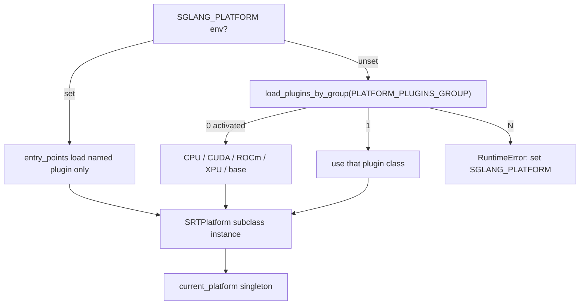

# `srt/platforms` — 硬件平台抽象与 `current_platform`

## Summary

[`python/sglang/srt/platforms/`](d:\design\sglang\python\sglang\srt\platforms) **7** 个 `.py`，提供 **`current_platform` 惰性单例** 与 `SRTPlatform` 抽象：设备查询（memory/capability/sync）、SRT 子系统工厂（attention backend、graph runner、KV pool、allocator、compile backend）、能力标志（fp8 / cuda graph）。内置 CUDA/ROCm/CPU/XPU；OOT 平台经 entry_points 组 `sglang.srt.platforms`（与 [`plugins`](plugins.md) 协作）。

> synthesis: 与 [`hardware_backend/`](hardware_backend.md)（npu/musa/mlx 具体 runner/kernel）分工不同——`platforms` 是 **发现 + 能力/工厂接口**；`hardware_backend` 是 **设备特化实现落点**。

## Sources

| 文件 | 说明 |
|---|---|
| [`__init__.py`](d:\design\sglang\python\sglang\srt\platforms\__init__.py) | `_resolve_platform` + lazy `current_platform` |
| [`interface.py`](d:\design\sglang\python\sglang\srt\platforms\interface.py) | `SRTPlatform(DeviceMixin)` |
| [`device_mixin.py`](d:\design\sglang\python\sglang\srt\platforms\device_mixin.py) | 共享设备操作 / `PlatformEnum` |
| [`cuda.py`](d:\design\sglang\python\sglang\srt\platforms\cuda.py) | `CudaDeviceMixin` + `CudaSRTPlatform` |
| [`rocm.py`](d:\design\sglang\python\sglang\srt\platforms\rocm.py) | `RocmSRTPlatform`（复用 CudaDeviceMixin） |
| [`cpu.py`](d:\design\sglang\python\sglang\srt\platforms\cpu.py) | `CpuSRTPlatform`（`SGLANG_USE_CPU_ENGINE=1`） |
| [`xpu.py`](d:\design\sglang\python\sglang\srt\platforms\xpu.py) | `XpuSRTPlatform` |

## Architecture / Data flow

发现逻辑（[`_resolve_platform`](d:\design\sglang\python\sglang\srt\platforms\__init__.py)，[L49-L150](d:\design\sglang\python\sglang\srt\platforms\__init__.py)）：

1. `SGLANG_PLATFORM` 已设 → 只 `ep.load()` 该插件；其它插件 **永不 import**（[L79-L106](d:\design\sglang\python\sglang\srt\platforms\__init__.py)）。
2. 未设 → 激活所有插件；0 个则按 CPU（显式 opt-in）→ CUDA → ROCm → XPU → base（[L121-L139](d:\design\sglang\python\sglang\srt\platforms\__init__.py)）；多个激活 → 必须设 env（[L145-L149](d:\design\sglang\python\sglang\srt\platforms\__init__.py)）。
3. `__getattr__("current_platform")` 惰性初始化（[L166-L173](d:\design\sglang\python\sglang\srt\platforms\__init__.py)）。

`SRTPlatform` 工厂/能力（[interface.py:26-119](d:\design\sglang\python\sglang\srt\platforms\interface.py)）：`apply_server_args_defaults`、`get_default_attention_backend`、`get_graph_runner_cls`、`get_*_kv_pool_cls`、`get_paged_allocator_cls`、`get_compile_backend`、`supports_fp8`、`support_cuda_graph` 等。

`CudaSRTPlatform`：`supports_fp8/support_cuda_graph/support_piecewise_cuda_graph` 均 True（[cuda.py:70-80](d:\design\sglang\python\sglang\srt\platforms\cuda.py)）。

## Key APIs / Entities

| 名称 | 位置 | 作用 |
|---|---|---|
| `current_platform` | [__init__.py:163-173](d:\design\sglang\python\sglang\srt\platforms\__init__.py) | 模块级惰性单例 |
| `SRTPlatform` | [interface.py:26+](d:\design\sglang\python\sglang\srt\platforms\interface.py) | OOT 应继承的基类 |
| `DeviceMixin` / `PlatformEnum` | [device_mixin.py](d:\design\sglang\python\sglang\srt\platforms\device_mixin.py) | 设备身份与基础 ops |
| `CudaSRTPlatform` | [cuda.py:70+](d:\design\sglang\python\sglang\srt\platforms\cuda.py) | 默认 in-tree CUDA |
| `RocmSRTPlatform` / `CpuSRTPlatform` / `XpuSRTPlatform` | 各文件 | 内置后端 |
| `PLATFORM_PLUGINS_GROUP` | [plugins/__init__.py:28](d:\design\sglang\python\sglang\srt\plugins\__init__.py) | `"sglang.srt.platforms"` |

## 使用方调用清单 / 跨子系统引用

1. **跨语言绑定**：`SRTPlatform` / `current_platform`：在 `d:\design\sglang\python\sglang\srt\` 全树无 C++ 绑定（Python 抽象层）。
2. **协作伙伴**（`from sglang.srt.platforms import current_platform` 广泛）：
   - [`utils/common.py`](d:\design\sglang\python\sglang\srt\utils\common.py)、[`utils/profile_utils.py`](d:\design\sglang\python\sglang\srt\utils\profile_utils.py)
   - [`weight_cache/daemon.py`](d:\design\sglang\python\sglang\srt\weight_cache\daemon.py) / [`protocol.py`](d:\design\sglang\python\sglang\srt\weight_cache\protocol.py)
   - [`plugins.load_plugins_by_group`](d:\design\sglang\python\sglang\srt\plugins\__init__.py)（平台发现）
   - 以及 model_executor / distributed / mem_cache 等（全树大量命中）
3. **配置 / env**：`SGLANG_PLATFORM`（[__init__.py:77](d:\design\sglang\python\sglang\srt\platforms\__init__.py)）；`SGLANG_USE_CPU_ENGINE`（[L41-L42](d:\design\sglang\python\sglang\srt\platforms\__init__.py)）。
4. **测试**：`platforms` / `current_platform`：本 checkout 无独立 `test/platforms*`；覆盖嵌在集成路径。
5. **doc**：`sglang.srt.platforms`：在 `d:\design\sglang\docs\` 全树 grep 0 命中。

## Notes / Caveats

- OOT 插件 `activate()` 返回 **fully-qualified class name 字符串**，再 `_load_platform_class`（[__init__.py:106](d:\design\sglang\python\sglang\srt\platforms\__init__.py)、[L153-L160](d:\design\sglang\python\sglang\srt\platforms\__init__.py)）。
- 多平台同时安装时必须设 `SGLANG_PLATFORM`，否则启动失败（[L145-L149](d:\design\sglang\python\sglang\srt\platforms\__init__.py)）。
- `hardware_backend`（NPU/MUSA/MLX）与本包并存——NPU 等可能以 OOT platform plugin + hardware_backend 子树组合出现。

## See also

- [sglang/modules/plugins.md](plugins.md)
- [sglang/modules/hardware_backend.md](hardware_backend.md)
- [sglang/modules/compilation.md](compilation.md)
- [sglang/modules/weight_cache.md](weight_cache.md)
- [sglang/overview.md](../overview.md)
