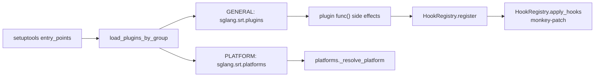

# `srt/plugins` — setuptools entry_points 插件框架与 HookRegistry

## Summary

[`python/sglang/srt/plugins/`](d:\design\sglang\python\sglang\srt\plugins) **2** 个 `.py`：统一发现 **硬件平台插件**（group `sglang.srt.platforms`）与 **通用插件**（group `sglang.srt.plugins`）；通用插件通过 [`HookRegistry`](d:\design\sglang\python\sglang\srt\plugins\hook_registry.py) 注册 BEFORE/AFTER/AROUND/REPLACE 钩子并 monkey-patch 目标。`load_plugins()` 幂等，应在每个进程早期调用（[`Engine`](d:\design\sglang\python\sglang\srt\entrypoints\engine.py)、[`Scheduler`](d:\design\sglang\python\sglang\srt\managers\scheduler.py)）。

## Sources

| 文件 | 说明 |
|---|---|
| [`__init__.py`](d:\design\sglang\python\sglang\srt\plugins\__init__.py) | `load_plugins_by_group` / `load_plugins` / group 常量 |
| [`hook_registry.py`](d:\design\sglang\python\sglang\srt\plugins\hook_registry.py) | `HookRegistry` / `HookType` / `HookSource` |

## Architecture / Data flow

- Groups（[__init__.py:27-29](d:\design\sglang\python\sglang\srt\plugins\__init__.py)）：`PLATFORM_PLUGINS_GROUP = "sglang.srt.platforms"`；`GENERAL_PLUGINS_GROUP = "sglang.srt.plugins"`。
- Whitelist：`SGLANG_PLUGINS` 逗号分隔限制加载哪些插件（[L51-L70](d:\design\sglang\python\sglang\srt\plugins\__init__.py)）。
- 当 `SGLANG_PLATFORM` 设定时，`_get_excluded_dists` 排除未选中平台包的 general hooks，避免拉硬件依赖（[L89-L100](d:\design\sglang\python\sglang\srt\plugins\__init__.py)、[L111-L127](d:\design\sglang\python\sglang\srt\plugins\__init__.py)）。
- `load_plugins()`：执行各 plugin func（带 `HookSource` contextvar）→ `HookRegistry.apply_hooks()`（[L103-L141](d:\design\sglang\python\sglang\srt\plugins\__init__.py)）；`_plugins_loaded` 防重入。
- `HookType`：BEFORE / AFTER / AROUND / REPLACE（[hook_registry.py:60-66](d:\design\sglang\python\sglang\srt\plugins\hook_registry.py)）。类 REPLACE 优先于方法钩子应用（[L153-L156](d:\design\sglang\python\sglang\srt\plugins\hook_registry.py)、[L168-L179](d:\design\sglang\python\sglang\srt\plugins\hook_registry.py)）。重复 REPLACE 打 warning，后者胜（[L119-L136](d:\design\sglang\python\sglang\srt\plugins\hook_registry.py)）。

## Key APIs / Entities

| 名称 | 位置 | 作用 |
|---|---|---|
| `load_plugins` | [__init__.py:103-141](d:\design\sglang\python\sglang\srt\plugins\__init__.py) | 加载 general plugins + apply hooks |
| `load_plugins_by_group` | [__init__.py:35-86](d:\design\sglang\python\sglang\srt\plugins\__init__.py) | 按 entry_point group 发现 |
| `PLATFORM_PLUGINS_GROUP` / `GENERAL_PLUGINS_GROUP` | [__init__.py:28-29](d:\design\sglang\python\sglang\srt\plugins\__init__.py) | 两组名字 |
| `HookRegistry.register` | [hook_registry.py:83-143](d:\design\sglang\python\sglang\srt\plugins\hook_registry.py) | 注册钩子 |
| `HookRegistry.apply_hooks` | [hook_registry.py:145-166](d:\design\sglang\python\sglang\srt\plugins\hook_registry.py) | 执行 monkey-patch |
| `HookType` / `HookSource` | [hook_registry.py:38-66](d:\design\sglang\python\sglang\srt\plugins\hook_registry.py) | 钩子类型与来源 |

## 使用方调用清单 / 跨子系统引用

1. **跨语言绑定**：`HookRegistry` / `load_plugins`：在 `d:\design\sglang\python\sglang\srt\` 全树 grep 无 C++ 命中。
2. **协作伙伴**：
   - [`Engine`](d:\design\sglang\python\sglang\srt\entrypoints\engine.py) `load_plugins()`（约 L232、L1064）
   - [`Scheduler`](d:\design\sglang\python\sglang\srt\managers\scheduler.py)（约 L4973）
   - [`platforms.__init__`](d:\design\sglang\python\sglang\srt\platforms\__init__.py) import `PLATFORM_PLUGINS_GROUP, load_plugins_by_group`（[L26](d:\design\sglang\python\sglang\srt\platforms\__init__.py)）
3. **配置 / env**：`SGLANG_PLUGINS`、`SGLANG_PLATFORM`（经 excluded_dists）。
4. **测试**：`HookRegistry`：在本 checkout 全树无独立 `test_plugins*` / `test_hook_registry*`。
5. **doc**：`HookRegistry` / `sglang.srt.plugins`：在 `d:\design\sglang\docs\` 全树 grep 0 命中。

> 注意：MoE dispatcher 的 `register_hook`（[`layers/moe/token_dispatcher`](d:\design\sglang\python\sglang\srt\layers\moe\token_dispatcher)）与本包 **无关**——那是 dispatcher 内部回调列表。

## Notes / Caveats

- 注册应在单线程 `load_plugins` 阶段完成（[hook_registry.py:73-75](d:\design\sglang\python\sglang\srt\plugins\hook_registry.py)）。
- Target 为 fully-qualified dotted path，例 `"sglang.srt.managers.scheduler.Scheduler.schedule"`（[L8-L21](d:\design\sglang\python\sglang\srt\plugins\hook_registry.py)）。
- 类只能配 `HookType.REPLACE`（[L112-L117](d:\design\sglang\python\sglang\srt\plugins\hook_registry.py)）。

## See also

- [sglang/modules/platforms.md](platforms.md)
- [sglang/modules/managers.md](managers.md)
- [sglang/entities/Engine.md](../entities/Engine.md)
- [sglang/overview.md](../overview.md)
