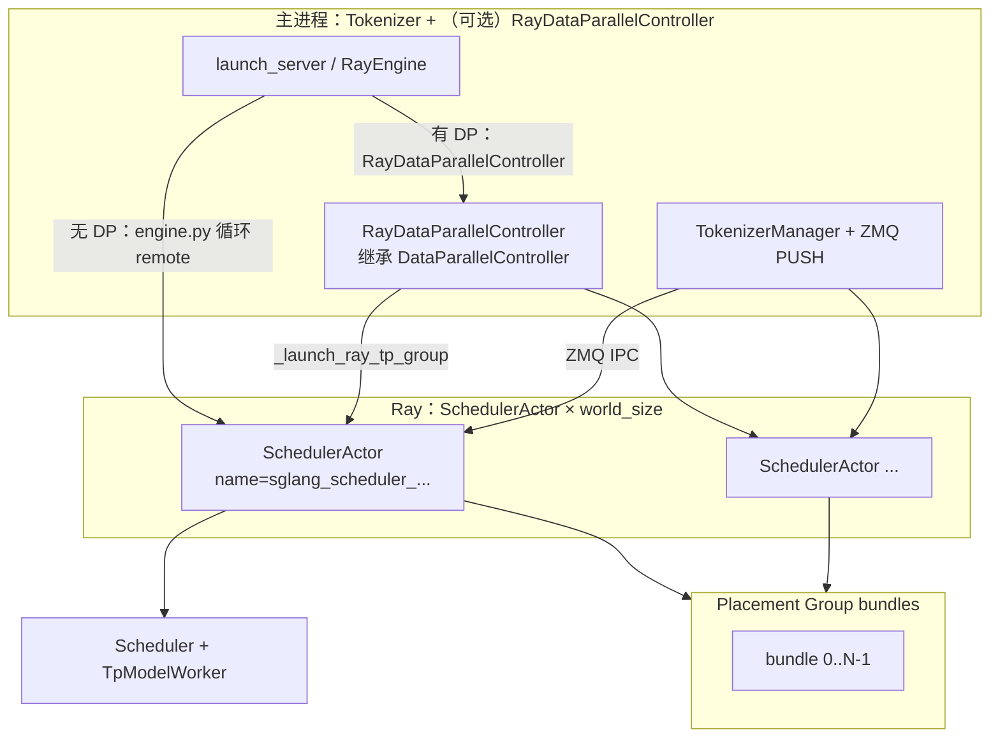

# `srt/ray` — Ray Placement Group + `SchedulerActor` 调度器编排

## Summary

[`srt/ray`](d:\design\sglang\python\sglang\srt\ray)（**5** 个 `.py`，约 29 KB；含包级 [`__init__.py`](d:\design\sglang\python\sglang\srt\ray\__init__.py) 仅导出 [`RayEngine`](d:\design\sglang\python\sglang\srt\ray\engine.py)）实现 SGLang 的 **Ray 集群调度器生命周期**：用 **Ray Actor** 替代默认 [`Engine`](d:\design\sglang\python\sglang\srt\entrypoints\engine.py) 中基于 `multiprocessing` 的 scheduler 子进程，同时 **保留 ZMQ** 作为 TokenizerManager ↔ Scheduler ↔ Detokenizer 的 IPC。核心 actor 为 [`SchedulerActor`](d:\design\sglang\python\sglang\srt\ray\scheduler_actor.py)（每 GPU 一个，内嵌完整 [`Scheduler`](d:\design\sglang\python\sglang\srt\managers\scheduler.py) + TpModelWorker 栈）。

**DP（`dp_size > 1`）** 路径用 [`RayDataParallelController`](d:\design\sglang\python\sglang\srt\ray\data_parallel_controller.py) **子类化** [`DataParallelController`](d:\design\sglang\python\sglang\srt\managers\data_parallel_controller.py)：父类仍在 **当前进程** 内跑 tokenizer 侧 DP 路由与 `event_loop`，但 **scheduler 侧进程** 改为批量创建的 `SchedulerActor`，而非 `mp.Process` 拉起的 `run_data_parallel_controller_process`。

**HTTP**：[`ray/http_server.py::launch_server`](d:\design\sglang\python\sglang\srt\ray\http_server.py) 调用 [`RayEngine._launch_subprocesses`](d:\design\sglang\python\sglang\srt\entrypoints\engine.py)（与离线 `RayEngine` 同源装配），再委托 [`entrypoints/http_server.py::_setup_and_run_http_server`](d:\design\sglang\python\sglang\srt\entrypoints\http_server.py) — 即 **完整 FastAPI HTTP 服务**；并非「仅 Python Engine API」。CLI 入口由 [`python/sglang/launch_server.py`](d:\design\sglang\python\sglang\launch_server.py) 在 [`server_args.use_ray`](d:\design\sglang\python\sglang\srt\server_args.py) 为真时 `import sglang.srt.ray.http_server.launch_server`。

> [!warning] CONTRADICTION（命名）：~~源码中 **不存在** `RayServingEngine`、`RayClusterClient` 等名称；Ray 侧仅 **`RayEngine` + `SchedulerActor` + `RayDataParallelController` + `launch_server` 包装**。~~
> **RESOLVED 2026-04-19**: 已源码确认——[`srt/ray/`](d:\design\sglang\python\sglang\srt\ray) 全树 grep `RayEngine` / `SchedulerActor` / `RayDataParallelController` 命中 5 个文件全部即本目录文件（[`engine.py`](d:\design\sglang\python\sglang\srt\ray\engine.py)、[`scheduler_actor.py`](d:\design\sglang\python\sglang\srt\ray\scheduler_actor.py)、[`data_parallel_controller.py`](d:\design\sglang\python\sglang\srt\ray\data_parallel_controller.py)、[`http_server.py`](d:\design\sglang\python\sglang\srt\ray\http_server.py)、[`__init__.py`](d:\design\sglang\python\sglang\srt\ray\__init__.py)）；`RayServingEngine` / `RayClusterClient` 全仓库 0 命中，确认不存在。

## Sources

| 区域 | 锚点 |
|---|---|
| `RayEngine` / Placement Group / TP 与 DP 分支 | [`engine.py:14-299`](d:\design\sglang\python\sglang\srt\ray\engine.py) |
| `SchedulerActor` | [`scheduler_actor.py:30-115`](d:\design\sglang\python\sglang\srt\ray\scheduler_actor.py) |
| `RayDataParallelController` | [`data_parallel_controller.py:38-247`](d:\design\sglang\python\sglang\srt\ray\data_parallel_controller.py) |
| Ray HTTP 启动 | [`http_server.py:26-69`](d:\design\sglang\python\sglang\srt\ray\http_server.py) |
| `Engine` 可覆盖钩子与 `_launch_scheduler_processes` 扩展点 | [`entrypoints/engine.py:157-162`](d:\design\sglang\python\sglang\srt\entrypoints\engine.py)、[`entrypoints/engine.py:521-534`](d:\design\sglang\python\sglang\srt\entrypoints\engine.py) |
| CLI 分支 `--use-ray` | [`launch_server.py:33-42`](d:\design\sglang\python\sglang\launch_server.py)、[`server_args.py:391`](d:\design\sglang\python\sglang\srt\server_args.py)、[`server_args.py:4548-4552`](d:\design\sglang\python\sglang\srt\server_args.py) |
| 手动集成测试 | [`test/manual/test_ray_engine.py`](d:\design\sglang\test\manual\test_ray_engine.py) |

## Architecture / Ray actor hierarchy

> synthesis: Ray 负责 **进程/资源放置与 GPU 绑定**；请求路径仍走 **ZMQ**（与注释一致：[`scheduler_actor.py:34-35`](d:\design\sglang\python\sglang\srt\ray\scheduler_actor.py)）。`RayEngine` 在无 DP 时直接按节点 bundle 起多个 `SchedulerActor`；有 DP 时先构造 **`RayDataParallelController`（非 Ray actor，主进程内）**，由其按 DP/TP 组批量起 actor 并把 `run_event_loop.remote()` 引用交给 `RaySchedulerInitResult.wait_for_completion`。

- **共址约束**：[`_find_engine_bundle`](d:\design\sglang\python\sglang\srt\ray\engine.py) 用临时 `@ray.remote` 任务探测各 bundle 的节点 IP，要求 **rank0 scheduler 与 Engine 同节点**（[`engine.py:45-72`](d:\design\sglang\python\sglang\srt\ray\engine.py)）。
- **Placement Group 自创建**：若 `ray.util.get_current_placement_group()` 为 `None`，按 `nnodes`、`gpus_per_node` 与 `STRICT_PACK`/`SPREAD` 策略创建（[`engine.py:101-128`](d:\design\sglang\python\sglang\srt\ray\engine.py)）。
- **Actor 选项**：`SchedulerActor.options(num_cpus=0, num_gpus=1, name=..., scheduling_strategy=PlacementGroupSchedulingStrategy(...))`（例如 [`engine.py:172-191`](d:\design\sglang\python\sglang\srt\ray\engine.py)、[`data_parallel_controller.py:184-206`](d:\design\sglang\python\sglang\srt\ray\data_parallel_controller.py)）。

## File inventory（5 `.py`）

| 文件 | 职责摘要 |
|---|---|
| [`__init__.py`](d:\design\sglang\python\sglang\srt\ray\__init__.py) | 导出 `RayEngine` |
| [`engine.py`](d:\design\sglang\python\sglang\srt\ray\engine.py) | `RayEngine(Engine)`：`_launch_scheduler_processes` / `shutdown`（`ray.kill` actors）；`RaySchedulerInitResult` |
| [`scheduler_actor.py`](d:\design\sglang\python\sglang\srt\ray\scheduler_actor.py) | `@ray.remote class SchedulerActor`：`Scheduler` 构造、`get_info`、`run_event_loop` |
| [`data_parallel_controller.py`](d:\design\sglang\python\sglang\srt\ray\data_parallel_controller.py) | `RayDataParallelController(DataParallelController)`：覆写 `launch_dp_schedulers` / `launch_dp_attention_schedulers`，`_launch_ray_tp_group` |
| [`http_server.py`](d:\design\sglang\python\sglang\srt\ray\http_server.py) | `launch_server`：`RayEngine._launch_subprocesses` + `_setup_and_run_http_server` |

## Class breakdown

### `RayEngine`（[`engine.py:76-299`](d:\design\sglang\python\sglang\srt\ray\engine.py)）

- 继承 [`Engine`](d:\design\sglang\python\sglang\srt\entrypoints\engine.py)，**覆写类方法** [`_launch_scheduler_processes`](d:\design\sglang\python\sglang\srt\ray\engine.py)（基类文档说明子类可替换，见 [`entrypoints/engine.py:521-529`](d:\design\sglang\python\sglang\srt\entrypoints\engine.py)）。
- **`dp_size == 1`**：按 `nnodes` × `(pp,tp)` 网格创建 `SchedulerActor`，`ray.get(actor.get_info.remote())` 握手后 `run_event_loop.remote()` 非阻塞提交，`wait_for_completion` 内 `ray.get(event_loop_refs)`。
- **`dp_size > 1`**：委托 [`_launch_dp_scheduler_processes`](d:\design\sglang\python\sglang\srt\ray\engine.py) → 构造 `RayDataParallelController`，在 **daemon 线程** 跑 `controller.event_loop`（与父类 DP 设计一致：tokenizer 侧路由仍在 controller）。
- **`shutdown`**：先 `ray.kill` 收集的 actor，再 `super().shutdown()`（[`engine.py:79-86`](d:\design\sglang\python\sglang\srt\ray\engine.py)）。

### `RaySchedulerInitResult`（[`engine.py:38-42`](d:\design\sglang\python\sglang\srt\ray\engine.py)）

- 扩展 [`SchedulerInitResult`](d:\design\sglang\python\sglang\srt\entrypoints\engine.py)，增加 **`scheduler_actors`** 列表供关闭与调试。

### `SchedulerActor`（[`scheduler_actor.py:30-115`](d:\design\sglang\python\sglang\srt\ray\scheduler_actor.py)）

- `__init__`：`configure_scheduler` → 实例化 [`Scheduler`](d:\design\sglang\python\sglang\srt\managers\scheduler.py)；GPU 优先取 Ray `get_accelerator_ids()["GPU"]`（[`scheduler_actor.py:61-72`](d:\design\sglang\python\sglang\srt\ray\scheduler_actor.py)）。
- **`run_event_loop`**：`torch.cuda.set_device` 后调用 `scheduler.run_event_loop()`（[`scheduler_actor.py:105-115`](d:\design\sglang\python\sglang\srt\ray\scheduler_actor.py)）。

### `RayDataParallelController`（[`data_parallel_controller.py:38-247`](d:\design\sglang\python\sglang\srt\ray\data_parallel_controller.py)）

- **`super().__init__(..., run_scheduler_process_func=None)`**：因不再 spawn `mp.Process` 跑标准 DP controller 入口（[`data_parallel_controller.py:63-65`](d:\design\sglang\python\sglang\srt\ray\data_parallel_controller.py)）。
- **DP attention**：覆写 `launch_dp_attention_schedulers`，在 rank0 节点 IP 上 `get_zmq_socket_on_host` 预分配端口并 **跳过** 父类 `_broadcast_worker_ports`（Ray 中央起 actor，无需多节点握手，见 [`data_parallel_controller.py:98-118`](d:\design\sglang\python\sglang\srt\ray\data_parallel_controller.py)）；注释引用 **CVE-2026-3060**（ZMQ 暴露）。
- **`launch_tensor_parallel_group`** 覆写为 **抛错**，防止误走父类 MP 路径（[`data_parallel_controller.py:236-246`](d:\design\sglang\python\sglang\srt\ray\data_parallel_controller.py)）。

### `launch_server`（[`http_server.py:26-69`](d:\design\sglang\python\sglang\srt\ray\http_server.py)）

- 显式使用 **`RayEngine._launch_subprocesses`**（非 `Engine`），其余与标准 HTTP 启动共享 `_setup_and_run_http_server`、warmup 回调可注入。

## `Engine` 可覆盖类属性（与 `RayEngine` 的关系）

[`Engine`](d:\design\sglang\python\sglang\srt\entrypoints\engine.py) 文档化四类钩子（详见 [`Engine.md`](../entities/Engine.md) 与源码 [`entrypoints/engine.py:157-162`](d:\design\sglang\python\sglang\srt\entrypoints\engine.py)）：

| 类属性 | 默认 | `RayEngine` 行为 |
|---|---|---|
| `server_args_class` | `ServerArgs` | **未覆写** |
| `init_tokenizer_manager_func` | `init_tokenizer_manager` | **未覆写**（仍主进程构造 TM） |
| `run_scheduler_process_func` | `run_scheduler_process` | **仍传入** `_launch_subprocesses`，但 `RayEngine._launch_scheduler_processes` **不调用**该函数，改为起 `SchedulerActor` |
| `run_detokenizer_process_func` | `run_detokenizer_process` | **未覆写**（detokenizer 仍为子进程，见基类 [`entrypoints/engine.py:717-725`](d:\design\sglang\python\sglang\srt\entrypoints\engine.py)） |

> synthesis: Ray 集成主要通过 **子类化 `_launch_scheduler_processes`** 完成，而非替换 `run_scheduler_process_func` 指针（与 wiki [`Engine.md`](../entities/Engine.md) 中「例如 RayEngine 覆盖 scheduler 启动」叙述一致）。

## CLI / ServerArgs

| 字段 / 参数 | 锚点 | 默认值 | 说明 |
|---|---|---|---|
| `ServerArgs.use_ray` | [`server_args.py:391`](d:\design\sglang\python\sglang\srt\server_args.py) | `False` | 与 `--use-ray` 对应 |
| `--use-ray` | [`server_args.py:4548-4552`](d:\design\sglang\python\sglang\srt\server_args.py) | 关 | 「Use Ray actors for scheduler process management.」 |

**检索说明**：`server_args.py` 内 **无** `--enable-ray`、`ray_address`、`ray_num_*` 等独立字段（对本 pin 的 grep 仅命中 `use_ray` / `--use-ray`）。

## §跨子系统（§5 step 3）

### 1. sgl-kernel C++

在 [`d:\design\sglang\sgl-kernel\`](d:\design\sglang\sgl-kernel) 对 `*.cpp`/`*.h`/`*.cu` 等使用词边界 **`[Rr]ay`** grep：**0 命中**（与「Ray 编排纯 Python」一致；偶发 `array` 等子串不计）。

### 2. 协作 import

- **`python/sglang/srt/` 内、排除 `srt/ray/`**：`from sglang.srt.ray` **仅** [`ray/http_server.py`](d:\design\sglang\python\sglang\srt\ray\http_server.py)、[`ray/engine.py`](d:\design\sglang\python\sglang\srt\ray\engine.py)、[`ray/data_parallel_controller.py`](d:\design\sglang\python\sglang\srt\ray\data_parallel_controller.py)、[`ray/__init__.py`](d:\design\sglang\python\sglang\srt\ray\__init__.py) — **无其他 `srt/` 子包直接 import**。
- **包外消费者**：
  - [`launch_server.py:33-42`](d:\design\sglang\python\sglang\launch_server.py) → `sglang.srt.ray.http_server.launch_server`
  - [`bench_offline_throughput.py:326-352`](d:\design\sglang\python\sglang\bench_offline_throughput.py) → `RayEngine`（含自建 `@ray.remote class _EngineActor` 包装，**不属于** `srt/ray` 模块本身）

### 3. CLI / configs（扩展 grep）

- `--enable-ray` / `ray_address` / `--use-ray` / `ray_num_*`：在 [`server_args.py`](d:\design\sglang\python\sglang\srt\server_args.py) 中 **仅** `use_ray` 与 `--use-ray`（见上节）。

### 4. 测试（`d:\design\sglang\test\`）

- 主文件：[`test/manual/test_ray_engine.py`](d:\design\sglang\test\manual\test_ray_engine.py)（文档串标明需 **GPU + Ray**；覆盖离线 TP/PP/DP/DP-attention 与 `launch_server` 路径）。

### 5. 文档（`d:\design\sglang\docs\`）

- 对 **`Ray` / `--use-ray` / `use_ray`** 的专门说明：**未**在顶层 `docs/**/*.md` 中发现（唯一命中为 **「Ray Less」** 论文链接，与 SGLang Ray 模式无关：[`docs/references/post_training_integration.md:26`](d:\design\sglang\docs\references\post_training_integration.md)）。

## Increment 2026-08-18 (06f32bab → f7101b0a)

- 本期 `ray/` 3 文件 / 73 行 churn，全部来自 **config bags 重构**系列（上游 "config: publish before a process reads configuration" 3d7ec00179 #35023、"the DP/EP topology reads come from the parallel bag" a97bc8db32 #35025、"the per-instance families read the bags" cba3c5d5ac #35026）：[ray/engine.py](d:\design\sglang\python\sglang\srt\ray\engine.py)、[ray/data_parallel_controller.py](d:\design\sglang\python\sglang\srt\ray\data_parallel_controller.py)、[ray/scheduler_actor.py](d:\design\sglang\python\sglang\srt\ray\scheduler_actor.py) 中的配置读取改为经 [runtime_context.py](d:\design\sglang\python\sglang\srt\runtime_context.py) 的 config bag（`_ConfigBag` [L593](d:\design\sglang\python\sglang\srt\runtime_context.py)）；子类化架构（`RayEngine` / `SchedulerActor` / `RayDataParallelController`）未变。
- > [!todo] VERIFY: 本页正文锚点为 2026-04-19 快照，未随 2026-08-10 / 2026-08-18 两轮增量逐点复核。

## Notes / Caveats

- **依赖**：[`launch_server.py:36-40`](d:\design\sglang\python\sglang\launch_server.py) 对 `ImportError` 提示 `pip install 'sglang[ray]'`。
- **Watchdog**：基类 [`_launch_subprocesses`](d:\design\sglang\python\sglang\srt\entrypoints\engine.py) 注释写明 `RayEngine` **无** `scheduler_procs`（[`entrypoints/engine.py:746-747`](d:\design\sglang\python\sglang\srt\entrypoints\engine.py)），子进程监控列表 **不含** Ray actor，崩溃检测语义与纯 MP 路径不同。
- **Placement group**：bench 脚本 [`bench_offline_throughput.py:326-345`](d:\design\sglang\python\sglang\bench_offline_throughput.py) 自行 `placement_group` 包一层 `_EngineActor`，与 HTTP 入口「进程内 `RayEngine`」部署模型不同，阅读性能数据时需区分。

## Cross-project synthesis

| 项目 | 角色 | 与本模块对比 |
|---|---|---|
| **vLLM** | [`vllm/v1/executor/ray_executor.py::RayDistributedExecutor`](d:\design\vllm\vllm\v1\executor\ray_executor.py) 继承抽象 `Executor`，含 **`initialize_ray_cluster`、placement group、Ray worker 元数据、可选 `forward_dag`（compiled DAG）** 等（[`ray_executor.py:63-120`](d:\design\vllm\vllm\v1\executor\ray_executor.py)） | **更深**：覆盖 **v1 执行器整栈**（worker 创建、并行 forward、DAG teardown 等）。 |
| **SGLang `srt/ray`** | 仅替换 **scheduler 进程** 为 `SchedulerActor`，Tokenizer/Detokenizer 与 ZMQ 协议不变 | **更轻、更局部**：本质是 **Engine 启动器 + PG 放置**，不是第二套推理执行抽象。 |
| **MindIE** | — | 典型 **N/A**（Ascend 生态自研编排为主；本仓库未纳入 MindIE Ray 对标源码）。 |

## 数字核对

| 项 | 值 |
|---|---|
| `srt/ray/*.py` 文件数 | **5**（Glob 核对） |
| `@ray.remote` **actor 类**（本目录） | **1**（`SchedulerActor`）；另 **`engine.py`** 内临时 **`@ray.remote` 函数** `get_node_ip` 用于 bundle 探测（[`engine.py:51-63`](d:\design\sglang\python\sglang\srt\ray\engine.py)） |
| `server_args` 中 Ray 相关 CLI | **`--use-ray` 1 个**（字段 `use_ray`） |
| `sgl-kernel` 中 `Ray` 标识符命中 | **0** |

## See also

- [Engine.md](../entities/Engine.md)（`_launch_scheduler_processes` 扩展点与类属性钩子）
- [DataParallelController.md](../entities/DataParallelController.md)（DP 路由语义；`RayDataParallelController` 覆写 spawn）
- [entrypoints.md](entrypoints.md)（HTTP/Engine 总览）
- [managers.md](managers.md)（`Scheduler` / `run_event_loop`）
- 源码根：[`d:\design\sglang\python\sglang\srt\ray\`](d:\design\sglang\python\sglang\srt\ray)
