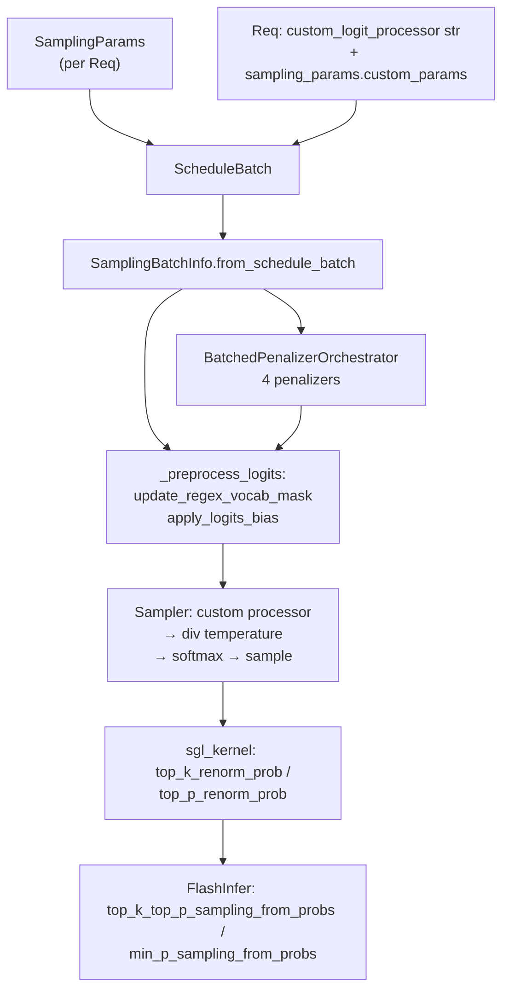

> [!todo] VERIFY: **lint 2026-08-18** — 本页正文存在 **4** 处源码死锚（多为 sglang 上游 test 树重组 / docs 站点 mdx 化 / 文件迁移所致，锚点写于 2026-04 快照），已按 §7 标 `status: stale`，待重校对。死锚清单见 log.md lint entry。

# `srt/sampling` — 采样参数、批处理 logits 修正与惩罚项编排

## Summary

[`python/sglang/srt/sampling/`](d:\design\sglang\python\sglang\srt\sampling) 共 **9** 个 `.py` 文件：用户侧 [`SamplingParams`](d:\design\sglang\python\sglang\srt\sampling\sampling_params.py) → 调度批 [`ScheduleBatch`](d:\design\sglang\python\sglang\srt\managers\schedule_batch.py) 上物化的 [`SamplingBatchInfo`](d:\design\sglang\python\sglang\srt\sampling\sampling_batch_info.py)（GPU 上 batch 维张量 + 可选 [`BatchedPenalizerOrchestrator`](d:\design\sglang\python\sglang\srt\sampling\penaltylib\orchestrator.py)）→ 在 [`ModelRunner._preprocess_logits`](d:\design\sglang\python\sglang\srt\model_executor\model_runner.py) 中对 **下一 token logits** 施加 grammar bitmask / 惩罚 / `logit_bias` → [`Sampler.forward`](d:\design\sglang\python\sglang\srt\layers\sampler.py) 中 **温度缩放 + softmax + top-k/top-p/min-p 采样**（CUDA 默认：`sgl_kernel` 概率重归一 + **FlashInfer** 采样核；见下文）。

> [!warning] CONTRADICTION（与常见命名/其它引擎对照）
>
> - **`custom_logit_processor` 不在 `SamplingParams` 上**：序列化串挂在 [`Req.custom_logit_processor`](d:\design\sglang\python\sglang\srt\managers\schedule_batch.py)，[`SamplingBatchInfo.from_schedule_batch`](d:\design\sglang\python\sglang\srt\sampling\sampling_batch_info.py) 读取的是 `r.custom_logit_processor` 与 `r.sampling_params.custom_params`。
> - 本树 **`SamplingParams` 无 `temperature_last` 字段**（全仓库 `srt` 下无匹配）；温度与 softmax、采样的相对顺序以 [`Sampler.forward`](d:\design\sglang\python\sglang\srt\layers\sampler.py) 为准：**先** [`apply_logits_bias`](d:\design\sglang\python\sglang\srt\sampling\sampling_batch_info.py)（惩罚 + grammar mask + logit_bias），**再** `_preprocess_logits` 中自定义 logits 处理器，**再** `logits.div_(temperatures)` 与 softmax。
> - **`json_array`**：非 `SamplingParams` 成员；出现在 OpenAI/工具解析等路径（如 [`function_call/`](d:\design\sglang\python\sglang\srt\function_call\)），与采样 dataclass 无关。

> [!todo] VERIFY: ~~用户提及的 CLI `--enable-thinking-budget`：在 [`server_args.py`](d:\design\sglang\python\sglang\srt\server_args.py) 中**未检索到**；思考预算逻辑在 [`ThinkingBudgetLogitProcessor`](d:\design\sglang\python\sglang\srt\sampling\custom_logit_processor.py)（自定义 processor + `custom_params`）中实现。~~
> **RESOLVED 2026-04-19**: 已确认 — 全 `srt/` 树 grep `thinking_budget|--enable-thinking-budget|ThinkingBudget` 仅命中 [`sampling/custom_logit_processor.py`](d:\design\sglang\python\sglang\srt\sampling\custom_logit_processor.py)（基类 `ThinkingBudgetLogitProcessor` L60、子类 `Glm4Moe…` L115、`Qwen3…` L123、`DeepSeekR1…` L131）；`server_args.py` 0 命中。**结论**：思考预算**仅以 CustomLogitProcessor 形式存在**，无对应 CLI 开关，需经 `--enable-custom-logit-processor` + 请求侧 `custom_params` 启用。

## Sources

| 主题 | 锚点 |
|---|---|
| 用户采样参数 | [`sampling_params.py`](d:\design\sglang\python\sglang\srt\sampling\sampling_params.py)（`SamplingParams` L31-196，`verify` L106-162，`normalize` L164-196） |
| 批采样张量视图 | [`sampling_batch_info.py`](d:\design\sglang\python\sglang\srt\sampling\sampling_batch_info.py)（`SamplingBatchInfo` L22-447） |
| 自定义 logits | [`custom_logit_processor.py`](d:\design\sglang\python\sglang\srt\sampling\custom_logit_processor.py) |
| 惩罚编排 / 抽象 penalizer | [`orchestrator.py`](d:\design\sglang\python\sglang\srt\sampling\penaltylib\orchestrator.py) |
| 四种 penalizer | [`frequency_penalty.py`](d:\design\sglang\python\sglang\srt\sampling\penaltylib\frequency_penalty.py)、[`presence_penalty.py`](d:\design\sglang\python\sglang\srt\sampling\penaltylib\presence_penalty.py)、[`repetition_penalty.py`](d:\design\sglang\python\sglang\srt\sampling\penaltylib\repetition_penalty.py)、[`min_new_tokens.py`](d:\design\sglang\python\sglang\srt\sampling\penaltylib\min_new_tokens.py) |
| 采样执行（温度、softmax、FlashInfer） | [`layers/sampler.py`](d:\design\sglang\python\sglang\srt\layers\sampler.py) |
| logits 前处理调用链 | [`model_runner.py` `_preprocess_logits` / `sample`](d:\design\sglang\python\sglang\srt\model_executor\model_runner.py) |
| Grammar bitmask CUDA | [`xgrammar_backend.py`](d:\design\sglang\python\sglang\srt\constrained\xgrammar_backend.py) + [`common_extension.cc`](d:\design\sglang\python\sglang\kernels\aot\csrc\common_extension.cc) `apply_token_bitmask_inplace_cuda` |
| sgl-kernel Python 封装 | [`sgl-kernel/python/sgl_kernel/sampling.py`](d:\design\sglang\python\sglang\kernels\aot\python\sgl_kernel\sampling.py) |

## Architecture / Data flow

- **物化入口**：[`SamplingBatchInfo.from_schedule_batch`](d:\design\sglang\python\sglang\srt\sampling\sampling_batch_info.py)；调度侧见 [`schedule_batch.py`](d:\design\sglang\python\sglang\srt\managers\schedule_batch.py)、[`scheduler.py`](d:\design\sglang\python\sglang\srt\managers\scheduler.py)。
- **真正"采样"发生位置**：[`ModelRunner.sample`](d:\design\sglang\python\sglang\srt\model_executor\model_runner.py) → [`Sampler.forward`](d:\design\sglang\python\sglang\srt\layers\sampler.py)；非 overlap 模式下惩罚亦可在 [`apply_logits_bias`](d:\design\sglang\python\sglang\srt\sampling\sampling_batch_info.py) 内 **`orchestrator.apply(logits)`** 就地改 logits。

## File inventory（9 文件）

| 文件 | 职责 |
|---|---|
| [`sampling_params.py`](d:\design\sglang\python\sglang\srt\sampling\sampling_params.py) | `SamplingParams`：校验、归一化 stop / regex 元数据 |
| [`sampling_batch_info.py`](d:\design\sglang\python\sglang\srt\sampling\sampling_batch_info.py) | `SamplingBatchInfo`：批张量、`merge`/`filter`、`apply_logits_bias`、`copy_for_forward` |
| [`custom_logit_processor.py`](d:\design\sglang\python\sglang\srt\sampling\custom_logit_processor.py) | `CustomLogitProcessor` + dill 序列化 + 若干内置 processor |
| [`penaltylib/__init__.py`](d:\design\sglang\python\sglang\srt\sampling\penaltylib\__init__.py) | 导出 4 个 batched penalizer + orchestrator |
| [`penaltylib/orchestrator.py`](d:\design\sglang\python\sglang\srt\sampling\penaltylib\orchestrator.py) | `BatchedPenalizerOrchestrator`、`_BatchedPenalizer` |
| [`penaltylib/repetition_penalty.py`](d:\design\sglang\python\sglang\srt\sampling\penaltylib\repetition_penalty.py) | 乘性重复惩罚 + `apply_scaling_penalties` |
| [`penaltylib/presence_penalty.py`](d:\design\sglang\python\sglang\srt\sampling\penaltylib\presence_penalty.py) | 加性 presence |
| [`penaltylib/frequency_penalty.py`](d:\design\sglang\python\sglang\srt\sampling\penaltylib\frequency_penalty.py) | 加性 frequency（`scatter_add_`） |
| [`penaltylib/min_new_tokens.py`](d:\design\sglang\python\sglang\srt\sampling\penaltylib\min_new_tokens.py) | `min_new_tokens`：对 stop/EOS 类 logits 施加 `-inf` 直至长度满足 |

## `SamplingParams` 字段表

**构造函数参数共 25 个**（[`__init__` L40-66](d:\design\sglang\python\sglang\srt\sampling\sampling_params.py)）：

| 参数名 | 类型 / 默认 | 备注 |
|---|---|---|
| `max_new_tokens` | `int` = `128` | |
| `stop` | `Optional[Union[str, List[str]]]` = `None` | 存为 `stop_strs` |
| `stop_token_ids` | `Optional[List[int]]` = `None` | 过滤后 `set` 或 `None` |
| `stop_regex` | `Optional[Union[str, List[str]]]` = `None` | 存为 `stop_regex_strs` |
| `temperature` | `float` = `1.0` | 极小温度特判改 `top_k=1` |
| `top_p` | `float` = `1.0` | |
| `top_k` | `int` = `-1` | `-1` 转为 `TOP_K_ALL` |
| `min_p` | `float` = `0.0` | |
| `frequency_penalty` | `float` = `0.0` | |
| `presence_penalty` | `float` = `0.0` | |
| `repetition_penalty` | `float` = `1.0` | |
| `min_new_tokens` | `int` = `0` | |
| `n` | `int` = `1` | |
| `json_schema` / `regex` / `ebnf` | `Optional[str]` | 三选一 |
| `structural_tag` | `Optional[str]` = `None` | |
| `ignore_eos` | `bool` = `False` | |
| `skip_special_tokens` | `bool` = `True` | |
| `spaces_between_special_tokens` | `bool` = `True` | |
| `no_stop_trim` | `bool` = `False` | |
| `custom_params` | `Optional[Dict[str, Any]]` = `None` | 与自定义 logits 配合 |
| `stream_interval` | `Optional[int]` = `None` | |
| `logit_bias` | `Optional[Dict[str, float]]` = `None` | 键为 token id 字符串 |
| `sampling_seed` | `Optional[int]` = `None` | 与 deterministic 路径配合 |

**`normalize(tokenizer)` 追加**：`stop_strs` 列表化、`stop_str_max_len`；`stop_regex_strs` 列表化、`stop_regex_max_len`（[`normalize` L164-196](d:\design\sglang\python\sglang\srt\sampling\sampling_params.py)）。

**不在此类上的常用 API 字段**（避免与 OpenAI 文档混淆）：**`custom_logit_processor`**（在 `Req` / `GenerateReqInput` 侧）、**`json_array`**（非本 dataclass）。

## `SamplingBatchInfo`

| 项目 | 说明 |
|---|---|
| **构造** | [`from_schedule_batch(cls, batch, vocab_size)`](d:\design\sglang\python\sglang\srt\sampling\sampling_batch_info.py)：从 `batch.reqs` 堆叠 `temperatures`/`top_ps`/`top_ks`/`min_ps`/`sampling_seed?`/`logit_bias?`，创建 [`BatchedPenalizerOrchestrator`](d:\design\sglang\python\sglang\srt\sampling\sampling_batch_info.py)，合并 **custom logit processor**（按序列化串分组 + bool mask）。 |
| **设备侧张量** | `temperatures` `[B,1]`、`top_ps`、`top_ks`、`min_ps`、`sampling_seed?`、`logit_bias?` `[B,V]`、`acc_*` 惩罚缓冲（overlap，`update_penalties`）。 |
| **`merge_batch`** | [`merge_batch`](d:\design\sglang\python\sglang\srt\sampling\sampling_batch_info.py)：`penalizer_orchestrator.merge`；合并 custom processor 字典与 `custom_params`；`merge_bias_tensor` 合并 `logit_bias`；`torch.cat` 各采样参数张量；flags 用 `&=` / `\|=`。 |
| **`filter_batch`** | [`filter_batch`](d:\design\sglang\python\sglang\srt\sampling\sampling_batch_info.py)：`penalizer_orchestrator.filter`；按 `keep_indices_device` 切张量；`_filter_batch_custom_logit_processor`。 |
| **grammar** | [`update_regex_vocab_mask`](d:\design\sglang\python\sglang\srt\sampling\sampling_batch_info.py)：分配 `vocab_mask`，`fill_vocab_mask`；[`apply_logits_bias`](d:\design\sglang\python\sglang\srt\sampling\sampling_batch_info.py) 调用 `apply_mask_func(logits, vocab_mask)`。 |
| **前向拷贝** | [`copy_for_forward`](d:\design\sglang\python\sglang\srt\sampling\sampling_batch_info.py)：`update_penalties()` 后 `penalizer_orchestrator=None` 断开引用。 |

## `BatchedPenalizerOrchestrator` 生命周期

| 方法 | 作用 |
|---|---|
| `__init__` | 为每个 penalizer 类建实例并 `prepare_if_required`；聚合 `is_required` |
| `cumulate_output_tokens` | 逐 penalizer 转发 **生成 token**；**无 `cumulate_input_tokens`** |
| `apply` | 非 speculative：`penalizer.apply(logits)`；`repeat` 分支用于 speculative 展开 |
| `accumulate_additive_penalties` / `accumulate_scaling_penalties` | overlap 模式与 `SamplingBatchInfo.update_penalties` 配合 |
| `filter` | 按 batch 保留索引收缩各 penalizer；空 batch 则 `release` |
| `merge` | 合并另一 orchestrator 的同类型 penalizer |

**注册集合**（[`from_schedule_batch`](d:\design\sglang\python\sglang\srt\sampling\sampling_batch_info.py)）：`BatchedFrequencyPenalizer`、`BatchedMinNewTokensPenalizer`、`BatchedPresencePenalizer`、`BatchedRepetitionPenalizer`。

## `_BatchedPenalizer` 子类矩阵（4）

**公共父类**：[`_BatchedPenalizer`](d:\design\sglang\python\sglang\srt\sampling\penaltylib\orchestrator.py) — 抽象方法 `_is_required`、`_prepare`、`_cumulate_output_tokens`、`_apply`、`_filter`、`_merge`、`_teardown`；`get_scaling_penalties` 仅乘性子类实现。

| 子类 | `_is_required` | 主张量 | logits 修改方式 |
|---|---|---|---|
| [`BatchedRepetitionPenalizer`](d:\design\sglang\python\sglang\srt\sampling\penaltylib\repetition_penalty.py) | `repetition_penalty != 1.0` | `cumulated_repetition_penalties` `[B,V]`、`repetition_penalties` `[B,1]` | 乘性：[`apply_scaling_penalties`](d:\design\sglang\python\sglang\srt\sampling\penaltylib\repetition_penalty.py)（负 logits 乘、正 logits 除） |
| [`BatchedPresencePenalizer`](d:\design\sglang\python\sglang\srt\sampling\penaltylib\presence_penalty.py) | `presence_penalty != 0` | `cumulated_presence_penalties` `[B,V]`、`presence_penalties` `[B,1]` | `logits.sub_` |
| [`BatchedFrequencyPenalizer`](d:\design\sglang\python\sglang\srt\sampling\penaltylib\frequency_penalty.py) | `frequency_penalty != 0` | `cumulated_frequency_penalties` `[B,V]`、`frequency_penalties` `[B,1]` | `logits.sub_` |
| [`BatchedMinNewTokensPenalizer`](d:\design\sglang\python\sglang\srt\sampling\penaltylib\min_new_tokens.py) | `min_new_tokens > 0` | `min_new_tokens`、`stop_token_penalties`（EOS/stop 位置 `-inf`）、`len_output_tokens` | 对尚未满足最小长度位置，`logits[mask] += stop_token_penalties[mask]` |

**输出 token 喂入**：例如 [`schedule_batch.py`](d:\design\sglang\python\sglang\srt\managers\schedule_batch.py) 调用 `penalizer_orchestrator.cumulate_output_tokens`。

## Custom logit processor

| 项目 | 锚点 |
|---|---|
| **序列化** | [`CustomLogitProcessor.to_str`](d:\design\sglang\python\sglang\srt\sampling\custom_logit_processor.py)：`dill.dumps(cls).hex()` 包在 JSON 里；[`from_str`](d:\design\sglang\python\sglang\srt\sampling\custom_logit_processor.py) 经 `orjson` + `dill`；[`_cache_from_str`](d:\design\sglang\python\sglang\srt\sampling\custom_logit_processor.py) `lru_cache` 防重复反序列化。 |
| **调用约定** | 抽象 [`__call__(logits, custom_param_list=None)`](d:\design\sglang\python\sglang\srt\sampling\custom_logit_processor.py)；[`apply_custom_logit_processor`](d:\design\sglang\python\sglang\srt\layers\sampler.py) 按 **mask 选行**，把 **对应行的 `custom_params` 列表** 传入（支持 spec decode 的 `num_tokens_in_batch`）。 |
| **与惩罚/grammar 顺序** | [`Sampler._preprocess_logits`](d:\design\sglang\python\sglang\srt\layers\sampler.py)：**先** custom processor，**后** 温度/softmax。**注意**：[`ModelRunner._preprocess_logits`](d:\design\sglang\python\sglang\srt\model_executor\model_runner.py) **先** `apply_logits_bias`（惩罚+grammar+`logit_bias`），再在 `Sampler` 里做 custom processor（跨模块顺序以调用链为准）。 |
| **安全/开销** | 需 [`ServerArgs.enable_custom_logit_processor`](d:\design\sglang\python\sglang\srt\server_args.py) + CLI [`--enable-custom-logit-processor`](d:\design\sglang\python\sglang\srt\server_args.py)；**dill 可执行反序列化风险**（默认关闭）。 |

## sgl-kernel 与 FlashInfer（CUDA 采样路径）

**`layers/sampler.py`（CUDA）**：[`flashinfer.sampling`](d:\design\sglang\python\sglang\srt\layers\sampler.py) 提供 `top_k_top_p_sampling_from_probs`、`min_p_sampling_from_probs`；[`sgl_kernel`](d:\design\sglang\python\sglang\srt\layers\sampler.py) 提供 `top_k_renorm_prob`、`top_p_renorm_prob`。当 `need_min_p_sampling` 时先 `top_k_renorm_prob` → `top_p_renorm_prob` → `min_p_sampling_from_probs`；否则 `top_k_top_p_sampling_from_probs`。

**sgl-kernel C++ 注册（CUDA，`common_extension.cc`）** — 与采样/结构化相关的绑定包括：

| 算子名 | 行号 |
|---|---|
| `top_k_renorm_probs` | [L354-355](d:\design\sglang\python\sglang\kernels\aot\csrc\common_extension.cc) |
| `top_p_renorm_probs` | [L357-358](d:\design\sglang\python\sglang\kernels\aot\csrc\common_extension.cc) |
| `apply_token_bitmask_inplace_cuda`（grammar logits） | [L407-408](d:\design\sglang\python\sglang\kernels\aot\csrc\common_extension.cc) |

**Python 封装**：[`sgl_kernel/sampling.py`](d:\design\sglang\python\sglang\kernels\aot\python\sgl_kernel\sampling.py) 中 `torch.ops.sgl_kernel.top_k_renorm_probs.default` / `top_p_renorm_probs.default`；在可用时 **delegate 到 FlashInfer**。

**MUSA 扩展**（[`common_extension_musa.cc`](d:\design\sglang\python\sglang\kernels\aot\csrc\common_extension_musa.cc)）另注册 `min_p_sampling_from_probs`、`top_p_sampling_from_probs`、`top_k_top_p_sampling_from_probs` 等 — **非默认 CUDA 路径**。

**计数（CUDA 扩展中与采样管线直接相关的绑定）**：`common_extension.cc` 上 **3** 个：`top_k_renorm_probs`、`top_p_renorm_probs`、`apply_token_bitmask_inplace_cuda`（**不含** FlashInfer 自带的 multinomial 采样核； multinomial 在 `Sampler._sample_from_probs` 中由 **FlashInfer** 或 **PyTorch** 路径承担）。

## Grammar（bitmask）在 logits 上的位置

1. [`SamplingBatchInfo.update_regex_vocab_mask`](d:\design\sglang\python\sglang\srt\sampling\sampling_batch_info.py) 填 `vocab_mask`。
2. [`apply_logits_bias`](d:\design\sglang\python\sglang\srt\sampling\sampling_batch_info.py) 调用 grammar 的 `apply_vocab_mask`。
3. xgrammar 后端 [`apply_vocab_mask`](d:\design\sglang\python\sglang\srt\constrained\xgrammar_backend.py) 使用 **`apply_token_bitmask_inplace_cuda`** 或 Triton。
4. [`ModelRunner._preprocess_logits`](d:\design\sglang\python\sglang\srt\model_executor\model_runner.py) 在应用后 **释放** `vocab_mask` 以防 VRAM 泄漏。

## CLI / `ServerArgs` 默认值

| 项 | 默认值 | CLI / 字段锚点 |
|---|---|---|
| `sampling_defaults` | `"model"` | 字段 [L443](d:\design\sglang\python\sglang\srt\server_args.py)；`--sampling-defaults` [L4840-4848](d:\design\sglang\python\sglang\srt\server_args.py) |
| `sampling_backend` | `None`（解析期再定） | 字段 [L482](d:\design\sglang\python\sglang\srt\server_args.py)；`--sampling-backend` [L5020-5026](d:\design\sglang\python\sglang\srt\server_args.py) |
| `enable_custom_logit_processor` | `False` | 字段 [L666](d:\design\sglang\python\sglang\srt\server_args.py)；`--enable-custom-logit-processor` [L5971-5975](d:\design\sglang\python\sglang\srt\server_args.py) |
| `enable_deterministic_inference` | `False` | 字段 [L677](d:\design\sglang\python\sglang\srt\server_args.py)；`--enable-deterministic-inference` [L6029-6033](d:\design\sglang\python\sglang\srt\server_args.py) |
| `--preferred-sampling-params` | `None` | [L4899-4903](d:\design\sglang\python\sglang\srt\server_args.py) |

## §跨子系统 — 5 类 grep 摘要

1. **sgl-kernel C++/CUDA / Python**：`top_k_renorm_probs`、`top_p_renorm_probs`、`apply_token_bitmask_inplace_cuda` 见 [`common_extension.cc:354-408`](d:\design\sglang\python\sglang\kernels\aot\csrc\common_extension.cc)；[`sgl_kernel/sampling.py`](d:\design\sglang\python\sglang\kernels\aot\python\sgl_kernel\sampling.py)；MUSA 全量采样算子见 [`common_extension_musa.cc`](d:\design\sglang\python\sglang\kernels\aot\csrc\common_extension_musa.cc)。
2. **`from sglang.srt.sampling`**（`srt` 下，排除 `sampling/` 自引用）：[`model_runner.py`](d:\design\sglang\python\sglang\srt\model_executor\model_runner.py)、[`forward_batch_info.py`](d:\design\sglang\python\sglang\srt\model_executor\forward_batch_info.py)、[`tokenizer_manager.py`](d:\design\sglang\python\sglang\srt\managers\tokenizer_manager.py)、[`scheduler_pp_mixin.py`](d:\design\sglang\python\sglang\srt\managers\scheduler_pp_mixin.py)、[`scheduler.py`](d:\design\sglang\python\sglang\srt\managers\scheduler.py)、[`schedule_batch.py`](d:\design\sglang\python\sglang\srt\managers\schedule_batch.py)、[`io_struct.py`](d:\design\sglang\python\sglang\srt\managers\io_struct.py)、[`layers/sampler.py`](d:\design\sglang\python\sglang\srt\layers\sampler.py)、[`disaggregation/decode_schedule_batch_mixin.py`](d:\design\sglang\python\sglang\srt\disaggregation\decode_schedule_batch_mixin.py)、[`speculative/ngram_info.py`](d:\design\sglang\python\sglang\srt\speculative\ngram_info.py)、[`speculative/eagle_info_v2.py`](d:\design\sglang\python\sglang\srt\speculative\eagle_info_v2.py)、[`configs/deepseek_ocr.py`](d:\design\sglang\python\sglang\srt\configs\deepseek_ocr.py)。
3. **CLI**：见上表（`--sampling-defaults`、`--preferred-sampling-params`、`--sampling-backend`、`--enable-custom-logit-processor`、`--enable-deterministic-inference`）。
4. **`d:\design\sglang\test`**：`sampling_params` **114** 个文件含匹配；`BatchedPenalizerOrchestrator` **1** 文件（`test_penaltylib.py`）；`custom_logit_processor` **5** 文件；`top_k_top_p` **0** 处（端到端测试居多）。
5. **`docs/`**：[`docs/basic_usage/sampling_params.md`](d:\design\sglang\docs\basic_usage\sampling_params.md) 与 [`docs/platforms/ascend/ascend_npu_support_features.md`](d:\design\sglang\docs\platforms\ascend\ascend_npu_support_features.md) 等。

## synthesis: Logits batching 与 vLLM 对照

- **SGLang**：[`BatchedPenalizerOrchestrator`](d:\design\sglang\python\sglang\srt\sampling\penaltylib\orchestrator.py) 在 **整批 `[B,V]` 张量** 上累计 token 频率/出现次数并一次性 `apply`；与 [`SamplingBatchInfo`](d:\design\sglang\python\sglang\srt\sampling\sampling_batch_info.py) 的 `merge_batch` / `filter_batch` 强绑定。
- **vLLM v1**（对比用）：[`vllm/v1/sample/logits_processor/__init__.py`](d:\design\vllm\vllm\v1\sample\logits_processor\__init__.py) 以 **`LogitsProcessor` 接口 + `LogitsProcessors` 状态机** 组织 **batch 更新**（`BatchUpdate` / 内置 `MinTokensLogitsProcessor` 等），抽象层与 SGLang 的 `_BatchedPenalizer` 不同但同属「batch logits 变换管线」。

## synthesis: `min_new_tokens` 作为 penalizer

SGLang 将 [`BatchedMinNewTokensPenalizer`](d:\design\sglang\python\sglang\srt\sampling\penaltylib\min_new_tokens.py) 与其它惩罚同一编排，**通过向 stop/EOS 相关 logits 加 `-inf`**（在长度不足时）实现，而非仅在 Python 层 `if` 跳过停止。

## Notes / Caveats

- **确定性采样与 FlashInfer**：[`Sampler._sample_from_probs`](d:\design\sglang\python\sglang\srt\layers\sampler.py) 在 `flashinfer` backend 下 **`sampling_seed` 与 FlashInfer 不兼容**（assert）。
- **TP 同步**：[`_sync_token_ids_across_tp`](d:\design\sglang\python\sglang\srt\layers\sampler.py) 在 `SYNC_TOKEN_IDS_ACROSS_TP` 或 **grammar** 时 allreduce。

## See also

- [`docs/basic_usage/sampling_params.md`](d:\design\sglang\docs\basic_usage\sampling_params.md)
- [sglang/modules/managers.md](managers.md)、[sglang/entities/Scheduler.md](../entities/Scheduler.md)（批构造与 `SamplingBatchInfo` 生命周期）
- [sglang/modules/constrained.md](constrained.md)（grammar backend 与 bitmask）
