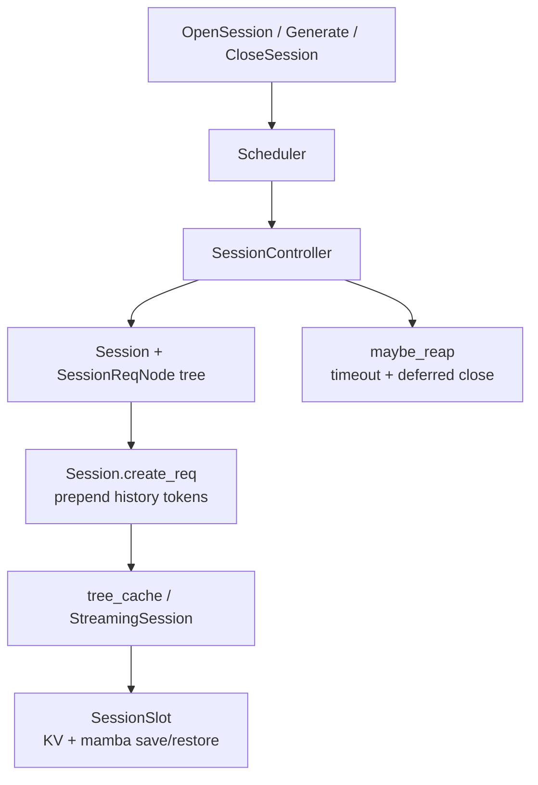

# `srt/session` — 多轮 Session 与 StreamingSession KV 保活

## Summary

[`python/sglang/srt/session/`](d:\design\sglang\python\sglang\srt\session) **3** 个 `.py`（空 `__init__.py`）：[`SessionController`](d:\design\sglang\python\sglang\srt\session\session_controller.py) 管理 open/close/timeout reap 与多轮 `Session` 请求树；[`StreamingSession`](d:\design\sglang\python\sglang\srt\session\streaming_session.py) 作为 `BasePrefixCache` 包装器，在轮次之间 **save/restore KV + Mamba 状态**（`SessionSlot`）。Scheduler 持有 `SessionController(self.tree_cache)`（[scheduler.py ~L1137](d:\design\sglang\python\sglang\srt\managers\scheduler.py)）。

> synthesis: “session” 这里指 **服务端多轮对话状态 + KV pin**，不是 HTTP cookie；streaming 模式额外绕过常规 radix lock，用 slot 持有 pool 资源。

## Sources

| 文件 | 说明 |
|---|---|
| [`session_controller.py`](d:\design\sglang\python\sglang\srt\session\session_controller.py) | `Session` / `SessionReqNode` / `SessionController` |
| [`streaming_session.py`](d:\design\sglang\python\sglang\srt\session\streaming_session.py) | `SessionSlot` / `StreamingSession(BasePrefixCache)` |
| 调度接入 | [`managers/scheduler.py`](d:\design\sglang\python\sglang\srt\managers\scheduler.py) |
| 缓存接入 | [`mem_cache/registry.py`](d:\design\sglang\python\sglang\srt\mem_cache\registry.py)、[`unified_radix_cache.py`](d:\design\sglang\python\sglang\srt\mem_cache\unified_radix_cache.py) |

## Architecture / Data flow

### SessionController

- `open`：校验 `session_id`，创建 `Session(capacity, streaming, timeout)`（[L365-L383](d:\design\sglang\python\sglang\srt\session\session_controller.py)）。
- `close` / `_close`：streaming 若仍有未完成请求 → `close_on_finish=True` 延期；否则 `tree_cache.release_radix_session` + `release_session` + 释放 MM features（[L385-L439](d:\design\sglang\python\sglang\srt\session\session_controller.py)）。
- `maybe_reap`：处理 deferred close + timeout（[L441-L465](d:\design\sglang\python\sglang\srt\session\session_controller.py)）。
- `Session`：请求树 `req_nodes`、`committed_*_len`（投机 append 可回滚）、`streaming` / `_inflight`（[L82-L103](d:\design\sglang\python\sglang\srt\session\session_controller.py)）。
- `adjust_mm_offsets`：session 前缀导致的多模态 offset 平移（[L474-L486](d:\design\sglang\python\sglang\srt\session\session_controller.py)）。

### StreamingSession

- 包装任意 `BasePrefixCache`：外部 `StreamingSession(cache)` 或嵌入 `StreamingSession(inner=self)`（[L130-L142](d:\design\sglang\python\sglang\srt\session\streaming_session.py)）。
- [`SessionSlot`](d:\design\sglang\python\sglang\srt\session\streaming_session.py)：`save_from_req` / `restore_to_req` 转移 `req_pool_idx`、`ReqKvInfo`、mamba 缓冲；save 后清空 req 侧指针防泄漏（[L40-L123](d:\design\sglang\python\sglang\srt\session\streaming_session.py)）。
- Streaming lock 用 `_VirtualNode` sentinel，与真实 radix lock 区分（[L30-L37](d:\design\sglang\python\sglang\srt\session\streaming_session.py)）。
- 启用路径：`registry` 可外包一层；`UnifiedRadixCache` 内嵌 `self.session = StreamingSession(inner=self)`（[unified_radix_cache.py:196-201](d:\design\sglang\python\sglang\srt\mem_cache\unified_radix_cache.py)）。

## Key APIs / Entities

| 名称 | 位置 | 作用 |
|---|---|---|
| `SessionController` | [session_controller.py:353-486](d:\design\sglang\python\sglang\srt\session\session_controller.py) | open/close/reap |
| `Session` | [session_controller.py:82+](d:\design\sglang\python\sglang\srt\session\session_controller.py) | 单会话状态 + `create_req` |
| `SessionReqNode` | [session_controller.py:36-79](d:\design\sglang\python\sglang\srt\session\session_controller.py) | 请求父子树 / abort |
| `StreamingSession` | [streaming_session.py:130+](d:\design\sglang\python\sglang\srt\session\streaming_session.py) | KV 保活 prefix-cache 包装 |
| `SessionSlot` | [streaming_session.py:40-123](d:\design\sglang\python\sglang\srt\session\streaming_session.py) | 轮次间资源槽 |

## 使用方调用清单 / 跨子系统引用

1. **跨语言绑定**：`SessionController` / `StreamingSession`：在 `d:\design\sglang\python\sglang\srt\` 全树 grep 无 C++ 命中。
2. **协作伙伴**：
   - [`Scheduler`](d:\design\sglang\python\sglang\srt\managers\scheduler.py)：构造 `SessionController`、`maybe_reap`、open/close 处理、session_id 分支（~L1137、L1852、L4796-L4810）
   - [`schedule_batch.Req`](d:\design\sglang\python\sglang\srt\managers\schedule_batch.py) TYPE_CHECKING import `Session`
   - [`pool_stats_observer`](d:\design\sglang\python\sglang\srt\managers\scheduler_components\pool_stats_observer.py) 遍历 `session_controller.sessions`
   - [`mem_cache/registry.py`](d:\design\sglang\python\sglang\srt\mem_cache\registry.py)、[`unified_radix_cache.py`](d:\design\sglang\python\sglang\srt\mem_cache\unified_radix_cache.py)
3. **配置**：`ServerArgs` 有 streaming session 相关 help（约 [server_args.py:1453](d:\design\sglang\python\sglang\srt\server_args.py)）；具体 flag 以 ServerArgs 字段为准。
4. **测试**：`SessionController` / `StreamingSession`：本 checkout 无独立 `test/session*`。
5. **doc**：`StreamingSession` / `SessionController`：在 `d:\design\sglang\docs\` 全树 grep 0 命中。

## Notes / Caveats

- Deferred close：避免在 decode 中途释放 KV（[session_controller.py:405-416](d:\design\sglang\python\sglang\srt\session\session_controller.py)）。
- Session MM features 跳过常规 cleanup，close 时显式 `release_features`（[L423-L432](d:\design\sglang\python\sglang\srt\session\session_controller.py)）。
- Embedded `StreamingSession` 要求宿主预判 `_is_streaming`，否则 `inner.xxx` 会递归（[streaming_session.py:134-137](d:\design\sglang\python\sglang\srt\session\streaming_session.py)）。

## See also

- [sglang/modules/managers.md](managers.md)
- [sglang/entities/Scheduler.md](../entities/Scheduler.md)
- [sglang/modules/mem_cache.md](mem_cache.md)
- [sglang/topics/kv-cache.md](../topics/kv-cache.md)
- [sglang/overview.md](../overview.md)
