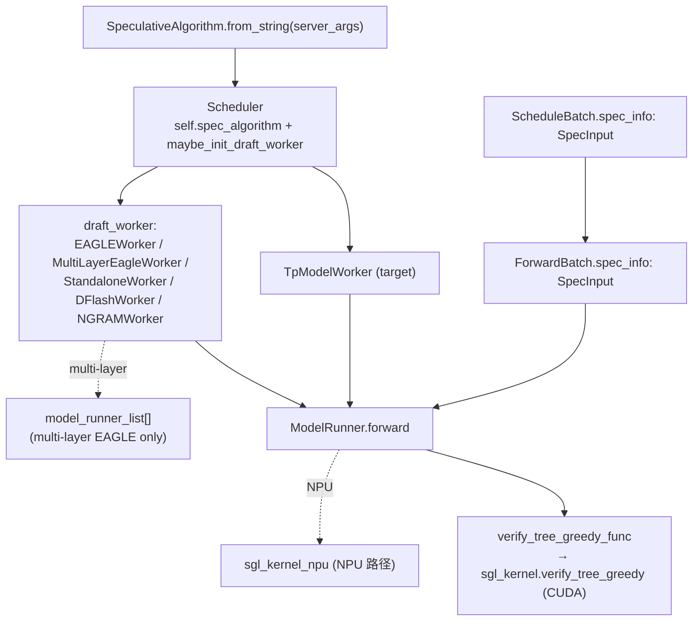

# `srt/speculative` — Speculative decoding（EAGLE / DFlash / N-gram / Standalone / Multi-layer）

## Summary

`srt/speculative/`（**27** `.py` 文件 / ~489 KB；**模块根无 `__init__.py`**）实现 SGLang 投机解码：**算法枚举与 Worker 工厂**（[spec_info.py:15-122](d:\design\sglang\python\sglang\srt\speculative\spec_info.py)）+ **draft 前向与树构造**（`eagle_*` / `dflash_*` / `ngram_*` 多家族）+ **`SpecInput` dataclass 注入 `ScheduleBatch` / `ForwardBatch`**（[schedule_batch.py:1430-1433](d:\design\sglang\python\sglang\srt\managers\schedule_batch.py)、[forward_batch_info.py:400-402](d:\design\sglang\python\sglang\srt\model_executor\forward_batch_info.py)）+ **验证阶段 `verify_tree_greedy` CUDA kernel 绑定到 sgl-kernel**（[eagle_info.py:317-330](d:\design\sglang\python\sglang\srt\speculative\eagle_info.py) → [sgl_kernel/speculative.py:38-57](d:\design\sglang\sgl-kernel\python\sgl_kernel\speculative.py) → [eagle_utils.cu:323-331](d:\design\sglang\sgl-kernel\csrc\speculative\eagle_utils.cu)）+ **DFLASH 专用 Triton 辅助** 与 **N-gram C++ 扩展**两个子目录。

> synthesis: 与 [comparison/topics/speculative-decoding.md](../../comparison/topics/speculative-decoding.md) 一致——MindIE 偏 **Plugin 层 + C++ scheduler placeholder**；vLLM 偏 **`v1/spec_decode/` proposer 包 + worker 侧 `RejectionSampler`**；SGLang 偏 **`SpeculativeAlgorithm` 枚举 + 多型 Worker 工厂 + `SpecInput` dataclass + sgl-kernel CUDA verify**。

> **命名陷阱（与 [model_executor.md](model_executor.md) 一致）**：`srt/model_executor/` 是 worker 内基础设施（≠ vLLM Executor 抽象）；投机解码里 **target 与 draft 都是 `ModelRunner`**，由独立 `TpModelWorker` 实例（单层 EAGLE）或 `model_runner_list` 多 runner（multi-layer EAGLE）承载。

## Sources

| 区域 | 锚点 |
|---|---|
| 模块根（27 `.py` + 2 子目录） | [d:\design\sglang\python\sglang\srt\speculative](d:\design\sglang\python\sglang\srt\speculative) |
| 算法枚举 / 工厂 | [spec_info.py](d:\design\sglang\python\sglang\srt\speculative\spec_info.py)（`SpeculativeAlgorithm` L15-54 / `SpecInput` L135-166 / `from_string` L25-32 / `create_worker` L59-122） |
| 抽象 Worker | [base_spec_worker.py](d:\design\sglang\python\sglang\srt\speculative\base_spec_worker.py) |
| EAGLE 单层 + V2 | [eagle_worker.py](d:\design\sglang\python\sglang\srt\speculative\eagle_worker.py)（`EAGLEWorker(TpModelWorker)` L79-80 / `super().__init__(is_draft_worker=True)` L142-156 / `draft_model_runner` L275-277）+ [eagle_worker_v2.py](d:\design\sglang\python\sglang\srt\speculative\eagle_worker_v2.py) |
| EAGLE info + utils + draft graph | [eagle_info.py](d:\design\sglang\python\sglang\srt\speculative\eagle_info.py)、[eagle_info_v2.py](d:\design\sglang\python\sglang\srt\speculative\eagle_info_v2.py)、[eagle_utils.py](d:\design\sglang\python\sglang\srt\speculative\eagle_utils.py)（`verify_tree_greedy_func` L161-199）、[eagle_draft_cuda_graph_runner.py](d:\design\sglang\python\sglang\srt\speculative\eagle_draft_cuda_graph_runner.py) |
| Multi-layer EAGLE | [multi_layer_eagle_worker.py](d:\design\sglang\python\sglang\srt\speculative\multi_layer_eagle_worker.py)（`mtp_model_runner(layer_id)` L236-237）+ [multi_layer_eagle_worker_v2.py](d:\design\sglang\python\sglang\srt\speculative\multi_layer_eagle_worker_v2.py)、[multi_layer_eagle_utils.py](d:\design\sglang\python\sglang\srt\speculative\multi_layer_eagle_utils.py)、[multi_layer_eagle_draft_extend_cuda_graph_runner.py](d:\design\sglang\python\sglang\srt\speculative\multi_layer_eagle_draft_extend_cuda_graph_runner.py) |
| Standalone | [standalone_worker.py](d:\design\sglang\python\sglang\srt\speculative\standalone_worker.py)（`StandaloneWorker(EAGLEWorker)` L24-25）+ [standalone_worker_v2.py](d:\design\sglang\python\sglang\srt\speculative\standalone_worker_v2.py) |
| DFLASH | [dflash_worker.py](d:\design\sglang\python\sglang\srt\speculative\dflash_worker.py)（**非** TpModelWorker 子类 L50-51）+ [dflash_info.py](d:\design\sglang\python\sglang\srt\speculative\dflash_info.py) + [dflash_utils.py](d:\design\sglang\python\sglang\srt\speculative\dflash_utils.py) |
| N-gram | [ngram_worker.py](d:\design\sglang\python\sglang\srt\speculative\ngram_worker.py)（`NGRAMWorker` L25-26，**非** TpModelWorker 子类）+ [ngram_info.py](d:\design\sglang\python\sglang\srt\speculative\ngram_info.py) + [external_corpus_manager.py](d:\design\sglang\python\sglang\srt\speculative\external_corpus_manager.py) + [cpp_ngram/](d:\design\sglang\python\sglang\srt\speculative\cpp_ngram)（C++ 扩展，2 .py + .clang-format） |
| Triton ops | [triton_ops/fused_kv_materialize.py](d:\design\sglang\python\sglang\srt\speculative\triton_ops\fused_kv_materialize.py)（DFLASH KV 融合，[L14-17 docstring](d:\design\sglang\python\sglang\srt\speculative\triton_ops\fused_kv_materialize.py)）+ [triton_ops/__init__.py](d:\design\sglang\python\sglang\srt\speculative\triton_ops\__init__.py) |
| 共享工具 | [spec_utils.py](d:\design\sglang\python\sglang\srt\speculative\spec_utils.py)（topk / bitmask / draft TP context） |
| Scheduler 集成 | [managers/scheduler.py:380-382, 615-637, 639-689](d:\design\sglang\python\sglang\srt\managers\scheduler.py) |
| TpModelWorker 集成 | [managers/tp_worker.py:256-388](d:\design\sglang\python\sglang\srt\managers\tp_worker.py)（`model_runner_list` + `_init_multi_layer_eagle_model_runners` L363-388） |
| 批数据 | [managers/schedule_batch.py:1430-1433](d:\design\sglang\python\sglang\srt\managers\schedule_batch.py)、[model_executor/forward_batch_info.py:400-404, 479-480](d:\design\sglang\python\sglang\srt\model_executor\forward_batch_info.py) |
| ModelRunner 标记 | [model_executor/model_runner.py:340-352](d:\design\sglang\python\sglang\srt\model_executor\model_runner.py)（`spec_algorithm` 字段 + `draft_model_idx` L352） |
| CLI | [server_args.py:497-523, 3107-3134](d:\design\sglang\python\sglang\srt\server_args.py) |
| sgl-kernel CUDA verify 绑定 | [sgl-kernel/python/sgl_kernel/speculative.py:38-57](d:\design\sglang\sgl-kernel\python\sgl_kernel\speculative.py)、[sgl-kernel/csrc/common_extension.cc:255-259](d:\design\sglang\sgl-kernel\csrc\common_extension.cc)、[sgl-kernel/csrc/speculative/eagle_utils.cu:323-331](d:\design\sglang\sgl-kernel\csrc\speculative\eagle_utils.cu) |

## Architecture / Data flow

**调度持有关系**：[`Scheduler.maybe_init_draft_worker`](d:\design\sglang\python\sglang\srt\managers\scheduler.py:639-667) 实例化 draft；[`init_model_worker`](d:\design\sglang\python\sglang\srt\managers\scheduler.py:681-689) 在启用 spec 时 **`model_worker = draft_worker`**，**`tp_worker` 仍为 target**。

**verify 主链**：EAGLE greedy 路径调用 [`verify_tree_greedy_func`](d:\design\sglang\python\sglang\srt\speculative\eagle_utils.py:161-199) → CUDA 走 [`sgl_kernel.verify_tree_greedy`](d:\design\sglang\sgl-kernel\python\sgl_kernel\speculative.py:47-48) → C++ 注册 [common_extension.cc:255-259](d:\design\sglang\sgl-kernel\csrc\common_extension.cc) → CUDA [eagle_utils.cu:323](d:\design\sglang\sgl-kernel\csrc\speculative\eagle_utils.cu)；NPU 路径走 [`sgl_kernel_npu`](d:\design\sglang\python\sglang\srt\speculative\eagle_utils.py:186-198)。**非 greedy** 走 [`tree_speculative_sampling_target_only`](d:\design\sglang\python\sglang\srt\speculative\eagle_info.py:49-54)（同样 sgl_kernel CUDA 路径）。

## File inventory

| 分组 | 文件 | 角色 |
|---|---|---|
| **算法枚举 / 抽象** | [spec_info.py](d:\design\sglang\python\sglang\srt\speculative\spec_info.py)、[base_spec_worker.py](d:\design\sglang\python\sglang\srt\speculative\base_spec_worker.py) | `SpeculativeAlgorithm` enum / `SpecInput` 抽象 / `BaseSpecWorker` |
| **EAGLE 单层** | [eagle_worker.py](d:\design\sglang\python\sglang\srt\speculative\eagle_worker.py)、[eagle_worker_v2.py](d:\design\sglang\python\sglang\srt\speculative\eagle_worker_v2.py)、[eagle_info.py](d:\design\sglang\python\sglang\srt\speculative\eagle_info.py)、[eagle_info_v2.py](d:\design\sglang\python\sglang\srt\speculative\eagle_info_v2.py)、[eagle_utils.py](d:\design\sglang\python\sglang\srt\speculative\eagle_utils.py)、[eagle_draft_cuda_graph_runner.py](d:\design\sglang\python\sglang\srt\speculative\eagle_draft_cuda_graph_runner.py)、[draft_utils.py](d:\design\sglang\python\sglang\srt\speculative\draft_utils.py) | 单层 draft / verify / CUDA 图 |
| **Multi-layer EAGLE** | [multi_layer_eagle_worker.py](d:\design\sglang\python\sglang\srt\speculative\multi_layer_eagle_worker.py)、[multi_layer_eagle_worker_v2.py](d:\design\sglang\python\sglang\srt\speculative\multi_layer_eagle_worker_v2.py)、[multi_layer_eagle_utils.py](d:\design\sglang\python\sglang\srt\speculative\multi_layer_eagle_utils.py)、[multi_layer_eagle_draft_extend_cuda_graph_runner.py](d:\design\sglang\python\sglang\srt\speculative\multi_layer_eagle_draft_extend_cuda_graph_runner.py) | 多 `ModelRunner` 分步 draft；`mtp_model_runner` 按 layer 索引 |
| **Standalone** | [standalone_worker.py](d:\design\sglang\python\sglang\srt\speculative\standalone_worker.py)、[standalone_worker_v2.py](d:\design\sglang\python\sglang\srt\speculative\standalone_worker_v2.py) | 独立 draft 模型路径 |
| **DFLASH** | [dflash_worker.py](d:\design\sglang\python\sglang\srt\speculative\dflash_worker.py)、[dflash_info.py](d:\design\sglang\python\sglang\srt\speculative\dflash_info.py)、[dflash_utils.py](d:\design\sglang\python\sglang\srt\speculative\dflash_utils.py) | DFLASH 算法（**非** TpModelWorker 子类） |
| **N-gram** | [ngram_worker.py](d:\design\sglang\python\sglang\srt\speculative\ngram_worker.py)、[ngram_info.py](d:\design\sglang\python\sglang\srt\speculative\ngram_info.py)、[external_corpus_manager.py](d:\design\sglang\python\sglang\srt\speculative\external_corpus_manager.py)、[cpp_ngram/](d:\design\sglang\python\sglang\srt\speculative\cpp_ngram) | NGRAM + 语料 + C++ 扩展 |
| **共享 / Triton** | [spec_utils.py](d:\design\sglang\python\sglang\srt\speculative\spec_utils.py)、[triton_ops/fused_kv_materialize.py](d:\design\sglang\python\sglang\srt\speculative\triton_ops\fused_kv_materialize.py)、[triton_ops/__init__.py](d:\design\sglang\python\sglang\srt\speculative\triton_ops\__init__.py) | topk / bitmask / draft TP；DFLASH KV 融合 |

> 注：模块根目录 **无** `__init__.py`，导入以子模块路径为准（如 `sglang.srt.speculative.spec_info`）。

## `SpeculativeAlgorithm` enum / dispatcher

[`SpeculativeAlgorithm`](d:\design\sglang\python\sglang\srt\speculative\spec_info.py:15-54) 6 成员：

| 成员 | 锚点 |
|---|---|
| `DFLASH` | [L18](d:\design\sglang\python\sglang\srt\speculative\spec_info.py) |
| `EAGLE` | [L19](d:\design\sglang\python\sglang\srt\speculative\spec_info.py) |
| `EAGLE3` | [L20](d:\design\sglang\python\sglang\srt\speculative\spec_info.py) |
| `STANDALONE` | [L21](d:\design\sglang\python\sglang\srt\speculative\spec_info.py) |
| `NGRAM` | [L22](d:\design\sglang\python\sglang\srt\speculative\spec_info.py) |
| `NONE` | [L23](d:\design\sglang\python\sglang\srt\speculative\spec_info.py) |

**调度入口**：[`from_string`](d:\design\sglang\python\sglang\srt\speculative\spec_info.py:25-32)；**Worker 分发**：[`create_worker`](d:\design\sglang\python\sglang\srt\speculative\spec_info.py:59-122)：

| 算法 | overlap | multi_layer | → Worker 类 |
|---|---|---|---|
| `DFLASH` | — | — | `DFlashWorker` |
| `EAGLE` / `EAGLE3` | enabled | enabled | `MultiLayerEagleWorker` |
| `EAGLE` / `EAGLE3` | enabled | disabled | `EAGLEWorker` |
| `EAGLE` / `EAGLE3` | disabled | enabled | `MultiLayerEagleWorkerV2` |
| `EAGLE` / `EAGLE3` | disabled | disabled | `EAGLEWorkerV2` |
| `STANDALONE` | enabled / disabled | — | `StandaloneWorker` / `StandaloneWorkerV2` |
| `NGRAM` | — | — | `NGRAMWorker` |

**CLI 别名**：`NEXTN` 在 [server_args.py:3131-3132](d:\design\sglang\python\sglang\srt\server_args.py) 规范化为 `EAGLE`（`SpeculativeAlgorithm` 无 `NEXTN` 成员）。

## `EAGLEWorker` / draft model integration

- **类定义**：[`class EAGLEWorker(TpModelWorker)`](d:\design\sglang\python\sglang\srt\speculative\eagle_worker.py:79-80) —— **draft worker 是 TpModelWorker 子类**（"独立 TpModelWorker" 的精确含义）。
- **draft 标志**：`super().__init__(..., is_draft_worker=True, ...)`（[eagle_worker.py:142-156](d:\design\sglang\python\sglang\srt\speculative\eagle_worker.py)），与 target [`target_worker`](d:\design\sglang\python\sglang\srt\speculative\eagle_worker.py:100) 分离。
- **`draft_model_runner` 即 draft 的 `ModelRunner`**（[eagle_worker.py:275-277](d:\design\sglang\python\sglang\srt\speculative\eagle_worker.py)）。
- **调度持有**：[scheduler.py:615-637](d:\design\sglang\python\sglang\srt\managers\scheduler.py) 构造 target；[L639-667](d:\design\sglang\python\sglang\srt\managers\scheduler.py) 构造 draft；[L681-689 `init_model_worker`](d:\design\sglang\python\sglang\srt\managers\scheduler.py) 在启用 spec 时 `self.model_worker = draft_worker`，但 `self.tp_worker` 仍为 target。

> synthesis: **DFlash / NGRAM 不是 TpModelWorker 子类**（[dflash_worker.py:50-51](d:\design\sglang\python\sglang\srt\speculative\dflash_worker.py)、[ngram_worker.py:25-26](d:\design\sglang\python\sglang\srt\speculative\ngram_worker.py)）—— "独立 TpModelWorker" 的对比页 synthesis **仅适用于 EAGLE 系**；DFlash / NGRAM 走另一条 worker 抽象路径。

## Multi-layer EAGLE

- **触发**：[`spec_info.create_worker`](d:\design\sglang\python\sglang\srt\speculative\spec_info.py:77-90) 在 `is_eagle() and server_args.enable_multi_layer_eagle` 时返回 `MultiLayerEagleWorker(V2)`。
- **`model_runner_list`**：[`TpModelWorker._init_multi_layer_eagle_model_runners`](d:\design\sglang\python\sglang\srt\managers\tp_worker.py:363-388) 在 `is_multi_layer_eagle` 下追加 `speculative_num_steps` 个 `ModelRunner`，[`draft_model_idx`](d:\design\sglang\python\sglang\srt\model_executor\model_runner.py:352) 分层。
- **按层访问**：[`mtp_model_runner(layer_id)`](d:\design\sglang\python\sglang\srt\speculative\multi_layer_eagle_worker.py:236-237) → `model_runner_list[layer_id]`。

> synthesis: 与单层 EAGLE 单 `draft_model_runner` 不同，multi-layer 在**同一 draft worker 进程内**维护**多条 `ModelRunner` 链**，用于多步 MTP 结构。这是 [comparison/topics/executor-worker.md §10](../../comparison/topics/executor-worker.md) 第 3 个 anchor 提到的"draft model runner 持有位置差异"中 **SGLang 在 worker 层共享多个 ModelRunner** 的精确实现。

## Verify kernel（sgl-kernel 跨语言绑定）

| 层级 | 锚点 |
|---|---|
| Python 包装 | [`verify_tree_greedy_func`](d:\design\sglang\python\sglang\srt\speculative\eagle_utils.py:161-199)：CUDA/HIP 走 sgl_kernel；NPU 走 sgl_kernel_npu |
| Python `torch.ops` 入口 | [sgl_kernel/speculative.py:38-57](d:\design\sglang\sgl-kernel\python\sgl_kernel\speculative.py)（`torch.ops.sgl_kernel.verify_tree_greedy`） |
| C++ 注册 | [csrc/common_extension.cc:255-259](d:\design\sglang\sgl-kernel\csrc\common_extension.cc) |
| CUDA 实现 | [csrc/speculative/eagle_utils.cu:323-331](d:\design\sglang\sgl-kernel\csrc\speculative\eagle_utils.cu) |

**主调用点**：[`EagleVerifyInput` 路径](d:\design\sglang\python\sglang\srt\speculative\eagle_info.py:317-330)（greedy；不可用时回退 [L311-315](d:\design\sglang\python\sglang\srt\speculative\eagle_info.py)）。

> synthesis: **`verify_tree_greedy` 是 SGLang 第二个已确认的 sgl-kernel C++ 算子绑定**（第一个是 [`shm_allreduce`](../modules/distributed.md)，详 [sglang/modules/distributed.md §跨子系统引用](distributed.md)）—— 反驳了"SGLang 全 Python 无 C++ 算子"的初步假设。

## `SpecInput` dataclass / `spec_info` 字段

源码中 **批字段名为 `spec_info`**（不是 `SpecInfo`），类型为 **`SpecInput` 子类**（如 `EagleDraftInput` / `EagleVerifyInput`）。

- **抽象基类**：[`class SpecInput(ABC)`](d:\design\sglang\python\sglang\srt\speculative\spec_info.py:135-166)；`SpecInputType` 区分 draft/verify（[L125-132](d:\design\sglang\python\sglang\srt\speculative\spec_info.py)）。
- **批字段**：[ScheduleBatch](d:\design\sglang\python\sglang\srt\managers\schedule_batch.py:1430-1433) `spec_algorithm` + `spec_info`；[ForwardBatch](d:\design\sglang\python\sglang\srt\model_executor\forward_batch_info.py:400-402) 同名两字段。
- **工厂复制**：[`ForwardBatch.init_new`](d:\design\sglang\python\sglang\srt\model_executor\forward_batch_info.py:479-480) 传入 `spec_algorithm` 与 `spec_info`。

## Triton ops 子目录

[`triton_ops/`](d:\design\sglang\python\sglang\srt\speculative\triton_ops) 当前 **仅 1 个真实 op**：[`FusedKVMaterializeHelper`](d:\design\sglang\python\sglang\srt\speculative\triton_ops\fused_kv_materialize.py)（DFLASH KV 融合路径，[L14-17 docstring](d:\design\sglang\python\sglang\srt\speculative\triton_ops\fused_kv_materialize.py)）。

> synthesis: **`triton_ops/` ≠ `verify_tree_greedy` 的 Triton 实现**——后者在 sgl-kernel CUDA。本目录的 Triton 仅服务 DFLASH 子算法。

## CLI / config 字段族

| 字段 | 锚点 |
|---|---|
| `speculative_algorithm` | [server_args.py:497](d:\design\sglang\python\sglang\srt\server_args.py) |
| `speculative_draft_model_path` / `revision` / `load_format` | [L498-500](d:\design\sglang\python\sglang\srt\server_args.py) |
| `speculative_num_steps` | [L501](d:\design\sglang\python\sglang\srt\server_args.py)（multi-layer EAGLE 链长） |
| `speculative_eagle_topk` | [L502](d:\design\sglang\python\sglang\srt\server_args.py) |
| `speculative_num_draft_tokens` | [L503](d:\design\sglang\python\sglang\srt\server_args.py) |
| `speculative_dflash_block_size` / `_draft_window_size` | [L504-505](d:\design\sglang\python\sglang\srt\server_args.py) |
| `speculative_accept_threshold_single` / `_acc` | [L506-507](d:\design\sglang\python\sglang\srt\server_args.py) |
| `speculative_token_map` | [L508](d:\design\sglang\python\sglang\srt\server_args.py) |
| `speculative_attention_mode` | [L509](d:\design\sglang\python\sglang\srt\server_args.py) |
| `speculative_draft_attention_backend` | [L510](d:\design\sglang\python\sglang\srt\server_args.py) |
| `speculative_moe_runner_backend` / `_a2a_backend` | [L511-512](d:\design\sglang\python\sglang\srt\server_args.py) |
| `speculative_draft_model_quantization` | [L513](d:\design\sglang\python\sglang\srt\server_args.py) |
| `speculative_ngram_*`（min/max bfs / trie / corpus 等） | [L516-523](d:\design\sglang\python\sglang\srt\server_args.py) |
| 规范化逻辑 | [`_handle_speculative_decoding`](d:\design\sglang\python\sglang\srt\server_args.py:3107-3134) |

## Scheduler / TpModelWorker integration

| 机制 | 锚点 |
|---|---|
| Scheduler 读取算法 | [`self.spec_algorithm = SpeculativeAlgorithm.from_string(...)`](d:\design\sglang\python\sglang\srt\managers\scheduler.py:380-382) |
| 实例化 draft | [`DraftWorkerClass = self.spec_algorithm.create_worker(self.server_args)`](d:\design\sglang\python\sglang\srt\managers\scheduler.py:666-667) |
| `model_worker` vs `tp_worker` | [`init_model_worker`](d:\design\sglang\python\sglang\srt\managers\scheduler.py:681-689) |
| TpModelWorker 上 multi-layer 列表 | [`model_runner_list`](d:\design\sglang\python\sglang\srt\managers\tp_worker.py:256-257)、[`_init_multi_layer_eagle_model_runners`](d:\design\sglang\python\sglang\srt\managers\tp_worker.py:363-388) |
| ModelRunner 记录算法 | [`self.spec_algorithm = SpeculativeAlgorithm.from_string`](d:\design\sglang\python\sglang\srt\model_executor\model_runner.py:340-342) |

## §跨子系统引用（§5 step 3）

按 [AGENTS.md §5 step 3](../../AGENTS.md#5-ingest-工作流) 5 类全仓库 grep。

### 1. 跨语言绑定（C++ / sgl-kernel）

- **`verify_tree_greedy` C++ 算子**：[sgl-kernel/python/sgl_kernel/speculative.py:38-57](d:\design\sglang\sgl-kernel\python\sgl_kernel\speculative.py) → [csrc/common_extension.cc:255-259](d:\design\sglang\sgl-kernel\csrc\common_extension.cc) → CUDA [eagle_utils.cu:323](d:\design\sglang\sgl-kernel\csrc\speculative\eagle_utils.cu)
- **`tree_speculative_sampling_target_only`**：同 sgl-kernel CUDA 路径（[eagle_info.py:49-54](d:\design\sglang\python\sglang\srt\speculative\eagle_info.py) import）
- **`SpeculativeAlgorithm` / `EAGLEWorker` / `MultiLayerEagleWorker` / `SpecInput`**：**在 [`d:\design\sglang\sgl-kernel\`](d:\design\sglang\sgl-kernel) 全 C++ 树 grep 0 命中**（仅 kernel 算子有 C++，Python Worker 类无对应）
- **N-gram C++ 扩展**：[cpp_ngram/](d:\design\sglang\python\sglang\srt\speculative\cpp_ngram) 是模块内独立 C++ 扩展，与 sgl-kernel 解耦（独立 .clang-format）

### 2. 协作伙伴跨子系统引用

`SpeculativeAlgorithm` 全仓库 grep（非穷举）：[model_executor/model_runner.py](d:\design\sglang\python\sglang\srt\model_executor\model_runner.py) / [forward_batch_info.py](d:\design\sglang\python\sglang\srt\model_executor\forward_batch_info.py) / [managers/schedule_batch.py](d:\design\sglang\python\sglang\srt\managers\schedule_batch.py) / [managers/scheduler.py](d:\design\sglang\python\sglang\srt\managers\scheduler.py) / [managers/tokenizer_manager.py](d:\design\sglang\python\sglang\srt\managers\tokenizer_manager.py) / [layers/communicator.py](d:\design\sglang\python\sglang\srt\layers\communicator.py) / [layers/moe/token_dispatcher/flashinfer.py](d:\design\sglang\python\sglang\srt\layers\moe\token_dispatcher\flashinfer.py) / [models/deepseek_v2.py](d:\design\sglang\python\sglang\srt\models\deepseek_v2.py) 等。

### 3. 配置 / 共享数据结构

- **主真相源**：[`ServerArgs`](d:\design\sglang\python\sglang\srt\server_args.py) `speculative_*` 字段族（见上 CLI 表）
- **集中 yaml/json deployment 表**：在 [`d:\design\sglang\config\`](d:\design\sglang) 不存在；benchmark skill 内有示例（如 [.claude/skills/sglang-auto-benchmark/references/qwen3-32b.yaml](d:\design\sglang\.claude\skills\sglang-auto-benchmark\references\qwen3-32b.yaml)），非运行时默认配置

### 4. 测试覆盖反查

| 路径 | 范围 |
|---|---|
| [`d:\design\sglang\test\registered\spec\`](d:\design\sglang\test\registered\spec) | `test_standalone_speculative_decoding.py`、`test_ngram_speculative_decoding.py` 等 |
| [`d:\design\sglang\python\sglang\test\speculative\`](d:\design\sglang\python\sglang\test\speculative) | `test_spec_utils.py` 等 |
| [`d:\design\sglang\sgl-kernel\tests\speculative\`](d:\design\sglang\sgl-kernel\tests\speculative) | `test_eagle_utils.py`（`verify_tree_greedy`）、`test_speculative_sampling.py` |

### 5. doc / config / yaml 反查

- 多文件提及 `--speculative-*` 与 EAGLE / NEXTN：[docs/platforms/ascend/ascend_npu_support_features.md](d:\design\sglang\docs\platforms\ascend\ascend_npu_support_features.md)、[docs/platforms/tpu.md](d:\design\sglang\docs\platforms\tpu.md)
- [docs/index.rst:47](d:\design\sglang\docs\index.rst) 链接 `advanced_features/speculative_decoding.ipynb`

## 跨项目对照（synthesis）

| 维度 | MindIE | vLLM | SGLang（本模块） |
|---|---|---|---|
| 包路径 | [`text_generator/plugins/{mtp,la,memory_decoding}/`](d:\design\MindIE-LLM\mindie_llm\text_generator\plugins) | [`v1/spec_decode/`](d:\design\vllm\vllm\v1\spec_decode)（实测 11 .py，与对比页"12"略有差异）+ [`v1/worker/gpu/spec_decode/eagle/`](d:\design\vllm\vllm\v1\worker\gpu\spec_decode\eagle) | `srt/speculative/` 27 .py + 2 子目录（triton_ops + cpp_ngram） |
| 算法枚举 | `plugin_list` 字符串 | `SpeculativeMethod` Literal | `SpeculativeAlgorithm` enum 6 成员 |
| Draft 模型集成 | C++ scheduler `speculationGamma` placeholder | `SpecDecodeBaseProposer` 派生 | **EAGLE 系是 TpModelWorker 子类**（draft + target 各一）；Multi-layer 用 `model_runner_list`；DFlash / NGRAM 不是 TpModelWorker 子类 |
| Verify 机制 | C++ + Plugin | RejectionSampler 三模式 | **`sgl_kernel.verify_tree_greedy` CUDA kernel**（C++ 注册） |
| Scheduler 占位 | C++ placeholder token | `scheduled_spec_decode_tokens` dict + `num_output_placeholders` int | `SpecInput` dataclass + `spec_algorithm` 字段 |

详细 9 子维度对比见 [comparison/topics/speculative-decoding.md](../../comparison/topics/speculative-decoding.md)；维度索引 [comparison/dimensions.md §dim-spec](../../comparison/dimensions.md)。

## Notes / Caveats

> [!todo] VERIFY: ~~[comparison/topics/speculative-decoding.md](../../comparison/topics/speculative-decoding.md) TL;DR 写"`srt/speculative/` 24 文件"——本轮 Glob 实测 **27** `.py`。可能上游已新增 `*_v2.py`（V2 系列：`eagle_worker_v2.py` / `multi_layer_eagle_worker_v2.py` / `standalone_worker_v2.py` / `eagle_info_v2.py`）+ DFLASH 全家族。建议下次 verify pass 主动 sync compare 页数字。~~
> **RESOLVED 2026-04-19**: 实测仍为 **27** `.py` — 23 个根目录 + 2 个 `triton_ops/` + 2 个 `cpp_ngram/`（[`d:\design\sglang\python\sglang\srt\speculative\`](d:\design\sglang\python\sglang\srt\speculative)）。**[comparison/topics/speculative-decoding.md L80](d:\design\wiki\comparison\topics\speculative-decoding.md) 的 "24 文件" 数字已过期**，留待 lint pass / 该 compare 页下次 verify 主动 sync（本次 verify 任务范围为 6 个模块页，不修改 comparison 页）。

> [!todo] VERIFY: ~~vLLM `v1/spec_decode/` 文件数——对比页或旧材料写"12"，本轮交叉对照实测 **11**。建议下次 verify pass 主动 sync。~~
> **RESOLVED 2026-04-19**: 实测 [`d:\design\vllm\vllm\v1\spec_decode\`](d:\design\vllm\vllm\v1\spec_decode) 仍为 **11** `.py`（`utils.py` / `suffix_decoding.py` / `ngram_proposer_gpu.py` / `ngram_proposer.py` / `metadata.py` / `medusa.py` / `metrics.py` / `eagle.py` / `extract_hidden_states.py` / `draft_model.py` / `dflash.py`）。compare 页 L80 / L439 等仍写 "12"，与 SGLang 数字同列待下次 sync。

> [!todo] VERIFY: ~~`DFlashWorker` / `NGRAMWorker` **非** `TpModelWorker` 子类（[dflash_worker.py:50-51](d:\design\sglang\python\sglang\srt\speculative\dflash_worker.py)、[ngram_worker.py:25-26](d:\design\sglang\python\sglang\srt\speculative\ngram_worker.py)）—— 那它们怎么走 `Scheduler.init_model_worker` 的"`model_worker = draft_worker`" 替换？是否有继承 chain 中间层？需查证。~~
> **RESOLVED 2026-04-19**: **无继承 chain 中间层**——两者直接 `class DFlashWorker:` ([dflash_worker.py L50](d:\design\sglang\python\sglang\srt\speculative\dflash_worker.py)) / `class NGRAMWorker:` ([ngram_worker.py L25](d:\design\sglang\python\sglang\srt\speculative\ngram_worker.py))，**不**继承 TpModelWorker。**duck-typing 实现协议**：构造时收 `target_worker: TpModelWorker` 并 `self.model_runner = target_worker.model_runner`（[dflash_worker.py L73-L74](d:\design\sglang\python\sglang\srt\speculative\dflash_worker.py)、[ngram_worker.py L38-L39](d:\design\sglang\python\sglang\srt\speculative\ngram_worker.py)）。**关键发现**：`Scheduler.init_model_worker` 实际上从 **`self.tp_worker.get_worker_info()`**（**target**！[scheduler.py L705](d:\design\sglang\python\sglang\srt\managers\scheduler.py)）读取 `max_total_num_tokens` / `max_running_requests` / `forward_stream` 等，**不**从 `model_worker`。`model_worker = draft_worker` 仅控制后续 forward 派发；DFlash/NGRAM 只需暴露 `model_runner` / `forward_batch_generation` / 等被 forward 路径调用的属性即可，无需 KV pool / token 容量等基础设施。EAGLE 系做完整 TpModelWorker 子类是因为 **draft 有独立 KV pool**；DFlash 共享 target KV pool（compact draft cache 时另开私有 req→token 表）；NGRAM 是 **CPU 算法**，根本不要 model 前向。

> [!warning] CONTRADICTION（命名陷阱）：~~comparison/topics/speculative-decoding.md 顶层 synthesis "SGLang draft 用独立 TpModelWorker" **仅适用于 EAGLE 系**——DFlash / NGRAM 走另一条 worker 抽象路径，不是 TpModelWorker。本对比页措辞需精化。~~
> **RESOLVED 2026-04-19**: **CONTRADICTION 仍成立**——comparison 页 [L82](d:\design\wiki\comparison\topics\speculative-decoding.md) 写"独立 TpModelWorker(is_draft_worker=True)"作为 SGLang 总体策略，但本页 `## File inventory` 与上述 RESOLVED VERIFY 3 已确认仅 EAGLE / Standalone 系是 TpModelWorker 子类（[eagle_worker.py L79](d:\design\sglang\python\sglang\srt\speculative\eagle_worker.py) / [standalone_worker.py L24-L25](d:\design\sglang\python\sglang\srt\speculative\standalone_worker.py)），DFlash / NGRAM 是 duck-typed 包装。compare 页措辞精化留待 lint pass / 该 compare 页下次 verify。本模块页已在 `## EAGLEWorker` synthesis 中明确划分。

## See also

- [sglang/entities/TpModelWorker.md](../entities/TpModelWorker.md) — `model_runner_list` + multi-layer EAGLE 字段
- [sglang/modules/model_executor.md](model_executor.md) — `ModelRunner` 是 target 与 draft 共享底层
- [sglang/modules/managers.md](managers.md) — Scheduler 所属
- [sglang/modules/distributed.md](distributed.md) — sgl-kernel 跨语言绑定模式（含 `shm_allreduce` 对照）
- [comparison/topics/speculative-decoding.md](../../comparison/topics/speculative-decoding.md) — 三家 9 子维度深度对比（**本模块覆盖 SGLang 侧**）
- [comparison/dimensions.md §dim-spec](../../comparison/dimensions.md)
