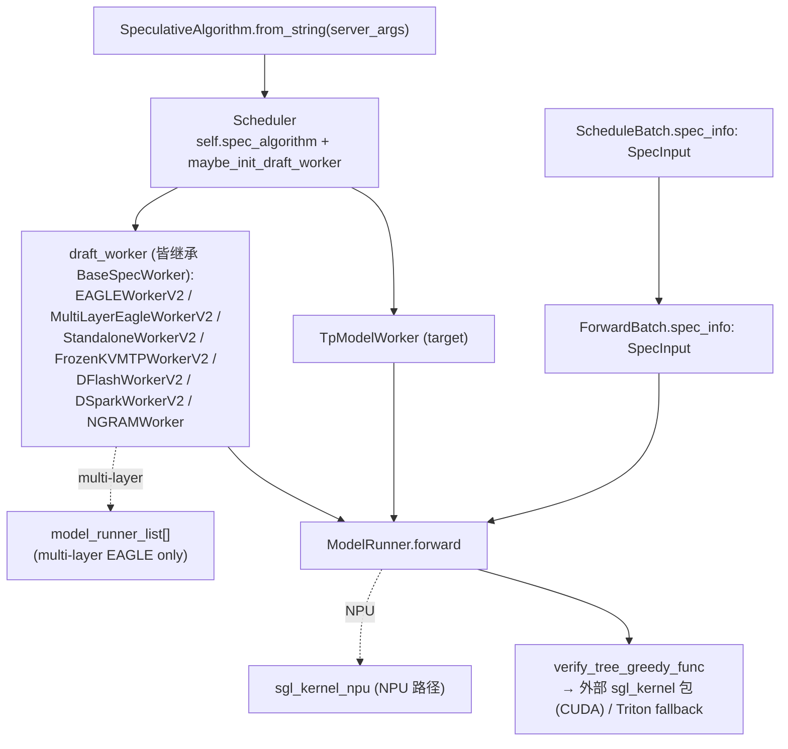

# `srt/speculative` — Speculative decoding（EAGLE / DFlash / N-gram / Standalone / Multi-layer）

## Summary

`srt/speculative/`（HEAD 实测 **48** `.py` 文件 = 34 根 + 12 [`dspark_components/`](d:\design\sglang\python\sglang\srt\speculative\dspark_components) + 2 [`cpp_ngram/`](d:\design\sglang\python\sglang\srt\speculative\cpp_ngram)；~~27 .py~~ 已失效——pin 前大重构 + 本期 +1；**模块根无 `__init__.py`** 论断仍成立）实现 SGLang 投机解码：**算法枚举（8 成员）+ 插件注册 + Worker 工厂**（[spec_info.py:L31-45, L254-307](d:\design\sglang\python\sglang\srt\speculative\spec_info.py)、[spec_registry.py](d:\design\sglang\python\sglang\srt\speculative\spec_registry.py)）+ **draft 前向与树构造**（`eagle_*` / `dflash_*` / `dspark_*` / `frozen_kv_mtp_*` / `ngram_*` 多家族，全部 V2 单轨）+ **`SpecInput` dataclass 注入 `ScheduleBatch` / `ForwardBatch`**（[schedule_batch.py:2141, 2186-2187](d:\design\sglang\python\sglang\srt\managers\schedule_batch.py)、[forward_batch_info.py:435, 472](d:\design\sglang\python\sglang\srt\model_executor\forward_batch_info.py)）+ **验证阶段 `verify_tree_greedy` 调外部 `sgl_kernel` 包**（[eagle_utils.py:374-441](d:\design\sglang\python\sglang\srt\speculative\eagle_utils.py)；~~绑定到仓内 sgl-kernel~~ **sgl-kernel 树已移出本仓库**，另新增 Triton fallback [L341](d:\design\sglang\python\sglang\srt\speculative\eagle_utils.py)）+ **N-gram C++ 扩展**子目录（~~triton_ops/ 子目录~~ 已删除）。

> synthesis: 与 [comparison/topics/speculative-decoding.md](../../comparison/topics/speculative-decoding.md) 一致——MindIE 偏 **Plugin 层 + C++ scheduler placeholder**；vLLM 偏 **`v1/spec_decode/` proposer 包 + worker 侧 `RejectionSampler`**；SGLang 偏 **`SpeculativeAlgorithm` 枚举 + 多型 Worker 工厂 + `SpecInput` dataclass + sgl-kernel CUDA verify**。

> **命名陷阱（与 [model_executor.md](model_executor.md) 一致）**：`srt/model_executor/` 是 worker 内基础设施（≠ vLLM Executor 抽象）；投机解码里 **target 与 draft 都是 `ModelRunner`**，由独立 `TpModelWorker` 实例（单层 EAGLE）或 `model_runner_list` 多 runner（multi-layer EAGLE）承载。

## Sources

| 区域 | 锚点（已按 HEAD `f7101b0a` 校正；~~划线~~ = 已删除） |
|---|---|
| 模块根（48 `.py` + 2 子目录） | [d:\design\sglang\python\sglang\srt\speculative](d:\design\sglang\python\sglang\srt\speculative) |
| 算法枚举 / 工厂 / 插件注册 | [spec_info.py](d:\design\sglang\python\sglang\srt\speculative\spec_info.py)（`SpeculativeAlgorithm` L31-45 / `from_string` L48-61 / `build_disagg_draft_input` L173-193 / `create_worker` L254-307 / `SpecInputType` L309 / `SpecInput` L322）+ [spec_registry.py](d:\design\sglang\python\sglang\srt\speculative\spec_registry.py)（`CustomSpecAlgo` L25 / `register_algorithm` L222） |
| 抽象 Worker | [base_spec_worker.py](d:\design\sglang\python\sglang\srt\speculative\base_spec_worker.py)（`EagleDraftWorkerBase(ABC)` L57 / `BaseSpecWorker(ABC)` L147 / `HiCacheDraftMode` L26） |
| EAGLE（V2 单轨） | ~~eagle_worker.py（V1）~~ **已删**；[eagle_worker_v2.py](d:\design\sglang\python\sglang\srt\speculative\eagle_worker_v2.py)（`EagleDraftWorker(EagleDraftWorkerBase)` L129 / `EAGLEWorkerV2(BaseSpecWorker)` L1011） |
| EAGLE info + utils + draft graph | [eagle_info.py](d:\design\sglang\python\sglang\srt\speculative\eagle_info.py)（`EagleVerifyInput` L16 / `EagleDraftInput` L142 / `EagleDraftExtendInput` L272，纯 dataclass）、~~eagle_info_v2.py~~ **已删**、[eagle_utils.py](d:\design\sglang\python\sglang\srt\speculative\eagle_utils.py)（`verify_tree_greedy_triton` L341 / `verify_tree_greedy_func` L374 / `eagle_prepare_for_verify` L493 / `eagle_sample` L649）、[eagle_draft_cuda_graph_runner.py](d:\design\sglang\python\sglang\srt\speculative\eagle_draft_cuda_graph_runner.py)、[draft_utils.py](d:\design\sglang\python\sglang\srt\speculative\draft_utils.py)（`DraftBackendFactory` L27） |
| Multi-layer EAGLE | ~~multi_layer_eagle_worker.py（V1）~~ **已删**；[multi_layer_eagle_worker_v2.py](d:\design\sglang\python\sglang\srt\speculative\multi_layer_eagle_worker_v2.py)（`MultiLayerEagleDraftWorker` L110 / `mtp_model_runner(step)` L224 / `MultiLayerEagleWorkerV2` L918）、[multi_layer_eagle_utils.py](d:\design\sglang\python\sglang\srt\speculative\multi_layer_eagle_utils.py)、[multi_layer_eagle_draft_extend_cuda_graph_runner.py](d:\design\sglang\python\sglang\srt\speculative\multi_layer_eagle_draft_extend_cuda_graph_runner.py) |
| Standalone | ~~standalone_worker.py（V1）~~ **已删**；[standalone_worker_v2.py](d:\design\sglang\python\sglang\srt\speculative\standalone_worker_v2.py)（`StandaloneDraftWorker(EagleDraftWorker)` L35 / `StandaloneWorkerV2(EAGLEWorkerV2)` L147） |
| Frozen-KV MTP（pin 前新增家族） | [frozen_kv_mtp_worker_v2.py](d:\design\sglang\python\sglang\srt\speculative\frozen_kv_mtp_worker_v2.py)（`FrozenKVMTPDraftWorker(EagleDraftWorkerBase, TpModelWorker)` L91 / `FrozenKVMTPWorkerV2(EAGLEWorkerV2)` L676）+ [frozen_kv_mtp_info.py](d:\design\sglang\python\sglang\srt\speculative\frozen_kv_mtp_info.py) + [frozen_kv_mtp_utils.py](d:\design\sglang\python\sglang\srt\speculative\frozen_kv_mtp_utils.py) + [frozen_kv_mtp_cuda_graph_runner.py](d:\design\sglang\python\sglang\srt\speculative\frozen_kv_mtp_cuda_graph_runner.py) |
| DFLASH | ~~dflash_worker.py（duck-typed）~~ **已删**；[dflash_worker_v2.py](d:\design\sglang\python\sglang\srt\speculative\dflash_worker_v2.py)（`DFlashWorkerV2(BaseSpecWorker)` L168）+ [dflash_info.py](d:\design\sglang\python\sglang\srt\speculative\dflash_info.py) / [dflash_info_v2.py](d:\design\sglang\python\sglang\srt\speculative\dflash_info_v2.py) + [dflash_utils.py](d:\design\sglang\python\sglang\srt\speculative\dflash_utils.py) + [dflash_disaggregation.py](d:\design\sglang\python\sglang\srt\speculative\dflash_disaggregation.py)（**本期新增**） |
| DSpark（pin 前新增家族，12 文件子包） | [dspark_components/](d:\design\sglang\python\sglang\srt\speculative\dspark_components)（`DSparkWorkerV2(BaseSpecWorker)` [dspark_worker_v2.py:L76](d:\design\sglang\python\sglang\srt\speculative\dspark_components\dspark_worker_v2.py) + draft / draft_sampler / verify / planner / config / sps / sts / kv_inject / block_accept_estimator / observability）+ [dspark_disaggregation.py](d:\design\sglang\python\sglang\srt\speculative\dspark_disaggregation.py) |
| N-gram | [ngram_worker.py](d:\design\sglang\python\sglang\srt\speculative\ngram_worker.py)（`NGRAMWorker(BaseSpecWorker)` L71；~~无基类 duck-typed~~ 已改）+ [ngram_info.py](d:\design\sglang\python\sglang\srt\speculative\ngram_info.py) + [external_corpus_manager.py](d:\design\sglang\python\sglang\srt\speculative\external_corpus_manager.py) + [cpp_ngram/](d:\design\sglang\python\sglang\srt\speculative\cpp_ngram)（C++ 扩展，2 .py） |
| ~~Triton ops 子目录~~ | **已删**（pin 前）；DFLASH fused KV materialize 逻辑现聚合在 [dflash_worker_v2.py](d:\design\sglang\python\sglang\srt\speculative\dflash_worker_v2.py) / [dflash_utils.py](d:\design\sglang\python\sglang\srt\speculative\dflash_utils.py) |
| 共享工具 / 新基建 | [spec_utils.py](d:\design\sglang\python\sglang\srt\speculative\spec_utils.py)（`TREE_SPEC_KERNEL_AVAILABLE` L185）、[ragged_verify.py](d:\design\sglang\python\sglang\srt\speculative\ragged_verify.py)、[decoupled_spec_io.py](d:\design\sglang\python\sglang\srt\speculative\decoupled_spec_io.py)、[adaptive_spec_params.py](d:\design\sglang\python\sglang\srt\speculative\adaptive_spec_params.py) / [adaptive_runtime_state.py](d:\design\sglang\python\sglang\srt\speculative\adaptive_runtime_state.py)、[draft_worker_common.py](d:\design\sglang\python\sglang\srt\speculative\draft_worker_common.py)、[eagle_worker_common.py](d:\design\sglang\python\sglang\srt\speculative\eagle_worker_common.py)、[eagle_disaggregation.py](d:\design\sglang\python\sglang\srt\speculative\eagle_disaggregation.py) |
| Scheduler 集成 | [managers/scheduler.py:438, 905-1043](d:\design\sglang\python\sglang\srt\managers\scheduler.py) |
| TpModelWorker 集成 | [managers/tp_worker.py:308-340, 481](d:\design\sglang\python\sglang\srt\managers\tp_worker.py)（`model_runner_list` L334 + `_init_multi_layer_eagle_model_runners` L481） |
| 批数据 | [managers/schedule_batch.py:2141, 2186-2187](d:\design\sglang\python\sglang\srt\managers\schedule_batch.py)、[model_executor/forward_batch_info.py:435, 472](d:\design\sglang\python\sglang\srt\model_executor\forward_batch_info.py) |
| ModelRunner 标记 | [model_executor/model_runner.py:337-339, 353](d:\design\sglang\python\sglang\srt\model_executor\model_runner.py)（`spec_algorithm` 字段 + `draft_model_idx` L299, L353） |
| CLI | [server_args.py:2074-2243](d:\design\sglang\python\sglang\srt\server_args.py)（注解式字段）+ [arg_groups/speculative_hook.py](d:\design\sglang\python\sglang\srt\arg_groups\speculative_hook.py) |
| ~~sgl-kernel CUDA verify 绑定~~ | **sgl-kernel 树已移出本仓库（pin 前）**——`sgl_kernel` 为外部包；srt 侧入口 [eagle_utils.py:386](d:\design\sglang\python\sglang\srt\speculative\eagle_utils.py)（CUDA）/ L57（CPU）/ L415（NPU `sgl_kernel_npu`）/ L341（Triton fallback，无 kernel 包时可用） |

## Architecture / Data flow

**调度持有关系**（锚点已按 HEAD 校正）：[`Scheduler.maybe_init_draft_worker`](d:\design\sglang\python\sglang\srt\managers\scheduler.py:923) 实例化 draft（工厂调用 [L941](d:\design\sglang\python\sglang\srt\managers\scheduler.py)）；[`init_model_worker` L993](d:\design\sglang\python\sglang\srt\managers\scheduler.py) 在启用 spec 时 **`model_worker = draft_worker`**，**`tp_worker` 仍为 target**（资源信息从 [`tp_worker.get_worker_info()` L1043](d:\design\sglang\python\sglang\srt\managers\scheduler.py) 读）。

**verify 主链**（HEAD 校正；~~sgl-kernel 仓内路径~~ **sgl-kernel 树已移出本仓库，`sgl_kernel` 为外部包**）：EAGLE greedy / CPU / NPU / HIP / XPU 路径由 [`eagle_sample` L649](d:\design\sglang\python\sglang\srt\speculative\eagle_utils.py)（判定 [L726](d:\design\sglang\python\sglang\srt\speculative\eagle_utils.py)）调用 [`verify_tree_greedy_func` L374-441](d:\design\sglang\python\sglang\srt\speculative\eagle_utils.py)（callsite [L729](d:\design\sglang\python\sglang\srt\speculative\eagle_utils.py)）→ CUDA 走外部 `sgl_kernel.verify_tree_greedy`（[L386](d:\design\sglang\python\sglang\srt\speculative\eagle_utils.py)）/ NPU 走 `sgl_kernel_npu`（[L415](d:\design\sglang\python\sglang\srt\speculative\eagle_utils.py)）/ 无 kernel 包时 [`verify_tree_greedy_triton` L341](d:\design\sglang\python\sglang\srt\speculative\eagle_utils.py) fallback。**非 greedy** 走 [`tree_speculative_sampling_target_only`](d:\design\sglang\python\sglang\srt\speculative\eagle_utils.py)（callsite [L759, L822](d:\design\sglang\python\sglang\srt\speculative\eagle_utils.py)；DFlash 侧 [dflash_utils.py:L878](d:\design\sglang\python\sglang\srt\speculative\dflash_utils.py)；~~eagle_info.py:49-54 import~~ eagle_info.py 已不再引用该算子——verify 逻辑已从 info dataclass 移入 eagle_utils）。

## File inventory

> [!warning] CONTRADICTION（对 HEAD 而言 stale，2026-08-18 verify 标记）：下表是 pin 前旧清单（27 文件口径）。HEAD 实测 **48 .py**：V1 worker 文件（`eagle_worker.py` / `multi_layer_eagle_worker.py` / `standalone_worker.py` / `dflash_worker.py` / `eagle_info_v2.py`）与 `triton_ops/` 已删；新增 DSpark 子包（12 文件）、Frozen-KV MTP 家族（4 文件）、`spec_registry.py` / `ragged_verify.py` / `decoupled_spec_io.py` / `adaptive_*`（2）/ `draft_worker_common.py` / `eagle_worker_common.py` / `*_disaggregation.py`（3）等。HEAD 权威清单见上方 §Sources 表；本表保留供历史对照，完整重建留待 re-ingest。

| 分组 | 文件 | 角色 |
|---|---|---|
| **算法枚举 / 抽象** | [spec_info.py](d:\design\sglang\python\sglang\srt\speculative\spec_info.py)、[base_spec_worker.py](d:\design\sglang\python\sglang\srt\speculative\base_spec_worker.py) | `SpeculativeAlgorithm` enum / `SpecInput` 抽象 / `BaseSpecWorker` |
| **EAGLE 单层** | [eagle_worker.py](d:\design\sglang\python\sglang\srt\speculative\eagle_worker.py)、[eagle_worker_v2.py](d:\design\sglang\python\sglang\srt\speculative\eagle_worker_v2.py)、[eagle_info.py](d:\design\sglang\python\sglang\srt\speculative\eagle_info.py)、[eagle_info_v2.py](d:\design\sglang\python\sglang\srt\speculative\eagle_info_v2.py)、[eagle_utils.py](d:\design\sglang\python\sglang\srt\speculative\eagle_utils.py)、[eagle_draft_cuda_graph_runner.py](d:\design\sglang\python\sglang\srt\speculative\eagle_draft_cuda_graph_runner.py)、[draft_utils.py](d:\design\sglang\python\sglang\srt\speculative\draft_utils.py) | 单层 draft / verify / CUDA 图 |
| **Multi-layer EAGLE** | [multi_layer_eagle_worker.py](d:\design\sglang\python\sglang\srt\speculative\multi_layer_eagle_worker.py)、[multi_layer_eagle_worker_v2.py](d:\design\sglang\python\sglang\srt\speculative\multi_layer_eagle_worker_v2.py)、[multi_layer_eagle_utils.py](d:\design\sglang\python\sglang\srt\speculative\multi_layer_eagle_utils.py)、[multi_layer_eagle_draft_extend_cuda_graph_runner.py](d:\design\sglang\python\sglang\srt\speculative\multi_layer_eagle_draft_extend_cuda_graph_runner.py) | 多 `ModelRunner` 分步 draft；`mtp_model_runner` 按 layer 索引 |
| **Standalone** | [standalone_worker.py](d:\design\sglang\python\sglang\srt\speculative\standalone_worker.py)、[standalone_worker_v2.py](d:\design\sglang\python\sglang\srt\speculative\standalone_worker_v2.py) | 独立 draft 模型路径 |
| **DFLASH** | [dflash_worker.py](d:\design\sglang\python\sglang\srt\speculative\dflash_worker.py)、[dflash_info.py](d:\design\sglang\python\sglang\srt\speculative\dflash_info.py)、[dflash_utils.py](d:\design\sglang\python\sglang\srt\speculative\dflash_utils.py) | DFLASH 算法（**非** TpModelWorker 子类） |
| **N-gram** | [ngram_worker.py](d:\design\sglang\python\sglang\srt\speculative\ngram_worker.py)、[ngram_info.py](d:\design\sglang\python\sglang\srt\speculative\ngram_info.py)、[external_corpus_manager.py](d:\design\sglang\python\sglang\srt\speculative\external_corpus_manager.py)、[cpp_ngram/](d:\design\sglang\python\sglang\srt\speculative\cpp_ngram) | NGRAM + 语料 + C++ 扩展 |
| **共享 / Triton** | [spec_utils.py](d:\design\sglang\python\sglang\srt\speculative\spec_utils.py)、[triton_ops/fused_kv_materialize.py](d:\design\sglang\python\sglang\srt\speculative\triton_ops\fused_kv_materialize.py)、[triton_ops/__init__.py](d:\design\sglang\python\sglang\srt\speculative\triton_ops\__init__.py) | topk / bitmask / draft TP；DFLASH KV 融合 |

> 注：模块根目录 **无** `__init__.py`，导入以子模块路径为准（如 `sglang.srt.speculative.spec_info`）。

## `SpeculativeAlgorithm` enum / dispatcher

[`SpeculativeAlgorithm`](d:\design\sglang\python\sglang\srt\speculative\spec_info.py) **8 成员**（~~6 成员~~ 已失效：pin 前新增 `DSPARK` / `FROZEN_KV_MTP`）：

| 成员 | 锚点 |
|---|---|
| `DFLASH` | [L38](d:\design\sglang\python\sglang\srt\speculative\spec_info.py) |
| `DSPARK`（**pin 前新增**，#31847） | [L39](d:\design\sglang\python\sglang\srt\speculative\spec_info.py) |
| `EAGLE` | [L40](d:\design\sglang\python\sglang\srt\speculative\spec_info.py) |
| `EAGLE3` | [L41](d:\design\sglang\python\sglang\srt\speculative\spec_info.py) |
| `FROZEN_KV_MTP`（**pin 前新增**） | [L42](d:\design\sglang\python\sglang\srt\speculative\spec_info.py) |
| `STANDALONE` | [L43](d:\design\sglang\python\sglang\srt\speculative\spec_info.py) |
| `NGRAM` | [L44](d:\design\sglang\python\sglang\srt\speculative\spec_info.py) |
| `NONE` | [L45](d:\design\sglang\python\sglang\srt\speculative\spec_info.py) |

另有**插件算法**：非内建名字经 [`spec_registry.py` `_get_registered_spec`](d:\design\sglang\python\sglang\srt\speculative\spec_registry.py) 解析为 `CustomSpecAlgo` 实例（[L25](d:\design\sglang\python\sglang\srt\speculative\spec_registry.py)），与枚举成员暴露相同 `is_*()` / `create_worker` 接口（[spec_info.py:L32-35 docstring](d:\design\sglang\python\sglang\srt\speculative\spec_info.py)）。

**调度入口**：[`from_string`](d:\design\sglang\python\sglang\srt\speculative\spec_info.py:L48-61)（内建查不到→查插件注册表→`ValueError`）；**Worker 分发**：[`create_worker`](d:\design\sglang\python\sglang\srt\speculative\spec_info.py:L254-307)——~~算法 × overlap × multi_layer 三维路由~~ **已失效**，现只按算法一维分发（V2 worker 同时驱动 overlap / 非 overlap）：

| 算法 | multi_layer | → Worker 类 |
|---|---|---|
| `DFLASH` | — | `DFlashWorkerV2` |
| `DSPARK` | — | `DSparkWorkerV2` |
| `FROZEN_KV_MTP` | — | `FrozenKVMTPWorkerV2` |
| `EAGLE` / `EAGLE3` | enabled | `MultiLayerEagleWorkerV2` |
| `EAGLE` / `EAGLE3` | disabled | `EAGLEWorkerV2` |
| `STANDALONE` | — | `StandaloneWorkerV2` |
| `NGRAM` | — | `NGRAMWorker` |

**CLI 别名**：`NEXTN` 规范化逻辑已随 server_args 重构迁入 [`arg_groups/speculative_hook.py:30-52`](d:\design\sglang\python\sglang\srt\arg_groups\speculative_hook.py)（`SpeculativeAlgorithm` 仍无 `NEXTN` 成员），且语义扩展：**NEXTN/EAGLE 对 Gemma4 assistant draft 会解析为 `FROZEN_KV_MTP`**（[L30 docstring](d:\design\sglang\python\sglang\srt\arg_groups\speculative_hook.py)）。

## `EAGLEWorker` / draft model integration

> [!warning] CONTRADICTION（对 HEAD 而言 stale，2026-08-18 verify 标记）：~~`class EAGLEWorker(TpModelWorker)`~~ V1 继承路线已删（`eagle_worker.py` 文件不存在）。HEAD 结构：draft 真模型由 [`EagleDraftWorker(EagleDraftWorkerBase)`](d:\design\sglang\python\sglang\srt\speculative\eagle_worker_v2.py) [L129] 承载，顶层 [`EAGLEWorkerV2(BaseSpecWorker)`](d:\design\sglang\python\sglang\srt\speculative\eagle_worker_v2.py) [L1011] 组合之；Frozen-KV MTP 的 draft worker 是唯一保留 `TpModelWorker` 多继承的（[`FrozenKVMTPDraftWorker(EagleDraftWorkerBase, TpModelWorker)` L91](d:\design\sglang\python\sglang\srt\speculative\frozen_kv_mtp_worker_v2.py)）。

- **调度持有**（HEAD 校正）：[scheduler.py:905](d:\design\sglang\python\sglang\srt\managers\scheduler.py) `init_tp_model_worker` 构造 target；[L923](d:\design\sglang\python\sglang\srt\managers\scheduler.py) `maybe_init_draft_worker` 构造 draft（[L941](d:\design\sglang\python\sglang\srt\managers\scheduler.py) `DraftWorkerClass = self.spec_algorithm.create_worker(...)`）；[L993 `init_model_worker`](d:\design\sglang\python\sglang\srt\managers\scheduler.py) 在启用 spec 时 `self.model_worker = draft_worker`，但资源信息从 [`self.tp_worker.get_worker_info()` L1043](d:\design\sglang\python\sglang\srt\managers\scheduler.py) 读（target）——**此论断仍成立**。

> ~~synthesis: **DFlash / NGRAM 不是 TpModelWorker 子类**（duck-typed）—— "独立 TpModelWorker" 仅适用于 EAGLE 系。~~ **已失效（pin 前，2026-08-18 标注）**：现所有 spec worker（含 DFlash / DSpark / NGRAM）统一继承 [`BaseSpecWorker`](d:\design\sglang\python\sglang\srt\speculative\base_spec_worker.py) [L147]；"subclass vs duck-typed" 的二分不复存在。

## Multi-layer EAGLE

- **触发**：[`spec_info.create_worker`](d:\design\sglang\python\sglang\srt\speculative\spec_info.py:L286-292) 在 `is_eagle() and server_args.enable_multi_layer_eagle` 时返回 `MultiLayerEagleWorkerV2`（~~V1 `MultiLayerEagleWorker`~~ 已删）。
- **`model_runner_list`**：[`TpModelWorker._init_multi_layer_eagle_model_runners`](d:\design\sglang\python\sglang\srt\managers\tp_worker.py:481)（字段 [L334](d:\design\sglang\python\sglang\srt\managers\tp_worker.py)，调用点 [L340](d:\design\sglang\python\sglang\srt\managers\tp_worker.py)）追加多个 `ModelRunner`，[`draft_model_idx`](d:\design\sglang\python\sglang\srt\model_executor\model_runner.py:299) 分层——**该机制在 HEAD 仍在**。
- **按层访问**：[`mtp_model_runner(step)`](d:\design\sglang\python\sglang\srt\speculative\multi_layer_eagle_worker_v2.py:224) → `draft_runner_list[...]`（[L171](d:\design\sglang\python\sglang\srt\speculative\multi_layer_eagle_worker_v2.py) `draft_runner_list = draft_worker.model_runner_list`；~~multi_layer_eagle_worker.py:236-237~~ 文件已删，方法迁至 V2）。

> synthesis: 与单层 EAGLE 单 `draft_model_runner` 不同，multi-layer 在**同一 draft worker 进程内**维护**多条 `ModelRunner` 链**，用于多步 MTP 结构。这是 [comparison/topics/executor-worker.md §10](../../comparison/topics/executor-worker.md) 第 3 个 anchor 提到的"draft model runner 持有位置差异"中 **SGLang 在 worker 层共享多个 ModelRunner** 的精确实现。

## Verify kernel（sgl-kernel 跨语言绑定）

> [!warning] CONTRADICTION（对 HEAD 而言 stale，2026-08-18 verify 标记）：**sgl-kernel 源码树已移出本仓库（pin `06f32bab` 时即已不在 `git ls-tree` 中）**，`sgl_kernel` / `sgl_kernel_npu` 均为外部安装包。下表中 `d:\design\sglang\sgl-kernel\...` 的 C++/CUDA 锚点全部失效（划线保留供历史对照）；srt 侧 Python 入口锚点已按 HEAD 校正。

| 层级 | 锚点 |
|---|---|
| Python 包装 | [`verify_tree_greedy_func` L374-441](d:\design\sglang\python\sglang\srt\speculative\eagle_utils.py)：CUDA/HIP 走 sgl_kernel（[L386](d:\design\sglang\python\sglang\srt\speculative\eagle_utils.py)）；NPU 走 sgl_kernel_npu（[L415](d:\design\sglang\python\sglang\srt\speculative\eagle_utils.py)）；CPU torch 实现 [L57](d:\design\sglang\python\sglang\srt\speculative\eagle_utils.py)；**新增 Triton fallback** [`verify_tree_greedy_triton` L341](d:\design\sglang\python\sglang\srt\speculative\eagle_utils.py) |
| Python `torch.ops` 入口 | ~~[sgl_kernel/speculative.py:38-57]~~ **仓内文件已不存在**（外部 `sgl_kernel` 包内） |
| C++ 注册 | ~~[csrc/common_extension.cc:255-259]~~ **仓内文件已不存在** |
| CUDA 实现 | ~~[csrc/speculative/eagle_utils.cu:323-331]~~ **仓内文件已不存在** |

**主调用点**：~~[`EagleVerifyInput` 路径](d:\design\sglang\python\sglang\srt\speculative\eagle_info.py:317-330)~~ eagle_info.py 已纯 dataclass 化，verify 调用移至 [`eagle_sample` L649 → L729](d:\design\sglang\python\sglang\srt\speculative\eagle_utils.py)；kernel 可用性判定见 [`TREE_SPEC_KERNEL_AVAILABLE`](d:\design\sglang\python\sglang\srt\speculative\spec_utils.py) [L185]。

> synthesis: **`verify_tree_greedy` 是 SGLang 第二个已确认的 sgl-kernel C++ 算子绑定**（第一个是 [`shm_allreduce`](../modules/distributed.md)，详 [sglang/modules/distributed.md §跨子系统引用](distributed.md)）—— 反驳了"SGLang 全 Python 无 C++ 算子"的初步假设。该论断在 HEAD 仍成立，但绑定形式已从"仓内 sgl-kernel 子树"变为"外部 pip 包"，仓库内只剩 Python 调用面。

## `SpecInput` dataclass / `spec_info` 字段

源码中 **批字段名为 `spec_info`**（不是 `SpecInfo`），类型为 **`SpecInput` 子类**（如 `EagleDraftInput` / `EagleVerifyInput`）。

- **抽象基类**：[`class SpecInput(ABC)` L322](d:\design\sglang\python\sglang\srt\speculative\spec_info.py)（~~L135-166~~ 行号漂移）；`SpecInputType` 区分 draft/verify（[L309](d:\design\sglang\python\sglang\srt\speculative\spec_info.py)）。
- **批字段**：[ScheduleBatch](d:\design\sglang\python\sglang\srt\managers\schedule_batch.py) `spec_algorithm` [L2141] + `spec_info` [L2186-2187]；[ForwardBatch](d:\design\sglang\python\sglang\srt\model_executor\forward_batch_info.py) 同名两字段（`spec_algorithm` [L435] / `spec_info` [L472]）。
- **工厂复制**：[`ForwardBatch.init_new`](d:\design\sglang\python\sglang\srt\model_executor\forward_batch_info.py) 传入 `spec_algorithm` [L790] 与 `spec_info` [L804]。

## ~~Triton ops 子目录~~（已删除，pin 前）

> [!warning] CONTRADICTION（对 HEAD 而言 stale，2026-08-18 verify 标记）：~~[`triton_ops/`] 仅 1 个真实 op `FusedKVMaterializeHelper`~~ **`triton_ops/` 子目录已整体删除**（pin 前重构）；DFLASH fused KV materialize 逻辑现聚合在 [dflash_worker_v2.py](d:\design\sglang\python\sglang\srt\speculative\dflash_worker_v2.py) / [dflash_utils.py](d:\design\sglang\python\sglang\srt\speculative\dflash_utils.py)。

> synthesis: 原论断"`triton_ops/` ≠ `verify_tree_greedy` 的 Triton 实现"的方向在 HEAD 反转了——**现在 `verify_tree_greedy` 反而有了 srt 内 Triton fallback**（[eagle_utils.py:L341](d:\design\sglang\python\sglang\srt\speculative\eagle_utils.py)），而独立 Triton 子目录不复存在。

## CLI / config 字段族

> 注（2026-08-18 verify）：server_args 已重构为**注解式字段**（`A[...]` 声明，argparse 由注解自动生成），旧的 `add_argument` 行号锚点全部失效；下表已按 HEAD 字段声明行校正。规范化逻辑从 `ServerArgs._handle_speculative_decoding` 迁出至 [`arg_groups/speculative_hook.py`](d:\design\sglang\python\sglang\srt\arg_groups\speculative_hook.py)。

| 字段 | 锚点 |
|---|---|
| `speculative_algorithm` | [server_args.py:L2074](d:\design\sglang\python\sglang\srt\server_args.py) |
| `speculative_draft_model_path` / `_revision` / `_load_format` | [L2079, L2087, L2092](d:\design\sglang\python\sglang\srt\server_args.py) |
| `speculative_num_steps` | [L2100](d:\design\sglang\python\sglang\srt\server_args.py)（multi-layer EAGLE 链长） |
| `speculative_eagle_topk` | [L2105](d:\design\sglang\python\sglang\srt\server_args.py) |
| `speculative_num_draft_tokens` | [L2110](d:\design\sglang\python\sglang\srt\server_args.py) |
| `speculative_dflash_block_size` | [L2115](d:\design\sglang\python\sglang\srt\server_args.py) |
| `speculative_dspark_*`（block_size / sps_table / confidence_sts / align_verify，**pin 前新增族**） | [L2120-2143](d:\design\sglang\python\sglang\srt\server_args.py) |
| `speculative_accept_threshold_single` / `_acc` | [L2155, L2160](d:\design\sglang\python\sglang\srt\server_args.py) |
| `speculative_token_map` | [L2170](d:\design\sglang\python\sglang\srt\server_args.py) |
| `speculative_attention_mode` | [L2173](d:\design\sglang\python\sglang\srt\server_args.py) |
| `speculative_draft_attention_backend` | [L2182](d:\design\sglang\python\sglang\srt\server_args.py) |
| `speculative_draft_window_size`（CLI 名 `--speculative-dflash-draft-window-size`，[L8757-8759](d:\design\sglang\python\sglang\srt\server_args.py)） | [L2201](d:\design\sglang\python\sglang\srt\server_args.py) |
| `speculative_moe_runner_backend` / `_moe_a2a_backend` | [L2206, L2215](d:\design\sglang\python\sglang\srt\server_args.py) |
| `speculative_draft_model_quantization` | [L2224](d:\design\sglang\python\sglang\srt\server_args.py) |
| `speculative_ngram_*`（min/max bfs / match_type / trie / capacity / external corpus 等） | [L2300-2334](d:\design\sglang\python\sglang\srt\server_args.py) |
| 规范化逻辑 | ~~`_handle_speculative_decoding`（server_args.py:3107-3134）~~ → [`handle_speculative_decoding` L64](d:\design\sglang\python\sglang\srt\arg_groups\speculative_hook.py)，分算法子 handler：`_handle_dflash` [L147] / `_handle_dspark` [L278] / `_handle_frozen_kv_mtp` [L528] / `_handle_eagle_family` [L543] / `_handle_ngram` [L702]，别名解析 `_resolve_speculative_algorithm_alias` [L24] |

## Scheduler / TpModelWorker integration

| 机制 | 锚点 |
|---|---|
| Scheduler 读取算法 | [`self.spec_algorithm = SpeculativeAlgorithm.from_string(...)`](d:\design\sglang\python\sglang\srt\managers\scheduler.py:438) |
| 实例化 draft | [`maybe_init_draft_worker` L923](d:\design\sglang\python\sglang\srt\managers\scheduler.py) → [`DraftWorkerClass = self.spec_algorithm.create_worker(...)` L941](d:\design\sglang\python\sglang\srt\managers\scheduler.py) |
| `model_worker` vs `tp_worker` | [`init_model_worker` L993](d:\design\sglang\python\sglang\srt\managers\scheduler.py)（资源信息读 target：[`tp_worker.get_worker_info()` L1043](d:\design\sglang\python\sglang\srt\managers\scheduler.py)） |
| TpModelWorker 上 multi-layer 列表 | [`model_runner_list` L334](d:\design\sglang\python\sglang\srt\managers\tp_worker.py)、[`_init_multi_layer_eagle_model_runners` L481](d:\design\sglang\python\sglang\srt\managers\tp_worker.py)（`is_draft_worker` 字段 [L308, L321](d:\design\sglang\python\sglang\srt\managers\tp_worker.py)） |
| ModelRunner 记录算法 | [`self.spec_algorithm = SpeculativeAlgorithm.from_string` L337-339](d:\design\sglang\python\sglang\srt\model_executor\model_runner.py)、`draft_model_idx` [L299, L353](d:\design\sglang\python\sglang\srt\model_executor\model_runner.py) |

## §跨子系统引用（§5 step 3）

按 [AGENTS.md §5 step 3](../../AGENTS.md#5-ingest-工作流) 5 类全仓库 grep。

### 1. 跨语言绑定（C++ / sgl-kernel）

> 注（2026-08-18 verify）：**sgl-kernel 树已移出本仓库**（pin `06f32bab` 时即不在 `git ls-tree`），下列 `d:\design\sglang\sgl-kernel\...` 锚点与"全 C++ 树 grep"范围随之失效——C++ 侧证据只能在外部 `sgl_kernel` 包仓库中复核。

- **`verify_tree_greedy` C++ 算子**：srt 侧入口 [eagle_utils.py:L386（CUDA）/ L415（NPU）](d:\design\sglang\python\sglang\srt\speculative\eagle_utils.py)；~~[sgl-kernel/python/sgl_kernel/speculative.py:38-57] → [csrc/common_extension.cc:255-259] → CUDA [eagle_utils.cu:323]~~ **仓内路径已不存在（外部包）**
- **`tree_speculative_sampling_target_only`**：同外部 sgl_kernel CUDA 路径（import：[eagle_utils.py:L759](d:\design\sglang\python\sglang\srt\speculative\eagle_utils.py)、[dflash_utils.py:L46](d:\design\sglang\python\sglang\srt\speculative\dflash_utils.py)；~~eagle_info.py:49-54~~ 已不再引用）
- **`SpeculativeAlgorithm` / worker 类 / `SpecInput`**：~~在 sgl-kernel 全 C++ 树 grep 0 命中~~ **该 grep 范围已随 sgl-kernel 外移失效**；srt Python 树内无其它 C++ 绑定入口（capsule / ctypes 均 0 命中，cpp_ngram 除外）
- **N-gram C++ 扩展**：[cpp_ngram/](d:\design\sglang\python\sglang\srt\speculative\cpp_ngram) 是模块内独立 C++ 扩展，与 sgl-kernel 解耦（独立 .clang-format）——**HEAD 仍在**

### 2. 协作伙伴跨子系统引用

`SpeculativeAlgorithm` 全仓库 grep（非穷举）：[model_executor/model_runner.py](d:\design\sglang\python\sglang\srt\model_executor\model_runner.py) / [forward_batch_info.py](d:\design\sglang\python\sglang\srt\model_executor\forward_batch_info.py) / [managers/schedule_batch.py](d:\design\sglang\python\sglang\srt\managers\schedule_batch.py) / [managers/scheduler.py](d:\design\sglang\python\sglang\srt\managers\scheduler.py) / [managers/tokenizer_manager.py](d:\design\sglang\python\sglang\srt\managers\tokenizer_manager.py) / [layers/communicator.py](d:\design\sglang\python\sglang\srt\layers\communicator.py) / [layers/moe/token_dispatcher/flashinfer.py](d:\design\sglang\python\sglang\srt\layers\moe\token_dispatcher\flashinfer.py) / [models/deepseek_v2.py](d:\design\sglang\python\sglang\srt\models\deepseek_v2.py) 等。

### 3. 配置 / 共享数据结构

- **主真相源**：[`ServerArgs`](d:\design\sglang\python\sglang\srt\server_args.py) `speculative_*` 字段族（见上 CLI 表）
- **集中 yaml/json deployment 表**：在 [`d:\design\sglang\config\`](d:\design\sglang) 不存在；benchmark skill 内有示例（如 [.claude/skills/sglang-auto-benchmark/references/qwen3-32b.yaml](d:\design\sglang\.claude\skills\sglang-auto-benchmark\references\qwen3-32b.yaml)），非运行时默认配置

### 4. 测试覆盖反查

| 路径 | 范围 |
|---|---|
| [`d:\design\sglang\test\registered\spec\`](d:\design\sglang\test\registered\spec) | `test_standalone_speculative_decoding.py`、`test_ngram_speculative_decoding.py` 等 |
| [`d:\design\sglang\python\sglang\test\speculative\`](d:\design\sglang\python\sglang\test\speculative) | `test_spec_utils.py` 等 |
| ~~[`d:\design\sglang\sgl-kernel\tests\speculative\`]~~ | ~~`test_eagle_utils.py`（`verify_tree_greedy`）、`test_speculative_sampling.py`~~ **已随 sgl-kernel 树移出本仓库（2026-08-18 标注）** |

### 5. doc / config / yaml 反查

- 多文件提及 `--speculative-*` 与 EAGLE / NEXTN：[docs/platforms/ascend/ascend_npu_support_features.md](d:\design\sglang\docs\platforms\ascend\ascend_npu_support_features.md)、[docs/platforms/tpu.md](d:\design\sglang\docs\platforms\tpu.md)
- [docs/index.rst:47](d:\design\sglang\docs\index.rst) 链接 `advanced_features/speculative_decoding.ipynb`

## 跨项目对照（synthesis）

| 维度 | MindIE | vLLM | SGLang（本模块） |
|---|---|---|---|
| 包路径 | [`text_generator/plugins/{mtp,la,memory_decoding}/`](d:\design\MindIE-LLM\mindie_llm\text_generator\plugins) | [`v1/spec_decode/`](d:\design\vllm\vllm\v1\spec_decode)（实测 11 .py，与对比页"12"略有差异）+ [`v1/worker/gpu/spec_decode/eagle/`](d:\design\vllm\vllm\v1\worker\gpu\spec_decode\eagle) | `srt/speculative/` **48** .py + 2 子目录（dspark_components + cpp_ngram；~~27 .py / triton_ops~~ 2026-08-18 校正） |
| 算法枚举 | `plugin_list` 字符串 | `SpeculativeMethod` Literal | `SpeculativeAlgorithm` enum **8 成员**（~~6~~）+ `CustomSpecAlgo` 插件 |
| Draft 模型集成 | C++ scheduler `speculationGamma` placeholder | `SpecDecodeBaseProposer` 派生 | ~~EAGLE 系是 TpModelWorker 子类；DFlash / NGRAM 不是~~ **全部 worker 统一继承 `BaseSpecWorker`，draft 模型经组合持有**（2026-08-18 校正）；Multi-layer 用 `model_runner_list` |
| Verify 机制 | C++ + Plugin | RejectionSampler 三模式 | **`sgl_kernel.verify_tree_greedy` CUDA kernel**（外部包；srt 内另有 Triton fallback） |
| Scheduler 占位 | C++ placeholder token | `scheduled_spec_decode_tokens` dict + `num_output_placeholders` int | `SpecInput` dataclass + `spec_algorithm` 字段 |

详细 9 子维度对比见 [comparison/topics/speculative-decoding.md](../../comparison/topics/speculative-decoding.md)；维度索引 [comparison/dimensions.md §dim-spec](../../comparison/dimensions.md)。

## Increment 2026-08-18 (06f32bab → f7101b0a)

本期 `speculative/` 子树 30 文件 / 约 1082 行 churn（另叠加一层**pin 前即已发生但本页从未反映的大重构**——V1 worker 删除、DSpark / Frozen-KV MTP 家族加入、sgl-kernel 外移，见上文各节划线标注；本节只列 `06f32bab..f7101b0a` 增量）：

- **计数校正**：`.py` 文件数 HEAD 实测 **48**（`find python/sglang/srt/speculative -name '*.py' | wc -l`；本页旧口径 27 / index 旧标注 47——本期 +1 即 [dflash_disaggregation.py](d:\design\sglang\python\sglang\srt\speculative\dflash_disaggregation.py)）；`SpeculativeAlgorithm` enum 成员 **8**（[spec_info.py:L38-45](d:\design\sglang\python\sglang\srt\speculative\spec_info.py)；本页旧口径 6，pin 前已增 `DSPARK` / `FROZEN_KV_MTP`）。
- **新文件 `dflash_disaggregation.py`**（+32 行，#33676 NPU DSpark 系列）：提供 [`build_dflash_family_disagg_draft_input` L16](d:\design\sglang\python\sglang\srt\speculative\dflash_disaggregation.py)，为 DFlash 投机与 PD 分离结合预留 draft input 构造。
  > [!todo] VERIFY: 该函数在 HEAD Python 树内 grep 0 命中调用方（[spec_info.py `build_disagg_draft_input` L173-193](d:\design\sglang\python\sglang\srt\speculative\spec_info.py) 仍只分发 EAGLE / DSPARK，DFlash 返回 None）——疑为预埋基建或 NPU 外部平台调用，下轮 increment 复查。
- **#35198 "Relay ngram accept tokens through the FutureMap"**：[ngram_worker.py](d:\design\sglang\python\sglang\srt\speculative\ngram_worker.py)（+58/-40）改为把 accept tokens 经 `FutureMap` 中继给 overlap 调度，消除 NGRAM 路径的特判。
- **#34696 "Support logprobs with DSpark"**：[dspark_components/dspark_worker_v2.py](d:\design\sglang\python\sglang\srt\speculative\dspark_components\dspark_worker_v2.py)（+66/-35）补 DSpark 的 logprobs 输出。
- **#35059 / #34916 shared-read 重命名**：WAR read-done fastpath → shared-read-done；[model_executor/runner_utils/shared_read_event.py](d:\design\sglang\python\sglang\srt\model_executor\runner_utils\shared_read_event.py)（由 `war_event.py` 改名），shared-read ends 改由 attention backend 声明单独解析。
- **#35024 "size the speculative buffers from the bags"**：投机 buffer 尺寸改从 config-bag 读取而非启动记录（`draft_utils.py` +167/-72 的主体，含 [`DraftBackendFactory` L27](d:\design\sglang\python\sglang\srt\speculative\draft_utils.py)）。
- **dflash_utils.py +217 行**：新增 `DFlashDraftConfig` / `parse_dflash_draft_config` / `can_dflash_use_fused_qkv_proj` 及 NPU top-k/p renorm 等（[dflash_utils.py](d:\design\sglang\python\sglang\srt\speculative\dflash_utils.py)）；[dflash_worker_v2.py](d:\design\sglang\python\sglang\srt\speculative\dflash_worker_v2.py) +74/-14 配套。
- synthesis: 本期改动主题是**把各算法族的 overlap / disagg / logprobs 特判收敛到统一基建**（FutureMap、config-bag、shared-read 声明式解析），而非新增算法族——8 成员 enum 本期无增减。

## Notes / Caveats

> [!todo] VERIFY: ~~pin 从 `34fef07a` → `06f32bab`（2026-08-10 increment）后本页未深 verify；文件数量/行号可能漂移。优先对照 [entities/Scheduler.md](../entities/Scheduler.md) / 新模块页。~~
> **RESOLVED 2026-08-18**: 本轮 increment pass 已对全页锚点逐一核对至 HEAD `f7101b0a`；pin 前大重构（V1 删除 / DSpark / Frozen-KV MTP / sgl-kernel 外移）已在各节以划线 + CONTRADICTION 标注。File inventory 表的完整重建留待 re-ingest。

> [!todo] VERIFY: ~~[comparison/topics/speculative-decoding.md](../../comparison/topics/speculative-decoding.md) TL;DR 写"`srt/speculative/` 24 文件"——本轮 Glob 实测 **27** `.py`。可能上游已新增 `*_v2.py`（V2 系列：`eagle_worker_v2.py` / `multi_layer_eagle_worker_v2.py` / `standalone_worker_v2.py` / `eagle_info_v2.py`）+ DFLASH 全家族。建议下次 verify pass 主动 sync compare 页数字。~~
> **RESOLVED 2026-04-19**: 实测仍为 **27** `.py` — 23 个根目录 + 2 个 `triton_ops/` + 2 个 `cpp_ngram/`（[`d:\design\sglang\python\sglang\srt\speculative\`](d:\design\sglang\python\sglang\srt\speculative)）。**[comparison/topics/speculative-decoding.md L80](d:\design\wiki\comparison\topics\speculative-decoding.md) 的 "24 文件" 数字已过期**，留待 lint pass / 该 compare 页下次 verify 主动 sync（本次 verify 任务范围为 6 个模块页，不修改 comparison 页）。
> **再更新 2026-08-18**: HEAD `f7101b0a` 实测 **48** `.py`（34 根 + 12 dspark_components + 2 cpp_ngram；triton_ops/ 已删）。comparison 页数字仍待 sync。

> [!todo] VERIFY: ~~vLLM `v1/spec_decode/` 文件数——对比页或旧材料写"12"，本轮交叉对照实测 **11**。建议下次 verify pass 主动 sync。~~
> **RESOLVED 2026-04-19**: 实测 [`d:\design\vllm\vllm\v1\spec_decode\`](d:\design\vllm\vllm\v1\spec_decode) 仍为 **11** `.py`（`utils.py` / `suffix_decoding.py` / `ngram_proposer_gpu.py` / `ngram_proposer.py` / `metadata.py` / `medusa.py` / `metrics.py` / `eagle.py` / `extract_hidden_states.py` / `draft_model.py` / `dflash.py`）。compare 页 L80 / L439 等仍写 "12"，与 SGLang 数字同列待下次 sync。

> [!todo] VERIFY: ~~`DFlashWorker` / `NGRAMWorker` **非** `TpModelWorker` 子类（[dflash_worker.py:50-51](d:\design\sglang\python\sglang\srt\speculative\dflash_worker.py)、[ngram_worker.py:25-26](d:\design\sglang\python\sglang\srt\speculative\ngram_worker.py)）—— 那它们怎么走 `Scheduler.init_model_worker` 的"`model_worker = draft_worker`" 替换？是否有继承 chain 中间层？需查证。~~
> **RESOLVED 2026-04-19**: **无继承 chain 中间层**——两者直接 `class DFlashWorker:` ([dflash_worker.py L50](d:\design\sglang\python\sglang\srt\speculative\dflash_worker.py)) / `class NGRAMWorker:` ([ngram_worker.py L25](d:\design\sglang\python\sglang\srt\speculative\ngram_worker.py))，**不**继承 TpModelWorker。**duck-typing 实现协议**：构造时收 `target_worker: TpModelWorker` 并 `self.model_runner = target_worker.model_runner`（[dflash_worker.py L73-L74](d:\design\sglang\python\sglang\srt\speculative\dflash_worker.py)、[ngram_worker.py L38-L39](d:\design\sglang\python\sglang\srt\speculative\ngram_worker.py)）。**关键发现**：`Scheduler.init_model_worker` 实际上从 **`self.tp_worker.get_worker_info()`**（**target**！[scheduler.py L705](d:\design\sglang\python\sglang\srt\managers\scheduler.py)）读取 `max_total_num_tokens` / `max_running_requests` / `forward_stream` 等，**不**从 `model_worker`。`model_worker = draft_worker` 仅控制后续 forward 派发；DFlash/NGRAM 只需暴露 `model_runner` / `forward_batch_generation` / 等被 forward 路径调用的属性即可，无需 KV pool / token 容量等基础设施。EAGLE 系做完整 TpModelWorker 子类是因为 **draft 有独立 KV pool**；DFlash 共享 target KV pool（compact draft cache 时另开私有 req→token 表）；NGRAM 是 **CPU 算法**，根本不要 model 前向。

> [!warning] CONTRADICTION（命名陷阱）：~~comparison/topics/speculative-decoding.md 顶层 synthesis "SGLang draft 用独立 TpModelWorker" **仅适用于 EAGLE 系**——DFlash / NGRAM 走另一条 worker 抽象路径，不是 TpModelWorker。本对比页措辞需精化。~~
> **RESOLVED 2026-04-19**: **CONTRADICTION 仍成立**——comparison 页 [L82](d:\design\wiki\comparison\topics\speculative-decoding.md) 写"独立 TpModelWorker(is_draft_worker=True)"作为 SGLang 总体策略，但本页 `## File inventory` 与上述 RESOLVED VERIFY 3 已确认仅 EAGLE / Standalone 系是 TpModelWorker 子类（[eagle_worker.py L79](d:\design\sglang\python\sglang\srt\speculative\eagle_worker.py) / [standalone_worker.py L24-L25](d:\design\sglang\python\sglang\srt\speculative\standalone_worker.py)），DFlash / NGRAM 是 duck-typed 包装。compare 页措辞精化留待 lint pass / 该 compare 页下次 verify。本模块页已在 `## EAGLEWorker` synthesis 中明确划分。
> **再更新 2026-08-18**: 上述"subclass vs duck-typed"二分在 HEAD 已整体消失（pin 前重构）——所有 spec worker 统一继承 [`BaseSpecWorker` L147](d:\design\sglang\python\sglang\srt\speculative\base_spec_worker.py)，draft 真模型经组合持有（Frozen-KV MTP 的 draft worker 是唯一保留 TpModelWorker 多继承者）。comparison 页该维度需按新结构重写，仍留待其下次 verify。

## See also

- [sglang/entities/TpModelWorker.md](../entities/TpModelWorker.md) — `model_runner_list` + multi-layer EAGLE 字段
- [sglang/modules/model_executor.md](model_executor.md) — `ModelRunner` 是 target 与 draft 共享底层
- [sglang/modules/managers.md](managers.md) — Scheduler 所属
- [sglang/modules/distributed.md](distributed.md) — sgl-kernel 跨语言绑定模式（含 `shm_allreduce` 对照）
- [comparison/topics/speculative-decoding.md](../../comparison/topics/speculative-decoding.md) — 三家 9 子维度深度对比（**本模块覆盖 SGLang 侧**）
- [comparison/dimensions.md §dim-spec](../../comparison/dimensions.md)
