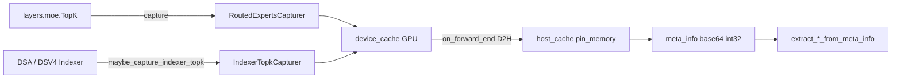

# `srt/state_capturer` — Routed experts / Indexer topk 捕获

## Summary

[`python/sglang/srt/state_capturer/`](d:\design\sglang\python\sglang\srt\state_capturer) **4** 个 `.py`（空 `__init__.py`）：为推理请求捕获 **per-token topk 索引**（MoE routed experts 或 DSA indexer），经 device buffer →（可选 overlap）D2H → host pin_memory 缓存，最终以 base64 int32 放入响应 `meta_info`。门控：`enable_return_routed_experts` / `enable_return_indexer_topk`（[server_args.py:3397+](d:\design\sglang\python\sglang\srt\server_args.py)）。全局句柄挂在 `runtime_context.get_resources()`。

## Sources

| 文件 | 说明 |
|---|---|
| [`base.py`](d:\design\sglang\python\sglang\srt\state_capturer\base.py) | `BaseDeviceCache` / `BaseHostCache` / `BaseTopkCapturer` / `TopkCaptureOutput` |
| [`routed_experts.py`](d:\design\sglang\python\sglang\srt\state_capturer\routed_experts.py) | `RoutedExpertsCapturer` + meta_info 解码 |
| [`indexer_topk.py`](d:\design\sglang\python\sglang\srt\state_capturer\indexer_topk.py) | `IndexerTopkCapturer` + `maybe_capture_indexer_topk` |
| 安装 | [`model_runner.py`](d:\design\sglang\python\sglang\srt\model_executor\model_runner.py) ~L996-L1008 |

## Architecture / Data flow

### base

- Device buffer 形状 `(max_batch_size, num_layers, topk_size)` int32（[base.py:29-37](d:\design\sglang\python\sglang\srt\state_capturer\base.py)）。
- Host buffer `(num_tokens, num_layers, topk_size)` pin_memory（[L54-L66](d:\design\sglang\python\sglang\srt\state_capturer\base.py)）。
- `TopkCaptureOutput`：overlap 路径持 GPU 张量，`map_device_tensors` + `finalize` 写 host（[L79-L97](d:\design\sglang\python\sglang\srt\state_capturer\base.py)）。
- `get_topk(req_pool_idx, seqlen, ...)` 经 `req_to_token` 索引 host（[L147-L162](d:\design\sglang\python\sglang\srt\state_capturer\base.py)）。

### routed_experts

- 仅当 `get_exec().features.enable_return_routed_experts`（[L42-L43](d:\design\sglang\python\sglang\srt\state_capturer\routed_experts.py)）。
- Device buffer 按 `dp_size` 放大；DeepEP 路径 capture 时 `attn_tp_all_gather`（[L67-L111](d:\design\sglang\python\sglang\srt\state_capturer\routed_experts.py)）。
- `disable_routed_experts_capture_for_draft`：draft MoE TopK 禁止写 target 全局 buffer（[L158-L171](d:\design\sglang\python\sglang\srt\state_capturer\routed_experts.py)）。
- 客户端：`extract_routed_experts_from_meta_info` base64→int32（[L147-L155](d:\design\sglang\python\sglang\srt\state_capturer\routed_experts.py)）。

### indexer_topk

- 要求 `attn_tp_size == 1`（DP attention）（[L27-L28](d:\design\sglang\python\sglang\srt\state_capturer\indexer_topk.py)）。
- CUDA-only 生产者；非 cuda device 则禁用并 warning（[L90-L99](d:\design\sglang\python\sglang\srt\state_capturer\indexer_topk.py)）。
- `maybe_capture_indexer_topk` 透明透传（[L56-L68](d:\design\sglang\python\sglang\srt\state_capturer\indexer_topk.py)）。

## Key APIs / Entities

| 名称 | 位置 | 作用 |
|---|---|---|
| `BaseTopkCapturer` | [base.py:100-186](d:\design\sglang\python\sglang\srt\state_capturer\base.py) | 通用 capture / D2H / get_topk |
| `TopkCaptureOutput` | [base.py:79-97](d:\design\sglang\python\sglang\srt\state_capturer\base.py) | overlap 调度输出 |
| `RoutedExpertsCapturer` | [routed_experts.py:23-132](d:\design\sglang\python\sglang\srt\state_capturer\routed_experts.py) | MoE expert ids |
| `get/set_global_experts_capturer` | [routed_experts.py:135-144](d:\design\sglang\python\sglang\srt\state_capturer\routed_experts.py) | 进程全局 |
| `IndexerTopkCapturer` | [indexer_topk.py:15-41](d:\design\sglang\python\sglang\srt\state_capturer\indexer_topk.py) | indexer sparse topk |
| `maybe_capture_indexer_topk` | [indexer_topk.py:56-68](d:\design\sglang\python\sglang\srt\state_capturer\indexer_topk.py) | 层内 hook |
| `create_indexer_capturer` | [indexer_topk.py:82-111](d:\design\sglang\python\sglang\srt\state_capturer\indexer_topk.py) | 工厂 |

## 使用方调用清单 / 跨子系统引用

1. **跨语言绑定**：`state_capturer`：在 `d:\design\sglang\python\sglang\srt\` 全树 grep 无 C++ 命中。
2. **协作伙伴**：
   - [`ModelRunner`](d:\design\sglang\python\sglang\srt\model_executor\model_runner.py) `set_global_experts_capturer` / `set_global_indexer_capturer`（~L996-L1008）
   - [`layers/moe/topk.py`](d:\design\sglang\python\sglang\srt\layers\moe\topk.py) 调 `get_global_experts_capturer`
   - Indexer：[`layers/attention/dsa/dsa_indexer.py`](d:\design\sglang\python\sglang\srt\layers\attention\dsa\dsa_indexer.py)、[`dsv4/indexer.py`](d:\design\sglang\python\sglang\srt\layers\attention\dsv4\indexer.py) 经 `maybe_capture_indexer_topk`
   - Spec workers 传递 `routed_experts_output` / `indexer_topk_output`（eagle/dflash）
   - Detokenizer：`extract_*` 注释指向 `_extract_routed_experts`（[routed_experts.py:150](d:\design\sglang\python\sglang\srt\state_capturer\routed_experts.py)）
3. **配置**：`enable_return_routed_experts` / `enable_return_indexer_topk`（[server_args.py:3397-3402](d:\design\sglang\python\sglang\srt\server_args.py)）→ `get_exec().features.*`。
4. **测试**：`RoutedExpertsCapturer` / `IndexerTopkCapturer`：本 checkout 无独立 `test/state_capturer*`。
5. **doc**：`state_capturer` / `routed_experts` capture：在 `d:\design\sglang\docs\` 全树 grep 0 命中。

## Notes / Caveats

- Host cache 按 **token 池大小** 分配，可能达 GB 级（[base.py:71-76](d:\design\sglang\python\sglang\srt\state_capturer\base.py)）——仅在显式开启时创建。
- Spec decode：draft 侧必须 `disable_routed_experts_capture_for_draft`（[routed_experts.py:158-163](d:\design\sglang\python\sglang\srt\state_capturer\routed_experts.py)）。
- Indexer capturer 目前不支持 attn-TP>1（[indexer_topk.py:28](d:\design\sglang\python\sglang\srt\state_capturer\indexer_topk.py)）。

## See also

- [sglang/modules/model_executor.md](model_executor.md)
- [sglang/modules/layers.md](layers.md)
- [sglang/modules/managers.md](managers.md)
- [sglang/overview.md](../overview.md)
