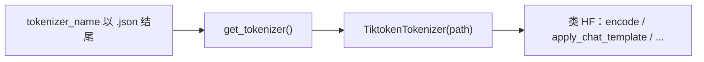

# `srt/tokenizer` — 自定义 Tiktoken（`.json` xtok）与 HF 兼容外观

## Summary

`srt/tokenizer/` 当前仅 **1** 个文件 [`tiktoken_tokenizer.py`](d:\design\sglang\python\sglang\srt\tokenizer\tiktoken_tokenizer.py)（无 `__init__.py`），提供 [`TiktokenTokenizer`](d:\design\sglang\python\sglang\srt\tokenizer\tiktoken_tokenizer.py:29-167) 与轻量 [`TiktokenProcessor`](d:\design\sglang\python\sglang\srt\tokenizer\tiktoken_tokenizer.py:6-11)：从 **自定义 xtok JSON** 构建 `tiktoken.Encoding`，补丁 `encode`，并暴露 **类 Hugging Face** 的 `encode` / `decode` / `batch_decode` / `apply_chat_template` / `__call__` / [`init_xgrammar`](d:\design\sglang\python\sglang\srt\tokenizer\tiktoken_tokenizer.py:142-167)，供统一 tokenizer 入口消费。

> [!warning] CONTRADICTION（命名 — 必读）
>
> ~~SGLang 内有 **4 个不同对象** 都叫 / 包含 "tokenizer"：~~
>
> | 路径 / 对象 | 职责 | 与 `srt/tokenizer/` 关系 |
> |---|---|---|
> | **`srt/tokenizer/tiktoken_tokenizer.py`**（本模块） | 单机库代码：`TiktokenTokenizer` 装载 **`.json` xtok 词表** | **定义处** |
> | **`srt/managers/tokenizer_manager.py`** | 前端进程 **`TokenizerManager`**：ZMQ、批处理、与 `Scheduler` 通信 | 通过 [`get_tokenizer`](d:\design\sglang\python\sglang\srt\utils\hf_transformers\tokenizer.py:439) **间接**使用本模块（当 `tokenizer_name.endswith(".json")`） |
> | **`srt/utils/hf_transformers/tokenizer.py`** | **`get_tokenizer()`** 工厂：HF `AutoTokenizer` 或 **`.json` → `TiktokenTokenizer`** | [`.json` 分支 import 本模块](d:\design\sglang\python\sglang\srt\utils\hf_transformers\tokenizer.py:448-451) |
> | **`srt/managers/multimodal_processor.py`** | 多模态处理器管线 | grep `srt.tokenizer` / `Tiktoken`：**0** 命中（不直接依赖本目录） |
>
> > **RESOLVED 2026-04-19**: 4 条同名 "tokenizer" 路径均实地存在（[`srt/tokenizer/tiktoken_tokenizer.py`](d:\design\sglang\python\sglang\srt\tokenizer\tiktoken_tokenizer.py)、[`srt/managers/tokenizer_manager.py`](d:\design\sglang\python\sglang\srt\managers\tokenizer_manager.py)、[`srt/utils/hf_transformers/tokenizer.py`](d:\design\sglang\python\sglang\srt\utils\hf_transformers\tokenizer.py)、[`srt/managers/multimodal_processor.py`](d:\design\sglang\python\sglang\srt\managers\multimodal_processor.py)）；表格保留作为永久消歧参考。

## Sources

| 区域 | 锚点 |
|---|---|
| xtok JSON → tiktoken | [`TiktokenTokenizer.__init__`](d:\design\sglang\python\sglang\srt\tokenizer\tiktoken_tokenizer.py:29-108)（`json.load`、`Encoding(**kwargs)`、`encode_patched`） |
| HF 风格 API | [`encode` / `decode` / `batch_decode` / `apply_chat_template` / `__call__`](d:\design\sglang\python\sglang\srt\tokenizer\tiktoken_tokenizer.py:110-140) |
| xgrammar | [`init_xgrammar`](d:\design\sglang\python\sglang\srt\tokenizer\tiktoken_tokenizer.py:142-167) |
| 统一入口 | [`get_tokenizer` 的 `.json` 分支](d:\design\sglang\python\sglang\srt\utils\hf_transformers\tokenizer.py:448-451) |
| 单测 | [`test_tiktoken_tokenizer.py`](d:\design\sglang\test\registered\unit\tokenizer\test_tiktoken_tokenizer.py) |

## Architecture / Data flow

- **入口**：[`get_tokenizer`](d:\design\sglang\python\sglang\srt\utils\hf_transformers\tokenizer.py:439-451) 若 `tokenizer_name.endswith(".json")`，则 `from sglang.srt.tokenizer.tiktoken_tokenizer import TiktokenTokenizer` 并 `return TiktokenTokenizer(tokenizer_name)`。
- **词表格式**：[`__init__`](d:\design\sglang\python\sglang\srt\tokenizer\tiktoken_tokenizer.py:34-56) 读 `regular_tokens` / `special_tokens`、`word_split`（当前仅支持 `"V1"`）、可选 `pat_str` / `vocab_size` / `default_allowed_special`。
- **特殊 token 集合**：[`RESERVED_TOKEN_TEXTS`](d:\design\sglang\python\sglang\srt\tokenizer\tiktoken_tokenizer.py:14-15)、[`CONTROL_TOKEN_TEXTS`](d:\design\sglang\python\sglang\srt\tokenizer\tiktoken_tokenizer.py:15)、并入 [`_default_allowed_special`](d:\design\sglang\python\sglang\srt\tokenizer\tiktoken_tokenizer.py:95-99)。
- **Processor**：[`TiktokenProcessor`](d:\design\sglang\python\sglang\srt\tokenizer\tiktoken_tokenizer.py:6-11) 包装 `TiktokenTokenizer` 并提供极简 [`image_processor`](d:\design\sglang\python\sglang\srt\tokenizer\tiktoken_tokenizer.py:10-11)（返回 `pixel_values` 列表），用于与多模态处理器式接口对齐的占位。

## File inventory（1 文件）

| 文件 | 职责 |
|---|---|
| [tiktoken_tokenizer.py](d:\design\sglang\python\sglang\srt\tokenizer\tiktoken_tokenizer.py) | `TiktokenTokenizer`、`TiktokenProcessor`、常量与 xgrammar 辅助 |

## Key APIs / Entities

| 名称 | 位置 | 作用 |
|---|---|---|
| `TiktokenTokenizer` | [tiktoken_tokenizer.py:29-167](d:\design\sglang\python\sglang\srt\tokenizer\tiktoken_tokenizer.py) | xtok JSON + tiktoken；HF 兼容方法 |
| `TiktokenProcessor` | [tiktoken_tokenizer.py:6-11](d:\design\sglang\python\sglang\srt\tokenizer\tiktoken_tokenizer.py) | 薄包装 + `image_processor` |
| `DEFAULT_CONTROL_TOKENS` 等 | [tiktoken_tokenizer.py:14-23](d:\design\sglang\python\sglang\srt\tokenizer\tiktoken_tokenizer.py) | 默认特殊与控制 token 字符串 |

## CLI / `ServerArgs`

- `srt/tokenizer/` **无独立 CLI 标志**；是否实例化 `TiktokenTokenizer` 取决于传给 `get_tokenizer` 的 **`tokenizer_name` 是否以 `.json` 结尾**（见 [get_tokenizer](d:\design\sglang\python\sglang\srt\utils\hf_transformers\tokenizer.py:448-451)）。
- 在 `d:\design\sglang\python\sglang\srt\server_args.py` 内 grep `Tiktoken` / `tiktoken_tokenizer`：**0** 命中（不作为 server 一级开关名出现）。

## §跨子系统引用（§5 hidden grep）

| # | 类别 | 结果 |
|---:|---|---|
| 1 | **sgl-kernel** | `tokenizer`：在 `d:\design\sglang\sgl-kernel\` 全树 grep **0** 命中（与 Python `srt/tokenizer/` 无直接对应） |
| 2 | **`srt/` 协作 import** | `from sglang.srt.tokenizer`：[`d:\design\sglang\python\sglang\srt\utils\hf_transformers\tokenizer.py:449`](d:\design\sglang\python\sglang\srt\utils\hf_transformers\tokenizer.py)（`tiktoken_tokenizer` 子模块） |
| 3 | **配置 / CLI** | 见上节；**TokenizerManager** 侧通过 [`get_tokenizer`](d:\design\sglang\python\sglang\srt\managers\tokenizer_manager.py:323) 走统一工厂 |
| 4 | **测试** | `from sglang.srt.tokenizer.tiktoken_tokenizer import ...`：[test_tiktoken_tokenizer.py:11-20](d:\design\sglang\test\registered\unit\tokenizer\test_tiktoken_tokenizer.py) |
| 5 | **文档** | `docs/` 中 `srt/tokenizer` **无**专门说明；[`openai_api_completions.ipynb`](d:\design\sglang\docs\basic_usage\openai_api_completions.ipynb) 仅示例 **公开** `tiktoken` 包，非本模块 |

## Notes / Caveats

- [`TiktokenTokenizer.__init__`](d:\design\sglang\python\sglang\srt\tokenizer\tiktoken_tokenizer.py:46-49) 对 `word_split != "V1"` 使用 `assert False`（硬失败）。
- `encode_patched` 将 `disallowed_special` 固定为 `()`（见 [tiktoken_tokenizer.py:75-91](d:\design\sglang\python\sglang\srt\tokenizer\tiktoken_tokenizer.py)），与默认 tiktoken 行为不同，属刻意补丁。
- [`DEFAULT_CONTROL_TOKENS`](d:\design\sglang\python\sglang\srt\tokenizer\tiktoken_tokenizer.py:23) 中键 `sep` → `EOS`、`eos` → `SEP` 字符串，与字面量语义交叉；以单测为准。

## See also

- [TokenizerManager.md](../entities/TokenizerManager.md)（前端进程 **TokenizerManager**）
- [managers.md](managers.md)（`tokenizer_manager.py` 总览）
- [multimodal.md](multimodal.md)（多模态 tokenization 管线；与本目录 **无直接 import**）
- [constrained.md](constrained.md)（`init_xgrammar` 消费方）
- 工厂实现：[hf_transformers/tokenizer.py](d:\design\sglang\python\sglang\srt\utils\hf_transformers\tokenizer.py) 中 `get_tokenizer`
