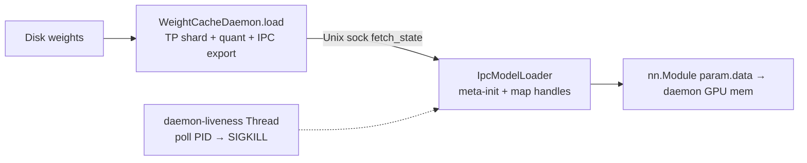

# `srt/weight_cache` — CUDA IPC 权重缓存守护进程

## Summary

[`python/sglang/srt/weight_cache/`](d:\design\sglang\python\sglang\srt\weight_cache) 含 **4** 个 `.py`（含空 `__init__.py`），实现 **GPU 常驻权重守护进程 + Unix socket 协议 + `IpcModelLoader` 零拷贝加载**。daemon 在磁盘完成 TP shard / quant post-process 后导出 CUDA IPC handles；engine 侧 meta-init 模型后把 `param.data` 直接映射到 daemon 的 GPU 内存。CLI：`--weight-cache-mode {off,daemon,client}`（[server_args.py:3421-3434](d:\design\sglang\python\sglang\srt\server_args.py)）。

> synthesis: 这是与 [`weight_sync`](weight_sync.md) / [`checkpoint_engine`](checkpoint_engine.md) / [`connector`](connector.md) **正交的第四条权重通道**——面向 **冷启动 / 快速恢复**（standalone daemon 跨 engine 重启存活），不是 RL 在线更新。

## Sources

| 文件 | 说明 |
|---|---|
| [`__init__.py`](d:\design\sglang\python\sglang\srt\weight_cache\__init__.py) | 故意空导出，避免拉入 torch/loader 循环依赖 |
| [`protocol.py`](d:\design\sglang\python\sglang\srt\weight_cache\protocol.py) | `CacheConfig`、IPC quant allowlist、socket/ready 路径、`send_msg`/`recv_msg` |
| [`ipc_loader.py`](d:\design\sglang\python\sglang\srt\weight_cache\ipc_loader.py) | `IpcModelLoader(BaseModelLoader)` 零拷贝加载 + daemon 存活 watchdog |
| [`daemon.py`](d:\design\sglang\python\sglang\srt\weight_cache\daemon.py) | `WeightCacheDaemon` / `launch_weight_cache_daemons` / `python -m ...daemon` CLI |
| 工厂接入 | [`loader.py:4232-4252`](d:\design\sglang\python\sglang\srt\model_loader\loader.py)（`LoadFormat.IPC_CACHE` → `IpcModelLoader`） |
| 引擎启动 | [`engine.py`](d:\design\sglang\python\sglang\srt\entrypoints\engine.py)（`_launch_weight_cache_daemons`） |

## Architecture / Data flow

1. **协议指纹** [`CacheConfig`](d:\design\sglang\python\sglang\srt\weight_cache\protocol.py)（[L30-L54](d:\design\sglang\python\sglang\srt\weight_cache\protocol.py)）：`model_path/arch/tp/pp/dp/ep/quant/dtype/revision` + `device_capability` + `torch_version`；`matches` 要求全相等（[L56-L58](d:\design\sglang\python\sglang\srt\weight_cache\protocol.py)）。
2. **IPC quant allowlist**（[L160-L163](d:\design\sglang\python\sglang\srt\weight_cache\protocol.py)）：仅 `""`（unquantized）与 **block-wise FP8**（`weight_block_size` 非空）；其它方法 `UnsupportedQuantForIPCError`（[L174-L197](d:\design\sglang\python\sglang\srt\weight_cache\protocol.py)）。
3. **Socket 布局**：`/tmp/sglang_weight_cache_rank{global_rank}.sock` / `.ready`，`global_rank = tp_size * pp_rank + tp_rank`（[L24-L27](d:\design\sglang\python\sglang\srt\weight_cache\protocol.py)、[L269-L276](d:\design\sglang\python\sglang\srt\weight_cache\protocol.py)）。消息为 length-prefixed pickle，`MAX_MSG_SIZE=256MiB`（[L205-L226](d:\design\sglang\python\sglang\srt\weight_cache\protocol.py)）。
4. **Daemon**：[`WeightCacheDaemon.load`](d:\design\sglang\python\sglang\srt\weight_cache\daemon.py) 要求 CUDA-alike（[L191-L197](d:\design\sglang\python\sglang\srt\weight_cache\daemon.py)）、拒绝 `expandable_segments:True`（[L321-L344](d:\design\sglang\python\sglang\srt\weight_cache\daemon.py)）；经 `get_model_loader` 磁盘加载后 `_export_state`（含 non-persistent buffers）（[L346-L402](d:\design\sglang\python\sglang\srt\weight_cache\daemon.py)）；`serve` 处理 `query_config` / `fetch_state` / `ping`（[L469-L525](d:\design\sglang\python\sglang\srt\weight_cache\daemon.py)）。
5. **Client loader**：[`IpcModelLoader`](d:\design\sglang\python\sglang\srt\weight_cache\ipc_loader.py)——`daemon` 模式无 daemon 则硬错误（防共享 GPU 上磁盘 fallback OOM）；`client` 模式仅 socket **文件不存在** 时允许磁盘 fallback（[L46-L63](d:\design\sglang\python\sglang\srt\weight_cache\ipc_loader.py)、[L104-L118](d:\design\sglang\python\sglang\srt\weight_cache\ipc_loader.py)）。零拷贝路径 meta-init → map IPC → 拒绝残留 meta 张量（[L287-L425](d:\design\sglang\python\sglang\srt\weight_cache\ipc_loader.py)）。加载后启动 PID watchdog 线程（[L162-L207](d:\design\sglang\python\sglang\srt\weight_cache\ipc_loader.py)）。
6. **跳过双重 post-process**：client **不**再跑 `process_weights_after_loading`（[L139-L142](d:\design\sglang\python\sglang\srt\weight_cache\ipc_loader.py)）。

## Key APIs / Entities

| 名称 | 位置 | 作用 |
|---|---|---|
| `CacheConfig` | [protocol.py:30-65](d:\design\sglang\python\sglang\srt\weight_cache\protocol.py) | daemon/client 兼容性指纹 |
| `IPC_QUANT_ALLOWLIST` / `check_ipc_quant_support` | [protocol.py:160-197](d:\design\sglang\python\sglang\srt\weight_cache\protocol.py) | 仅验证过的 quant 可走 IPC |
| `compute_global_rank` / `get_socket_path` | [protocol.py:269-308](d:\design\sglang\python\sglang\srt\weight_cache\protocol.py) | 全仓统一 rank→路径公式 |
| `cleanup_stale_daemon_files` | [protocol.py:342-380](d:\design\sglang\python\sglang\srt\weight_cache\protocol.py) | stale `.ready/.sock` 清理 / force takeover |
| `IpcModelLoader` | [ipc_loader.py:43-563](d:\design\sglang\python\sglang\srt\weight_cache\ipc_loader.py) | `BaseModelLoader` 子类，零拷贝加载 |
| `WeightCacheDaemon` | [daemon.py:76-536](d:\design\sglang\python\sglang\srt\weight_cache\daemon.py) | 单 rank GPU 常驻 + serve |
| `launch_weight_cache_daemons` | [daemon.py:592+](d:\design\sglang\python\sglang\srt\weight_cache\daemon.py) | `subprocess.Popen` 多 rank 启动（避免父进程 CUDA init） |
| `run_weight_cache_daemon` | [daemon.py:539-589](d:\design\sglang\python\sglang\srt\weight_cache\daemon.py) | 单进程入口；`kill_itself_when_parent_died` |

## 使用方调用清单 / 跨子系统引用

1. **跨语言绑定**：`weight_cache` / `IpcModelLoader` / `WeightCacheDaemon`：在 `d:\design\sglang\python\sglang\srt\` 全树无 C++/pybind 绑定（纯 Python + torch CUDA IPC）。`sgl-kernel`：本 checkout 无该树；以 Python 侧为准。
2. **协作伙伴**：
   - [`get_model_loader`](d:\design\sglang\python\sglang\srt\model_loader\loader.py) `LoadFormat.IPC_CACHE` → `IpcModelLoader`（[L4232-L4252](d:\design\sglang\python\sglang\srt\model_loader\loader.py)）
   - [`Engine._launch_weight_cache_daemons`](d:\design\sglang\python\sglang\srt\entrypoints\engine.py)（`weight_cache_mode == "daemon"`，约 [L1099-L1101](d:\design\sglang\python\sglang\srt\entrypoints\engine.py)）
   - [`http_server`](d:\design\sglang\python\sglang\srt\entrypoints\http_server.py) / [`ray/http_server`](d:\design\sglang\python\sglang\srt\ray\http_server.py) 接收 `_weight_cache_daemon_procs`
   - [`current_platform`](d:\design\sglang\python\sglang\srt\platforms)（daemon CUDA-alike / env stamp）
   - [`runtime_context.publish(..., role="weight_cache_daemon")`](d:\design\sglang\python\sglang\srt\runtime_context.py)（[daemon.py:226](d:\design\sglang\python\sglang\srt\weight_cache\daemon.py)）
3. **配置**：`ServerArgs.weight_cache_mode` / `weight_cache_socket` / `weight_cache_timeout`（[server_args.py:3421-3449](d:\design\sglang\python\sglang\srt\server_args.py)）；与 speculative 互斥校验约 [L7363-L7368](d:\design\sglang\python\sglang\srt\server_args.py)。
4. **测试覆盖反查**：`weight_cache` / `IpcModelLoader`：在本 checkout 的 `d:\design\sglang\` 全树（无独立 `test/` 目录）grep 命中主要为生产路径；独立 unit test 树未随本 pin 检出。
5. **doc / config 反查**：`weight_cache` / `weight-cache-mode`：在 `d:\design\sglang\docs\` 全树 grep 0 命中（CLI help 在 `server_args`）。

## Notes / Caveats

- Engine-spawned daemon **不**跨 restart 持久；快速恢复需 standalone `python -m sglang.srt.weight_cache.daemon` + `--weight-cache-mode client`（[server_args.py:3424-3430](d:\design\sglang\python\sglang\srt\server_args.py)）。
- Daemon 与 engine 必须同物理 GPU（CUDA IPC 前提）；`compute_local_gpu_id` 对齐 `--base-gpu-id` / `--gpu-id-step`（[protocol.py:279-300](d:\design\sglang\python\sglang\srt\weight_cache\protocol.py)）。
- Watchdog：daemon 死后 client `SIGKILL` 自身，避免读悬空 GPU 指针（[ipc_loader.py:162-199](d:\design\sglang\python\sglang\srt\weight_cache\ipc_loader.py)）。

## See also

- [sglang/modules/model_loader.md](model_loader.md)
- [sglang/modules/weight_sync.md](weight_sync.md)
- [sglang/modules/checkpoint_engine.md](checkpoint_engine.md)
- [sglang/modules/connector.md](connector.md)
- [sglang/modules/platforms.md](platforms.md)
- [sglang/overview.md](../overview.md)
