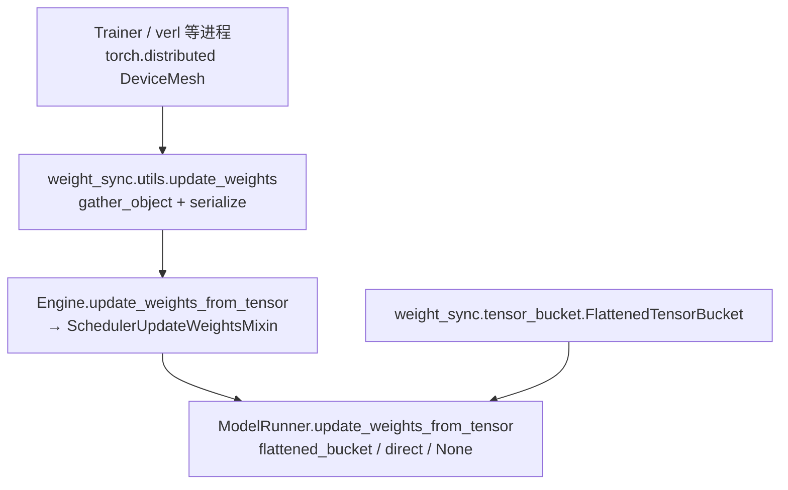

# `srt/weight_sync` — 张量分桶与训练侧 `update_weights` 桥接

## Summary

[`python/sglang/srt/weight_sync/`](d:\design\sglang\python\sglang\srt\weight_sync) 仅含 **2** 个 `.py` 文件（**无** `__init__.py`），职责一分为二：[`FlattenedTensorBucket`](d:\design\sglang\python\sglang\srt\weight_sync\tensor_bucket.py) 将多参数 **flatten 为单条 `uint8` 连续缓冲区** 以便与在线更新路径配合；[`update_weights`](d:\design\sglang\python\sglang\srt\weight_sync\utils.py) 在 **训练进程** 侧把 `(name, tensor)` 批次经 `gather_object` 与 [`MultiprocessingSerializer`](d:\design\sglang\python\sglang\srt\utils\__init__.py) 交给 [`Engine.update_weights_from_tensor`](d:\design\sglang\python\sglang\srt\entrypoints\engine.py)。**NCCL 进程组初始化 / `broadcast` 在线更新** 的实现主体在 [`model_runner.py`](d:\design\sglang\python\sglang\srt\model_executor\model_runner.py)，不在本目录内。

> synthesis: 本目录名易误解为「所有权重同步逻辑」——实际上它是 **张量分桶工具 + 训练侧 SPMD 桥接**；与 [`checkpoint_engine`](checkpoint_engine.md) 的 IPC 协议正交，与 [`connector`](connector.md) 的加载期权重通道也正交。

## Sources

| 文件 | 说明 |
|---|---|
| [tensor_bucket.py](d:\design\sglang\python\sglang\srt\weight_sync\tensor_bucket.py) | `FlattenedTensorMetadata` / `FlattenedTensorBucket` |
| [utils.py](d:\design\sglang\python\sglang\srt\weight_sync\utils.py) | `update_weights` / `_preprocess_tensor_for_update_weights` |
| 消费与协作 | [model_runner.py](d:\design\sglang\python\sglang\srt\model_executor\model_runner.py)（`load_format == "flattened_bucket"`、`_update_bucketed_weights_from_distributed`） |
| 消费与协作 | [tp_worker.py](d:\design\sglang\python\sglang\srt\managers\tp_worker.py)（LoRA `flattened_bucket` 反序列化） |
| 反序列化白名单 | [common.py](d:\design\sglang\python\sglang\srt\utils\common.py)（`ALLOWED_MODULE_PREFIXES` 含 `sglang.srt.weight_sync.tensor_bucket.`） |

## Architecture / Data flow

- **分桶路径**：[`FlattenedTensorBucket`](d:\design\sglang\python\sglang\srt\weight_sync\tensor_bucket.py) 将每个张量 `flatten().view(torch.uint8)` 后 `torch.cat`（[L53-L72](d:\design\sglang\python\sglang\srt\weight_sync\tensor_bucket.py)）；**无**按字节阈值的自动分桶；**无** padding，空列表会 `ValueError`（[L46-L47](d:\design\sglang\python\sglang\srt\weight_sync\tensor_bucket.py)）。`supports_multi_dtypes = True` 仅为能力标记（[L25-L26](d:\design\sglang\python\sglang\srt\weight_sync\tensor_bucket.py)）。
- **训练桥接**：[`update_weights`](d:\design\sglang\python\sglang\srt\weight_sync\utils.py) 对 `DTensor` 调 `full_tensor()`（[L117-L118](d:\design\sglang\python\sglang\srt\weight_sync\utils.py)），序列化后经 [`dist.gather_object`](d:\design\sglang\python\sglang\srt\weight_sync\utils.py) 在 `infer_tp_rank==0` 组装 `LocalSerializedTensor` 并 `await engine.update_weights_from_tensor`（[L63-L101](d:\design\sglang\python\sglang\srt\weight_sync\utils.py)）。
- **服务端消费 `flattened_bucket`**：[`ModelRunner.update_weights_from_tensor`](d:\design\sglang\python\sglang\srt\model_executor\model_runner.py) 在 `load_format == "flattened_bucket"` 时走 `_update_weights_from_flattened_bucket`（[L1760-L1814](d:\design\sglang\python\sglang\srt\model_executor\model_runner.py)）。
- **分布式 broadcast 分桶**：[`_update_bucketed_weights_from_distributed`](d:\design\sglang\python\sglang\srt\model_executor\model_runner.py) 使用同一 `FlattenedTensorBucket` 分配空张量、`broadcast` 扁平缓冲、`reconstruct_tensors` 后 `load_weights`（[L1723-L1744](d:\design\sglang\python\sglang\srt\model_executor\model_runner.py)）——逻辑在 `model_runner`，**非** `weight_sync/` 新文件。

## File inventory（2 文件）

| 文件 | 职责 |
|---|---|
| [tensor_bucket.py](d:\design\sglang\python\sglang\srt\weight_sync\tensor_bucket.py) | `FlattenedTensorMetadata`；`FlattenedTensorBucket` 构造 / `reconstruct_tensors` |
| [utils.py](d:\design\sglang\python\sglang\srt\weight_sync\utils.py) | 异步 `update_weights`；`_preprocess_tensor_for_update_weights` |

**包级导出**：目录下 **无** `__init__.py` — 调用方使用子模块全路径（如 `from sglang.srt.weight_sync.tensor_bucket import ...`）。

## Key APIs

| 符号 | 位置 | 作用 |
|---|---|---|
| `FlattenedTensorBucket` | [tensor_bucket.py:19-107](d:\design\sglang\python\sglang\srt\weight_sync\tensor_bucket.py) | 多张量扁平化与按元数据还原 |
| `FlattenedTensorMetadata` | [tensor_bucket.py:7-16](d:\design\sglang\python\sglang\srt\weight_sync\tensor_bucket.py) | 每张量在扁平缓冲中的区间与形状 |
| `update_weights` | [utils.py:14-101](d:\design\sglang\python\sglang\srt\weight_sync\utils.py) | 训练侧 SPMD：`gather_object` → `UpdateWeightsFromTensorReqInput` → `engine.update_weights_from_tensor` |
| `_preprocess_tensor_for_update_weights` | [utils.py:104-119](d:\design\sglang\python\sglang\srt\weight_sync\utils.py) | `DTensor` → `full_tensor()` |

## 生产路径调用方（`srt/`）

| 调用方 | 锚点 |
|---|---|
| `ModelRunner` | `from sglang.srt.weight_sync.tensor_bucket import` 约 [L196 起](d:\design\sglang\python\sglang\srt\model_executor\model_runner.py)；`FlattenedTensorBucket` 使用 [L1735-L1743](d:\design\sglang\python\sglang\srt\model_executor\model_runner.py)、[L1807-L1809](d:\design\sglang\python\sglang\srt\model_executor\model_runner.py) |
| `TpModelWorker` / `BaseTpWorker` | `from sglang.srt.weight_sync.tensor_bucket import FlattenedTensorBucket` ([L52](d:\design\sglang\python\sglang\srt\managers\tp_worker.py))；LoRA `flattened_bucket` [L192-L200](d:\design\sglang\python\sglang\srt\managers\tp_worker.py) |
| `MultiprocessingSerializer` 白名单 | [`"sglang.srt.weight_sync.tensor_bucket."`](d:\design\sglang\python\sglang\srt\utils\common.py) (L2155) |

**`weight_sync.utils` 在 `srt/` 树内无生产 import**（全仓库仅 [`test_utils_update_weights.py`](d:\design\sglang\test\registered\model_loading\test_utils_update_weights.py) 直接引用）。

## CLI / config（与在线权重相关的邻近项）

本目录 **无** 独立 CLI。相关项在 [`server_args.py`](d:\design\sglang\python\sglang\srt\server_args.py) 中间接出现：

- `--custom-weight-loader`（约 [L6219-L6226](d:\design\sglang\python\sglang\srt\server_args.py)）
- `--weight-version`（[L4784-L4787](d:\design\sglang\python\sglang\srt\server_args.py)）
- `--checkpoint-engine-wait-weights-before-ready`（[L4098-L4100](d:\design\sglang\python\sglang\srt\server_args.py)） — 主要服务 **checkpoint_engine IPC 初值**，见 [checkpoint_engine.md](checkpoint_engine.md) 与 [docs/advanced_features/sglang_for_rl.md](d:\design\sglang\docs\advanced_features\sglang_for_rl.md) 中 `weight_update_group` 表格。

## §跨子系统引用（§5 step 3）

1. **sgl-kernel C++**：在 [`d:\design\sglang\sgl-kernel\`](d:\design\sglang\sgl-kernel) 全树对 `weight_sync` / `tensor_bucket` / `FlattenedTensorBucket` **grep 0 命中**。
2. **协作伙伴**：见上表 `model_runner` / `tp_worker` / `common.py`；调度入口为 [`SchedulerUpdateWeightsMixin.update_weights_from_tensor`](d:\design\sglang\python\sglang\srt\managers\scheduler_update_weights_mixin.py)（[L87-L104](d:\design\sglang\python\sglang\srt\managers\scheduler_update_weights_mixin.py)）；HTTP [`/update_weights_from_tensor`](d:\design\sglang\python\sglang\srt\entrypoints\http_server.py)（约 L1151 起）；[`Engine.update_weights_from_tensor`](d:\design\sglang\python\sglang\srt\entrypoints\engine.py)（约 L910 起）。
3. **配置 / 共享结构**：`load_format` 字符串 `"flattened_bucket"` / `"direct"` 分支见 [`ModelRunner.update_weights_from_tensor`](d:\design\sglang\python\sglang\srt\model_executor\model_runner.py)（[L1760-L1782](d:\design\sglang\python\sglang\srt\model_executor\model_runner.py)）。
4. **测试**（`d:\design\sglang\test\`）：至少 **5** 个文件命中 `weight_sync` / `FlattenedTensorBucket` / `utils.update_weights`——例如 `test_update_weights_from_tensor.py`、`test_update_weights_from_distributed.py`、`test_utils_update_weights.py`、`test_lora_load_from_tensor.py`、`test_type_based_dispatcher.py`。
5. **文档**：[`docs/references/post_training_integration.md`](d:\design\sglang\docs\references\post_training_integration.md) 提及 **verl** 集成；[`docs/advanced_features/sglang_for_rl.md`](d:\design\sglang\docs\advanced_features\sglang_for_rl.md) 表格含 `weight_update_group`；**未**在 `docs/` 中 grep 到包名字符串 `sglang.srt.weight_sync`（以源码锚点为准）。

**Trainer 仓库耦合**：在 `d:\design\sglang\` 内对 `verl` / `openrlhf` 的 **Python 引用 grep 无** 实质 trainer 实现（文档层有 verl 链接）。

## 跨项目对照（synthesis）

| 项目 | 观察 |
|---|---|
| **vLLM** | 存在运行时批量权重更新 API，例如 [`AsyncLLM.update_weights`](d:\design\vllm\vllm\v1\engine\async_llm.py)（约 `WeightTransferUpdateRequest`，[L1049+](d:\design\vllm\vllm\v1\engine\async_llm.py)）与 [`GpuWorker.update_weights`](d:\design\vllm\vllm\v1\worker\gpu_worker.py)（约 L956+）——**语义**上与 SGLang 在线 RL 权重更新同类，**API/传输**不同。 |
| **MindIE-LLM** | 在 `d:\design\MindIE-LLM\` 对 `update_weights_from` / `checkpoint.engine` / `weight_sync` **Python grep 0 命中** |

## 三种正交的「权重通道」（与 connector / checkpoint_engine）

| 通道 | 时机 | 传输 / 入口 | wiki |
|---|---|---|---|
| **`srt/connector`** | **加载期** 远程拉权重与配置 | Redis / S3 / `instance://` NCCL | [connector.md](connector.md) |
| **`weight_sync/` + Scheduler 在线 API** | **运行期** RL / 训练同步 | HTTP `update_weights_from_*`、自定义 NCCL `init_weights_update_group`、`flattened_bucket` 等 | 本页 + [managers.md](managers.md) |
| **`checkpoint_engine/`** | **运行期** 与 Moonshot **checkpoint-engine** 参数服务器 + ZMQ IPC | `/update_weights_from_ipc` | [checkpoint_engine.md](checkpoint_engine.md) |

> synthesis: 三条通道 **可并存于一次部署语义空间**，但 **数据源与协议不同**——不要与 PD KV「connector」混淆（见 [connector.md Summary 警告块](connector.md)）。

## Notes / Caveats

> [!todo] VERIFY: ~~`weight_sync.utils.update_weights` 在 `srt/` 生产代码中无 import——若官方推荐训练脚本路径变更，需复查是否仍维护。~~
> **RESOLVED 2026-04-19**: 仍然成立。在 `d:\design\sglang\` 全树 grep `from sglang.srt.weight_sync.utils` / `from sglang.srt.weight_sync import` 仅命中 [`test/registered/model_loading/test_utils_update_weights.py L11`](d:\design\sglang\test\registered\model_loading\test_utils_update_weights.py)（测试），**`srt/` 生产树 0 命中**。函数仍维护（[utils.py L14-L101](d:\design\sglang\python\sglang\srt\weight_sync\utils.py)）但仅作为外部 trainer SPMD 入口（如 verl 集成），不被 srt 内部代码 import。

> [!warning] CONTRADICTION（命名）: ~~目录名 `weight_sync` 易暗示包含 **全部** NCCL 在线更新；实际 **`init_weights_update_group` / `broadcast` 主体在 `model_runner`**，本目录仅为分桶与训练桥接。~~
> **RESOLVED 2026-04-19**: 命名偏差仍存在。grep `init_weights_update_group` 命中 [model_runner.py](d:\design\sglang\python\sglang\srt\model_executor\model_runner.py) / [tp_worker.py](d:\design\sglang\python\sglang\srt\managers\tp_worker.py) / [scheduler.py](d:\design\sglang\python\sglang\srt\managers\scheduler.py) / [scheduler_update_weights_mixin.py](d:\design\sglang\python\sglang\srt\managers\scheduler_update_weights_mixin.py) / [tokenizer_communicator_mixin.py](d:\design\sglang\python\sglang\srt\managers\tokenizer_communicator_mixin.py) / [http_server.py](d:\design\sglang\python\sglang\srt\entrypoints\http_server.py) / [engine.py](d:\design\sglang\python\sglang\srt\entrypoints\engine.py) — **均不在 `weight_sync/` 目录**。本目录确实仅为「张量分桶 + 训练侧 SPMD 桥接」，命名提示保留。

## See also

- [sglang/modules/checkpoint_engine.md](checkpoint_engine.md)
- [sglang/modules/connector.md](connector.md)
- [sglang/entities/Scheduler.md](../entities/Scheduler.md)
- [docs/advanced_features/sglang_for_rl.md](d:\design\sglang\docs\advanced_features\sglang_for_rl.md)
