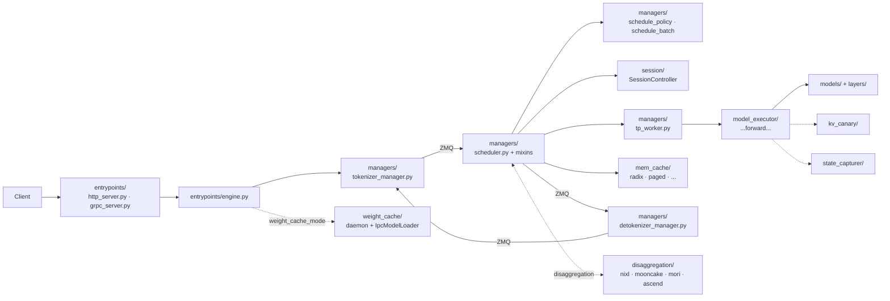

# SGLang Overview

## Summary
synthesis: SGLang 由两层组成 —— `sglang/` Python 前端 (frontend lang) 和 `sglang/srt/` 服务运行时 (SGLang Runtime)，本 wiki 主要围绕 **srt** 做。srt 用 **Manager 中心化** 模式：`TokenizerManager` 接收请求，`Scheduler` 跑批，`DetokenizerManager` 输出，三个 manager 之间用 ZMQ 通信，多进程拓扑显式。SGLang 在 PD 分离上有专门的 `disaggregation/` 顶层模块，实现路径覆盖 nixl / mooncake / mori / ascend 多个后端。HEAD `06f32bab` 下 srt 共 **41** 个顶层包（见下表）。

## Sources
- 主代码根：[d:\design\sglang\python\sglang\srt\](d:\design\sglang\python\sglang\srt)
- 服务入口：[d:\design\sglang\python\sglang\srt\entrypoints\engine.py](d:\design\sglang\python\sglang\srt\entrypoints\engine.py), [http_server.py](d:\design\sglang\python\sglang\srt\entrypoints\http_server.py), [grpc_server.py](d:\design\sglang\python\sglang\srt\entrypoints\grpc_server.py)
- Manager 三件套：[managers/tokenizer_manager.py](d:\design\sglang\python\sglang\srt\managers\tokenizer_manager.py), [managers/scheduler.py](d:\design\sglang\python\sglang\srt\managers\scheduler.py), [managers/detokenizer_manager.py](d:\design\sglang\python\sglang\srt\managers\detokenizer_manager.py)
- TP worker：[managers/tp_worker.py](d:\design\sglang\python\sglang\srt\managers\tp_worker.py)
- 调度策略：[managers/schedule_policy.py](d:\design\sglang\python\sglang\srt\managers\schedule_policy.py), [managers/schedule_batch.py](d:\design\sglang\python\sglang\srt\managers\schedule_batch.py)
- DP 控制：[managers/data_parallel_controller.py](d:\design\sglang\python\sglang\srt\managers\data_parallel_controller.py)
- 调度器 mixin 体系：[managers/scheduler_*.py](d:\design\sglang\python\sglang\srt\managers)（11 个 mixin）
- PD 分离：[disaggregation/](d:\design\sglang\python\sglang\srt\disaggregation) 含 `base/common/nixl/mooncake/mori/ascend/fake` 等后端
- 多 OpenAI / Anthropic / Ollama 兼容：[entrypoints/openai/](d:\design\sglang\python\sglang\srt\entrypoints\openai), [anthropic/](d:\design\sglang\python\sglang\srt\entrypoints\anthropic), [ollama/](d:\design\sglang\python\sglang\srt\entrypoints\ollama)
- 新增横切包：[weight_cache/](d:\design\sglang\python\sglang\srt\weight_cache), [kv_canary/](d:\design\sglang\python\sglang\srt\kv_canary), [arg_groups/](d:\design\sglang\python\sglang\srt\arg_groups), [platforms/](d:\design\sglang\python\sglang\srt\platforms), [plugins/](d:\design\sglang\python\sglang\srt\plugins), [session/](d:\design\sglang\python\sglang\srt\session), [state_capturer/](d:\design\sglang\python\sglang\srt\state_capturer)

## Top-level layout（srt 下 **41** 个顶层模块）

按职责分组（synthesis；包名以 `ls d:\design\sglang\python\sglang\srt/*/` 实测为准）：

### 入口与服务化
| 模块 | 路径 | 角色 |
|---|---|---|
| `entrypoints` | [srt/entrypoints/](d:\design\sglang\python\sglang\srt\entrypoints) | HTTP / gRPC / OpenAI / Anthropic / Ollama 兼容 |
| `grpc` | [srt/grpc/](d:\design\sglang\python\sglang\srt\grpc) | gRPC 协议占位（实现见外部包 / `entrypoints/grpc_server.py`） |

### 调度与请求生命周期
| 模块 | 路径 | 角色 |
|---|---|---|
| `managers` | [srt/managers/](d:\design\sglang\python\sglang\srt\managers) | 进程级管理：tokenizer / scheduler / detokenizer / tp_worker / dp_controller，含 scheduler mixin |
| `disaggregation` | [srt/disaggregation/](d:\design\sglang\python\sglang\srt\disaggregation) | **PD 分离** 多后端实现 |
| `multiplex` | [srt/multiplex/](d:\design\sglang\python\sglang\srt\multiplex) | PD-Multiplexing（同 GPU SM 分区） |
| `session` | [srt/session/](d:\design\sglang\python\sglang\srt\session) | 多轮 Session + `StreamingSession` KV 保活 |
| `function_call` | [srt/function_call/](d:\design\sglang\python\sglang\srt\function_call) | tool use / function calling |
| `constrained` | [srt/constrained/](d:\design\sglang\python\sglang\srt\constrained) | 约束解码（grammar 等） |

### 模型执行层
| 模块 | 路径 | 角色 |
|---|---|---|
| `model_executor` | [srt/model_executor/](d:\design\sglang\python\sglang\srt\model_executor) | 模型 forward 执行 |
| `model_loader` | [srt/model_loader/](d:\design\sglang\python\sglang\srt\model_loader) | 权重加载（含 `IPC_CACHE` → weight_cache） |
| `models` | [srt/models/](d:\design\sglang\python\sglang\srt\models) | 模型实现 |
| `layers` | [srt/layers/](d:\design\sglang\python\sglang\srt\layers) | 通用层（attention / moe / quantization / rotary…） |
| `lora` | [srt/lora/](d:\design\sglang\python\sglang\srt\lora) | LoRA |
| `sampling` | [srt/sampling/](d:\design\sglang\python\sglang\srt\sampling) | 采样 + penaltylib |
| `speculative` | [srt/speculative/](d:\design\sglang\python\sglang\srt\speculative) | speculative decoding |
| `state_capturer` | [srt/state_capturer/](d:\design\sglang\python\sglang\srt\state_capturer) | routed-experts / indexer topk 捕获回传 |

### 内存与缓存
| 模块 | 路径 | 角色 |
|---|---|---|
| `mem_cache` | [srt/mem_cache/](d:\design\sglang\python\sglang\srt\mem_cache) | KV cache（radix / paged / sparsity / HiCache…） |
| `kv_canary` | [srt/kv_canary/](d:\design\sglang\python\sglang\srt\kv_canary) | KV 完整性金丝雀（verify/write kernel + perturb） |
| `checkpoint_engine` | [srt/checkpoint_engine/](d:\design\sglang\python\sglang\srt\checkpoint_engine) | Moonshot checkpoint-engine IPC |
| `weight_sync` | [srt/weight_sync/](d:\design\sglang\python\sglang\srt\weight_sync) | 训练侧张量分桶 / `update_weights` |
| `weight_cache` | [srt/weight_cache/](d:\design\sglang\python\sglang\srt\weight_cache) | CUDA IPC 权重守护进程 + 零拷贝加载 |

### 分布式与硬件
| 模块 | 路径 | 角色 |
|---|---|---|
| `distributed` | [srt/distributed/](d:\design\sglang\python\sglang\srt\distributed) | TP/PP/EP/DP 通信 |
| `eplb` | [srt/eplb/](d:\design\sglang\python\sglang\srt\eplb) | Expert Parallel Load Balancer |
| `elastic_ep` | [srt/elastic_ep/](d:\design\sglang\python\sglang\srt\elastic_ep) | 弹性 Expert Parallel |
| `ray` | [srt/ray/](d:\design\sglang\python\sglang\srt\ray) | Ray 集成 |
| `platforms` | [srt/platforms/](d:\design\sglang\python\sglang\srt\platforms) | `current_platform` / `SRTPlatform` + OOT entry_points |
| `hardware_backend` | [srt/hardware_backend/](d:\design\sglang\python\sglang\srt\hardware_backend) | 设备特化实现（npu/musa/mlx） |
| `compilation` | [srt/compilation/](d:\design\sglang\python\sglang\srt\compilation) | torch.compile / cuda graph |
| `connector` | [srt/connector/](d:\design\sglang\python\sglang\srt\connector) | 远程**权重**加载（≠ KV connector） |
| `plugins` | [srt/plugins/](d:\design\sglang\python\sglang\srt\plugins) | setuptools plugins + `HookRegistry` |

### 其他
| 模块 | 路径 | 角色 |
|---|---|---|
| `tokenizer` | [srt/tokenizer/](d:\design\sglang\python\sglang\srt\tokenizer) | Tiktoken / xtok JSON tokenizer |
| `multimodal` | [srt/multimodal/](d:\design\sglang\python\sglang\srt\multimodal) | 多模态处理器 |
| `parser` | [srt/parser/](d:\design\sglang\python\sglang\srt\parser) | reasoning / harmony / conversation 解析 |
| `dllm` | [srt/dllm/](d:\design\sglang\python\sglang\srt\dllm) | Diffusion LLM |
| `batch_invariant_ops` | [srt/batch_invariant_ops/](d:\design\sglang\python\sglang\srt\batch_invariant_ops) | 确定性算子 |
| `batch_overlap` | [srt/batch_overlap/](d:\design\sglang\python\sglang\srt\batch_overlap) | TBO / SBO overlap |
| `debug_utils` | [srt/debug_utils/](d:\design\sglang\python\sglang\srt\debug_utils) | dump / comparator / schedule_simulator |
| `observability` | [srt/observability/](d:\design\sglang\python\sglang\srt\observability) | metrics / tracing / KV events |
| `configs` | [srt/configs/](d:\design\sglang\python\sglang\srt\configs) | `ModelConfig` / `LoadConfig` 等 |
| `arg_groups` | [srt/arg_groups/](d:\design\sglang\python\sglang\srt\arg_groups) | ServerArgs CLI 注解 + 模型 override hooks |
| `utils` | [srt/utils/](d:\design\sglang\python\sglang\srt\utils) | 横切工具（HF transformers helpers、IPC、profile…） |

> 旧 wiki 写「~34/36」已过时：实测 **41** 包（含新增 `arg_groups` / `kv_canary` / `platforms` / `plugins` / `session` / `state_capturer` / `weight_cache`，以及既有 `utils`）。`metrics/` 目录不存在——指标在 `observability/`。

## 数据流（synthesis）

## Manager 模式特点

SGLang 的核心架构：**3 个独立进程 + ZMQ pipeline**：

1. **TokenizerManager**（[tokenizer_manager.py](d:\design\sglang\python\sglang\srt\managers\tokenizer_manager.py)）— 接 HTTP 请求，做 tokenize，发给 scheduler
2. **Scheduler**（[scheduler.py](d:\design\sglang\python\sglang\srt\managers\scheduler.py) + mixin 体系）— 跑 continuous batching，调用 worker，输出发给 detokenizer；持有 [`SessionController`](modules/session.md)
3. **DetokenizerManager**（[detokenizer_manager.py](d:\design\sglang\python\sglang\srt\managers\detokenizer_manager.py)）— 把 token id 转回字符串，回给 tokenizer manager

> [!todo] VERIFY: 11 个 scheduler mixin 的职责切分需要专门一页（topic）梳理。~~部分已由 [topics/scheduler-mixins.md](topics/scheduler-mixins.md) 覆盖~~ — 仍以该 topic 为准做增量。

## PD 分离

[disaggregation/](d:\design\sglang\python\sglang\srt\disaggregation) 顶层模块下有：

| 后端 | 路径 |
|---|---|
| 抽象基类 | [disaggregation/base/](d:\design\sglang\python\sglang\srt\disaggregation\base), [disaggregation/common/](d:\design\sglang\python\sglang\srt\disaggregation\common) |
| NIXL（NVIDIA） | [disaggregation/nixl/](d:\design\sglang\python\sglang\srt\disaggregation\nixl) |
| Mooncake | [disaggregation/mooncake/](d:\design\sglang\python\sglang\srt\disaggregation\mooncake) |
| MORI | [disaggregation/mori/](d:\design\sglang\python\sglang\srt\disaggregation\mori) |
| Ascend | [disaggregation/ascend/](d:\design\sglang\python\sglang\srt\disaggregation\ascend) |
| Fake（测试） | [disaggregation/fake/](d:\design\sglang\python\sglang\srt\disaggregation\fake) |

CLI 归一化 / DCP 约束见 [`arg_groups/pd_disaggregation_hook.py`](modules/arg_groups.md)。

> synthesis: SGLang 是三个项目里 PD 分离实现最显式的（独立顶层模块 + 多后端可插拔）。

## 权重通道（synthesis）

| 通道 | 模块 | 时机 |
|---|---|---|
| 远程加载 | [`connector`](modules/connector.md) | 加载期 |
| 训练 SPMD / flatten bucket | [`weight_sync`](modules/weight_sync.md) | 运行期 RL |
| Moonshot IPC | [`checkpoint_engine`](modules/checkpoint_engine.md) | 运行期 |
| CUDA IPC daemon | [`weight_cache`](modules/weight_cache.md) | 冷启动 / 快速恢复 |

## 已知 / 重点关注

- **PD 分离 多后端**：直接对应优化场景参考。
- **EPLB / Elastic EP**：MoE expert load balancing。
- **kv_canary**：热路径 KV 完整性监控（`--kv-canary`）。
- **weight_cache**：IPC 零拷贝权重缓存（与 speculative 互斥）。
- **platforms / plugins**：OOT 硬件与 hook 扩展点。
- **DLLM**：Diffusion LLM 实验。
- **dp_attn / scheduler_dp_attn_mixin**：DP attention 并行优化。

## See also
- [sglang/index.md](index.md) — 项目内目录
- [comparison/index.md](../comparison/index.md)
