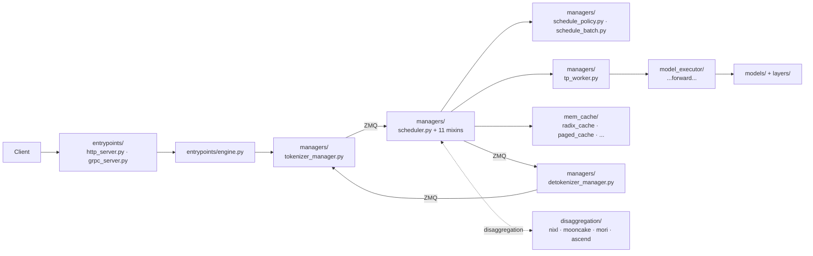

# SGLang Overview

## Summary
synthesis: SGLang 由两层组成 —— `sglang/` Python 前端 (frontend lang) 和 `sglang/srt/` 服务运行时 (SGLang Runtime)，本 wiki 主要围绕 **srt** 做。srt 用 **Manager 中心化** 模式：`TokenizerManager` 接收请求，`Scheduler` 跑批，`DetokenizerManager` 输出，三个 manager 之间用 ZMQ 通信，多进程拓扑显式。SGLang 在 PD 分离上有专门的 `disaggregation/` 顶层模块，实现路径覆盖 nixl / mooncake / mori / ascend 多个后端。

## Sources
- 主代码根：[d:\design\sglang\python\sglang\srt\](d:\design\sglang\python\sglang\srt)
- 服务入口：[d:\design\sglang\python\sglang\srt\entrypoints\engine.py](d:\design\sglang\python\sglang\srt\entrypoints\engine.py), [http_server.py](d:\design\sglang\python\sglang\srt\entrypoints\http_server.py), [grpc_server.py](d:\design\sglang\python\sglang\srt\entrypoints\grpc_server.py)
- Manager 三件套：[managers/tokenizer_manager.py](d:\design\sglang\python\sglang\srt\managers\tokenizer_manager.py), [managers/scheduler.py](d:\design\sglang\python\sglang\srt\managers\scheduler.py), [managers/detokenizer_manager.py](d:\design\sglang\python\sglang\srt\managers\detokenizer_manager.py)
- TP worker：[managers/tp_worker.py](d:\design\sglang\python\sglang\srt\managers\tp_worker.py)
- 调度策略：[managers/schedule_policy.py](d:\design\sglang\python\sglang\srt\managers\schedule_policy.py), [managers/schedule_batch.py](d:\design\sglang\python\sglang\srt\managers\schedule_batch.py)
- DP 控制：[managers/data_parallel_controller.py](d:\design\sglang\python\sglang\srt\managers\data_parallel_controller.py)
- 调度器 mixin 体系：[managers/scheduler_*.py](d:\design\sglang\python\sglang\srt\managers)（11 个 mixin）
- PD 分离：[disaggregation/](d:\design\sglang\python\sglang\srt\disaggregation) 含 `base/common/nixl/mooncake/mori/ascend/fake` 7 个后端
- 多 OpenAI / Anthropic / Ollama 兼容：[entrypoints/openai/](d:\design\sglang\python\sglang\srt\entrypoints\openai), [anthropic/](d:\design\sglang\python\sglang\srt\entrypoints\anthropic), [ollama/](d:\design\sglang\python\sglang\srt\entrypoints\ollama)

## Top-level layout（srt 下 36 个顶层模块）

按职责分组（synthesis）：

### 入口与服务化
| 模块 | 路径 | 角色 |
|---|---|---|
| `entrypoints` | [srt/entrypoints/](d:\design\sglang\python\sglang\srt\entrypoints) | HTTP / gRPC / OpenAI / Anthropic / Ollama 兼容 |
| `grpc` | [srt/grpc/](d:\design\sglang\python\sglang\srt\grpc) | gRPC 协议 |

### 调度与请求生命周期
| 模块 | 路径 | 角色 |
|---|---|---|
| `managers` | [srt/managers/](d:\design\sglang\python\sglang\srt\managers) | 进程级管理：tokenizer / scheduler / detokenizer / tp_worker / dp_controller，含 11 个 scheduler mixin |
| `disaggregation` | [srt/disaggregation/](d:\design\sglang\python\sglang\srt\disaggregation) | **PD 分离** 多后端实现 |
| `multiplex` | [srt/multiplex/](d:\design\sglang\python\sglang\srt\multiplex) | 复用 / 多任务 |
| `function_call` | [srt/function_call/](d:\design\sglang\python\sglang\srt\function_call) | tool use / function calling |
| `constrained` | [srt/constrained/](d:\design\sglang\python\sglang\srt\constrained) | 约束解码（grammar 等） |
| `structured_output` | （无独立目录，集成在 constrained） | — |

### 模型执行层
| 模块 | 路径 | 角色 |
|---|---|---|
| `model_executor` | [srt/model_executor/](d:\design\sglang\python\sglang\srt\model_executor) | 模型 forward 执行 |
| `model_loader` | [srt/model_loader/](d:\design\sglang\python\sglang\srt\model_loader) | 权重加载 |
| `models` | [srt/models/](d:\design\sglang\python\sglang\srt\models) | 模型实现（含 `deepseek_common/attention_forward_methods/`） |
| `layers` | [srt/layers/](d:\design\sglang\python\sglang\srt\layers) | 通用层（含 attention/mamba, moe/{token_dispatcher,moe_runner,fused_moe_triton}, quantization/{quark,modelslim,compressed_tensors}, rotary_embedding） |
| `lora` | [srt/lora/](d:\design\sglang\python\sglang\srt\lora) | LoRA（triton_ops + torch_ops 双实现） |
| `sampling` | [srt/sampling/](d:\design\sglang\python\sglang\srt\sampling) | 采样 + penaltylib |
| `speculative` | [srt/speculative/](d:\design\sglang\python\sglang\srt\speculative) | speculative decoding（含 triton_ops） |

### 内存与缓存
| 模块 | 路径 | 角色 |
|---|---|---|
| `mem_cache` | [srt/mem_cache/](d:\design\sglang\python\sglang\srt\mem_cache) | KV cache 管理（含 `unified_cache_components/`, `storage/`, `sparsity/` 三方向） |
| `checkpoint_engine` | [srt/checkpoint_engine/](d:\design\sglang\python\sglang\srt\checkpoint_engine) | checkpoint 管理 |
| `weight_sync` | [srt/weight_sync/](d:\design\sglang\python\sglang\srt\weight_sync) | 权重同步（RLHF 场景） |

### 分布式与硬件
| 模块 | 路径 | 角色 |
|---|---|---|
| `distributed` | [srt/distributed/](d:\design\sglang\python\sglang\srt\distributed) | TP/PP/EP/DP 通信 |
| `eplb` | [srt/eplb/](d:\design\sglang\python\sglang\srt\eplb) | Expert Parallel Load Balancer（含 simulator + algorithms） |
| `elastic_ep` | [srt/elastic_ep/](d:\design\sglang\python\sglang\srt\elastic_ep) | 弹性 Expert Parallel |
| `ray` | [srt/ray/](d:\design\sglang\python\sglang\srt\ray) | Ray 集成 |
| `hardware_backend` | [srt/hardware_backend/](d:\design\sglang\python\sglang\srt\hardware_backend) | 硬件抽象（含 `musa/` 摩尔线程后端） |
| `compilation` | [srt/compilation/](d:\design\sglang\python\sglang\srt\compilation) | torch.compile / cuda graph |
| `connector` | [srt/connector/](d:\design\sglang\python\sglang\srt\connector) | 通用连接器（含 `serde/`） |

### 其他
| 模块 | 路径 | 角色 |
|---|---|---|
| `tokenizer` | [srt/tokenizer/](d:\design\sglang\python\sglang\srt\tokenizer) | tokenizer |
| `multimodal` | [srt/multimodal/](d:\design\sglang\python\sglang\srt\multimodal) | 多模态（含 `evs/`） |
| `parser` | [srt/parser/](d:\design\sglang\python\sglang\srt\parser) | 解析器 |
| `reasoning` | （未列） | — |
| `dllm` | [srt/dllm/](d:\design\sglang\python\sglang\srt\dllm) | Diffusion LLM 实验性子系统 |
| `batch_invariant_ops` | [srt/batch_invariant_ops/](d:\design\sglang\python\sglang\srt\batch_invariant_ops) | batch 不变算子 |
| `batch_overlap` | [srt/batch_overlap/](d:\design\sglang\python\sglang\srt\batch_overlap) | overlap 优化 |
| `debug_utils` | [srt/debug_utils/](d:\design\sglang\python\sglang\srt\debug_utils) | 含 `comparator/`, `schedule_simulator/`, `source_patcher/` |
| `observability` | [srt/observability/](d:\design\sglang\python\sglang\srt\observability) | 可观测性 |
| `metrics` | [srt/metrics/](d:\design\sglang\python\sglang\srt\metrics) | metrics |
| `configs` | [srt/configs/](d:\design\sglang\python\sglang\srt\configs) | 配置 |

## 数据流（synthesis）

## Manager 模式特点

SGLang 的核心架构：**3 个独立进程 + ZMQ pipeline**：

1. **TokenizerManager**（[tokenizer_manager.py](d:\design\sglang\python\sglang\srt\managers\tokenizer_manager.py)）— 接 HTTP 请求，做 tokenize，发给 scheduler
2. **Scheduler**（[scheduler.py](d:\design\sglang\python\sglang\srt\managers\scheduler.py) + 11 个 mixin：`scheduler_pp_mixin`, `scheduler_dp_attn_mixin`, `scheduler_output_processor_mixin`, `scheduler_runtime_checker_mixin`, `scheduler_update_weights_mixin`, `scheduler_profiler_mixin`, `scheduler_input_blocker.py`, `scheduler_recv_skipper.py`）— 跑 continuous batching，调用 worker，输出发给 detokenizer
3. **DetokenizerManager**（[detokenizer_manager.py](d:\design\sglang\python\sglang\srt\managers\detokenizer_manager.py)）— 把 token id 转回字符串，回给 tokenizer manager

> [!todo] VERIFY: 11 个 scheduler mixin 的职责切分需要专门一页（topic）梳理。

## PD 分离

[disaggregation/](d:\design\sglang\python\sglang\srt\disaggregation) 顶层模块下有：

| 后端 | 路径 |
|---|---|
| 抽象基类 | [disaggregation/base/](d:\design\sglang\python\sglang\srt\disaggregation\base), [disaggregation/common/](d:\design\sglang\python\sglang\srt\disaggregation\common) |
| NIXL（NVIDIA） | [disaggregation/nixl/](d:\design\sglang\python\sglang\srt\disaggregation\nixl) |
| Mooncake | [disaggregation/mooncake/](d:\design\sglang\python\sglang\srt\disaggregation\mooncake) |
| MORI | [disaggregation/mori/](d:\design\sglang\python\sglang\srt\disaggregation\mori) |
| Ascend | [disaggregation/ascend/](d:\design\sglang\python\sglang\srt\disaggregation\ascend) |
| Fake（测试） | [disaggregation/fake/](d:\design\sglang\python\sglang\srt\disaggregation\fake) |

> synthesis: SGLang 是三个项目里 PD 分离实现最显式的（独立顶层模块 + 多后端可插拔）。后续 ingest 时优先做对比。

## 已知 / 重点关注

- **PD 分离 多后端**：直接对应你目前在做的优化场景，可以做参考。
- **EPLB / Elastic EP**：MoE 场景的 expert load balancing。
- **DLL**：Diffusion LLM 实验。
- **dp_attn / scheduler_dp_attn_mixin**：DP attention 这个相对新的并行优化。

## See also
- [sglang/index.md](index.md) — 项目内目录
- [comparison/index.md](../comparison/index.md)
- [mindie/overview.md](../mindie/overview.md), [vllm/overview.md](../vllm/overview.md)
