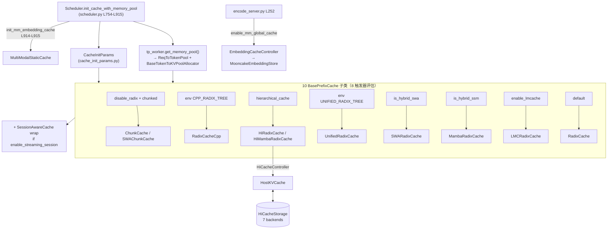

# KV Cache 体系（SGLang 内部）

## Summary

synthesis: SGLang 把 KV cache 体系拆成 **4 层正交抽象**：(1) [`Scheduler.init_cache_with_memory_pool`](d:\design\sglang\python\sglang\srt\managers\scheduler.py)（[L754-L915](d:\design\sglang\python\sglang\srt\managers\scheduler.py)）按 **8 个触发器** 在 **10 个 `BasePrefixCache` 实现** 中三级择一；(2) `BaseTokenToKVPoolAllocator` 槽位池由 `tp_worker.get_memory_pool()` 提供（[scheduler.py:L779-L781](d:\design\sglang\python\sglang\srt\managers\scheduler.py)），与 prefix cache 解耦；(3) `enable_hierarchical_cache` 启用 **device → host → storage 三层 HiCache**（`HiRadixCache` / `HiMambaRadixCache`）；(4) 多模态嵌入走平行的 `MultiModalStaticCache`（[multimodal_cache.py:76](d:\design\sglang\python\sglang\srt\mem_cache\multimodal_cache.py)）单例 + 可选 `EmbeddingCacheController`（[embedding_cache_controller.py:92](d:\design\sglang\python\sglang\srt\mem_cache\storage\mooncake_store\embedding_cache_controller.py)）做 EPD 跨节点 mooncake 共享。**radix-only**（`RadixCache` 默认派）、**radix-with-L2**（`HiRadixCache`）、**radix-only-Cpp**（`RadixCacheCpp` env experimental）、**chunk-only**（`ChunkCache`）四条主路径并存。

## Sources

- Dispatch & Scheduler：[scheduler.py:L754-L915](d:\design\sglang\python\sglang\srt\managers\scheduler.py)
- 抽象基类：[base_prefix_cache.py:L150-L274](d:\design\sglang\python\sglang\srt\mem_cache\base_prefix_cache.py)、[allocator.py:L35-L115](d:\design\sglang\python\sglang\srt\mem_cache\allocator.py)、[cache_init_params.py](d:\design\sglang\python\sglang\srt\mem_cache\cache_init_params.py)
- 10 个 tree_cache class（详 §10 矩阵）：[chunk_cache.py:32/102](d:\design\sglang\python\sglang\srt\mem_cache\chunk_cache.py)、[radix_cache.py:285](d:\design\sglang\python\sglang\srt\mem_cache\radix_cache.py)、[radix_cache_cpp.py:35](d:\design\sglang\python\sglang\srt\mem_cache\radix_cache_cpp.py)、[hiradix_cache.py:65](d:\design\sglang\python\sglang\srt\mem_cache\hiradix_cache.py)、[hi_mamba_radix_cache.py:88](d:\design\sglang\python\sglang\srt\mem_cache\hi_mamba_radix_cache.py)、[swa_radix_cache.py:344](d:\design\sglang\python\sglang\srt\mem_cache\swa_radix_cache.py)、[mamba_radix_cache.py:423](d:\design\sglang\python\sglang\srt\mem_cache\mamba_radix_cache.py)、[unified_radix_cache.py:173](d:\design\sglang\python\sglang\srt\mem_cache\unified_radix_cache.py)、[lmc_radix_cache.py:63](d:\design\sglang\python\sglang\srt\mem_cache\storage\lmcache\lmc_radix_cache.py)
- Session wrapper：[session_aware_cache.py:116](d:\design\sglang\python\sglang\srt\mem_cache\session_aware_cache.py)
- 多模态嵌入：[multimodal_cache.py:11/72/76](d:\design\sglang\python\sglang\srt\mem_cache\multimodal_cache.py)、[mm_utils.py:25/352-357](d:\design\sglang\python\sglang\srt\managers\mm_utils.py)、[embedding_cache_controller.py:92](d:\design\sglang\python\sglang\srt\mem_cache\storage\mooncake_store\embedding_cache_controller.py)、[encode_server.py:252-266](d:\design\sglang\python\sglang\srt\disaggregation\encode_server.py)
- Unified components：[unified_cache_components/__init__.py](d:\design\sglang\python\sglang\srt\mem_cache\unified_cache_components\__init__.py)、[tree_component.py:30-117](d:\design\sglang\python\sglang\srt\mem_cache\unified_cache_components\tree_component.py)
- HiCache 存储接口：[hicache_storage.py:95-272](d:\design\sglang\python\sglang\srt\mem_cache\hicache_storage.py)
- Env / CLI 触发：[environ.py:L255/L457/L477](d:\design\sglang\python\sglang\srt\environ.py)、[server_args.py:L379/L567/L582/L618/L746](d:\design\sglang\python\sglang\srt\server_args.py)

## Architecture

> synthesis: **3 子图正交** —— G1（10 prefix cache 子类）与 HiCache 后端、多模态 cache 完全独立；只有 `HiRadixCache` / `HiMambaRadixCache` 在 `__init__` 内主动持 `HiCacheController` 把 `host_pool` / `storage_backend` 闭环（[hiradix_cache.py:L73-L161](d:\design\sglang\python\sglang\srt\mem_cache\hiradix_cache.py)、[hi_mamba_radix_cache.py:L88-L150](d:\design\sglang\python\sglang\srt\mem_cache\hi_mamba_radix_cache.py)），其它 8 个 prefix cache 仅持 device 端 KV。

## 10 个 `tree_cache` 实现矩阵

按 [`Scheduler.init_cache_with_memory_pool`](d:\design\sglang\python\sglang\srt\managers\scheduler.py) 的 if-elif 优先级**自顶向下**列出（先匹配先用，互斥）：

| # | 类（class）| 文件:行 | 触发条件 | 适用场景 / 关键依赖 |
|---|---|---|---|---|
| 1 | `ChunkCache` | [chunk_cache.py:32](d:\design\sglang\python\sglang\srt\mem_cache\chunk_cache.py) | `disable_radix_cache + chunked_prefill_size!=None` 且 `not is_hybrid_swa`（[L819-L823](d:\design\sglang\python\sglang\srt\managers\scheduler.py)）| 关闭 prefix-share 的 chunked prefill；`is_chunk_cache()=True`，`match_prefix` 永空 |
| 2 | `SWAChunkCache` | [chunk_cache.py:102](d:\design\sglang\python\sglang\srt\mem_cache\chunk_cache.py) | 同 #1 但 `is_hybrid_swa`（[L824-L827](d:\design\sglang\python\sglang\srt\managers\scheduler.py)）| SWA 版；`SWATokenToKVPoolAllocator` 强制 |
| 3 | `RadixCacheCpp` | [radix_cache_cpp.py:35](d:\design\sglang\python\sglang\srt\mem_cache\radix_cache_cpp.py) | env [`SGLANG_EXPERIMENTAL_CPP_RADIX_TREE`](d:\design\sglang\python\sglang\srt\environ.py)=true（[L830-L835](d:\design\sglang\python\sglang\srt\managers\scheduler.py)）| **experimental** C++ radix tree；C++ binding `cpp_radix_tree/`；**互斥** hierarchical（[L68-L78](d:\design\sglang\python\sglang\srt\mem_cache\radix_cache_cpp.py) raises） |
| 4 | `HiMambaRadixCache` | [hi_mamba_radix_cache.py:88](d:\design\sglang\python\sglang\srt\mem_cache\hi_mamba_radix_cache.py) | `enable_hierarchical_cache + is_hybrid_ssm`（[L836-L844](d:\design\sglang\python\sglang\srt\managers\scheduler.py)）| 混合 Mamba + L2 host/storage；`HybridLinearKVPool` + `HybridReqToTokenPool` 强校验；继承 `MambaRadixCache` |
| 5 | `HiRadixCache` | [hiradix_cache.py:65](d:\design\sglang\python\sglang\srt\mem_cache\hiradix_cache.py) | `enable_hierarchical_cache + 非 hybrid_ssm`（[L845-L853](d:\design\sglang\python\sglang\srt\managers\scheduler.py)）| **prod L2 路径**（device→host→storage）；继承 `RadixCache`；按 MHA/MLA/NSA 构 `*TokenToKVPoolHost`；`HiCacheController` 注入 `register_hicache_layer_transfer_counter` |
| 6 | `UnifiedRadixCache` | [unified_radix_cache.py:173](d:\design\sglang\python\sglang\srt\mem_cache\unified_radix_cache.py) | env [`SGLANG_ENABLE_UNIFIED_RADIX_TREE`](d:\design\sglang\python\sglang\srt\environ.py)=true（[L854-L868](d:\design\sglang\python\sglang\srt\managers\scheduler.py)）| **新一代统一接口**（FULL + 可选 SWA/MAMBA 组合，详 §Unified Cache） |
| 7 | `SWARadixCache` | [swa_radix_cache.py:344](d:\design\sglang\python\sglang\srt\mem_cache\swa_radix_cache.py) | `is_hybrid_swa`（[L869-L872](d:\design\sglang\python\sglang\srt\managers\scheduler.py)）| 仅 SWA 不要 hierarchical/unified；`SWATokenToKVPoolAllocator` 强校验；`full_lru` + `swa_lru` 双 LRU |
| 8 | `MambaRadixCache` | [mamba_radix_cache.py:423](d:\design\sglang\python\sglang\srt\mem_cache\mamba_radix_cache.py) | `is_hybrid_ssm`（[L873-L876](d:\design\sglang\python\sglang\srt\managers\scheduler.py)）| 仅 Mamba 不要 hierarchical；`HybridReqToTokenPool` + (`Token`｜`Paged`)`TokenToKVPoolAllocator`；`page_size==1`（除非 `enable_mamba_extra_buffer`） |
| 9 | `LMCRadixCache` | [lmc_radix_cache.py:63](d:\design\sglang\python\sglang\srt\mem_cache\storage\lmcache\lmc_radix_cache.py) | `enable_lmcache`（[L877-L888](d:\design\sglang\python\sglang\srt\managers\scheduler.py)）| LMCache 外部集成；继承 `RadixCache`；`LMCacheLayerwiseConnector` + 2 路 CUDA stream + `LayerTransferCounter` 钩 KV pool per-layer load |
| 10 | `RadixCache` | [radix_cache.py:285](d:\design\sglang\python\sglang\srt\mem_cache\radix_cache.py) | else 默认（[L889-L890](d:\design\sglang\python\sglang\srt\managers\scheduler.py)）| **默认 prod 路径**；7 种 `EvictionStrategy`（[L313-L331](d:\design\sglang\python\sglang\srt\mem_cache\radix_cache.py)）；`page_size` 决定 `_key_match_page_size1` 或 `_key_match_paged` |

> 完成 1-10 任一分支后若 `enable_streaming_session=True` 再外裹 [`SessionAwareCache`](d:\design\sglang\python\sglang\srt\mem_cache\session_aware_cache.py)（[scheduler.py:L892-L893](d:\design\sglang\python\sglang\srt\managers\scheduler.py)）—— **不**是第 11 分支，是持 `inner: BasePrefixCache` 的装饰器。

> synthesis: **触发器去重**：8 触发器但 10 分支——`disable_radix_cache+chunked_prefill` 内由 `is_hybrid_swa` 二分（→ `Chunk` / `SWAChunk`），`enable_hierarchical_cache` 内由 `is_hybrid_ssm` 二分（→ `HiRadix` / `HiMamba`）；其余 6 触发器一对一映射。

## `BasePrefixCache` 抽象（接口契约）

定义在 [base_prefix_cache.py:L150-L274](d:\design\sglang\python\sglang\srt\mem_cache\base_prefix_cache.py)。继承 `PrefixCacheTrait(Protocol)`（[L27-L33](d:\design\sglang\python\sglang\srt\mem_cache\base_prefix_cache.py)），强制 4 公共字段：`req_to_token_pool` / `token_to_kv_pool_allocator` / `page_size` / `disable`。

- **5 个 `@abstractmethod`**（10 实现全部 override）：`reset()`、`match_prefix(MatchPrefixParams)→MatchResult`、`cache_finished_req(req,is_insert)`、`cache_unfinished_req(req)`、`evict(EvictParams)→EvictResult`、`inc_lock_ref / dec_lock_ref`（[L173-L201](d:\design\sglang\python\sglang\srt\mem_cache\base_prefix_cache.py)）。`ChunkCache.evict` 永返空（[chunk_cache.py:L83-L84](d:\design\sglang\python\sglang\srt\mem_cache\chunk_cache.py)）。
- **Capability 探针**（默认 `False`）：`supports_swa()` 由 `SWAChunkCache`/`SWARadixCache` 翻 `True`（[chunk_cache.py:L112-L116](d:\design\sglang\python\sglang\srt\mem_cache\chunk_cache.py)、[swa_radix_cache.py:L378-L382](d:\design\sglang\python\sglang\srt\mem_cache\swa_radix_cache.py)）；`supports_mamba()` 由 `MambaRadixCache` 翻 `True`（[mamba_radix_cache.py:L458](d:\design\sglang\python\sglang\srt\mem_cache\mamba_radix_cache.py)）；`is_chunk_cache()` 由 `ChunkCache` 翻 `True`（[chunk_cache.py:L44-L45](d:\design\sglang\python\sglang\srt\mem_cache\chunk_cache.py)），`is_tree_cache() = not is_chunk_cache()`。
- **HiCache 接口默认 `NotImplementedError`**（[L227-L254](d:\design\sglang\python\sglang\srt\mem_cache\base_prefix_cache.py)）：`init_load_back` / `ready_to_load_host_cache` / `check_hicache_events`，仅 `HiRadixCache` / `HiMambaRadixCache` / `RadixCacheCpp` 部分实现；`flush_write_through_acks` 默认 no-op、`take_events` 默认空 list。
- **9 个共用 dataclass**（[L35-L121](d:\design\sglang\python\sglang\srt\mem_cache\base_prefix_cache.py)）：`MatchPrefixParams` / `InsertParams` / `InsertResult` / `EvictParams` / `EvictResult` / `IncLockRefResult` / `DecLockRefParams` / `DecLockRefResult` / `InitLoadBackParams` + `MatchResult(NamedTuple)` —— **统一 API 契约 → 10 实现可换插座**。

## KV Pool / Allocator（与 prefix cache 解耦）

**关键解耦**：`Scheduler.init_cache_with_memory_pool` 在 [L779-L781](d:\design\sglang\python\sglang\srt\managers\scheduler.py) 调用 `tp_worker.get_memory_pool()` 得 `(req_to_token_pool, token_to_kv_pool_allocator)` —— pool/allocator **早于** tree_cache 分支创建（pool 在 `ModelRunner.initialize` 阶段产，跟 attention/dtype/FP4/NSA 等挂钩）。10 个 prefix cache 通过 `params: CacheInitParams` 持引用，**不**自己造 pool。

`BaseTokenToKVPoolAllocator(abc.ABC)`（[allocator.py:L35-L115](d:\design\sglang\python\sglang\srt\mem_cache\allocator.py)）核心方法：抽象 `clear / alloc / free`（[L104-L114](d:\design\sglang\python\sglang\srt\mem_cache\allocator.py)）；非抽象工具 `available_size = (len(free_pages)+len(release_pages))*page_size`（[L61-L62](d:\design\sglang\python\sglang\srt\mem_cache\allocator.py)）、`backup_state / restore_state` tuple `(free_pages, release_pages)`（[L67-L71](d:\design\sglang\python\sglang\srt\mem_cache\allocator.py)，**CUDA graph 重放/回滚** 关键挂钩）、`merge_and_sort_free`（[L82-L88](d:\design\sglang\python\sglang\srt\mem_cache\allocator.py)）、`free_group_begin/end`（[L73-L80](d:\design\sglang\python\sglang\srt\mem_cache\allocator.py)）；`alloc_extend / alloc_decode` 默认 `NotImplementedError`，**仅 paged allocator 实现**（[L98-L102](d:\design\sglang\python\sglang\srt\mem_cache\allocator.py)）。

两个具体实现：

- `TokenToKVPoolAllocator`（[allocator.py:L117-L171](d:\design\sglang\python\sglang\srt\mem_cache\allocator.py)）—— `page_size=1` 标准；padded slot 0 留作 dummy 输出（[L131-L138](d:\design\sglang\python\sglang\srt\mem_cache\allocator.py)）
- `PagedTokenToKVPoolAllocator`（[allocator.py:L356-L518](d:\design\sglang\python\sglang\srt\mem_cache\allocator.py)）—— `page_size>1` 对齐分配，含 Triton kernel `alloc_extend_kernel` / `alloc_decode_kernel`（[L235-L355](d:\design\sglang\python\sglang\srt\mem_cache\allocator.py)）；`MambaRadixCache` 在 `enable_mamba_extra_buffer` 时允许 `page_size>1`（[mamba_radix_cache.py:L435-L438](d:\design\sglang\python\sglang\srt\mem_cache\mamba_radix_cache.py)）

> synthesis: 解耦让 10 个 prefix cache 共享同一组 allocator/pool 接口；FP4 / NSA / DoubleSparse / Hybrid 等 KV pool 多态（详 [modules/mem_cache.md §3](../modules/mem_cache.md)）对 prefix cache 透明。代价是 `Hi*RadixCache` 仍要 `isinstance(kv_cache, MHA/MLA/NSA)` 分支构 `*TokenToKVPoolHost`（[hiradix_cache.py:L73-L97](d:\design\sglang\python\sglang\srt\mem_cache\hiradix_cache.py)）—— host pool 按 attention 类型工厂。

## Hierarchical（HiRadix + HiMamba）L2/L3 存储闭环

**仅** `HiRadixCache` / `HiMambaRadixCache` 在 `__init__` 内主动构 `HiCacheController` 并启动 `host_pool` + `storage_backend` 闭环；其它 8 个 prefix cache 不持 host pool。`HiRadixCache.__init__` 流程（[hiradix_cache.py:L67-L184](d:\design\sglang\python\sglang\srt\mem_cache\hiradix_cache.py)）：

1. `isinstance(kv_cache, MHA/MLA/NSA)` 分支构 `MHATokenToKVPoolHost` 或 `MLATokenToKVPoolHost`（[L73-L97](d:\design\sglang\python\sglang\srt\mem_cache\hiradix_cache.py)）；NSA 另走 `build_nsa_hybrid_stack`（[L123-L132](d:\design\sglang\python\sglang\srt\mem_cache\hiradix_cache.py)）
2. 构 `HiCacheController(allocator, host_pool, page_size, tp_group, load_cache_event, write_policy, io_backend, storage_backend, prefetch_threshold, ...)`（[L134-L151](d:\design\sglang\python\sglang\srt\mem_cache\hiradix_cache.py)）
3. Scheduler 回调 `tp_worker.register_hicache_layer_transfer_counter(cache_controller.layer_done_counter)`（[scheduler.py:L851-L853](d:\design\sglang\python\sglang\srt\managers\scheduler.py)）

写入策略阈值：`write_through_threshold = 1 if write_policy=="write_through" else 2`（[L173-L176](d:\design\sglang\python\sglang\srt\mem_cache\hiradix_cache.py)）；`load_back_threshold = 10`（[L177](d:\design\sglang\python\sglang\srt\mem_cache\hiradix_cache.py)）。运行时序：`match_prefix` 返 `MatchResult(host_hit_length>0)` → Scheduler 调 `init_load_back(InitLoadBackParams)` → `HiCacheController` 拉 host(+storage) → 装载 device；`cache_finished_req` → `write_backup` → write-through 或 write-back 推 device→host→storage。

`HiCacheStorage(ABC)`（[hicache_storage.py:L95-L272](d:\design\sglang\python\sglang\srt\mem_cache\hicache_storage.py)）提供 v1+v2 两版批量 KV 读写；`HiCacheStorageConfig` / `PoolName` / `PoolHitPolicy` / `PoolTransfer` 4 dataclass 把 host↔storage 交互参数化（[L17-L92](d:\design\sglang\python\sglang\srt\mem_cache\hicache_storage.py)）；7 后端在 `storage/backend_factory.py` 工厂选，详见 [modules/mem_cache.md §6](../modules/mem_cache.md)。`RadixCacheCpp` 在 [L68-L78](d:\design\sglang\python\sglang\srt\mem_cache\radix_cache_cpp.py) 主动 raise `Host cache is not supported yet`，**与 hierarchical 互斥**（[server_args.py:L3714](d:\design\sglang\python\sglang\srt\server_args.py)）。

> synthesis: **HiCache 是 SGLang 一等公民** —— 10 个 prefix cache 里 2 个直接整合 host pool + storage backend，其余 8 个把 HiCache 接口留 `NotImplementedError` 由调用方先判 capability。这与 vLLM 把 KV offload 走 `KVConnector` 钩子的做法显著不同（详 [comparison/topics/kv-cache.md](../../comparison/topics/kv-cache.md)）。

## Unified Cache 4 组件（新一代接口）

[`unified_cache_components/`](d:\design\sglang\python\sglang\srt\mem_cache\unified_cache_components) 通过 `__init__.py` 导出 4 个 component class（[__init__.py:L1-L25](d:\design\sglang\python\sglang\srt\mem_cache\unified_cache_components\__init__.py)）：

| Component | 文件:行 | `component_type` enum | 角色 |
|---|---|---|---|
| `TreeComponent`（ABC） | [tree_component.py:80](d:\design\sglang\python\sglang\srt\mem_cache\unified_cache_components\tree_component.py) | — | 抽象基类，定义 `create_match_validator` / `finalize_match_result` / `update_component_on_insert_overlap` 等钩子 |
| `FullComponent` | [full_component.py:21](d:\design\sglang\python\sglang\srt\mem_cache\unified_cache_components\full_component.py) | `ComponentType.FULL = 0` | full-attention KV，**始终启用**（`BASE_COMPONENT_TYPE`）|
| `SWAComponent` | [swa_component.py:30](d:\design\sglang\python\sglang\srt\mem_cache\unified_cache_components\swa_component.py) | `ComponentType.SWA = 1` | sliding window 窗口校验 + 长度累计 |
| `MambaComponent` | [mamba_component.py:32](d:\design\sglang\python\sglang\srt\mem_cache\unified_cache_components\mamba_component.py) | `ComponentType.MAMBA = 2` | Mamba state copy-on-write + branching_seqlen |

`UnifiedRadixCache` 在 [unified_radix_cache.py:L173-L200](d:\design\sglang\python\sglang\srt\mem_cache\unified_radix_cache.py) 用 `params.tree_components: tuple[ComponentType, ...]` 决定启用哪几个组件——`scheduler.py:L862-L867` 默认放 `FULL`，`is_hybrid_swa` → 追加 `SWA`，`is_hybrid_ssm` → 追加 `MAMBA`（**互斥二选一**，[scheduler.py:L863-L866](d:\design\sglang\python\sglang\srt\managers\scheduler.py)）。

`UnifiedTreeNode`（[unified_radix_cache.py:L49-L73](d:\design\sglang\python\sglang\srt\mem_cache\unified_radix_cache.py)）每节点持 `_NUM_COMPONENT_TYPES`（=3）个 `ComponentData` 槽位（[tree_component.py:L60-L64](d:\design\sglang\python\sglang\srt\mem_cache\unified_cache_components\tree_component.py)），`COMPONENT_REGISTRY: dict[ComponentType, type[TreeComponent]]`（[unified_radix_cache.py:L164-L168](d:\design\sglang\python\sglang\srt\mem_cache\unified_radix_cache.py)）做工厂分发；每个 `UnifiedLRUList` 按 `component_type` 维护独立 LRU 双链表（[L76-L161](d:\design\sglang\python\sglang\srt\mem_cache\unified_radix_cache.py)）。

> synthesis: **设计意图**：把 `RadixCache` / `SWARadixCache` / `MambaRadixCache` / `HiRadixCache` 4 个旧子类（每个都拷贝大量 RadixCache 通用逻辑）合并成"组合而非继承"——`UnifiedRadixCache` 的 base + components 取代多继承爆炸。**当前未默认启用**（env `SGLANG_ENABLE_UNIFIED_RADIX_TREE` 默认 false，[environ.py:L477](d:\design\sglang\python\sglang\srt\environ.py)），`UnifiedRadixCache` 与旧 4 子类**并存**——这是 SGLang 进行中的 in-tree 重构。

## 多模态 Cache 链（与 KV 平行）

多模态嵌入 cache 与 KV cache **不共池**，自成体系：

- `MultimodalCache(abc.ABC)`（[multimodal_cache.py:11](d:\design\sglang\python\sglang\srt\mem_cache\multimodal_cache.py)）—— 抽象基类（`get` / `set` / `has` / `free` / `clear` / `available_size` + `combine_hashes` 静态法）
- `EmbeddingResult`（[multimodal_cache.py:72](d:\design\sglang\python\sglang\srt\mem_cache\multimodal_cache.py)）—— dataclass 包 `embedding: torch.Tensor`
- `MultiModalStaticCache(MultimodalCache)`（[multimodal_cache.py:76](d:\design\sglang\python\sglang\srt\mem_cache\multimodal_cache.py)）—— OrderedDict LRU + `max_size` 字节限；`set` 按 `_get_tensor_size` 累加，超额 LRU 弹出（[L102-L121](d:\design\sglang\python\sglang\srt\mem_cache\multimodal_cache.py)）
- `init_mm_embedding_cache(max_size)`（[mm_utils.py:355-357](d:\design\sglang\python\sglang\srt\managers\mm_utils.py)）—— 把模块全局 `embedding_cache: Optional[MultiModalStaticCache]`（[mm_utils.py:352](d:\design\sglang\python\sglang\srt\managers\mm_utils.py)）单例初始化
- `EmbeddingCacheController`（[embedding_cache_controller.py:92](d:\design\sglang\python\sglang\srt\mem_cache\storage\mooncake_store\embedding_cache_controller.py)）—— EPD 跨节点：`MooncakeEmbeddingStore` + `ContiguousMemoryAllocator` + 后台 `io_thread` + `prefetch_queue` / `insert_queue` 双队列异步 PUT/GET

### 两条串联点

- **process 内单例**：`Scheduler.init_cache_with_memory_pool` 末尾调 `init_mm_embedding_cache(SGLANG_VLM_CACHE_SIZE_MB.get() * 1024 * 1024)`（[scheduler.py:L914-L915](d:\design\sglang\python\sglang\srt\managers\scheduler.py)，env 默认 100 MB，[environ.py:L457](d:\design\sglang\python\sglang\srt\environ.py)）—— 与 `tree_cache` 字段平级但落在 mm_utils 模块全局
- **EPD 跨节点**：当 `enable_mm_global_cache=True`（[server_args.py:L746](d:\design\sglang\python\sglang\srt\server_args.py)）时 `EncodeServer` 构 `EmbeddingCacheController` 作为 `mm_global_cache` 字段（[encode_server.py:L252-L266](d:\design\sglang\python\sglang\srt\disaggregation\encode_server.py)）—— **与** `MultiModalStaticCache` 单例并行不互斥

> synthesis: 多模态 cache 是 **process 内** 进程级单例（不像 `tree_cache` 是 Scheduler 实例字段）。**不放进 `BasePrefixCache` 子类的原因**：embedding 与 token 异质——前者是 `torch.Tensor` 张量整体 hash，后者是 token sequence 前缀 trie，共享接口收益小。

## CLI / env 触发表

8 个 prefix cache 触发器（**都在** `Scheduler.init_cache_with_memory_pool` 决策树内消费），自顶向下评估：

| # | 触发器 | 类型 | 默认 | 定义 | 决策位置 → 分支 |
|---|---|---|---|---|---|
| 1 | `--disable-radix-cache` | CLI bool | `False` | [server_args.py:L618](d:\design\sglang\python\sglang\srt\server_args.py) | [scheduler.py:L783-L827](d:\design\sglang\python\sglang\srt\managers\scheduler.py) → `ChunkCache` / `SWAChunkCache`（多模态 + Transformers 后端**强制开启**，[L784-L790](d:\design\sglang\python\sglang\srt\managers\scheduler.py)） |
| 2 | env `SGLANG_EXPERIMENTAL_CPP_RADIX_TREE` | env bool | `False` | [environ.py:L255](d:\design\sglang\python\sglang\srt\environ.py) | [L830-L835](d:\design\sglang\python\sglang\srt\managers\scheduler.py) → `RadixCacheCpp` |
| 3 | `--enable-hierarchical-cache` | CLI bool | `False` | [server_args.py:L567](d:\design\sglang\python\sglang\srt\server_args.py) | [L836-L853](d:\design\sglang\python\sglang\srt\managers\scheduler.py) → `HiMambaRadixCache`(hybrid_ssm) / `HiRadixCache` |
| 4 | env `SGLANG_ENABLE_UNIFIED_RADIX_TREE` | env bool | `False` | [environ.py:L477](d:\design\sglang\python\sglang\srt\environ.py) | [L854-L868](d:\design\sglang\python\sglang\srt\managers\scheduler.py) → `UnifiedRadixCache`（components 按 hybrid 追加） |
| 5 | model 属性 `is_hybrid_swa` | model | — | `tp_worker.is_hybrid_swa`（[L761](d:\design\sglang\python\sglang\srt\managers\scheduler.py)）| [L869-L872](d:\design\sglang\python\sglang\srt\managers\scheduler.py) → `SWARadixCache` |
| 6 | model 属性 `is_hybrid_ssm` | model | — | `hybrid_gdn_config` 或 `mamba2_config` 或 `_registry_needs_mamba`（[L766-L770](d:\design\sglang\python\sglang\srt\managers\scheduler.py)）| [L873-L876](d:\design\sglang\python\sglang\srt\managers\scheduler.py) → `MambaRadixCache` |
| 7 | `--enable-lmcache` | CLI bool | `False` | [server_args.py:L582](d:\design\sglang\python\sglang\srt\server_args.py) | [L877-L888](d:\design\sglang\python\sglang\srt\managers\scheduler.py) → `LMCRadixCache`（外部 `lmcache` pip 包） |
| 8 | else（默认）| — | — | — | [L889-L890](d:\design\sglang\python\sglang\srt\managers\scheduler.py) → `RadixCache` |

**装饰器与平行 cache**（不在 8 触发器内）：

- `--enable-streaming-session`（[server_args.py:L379](d:\design\sglang\python\sglang\srt\server_args.py)、[scheduler.py:L892-L893](d:\design\sglang\python\sglang\srt\managers\scheduler.py)）—— 把任一选中的 `tree_cache` 外裹 `SessionAwareCache`
- env `SGLANG_VLM_CACHE_SIZE_MB`（默认 100 MB；[environ.py:L457](d:\design\sglang\python\sglang\srt\environ.py)、[scheduler.py:L914-L915](d:\design\sglang\python\sglang\srt\managers\scheduler.py)）—— 初始化 `MultiModalStaticCache` 单例容量
- `--enable-mm-global-cache`（[server_args.py:L746](d:\design\sglang\python\sglang\srt\server_args.py)、[encode_server.py:L252](d:\design\sglang\python\sglang\srt\disaggregation\encode_server.py)）—— EPD encode server 启 `EmbeddingCacheController`

**eviction 策略**：`--radix-eviction-policy` 7 选 1（`lru/lfu/fifo/mru/filo/priority/slru`，[radix_cache.py:L313-L331](d:\design\sglang\python\sglang\srt\mem_cache\radix_cache.py)）—— **仅 `RadixCache` / `LMCRadixCache` 读取**；其它 prefix cache 有各自 LRU 实现。

## Notes / Caveats

> [!todo] VERIFY: pin 从 `34fef07a` → `06f32bab`（2026-08-10 increment）后本页未深 verify；文件数量/行号可能漂移。优先对照 [entities/Scheduler.md](../entities/Scheduler.md) / 新模块页。

> [!warning] CONTRADICTION: ~~[modules/mem_cache.md](../modules/mem_cache.md) §与 Scheduler 的关系（已 RESOLVED 2026-04-19）描述 `init_cache_with_memory_pool` 为 **8 个分支**（① ChunkCache/SWAChunkCache → ② RadixCacheCpp → ③ HiMamba/HiRadix → ④ Unified → ⑤ default RadixCache）。~~ 实测 [scheduler.py:L754-L915](d:\design\sglang\python\sglang\srt\managers\scheduler.py) 共 **10 个 `tree_cache` 实例化点**（`ChunkCache` / `SWAChunkCache` / `RadixCacheCpp` / `HiMambaRadixCache` / `HiRadixCache` / `UnifiedRadixCache` / `SWARadixCache` / `MambaRadixCache` / `LMCRadixCache` / `RadixCache`）。**8 → 10 已 stale**——mem_cache.md `Notes / Caveats` 中已 resolved 但内容遗漏 `SWARadixCache` / `MambaRadixCache` / `LMCRadixCache` 3 分支。
> **本页（topics/kv-cache.md）的 10 分支矩阵为最新事实源**；mem_cache.md 应在下一轮 lint / verify 中追加 follow-up：把"⑤`is_hybrid_swa` → `SWARadixCache`、⑥`is_hybrid_ssm` → `MambaRadixCache`、⑦`enable_lmcache` → `LMCRadixCache`"补回 RESOLVED 块。

> [!todo] VERIFY: `UnifiedRadixCache` 何时取代旧 4 子类成为默认（env 何时翻 true）。当前 unified 与旧 4 实现并存，**unified 内 SWA / MAMBA 互斥二选一**（[scheduler.py:L863-L866](d:\design\sglang\python\sglang\srt\managers\scheduler.py)）—— 即不支持 SWA + Mamba 同时存在的混合模型；旧 `Hi*RadixCache` 同样存在该限制（不存在 `HiSWARadixCache` 单独类）。**未确认** unified 是否计划接管 hierarchical / lmcache / cpp 三条特殊路径。

> [!todo] VERIFY: `RadixCacheCpp` 的"experimental"承诺时长——logger 标 `Using experimental C++ radix tree implementation.`（[L34](d:\design\sglang\python\sglang\srt\mem_cache\radix_cache_cpp.py)），host cache 路径主动 raise `NotImplementedError`（[L78](d:\design\sglang\python\sglang\srt\mem_cache\radix_cache_cpp.py)）；未见提级到 stable 的 commit 计划。

> [!todo] VERIFY: `MambaRadixCache` 注释声明 "v1"（[mamba_radix_cache.py:L437-L438](d:\design\sglang\python\sglang\srt\mem_cache\mamba_radix_cache.py)），未确认 v2 是否在他处实装（grep `MambaRadixCacheV2` 0 命中）。`decode_offload_manager`（[scheduler.py:L900-L912](d:\design\sglang\python\sglang\srt\managers\scheduler.py)）与 `enable_hisparse`（[L895-L898](d:\design\sglang\python\sglang\srt\managers\scheduler.py)）两条平行通道与 10 prefix cache 的交互：本页未深入，详 [modules/mem_cache.md §7](../modules/mem_cache.md) + 待建 `sglang/topics/pd-disaggregation.md`。

## See also

- [sglang/modules/mem_cache.md](../modules/mem_cache.md) — `srt/mem_cache/` 62 文件全模块视角（KV pool / allocator / HiCache 7 后端 / sparsity）；本页是其 prefix cache 维度的**深度切片**
- [sglang/modules/multimodal.md](../modules/multimodal.md) — 多模态 processor / encode 路径
- [sglang/entities/Scheduler.md](../entities/Scheduler.md) — `Scheduler` 总图，本页对 `init_cache_with_memory_pool` 做 10-branch 详注
- [sglang/topics/pd-disaggregation.md](pd-disaggregation.md) — TODO 待建；与本页 `decode_offload_manager` / EPD `EmbeddingCacheController` 交叉点
- [comparison/topics/kv-cache.md](../../comparison/topics/kv-cache.md) — 三家 KV cache 横向对比，本页是其 SGLang 列实证锚
- [comparison/topics/prefix-cache.md](../../comparison/topics/prefix-cache.md) — 三家 prefix cache 横向对比，本页 10 实现矩阵是其 SGLang 列实证锚
