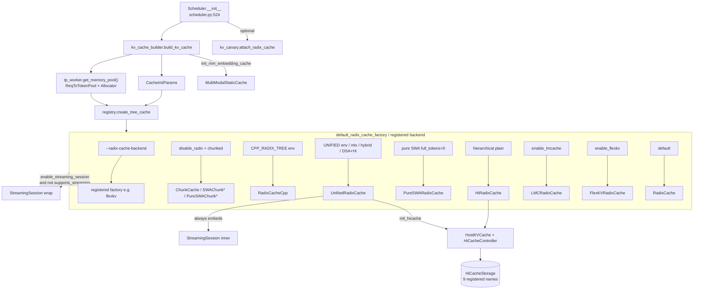

# KV Cache 体系（SGLang 内部）

## Summary

synthesis: 相对 pin `34fef07a`，HEAD `06f32bab` 把 KV/prefix cache **工厂从 `Scheduler.init_cache_with_memory_pool` 抽到** [`kv_cache_builder.build_kv_cache`](d:\design\sglang\python\sglang\srt\mem_cache\kv_cache_builder.py) + [`registry.create_tree_cache`](d:\design\sglang\python\sglang\srt\mem_cache\registry.py)。四层正交抽象仍在：(1) **tree_cache 工厂链**（`default_radix_cache_factory` + 可插拔 `--radix-cache-backend`）；(2) **`BaseTokenToKVPoolAllocator`**（现拆到 [`allocator/`](d:\design\sglang\python\sglang\srt\mem_cache\allocator) 包）与 `ReqToTokenPool` / 各 `*TokenToKVPool`；(3) **HiCache** device→host→storage（plain `HiRadixCache` 或 `UnifiedRadixCache.init_hicache`）；(4) **多模态嵌入** `MultiModalStaticCache`（经 [`mm_schedule.init_mm_embedding_cache`](d:\design\sglang\python\sglang\srt\managers\mm_schedule.py)）。重大漂移：`HiMambaRadixCache` / `session_aware_cache.py` / `unified_cache_components/` **已删除**；hybrid SWA/SSM + hierarchical 默认走 **`UnifiedRadixCache`**；`StreamingSession` 迁到 [`session/`](d:\design\sglang\python\sglang\srt\session)；新增 **FlexKV** 与 **9** 个 HiCache storage 注册名。

## Sources

- Scheduler 入口：[scheduler.py:L524-L563](d:\design\sglang\python\sglang\srt\managers\scheduler.py)（`build_kv_cache` → `self.tree_cache`；可选 `canary_manager.attach_radix_cache`）
- Builder：[kv_cache_builder.py:L142-L356](d:\design\sglang\python\sglang\srt\mem_cache\kv_cache_builder.py)
- 工厂 / 注册表：[registry.py](d:\design\sglang\python\sglang\srt\mem_cache\registry.py)（`TreeCacheBuildContext` / `default_radix_cache_factory` / `create_tree_cache`）
- 抽象：[base_prefix_cache.py:L230+](d:\design\sglang\python\sglang\srt\mem_cache\base_prefix_cache.py)、[cache_init_params.py](d:\design\sglang\python\sglang\srt\mem_cache\cache_init_params.py)、[allocator/](d:\design\sglang\python\sglang\srt\mem_cache\allocator)
- 生产路径实现：见 §工厂矩阵
- Legacy 仍在树内但**不在默认工厂链**：[swa_radix_cache.py:L345](d:\design\sglang\python\sglang\srt\mem_cache\swa_radix_cache.py)、[mamba_radix_cache.py:L444](d:\design\sglang\python\sglang\srt\mem_cache\mamba_radix_cache.py)
- Unified：[unified_radix_cache.py](d:\design\sglang\python\sglang\srt\mem_cache\unified_radix_cache.py) + [unified_cache/](d:\design\sglang\python\sglang\srt\mem_cache\unified_cache)
- HiCache storage：[hicache_storage.py](d:\design\sglang\python\sglang\srt\mem_cache\hicache_storage.py) + [storage/backend_factory.py:L197-L247](d:\design\sglang\python\sglang\srt\mem_cache\storage\backend_factory.py)
- Session wrap：[streaming_session.py:L134](d:\design\sglang\python\sglang\srt\session\streaming_session.py)
- 多模态：[multimodal_cache.py](d:\design\sglang\python\sglang\srt\mem_cache\multimodal_cache.py)、[mm_schedule.py:L23](d:\design\sglang\python\sglang\srt\managers\mm_schedule.py)
- Env：[environ.py:L584/L594/L1146](d:\design\sglang\python\sglang\srt\environ.py)

## Architecture

> synthesis: **工厂外置**是本次最大架构变化——Scheduler 只持 `tree_cache` 句柄；选型逻辑集中在 `registry.py`，便于 `--radix-cache-backend` 插件化。Unified 已成为 **hybrid + hierarchical/DSA** 的汇合点，旧 `SWARadixCache`/`MambaRadixCache`/`HiMambaRadixCache` 不再出现在默认链上。

## 调用链（Scheduler → tree_cache）

1. [`Scheduler`](d:\design\sglang\python\sglang\srt\managers\scheduler.py) 在模型 worker 初始化后调用 [`build_kv_cache(...)`](d:\design\sglang\python\sglang\srt\mem_cache\kv_cache_builder.py)（[scheduler.py:524-549](d:\design\sglang\python\sglang\srt\managers\scheduler.py)）。
2. Builder 判定 `is_hybrid_swa` / `is_hybrid_ssm` / `is_dsa`，并从 `tp_worker.get_memory_pool()` 取 pool（[kv_cache_builder.py:218-241](d:\design\sglang\python\sglang\srt\mem_cache\kv_cache_builder.py)）；**增量新增**：先经 `resolve_decode_retraction_backup` 决议 PD-decode retraction 后端（`host_pool` / `cpu_tensor`，[kv_cache_builder.py:142-190](d:\design\sglang\python\sglang\srt\mem_cache\kv_cache_builder.py)）。
3. 组装 [`CacheInitParams`](d:\design\sglang\python\sglang\srt\mem_cache\cache_init_params.py)（含 `eviction_policy`、`enable_session_radix_cache`、PP/TP/CP groups 等）（[kv_cache_builder.py:274-304](d:\design\sglang\python\sglang\srt\mem_cache\kv_cache_builder.py)）。
4. [`create_tree_cache(TreeCacheBuildContext)`](d:\design\sglang\python\sglang\srt\mem_cache\registry.py)（[kv_cache_builder.py:306-323](d:\design\sglang\python\sglang\srt\mem_cache\kv_cache_builder.py) + [registry.py:223-271](d:\design\sglang\python\sglang\srt\mem_cache\registry.py)）。
5. 可选：hierarchical draft 注册、host_pool retraction 容量校验、`init_mm_embedding_cache`（[kv_cache_builder.py:325-344](d:\design\sglang\python\sglang\srt\mem_cache\kv_cache_builder.py)）。
6. 返回后 Scheduler 赋值 `self.tree_cache`；若存在 `canary_manager` 则 `attach_radix_cache`（[scheduler.py:558-563](d:\design\sglang\python\sglang\srt\managers\scheduler.py)）。

## 工厂矩阵（`default_radix_cache_factory`）

优先级自顶向下（[registry.py:80-167](d:\design\sglang\python\sglang\srt\mem_cache\registry.py)）。另：`--radix-cache-backend=<name>` 走注册表，**跳过**本链（[registry.py:225-238](d:\design\sglang\python\sglang\srt\mem_cache\registry.py)）。

| # | 条件 | 构造类 | 锚点 |
|---|---|---|---|
| 0 | `--radix-cache-backend` 已设 | 注册工厂（内置仅见 `"flexkv"`） | [registry.py:225-238](d:\design\sglang\python\sglang\srt\mem_cache\registry.py) |
| 0.5 | `disable_radix_cache` ∧ retraction backup==`host_pool`（**增量新增**，PD-decode retraction 保 KV） | `UnifiedRadixCache` + `init_hicache` | [registry.py:85-89](d:\design\sglang\python\sglang\srt\mem_cache\registry.py) |
| 1 | `disable_radix_cache` ∧ `effective_chunked_prefill_size!=None` | `ChunkCache` / `PureSWAChunkCache` / `SWAChunkCache` | [registry.py:91-102](d:\design\sglang\python\sglang\srt\mem_cache\registry.py)；类 [chunk_cache.py:35/115/142](d:\design\sglang\python\sglang\srt\mem_cache\chunk_cache.py) |
| 2 | env `SGLANG_EXPERIMENTAL_CPP_RADIX_TREE` | `RadixCacheCpp` | [registry.py:104-109](d:\design\sglang\python\sglang\srt\mem_cache\registry.py)；[radix_cache_cpp.py:35](d:\design\sglang\python\sglang\srt\mem_cache\radix_cache_cpp.py)；C++ [cpp_radix_tree/](d:\design\sglang\python\sglang\srt\mem_cache\cpp_radix_tree) |
| 3 | env `SGLANG_ENABLE_UNIFIED_RADIX_TREE` ∨ `use_mlx()` | `UnifiedRadixCache`（可 `init_hicache`） | [registry.py:111-112](d:\design\sglang\python\sglang\srt\mem_cache\registry.py) → [`_create_unified_radix_cache`](d:\design\sglang\python\sglang\srt\mem_cache\registry.py):170-220 |
| 4a | `is_hybrid_swa` ∧ `full_tokens_per_layer==0` | `PureSWARadixCache` | [registry.py:114-118](d:\design\sglang\python\sglang\srt\mem_cache\registry.py)；[pure_swa_radix_cache.py:24](d:\design\sglang\python\sglang\srt\mem_cache\pure_swa_radix_cache.py) |
| 4b/5 | `is_hybrid_swa` / `is_hybrid_ssm` | `UnifiedRadixCache` | [registry.py:119-122](d:\design\sglang\python\sglang\srt\mem_cache\registry.py) |
| 6a | `enable_hierarchical_cache` ∧ (hybrid_ssm ∨ hybrid_swa ∨ DSA) | `UnifiedRadixCache` + `init_hicache` | [registry.py:124-128](d:\design\sglang\python\sglang\srt\mem_cache\registry.py) |
| 6b | `enable_hierarchical_cache`（plain） | `HiRadixCache` | [registry.py:129-136](d:\design\sglang\python\sglang\srt\mem_cache\registry.py)；[hiradix_cache.py:77](d:\design\sglang\python\sglang\srt\mem_cache\hiradix_cache.py) |
| 7 | `--enable-lmcache` | `LMCRadixCache` | [registry.py:138-149](d:\design\sglang\python\sglang\srt\mem_cache\registry.py)；[lmc_radix_cache.py:86](d:\design\sglang\python\sglang\srt\mem_cache\storage\lmcache\lmc_radix_cache.py) |
| 8 | `--enable-flexkv` | `FlexKVRadixCache` | [registry.py:151-163](d:\design\sglang\python\sglang\srt\mem_cache\registry.py)；[flexkv_radix_cache.py:72](d:\design\sglang\python\sglang\srt\mem_cache\storage\flexkv\flexkv_radix_cache.py) |
| 9 | else | `RadixCache` | [registry.py:165-167](d:\design\sglang\python\sglang\srt\mem_cache\registry.py)；[radix_cache.py:303](d:\design\sglang\python\sglang\srt\mem_cache\radix_cache.py) |

**后处理（非分支）**（[registry.py:240-259](d:\design\sglang\python\sglang\srt\mem_cache\registry.py)）：

- `--enable-session-radix-cache` 要求实现已是 `UnifiedRadixCache`（现改为探测 `cache.enable_session_radix_cache` 属性；否则 `ValueError`，[registry.py:240-248](d:\design\sglang\python\sglang\srt\mem_cache\registry.py)）。
- `--enable-streaming-session` 且 `not cache.supports_streaming_session()` → 外裹 [`StreamingSession`](d:\design\sglang\python\sglang\srt\session\streaming_session.py)（[L134](d:\design\sglang\python\sglang\srt\session\streaming_session.py)）。`UnifiedRadixCache` 在构造时**内嵌** `StreamingSession`（[unified_radix_cache.py:207](d:\design\sglang\python\sglang\srt\mem_cache\unified_radix_cache.py)）并 `supports_streaming_session()→True`（[L2372](d:\design\sglang\python\sglang\srt\mem_cache\unified_radix_cache.py)），避免双重包装。

> [!warning] CONTRADICTION（相对旧 wiki）: 旧页写「10 分支含 `HiMambaRadixCache` / `SWARadixCache` / `MambaRadixCache` + `SessionAwareCache`」。**RESOLVED 2026-08-10**：`HiMambaRadixCache`/`session_aware_cache.py` 源文件已删除；`SWARadixCache`/`MambaRadixCache` 类仍在树内但**全仓库无构造点**（工厂改走 Unified / PureSWA）。权威链见上表。

## `BasePrefixCache` 契约

[`BasePrefixCache(ABC, PrefixCacheTrait)`](d:\design\sglang\python\sglang\srt\mem_cache\base_prefix_cache.py) @ [L234](d:\design\sglang\python\sglang\srt\mem_cache\base_prefix_cache.py)。

- 抽象方法：`reset` / `match_prefix` / `cache_finished_req` / `cache_unfinished_req` / `evict` / `update` `inc_lock_ref` / `dec_lock_ref`（[L271-L333](d:\design\sglang\python\sglang\srt\mem_cache\base_prefix_cache.py)）。
- Capability 探针默认 False：`supports_swa` / `supports_mamba` / `supports_streaming_session` / `is_chunk_cache`（[L382-L425](d:\design\sglang\python\sglang\srt\mem_cache\base_prefix_cache.py)）。
- 参数化 dataclass：`MatchPrefixParams` / `EvictParams` / `MatchResult` 等（[L50+](d:\design\sglang\python\sglang\srt\mem_cache\base_prefix_cache.py)）。

**直接子类（生产+legacy）**：`ChunkCache`、`RadixCache`、`RadixCacheCpp`、`SWARadixCache`（legacy）、`MambaRadixCache`（legacy）、`UnifiedRadixCache`、`StreamingSession`。  
**间接**：`SWAChunkCache`/`PureSWAChunkCache` ← Chunk；`HiRadixCache`/`PureSWARadixCache`/`LMCRadixCache`/`FlexKVRadixCache` ← Radix。

## UnifiedRadixCache + `unified_cache/`

- 包分层见 [unified_cache/__init__.py](d:\design\sglang\python\sglang\srt\mem_cache\unified_cache\__init__.py)：`UnifiedTreeCore` + `components/{full,swa,mamba}_component.py` + facade [`UnifiedRadixCache`](d:\design\sglang\python\sglang\srt\mem_cache\unified_radix_cache.py)（类 @ [L139](d:\design\sglang\python\sglang\srt\mem_cache\unified_radix_cache.py)）。
- `_create_unified_radix_cache` 组装 components：始终 `FULL`；hybrid SWA → +`SWA`；hybrid SSM → +`MAMBA`（[registry.py:185-189](d:\design\sglang\python\sglang\srt\mem_cache\registry.py)）；**增量新增** NPU DSV4 `C128` sidecar component（[registry.py:191-200](d:\design\sglang\python\sglang\srt\mem_cache\registry.py)）。MLX 可覆盖 MAMBA component（[L203-210](d:\design\sglang\python\sglang\srt\mem_cache\registry.py)）。
- hierarchical **或 host_pool retraction** 时 `cache.init_hicache(server_args, params)` 并注册 layer transfer counter（[registry.py:212-219](d:\design\sglang\python\sglang\srt\mem_cache\registry.py)）。
- `--enable-session-radix-cache` 的会话 radix 跟踪在 [`unified_cache/session_ref_tracker.py`](d:\design\sglang\python\sglang\srt\mem_cache\unified_cache\session_ref_tracker.py)（与 `StreamingSession` 正交）。

> synthesis: Unified 从「env 实验开关」升级为 **hybrid/DSA/hierarchical 默认汇合实现**；`SGLANG_ENABLE_UNIFIED_RADIX_TREE` 仍可强制走 Unified（默认 False，[environ.py:594](d:\design\sglang\python\sglang\srt\environ.py)），但 hybrid 路径不再依赖该 env。

## KV Pool / Allocator（与 prefix 解耦）

- Pool 仍由 `tp_worker.get_memory_pool()` 提供（[kv_cache_builder.py:238](d:\design\sglang\python\sglang\srt\mem_cache\kv_cache_builder.py)）。
- 旧单体 `allocator.py` **已删除**，改为包 [`mem_cache/allocator/`](d:\design\sglang\python\sglang\srt\mem_cache\allocator)：
  - `BaseTokenToKVPoolAllocator` — [allocator/base.py:27](d:\design\sglang\python\sglang\srt\mem_cache\allocator\base.py)
  - `TokenToKVPoolAllocator` — [allocator/token.py:28](d:\design\sglang\python\sglang\srt\mem_cache\allocator\token.py)
  - `PagedTokenToKVPoolAllocator` — [allocator/paged.py:105](d:\design\sglang\python\sglang\srt\mem_cache\allocator\paged.py)
  - 另有 `SWA*` / `HiSparse*` / `MambaSlotAllocator` 等专用实现（[allocator/swa.py](d:\design\sglang\python\sglang\srt\mem_cache\allocator\swa.py)、[hisparse.py](d:\design\sglang\python\sglang\srt\mem_cache\allocator\hisparse.py)、[mamba.py](d:\design\sglang\python\sglang\srt\mem_cache\allocator\mamba.py)）。
- Device pool 多态仍在巨大的 [`memory_pool.py`](d:\design\sglang\python\sglang\srt\mem_cache\memory_pool.py)：`ReqToTokenPool` @ [L256](d:\design\sglang\python\sglang\srt\mem_cache\memory_pool.py)、`MHATokenToKVPool` @ [L1755](d:\design\sglang\python\sglang\srt\mem_cache\memory_pool.py)、`MLATokenToKVPool` @ [L3932](d:\design\sglang\python\sglang\srt\mem_cache\memory_pool.py)、`DSATokenToKVPool` @ [L4348](d:\design\sglang\python\sglang\srt\mem_cache\memory_pool.py)、`HybridLinearKVPool` @ [L3577](d:\design\sglang\python\sglang\srt\mem_cache\memory_pool.py) 等。

## HiCache 存储后端

`HiCacheStorage(ABC)` @ [hicache_storage.py:150](d:\design\sglang\python\sglang\srt\mem_cache\hicache_storage.py)；内置 `HiCacheFile` @ [L361](d:\design\sglang\python\sglang\srt\mem_cache\hicache_storage.py)。

[`StorageBackendFactory`](d:\design\sglang\python\sglang\srt\mem_cache\storage\backend_factory.py) 注册名（[L197-L247](d:\design\sglang\python\sglang\srt\mem_cache\storage\backend_factory.py)）共 **9**：

| name | 类 |
|---|---|
| `file` | `HiCacheFile` |
| `nixl` | `HiCacheNixl` |
| `mooncake` | `MooncakeStore` |
| `hf3fs` | `HiCacheHF3FS` |
| `aibrix` | `AibrixKVCacheStorage` |
| `eic` | `EICStorage` |
| `simm` | `HiCacheSiMM` |
| `mori` | `UMBPStore`（`storage/umbp/`） |
| `shm` | `HiCacheShm` |

> synthesis: 相对旧 wiki「7 backends」，现注册表增 `file` / `shm` / `mori`（umbp），仍不含 lmcache/flexkv——后两者是 **prefix-cache 后端**（走 registry 工厂），不是 `HiCacheStorage` 插件。

## Eviction

[`evict_policy.py`](d:\design\sglang\python\sglang\srt\mem_cache\evict_policy.py)：`EvictionStrategy` + `LRU/LFU/FIFO/MRU/FILO/Priority/SLRU`（[L10-L49](d:\design\sglang\python\sglang\srt\mem_cache\evict_policy.py)）。经 `CacheInitParams.eviction_policy` ← `--radix-eviction-policy`（builder [L293](d:\design\sglang\python\sglang\srt\mem_cache\kv_cache_builder.py)，现读自 `get_memory().radix_eviction_policy` 配置袋）注入；主要被 `RadixCache` 家族消费。

## 多模态 Cache（平行子图）

- `MultiModalStaticCache` @ [multimodal_cache.py:76](d:\design\sglang\python\sglang\srt\mem_cache\multimodal_cache.py)
- 初始化：`build_kv_cache` 末尾 `init_mm_embedding_cache(SGLANG_VLM_CACHE_SIZE_MB * 1MiB)`（[kv_cache_builder.py:343-344](d:\design\sglang\python\sglang\srt\mem_cache\kv_cache_builder.py)；env 默认 100，[environ.py:1146](d:\design\sglang\python\sglang\srt\environ.py)）；实现位于 [mm_schedule.py:23](d:\design\sglang\python\sglang\srt\managers\mm_schedule.py)（`mm_utils` 再导出）。
- EPD 全局嵌入：`EmbeddingCacheController` **已从 Mooncake 解耦**（#30392）：迁到 [mem_cache/embedding_cache_controller.py](d:\design\sglang\python\sglang\srt\mem_cache\embedding_cache_controller.py)（类 @ [L344](d:\design\sglang\python\sglang\srt\mem_cache\embedding_cache_controller.py)），后端抽象为 [`EmbeddingStore`](d:\design\sglang\python\sglang\srt\mem_cache\embedding_store.py)（[embedding_store.py:14](d:\design\sglang\python\sglang\srt\mem_cache\embedding_store.py) + `EmbeddingStoreFactory` @ [L62](d:\design\sglang\python\sglang\srt\mem_cache\embedding_store.py)），Mooncake 只是其一个实现（见 [modules/multimodal.md](../modules/multimodal.md) / PD topic）——与 process 内 static cache **并行**。

## CLI / env 触发表

| 触发器 | 类型 | 默认 | 作用 |
|---|---|---|---|
| `--disable-radix-cache` | CLI | False | + chunked → Chunk*；多模态 Transformers 后端可强制 disable（[kv_cache_builder.py:243-250](d:\design\sglang\python\sglang\srt\mem_cache\kv_cache_builder.py)）；PD-decode + host_pool retraction 时反而走 Unified（[registry.py:85-89](d:\design\sglang\python\sglang\srt\mem_cache\registry.py)） |
| `SGLANG_EXPERIMENTAL_CPP_RADIX_TREE` | env | False | `RadixCacheCpp`（[environ.py:584](d:\design\sglang\python\sglang\srt\environ.py)） |
| `SGLANG_ENABLE_UNIFIED_RADIX_TREE` | env | False | 强制 Unified（[environ.py:594](d:\design\sglang\python\sglang\srt\environ.py)）；hybrid 亦可不依赖此 env |
| `--enable-hierarchical-cache` | CLI | False | plain→`HiRadixCache`；hybrid/DSA→Unified+`init_hicache` |
| `--enable-lmcache` | CLI | False | `LMCRadixCache` |
| `--enable-flexkv` / `--radix-cache-backend` | CLI | — | FlexKV / 插件工厂 |
| `--enable-streaming-session` | CLI | False | 外裹或内嵌 `StreamingSession` |
| `--enable-session-radix-cache` | CLI | False | 要求 Unified + session_ref_tracker |
| `SGLANG_VLM_CACHE_SIZE_MB` | env | 100 | MM embedding static cache |

Decode PD 额外约束：`--disaggregation-decode-enable-radix-cache` 与 hybrid SWA/SSM **互斥**（[kv_cache_builder.py:252-268](d:\design\sglang\python\sglang\srt\mem_cache\kv_cache_builder.py)）。

## 使用方调用清单 / 跨子系统引用

### 1. 跨语言绑定
- `RadixCacheCpp` → C++ 树 [`mem_cache/cpp_radix_tree/`](d:\design\sglang\python\sglang\srt\mem_cache\cpp_radix_tree)（`tree_v2*.cpp/h` + pybind `radix_tree.py`）；工厂仅 env 开启（[registry.py:104-109](d:\design\sglang\python\sglang\srt\mem_cache\registry.py)）。
- `HiMambaRadixCache` pybind：在 `d:\design\sglang\python\sglang\srt\` 全树 grep 0 命中（类已删除）。

### 2. 协作伙伴跨子系统
| 伙伴 | 关系 | 证据 |
|---|---|---|
| `Scheduler` | 持有 `tree_cache`；session_controller / schedule_batch 消费 | [scheduler.py:524-558](d:\design\sglang\python\sglang\srt\managers\scheduler.py)、[L1156](d:\design\sglang\python\sglang\srt\managers\scheduler.py) |
| `TpModelWorker` / `ModelRunner` | 提供 memory pool；HiCache layer counter | builder + [registry.py:133-135](d:\design\sglang\python\sglang\srt\mem_cache\registry.py) |
| `kv_canary` | `attach_radix_cache(tree_cache)` | [scheduler.py:562-563](d:\design\sglang\python\sglang\srt\managers\scheduler.py)；详 [modules/kv_canary.md](../modules/kv_canary.md) |
| `session.StreamingSession` / `SessionController` | wrap 或内嵌；session API | [registry.py:250-259](d:\design\sglang\python\sglang\srt\mem_cache\registry.py)；[modules/session.md](../modules/session.md) |
| `platforms` | Unified/MLX 路径、`current_platform` | [registry.py:111](d:\design\sglang\python\sglang\srt\mem_cache\registry.py)、[platforms.md](../modules/platforms.md) |
| Mooncake / NIXL / … | HiCache storage | [backend_factory.py:197+](d:\design\sglang\python\sglang\srt\mem_cache\storage\backend_factory.py) |

### 3. 配置 / IPC 共享字段
- `enable_hierarchical_cache` / `disable_radix_cache` / `radix_cache_backend` / `enable_lmcache` / `enable_flexkv` / `enable_streaming_session` / `enable_session_radix_cache`：在 `server_args` + `arg_groups`（PD/HiSparse hooks）多处读写（srt 全树各数十命中）。
- PD decode radix：`disaggregation_decode_enable_radix_cache` 校验见 builder。

### 4. 测试覆盖反查
- `tests/` 顶层：在仓库对 `RadixCache|HiRadixCache|UnifiedRadixCache` 的独立 test 目录命名扫描弱；**模块内**存在 storage 单测：[`storage/simm/test_simm.py`](d:\design\sglang\python\sglang\srt\mem_cache\storage\simm\test_simm.py)、[`storage/mooncake_store/test_mooncake_store.py`](d:\design\sglang\python\sglang\srt\mem_cache\storage\mooncake_store\test_mooncake_store.py)、[`storage/aibrix_kvcache/unit_test.py`](d:\design\sglang\python\sglang\srt\mem_cache\storage\aibrix_kvcache\unit_test.py)。
- 顶层 `test/` / `tests/` 以 `*radix*`/`*hicache*` 文件名：本环境 grep 命中有限 → 主体验证依赖 CI 集成测（[!todo] VERIFY 完整 test tree 布局）。

### 5. doc / config 反查
- 产品文档：[`docs/docs/advanced_features/hicache_design.mdx`](d:\design\sglang\docs\docs\advanced_features\hicache_design.mdx)、[`session_radix_cache.mdx`](d:\design\sglang\docs\docs\advanced_features\session_radix_cache.mdx)、[`hicache_storage_runtime_attach_detach.mdx`](d:\design\sglang\docs\docs\advanced_features\hicache_storage_runtime_attach_detach.mdx)、[`pd_disaggregation.mdx`](d:\design\sglang\docs\docs\advanced_features\pd_disaggregation.mdx) 等。

## Increment 2026-08-18 (06f32bab → f7101b0a)

本期 mem_cache 是重灾区：`git diff --stat 06f32bab..HEAD -- python/sglang/srt/mem_cache` = **47 文件 / +2914/-1469 行**；`.py` 文件数 116 → **119**。结构性变化（均已实地 git log/diff + 读源确认）：

- **PD-decode retraction 保 KV（#34801，"[PD] Preserve decode KV across retraction in HiCache"）**：新增 [`resolve_decode_retraction_backup`](d:\design\sglang\python\sglang\srt\mem_cache\kv_cache_builder.py)（[kv_cache_builder.py:L142-L190](d:\design\sglang\python\sglang\srt\mem_cache\kv_cache_builder.py)），PD-decode 满足条件时自动选 `host_pool` 后端（hicache_ratio 强制 1:1，[L186](d:\design\sglang\python\sglang\srt\mem_cache\kv_cache_builder.py)）；工厂链顶端新增分支：`disable_radix_cache` ∧ `host_pool` → `UnifiedRadixCache` + `init_hicache`（[registry.py:L85-L89](d:\design\sglang\python\sglang\srt\mem_cache\registry.py)、[L212-L216](d:\design\sglang\python\sglang\srt\mem_cache\registry.py)）；builder 末尾校验 `validate_retraction_host_capacity`（[kv_cache_builder.py:L335-L341](d:\design\sglang\python\sglang\srt\mem_cache\kv_cache_builder.py)；实现 [unified_radix_cache.py:L955](d:\design\sglang\python\sglang\srt\mem_cache\unified_radix_cache.py)）。
- **`MambaPoolHost` 迁出（#31180，"[mem_cache][8/N] refactor"）**：从 [memory_pool_host.py](d:\design\sglang\python\sglang\srt\mem_cache\memory_pool_host.py)（该文件 -698 行）移到新文件 [pool_host/mamba.py:L42](d:\design\sglang\python\sglang\srt\mem_cache\pool_host\mamba.py)（+610 行）；`memory_pool_host.py` 剩余 `LogicalHostPool` @ [L61](d:\design\sglang\python\sglang\srt\mem_cache\memory_pool_host.py)、`DeepSeekV4PagedHostPool` @ [L183](d:\design\sglang\python\sglang\srt\mem_cache\memory_pool_host.py)、`HostPoolGroup` @ [L988](d:\design\sglang\python\sglang\srt\mem_cache\memory_pool_host.py) 等；`pool_host/` 包现含 base/common/hisparse/mamba/mha/mla 六个实现文件。
- **多模态全局嵌入缓存与 Mooncake 解耦（#30392）**：`embedding_cache_controller.py` 从 `storage/mooncake_store/` **重命名迁到** [mem_cache/embedding_cache_controller.py](d:\design\sglang\python\sglang\srt\mem_cache\embedding_cache_controller.py)（`EmbeddingCacheController` @ [L344](d:\design\sglang\python\sglang\srt\mem_cache\embedding_cache_controller.py)）；新增后端抽象 [embedding_store.py](d:\design\sglang\python\sglang\srt\mem_cache\embedding_store.py)（+127 行；`EmbeddingStore(ABC)` @ [L14](d:\design\sglang\python\sglang\srt\mem_cache\embedding_store.py) + `EmbeddingStoreFactory` @ [L62](d:\design\sglang\python\sglang\srt\mem_cache\embedding_store.py)）。#31574 又为其增加 host-device range 批拷贝（`_build_host_device_transfer_plan` @ [L263](d:\design\sglang\python\sglang\srt\mem_cache\embedding_cache_controller.py)）。
- **HiCache L2 传输扁平化（#34793）**：新文件 [l2_transfer.py](d:\design\sglang\python\sglang\srt\mem_cache\l2_transfer.py)（+127 行；`L2TransferEngine` @ [L49](d:\design\sglang\python\sglang\srt\mem_cache\l2_transfer.py)），被 [managers/cache_controller.py](d:\design\sglang\python\sglang\srt\managers\cache_controller.py)、[unified_radix_cache.py](d:\design\sglang\python\sglang\srt\mem_cache\unified_radix_cache.py)、[hybrid_cache/hybrid_cache_controller.py](d:\design\sglang\python\sglang\srt\mem_cache\hybrid_cache\hybrid_cache_controller.py) 消费——`hybrid_cache_controller.py` 因此 -226/+125 瘦身（`HybridCacheController` 现 @ [L96](d:\design\sglang\python\sglang\srt\mem_cache\hybrid_cache\hybrid_cache_controller.py)）。
- **KV cache events 支持 cache salt（#30827）**：`RadixKey` 新增 `cache_salt` slot（[radix_cache.py:L62-L80](d:\design\sglang\python\sglang\srt\mem_cache\radix_cache.py)）；`KVCacheEventMixin`（[events.py:L37](d:\design\sglang\python\sglang\srt\mem_cache\events.py)）发 `BlockStored` 事件时带 `BlockStoredMetadata(cache_salt=...)`（[events.py:L128-L133](d:\design\sglang\python\sglang\srt\mem_cache\events.py)）。#31479 另做了 cache events 合并（coalesce）。
- **`--enable-unified-memory` 支持 PD 分离（#33362，kimi-linear MLA hybrid-Mamba）**：`unified_radix_cache.py` +293（本页相关锚点全体下移：类 L133→**L139**、`supports_streaming_session` L2109→**L2372**）；`unified_memory_pool.py` +87；配套 #33639 在 Unified+HiCache 下支持 Mamba branching。
- **hybrid_cache 装配策略化**：[hybrid_pool_assembler.py](d:\design\sglang\python\sglang\srt\mem_cache\hybrid_cache\hybrid_pool_assembler.py)（+143/-75）现按 `StackStrategy` 子类分派：`_DeepSeekV4Strategy` @ [L1180](d:\design\sglang\python\sglang\srt\mem_cache\hybrid_cache\hybrid_pool_assembler.py)、`_MambaStrategy` @ [L1258](d:\design\sglang\python\sglang\srt\mem_cache\hybrid_cache\hybrid_pool_assembler.py)、`_SwaStrategy`/`_MambaSwaStrategy`/`_DsaStrategy`/`_MiniMaxSparseStrategy`/`_PlainKvStrategy`（[L1323-L1577](d:\design\sglang\python\sglang\srt\mem_cache\hybrid_cache\hybrid_pool_assembler.py)）——含 NPU DeepSeek-V4 DSpark 改造（#33676、#31370 相关）。
- **其它**：[kv_cache_configurator.py](d:\design\sglang\python\sglang\srt\mem_cache\kv_cache_configurator.py) +156/-37（`KVCacheConfigurator` 现 @ [L212](d:\design\sglang\python\sglang\srt\mem_cache\kv_cache_configurator.py)，msgspec.Struct 化结果类型 @ [L179-L198](d:\design\sglang\python\sglang\srt\mem_cache\kv_cache_configurator.py)）；[umbp_store.py](d:\design\sglang\python\sglang\srt\mem_cache\storage\umbp\umbp_store.py) +279（新增 `KVEventsSubscriber` @ [L1495](d:\design\sglang\python\sglang\srt\mem_cache\storage\umbp\umbp_store.py)，DeepSeek-V4 hybrid `HostPoolGroup` 支持 #30762）；[kv_vmm_backing.py](d:\design\sglang\python\sglang\srt\mem_cache\kv_vmm_backing.py) -101/+30（CUDA VMM 分配 helper 收敛 #34199）；`ReqToTokenPool.alloc()` O(1) 化（#32208）。
- **配置读取路径变化（config bags 系列 commit）**：builder/registry 大量配置读取从 `server_args.<field>` 改为 `get_memory()` / `get_disagg()` / `get_schedule()` 配置袋（如 [registry.py:L138/L151](d:\design\sglang\python\sglang\srt\mem_cache\registry.py)、[kv_cache_builder.py:L243/L270](d:\design\sglang\python\sglang\srt\mem_cache\kv_cache_builder.py)）——工厂矩阵语义不变，触发器字段同名。
- synthesis: 本页四层抽象叙事（工厂链 / allocator / HiCache / MM cache）在 HEAD 上**依然成立**；本期变化是工厂链头部加了 host_pool retraction 分支、host pool 与嵌入缓存两个子系统的文件级重组，未动 `BasePrefixCache` 契约（仅整体下移 4-12 行）。

> [!todo] VERIFY: `embedding_store.py` 的 `EmbeddingStoreFactory` 当前注册的具体后端清单（除 Mooncake 外是否有第二实现）未逐一展开。

## Notes / Caveats

> ~~[!todo] VERIFY: pin 从 `34fef07a` → `06f32bab` 后本页未深 verify~~ **RESOLVED 2026-08-10**：本轮 re-ingest 已按 `kv_cache_builder`/`registry` 重写。

> [!warning] CONTRADICTION: [modules/mem_cache.md](../modules/mem_cache.md) 仍写 62 文件、`init_cache_with_memory_pool`、7 HiCache 后端、`allocator.py` 单体——相对 HEAD 全部 stale。**本页为 prefix/KV 工厂维度最新事实源**；mem_cache module 页待单独 re-ingest（已 `status: stale`）。

> [!todo] VERIFY: `SWARadixCache` / `MambaRadixCache` 是否仍被测试/外部插件直接构造（生产工厂 0 命中）；若仅历史遗留可在下一轮标注 deprecated。

> [!todo] VERIFY: FlexKV 与 hierarchical/lmcache 的互斥断言完整集合（`server_args` 内多处 assert，未逐条展开）。

> [!todo] VERIFY: `UnifiedTreeCore` C++/python backend 切换（`SGLANG_UNIFIED_RADIX_TREE_CORE_BACKEND`）行为与性能边界。

## See also

- [sglang/modules/mem_cache.md](../modules/mem_cache.md) — 模块全景（**stale**，增量注记 @2026-08-18，119 `.py`）
- [sglang/modules/kv_canary.md](../modules/kv_canary.md) — KV 完整性 canary 与 radix walk
- [sglang/modules/session.md](../modules/session.md) — `StreamingSession` / `SessionController`
- [sglang/modules/multimodal.md](../modules/multimodal.md) — MM embedding cache / EPD
- [sglang/entities/Scheduler.md](../entities/Scheduler.md) — `build_kv_cache` 调用点
- [sglang/entities/TpModelWorker.md](../entities/TpModelWorker.md) — memory pool 来源
- [sglang/topics/pd-disaggregation.md](pd-disaggregation.md) — decode radix / KV transfer 交叉
- [comparison/topics/kv-cache.md](../../comparison/topics/kv-cache.md)
- [comparison/topics/prefix-cache.md](../../comparison/topics/prefix-cache.md)
