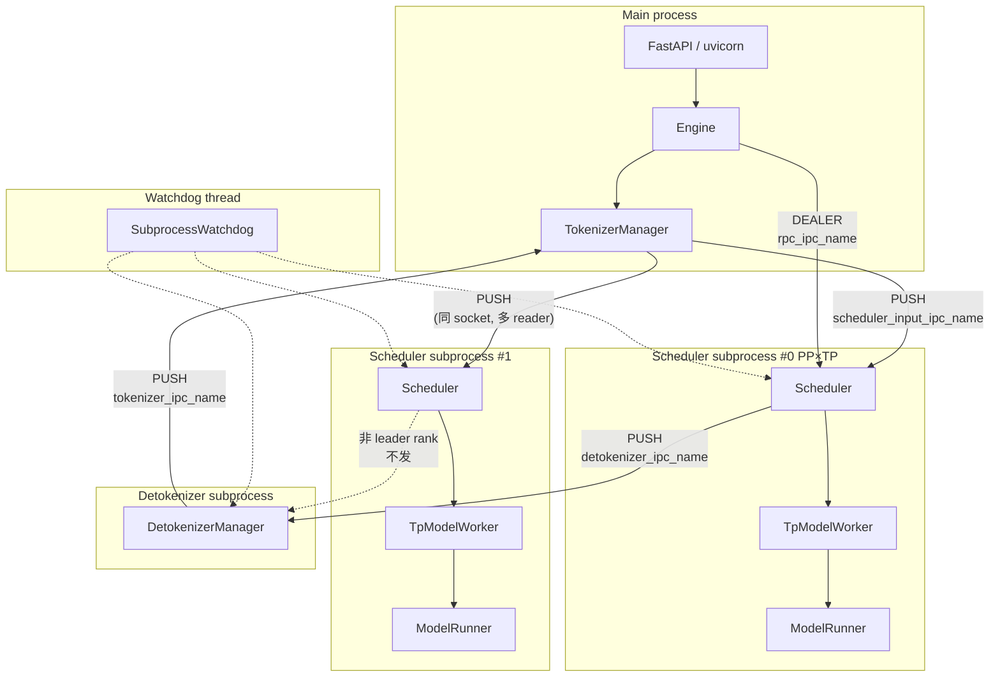
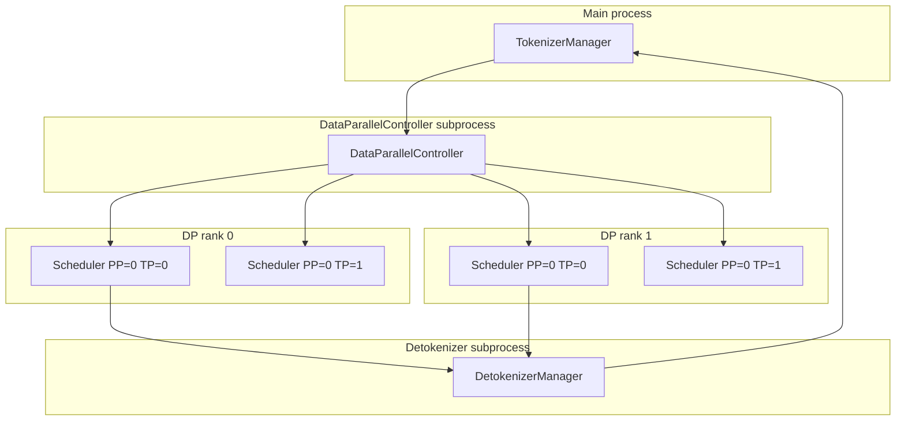

# Manager Pipeline (3-process + ZMQ pipeline)

## Summary
synthesis: SGLang 的"manager pipeline"是其架构最显著的特征——把 LLM serving 拆成 **3 类独立进程**：`TokenizerManager`（主进程）/ `Scheduler`（子进程，每 PP×TP 一个）/ `DetokenizerManager`（子进程）。三者之间纯 ZMQ PUSH/PULL，没有 RPC 应答，全靠 `rid` 路由。这种设计的好处是 **Python GIL 隔离**（每个进程独立 GIL，CPU 重的 tokenize / detokenize 不阻塞 scheduler 的 GPU 调度），代价是 **pickle 序列化 + 多 IPC hop**。

## Sources
- 进程拓扑权威定义：[entrypoints/engine.py:143-155](d:\design\sglang\python\sglang\srt\entrypoints\engine.py)（`Engine` docstring）
- 子进程 fork：[entrypoints/engine.py:522-625 _launch_scheduler_processes](d:\design\sglang\python\sglang\srt\entrypoints\engine.py), [_launch_subprocesses 627](d:\design\sglang\python\sglang\srt\entrypoints\engine.py)
- TokenizerManager 端 socket：[tokenizer_manager.py:344-362](d:\design\sglang\python\sglang\srt\managers\tokenizer_manager.py)
- Scheduler 端 socket：[scheduler.py:498-543](d:\design\sglang\python\sglang\srt\managers\scheduler.py)
- DetokenizerManager 端 socket：[detokenizer_manager.py:93-100](d:\design\sglang\python\sglang\srt\managers\detokenizer_manager.py)

## 拓扑

### 单 DP rank（默认）



### 多 DP rank（`dp_size > 1`）



锚点：[engine.py:588-602](d:\design\sglang\python\sglang\srt\entrypoints\engine.py)（`dp_size > 1` 路径会 fork `DataParallelController` 而非直接 fork scheduler）。

## ZMQ 端点全集

来自 `port_args`（在 [_launch_subprocesses](d:\design\sglang\python\sglang\srt\entrypoints\engine.py) 创建，传给所有 manager）：

| 端点名（PortArgs 字段） | 创建者 | 类型 | 写者 | 读者 | 锚点 |
|---|---|---|---|---|---|
| `tokenizer_ipc_name` | `bind=True` 在 TM | PULL | DetokenizerManager / Scheduler (skip_tokenizer_init 时) | TokenizerManager | [tokenizer_manager.py:346-348](d:\design\sglang\python\sglang\srt\managers\tokenizer_manager.py), [detokenizer_manager.py:98-100](d:\design\sglang\python\sglang\srt\managers\detokenizer_manager.py), [scheduler.py:510-517](d:\design\sglang\python\sglang\srt\managers\scheduler.py) |
| `scheduler_input_ipc_name` | `bind=True` 在 TM | PUSH（写）→ PULL（读） | TokenizerManager | Scheduler | [tokenizer_manager.py:349-352](d:\design\sglang\python\sglang\srt\managers\tokenizer_manager.py), [scheduler.py:503-505](d:\design\sglang\python\sglang\srt\managers\scheduler.py) |
| `detokenizer_ipc_name` | `bind=True` 在 Detok | PUSH→PULL | Scheduler | DetokenizerManager | [scheduler.py:520-522](d:\design\sglang\python\sglang\srt\managers\scheduler.py), [detokenizer_manager.py:95-97](d:\design\sglang\python\sglang\srt\managers\detokenizer_manager.py) |
| `rpc_ipc_name` | `bind=True` 在 Engine | DEALER→DEALER | Engine | Scheduler | [engine.py:218-220](d:\design\sglang\python\sglang\srt\entrypoints\engine.py), [scheduler.py:506-508](d:\design\sglang\python\sglang\srt\managers\scheduler.py) |
| `tokenizer_worker_ipc_name` | `bind=False` | PUSH（多 worker 模式） | TokenizerManager 的多 worker | Scheduler | [tokenizer_manager.py:357-362](d:\design\sglang\python\sglang\srt\managers\tokenizer_manager.py) |
| `metrics_ipc_name` | `bind=False` | PUSH | Scheduler（如果启 metrics） | metrics 进程 | [scheduler.py:540-543](d:\design\sglang\python\sglang\srt\managers\scheduler.py) |

> synthesis: 4 个核心 socket + 2 个可选 socket，总计 6 类 IPC 端点。

## bind / connect 方向（容易出错的点）

- `bind=True` 一侧创建 socket，`bind=False` 一侧 connect 到它
- `tokenizer_ipc_name` 在 TM 端 bind（[tokenizer_manager.py:347](d:\design\sglang\python\sglang\srt\managers\tokenizer_manager.py)），detokenizer / scheduler 都 connect 过来
- `scheduler_input_ipc_name` 在 **TM 端 bind**（[tokenizer_manager.py:351](d:\design\sglang\python\sglang\srt\managers\tokenizer_manager.py)），scheduler connect 过来；这与"PUSH 推送方"是 bind 方的常见直觉相反，**TM 是 bind 方但是 PUSH 写者**

## SubprocessWatchdog

`Engine.__init__` 的 `_launch_subprocesses` 返回 `subprocess_watchdog`（[engine.py:191-208](d:\design\sglang\python\sglang\srt\entrypoints\engine.py)）。它：

- 监控所有 scheduler / detokenizer 进程的 `proc.is_alive()`
- 任意进程死亡 → fast-fail Engine
- TM 持有引用：`tokenizer_manager._subprocess_watchdog = subprocess_watchdog`（[engine.py:206-207](d:\design\sglang\python\sglang\srt\entrypoints\engine.py)）

scheduler 端崩溃错误码：[engine.py:1190-1199 _scheduler_died_error](d:\design\sglang\python\sglang\srt\entrypoints\engine.py)。

## leader-only socket 的隐含约束

[scheduler.py:502](d:\design\sglang\python\sglang\srt\managers\scheduler.py)：

```python
if self.pp_rank == 0 and self.attn_tp_rank == 0 and self.attn_cp_rank == 0:
    # 创建所有 4 个 socket
else:
    self.recv_from_tokenizer = None
    self.recv_from_rpc = None
    self.send_to_tokenizer = SenderWrapper(None)
    self.send_to_detokenizer = SenderWrapper(None)
```

> synthesis: 这意味着只有"leader" scheduler 进程跟外部 manager 直接通信，其它 rank 的 scheduler 通过 **`TpModelWorker` / `PPMixin` 内部的 collective 通信** 同步收到的请求。

> [!todo] VERIFY: 非 leader rank 上 scheduler 怎么知道"批已经组好可以跑了"——通常是 `broadcast_pyobj` 通过 dist 进程组分发 `ScheduleBatch`，这部分在 `tp_worker.broadcast_*` 或 `SchedulerPPMixin` 里。

## fork 顺序与时序

[engine.py:_launch_subprocesses](d:\design\sglang\python\sglang\srt\entrypoints\engine.py) 大致顺序：

1. 创建 `port_args`（端口分配）
2. fork detokenizer 进程
3. fork scheduler 进程（带 `mp.Pipe` 用于 ready 信号）
4. 创建 `TokenizerManager`（在主进程）
5. `wait_for_ready(scheduler_pipe_readers, scheduler_procs)` 阻塞等所有 scheduler 通过 pipe 发送 ready ([engine.py:1201-1232 _wait_for_scheduler_ready](d:\design\sglang\python\sglang\srt\entrypoints\engine.py))

> [!todo] VERIFY: detokenizer 是否也有 ready signal pipe，还是它的"就绪"靠第一条 ZMQ 消息隐式确认。

## 与 vLLM v1 的对比（synthesis）

| 维度 | SGLang | vLLM v1 |
|---|---|---|
| 进程拓扑 | 3 个 manager + N 个 scheduler 子进程 | 1 个 EngineCoreProc + N 个 WorkerProc |
| Scheduler 位置 | 独立子进程 | EngineCoreProc 主线程内 |
| Tokenize 位置 | TokenizerManager 主进程 | EngineCoreProc 的 input_thread |
| Detokenize 位置 | DetokenizerManager 子进程 | EngineCoreProc 的 output_thread |
| 通信 | ZMQ + pickle | ZMQ + msgspec / 共享内存 MessageQueue |
| 失败传播 | SubprocessWatchdog 监控 → fast-fail | sentinel `multiprocessing.connection.wait` + EXECUTOR_FAILED 入队 |
| 进程隔离 | tokenize / detokenize / scheduler 各自 GIL | tokenize / detokenize 是 EngineCoreProc 内的 thread（共享 GIL） |
| Worker 编排抽象 | 没有（Scheduler 直接持有 TpModelWorker） | 有 `Executor` 抽象（4 种实现） |

> [!todo] VERIFY: SGLang 用 pickle vs vLLM 用 msgspec 的吞吐对比（待 ingest comparison/topics/serialization 时实测）。

## See also
- [topics/request-lifecycle.md](request-lifecycle.md)
- [modules/managers.md](../modules/managers.md)
- [entities/TokenizerManager.md](../entities/TokenizerManager.md)
- [entities/Scheduler.md](../entities/Scheduler.md)
- [vllm/topics/multiproc-ipc.md](../../vllm/topics/multiproc-ipc.md)（vLLM 同等视角的对比）

## Notes / Caveats

> [!todo] VERIFY: pin 从 `34fef07a` → `06f32bab`（2026-08-10 increment）后本页未深 verify；文件数量/行号可能漂移。优先对照 [entities/Scheduler.md](../entities/Scheduler.md) / 新模块页。
