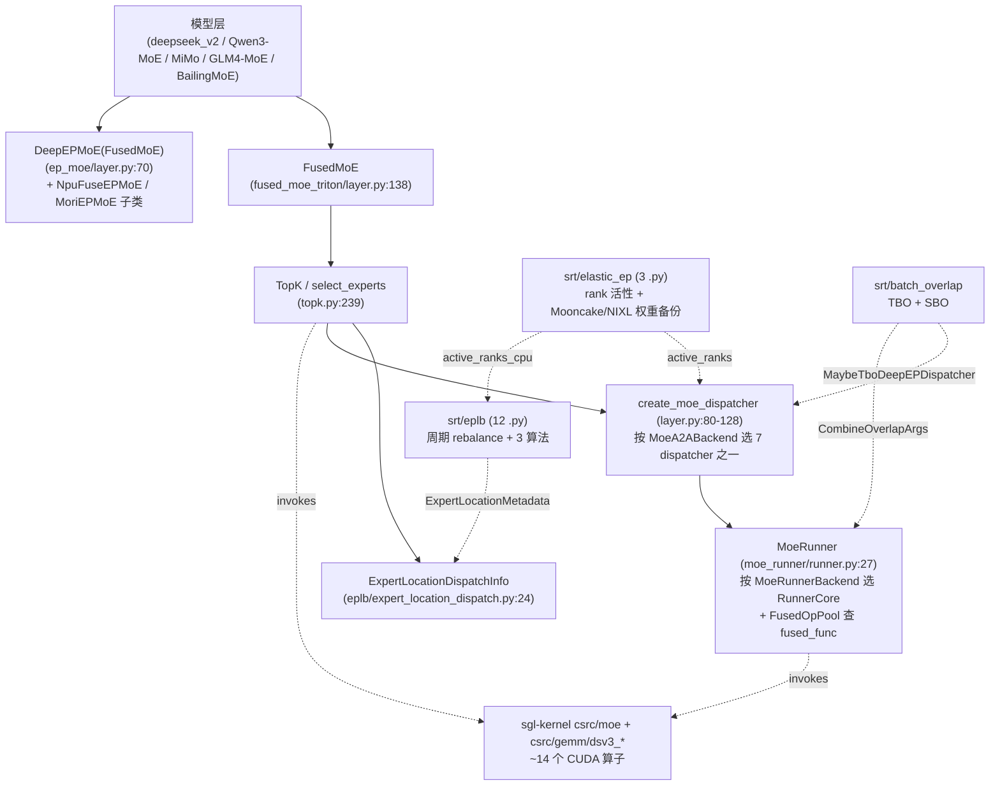

# MoE 体系（SGLang 内部）

## Summary

SGLang 的 MoE 由 **`srt/layers/moe/`（42 .py，2026-04-19 Glob）+ `srt/eplb/` + `srt/elastic_ep/` + `srt/batch_overlap/`** 四个目录构成。核心 `nn.Module` 类只有 [`FusedMoE`](d:\design\sglang\python\sglang\srt\layers\moe\fused_moe_triton\layer.py)（dense / TP）与其 EP 派生 [`DeepEPMoE`](d:\design\sglang\python\sglang\srt\layers\moe\ep_moe\layer.py)；**a2a 通信**由 7 取值的 [`moe_a2a_backend` Literal](d:\design\sglang\python\sglang\srt\server_args.py) 选 dispatcher，**专家算子**由 11 取值的 [`MoeRunnerBackend`](d:\design\sglang\python\sglang\srt\layers\moe\utils.py) + [`MoeRunner`](d:\design\sglang\python\sglang\srt\layers\moe\moe_runner\runner.py) 选 kernel；EPLB 提供周期重平衡，Elastic EP 提供 rank 活性 + Mooncake/NIXL 权重备份，TBO/SBO 在 MoE 路径上做 micro-batch / combine-down-gemm 重叠。

> synthesis: MoE 对 SGLang 是一个 **三层正交夹心**：(1) **逻辑层** `FusedMoE`/`DeepEPMoE` + `TopK` + `MoeRunnerConfig`；(2) **通信层** 7 个 a2a backend 各对应一个 `*Dispatcher`（独立 Buffer/Stage/Hook），由 [`create_moe_dispatcher`](d:\design\sglang\python\sglang\srt\layers\moe\fused_moe_triton\layer.py) 按全局 `MOE_A2A_BACKEND` 实例化；(3) **算子层** `MoeRunner` + `FusedOpPool` + `PermuteMethodPool` 把 `(a2a, runner)` 二元组映射到 fused / 非 fused kernel，挂接 [`sgl-kernel`](d:\design\sglang\python\sglang\kernels\aot\csrc) 的 ~14 个 MoE/topk/router CUDA 算子（含 DeepSeek 专属 `dsv3_router_gemm` / `dsv3_fused_a_gemm`）。**同一个 `FusedMoE` 实例在不同 backend 组合下能切到完全不同的 kernel 路径，无需重写 Module**。

## Sources

> 全部锚点指向 SGLang 源码绝对路径。每条具体论断在正文 inline 复述行号。

- **`srt/layers/moe/`（42 .py，2026-04-19 Glob）**：[utils.py](d:\design\sglang\python\sglang\srt\layers\moe\utils.py) / [topk.py](d:\design\sglang\python\sglang\srt\layers\moe\topk.py) / [router.py](d:\design\sglang\python\sglang\srt\layers\moe\router.py) / [fused_moe_triton/layer.py](d:\design\sglang\python\sglang\srt\layers\moe\fused_moe_triton\layer.py) / [ep_moe/layer.py](d:\design\sglang\python\sglang\srt\layers\moe\ep_moe\layer.py) / [ep_moe/kernels.py](d:\design\sglang\python\sglang\srt\layers\moe\ep_moe\kernels.py) / [moe_runner/](d:\design\sglang\python\sglang\srt\layers\moe\moe_runner)（runner.py + base.py + 5 backend core）/ [token_dispatcher/](d:\design\sglang\python\sglang\srt\layers\moe\token_dispatcher)（base + 7 backend）/ [cutlass_moe.py](d:\design\sglang\python\sglang\srt\layers\moe\cutlass_moe.py) / [cutlass_w4a8_moe.py](d:\design\sglang\python\sglang\srt\layers\moe\cutlass_w4a8_moe.py) / [flashinfer_trtllm_moe.py](d:\design\sglang\python\sglang\srt\layers\moe\flashinfer_trtllm_moe.py) / [flashinfer_cutedsl_moe.py](d:\design\sglang\python\sglang\srt\layers\moe\flashinfer_cutedsl_moe.py) / [kt_ep_wrapper.py](d:\design\sglang\python\sglang\srt\layers\moe\kt_ep_wrapper.py) / [routed_experts_capturer.py](d:\design\sglang\python\sglang\srt\layers\moe\routed_experts_capturer.py)
- **EPLB / Elastic EP / Overlap**：见各姊妹模块页 [eplb.md](../modules/eplb.md) / [elastic_ep.md](../modules/elastic_ep.md) / [batch_overlap.md](../modules/batch_overlap.md)；本页只锚 MoE 视角的耦合点。
- **CLI / 全局开关**：[server_args.py](d:\design\sglang\python\sglang\srt\server_args.py)
- **sgl-kernel C++ 绑定**：[sgl-kernel/csrc/common_extension.cc](d:\design\sglang\python\sglang\kernels\aot\csrc\common_extension.cc) + [sgl-kernel/csrc/moe/](d:\design\sglang\python\sglang\kernels\aot\csrc\moe) + [sgl-kernel/csrc/gemm/dsv3_*](d:\design\sglang\python\sglang\kernels\aot\csrc\gemm)

## Architecture



- **运行时入口序列**（典型 dense MoE 层 forward）：
  1. 模型层把 `hidden_states` + 路由 logits 传入 `FusedMoE.forward`（[fused_moe_triton/layer.py:978](d:\design\sglang\python\sglang\srt\layers\moe\fused_moe_triton\layer.py)）；
  2. `forward_impl`（[L1005](d:\design\sglang\python\sglang\srt\layers\moe\fused_moe_triton\layer.py)）走 `dispatch → MoeRunner.run → combine`，piecewise CUDA Graph 路径走 [`moe_forward_piecewise_cuda_graph_impl`](d:\design\sglang\python\sglang\srt\layers\moe\fused_moe_triton\layer.py)；
  3. `MoeRunner.run`（[runner.py:91-157](d:\design\sglang\python\sglang\srt\layers\moe\moe_runner\runner.py)）查 `FusedOpPool.get_fused_func(a2a_name, runner_name)` —— 命中即直接调融合算子，否则走 `pre_permute → runner_core.run → post_permute` 三段；
  4. 若 `IS_TBO_ENABLED`（[utils.py:187](d:\design\sglang\python\sglang\srt\layers\moe\utils.py)）则 dispatcher 已被换为 [`MaybeTboDeepEPDispatcher`](d:\design\sglang\python\sglang\srt\batch_overlap\two_batch_overlap.py)，dispatch/combine 各持两份并由 `execute_overlapped_operations` 交错。

## MoE 实现矩阵

| 类 | 文件:行 | 用途 / kernel |
|---|---|---|
| `FusedMoE` | [fused_moe_triton/layer.py:138](d:\design\sglang\python\sglang\srt\layers\moe\fused_moe_triton\layer.py) | 基类；dense / TP / single-rank EP；持 `MoeRunnerConfig` + `quant_method`；`forward_impl` 调 `MoeRunner` → Triton / DeepGEMM / Cutlass / Marlin / FlashInfer 任一 |
| `DeepEPMoE(FusedMoE)` | [ep_moe/layer.py:70-74](d:\design\sglang\python\sglang\srt\layers\moe\ep_moe\layer.py) | EP 路径基类；docstring 注："**Mooncake EP 共用此类**"；按 `quant_config` 自适应启用 DeepGEMM JIT 折叠（`deprecate_flag`，[L109-117](d:\design\sglang\python\sglang\srt\layers\moe\ep_moe\layer.py)） |
| `NpuFuseEPMoE(DeepEPMoE)` | [ep_moe/layer.py:436](d:\design\sglang\python\sglang\srt\layers\moe\ep_moe\layer.py) | Ascend FuseEP；torch_npu fused MoE |
| `MoriEPMoE(DeepEPMoE)` | [ep_moe/layer.py:597](d:\design\sglang\python\sglang\srt\layers\moe\ep_moe\layer.py) | AMD MoriEP；aiter MoriEP kernel |
| `KTEPWrapperMethod` | [kt_ep_wrapper.py:117](d:\design\sglang\python\sglang\srt\layers\moe\kt_ep_wrapper.py) | KTransformers AMX/CPU 卸载（`FusedMoEMethodBase` 子类） |
| `_RoutedExpertsDeviceCache` | [routed_experts_capturer.py:29](d:\design\sglang\python\sglang\srt\layers\moe\routed_experts_capturer.py) | 录制 routed expert 激活到 buffer，供 EPLB 统计 / debug |

> [!note] 不存在独立的 `EPMoE` 类——任务描述里把 "EPMoE" 当独立类有误。EP 路径**统一以 `DeepEPMoE` 为基类**，Mooncake / Mori / NPU 仅在子类或 dispatcher 上分叉。

> synthesis: 文件层有 [`flashinfer_trtllm_moe.py`](d:\design\sglang\python\sglang\srt\layers\moe\flashinfer_trtllm_moe.py) / [`flashinfer_cutedsl_moe.py`](d:\design\sglang\python\sglang\srt\layers\moe\flashinfer_cutedsl_moe.py) / [`cutlass_moe.py`](d:\design\sglang\python\sglang\srt\layers\moe\cutlass_moe.py) / [`cutlass_w4a8_moe.py`](d:\design\sglang\python\sglang\srt\layers\moe\cutlass_w4a8_moe.py) 这些 **顶层函数文件**——它们不是 `nn.Module`，而是被 `MoeRunner` 走 `runner_core / fused_func` 注册路径调用（如 `flashinfer_trtllm.py:860 @register_fused_func("none","flashinfer_trtllm")`）。模型层完全不直接 import 它们，只 import `FusedMoE`。

## 7-取值 a2a backend 矩阵

来源：[`ServerArgs.moe_a2a_backend: Literal["none","deepep","mooncake","nixl","mori","ascend_fuseep","flashinfer"]`](d:\design\sglang\python\sglang\srt\server_args.py)。

| # | a2a 名 | Dispatcher 类 :line | 协议 / 关键实现 | 平台 |
|---|---|---|---|---|
| 1 | `none` | [`StandardDispatcher` :84](d:\design\sglang\python\sglang\srt\layers\moe\token_dispatcher\standard.py) | 无 a2a；TP all-reduce 或 `reduce_scatterv`（DP+EP=DP_size 时，[utils.py:301-313](d:\design\sglang\python\sglang\srt\layers\moe\utils.py)） | 全平台 |
| 2 | `deepep` | [`DeepEPDispatcher` :731](d:\design\sglang\python\sglang\srt\layers\moe\token_dispatcher\deepep.py) | DeepEP (NVSHMEM+IB)；`Normal` / `LowLatency` 双 impl（[L372 / L534](d:\design\sglang\python\sglang\srt\layers\moe\token_dispatcher\deepep.py)）；`DeepEPMode` 三态（[utils.py:116-144](d:\design\sglang\python\sglang\srt\layers\moe\utils.py)）；`DeepEPBuffer` 单例（[L136-260](d:\design\sglang\python\sglang\srt\layers\moe\token_dispatcher\deepep.py)） | CUDA |
| 3 | `mooncake` | [`MooncakeEPDispatcher` :286](d:\design\sglang\python\sglang\srt\layers\moe\token_dispatcher\mooncake.py) | Mooncake `Buffer.dispatch/combine`；elastic EP 时透传 `active_ranks`（[L212,252](d:\design\sglang\python\sglang\srt\layers\moe\token_dispatcher\mooncake.py)） | CUDA + Mooncake TE |
| 4 | `nixl` | [`NixlEPDispatcher` :350](d:\design\sglang\python\sglang\srt\layers\moe\token_dispatcher\nixl.py) | NIXL；缓存 `active_ranks` 引用并 `copy_(1 - mask_buffer)` 原地写入（[L153,327](d:\design\sglang\python\sglang\srt\layers\moe\token_dispatcher\nixl.py)） | CUDA + NIXL |
| 5 | `mori` | [`MoriEPDispatcher` :900](d:\design\sglang\python\sglang\srt\layers\moe\token_dispatcher\moriep.py) | aiter MoriEP；`CommStreamPool` + `EpDispatchConfig` + `Normal`/`LowLatency` 双 impl（[L132,311,461,716](d:\design\sglang\python\sglang\srt\layers\moe\token_dispatcher\moriep.py)） | HIP (AMD) |
| 6 | `ascend_fuseep` | [`NpuFuseEPDispatcher` :43](d:\design\sglang\python\sglang\srt\layers\moe\token_dispatcher\fuseep.py) | torch_npu FuseEP；配 `NpuFuseEPMoE`（[ep_moe/layer.py:436](d:\design\sglang\python\sglang\srt\layers\moe\ep_moe\layer.py)） | NPU (Ascend) |
| 7 | `flashinfer` | [`FlashinferDispatcher` :72](d:\design\sglang\python\sglang\srt\layers\moe\token_dispatcher\flashinfer.py) | FlashInfer 内 a2a；与 FlashInfer cutlass / cutedsl runner 配对 | CUDA + FlashInfer |

> [!warning] CONTRADICTION：[`MoeA2ABackend` enum](d:\design\sglang\python\sglang\srt\layers\moe\utils.py) 实际有 **8 个成员**——上述 7 项 + 额外的 `CUSTOMIZED = "customized"`（[L32](d:\design\sglang\python\sglang\srt\layers\moe\utils.py) + [`is_customized()`](d:\design\sglang\python\sglang\srt\layers\moe\utils.py)），但 [`ServerArgs.moe_a2a_backend` Literal](d:\design\sglang\python\sglang\srt\server_args.py) **不允许** `"customized"`，CLI choices 也由该 Literal 派生。**`customized` 只能通过非 CLI 路径设置**（如外部插件直接写 `MOE_A2A_BACKEND` 全局），目前在 srt/ 内 grep 0 个 `is_customized` 真实分支命中——属待清理的预留枚举。

> [!note] CLI 选项数 = **7**（与任务描述一致）；enum 成员数 = **8**（含 `customized` 预留）；dispatcher `__init__.py` 导出的 dispatcher 类为 **7 个**：`StandardDispatcher` / `DeepEPDispatcher` / `MooncakeEPDispatcher` / `NixlEPDispatcher` / `MoriEPDispatcher` / `FlashinferDispatcher` / `NpuFuseEPDispatcher`（[token_dispatcher/__init__.py:1-79](d:\design\sglang\python\sglang\srt\layers\moe\token_dispatcher\__init__.py)）。

### Dispatcher → kernel 选择（[`create_moe_dispatcher`](d:\design\sglang\python\sglang\srt\layers\moe\fused_moe_triton\layer.py)）

```
none                        → StandardDispatcher
deepep | mooncake | mori | nixl → MaybeTboDeepEPDispatcher (TBO 时双实例)
ascend_fuseep                → NpuFuseEPDispatcher
flashinfer                   → FlashinferDispatcher
```

> synthesis: 注意 `mooncake` / `mori` / `nixl` 都被 [`create_moe_dispatcher`](d:\design\sglang\python\sglang\srt\layers\moe\fused_moe_triton\layer.py) **统一包成 `MaybeTboDeepEPDispatcher`**（与原生 `deepep` 同一个 wrapper class），即从 dispatch API 视角它们与 DeepEP 接口一致；分歧在底层 buffer / kernel。`is_deepep_class_backend()`（[utils.py:260-263](d:\design\sglang\python\sglang\srt\layers\moe\utils.py)）也把 deepep / mooncake / mori 视为同一族（**注意：未含 nixl**——这是另一处接口 vs 分类的 subtle 不一致）。

## topk 子系统

| 文件 | 主要内容 |
|---|---|
| [topk.py](d:\design\sglang\python\sglang\srt\layers\moe\topk.py) | [`TopKConfig`](d:\design\sglang\python\sglang\srt\layers\moe\topk.py) / [`TopKOutputFormat`](d:\design\sglang\python\sglang\srt\layers\moe\topk.py)（`STANDARD`/`TRITON_KERNEL`/`BYPASSED`）/ [`TopK(MultiPlatformOp)`](d:\design\sglang\python\sglang\srt\layers\moe\topk.py)；CUDA 路径调 `sgl_kernel.moe_fused_gate`（[L85](d:\design\sglang\python\sglang\srt\layers\moe\topk.py)）与 FlashInfer `fused_topk_deepseek`（[L85-122](d:\design\sglang\python\sglang\srt\layers\moe\topk.py)） |
| [router.py](d:\design\sglang\python\sglang\srt\layers\moe\router.py) | Triton `@triton.jit` `fused_moe_router_cudacore_kernel`（[L13](d:\design\sglang\python\sglang\srt\layers\moe\router.py)）— 路由小矩阵的 cudacore 版本；调用方在 model 层 |

[`TopK.forward_cuda`](d:\design\sglang\python\sglang\srt\layers\moe\topk.py) 按 `MoeRunnerBackend` 选择输出格式：`triton_kernels` → `TRITON_KERNEL`；`flashinfer_trtllm` / `flashinfer_mxfp4` → `BYPASSED`（topk 推迟到 fused 算子内部）；其余 → `STANDARD`（普通 `(weights, ids, logits)` namedtuple）。

`select_experts` 在每次 forward 调 [`expert_location_dispatch.transform_select_experts_inputs`](d:\design\sglang\python\sglang\srt\eplb\expert_location_dispatch.py)（如启用 `ep_dispatch_algorithm == "fake"` 会 `uniform_(5,10)` 噪声覆写 router_logits 用于压测）和 [`topk_ids_logical_to_physical`](d:\design\sglang\python\sglang\srt\eplb\expert_location_dispatch.py)。

## EPLB 重平衡链（MoE 视角）

完整模块详见 [eplb.md](../modules/eplb.md)。MoE 关键耦合：

- **统计录入**：MoE 路径 hook 写入 `ExpertDistributionRecorder` —— `topk.py` 的 `on_select_experts` 与 `token_dispatcher/deepep.py` 的 `on_deepep_dispatch_*`（详见 [eplb.md §跨子系统引用 #2](../modules/eplb.md#2-协作伙伴跨子系统引用)）。
- **周期触发**：`EPLBManager._entrypoint`（[eplb_manager.py:45-50](d:\design\sglang\python\sglang\srt\eplb\eplb_manager.py)）每 `eplb_rebalance_num_iterations` 次 forward `yield from self.rebalance()`。
- **算法**（3 套实现 + hierarchical 变体 = **6 enum**）：`deepseek` / `deepseek_vec` / `elasticity_aware`（后者接受 `ElasticEPStateManager.active_ranks`）；`compute_algorithm("auto", ...)`（[eplb_algorithms/__init__.py:75-87](d:\design\sglang\python\sglang\srt\eplb\eplb_algorithms\__init__.py)）按 `num_groups % num_nodes` 选 hierarchical 或 flat。
- **应用**：`ExpertLocationMetadata.init_by_eplb`（[expert_location.py:163-177](d:\design\sglang\python\sglang\srt\eplb\expert_location.py)）→ `ModelRunner.update_expert_location`（[model_runner.py:1399-1410](d:\design\sglang\python\sglang\srt\model_executor\model_runner.py)）→ `ExpertLocationUpdater.update` 重排各 MoE 层 routed expert 权重，按 chunk yield 跨多个 forward。

> [!warning] CONTRADICTION（重申 [eplb.md](../modules/eplb.md) RESOLVED）：[`ExpertLocationDispatchInfo.ep_dispatch_algorithm`](d:\design\sglang\python\sglang\srt\eplb\expert_location_dispatch.py) dataclass 注解为 `Literal["static", "random"]`，但运行时实际接受 `"static"` / `"dynamic"` / `"fake"` 三值（[expert_location_dispatch.py:69,82,84](d:\design\sglang\python\sglang\srt\eplb\expert_location_dispatch.py)），与 `ServerArgs.ep_dispatch_algorithm` 一致。注解应改为 `Literal["static", "dynamic", "fake"]`。MoE 视角体感 bug：IDE 类型检查会误报 `"dynamic"` 不合法。

## Elastic EP 容灾（MoE 视角）

完整模块详见 [elastic_ep.md](../modules/elastic_ep.md)。MoE 关键耦合：

- **共享活性张量** `active_ranks` GPU tensor + `active_ranks_cpu` CPU 镜像（[elastic_ep.py:12-73](d:\design\sglang\python\sglang\srt\elastic_ep\elastic_ep.py)）。
- **NIXL 写入**：构造时缓存引用 → 每步 `copy_(1 - mask_buffer)` 原地写（[nixl.py:153,327](d:\design\sglang\python\sglang\srt\layers\moe\token_dispatcher\nixl.py)）。
- **Mooncake 读取**：dispatch / combine 把 `active_ranks` 透传给 Mooncake `Buffer.dispatch/combine`（[mooncake.py:212,252](d:\design\sglang\python\sglang\srt\layers\moe\token_dispatcher\mooncake.py)）。
- **EPLB 触发**：`ModelRunner.forward` 检测 `is_active_equal_last() == False` → 立即 `eplb_manager.rebalance()` 后再跑一轮 `_forward_raw`（[model_runner.py:2886-2905](d:\design\sglang\python\sglang\srt\model_executor\model_runner.py)）。
- **Expert 备份**：`ExpertBackupManager` 子进程把 expert 权重加载到 CPU buffer 并 Mooncake TE `register_memory`；worker 侧 `ExpertBackupClient.update_weights` 通过 `batch_transfer_sync_read` 拉取（[expert_backup_manager.py](d:\design\sglang\python\sglang\srt\elastic_ep\expert_backup_manager.py) + [expert_backup_client.py](d:\design\sglang\python\sglang\srt\elastic_ep\expert_backup_client.py)）。

> [!warning] CONTRADICTION（NPU 不支持 elastic_ep）：[`ElasticEPStateManager._select_device`](d:\design\sglang\python\sglang\srt\elastic_ep\elastic_ep.py) 显式 `raise NotImplementedError("Only CUDA and CPU support elastic ep now.")`；[`ExpertBackupManager` L163-171](d:\design\sglang\python\sglang\srt\elastic_ep\expert_backup_manager.py) 硬编码 `gpu_id=0` 且 import `mooncake_transfer_engine`。但 [docs/platforms/ascend/ascend_npu_support_features.md:267](d:\design\sglang\docs\platforms\ascend\ascend_npu_support_features.md) 把 `--elastic-ep-backend` 列入 NPU 支持表 —— **doc 与代码矛盾**。

## TBO / SBO overlap（MoE 视角）

完整机制详见 [batch_overlap.md](../modules/batch_overlap.md)。

- **TBO**：`enable_two_batch_overlap` 时 [`create_moe_dispatcher`](d:\design\sglang\python\sglang\srt\layers\moe\fused_moe_triton\layer.py) 把 deepep/mooncake/mori/nixl 自动包裹为 [`MaybeTboDeepEPDispatcher`](d:\design\sglang\python\sglang\srt\batch_overlap\two_batch_overlap.py)（持 **两个** EP dispatcher 实例）；`TboForwardBatchPreparer` 切 ForwardBatch → 两 micro-batch；`execute_overlapped_operations` 双 `_StageExecutor` 按 `tbo_delta_stages` 步进交错。
- **SBO**：单 batch 内 MoE combine 与 down-gemm 用 [`CombineOverlapArgs`](d:\design\sglang\python\sglang\srt\batch_overlap\single_batch_overlap.py)（`torch.cuda.Stream` + `Event`）+ `DownGemmOverlapArgs`；经 [`MoeRunner.set_overlap_args`](d:\design\sglang\python\sglang\srt\layers\moe\moe_runner\runner.py) 注入 runner_core 的 `running_state`。

> synthesis: TBO 与 SBO 并非互斥——前者切 micro-batch（**跨** MoE 层粒度），后者切 combine/gemm（**MoE 层内** kernel 粒度）。`enable_two_batch_overlap` 与 `moe_a2a_backend == "none"` 互斥并由 [server_args.py:6629-6633](d:\design\sglang\python\sglang\srt\server_args.py) 强校验；SBO 无此约束。

## sgl-kernel MoE 绑定

`TORCH_LIBRARY` 注册表 [sgl-kernel/csrc/common_extension.cc](d:\design\sglang\python\sglang\kernels\aot\csrc\common_extension.cc)：

| 算子（行号） | 用途 |
|---|---|
| `dsv3_fused_a_gemm` ([L144-145](d:\design\sglang\python\sglang\kernels\aot\csrc\common_extension.cc)) | DeepSeek-V3 fused A GEMM（RMSNorm + 量化 + GEMM 下投影前置） |
| `dsv3_router_gemm` ([L147-148](d:\design\sglang\python\sglang\kernels\aot\csrc\common_extension.cc)) | DeepSeek-V3 router GEMM；BF16/FP 输出两版：[gemm/dsv3_router_gemm_bf16_out.cu](d:\design\sglang\python\sglang\kernels\aot\csrc\gemm\dsv3_router_gemm_bf16_out.cu) / [_float_out.cu](d:\design\sglang\python\sglang\kernels\aot\csrc\gemm\dsv3_router_gemm_float_out.cu) |
| `moe_align_block_size` ([L165-168](d:\design\sglang\python\sglang\kernels\aot\csrc\common_extension.cc)) | topk 排序后对齐 block_size 边界喂给 grouped GEMM |
| `moe_sum_reduce` / `moe_sum` ([L180-184](d:\design\sglang\python\sglang\kernels\aot\csrc\common_extension.cc)) | combine 阶段按 `routed_scaling_factor` 累加 / 简单求和 |
| `moe_fused_gate` ([L187-190](d:\design\sglang\python\sglang\kernels\aot\csrc\common_extension.cc)) | DeepSeek 风格 fused gate（sigmoid + group topk） |
| `kimi_k2_moe_fused_gate` ([L193-196](d:\design\sglang\python\sglang\kernels\aot\csrc\common_extension.cc)) | Kimi K2 路由变体 |
| `prepare_moe_input` ([L206-209](d:\design\sglang\python\sglang\kernels\aot\csrc\common_extension.cc)) | 准备 cutlass MoE 的 expert offsets / problem sizes |
| `get_cutlass_w4a8_moe_mm_data` / `cutlass_w4a8_moe_mm` ([L229-242](d:\design\sglang\python\sglang\kernels\aot\csrc\common_extension.cc)) | Cutlass W4A8 grouped MM 元数据 + kernel |
| `topk_softmax` / `topk_sigmoid` / `fast_topk` ([L99, 171-178](d:\design\sglang\python\sglang\kernels\aot\csrc\common_extension.cc)) | 通用 / DeepSeek 风格 / 速度优化 topk |

CPU 路径独立：[csrc/cpu/moe.cpp](d:\design\sglang\python\sglang\kernels\aot\csrc\cpu\moe.cpp) / `moe_fp8.cpp` / `moe_int8.cpp` / `moe_int4.cpp` / `topk.cpp`；量化变体 [gguf/moe.cuh](d:\design\sglang\python\sglang\kernels\aot\csrc\quantization\gguf\moe.cuh) / [gguf/moe_vec.cuh](d:\design\sglang\python\sglang\kernels\aot\csrc\quantization\gguf\moe_vec.cuh) / [gemm/marlin/dequant.h](d:\design\sglang\python\sglang\kernels\aot\csrc\gemm\marlin\dequant.h)。

> synthesis: DeepSeek-V3 是**唯一**在 sgl-kernel 内有专用 GEMM 算子的模型族（`dsv3_router_gemm` / `dsv3_fused_a_gemm`）；Kimi K2 仅 fused gate 变体；其它 MoE 模型族（Qwen3 / GLM4 / MiMo / BailingMoE 等）共享通用 `moe_fused_gate` + `topk_softmax` + `cutlass_w4a8_moe_mm`，与 [models.md](../modules/models.md) "DeepSeek 是 SGLang 旗舰模型"叙事一致。

## CLI 全表

所有锚点均在 [server_args.py](d:\design\sglang\python\sglang\srt\server_args.py)。EPLB 子集详见 [eplb.md §CLI](../modules/eplb.md#cli--config-字段)；Elastic EP 子集详见 [elastic_ep.md §CLI](../modules/elastic_ep.md#cli--config-字段)。

| 类别 | flag | 类型 / 默认 | 行号 |
|---|---|---|---|
| EP 基础 | `--ep-size` | int, 1 | 527, 5275-5281 |
| 通信 | `--moe-a2a-backend` | Literal 7 取值, `none` | 528-530, 5282-5288 |
| 算子 | `--moe-runner-backend` | MoeRunnerBackend 11 取值, `auto` | 531, 5289-5295 |
| 算子 | `--flashinfer-mxfp4-moe-precision` | `default` / `bf16` | 532, 5296-5302 |
| DeepEP | `--deepep-mode` | `auto` / `normal` / `low_latency` | 536, 5318-5324 |
| DeepEP | `--deepep-config` | Optional[str] | 550 |
| EP 冗余 | `--ep-num-redundant-experts` | int, 0 | 537, 5325-5329 |
| EP 分派 | `--ep-dispatch-algorithm` | `static` / `dynamic` / `fake` | 538, 5331-5335 |
| EP 初始 | `--init-expert-location` | str, `trivial` | 539, 5337-5341 |
| EPLB | `--enable-eplb` / `--eplb-algorithm` / `--eplb-rebalance-num-iterations` / `--eplb-rebalance-layers-per-chunk` / `--eplb-min-rebalancing-utilization-threshold` | — | 540-544, 5343-5370 |
| 录制 | `--expert-distribution-recorder-{mode,buffer-size}` / `--enable-expert-distribution-metrics` | — | 545-549, 5372-5387 |
| Dense TP | `--moe-dense-tp-size` | Optional[int] | 551 |
| Elastic | `--elastic-ep-backend` | `Literal[None, "mooncake", "nixl"]` | 552, 5401-5406 |
| Elastic | `--enable-elastic-expert-backup` | store_true | 553, 5408-5412 |
| Overlap | `--enable-two-batch-overlap` | store_true | 643, 5839-5842 |
| Overlap | `--enable-single-batch-overlap` | store_true | 644, 5843-5847 |
| Overlap | `--tbo-token-distribution-threshold` | float, 0.48 | 645, 5848-5851 |
| Spec MoE | `--speculative-moe-runner-backend` | Optional[str] | 511, 5204 |
| Spec MoE | `--speculative-moe-a2a-backend` | Optional[str] | 512, 5204 |

speculative MoE 的运行时切换由 [`speculative_moe_backend_context`](d:\design\sglang\python\sglang\srt\layers\moe\utils.py) / [`speculative_moe_a2a_backend_context`](d:\design\sglang\python\sglang\srt\layers\moe\utils.py) 两个 contextmanager 在 draft 路径完成。

### 关键约束 / 自动调整

- `moe_a2a_backend != "none"` 时一些校验由 [`__post_init__` 各 `_handle_*`](d:\design\sglang\python\sglang\srt\server_args.py) 触发；如 `--enable-two-batch-overlap` 与 `moe_a2a_backend == "none"` 互斥（[server_args.py:6629-6633](d:\design\sglang\python\sglang\srt\server_args.py)）。
- `flashinfer_cutedsl` runner backend 仅允许 `moe_a2a_backend ∈ {none, deepep}`（[server_args.py:2814-2819](d:\design\sglang\python\sglang\srt\server_args.py)）。
- 启用 `enable_eplb` 但 `expert_distribution_recorder_mode is None` 时自动设 `stat`（[server_args.py:2959-2964](d:\design\sglang\python\sglang\srt\server_args.py)）。
- `elastic_ep_backend` 非空时若 `enable_eplb` 则强制 `eplb_algorithm` 为 `elasticity_aware` 系（[server_args.py:2974-2987](d:\design\sglang\python\sglang\srt\server_args.py)）。

## §跨子系统五路检索摘要

按 [AGENTS.md §5 step 3](../../AGENTS.md)：

1. **跨语言绑定**：MoE → sgl-kernel ~14 个 CUDA 算子（见 §sgl-kernel MoE 绑定）；DeepEP / Mooncake / NIXL / Mori / NPU FuseEP **均依赖外部 Python 包**（`deep_ep` / `mooncake_transfer_engine` / `nixl` / `aiter` / `torch_npu`），SGLang 端仅提供 dispatcher wrapper。
2. **协作类**：`FusedMoE` 在 [srt/models/](d:\design\sglang\python\sglang\srt\models) 被多个 MoE 模型文件 import（DeepSeek V2/V3/V32、Qwen3-MoE、MiMo、GLM4-MoE、BailingMoE、Llama4、MiniMax-M2 等，详见 [models.md](../modules/models.md)）；`DeepEPMoE` 主要在 deepseek 系列；`MoeRunner` / `MoeRunnerConfig` 仅 layers/moe/ 自治。
3. **配置共享**：`MOE_A2A_BACKEND` / `IS_TBO_ENABLED` 等全局变量由 [`initialize_moe_config(server_args)`](d:\design\sglang\python\sglang\srt\layers\moe\utils.py) 在 ModelRunner 初始化时一次性写入；`get_moe_a2a_backend()` 在所有 dispatcher / runner 路径懒读。
4. **测试覆盖**：EP 集成测试 [test/registered/ep/](d:\design\sglang\test\registered\ep)；TBO 测试 [test/manual/test_two_batch_overlap.py](d:\design\sglang\test\manual\test_two_batch_overlap.py)；EPLB / Elastic EP 测试见姊妹模块页 §测试覆盖反查。
5. **doc**：[docs/advanced_features/expert_parallelism.md](d:\design\sglang\docs\advanced_features\expert_parallelism.md) / [server_arguments.md](d:\design\sglang\docs\advanced_features\server_arguments.md)；Ascend doc 列 `--elastic-ep-backend`（与代码矛盾，见上）。

## Notes / Caveats

> [!todo] VERIFY: pin 从 `34fef07a` → `06f32bab`（2026-08-10 increment）后本页未深 verify；文件数量/行号可能漂移。优先对照 [entities/Scheduler.md](../entities/Scheduler.md) / 新模块页。

> [!todo] VERIFY: [`is_deepep_class_backend()`](d:\design\sglang\python\sglang\srt\layers\moe\utils.py) 把 deepep / mooncake / mori 视为同族，**未含 nixl**；但 [`create_moe_dispatcher`](d:\design\sglang\python\sglang\srt\layers\moe\fused_moe_triton\layer.py) 把 nixl 与前三者一同包成 `MaybeTboDeepEPDispatcher`。两处分类不一致——是 `is_deepep_class_backend` 漏写 `is_nixl()`，还是 nixl 在某些 EP path（如 quant 配对）确实不应被视作 DeepEP 族？需对照运行时调用站确认。

> [!todo] VERIFY: `MoeA2ABackend.CUSTOMIZED`（[utils.py:32, 64-65](d:\design\sglang\python\sglang\srt\layers\moe\utils.py)）在 srt/ 内 grep `is_customized()` 仅本类自身定义命中，无消费方分支；属预留 enum，建议要么补 CLI 要么删除（消除上文 enum 8 vs CLI 7 的 CONTRADICTION）。

> synthesis: `kt_ep_wrapper.py` (KTransformers) 与 `routed_experts_capturer.py` 是 MoE 体系相对**外围**的两个文件（CPU/AMX 卸载 + 激活捕获），不在主 forward 路径，但占据 42 个 .py 中的 2 席——表明 SGLang 把 "MoE plumbing" 与 "MoE 实验/调试" 共置一目录，未做 production / experimental 切分。

> synthesis: 与 [`comparison/topics/distributed.md`](../../comparison/topics/distributed.md) 视角对照，**SGLang MoE 的差异化卖点**：(1) 7 取值 a2a backend **最宽**通信协议矩阵；(2) EPLB + Elastic EP 双姊妹模块共享 `active_ranks` GPU 张量；(3) TBO/SBO 双开关分别覆盖 micro-batch 粒度 vs combine-gemm 粒度。三件单独都可在 vLLM / MindIE 找到对偶，但**三者同时落在同一 MoE 组合**是 SGLang 当前独有。

## See also

- 模块：[layers.md](../modules/layers.md)（顶层 layers/ 矩阵；含 moe(42) 子系统统计）
- 模块：[eplb.md](../modules/eplb.md)（重平衡完整链）
- 模块：[elastic_ep.md](../modules/elastic_ep.md)（rank 活性 + Mooncake 备份）
- 模块：[batch_overlap.md](../modules/batch_overlap.md)（TBO / SBO）
- 模块：[models.md](../modules/models.md)（MoE 模型族 — DeepSeek / Qwen3-MoE / MiMo / GLM4-MoE / BailingMoE / Llama4 / MiniMax-M2）
- 模块：[distributed.md](../modules/distributed.md)（EP / TP 通信组）
- 模块：[hardware_backend.md](../modules/hardware_backend.md)（NPU / AMD aiter 路径与 MoE 绑定）
- 索引：[sglang/index.md](../index.md)
- 跨项目对比：[comparison/topics/moe.md](../../comparison/topics/moe.md)（**DONE 2026-04-19**——三方对照表 13 子维度 + vLLM fused_moe/ 68 .py 首份 fresh grep + DeepSeek-V3 三家共同灯塔 + `routed_experts_capturer.py` vLLM→SGLang 显式 attribution）
