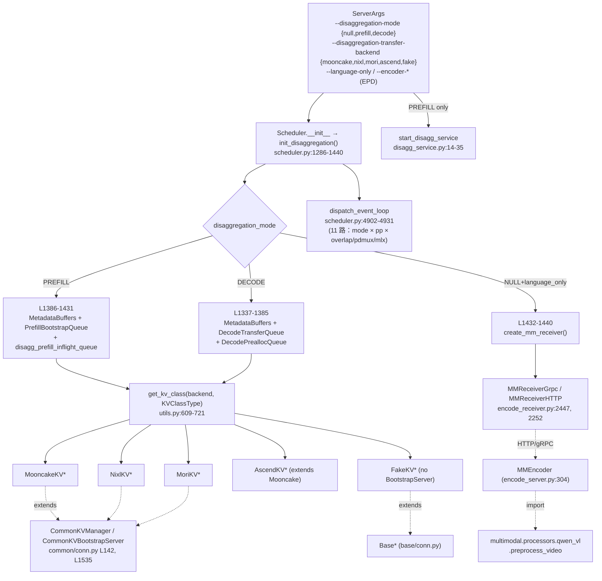

# PD 分离架构（SGLang 内部）

## Summary

SGLang 的 PD 分离子系统由 **5 个 KV 传输 backend**（[`TransferBackend` 枚举 5 项 L592-597](d:\design\sglang\python\sglang\srt\disaggregation\utils.py)：`MOONCAKE` / `MORI` / `NIXL` / `ASCEND` / `FAKE`）、**2 个 `Scheduler` mixin**（[`SchedulerDisaggregationDecodeMixin`](d:\design\sglang\python\sglang\srt\disaggregation\decode.py) + [`SchedulerDisaggregationPrefillMixin`](d:\design\sglang\python\sglang\srt\disaggregation\prefill.py)，构成 [`Scheduler` 6 mixin 父类](d:\design\sglang\python\sglang\srt\managers\scheduler.py) [L383-390] 中的 2 席）、**EPD 多模态三段架构**（[`encode_server.py`](d:\design\sglang\python\sglang\srt\disaggregation\encode_server.py) / [`encode_receiver.py`](d:\design\sglang\python\sglang\srt\disaggregation\encode_receiver.py) / [`encode_grpc_server.py`](d:\design\sglang\python\sglang\srt\disaggregation\encode_grpc_server.py)）和 **与 PD-Multiplex 显式互斥的 [server_args 校验 L9206-9219](d:\design\sglang\python\sglang\srt\server_args.py)** 4 个核心维度组成。本页是 SGLang **内部**深度参考，跨项目三方对照见 [`comparison/topics/pd-disaggregation.md`](../../comparison/topics/pd-disaggregation.md)（14 子维度），不在此重复。

## Sources

核心锚点（详尽列表见 frontmatter `sources:`）：

- **枚举 + 工厂**：[`utils.py:592-597`](d:\design\sglang\python\sglang\srt\disaggregation\utils.py)（`TransferBackend` 5 项）+ [L600-605](d:\design\sglang\python\sglang\srt\disaggregation\utils.py)（`KVClassType` 5 项）+ [L609-721](d:\design\sglang\python\sglang\srt\disaggregation\utils.py)（`get_kv_class`：5 组 `@overload` 签名 L609-628 + 5 路 if/elif 主体 L630-721，FAKE 缺 `BOOTSTRAP_SERVER`）
- **抽象基类**：[`base/conn.py`](d:\design\sglang\python\sglang\srt\disaggregation\base\conn.py)（`KVArgs` L38 / `KVPoll` L89 / `BaseKVManager` L97 / `BaseKVSender` L115 / `BaseKVReceiver` L184 / `BaseKVBootstrapServer` L243；新增 `StateType` L17 / `KVTransferMetric` L30）+ [`common/conn.py`](d:\design\sglang\python\sglang\srt\disaggregation\common\conn.py)（`CommonKVManager` L142 / `CommonKVBootstrapServer` L1535）
- **5 backend `conn.py`**：[mooncake](d:\design\sglang\python\sglang\srt\disaggregation\mooncake\conn.py) / [nixl](d:\design\sglang\python\sglang\srt\disaggregation\nixl\conn.py) / [mori](d:\design\sglang\python\sglang\srt\disaggregation\mori\conn.py) / [ascend](d:\design\sglang\python\sglang\srt\disaggregation\ascend\conn.py) / [fake](d:\design\sglang\python\sglang\srt\disaggregation\fake\conn.py)
- **2 mixin**：[`decode.py:2137-2372`](d:\design\sglang\python\sglang\srt\disaggregation\decode.py)（**6 方法**，计数仍成立）+ [`prefill.py:485-1361`](d:\design\sglang\python\sglang\srt\disaggregation\prefill.py)（**18 方法**；旧论断 ~~9 方法~~ 已失效：pin `06f32bab` 时已扩到 17，本期再 +1，详见 §Increment）
- **EPD 三件套**：[`encode_server.py`](d:\design\sglang\python\sglang\srt\disaggregation\encode_server.py) + [`encode_receiver.py`](d:\design\sglang\python\sglang\srt\disaggregation\encode_receiver.py) + [`encode_grpc_server.py`](d:\design\sglang\python\sglang\srt\disaggregation\encode_grpc_server.py)
- **Scheduler 接入**：[`scheduler.py:383-390`](d:\design\sglang\python\sglang\srt\managers\scheduler.py)（6 mixin MRO）+ [`L1286-1440`](d:\design\sglang\python\sglang\srt\managers\scheduler.py)（`init_disaggregation`：DECODE L1337-1385 / PREFILL L1386-1431 / EPD L1432-1440）+ [`L4902-4931`](d:\design\sglang\python\sglang\srt\managers\scheduler.py)（`dispatch_event_loop`，现为**模块级函数**而非方法，11 路）+ [`disagg_service.py:14-35`](d:\design\sglang\python\sglang\srt\managers\disagg_service.py)
  - > ~~[!warning] CONTRADICTION: 上行 “11 mixin MRO / L317-329 / init_disaggregation L1051…” 相对 HEAD `06f32bab` 已 stale。权威：MRO scheduler.py:375-382（6 mixin + Mlx）；init_disaggregation L1266；dispatch_event_loop L4861。~~ **RESOLVED 2026-08-18**：本页锚点已按 HEAD `f7101b0a` 校正（MRO L383-390 / `init_disaggregation` L1286 / `dispatch_event_loop` L4902），矛盾消除。见 [entities/Scheduler.md](../entities/Scheduler.md)。
- **CLI / 校验**：[`server_args.py:3101-3196`](d:\design\sglang\python\sglang\srt\server_args.py)（`disaggregation_*` / EPD 字段定义，现为 `A[...]` 注解式字段，argparse 由注解自动生成——旧 L6138-6215 手写 argparse 段已不存在）+ [`L236-243` choices](d:\design\sglang\python\sglang\srt\server_args.py) + [`L9206-9219`](d:\design\sglang\python\sglang\srt\server_args.py)（PD-Mux 互斥）+ [`arg_groups/pd_disaggregation_hook.py`](d:\design\sglang\python\sglang\srt\arg_groups\pd_disaggregation_hook.py)（PD 专属规范化/校验已抽出）

## Architecture / Data flow



**关键点**

- **触发位置**：[`Scheduler.__init__ L615`](d:\design\sglang\python\sglang\srt\managers\scheduler.py) 调 `self.init_disaggregation()`，进入 [L1286-1440](d:\design\sglang\python\sglang\srt\managers\scheduler.py)，按 `DisaggregationMode(...)` + `TransferBackend(...)` 两枚举分发（枚举值现经 config-bag `get_disagg()` 读取，[L1293-1296](d:\design\sglang\python\sglang\srt\managers\scheduler.py)）。
- **请求级耦合**：每个 `Req` 上挂 [`Req.disagg_kv_sender: Optional[BaseKVSender]`](d:\design\sglang\python\sglang\srt\managers\schedule_batch.py:1157)（TYPE_CHECKING import [L141](d:\design\sglang\python\sglang\srt\managers\schedule_batch.py)），是「调度层 ↔ PD 包」的唯一显式类型接口。
- **Bootstrap 仅 PREFILL 拉起**：[`start_disagg_service` L14-35](d:\design\sglang\python\sglang\srt\managers\disagg_service.py) 仅在 `DisaggregationMode.PREFILL` 时实例化 `kv_bootstrap_server_class`；DECODE 端仅做 receiver 注册；ASCEND 的 `memfabric_hybrid.create_config_store` 已抽为独立函数 [`maybe_create_ascend_config_store` L37](d:\design\sglang\python\sglang\srt\managers\disagg_service.py)（rust-server scheduler 也直接调用）。
- **Event-loop 11 路分发**：[`dispatch_event_loop` L4902-4931](d:\design\sglang\python\sglang\srt\managers\scheduler.py)（现为**模块级函数**，入参 `scheduler`）：NULL 分支 5 路（pdmux / pp / overlap_mlx / overlap / normal）+ PREFILL 3 路 + DECODE 3 路；PP 路径走 [`scheduler_pp_mixin.py:178, 364`](d:\design\sglang\python\sglang\srt\managers\scheduler_pp_mixin.py)（PP 版本**不在** `disaggregation/` 包内）。

## 5 个 Backend 矩阵

枚举源：[`TransferBackend` L592-597](d:\design\sglang\python\sglang\srt\disaggregation\utils.py)；CLI 白名单：[`DISAGG_TRANSFER_BACKEND_CHOICES` L236-243](d:\design\sglang\python\sglang\srt\server_args.py)，现为 **6 项** `["mooncake","nixl","ascend","fake","mori","mooncake_tcp"]`——第 6 项 `mooncake_tcp` **不是新枚举成员**，在 [`arg_groups/pd_disaggregation_hook.py:18-26`](d:\design\sglang\python\sglang\srt\arg_groups\pd_disaggregation_hook.py) 规范化为 `mooncake` + 强制 `MC_FORCE_TCP` env（CLI 别名，枚举仍 5 项）；运行时分发：[`get_kv_class` L609-721](d:\design\sglang\python\sglang\srt\disaggregation\utils.py)。

| Backend | 实现 / 关键类 | 协议 · 平台 · 状态 |
|---|---|---|
| **mooncake** | [`mooncake/conn.py`](d:\design\sglang\python\sglang\srt\disaggregation\mooncake\conn.py)：`MooncakeKVManager(CommonKVManager)` L195 / `…Sender` L2240 / `…Receiver` L2357 / `…BootstrapServer(CommonKVBootstrapServer)` L2544 | `mooncake-transfer-engine` + RDMA/IB（`--disaggregation-ib-device` 注入）+ `batch_transfer_sync` + ZMQ 多部分消息。**NVIDIA + IB；默认 backend ✅**（field [L3106-3113](d:\design\sglang\python\sglang\srt\server_args.py)） |
| **nixl** | [`nixl/conn.py`](d:\design\sglang\python\sglang\srt\disaggregation\nixl\conn.py)：`NixlKVManager(CommonKVManager)` L393 / Sender L2730 / Receiver L2847 / BootstrapServer L3066 | NVIDIA `nixl_agent` + 插件；VRAM/DRAM 注册 + `initialize_xfer` / `transfer`。**NVIDIA / NIXL 覆盖硬件 ✅** |
| **mori** | [`mori/conn.py`](d:\design\sglang\python\sglang\srt\disaggregation\mori\conn.py)：`MoriKVManager(CommonKVManager)` L302 / Sender L1389 / Receiver L1642 / BootstrapServer L1810 | AMD `mori-io` python binding；`TransferInfo` 管线（与 mooncake 类似）。**AMD ROCm ✅** |
| **ascend** | [`ascend/conn.py`](d:\design\sglang\python\sglang\srt\disaggregation\ascend\conn.py) + [`transfer_engine.py`](d:\design\sglang\python\sglang\srt\disaggregation\ascend\transfer_engine.py)：`AscendKVManager(MooncakeKVManager)` [L32](d:\design\sglang\python\sglang\srt\disaggregation\ascend\conn.py)，Sender L250 / Receiver L254 / Bootstrap L258 **全子类化 Mooncake**；新增 `AscendStateType` [L23](d:\design\sglang\python\sglang\srt\disaggregation\ascend\conn.py) | `AscendTransferEngine` + `memfabric_hybrid.create_config_store`（[`disagg_service.py:37`](d:\design\sglang\python\sglang\srt\managers\disagg_service.py) `maybe_create_ascend_config_store`）。**Ascend NPU ✅** |
| **fake** | [`fake/conn.py`](d:\design\sglang\python\sglang\srt\disaggregation\fake\conn.py)：`FakeKVManager(BaseKVManager)` L22 / `FakeKVSender(BaseKVSender)` L38 / `FakeKVReceiver` L95；**无 `FakeKVBootstrapServer`** | warmup 占位；`poll()` 立即 `WaitingForInput → Success`。**测试 ⚠️** [`pd_disaggregation_hook.py:101-103`](d:\design\sglang\python\sglang\srt\arg_groups\pd_disaggregation_hook.py) 断言 prefill 禁止 fake |

> synthesis: **5 backend 非平行抽象**——形成 **3 层继承树**：`Base*`（接口，[base/conn.py](d:\design\sglang\python\sglang\srt\disaggregation\base\conn.py)）→ `Common*`（ZMQ + bootstrap 拓扑，[common/conn.py:142, 1535](d:\design\sglang\python\sglang\srt\disaggregation\common\conn.py)）→ 具体 backend。`mooncake` / `nixl` / `mori` 走 `Common*`；**`ascend` 是唯一**「backend 复用 backend」case：直接继承 `MooncakeKVManager`，替换底层 `TransferEngine` 为 [`AscendTransferEngine`](d:\design\sglang\python\sglang\srt\disaggregation\ascend\transfer_engine.py)（[L32+](d:\design\sglang\python\sglang\srt\disaggregation\ascend\conn.py)），复用 `batch_register` API；`fake` 抄近路直接落 `Base*` 跳过 `Common*`。（继承树结构在 HEAD `f7101b0a` 复核仍成立）

> synthesis: **`get_kv_class` 中 FAKE 缺 `BOOTSTRAP_SERVER` 映射**（[utils.py:705-719](d:\design\sglang\python\sglang\srt\disaggregation\utils.py)，FAKE 分支 `class_mapping` 仅 4 键），返回 `None`。这与 [`pd_disaggregation_hook.py:101-103`](d:\design\sglang\python\sglang\srt\arg_groups\pd_disaggregation_hook.py) 的「prefill 禁止 fake」断言（已从 server_args.py 迁出）形成两层防护：第一层启动期 `AssertionError`，第二层若被绕过则 [`disagg_service.py:23-29`](d:\design\sglang\python\sglang\srt\managers\disagg_service.py) 触发 `TypeError: 'NoneType' object is not callable`。

## 2 个 Scheduler Mixin

[`Scheduler` 多重继承](d:\design\sglang\python\sglang\srt\managers\scheduler.py) 共 **6 个 mixin**（[L383-390](d:\design\sglang\python\sglang\srt\managers\scheduler.py)：Decode / Prefill / Multiplex / PP / Dllm / MlxOverlap；~~11 个 mixin L317-329~~ 已在 pin 前重构，见 [entities/Scheduler.md](../entities/Scheduler.md)），其中 PD 占 2 席：`SchedulerDisaggregationDecodeMixin`、`SchedulerDisaggregationPrefillMixin`。Mixin 用 `self: Scheduler` type-hint，但本身不是 `Scheduler` 子类——是经典 mixin 模式。

### 2.1 `SchedulerDisaggregationPrefillMixin`（[`prefill.py:485`](d:\design\sglang\python\sglang\srt\disaggregation\prefill.py)）

类内 **18 方法**（~~9 方法~~ 已失效：pin `06f32bab` 时已 17 方法，本期 #35070 又新增 `clear_pending_chunk_send`），均以 `self: Scheduler` type-hint。原 9 方法全部保留（行号已按 HEAD 校正）：

| 方法 | 行 | 角色 |
|---|---|---|
| `maybe_prefetch_staging_for_batch` | [L490](d:\design\sglang\python\sglang\srt\disaggregation\prefill.py) | mooncake `SGLANG_DISAGG_STAGING_BUFFER` 提前 prefetch |
| `get_next_disagg_prefill_batch_to_run` | [L543](d:\design\sglang\python\sglang\srt\disaggregation\prefill.py) | 调度下一 prefill batch |
| `event_loop_normal_disagg_prefill` | [L569](d:\design\sglang\python\sglang\srt\disaggregation\prefill.py) | 主循环（非 overlap） |
| `event_loop_overlap_disagg_prefill` | [L607](d:\design\sglang\python\sglang\srt\disaggregation\prefill.py) | 主循环（overlap schedule） |
| `process_batch_result_disagg_prefill` | [L658](d:\design\sglang\python\sglang\srt\disaggregation\prefill.py) | 替代 `process_batch_result`；含 `inflight_queue.append` |
| `process_disagg_prefill_inflight_queue` | [L830](d:\design\sglang\python\sglang\srt\disaggregation\prefill.py) | 每 tick 轮询 sender `KVPoll`，完成则 finalize |
| `get_transferred_rids` | [L966](d:\design\sglang\python\sglang\srt\disaggregation\prefill.py) | 返回已完成传输的 rid（给 tokenizer manager） |
| `process_prefill_chunk` | [L1057](d:\design\sglang\python\sglang\srt\disaggregation\prefill.py) | chunked prefill 分块发送 |
| `send_kv_chunk` | [L1139](d:\design\sglang\python\sglang\srt\disaggregation\prefill.py) | 单 chunk KV 发送（调 `Req.disagg_kv_sender.send`） |

pin 前新增的 9 个方法（本页未逐一展开，行号 @HEAD）：`resolve_waiting_queue_bootstrap` [L501](d:\design\sglang\python\sglang\srt\disaggregation\prefill.py) / `has_bootstrapped_waiting_req` [L536](d:\design\sglang\python\sglang\srt\disaggregation\prefill.py) / `handle_inflight_transfer_failure` [L937](d:\design\sglang\python\sglang\srt\disaggregation\prefill.py) / `clear_pending_chunk_send` [L984](d:\design\sglang\python\sglang\srt\disaggregation\prefill.py)（**本期新增**，#35070）/ `handle_bootstrap_failure` [L993](d:\design\sglang\python\sglang\srt\disaggregation\prefill.py) / `handle_pending_bootstrap` [L1026](d:\design\sglang\python\sglang\srt\disaggregation\prefill.py) / `check_bootstrap` [L1045](d:\design\sglang\python\sglang\srt\disaggregation\prefill.py) / `maybe_send_cached_prefix_chunk` [L1100](d:\design\sglang\python\sglang\srt\disaggregation\prefill.py) / `optimistic_release_and_requeue` [L1328](d:\design\sglang\python\sglang\srt\disaggregation\prefill.py)——bootstrap 失败处理 / cached-prefix chunk / 乐观释放重排是 pin 前扩容的三大主题。

**Scheduler 调用钩子**：主循环 `event_loop_normal/overlap_disagg_prefill` 由 [`dispatch_event_loop` L4917-4923](d:\design\sglang\python\sglang\srt\managers\scheduler.py) 在 PREFILL 模式下调用；`process_disagg_prefill_inflight_queue` 每 tick 扫 [`disagg_prefill_inflight_queue: List[Req]`](d:\design\sglang\python\sglang\srt\managers\scheduler.py:1417)。

请求生命周期（[`prefill.py:1-18` docstring](d:\design\sglang\python\sglang\srt\disaggregation\prefill.py)）：**Bootstrap Queue → Waiting Queue → Inflight Queue**；`PrefillBootstrapQueue` ([L119](d:\design\sglang\python\sglang\srt\disaggregation\prefill.py)) 的 `pop_bootstrapped` ([L383](d:\design\sglang\python\sglang\srt\disaggregation\prefill.py)) 由 `BaseKVSender.poll()` 驱动；[`KVPoll` 5 状态 L89-94](d:\design\sglang\python\sglang\srt\disaggregation\base\conn.py) = `Failed=0` / `Bootstrapping=1` / `WaitingForInput=2` / `Transferring=3` / `Success=4`（5 状态计数仍成立）。

### 2.2 `SchedulerDisaggregationDecodeMixin`（[`decode.py:2137`](d:\design\sglang\python\sglang\srt\disaggregation\decode.py)）

类内 **6 方法**（计数在 HEAD `f7101b0a` 复核仍成立，仅整体行号漂移）：

| 方法 | 行 | 角色 |
|---|---|---|
| `event_loop_normal_disagg_decode` | [L2139](d:\design\sglang\python\sglang\srt\disaggregation\decode.py) | 主循环（非 overlap） |
| `event_loop_overlap_disagg_decode` | [L2173](d:\design\sglang\python\sglang\srt\disaggregation\decode.py) | 主循环（overlap：`result_queue` + 上批 result 滞后处理） |
| `_run_batch_prebuilt` | [L2229](d:\design\sglang\python\sglang\srt\disaggregation\decode.py) | 跑「假完成的 prefill batch」 |
| `get_next_disagg_decode_batch_to_run` | [L2241](d:\design\sglang\python\sglang\srt\disaggregation\decode.py) | 处理 prebuilt batch + 调度下一 decode batch |
| `get_new_prebuilt_batch` | [L2273](d:\design\sglang\python\sglang\srt\disaggregation\decode.py) | 把已 transfer 完的 req 组成 `PrebuiltExtendBatch`（跳 forward 仅填 metadata） |
| `process_decode_queue` | [L2342](d:\design\sglang\python\sglang\srt\disaggregation\decode.py) | 推进 `prealloc_queue → transfer_queue → waiting_queue` 三段 |

**Scheduler 调用钩子**：[`dispatch_event_loop` L4924-4931](d:\design\sglang\python\sglang\srt\managers\scheduler.py) 按 `pp_size > 1` / `enable_overlap` 三选一（`event_loop_pp_disagg_decode` 来自 [`scheduler_pp_mixin.py:364`](d:\design\sglang\python\sglang\srt\managers\scheduler_pp_mixin.py)，**不在本 mixin** 内）。

请求生命周期（[`decode.py:1-19` docstring](d:\design\sglang\python\sglang\srt\disaggregation\decode.py)）：**4 段队列** PreallocQueue → TransferQueue → WaitingQueue → RunningBatch。

> synthesis: **2 mixin 不对称**——prefill 18 方法（含 chunk send + inflight 轮询 + 替换 `process_batch_result` + bootstrap 失败处理族），decode 6 方法（仅 event_loop + prebuilt batch + 推进队列）。原因：prefill 是 KV 数据生产者 + 对端通知者，decode 是消费者 + 等待者——生产端工作更多，消费端只需 poll receiver 状态机；且 pin 前扩容（9→17）全部落在 prefill 侧（bootstrap 失败恢复 / cached-prefix / 乐观释放），不对称进一步加剧。

> synthesis: **`enable_overlap` 在 PD 模式下语义不同**——非 PD 时 overlap = forward 与 sample/output 流水线交错；PD-decode overlap（[`decode.py:2173-2228`](d:\design\sglang\python\sglang\srt\disaggregation\decode.py)）是「当前 batch forward + 上一批 result 处理」滞后一拍。这与 PD-Multiplex 的「同 GPU prefill/decode SM 并发」属完全不同的并发层（详见 [`sglang/modules/multiplex.md`](../modules/multiplex.md)）。

## EPD（Encode-Prefill-Decode）三段架构

EPD 是 SGLang 在 PD 之外的**额外切分**：多模态模型的 ViT/VL encoder 独立成单独服务，与文本 prefill/decode 节点用 ZMQ/gRPC/HTTP 通信。**vLLM 与 MindIE 都没有**这一设计点。

### 3 个 EPD 文件

| 文件 | 关键类 / 函数 |
|---|---|
| [`encode_server.py`](d:\design\sglang\python\sglang\srt\disaggregation\encode_server.py)（编码器服务） | `MMEncoder` L304 / `EncoderProfiler` L2659 / `launch_encoder` L3850 / `launch_server` L3960 |
| [`encode_receiver.py`](d:\design\sglang\python\sglang\srt\disaggregation\encode_receiver.py)（接收器） | `MMReceiverBase` L1573 / `MMReceiverHTTP` L2252 / `MMReceiverGrpc` L2447 / `create_mm_receiver` L2628 / `WaitingImageRequest` L764 |
| [`encode_grpc_server.py`](d:\design\sglang\python\sglang\srt\disaggregation\encode_grpc_server.py)（gRPC handler） | 使用 `MMEncoder` L25；按 `encoder_transfer_backend` 选 3 种回程（详下表） |

### 单向依赖：encode → multimodal

[`encode_server.py:68`](d:\design\sglang\python\sglang\srt\disaggregation\encode_server.py) `from sglang.srt.multimodal.processors.qwen_vl import preprocess_video`，并在 [L798](d:\design\sglang\python\sglang\srt\disaggregation\encode_server.py) `await preprocess_video(...)`。**单向**：`disaggregation/encode_*.py` 是 `multimodal/` 的消费者；详见 [`sglang/modules/multimodal.md`](../modules/multimodal.md)。

### 4 种 encoder 回程后端（原 3 种，pin 前新增 `auto`）

[`ENCODER_TRANSFER_BACKEND_CHOICES = ["auto", "zmq_to_scheduler", "zmq_to_tokenizer", "mooncake"]`](d:\design\sglang\python\sglang\srt\server_args.py:324-329)，默认已从 ~~`zmq_to_scheduler`~~ 改为 **`auto`**（`ENCODER_TRANSFER_BACKEND_CHOICES[0]`，[`server_args.py:3185-3192`](d:\design\sglang\python\sglang\srt\server_args.py)，help 注明 "Auto selects a model- and TP-aware backend"）。

| 模式 | 回程数据流 | 锚点 |
|---|---|---|
| `zmq_to_scheduler` | encoder → ZMQ → scheduler | [`encode_server.py:2108, 3026`](d:\design\sglang\python\sglang\srt\disaggregation\encode_server.py) + [`scheduler.py:1432-1440`](d:\design\sglang\python\sglang\srt\managers\scheduler.py) |
| `zmq_to_tokenizer` | encoder → ZMQ → tokenizer manager | [`encode_server.py:3017`](d:\design\sglang\python\sglang\srt\disaggregation\encode_server.py) + [`encode_server.py:2158`](d:\design\sglang\python\sglang\srt\disaggregation\encode_server.py)（per-request socket 注释） |
| `mooncake` | encoder → Mooncake RDMA → scheduler | [`encode_server.py:2553-2567`](d:\design\sglang\python\sglang\srt\disaggregation\encode_server.py)（三后端共用路径注释）；multimodal 全局 cache 已与 Mooncake 解耦（#30392，见 §Increment） |

### EPD 触发条件（区别于纯 PD）

[`Scheduler.init_disaggregation` L1432-1440](d:\design\sglang\python\sglang\srt\managers\scheduler.py)：

```python
if get_disagg().language_only and get_disagg().encoder_transfer_backend in [
    "zmq_to_scheduler",
    "mooncake",
]:
    self.mm_receiver = create_mm_receiver(...)
```

（条件从「仅 `zmq_to_scheduler`」扩为「`zmq_to_scheduler` 或 `mooncake`」，且改经 config-bag `get_disagg()` 读取。）即 **EPD 触发 ≠ `disaggregation_mode != "null"`**——而是 `--language-only`（只装文本部分）+ `--encoder-urls <encoder server urls>`（field [`server_args.py:3193-3195`](d:\design\sglang\python\sglang\srt\server_args.py)）。EPD 与纯 PD（`disaggregation_mode in {prefill, decode}`）**正交且可叠加**：3 段架构是 encoder + (prefill+decode) 或 encoder + prefill + decode。

> synthesis: **EPD backend 池 ≠ PD 的 5 backend**。PD = `[mooncake,nixl,ascend,fake,mori]`（枚举 5 项 + CLI 别名 `mooncake_tcp`）；EPD = `[auto, zmq_to_scheduler, zmq_to_tokenizer, mooncake]`（4 项）。**唯一交集**是 `mooncake`，且 PD-mooncake 走 KV cache buffer 注册，EPD-mooncake 走 multimodal embedding tensor 注册——同名不同路径。EPD 还有模型族白名单限制：[`server_args.py:7731-7749`](d:\design\sglang\python\sglang\srt\server_args.py) 显式限定 Qwen2VL / Qwen3VL / Qwen3.5 / InternS2 / Qwen2Audio / Qwen2.5Omni / Kimi / MiMoV2 系架构（错误信息列 8 族名；其它 VLM 如 LLaVA 当前会报错）。

## PD-Disagg vs PD-Multiplex 互斥

SGLang 有 **2 个名字含「PD」的子系统**，且**互斥**：

| 子系统 | 模块 | 含义 | wiki 页 |
|---|---|---|---|
| **PD-Disaggregation** | `srt/disaggregation/` | **跨节点**：prefill 与 decode 跑在**不同进程/不同节点**，KV cache 通过 RDMA/IB 跨节点传输 | 本页 + [`sglang/modules/disaggregation.md`](../modules/disaggregation.md) |
| **PD-Multiplexing (PD-Mux)** | `srt/multiplex/` | **同节点同 GPU**：prefill 与 decode 跑在**同一 GPU 上**，通过 CUDA green context + SM 分区 + 多 stream 并发 | [`sglang/modules/multiplex.md`](../modules/multiplex.md) |

显式互斥校验在 [`server_args.py:9206-9219`](d:\design\sglang\python\sglang\srt\server_args.py)：

```python
if self.enable_pdmux:
    assert self.pp_size == 1, "PD-Multiplexing is only supported with pipeline parallelism disabled (pp_size=1)."
    assert self.chunked_prefill_size == -1, "PD-Multiplexing is not compatible with chunked prefill."
    assert self.disaggregation_mode == "null", "PD-Multiplexing is not compatible with disaggregation mode."
    assert self.disable_overlap_schedule, "PD-Multiplexing is not compatible with overlap schedule."
```

**4 个互斥前提**（任一不满足直接 `AssertionError` 启动失败）：
1. `pp_size == 1`（PP 关闭）
2. `chunked_prefill_size == -1`（chunked prefill 关闭）
3. `disaggregation_mode == "null"`（PD 分离关闭，**本互斥与本页相关**）
4. `disable_overlap_schedule == True`（overlap schedule 关闭）

> synthesis: **互斥本质 = 调度循环结构不兼容**——PD-Disagg 的 `event_loop_normal_disagg_*` 把 KV 传输状态机塞进 event loop；PD-Mux 的 [`event_loop_pdmux`](d:\design\sglang\python\sglang\srt\multiplex\multiplexing_mixin.py) 把 prefill/decode SM 切换塞进 event loop。两者在 [`dispatch_event_loop`](d:\design\sglang\python\sglang\srt\managers\scheduler.py) 是**互斥分支**：`enable_pdmux` 仅在 `disaggregation_mode == NULL` 路径下被检查。HEAD 上 `Scheduler` **残留 mixin** 中 PD-Disagg 占 2 席、PD-Mux 占 1 席，全部静态加进 MRO，运行期通过 `dispatch_*` 选择（见 [`sglang/entities/Scheduler.md`](../entities/Scheduler.md)）。

## CLI 参数全表

字段定义集中在 [`ServerArgs` L706-718`](d:\design\sglang\python\sglang\srt\server_args.py)，argparse 在 [L6138-6215](d:\design\sglang\python\sglang\srt\server_args.py)。

### PD 主字段

| 字段 | 默认 | 说明（锚点统一指 [server_args.py](d:\design\sglang\python\sglang\srt\server_args.py)） |
|---|---|---|
| `--disaggregation-mode` | `"null"` | `null`/`prefill`/`decode`（field L706, argparse L6139） |
| `--disaggregation-transfer-backend` | `"mooncake"` | choices = `[mooncake,nixl,ascend,fake,mori]`（field L707 / argparse L6146 / choices L160；与 `TransferBackend` 枚举一一对应） |
| `--disaggregation-bootstrap-port` | `8998` | prefill bootstrap HTTP 端口（field L708 / argparse L6153） |
| `--disaggregation-ib-device` | `None` | IB 设备名（可逗号分隔多个）；mooncake 时可自动探测（field L709 / argparse L6159 / 校验 L3580-3587） |
| `--disaggregation-decode-enable-offload-kvcache` | `False` | decode KV cache 异步 offload（field L710 / argparse L6167） |
| `--num-reserved-decode-tokens` | `512` | decode 新 req 入 batch 预留 token 数（field L711 / argparse L6172） |
| `--disaggregation-decode-polling-interval` | `1` | decode 轮询 receiver 间隔（field L713 / argparse L6178） |

### EPD 字段

| 字段 | 默认 | 说明 |
|---|---|---|
| `--encoder-only` | `False` | encoder-only 服务（与 `--language-only` / `--disaggregation-mode != null` 互斥；argparse L6186 / 校验 L3568-3573） |
| `--language-only` | `False` | VLM 仅装语言模型（field L717 / argparse L6191 / 校验 L3575-3578） |
| `--encoder-transfer-backend` | `"zmq_to_scheduler"` | choices = `[zmq_to_scheduler, zmq_to_tokenizer, mooncake]`（field L718 / argparse L6196 / choices L212） |
| `--encoder-urls` | `[]` | encoder server URL 列表（argparse L6203） |
| `--enable-adaptive-dispatch-to-encoder` | `False` | 多图走 encoder，单图本地处理（argparse L6210） |

### 第三方扩展点

[`add_disagg_transfer_backend_choices(choices)` L258-259](d:\design\sglang\python\sglang\srt\server_args.py) 允许外部扩展 `DISAGG_TRANSFER_BACKEND_CHOICES`，但 **`TransferBackend` 枚举是闭集 5 项**——外部 backend 名传进来会在 [`utils.py:431`](d:\design\sglang\python\sglang\srt\disaggregation\utils.py) `raise ValueError`。扩展 choices 只让 argparse 通过，运行时仍需 patch `get_kv_class`。

### 关联校验

| 校验 | 内容与锚点 |
|---|---|
| `disaggregation_mode` 取值 | 必须 ∈ `{"null","prefill","decode"}`（[L890-892](d:\design\sglang\python\sglang\srt\server_args.py)） |
| decode 强制 chunk cache | [L3537-3539](d:\design\sglang\python\sglang\srt\server_args.py)：decode → `disable_radix_cache=True` |
| prefill 禁止 fake | [L3541-3544](d:\design\sglang\python\sglang\srt\server_args.py)：`prefill + fake` → `AssertionError` |
| `SGLANG_DISAGG_STAGING_BUFFER` 仅 mooncake | env 启用时强制 backend = mooncake（[L3552-3561](d:\design\sglang\python\sglang\srt\server_args.py)） |
| chunked prefill | `size > 0` 且非 decode 时需 `% page_size == 0`（[L6505-6508](d:\design\sglang\python\sglang\srt\server_args.py)） |
| **PD-Mux ↔ PD-Disagg 互斥** | [L6510-6523](d:\design\sglang\python\sglang\srt\server_args.py)（详见 §「PD-Disagg vs PD-Multiplex 互斥」） |
| EPD 模型族白名单 | 11 个 Qwen / Kimi 架构（[L3592-3604](d:\design\sglang\python\sglang\srt\server_args.py)） |

## Notes / Caveats

> [!todo] VERIFY: pin 从 `34fef07a` → `06f32bab`（2026-08-10 increment）后本页未深 verify；文件数量/行号可能漂移。优先对照 [entities/Scheduler.md](../entities/Scheduler.md) / 新模块页。

> [!warning] CONTRADICTION（命名陷阱）：**SGLang `srt/disaggregation/` ≠ vLLM `kv_transfer/kv_connector/`**——前者把「PD 角色判定 + KV 传输 + bootstrap 服务 + scheduler mixin + EPD encoder 分离」**全打包**；后者仅「KV 传输 backend」，PD 角色靠 [`vllm/entrypoints/serve/disagg/`](d:\design\vllm\vllm\entrypoints\serve\disagg) 前端 + scheduler `_update_waiting_for_remote_kv` 分摊。MindIE 又是另一种切分：**独立 `connector/` 子进程仅做 KV transfer**（`mindie/topics/connector.md`（已删））。三家「PD 子模块」内容范围都不同，对比时不可只按目录名套等价（详见 [`comparison/topics/pd-disaggregation.md`](../../comparison/topics/pd-disaggregation.md)）。

> [!warning] CONTRADICTION（命名陷阱 2）：**`srt/multiplex/` ≠ HTTP 多路复用 ≠ 请求多租户**——见 [`sglang/modules/multiplex.md` Summary](../modules/multiplex.md) 同名警告。本页关心的是 **PD-Mux 与 PD-Disagg 互斥**这一具体语义。

> [!todo] VERIFY: PP + PD 复合循环 [`scheduler_pp_mixin.py:148, 324`](d:\design\sglang\python\sglang\srt\managers\scheduler_pp_mixin.py)（`event_loop_pp_disagg_prefill` / `event_loop_pp_disagg_decode`）**不在 `disaggregation/` 包内** 而在 `scheduler_pp_mixin.py`，跨包定义；wiki 中尚未单独整理 PP+PD 协同。后续若 ingest `topics/scheduler-mixins.md` 应特别注明。

> [!todo] VERIFY: `--disaggregation-decode-polling-interval` 默认 `1`（[`server_args.py:713`](d:\design\sglang\python\sglang\srt\server_args.py)），未追到 `decode.py` 中具体生效点（应在 `process_decode_queue` 或 `DecodeTransferQueue` 内）。

> [!todo] VERIFY: 第三方 backend 扩展能力——`add_disagg_transfer_backend_choices` 与闭集 `TransferBackend` / `get_kv_class` 之间的鸿沟，是否有 examples/docs 演示完整扩展路径？需在 `docs/` / `tests/` 反查。

> synthesis: 本页 4 维度的对偶关系——**5 backend 选 1（运行时枚举）** + **2 mixin 同时挂载（静态 MRO）** + **EPD 与 PD 正交叠加（独立 server_args 字段）** + **PD-Mux 与 PD-Disagg 强互斥（启动期断言）**。「枚举/MRO/正交/互斥」混合模式相比 vLLM「单一 connector 接口 + 14 实现」抽象层级更多但拼接更灵活。

## See also

- [sglang/modules/disaggregation.md](../modules/disaggregation.md) — 模块页（28 文件清单 + 5 backend + 类继承图，本页的代码侧底座）
- [sglang/modules/multimodal.md](../modules/multimodal.md) — EPD `encode_server.py` `from sglang.srt.multimodal.processors.qwen_vl import preprocess_video` 的被依赖方
- [sglang/modules/multiplex.md](../modules/multiplex.md) — PD-Multiplex（互斥的另一边）
- [sglang/modules/managers.md](../modules/managers.md) — `disagg_service.py` 所属模块
- [sglang/entities/Scheduler.md](../entities/Scheduler.md) — `init_disaggregation`（HEAD [L1266](d:\design\sglang\python\sglang\srt\managers\scheduler.py)）与残留 Decode/Prefill mixin 整体视图
- [comparison/topics/pd-disaggregation.md](../../comparison/topics/pd-disaggregation.md) — **三家 PD 14 子维度跨项目对比**（对照页，本页是其 SGLang 行展开）
- [comparison/dimensions.md](../../comparison/dimensions.md) — 维度索引（`§dim-pd` / `§dim-kv-transfer`）
- [vllm/topics/kv-connector.md](../../vllm/topics/kv-connector.md) — vLLM 14 backend 的 connector 抽象（对照参考）
