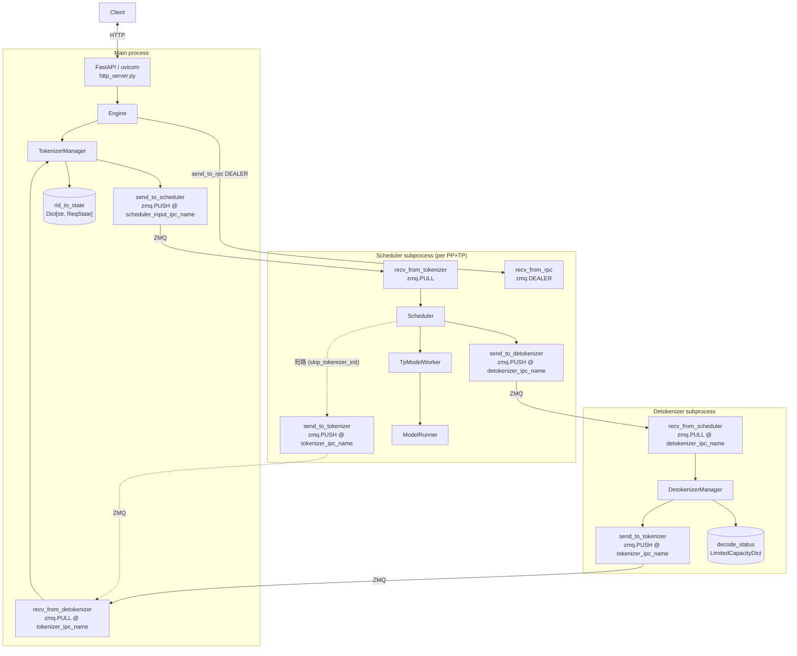
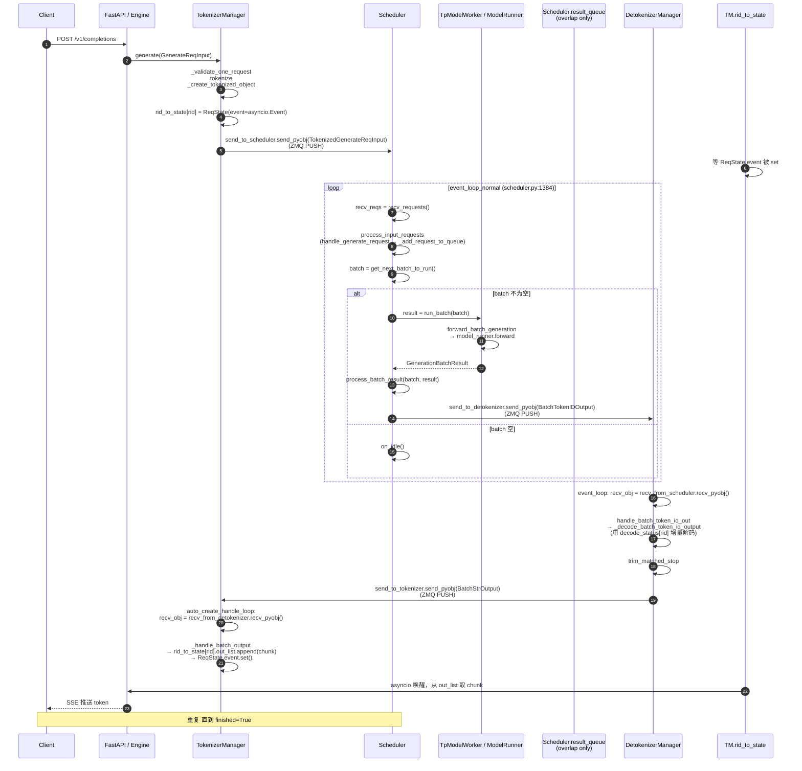

# Request Lifecycle (SGLang srt)

## Summary
synthesis: SGLang 一个请求的端到端经过 **3 个独立进程** + **4 条 ZMQ socket**：HTTP server → TokenizerManager (主进程) → Scheduler (子进程) → DetokenizerManager (子进程) → 回 TokenizerManager。整条链都是单向 PUSH/PULL，没有 RPC 反向应答；状态对齐靠每条响应消息携带的 `rid` 在 `TokenizerManager.rid_to_state` 表里查找。

## Sources
- 进程拓扑：[entrypoints/engine.py:143-238](d:\design\sglang\python\sglang\srt\entrypoints\engine.py)（`Engine.__init__` 注释 + 实现）
- 4 socket 端点：[tokenizer_manager.py:344-362](d:\design\sglang\python\sglang\srt\managers\tokenizer_manager.py), [scheduler.py:498-543](d:\design\sglang\python\sglang\srt\managers\scheduler.py), [detokenizer_manager.py:93-100](d:\design\sglang\python\sglang\srt\managers\detokenizer_manager.py)
- normal 循环：[scheduler.py:1384-1410](d:\design\sglang\python\sglang\srt\managers\scheduler.py)
- overlap 循环：[scheduler.py:1412-1465](d:\design\sglang\python\sglang\srt\managers\scheduler.py)
- detokenize 循环：[detokenizer_manager.py:137-145](d:\design\sglang\python\sglang\srt\managers\detokenizer_manager.py)
- forward：[tp_worker.py:443-534](d:\design\sglang\python\sglang\srt\managers\tp_worker.py)

## 进程与 socket 拓扑



## 端到端时序（normal 模式 + 流式）



## 关键链路要点

### 1. TokenizerManager 是异步主体
- 跑在主进程，与 HTTP server 共享 asyncio loop（[engine.py:234-238](d:\design\sglang\python\sglang\srt\entrypoints\engine.py)）
- `recv_from_detokenizer` 用 `zmq.asyncio.Context`（[tokenizer_manager.py:345](d:\design\sglang\python\sglang\srt\managers\tokenizer_manager.py)），所以 `recv_pyobj` 可以 await
- `auto_create_handle_loop` 启 asyncio task 循环 ([tokenizer_manager.py:1586-1619](d:\design\sglang\python\sglang\srt\managers\tokenizer_manager.py))，把每条响应放入对应 `rid_to_state[rid].out_list` 并 `event.set()`
- HTTP 协程（FastAPI 端点）`await` 该 event 后从 `out_list` 取 chunk → SSE 推回 client

### 2. Scheduler 是同步阻塞主体
- `event_loop_normal` 是个 `while True` 同步循环（[scheduler.py:1386](d:\design\sglang\python\sglang\srt\managers\scheduler.py)），不是 asyncio
- `recv_requests()` 用 socket polling（poll 后 `recv_pyobj`）
- `run_batch` 是阻塞调用（同步触发 GPU forward）
- `event_loop_overlap` 引入 `result_queue`，让上一 batch 的 `process_batch_result` 与本 batch 的 `run_batch` overlap（[scheduler.py:1412-1465](d:\design\sglang\python\sglang\srt\managers\scheduler.py)）

### 3. 三类失败处理
- **请求级失败**：scheduler 把 error 包在 `BatchTokenIDOutput` 里发回，detokenizer 透传，tokenizer 标 finished + finish_reason
- **scheduler 进程死亡**：`SubprocessWatchdog` 监控 `proc.is_alive()`，崩溃后 `Engine` 触发 fast-fail（[engine.py:1190-1199 _scheduler_died_error](d:\design\sglang\python\sglang\srt\entrypoints\engine.py)）
- **detokenizer 进程死亡**：同样由 watchdog 兜底（[engine.py:_launch_subprocesses](d:\design\sglang\python\sglang\srt\entrypoints\engine.py)）

### 4. 序列化全用 pickle
- `recv_pyobj` / `send_pyobj` 都是 ZMQ + Python pickle（[detokenizer_manager.py:141-144](d:\design\sglang\python\sglang\srt\managers\detokenizer_manager.py)）
- 与 vllm 的 msgspec/cloudpickle/共享内存 MQ 不同——更简单，但单消息序列化开销更大
- > [!warning] CONTRADICTION: SGLang 这套吞吐 ceiling 受 pickle 性能影响。多模态 tensor 走 pickle 时尤其重，需要看 [TensorTransportMode](d:\design\sglang\python\sglang\srt\managers\tokenizer_manager.py)（[tokenizer_manager.py:2685-2693 _determine_tensor_transport_mode](d:\design\sglang\python\sglang\srt\managers\tokenizer_manager.py)）是否启共享内存路径。

### 5. PD 分离时的"额外消息流"

`recv_requests()` 在 [scheduler.py:1504-1640](d:\design\sglang\python\sglang\srt\managers\scheduler.py) 不仅从 ZMQ socket 取，还要：

- 在 PD 模式下从 disaggregation 路径接受 KV transfer 完成事件（`SchedulerDisaggregationDecodeMixin` / `SchedulerDisaggregationPrefillMixin`）
- TP / PP rank > 0 的 scheduler 通过 `tp_worker` 的内部 broadcast 同步收到的请求

> [!todo] VERIFY: `_split_work_and_control_reqs` ([scheduler.py:1641-1669](d:\design\sglang\python\sglang\srt\managers\scheduler.py)) 如何把"工作请求"和"控制请求"分流。

## DP > 1 时的额外层

[engine.py:588-602](d:\design\sglang\python\sglang\srt\entrypoints\engine.py)：当 `dp_size > 1` 时，先 fork 出 `DataParallelController`（[managers/data_parallel_controller.py](d:\design\sglang\python\sglang\srt\managers\data_parallel_controller.py)），由它再 fork 各 DP 内部的 scheduler 子进程。请求流变成：

```
TokenizerManager → DataParallelController → DP-rank scheduler → TpModelWorker
```

> [!todo] VERIFY: DataParallelController 的请求路由策略（round-robin / load-aware / sticky）。

## Notes / Caveats

> [!todo] VERIFY: pin 从 `34fef07a` → `06f32bab`（2026-08-10 increment）后本页未深 verify；文件数量/行号可能漂移。优先对照 [entities/Scheduler.md](../entities/Scheduler.md) / 新模块页。
> [!todo] VERIFY: `_should_dispatch_to_encoder` ([tokenizer_manager.py:2502-2537](d:\design\sglang\python\sglang\srt\managers\tokenizer_manager.py)) — EPD（encode-prefill-decode）分离场景下的额外路由。
> [!todo] VERIFY: `_should_use_batch_tokenization` ([tokenizer_manager.py:1137-1152](d:\design\sglang\python\sglang\srt\managers\tokenizer_manager.py)) 触发条件，与吞吐影响。
> [!todo] VERIFY: `auto_create_handle_loop` 与 FastAPI 协程的具体协作 (asyncio task 数量、并发上限)。

## See also
- [entities/TokenizerManager.md](../entities/TokenizerManager.md)
- [entities/Scheduler.md](../entities/Scheduler.md)
- [topics/manager-pipeline.md](manager-pipeline.md)
- `comparison/topics/engine-architecture.md`（待建）
