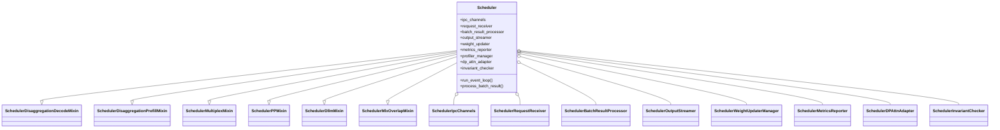

# Scheduler Mixin + Composition 架构

> ~~[!warning] CONTRADICTION: 本页按 **11 mixin**（锚点 `scheduler.py:317-329`）撰写，但 HEAD `06f32bab` 上 `Scheduler` MRO 已变为 **6 mixin + `SchedulerMlxOverlapMixin`**；`SchedulerOutputProcessorMixin` / `SchedulerUpdateWeightsMixin` / `SchedulerProfilerMixin` / `SchedulerMetricsMixin` / `SchedulerRuntimeCheckerMixin` / `SchedulerDPAttnMixin` 源文件已删除，逻辑迁入 `managers/scheduler_components/`。~~
> **RESOLVED 2026-08-10**: 本页已按 HEAD `06f32bab` **re-ingest**。权威 MRO 为 [scheduler.py:375-382](d:\design\sglang\python\sglang\srt\managers\scheduler.py)（6 mixin，含条件性 `SchedulerMlxOverlapMixin`）；横切职责走 [scheduler_components/](d:\design\sglang\python\sglang\srt\managers\scheduler_components) 组合对象。总览见 [entities/Scheduler.md](../entities/Scheduler.md)。

## Summary

synthesis: HEAD `06f32bab` 上 SGLang `Scheduler` 采用 **少量 mixin（事件循环 / PD / PP / DLLM / MLX）+ 大量 composition（`scheduler_components/`）**。[scheduler.py:375-382](d:\design\sglang\python\sglang\srt\managers\scheduler.py) 的 MRO 只剩 6 个基类；原先 OutputProcessor / UpdateWeights / Profiler / Metrics / RuntimeChecker / DPAttn 等已从多重继承拆成可测试的组合对象（[scheduler.py:634-648](d:\design\sglang\python\sglang\srt\managers\scheduler.py)、[L2008-2147](d:\design\sglang\python\sglang\srt\managers\scheduler.py)）。

## Sources

### 残留 mixin（MRO）

| # | Mixin | 文件 | 类定义行 |
|---|---|---|---|
| 1 | `SchedulerDisaggregationDecodeMixin` | [disaggregation/decode.py:2112](d:\design\sglang\python\sglang\srt\disaggregation\decode.py) | L2112 |
| 2 | `SchedulerDisaggregationPrefillMixin` | [disaggregation/prefill.py:485](d:\design\sglang\python\sglang\srt\disaggregation\prefill.py) | L485 |
| 3 | `SchedulerMultiplexMixin` | [multiplex/multiplexing_mixin.py:33](d:\design\sglang\python\sglang\srt\multiplex\multiplexing_mixin.py) | L33 |
| 4 | `SchedulerPPMixin` | [scheduler_pp_mixin.py:67](d:\design\sglang\python\sglang\srt\managers\scheduler_pp_mixin.py) | L67 |
| 5 | `SchedulerDllmMixin` | [dllm/mixin/scheduler.py:22](d:\design\sglang\python\sglang\srt\dllm\mixin\scheduler.py) | L22 |
| 6 | `SchedulerMlxOverlapMixin` | [hardware_backend/mlx/scheduler_mixin.py:73](d:\design\sglang\python\sglang\srt\hardware_backend\mlx\scheduler_mixin.py)（非 MPS 时 [scheduler.py:330-331](d:\design\sglang\python\sglang\srt\managers\scheduler.py) stub） | L73 / stub |

声明顺序权威：[scheduler.py:375-382](d:\design\sglang\python\sglang\srt\managers\scheduler.py)。

### Composition 目录

- [d:\design\sglang\python\sglang\srt\managers\scheduler_components\](d:\design\sglang\python\sglang\srt\managers\scheduler_components)（19 模块 + `__init__.py`）
- 组件装配入口：[scheduler.py:634-648](d:\design\sglang\python\sglang\srt\managers\scheduler.py)、各 `init_*` 于 [L2008-2147](d:\design\sglang\python\sglang\srt\managers\scheduler.py)

## Architecture / Data flow



精确 MRO：

```python
class Scheduler(
    SchedulerDisaggregationDecodeMixin,
    SchedulerDisaggregationPrefillMixin,
    SchedulerMultiplexMixin,
    SchedulerPPMixin,
    SchedulerDllmMixin,
    SchedulerMlxOverlapMixin,
):
```

`SchedulerMlxOverlapMixin`：`is_mps()` 时从 [hardware_backend/mlx/scheduler_mixin.py](d:\design\sglang\python\sglang\srt\hardware_backend\mlx\scheduler_mixin.py) 导入；否则在 [scheduler.py:330-331](d:\design\sglang\python\sglang\srt\managers\scheduler.py) 定义为空 stub（[scheduler.py:324-331](d:\design\sglang\python\sglang\srt\managers\scheduler.py)）。

### 为什么残留 mixin、横切职责改 composition

synthesis: 取舍可从代码布局直接读出：

| 方案 | HEAD 用法 | 适用场景 |
|---|---|---|
| **Mixin 多继承** | 6 个残留基类 | 需要**替换 / 提供整套 `event_loop_*`** 或大量与主循环交织的方法（PD / PP / PDMux / DLLM / MLX overlap） |
| **Composition** | `scheduler_components/` 对象挂在 `self.*` | 正交横切职责（IPC、结果处理、metrics、weights、profiler、DP-attn sync、pool 不变量）——可单测、可替换实现，不必进 MRO |

证据：`process_batch_result` 已不再调 mixin 方法做普通 prefill/decode，而是委托 `self.batch_result_processor` / `self.metrics_reporter`，仅 DLLM / PD-prefill 仍走 mixin（[scheduler.py:3887-3918](d:\design\sglang\python\sglang\srt\managers\scheduler.py)）。

## 6 Mixin 拆解表

| # | Mixin | 主要职责 | 关键方法（mixin 文件内） | 触发条件 |
|---|---|---|---|---|
| 1 | `SchedulerDisaggregationDecodeMixin` | PD-decode：等 KV、prebuilt decode | `event_loop_normal_disagg_decode`（[L2114](d:\design\sglang\python\sglang\srt\disaggregation\decode.py)）；`event_loop_overlap_disagg_decode`（[L2148](d:\design\sglang\python\sglang\srt\disaggregation\decode.py)）；`get_next_disagg_decode_batch_to_run`（[L2216](d:\design\sglang\python\sglang\srt\disaggregation\decode.py)）；`process_decode_queue`（[L2317](d:\design\sglang\python\sglang\srt\disaggregation\decode.py)） | `dispatch_event_loop` 在 `DisaggregationMode.DECODE`（[scheduler.py:4883-4889](d:\design\sglang\python\sglang\srt\managers\scheduler.py)） |
| 2 | `SchedulerDisaggregationPrefillMixin` | PD-prefill：跑 prefill + 发 KV | `event_loop_normal_disagg_prefill`（[L569](d:\design\sglang\python\sglang\srt\disaggregation\prefill.py)）；`event_loop_overlap_disagg_prefill`（[L607](d:\design\sglang\python\sglang\srt\disaggregation\prefill.py)）；`process_batch_result_disagg_prefill`（[L658](d:\design\sglang\python\sglang\srt\disaggregation\prefill.py)）；`send_kv_chunk`（[L1128](d:\design\sglang\python\sglang\srt\disaggregation\prefill.py)） | `dispatch_event_loop` 在 `PREFILL`（[scheduler.py:4876-4882](d:\design\sglang\python\sglang\srt\managers\scheduler.py)）；结果分派见 [L3899-3900](d:\design\sglang\python\sglang\srt\managers\scheduler.py) |
| 3 | `SchedulerMultiplexMixin` | PD-Multiplexing：SM partition + 多 stream | `init_pdmux`（[L35](d:\design\sglang\python\sglang\srt\multiplex\multiplexing_mixin.py)）；`adjust_stream_groups`（[L50](d:\design\sglang\python\sglang\srt\multiplex\multiplexing_mixin.py)）；`event_loop_pdmux`（[L101](d:\design\sglang\python\sglang\srt\multiplex\multiplexing_mixin.py)） | `enable_pdmux` → `event_loop_pdmux`（[scheduler.py:4866-4867](d:\design\sglang\python\sglang\srt\managers\scheduler.py)） |
| 4 | `SchedulerPPMixin` | Pipeline Parallel 三套循环 | `event_loop_pp`（[L69](d:\design\sglang\python\sglang\srt\managers\scheduler_pp_mixin.py)）；`event_loop_pp_disagg_prefill`（[L178](d:\design\sglang\python\sglang\srt\managers\scheduler_pp_mixin.py)）；`event_loop_pp_disagg_decode`（[L362](d:\design\sglang\python\sglang\srt\managers\scheduler_pp_mixin.py)）；`init_pp_loop_state`（[L559](d:\design\sglang\python\sglang\srt\managers\scheduler_pp_mixin.py)） | `pp_size > 1` 分支（[scheduler.py:4868-4869](d:\design\sglang\python\sglang\srt\managers\scheduler.py)、[L4877-4878](d:\design\sglang\python\sglang\srt\managers\scheduler.py)、[L4884-4885](d:\design\sglang\python\sglang\srt\managers\scheduler.py)） |
| 5 | `SchedulerDllmMixin` | Diffusion LLM 调度 | `init_diffusion_llm`（[L23](d:\design\sglang\python\sglang\srt\dllm\mixin\scheduler.py)）；`get_new_batch_dllm`（[L31](d:\design\sglang\python\sglang\srt\dllm\mixin\scheduler.py)）；`process_batch_result_dllm`（[L69](d:\design\sglang\python\sglang\srt\dllm\mixin\scheduler.py)） | `batch.is_dllm()` 时分派（[scheduler.py:3897-3898](d:\design\sglang\python\sglang\srt\managers\scheduler.py)） |
| 6 | `SchedulerMlxOverlapMixin` | MLX overlap 主循环 | `event_loop_overlap_mlx`（[L116](d:\design\sglang\python\sglang\srt\hardware_backend\mlx\scheduler_mixin.py)）；`_prepare_mlx_launch`（[L92](d:\design\sglang\python\sglang\srt\hardware_backend\mlx\scheduler_mixin.py)） | `enable_overlap_mlx`（[scheduler.py:4870-4871](d:\design\sglang\python\sglang\srt\managers\scheduler.py)）；非 MPS 为空 stub |

## 前 mixin → 现 composition 映射

| 旧 mixin（源文件已删） | 现组件 / 归属 | 初始化锚点 |
|---|---|---|
| `SchedulerOutputProcessorMixin` | `SchedulerBatchResultProcessor` + `SchedulerOutputStreamer` + `SchedulerLogprobResultProcessor` | [scheduler.py:2112-2147](d:\design\sglang\python\sglang\srt\managers\scheduler.py) |
| `SchedulerUpdateWeightsMixin` | `SchedulerWeightUpdaterManager` | [scheduler.py:1913-1923](d:\design\sglang\python\sglang\srt\managers\scheduler.py)（见 [entities/Scheduler.md](../entities/Scheduler.md)） |
| `SchedulerProfilerMixin` | `SchedulerProfilerManager` | [scheduler.py:1906-1911](d:\design\sglang\python\sglang\srt\managers\scheduler.py) |
| `SchedulerMetricsMixin` | `SchedulerMetricsReporter` + `SchedulerKvEventsPublisher` + `SchedulerLoadInquirer`；（Prometheus collector 仍在 `observability/metrics_collector.py` 的 `SchedulerMetricsCollector`） | [scheduler.py:2066-2110](d:\design\sglang\python\sglang\srt\managers\scheduler.py) |
| `SchedulerRuntimeCheckerMixin` | `SchedulerInvariantChecker` + `SchedulerPoolStatsObserver` + `create_scheduler_watchdog` | [scheduler.py:2031-2064](d:\design\sglang\python\sglang\srt\managers\scheduler.py) |
| `SchedulerDPAttnMixin` | `SchedulerDPAttnAdapter` | [scheduler.py:2008-2029](d:\design\sglang\python\sglang\srt\managers\scheduler.py) |
| （同文件辅助）`IdleSleeper` | [idle_sleeper.py:15](d:\design\sglang\python\sglang\srt\managers\scheduler_components\idle_sleeper.py) | [scheduler.py:770-784](d:\design\sglang\python\sglang\srt\managers\scheduler.py) |
| （同文件辅助）`SenderWrapper` | [output_sender.py:8](d:\design\sglang\python\sglang\srt\managers\scheduler_components\output_sender.py)；经 `SchedulerIpcChannels` | [ipc_channels.py:67-68](d:\design\sglang\python\sglang\srt\managers\scheduler_components\ipc_channels.py) |

## `scheduler_components/` 组件表

| 文件 | 关键类 | 角色 |
|---|---|---|
| [ipc_channels.py](d:\design\sglang\python\sglang\srt\managers\scheduler_components\ipc_channels.py) | `SchedulerIpcChannels`（[L17](d:\design\sglang\python\sglang\srt\managers\scheduler_components\ipc_channels.py)） | ZMQ PULL/DEALER/PUSH + `SenderWrapper` |
| [output_sender.py](d:\design\sglang\python\sglang\srt\managers\scheduler_components\output_sender.py) | `SenderWrapper`（[L8](d:\design\sglang\python\sglang\srt\managers\scheduler_components\output_sender.py)） | `send_output`；`socket is None` 时 no-op |
| [idle_sleeper.py](d:\design\sglang\python\sglang\srt\managers\scheduler_components\idle_sleeper.py) | `IdleSleeper`（[L15](d:\design\sglang\python\sglang\srt\managers\scheduler_components\idle_sleeper.py)）、`RustServerIdleSleeper`（[L45](d:\design\sglang\python\sglang\srt\managers\scheduler_components\idle_sleeper.py)） | idle poll/sleep |
| [request_receiver.py](d:\design\sglang\python\sglang\srt\managers\scheduler_components\request_receiver.py) | `SchedulerRequestReceiver`（[L49](d:\design\sglang\python\sglang\srt\managers\scheduler_components\request_receiver.py)） | `recv_requests` + TP/CP broadcast |
| [batch_result_processor.py](d:\design\sglang\python\sglang\srt\managers\scheduler_components\batch_result_processor.py) | `SchedulerBatchResultProcessor`（[L77](d:\design\sglang\python\sglang\srt\managers\scheduler_components\batch_result_processor.py)） | prefill/decode/idle/prebuilt 结果处理 |
| [output_streamer.py](d:\design\sglang\python\sglang\srt\managers\scheduler_components\output_streamer.py) | `SchedulerOutputStreamer`（[L45](d:\design\sglang\python\sglang\srt\managers\scheduler_components\output_streamer.py)） | 向 detokenizer / Rust egress 推流 |
| [logprob_result_processor.py](d:\design\sglang\python\sglang\srt\managers\scheduler_components\logprob_result_processor.py) | `SchedulerLogprobResultProcessor`（[L23](d:\design\sglang\python\sglang\srt\managers\scheduler_components\logprob_result_processor.py)） | logprob 后处理 |
| [weight_updater.py](d:\design\sglang\python\sglang\srt\managers\scheduler_components\weight_updater.py) | `SchedulerWeightUpdaterManager`（[L76](d:\design\sglang\python\sglang\srt\managers\scheduler_components\weight_updater.py)） | 在线权重 / IPC / memory occupation |
| [profiler_manager.py](d:\design\sglang\python\sglang\srt\managers\scheduler_components\profiler_manager.py) | `SchedulerProfilerManager`（[L51](d:\design\sglang\python\sglang\srt\managers\scheduler_components\profiler_manager.py)） | torch/CUDA profiler RPC |
| [metrics_reporter.py](d:\design\sglang\python\sglang\srt\managers\scheduler_components\metrics_reporter.py) | `SchedulerMetricsReporter`（[L92](d:\design\sglang\python\sglang\srt\managers\scheduler_components\metrics_reporter.py)） | 步级 metrics + FPM |
| [dp_attn.py](d:\design\sglang\python\sglang\srt\managers\scheduler_components\dp_attn.py) | `SchedulerDPAttnAdapter`（[L387](d:\design\sglang\python\sglang\srt\managers\scheduler_components\dp_attn.py)） | DP-attn MLP sync batch |
| [invariant_checker.py](d:\design\sglang\python\sglang\srt\managers\scheduler_components\invariant_checker.py) | `SchedulerInvariantChecker`（[L44](d:\design\sglang\python\sglang\srt\managers\scheduler_components\invariant_checker.py)）、`create_scheduler_watchdog`（[L462](d:\design\sglang\python\sglang\srt\managers\scheduler_components\invariant_checker.py)） | pool/tree 不变量 + watchdog 工厂 |
| [pool_stats_observer.py](d:\design\sglang\python\sglang\srt\managers\scheduler_components\pool_stats_observer.py) | `SchedulerPoolStatsObserver`（[L142](d:\design\sglang\python\sglang\srt\managers\scheduler_components\pool_stats_observer.py)） | KV/req pool 用量观察 |
| [load_inquirer.py](d:\design\sglang\python\sglang\srt\managers\scheduler_components\load_inquirer.py) | `SchedulerLoadInquirer`（[L34](d:\design\sglang\python\sglang\srt\managers\scheduler_components\load_inquirer.py)） | `/v1/loads` 等负载查询 |
| [kv_events_publisher.py](d:\design\sglang\python\sglang\srt\managers\scheduler_components\kv_events_publisher.py) | `SchedulerKvEventsPublisher`（[L45](d:\design\sglang\python\sglang\srt\managers\scheduler_components\kv_events_publisher.py)） | KV events 外发 |
| [flush_wrapper.py](d:\design\sglang\python\sglang\srt\managers\scheduler_components\flush_wrapper.py) | `SchedulerFlushWrapper`（[L11](d:\design\sglang\python\sglang\srt\managers\scheduler_components\flush_wrapper.py)） | `FlushCacheReqInput` 包装 |
| [recv_skipper.py](d:\design\sglang\python\sglang\srt\managers\scheduler_components\recv_skipper.py) | `SchedulerRecvSkipper`（[L13](d:\design\sglang\python\sglang\srt\managers\scheduler_components\recv_skipper.py)） | 慢消费跳过 recv |
| [new_token_ratio_tracker.py](d:\design\sglang\python\sglang\srt\managers\scheduler_components\new_token_ratio_tracker.py) | `NewTokenRatioTracker`（[L14](d:\design\sglang\python\sglang\srt\managers\scheduler_components\new_token_ratio_tracker.py)） | 新 token 比例估计 |
| [memory_usage.py](d:\design\sglang\python\sglang\srt\managers\scheduler_components\memory_usage.py) | `build_memory_usage` 等 | 内存用量汇总 helper |

`__init__` 末尾装配顺序：[init_request_receiver → init_dp_attn_adapter → init_pool_stats_observer → init_invariant_checker → init_kv_events_publisher → init_load_inquirer → init_output_streamer → init_batch_result_processor](d:\design\sglang\python\sglang\srt\managers\scheduler.py)（[L634-648](d:\design\sglang\python\sglang\srt\managers\scheduler.py)）。

## 跨 mixin / 组件协作链

### Chain 1：`dispatch_event_loop` → 残留 mixin 的 `event_loop_*`

[scheduler.py:4861-4889](d:\design\sglang\python\sglang\srt\managers\scheduler.py) 按 `disaggregation_mode × enable_pdmux × pp_size × enable_overlap(_mlx)` 分派到各 mixin（或基类 `event_loop_normal` / `event_loop_overlap`）。

### Chain 2：基类 `process_batch_result` → composition + 残留 mixin

[scheduler.py:3887-3918](d:\design\sglang\python\sglang\srt\managers\scheduler.py)：

- decode / 普通 extend / prebuilt / idle → `batch_result_processor.*`
- extend + `batch.is_dllm()` → `process_batch_result_dllm`（`SchedulerDllmMixin`）
- extend + `PREFILL` → `process_batch_result_disagg_prefill`（`SchedulerDisaggregationPrefillMixin`）
- 收尾无条件 → `metrics_reporter.log_batch_result_stats` / FPM / `update_device_timer`

### Chain 3：`get_next_batch_to_run` → `dp_attn_adapter`

DP-attn 同步不再是 mixin 方法，而是 `self.dp_attn_adapter.maybe_prepare_mlp_sync_batch`（见 [entities/Scheduler.md](../entities/Scheduler.md) §关键 step 函数；adapter 定义 [dp_attn.py:387](d:\design\sglang\python\sglang\srt\managers\scheduler_components\dp_attn.py)）。

### Chain 4：PP / PDMux 仍复刻 step，但结果路径走 composition

`event_loop_pp` / `event_loop_pdmux` 仍由 mixin 提供完整循环；其内部调用的 `process_batch_result` / metrics 路径已落到组件上——synthesis: **循环结构留在 mixin，横切处理进 composition**。

## Notes / Caveats

> synthesis: 旧「11 mixin / Internal 6 + External 5」叙事在 HEAD 上失效；对比页 [comparison/topics/scheduler-architecture.md](../../comparison/topics/scheduler-architecture.md) 等仍可能写 11 mixin，需单独 verify（本页不改 comparison）。

> [!todo] VERIFY: `dispatch_event_loop` 未出现 `pp_size > 1` × `enable_pdmux` 组合（[scheduler.py:4865-4875](d:\design\sglang\python\sglang\srt\managers\scheduler.py) 先判 pdmux 再判 pp）——疑似互斥；与 [topics/pd-disaggregation.md](pd-disaggregation.md) 的 PD-Disagg vs PD-Mux 互斥正交。

> [!todo] VERIFY: `event_loop_overlap_disagg_decode`（[decode.py:2148](d:\design\sglang\python\sglang\srt\disaggregation\decode.py)）与基类 `event_loop_overlap`（[scheduler.py:1727](d:\design\sglang\python\sglang\srt\managers\scheduler.py)）的 `result_queue` 是否各自局部 `deque`——粗读为各循环自建。

## See also

- [entities/Scheduler.md](../entities/Scheduler.md) — Scheduler 类总览（init 编排 + components + 主循环）
- [modules/managers.md](../modules/managers.md) — `srt/managers/` 模块概览（含 6 mixin 摘要）
- [modules/disaggregation.md](../modules/disaggregation.md) — PD 分离
- [modules/multiplex.md](../modules/multiplex.md) — PDMux
- [modules/dllm.md](../modules/dllm.md) — Diffusion LLM
- [modules/observability.md](../modules/observability.md) — Metrics / KV events（collector 仍在 observability）
- [topics/manager-pipeline.md](manager-pipeline.md) — 三进程 ZMQ pipeline
- [topics/request-lifecycle.md](request-lifecycle.md) — 请求生命周期
- [topics/pd-disaggregation.md](pd-disaggregation.md) — PD 多后端 + 2 Scheduler mixin
- [comparison/topics/scheduler-architecture.md](../../comparison/topics/scheduler-architecture.md) — 三方对照（可能仍含旧 11-mixin 表述）
