# Scheduler Mixin 架构

## Summary
synthesis: SGLang 的 `Scheduler` 用 **11-mixin 多继承拼装** 而成（[scheduler.py:317-329](d:\design\sglang\python\sglang\srt\managers\scheduler.py)），每个 mixin 独立承担一类正交职责（输出处理、权重更新、profile、metrics、PD prefill/decode、PDMux、watchdog、PP、DP-attn 同步、DLLM）。其中 **6 个内置** 在 `srt/managers/`（与 Scheduler 紧耦合的辅助逻辑），**5 个外置** 到各自子系统目录（`disaggregation/` / `multiplex/` / `dllm/` / `observability/`，跟随子系统演进）。这种切分既避免单文件超长，又让"Scheduler 的某种行为属于哪个子系统"在 import 路径上一目了然。

## Sources
| # | Mixin | 文件 | 类定义行 |
|---|---|---|---|
| 1 | `SchedulerOutputProcessorMixin` | [scheduler_output_processor_mixin.py:38](d:\design\sglang\python\sglang\srt\managers\scheduler_output_processor_mixin.py) | L38 |
| 2 | `SchedulerUpdateWeightsMixin` | [scheduler_update_weights_mixin.py:44](d:\design\sglang\python\sglang\srt\managers\scheduler_update_weights_mixin.py) | L44 |
| 3 | `SchedulerProfilerMixin` | [scheduler_profiler_mixin.py:37](d:\design\sglang\python\sglang\srt\managers\scheduler_profiler_mixin.py) | L37 |
| 4 | `SchedulerMetricsMixin` | [observability/scheduler_metrics_mixin.py:91](d:\design\sglang\python\sglang\srt\observability\scheduler_metrics_mixin.py) | L91 |
| 5 | `SchedulerDisaggregationDecodeMixin` | [disaggregation/decode.py:1171](d:\design\sglang\python\sglang\srt\disaggregation\decode.py) | L1171 |
| 6 | `SchedulerDisaggregationPrefillMixin` | [disaggregation/prefill.py:355](d:\design\sglang\python\sglang\srt\disaggregation\prefill.py) | L355 |
| 7 | `SchedulerMultiplexMixin` | [multiplex/multiplexing_mixin.py:32](d:\design\sglang\python\sglang\srt\multiplex\multiplexing_mixin.py) | L32 |
| 8 | `SchedulerRuntimeCheckerMixin` | [scheduler_runtime_checker_mixin.py:136](d:\design\sglang\python\sglang\srt\managers\scheduler_runtime_checker_mixin.py) | L136 |
| 9 | `SchedulerPPMixin` | [scheduler_pp_mixin.py:45](d:\design\sglang\python\sglang\srt\managers\scheduler_pp_mixin.py) | L45 |
| 10 | `SchedulerDPAttnMixin` | [scheduler_dp_attn_mixin.py:228](d:\design\sglang\python\sglang\srt\managers\scheduler_dp_attn_mixin.py) | L228 |
| 11 | `SchedulerDllmMixin` | [dllm/mixin/scheduler.py:20](d:\design\sglang\python\sglang\srt\dllm\mixin\scheduler.py) | L20 |

声明顺序权威：[scheduler.py:317-329](d:\design\sglang\python\sglang\srt\managers\scheduler.py)（同时也是 Python MRO 顺序，`SchedulerOutputProcessorMixin` 最先继承，`SchedulerDllmMixin` 最后）。

## Architecture

```mermaid
classDiagram
    class Scheduler {
        +__init__()
        +run_event_loop()
        +recv_requests()
        +process_input_requests()
        +get_next_batch_to_run()
        +run_batch()
        +process_batch_result()
    }
    class SchedulerOutputProcessorMixin {
        +process_batch_result_prefill()
        +process_batch_result_decode()
        +process_batch_result_idle()
        +process_batch_result_prebuilt()
        +stream_output()
    }
    class SchedulerUpdateWeightsMixin {
        +update_weights_from_disk/distributed/tensor/ipc()
        +release/resume_memory_occupation()
    }
    class SchedulerProfilerMixin {
        +init_profiler()
        +start_profile() / stop_profile()
        +profile()
    }
    class SchedulerMetricsMixin {
        +init_metrics() / init_kv_events()
        +report_prefill_stats() / report_decode_stats()
        +record_forward_metrics()
        +get_load() / get_loads()
    }
    class SchedulerDisaggregationDecodeMixin {
        +event_loop_normal_disagg_decode()
        +event_loop_overlap_disagg_decode()
        +get_next_disagg_decode_batch_to_run()
        +process_decode_queue()
    }
    class SchedulerDisaggregationPrefillMixin {
        +event_loop_normal_disagg_prefill()
        +event_loop_overlap_disagg_prefill()
        +process_batch_result_disagg_prefill()
        +send_kv_chunk()
    }
    class SchedulerMultiplexMixin {
        +init_pdmux()
        +event_loop_pdmux()
        +adjust_stream_groups()
    }
    class SchedulerRuntimeCheckerMixin {
        +self_check_during_busy()
        +on_idle()
        +get_pool_stats()
    }
    class SchedulerPPMixin {
        +event_loop_pp()
        +event_loop_pp_disagg_prefill()
        +event_loop_pp_disagg_decode()
        +init_pp_loop_state()
    }
    class SchedulerDPAttnMixin {
        +prepare_mlp_sync_batch()
        +maybe_prepare_mlp_sync_batch()
        +get_idle_batch()
    }
    class SchedulerDllmMixin {
        +init_diffusion_llm()
        +get_new_batch_dllm()
        +process_batch_result_dllm()
    }
    Scheduler --|> SchedulerOutputProcessorMixin
    Scheduler --|> SchedulerUpdateWeightsMixin
    Scheduler --|> SchedulerProfilerMixin
    Scheduler --|> SchedulerMetricsMixin
    Scheduler --|> SchedulerDisaggregationDecodeMixin
    Scheduler --|> SchedulerDisaggregationPrefillMixin
    Scheduler --|> SchedulerMultiplexMixin
    Scheduler --|> SchedulerRuntimeCheckerMixin
    Scheduler --|> SchedulerPPMixin
    Scheduler --|> SchedulerDPAttnMixin
    Scheduler --|> SchedulerDllmMixin
```



### 为什么用 mixin 而不是单类 / 策略模式

synthesis: 三种候选拆法的取舍：

| 方案 | 优点 | 缺点 / 为什么不选 |
|---|---|---|
| 单 class（vLLM `EngineCore` 风格） | 简单、IDE 跳转友好 | scheduler.py 已经 ~3700 行，再合 11 块就 > 8000 行；不同子系统的演进会冲突 |
| Strategy / 组合（`self.metrics_strategy.report(...)`） | 真正解耦 | 大量方法都需要直接读 `self.running_batch` / `self.tree_cache` / `self.tp_worker` 等核心状态——封装到 strategy 后接口会爆炸（每个方法都要传 `Scheduler` 自身），等价于 mixin |
| **Mixin 多继承（实际方案）** | 每个文件 < 1500 行；`self: Scheduler` 注解 + `TYPE_CHECKING` 让 IDE 仍可跳转；子系统目录（`disaggregation/` / `dllm/`）可以"自带 scheduler 钩子"，无需改 `srt/managers/` | 调用图分散，要靠 grep `class Scheduler.*Mixin` 才能枚举全部入口；MRO 顺序敏感（虽然 11 个 mixin 间方法名无冲突，见 §Notes） |

实际证据：每个 mixin 的方法签名都是 `def foo(self: Scheduler, ...)`（用 `TYPE_CHECKING` 条件 import 避免循环依赖），例：[scheduler_output_processor_mixin.py:38-54](d:\design\sglang\python\sglang\srt\managers\scheduler_output_processor_mixin.py)、[multiplex/multiplexing_mixin.py:25-34](d:\design\sglang\python\sglang\srt\multiplex\multiplexing_mixin.py)、[dllm/mixin/scheduler.py:16-21](d:\design\sglang\python\sglang\srt\dllm\mixin\scheduler.py)。这是典型的"伪类型注解 mixin" 模式——运行时是 mixin 多继承，静态分析看作 Scheduler 方法。

## 11 Mixin 拆解表

> 文件位置见上方 §Sources 表（不重复 URL）。**触发条件** = 在 Scheduler 主流程（`__init__` / `run_event_loop` / `process_batch_result` 等）什么场景下被调用，下面 anchor 全指向 [scheduler.py](d:\design\sglang\python\sglang\srt\managers\scheduler.py) 简写为 `sched.py`。

| # | Mixin | 主要职责（≤30 字） | 关键方法（行号 = mixin 文件内） | 触发条件 |
|---|---|---|---|---|
| 1 | `SchedulerOutputProcessorMixin` | 把 forward 结果转成发给 detokenizer 的输出，含 logprob/MM/finish 处理 | `process_batch_result_{prefill,decode,idle,prebuilt}`（L125/L386/L374/L85）；`stream_output`（L910）；`add_logprob_return_values`（L847） | 由基类 `Scheduler.process_batch_result` 按 `forward_mode` 分派（[sched.py:2913-2930](d:\design\sglang\python\sglang\srt\managers\scheduler.py)） |
| 2 | `SchedulerUpdateWeightsMixin` | 在线权重更新（disk/distributed/tensor/IPC）+ 内存占用 release/resume | `update_weights_from_{disk,distributed,tensor,ipc}`（L46/L73/L87/L106）；`release_memory_occupation`（L124）；`init/destroy_weights_update_group`（L59/L66） | RPC 派发：`init_weights_update_group` / `destroy_weights_update_group` 注册在 `init_request_dispatcher`（[sched.py:1291-1292](d:\design\sglang\python\sglang\srt\managers\scheduler.py)） |
| 3 | `SchedulerProfilerMixin` | torch.profiler / CUDA profiler 控制 + 多 rank trace 合并 | `init_profiler`（L38）；`start_profile`（L138）；`stop_profile`（L251）；`profile`（RPC 入口，L379） | `__init__` 调 `init_profiler`（[sched.py:449](d:\design\sglang\python\sglang\srt\managers\scheduler.py)）；`ProfileReq` RPC 走 `self.profile`（[sched.py:1312](d:\design\sglang\python\sglang\srt\managers\scheduler.py)） |
| 4 | `SchedulerMetricsMixin` | Prometheus stats、KV events、bubble timer、负载查询 | `init_metrics`（L92）；`report_prefill_stats`（L329）；`report_decode_stats`（L462）；`record_forward_metrics`（L942）；`get_load`/`get_loads`（L791/L816） | `__init__` 调 `init_metrics`（[sched.py:406](d:\design\sglang\python\sglang\srt\managers\scheduler.py)）；`run_batch` 用 `record_forward_metrics` 包 forward（[sched.py:2777,2817](d:\design\sglang\python\sglang\srt\managers\scheduler.py)）；`GetLoadReqInput` RPC 走 `get_load`（[sched.py:1324](d:\design\sglang\python\sglang\srt\managers\scheduler.py)） |
| 5 | `SchedulerDisaggregationDecodeMixin` | PD-decode 端：等 KV 到达、prebuilt batch 跑 decode | `event_loop_normal_disagg_decode`（L1174）；`event_loop_overlap_disagg_decode`（L1201）；`get_next_disagg_decode_batch_to_run`（L1249）；`process_decode_queue`（L1333） | `dispatch_event_loop` 在 `disaggregation_mode == DECODE` 时进入（[sched.py:3648-3654](d:\design\sglang\python\sglang\srt\managers\scheduler.py)） |
| 6 | `SchedulerDisaggregationPrefillMixin` | PD-prefill 端：跑 prefill + 通过 KV manager 发送 KV 块 | `event_loop_normal_disagg_prefill`（L389）；`event_loop_overlap_disagg_prefill`（L423）；`process_batch_result_disagg_prefill`（L468）；`send_kv_chunk`（L750） | `dispatch_event_loop` 在 `disaggregation_mode == PREFILL` 时进入（[sched.py:3641-3647](d:\design\sglang\python\sglang\srt\managers\scheduler.py)）；prefill 完成后 `process_batch_result` 选 `process_batch_result_disagg_prefill`（[sched.py:2923-2924](d:\design\sglang\python\sglang\srt\managers\scheduler.py)） |
| 7 | `SchedulerMultiplexMixin` | PD-Multiplexing：用 SM partition + 多 stream group 让 prefill/decode 在单 GPU 上并行 | `init_pdmux`（L34）；`adjust_stream_groups`（L49）；`update_split_prefill_batch`（L81）；`event_loop_pdmux`（L96） | `__init__` 在 `enable_pdmux` 时调 `init_pdmux`（[sched.py:413](d:\design\sglang\python\sglang\srt\managers\scheduler.py)）；`dispatch_event_loop` 在 `enable_pdmux` 时跑 `event_loop_pdmux`（[sched.py:3633-3634](d:\design\sglang\python\sglang\srt\managers\scheduler.py)） |
| 8 | `SchedulerRuntimeCheckerMixin` | KV pool 不变量自检（leak detect）、idle 时清理、watchdog | `self_check_during_busy`（L418）；`on_idle`（L545）；`get_pool_stats`（L179）；`_check_full_pool/swa/mamba`（L304/L329/L342） | `event_loop_normal` 空闲走 `on_idle`（[sched.py:1404,1454](d:\design\sglang\python\sglang\srt\managers\scheduler.py)）；`SGLANG_ENABLE_STRICT_MEM_CHECK_DURING_BUSY` env 开启时每 step 调 `self_check_during_busy`（[sched.py:1409,1464](d:\design\sglang\python\sglang\srt\managers\scheduler.py)） |
| 9 | `SchedulerPPMixin` | Pipeline Parallelism 三套循环 + 跨 stage P2P + chunk 大小预测器 | `event_loop_pp`（L47）；`event_loop_pp_disagg_prefill`（L148）；`event_loop_pp_disagg_decode`（L324）；`init_pp_loop_state`（L513）；`profile_and_init_predictor`（L539） | `dispatch_event_loop` 在 `pp_size > 1` 时按 disagg 模式选 `event_loop_pp{,_disagg_prefill,_disagg_decode}`（[sched.py:3635-3650](d:\design\sglang\python\sglang\srt\managers\scheduler.py)） |
| 10 | `SchedulerDPAttnMixin` | DP-attention 跨 DP rank 对齐 batch（all-gather token counts、补 idle batch） | `prepare_mlp_sync_batch`（L229）；`maybe_prepare_mlp_sync_batch`（L243）；`get_idle_batch`（L260） | `get_next_batch_to_run` 末尾必调 `maybe_prepare_mlp_sync_batch`（[sched.py:2359,2377](d:\design\sglang\python\sglang\srt\managers\scheduler.py)）；PD-prefill 取 batch 后也调（[disaggregation/prefill.py:381](d:\design\sglang\python\sglang\srt\disaggregation\prefill.py)） |
| 11 | `SchedulerDllmMixin` | Diffusion LLM（DLLM）调度：staging/prefill/decode 三态 + DllmManager | `init_diffusion_llm`（L21）；`get_new_batch_dllm`（L29）；`process_batch_result_dllm`（L63）；`process_dllm_incoming_reqs`（L235） | `__init__` 调 `init_diffusion_llm`（[sched.py:440](d:\design\sglang\python\sglang\srt\managers\scheduler.py)）；`process_batch_result` 在 `batch.is_dllm()` 时分派 `process_batch_result_dllm`（[sched.py:2921-2922](d:\design\sglang\python\sglang\srt\managers\scheduler.py)） |

## External vs Internal — 5+6 分类

按文件物理位置：

| 类别 | 数量 | mixin | 共同特征 |
|---|---|---|---|
| **Internal**（`srt/managers/`） | 6 | OutputProcessor / UpdateWeights / Profiler / RuntimeChecker / PP / DPAttn | 紧贴 Scheduler 主循环；要么在每 step 触发（OutputProcessor、DPAttn、RuntimeChecker），要么需要直读 PP/TP/DP 等核心状态（PP）；权重/profile 是 Scheduler 自身职责 |
| **External**（子系统目录） | 5 | Metrics（`observability/`）/ DisaggDecode（`disaggregation/`）/ DisaggPrefill（`disaggregation/`）/ Multiplex（`multiplex/`）/ Dllm（`dllm/`） | 都是"可插拔子系统"——禁用该子系统时 mixin 几乎不被触发；mixin 的"另一半"（如 `MetricsCollector` / `DllmManager` / `PrefillBootstrapQueue`）也住在同一目录，scheduler 钩子和子系统主体被打包在一起 |

### 为什么这样切

synthesis: 三条原则可以从代码物理布局直接读出：

1. **生命周期对齐**：mixin 与"它服务的子系统"放同目录，子系统作者改一处即可（例如 `disaggregation/decode.py:1171` 紧跟 `DecodePreallocQueue`/`DecodeTransferQueue` 等同 mixin 协作的类，[disaggregation/decode.py:108-1168](d:\design\sglang\python\sglang\srt\disaggregation\decode.py)）。
2. **可选性**：external 5 个对应 5 个可选 feature flag——`DisaggregationMode != NULL`、`enable_pdmux`、`dllm_algorithm is not None`、`enable_metrics`、`pp_size > 1`（部分）。它们的代码路径只在该 feature 开启时触发，把它们藏到子系统目录可以让"读 `srt/managers/` 时不被噪声淹没"。
3. **跨子系统循环依赖回避**：`disaggregation/` / `dllm/` / `multiplex/` 都依赖 `srt/managers/schedule_batch.py` 等；如果反过来让 `srt/managers/` import 它们的 mixin，会形成 `managers → disagg → managers` 循环。**当前布局下 import 是单向的**：`scheduler.py` import 这些 mixin（[scheduler.py:44-67,195,201](d:\design\sglang\python\sglang\srt\managers\scheduler.py)），子系统不反向 import scheduler，靠 `TYPE_CHECKING` 的 `Scheduler` 注解避免运行时依赖（例：[multiplex/multiplexing_mixin.py:25-27](d:\design\sglang\python\sglang\srt\multiplex\multiplexing_mixin.py)、[dllm/mixin/scheduler.py:16-17](d:\design\sglang\python\sglang\srt\dllm\mixin\scheduler.py)）。

internal 6 个则反过来——它们要么是 Scheduler 自身能力（profile、weight update、output、self-check），要么需要被无条件 wire 到主循环里（DPAttn、PP），不存在"feature 关闭"语义，因此放 `srt/managers/` 更合理。

## 跨 mixin 协作链

下面 6 条是"一个 mixin 的方法显式调用另一个 mixin 方法"的硬证据（不通过 Scheduler 基类间接），synthesis: 这些链路是 mixin 拆分的"接缝"，最容易出 bug 也最值得文档化。

### Chain 1：**DisaggPrefill → DPAttn**（取 batch 时同步）

[disaggregation/prefill.py:381](d:\design\sglang\python\sglang\srt\disaggregation\prefill.py)：
```python
def get_next_disagg_prefill_batch_to_run(self: Scheduler, ...):
    ...
    batch = self.get_new_batch_prefill()
    batch = self.maybe_prepare_mlp_sync_batch(batch)  # ← 调 SchedulerDPAttnMixin
```
即使在 PD-prefill 模式下也必须做 DP-attn 同步——PD 路径没有自己重新实现 DP 同步，而是直接调 `SchedulerDPAttnMixin.maybe_prepare_mlp_sync_batch`（[scheduler_dp_attn_mixin.py:243](d:\design\sglang\python\sglang\srt\managers\scheduler_dp_attn_mixin.py)）。

### Chain 2：**Scheduler 基类 → Output / Dllm / DisaggPrefill**（结果分派）

[scheduler.py:2913-2930](d:\design\sglang\python\sglang\srt\managers\scheduler.py) `process_batch_result` 按 `forward_mode` + `batch.is_dllm()` + `disaggregation_mode` 三因素分派：
- `is_decode()` → `process_batch_result_decode`（OutputProcessor）
- `is_extend() & is_dllm()` → `process_batch_result_dllm`（Dllm）
- `is_extend() & PREFILL` → `process_batch_result_disagg_prefill`（DisaggPrefill）
- `is_extend() & 其它` → `process_batch_result_prefill`（OutputProcessor）
- `is_prebuilt()` → `process_batch_result_prebuilt`（OutputProcessor）
- `is_idle()` → `process_batch_result_idle`（OutputProcessor）

**4 个 mixin 共享同一个分派点**——这是 mixin 模式可以"互不感知地共存"的关键证据。

### Chain 3：**Scheduler 基类 → Metrics**（每 step 收尾）

`process_batch_result` 在分派完成后无条件调 `self.log_batch_result_stats(batch, result)`（[scheduler.py:2932](d:\design\sglang\python\sglang\srt\managers\scheduler.py)），方法定义在 [scheduler_metrics_mixin.py:652](d:\design\sglang\python\sglang\srt\observability\scheduler_metrics_mixin.py)。`run_batch` 用 `record_forward_metrics` 上下文管理器包住 forward（[scheduler.py:2777,2817](d:\design\sglang\python\sglang\srt\managers\scheduler.py) → [scheduler_metrics_mixin.py:942](d:\design\sglang\python\sglang\srt\observability\scheduler_metrics_mixin.py)）。

### Chain 4：**RuntimeChecker → Metrics**（idle 时打印负载）

`SchedulerRuntimeCheckerMixin._maybe_log_idle_metrics`（[scheduler_runtime_checker_mixin.py:500](d:\design\sglang\python\sglang\srt\managers\scheduler_runtime_checker_mixin.py)）以及 `update_scheduler_stats`（[scheduler_runtime_checker_mixin.py:121](d:\design\sglang\python\sglang\srt\managers\scheduler_runtime_checker_mixin.py)）会读/写 `self.stats`（由 `SchedulerMetricsMixin.init_metrics` 创建，[scheduler_metrics_mixin.py:92](d:\design\sglang\python\sglang\srt\observability\scheduler_metrics_mixin.py)）——**RuntimeChecker 隐式依赖 Metrics 已 init**。

### Chain 5：**PP → 几乎所有其它 mixin**

`event_loop_pp` 复刻了 `event_loop_normal` 的完整 step：调 `recv_requests` / `process_input_requests` / `get_next_batch_to_run` / `run_batch` / `_pp_process_batch_result` / `on_idle`（[scheduler_pp_mixin.py:79-145](d:\design\sglang\python\sglang\srt\managers\scheduler_pp_mixin.py)）。其中 `on_idle` 来自 RuntimeChecker、`run_batch` 隐含调用 Metrics 的 `record_forward_metrics`、`process_batch_result` 触发上述 Chain 2/3。**PP mixin 是"最重的客户"**——synthesis: 这也是为何 PP mixin 被放在 internal 而非 external，它要无差别使用全部其它 mixin。

### Chain 6：**Multiplex → DPAttn / Output**

`event_loop_pdmux`（[multiplex/multiplexing_mixin.py:96-119](d:\design\sglang\python\sglang\srt\multiplex\multiplexing_mixin.py)）同样复刻 step 流程，调 `update_split_prefill_batch` / `process_batch_result` 等基础设施。`init_pdmux` 在 `__init__` 阶段被显式 gated（`if self.enable_pdmux: self.init_pdmux()`，[scheduler.py:411-413](d:\design\sglang\python\sglang\srt\managers\scheduler.py)）——典型 external/可选 mixin。

## Notes / Caveats

> [!todo] VERIFY: MRO 是否会因 mixin 间方法名冲突产生意外覆盖。当前抽样 grep 11 个 mixin 的方法名（OutputProcessor 25 个、Metrics 22 个、PP 32 个等）未发现命名冲突——所有方法都带子系统前缀（`_pp_*` / `_get_*token_info` / `update_weights_from_*` / `event_loop_*`）。但 `__init__` 时序敏感：6 个 init-方法（`init_metrics`/`init_pdmux`/`init_diffusion_llm`/`init_profiler`/`init_pp_loop_state`/无）由 `Scheduler.__init__` 显式按固定顺序调用（[scheduler.py:406,413,440,449](d:\design\sglang\python\sglang\srt\managers\scheduler.py)），不依赖 MRO 自动调用——synthesis: 这是好设计，避免 cooperative `super().__init__` 链的复杂性。

> [!todo] VERIFY: `event_loop_pp` 是否完整覆盖了 PD-disagg + DP-attn 的所有组合。当前看到 PP mixin 提供了 `event_loop_pp`（普通）/ `event_loop_pp_disagg_prefill` / `event_loop_pp_disagg_decode` 三个版本，但 `event_loop_pp + enable_pdmux` 的组合未在 `dispatch_event_loop`（[scheduler.py:3628-3654](d:\design\sglang\python\sglang\srt\managers\scheduler.py)）出现——疑似 PP 与 PDMux 互斥。

> [!todo] VERIFY: `SchedulerDisaggregationDecodeMixin.event_loop_overlap_disagg_decode`（[disaggregation/decode.py:1201](d:\design\sglang\python\sglang\srt\disaggregation\decode.py)）的 result_queue 与 `event_loop_overlap`（[scheduler.py:1412](d:\design\sglang\python\sglang\srt\managers\scheduler.py)）的 result_queue 是否共享 deque、还是各跑各的——粗读是各自局部变量。

## See also
- [entities/Scheduler.md](../entities/Scheduler.md) — Scheduler 类总览（含 init 17 子方法 + ZMQ 端点 + 主循环）
- [modules/managers.md](../modules/managers.md) — `srt/managers/` 模块概览
- [modules/disaggregation.md](../modules/disaggregation.md) — PD 分离整体设计
- [modules/multiplex.md](../modules/multiplex.md) — PDMux SM partition 机制
- [modules/dllm.md](../modules/dllm.md) — Diffusion LLM 调度
- [modules/observability.md](../modules/observability.md) — Metrics / KV events / trace
- [topics/manager-pipeline.md](manager-pipeline.md) — 三进程 ZMQ pipeline
- [topics/request-lifecycle.md](request-lifecycle.md) — 请求生命周期
