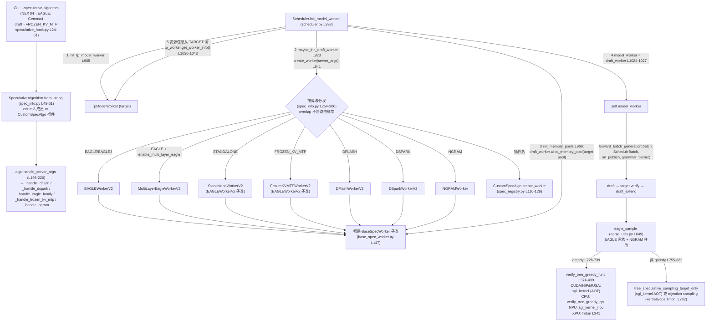

# Speculative Decoding 架构（SGLang 内部）

## Summary

SGLang 投机解码在 HEAD（pin 2026-08-18, `f7101b0a`）上是 **V2 单轨架构**：`SpeculativeAlgorithm` 8 成员枚举（`DFLASH` / `DSPARK` / `EAGLE` / `EAGLE3` / `FROZEN_KV_MTP` / `STANDALONE` / `NGRAM` / `NONE`，[spec_info.py:L38-45](d:\design\sglang\python\sglang\srt\speculative\spec_info.py)）+ [`spec_registry.py`](d:\design\sglang\python\sglang\srt\speculative\spec_registry.py) 的 **`CustomSpecAlgo` 插件注册机制**，覆盖 7 个内建算法族。**全部 7 个内建 worker 统一继承 [`BaseSpecWorker(ABC)`](d:\design\sglang\python\sglang\srt\speculative\base_spec_worker.py)（L147）**；`create_worker` 只按算法分发（[spec_info.py:L254-306](d:\design\sglang\python\sglang\srt\speculative\spec_info.py)），overlap 与非 overlap 由同一 V2 worker 驱动（非 overlap 时 scheduler 同步驱动，源码注释 [L261-263](d:\design\sglang\python\sglang\srt\speculative\spec_info.py)）。draft 模型有 3 种承载形态（EAGLE 系包一层 `EagleDraftWorkerBase`；DFlash/DSpark 直接持 plain `TpModelWorker`；NGRAM 无 draft，见 §继承树）。verify 收敛到统一采样函数 [`eagle_sample` eagle_utils.py:L649](d:\design\sglang\python\sglang\srt\speculative\eagle_utils.py)（EAGLE 家族与 NGRAM 共用），底层按平台分发到 `sgl_kernel` AOT 算子 / CPU / NPU / XPU-Triton。

~~sgl-kernel 目录已整体移出本仓库，`sgl_kernel` 现为外部 pip 包~~ **RESOLVED 2026-08-18 (re-ingest 重大补漏)**：sgl-kernel 源树**并未移出仓库**——commit `c32c4ef79c`（2026-07-29, #32648 "Move sgl-kernel under sglang.kernels.aot"）把它从顶层 `sgl-kernel/` **移到了 [python/sglang/kernels/aot/](d:\design\sglang\python\sglang\kernels\aot)**（csrc + `python/sgl_kernel` 绑定，独立打包为 `sglang-kernel` wheel、import 名仍是 `sgl_kernel`，[aot/pyproject.toml:L10](d:\design\sglang\python\sglang\kernels\aot\pyproject.toml)）。详见 §verify kernel 路径。

> synthesis: HEAD 架构可用一句话概括——**「1 个 enum 工厂 + 1 个 orchestrator 抽象（`BaseSpecWorker`）+ 3 种 draft 承载形态 + 1 个统一 verify 采样函数」**。旧的 V1/V2 双轨与 subclass-vs-duck-typed 二分已全部消失（V1 worker 文件已删，`SGLANG_ENABLE_SPEC_V2` 环境变量也已移除并留 removal notice，[speculative_hook.py:L85-90](d:\design\sglang\python\sglang\srt\arg_groups\speculative_hook.py)）。

## Sources

（行号按 HEAD `f7101b0a` 核对，2026-08-18 re-ingest）

- 算法枚举 / 工厂：[`SpeculativeAlgorithm` enum L31-45 / `from_string` L48-61 / `register` L63-87 / 能力谓词 L89-196 / `handle_server_args` L198-226 / `create_worker` L254-306](d:\design\sglang\python\sglang\srt\speculative\spec_info.py)；[`SpecInputType` L309-319 / `SpecInput(ABC)` L322-365 / `create_dummy_verify_input` L385-451](d:\design\sglang\python\sglang\srt\speculative\spec_info.py)
- 插件注册：[`CustomSpecAlgo` L25 / `register_algorithm` L222-252 / duck-typing 合同校验 `_assert_custom_spec_algo_conforms` L187-219 / 保留名（enum 全员 + `NEXTN`）L171-184](d:\design\sglang\python\sglang\srt\speculative\spec_registry.py)
- 抽象基类：[`EagleDraftWorkerBase(ABC)` L57（抽象 `draft`/`draft_extend` L66-72、`draft_runners` L74-78）/ `BaseSpecWorker(ABC)` L147（`target_worker`/`draft_worker` L176-184、生命周期 L273-294、weight update L296-312、hooks L314-338）/ `HiCacheDraftMode` L26](d:\design\sglang\python\sglang\srt\speculative\base_spec_worker.py)
- EAGLE/EAGLE3：[`EagleDraftWorker(EagleDraftWorkerBase)` L129（内嵌 `TpModelWorker(is_draft_worker=True)` L171-180）+ `EAGLEWorkerV2(BaseSpecWorker)` L1011 + `forward_batch_generation` L1108](d:\design\sglang\python\sglang\srt\speculative\eagle_worker_v2.py)
- MultiLayer EAGLE：[`MultiLayerEagleDraftWorker(EagleDraftWorkerBase)` L110（`TpModelWorker(is_multi_layer_eagle=True)` L157-168、`draft_runner_list = model_runner_list` L171）+ `MultiLayerEagleWorkerV2(BaseSpecWorker)` L918](d:\design\sglang\python\sglang\srt\speculative\multi_layer_eagle_worker_v2.py)
- Standalone：[`StandaloneDraftWorker(EagleDraftWorker)` L35（`init_lm_head` 覆盖为 no-op L140-144）+ `StandaloneWorkerV2(EAGLEWorkerV2)` L147](d:\design\sglang\python\sglang\srt\speculative\standalone_worker_v2.py)
- Frozen-KV MTP：[`FrozenKVMTPDraftWorker(EagleDraftWorkerBase, TpModelWorker)` L91（双继承，显式双 `__init__` L107+L140-150）+ `FrozenKVMTPWorkerV2(EAGLEWorkerV2)` L676（跳过父类 `__init__`，L692-696）](d:\design\sglang\python\sglang\srt\speculative\frozen_kv_mtp_worker_v2.py)
- DFlash：[`DFlashWorkerV2(BaseSpecWorker)` L168（`build_draft_tp_worker` L203-211、`draft_worker` property 注释 L313-318）+ `forward_batch_generation` L1439](d:\design\sglang\python\sglang\srt\speculative\dflash_worker_v2.py) + [`dflash_utils.py`](d:\design\sglang\python\sglang\srt\speculative\dflash_utils.py)
- DSpark（12 文件子包）：[`DSparkWorkerV2(BaseSpecWorker)` L76（`build_draft_tp_worker` L116-127、gamma/verify 窗口 L148-156）+ `forward_batch_generation` L422-433](d:\design\sglang\python\sglang\srt\speculative\dspark_components\dspark_worker_v2.py) + [`dspark_components/`](d:\design\sglang\python\sglang\srt\speculative\dspark_components)
- NGRAM：[`NGRAMWorker(BaseSpecWorker)` L71（`draft_worker → None` L142-145、`NgramCorpus` C++ L111-120）+ `forward_batch_generation` L425 + `eagle_sample` 调用 L482](d:\design\sglang\python\sglang\srt\speculative\ngram_worker.py)
- draft 承载公共件：[`DraftWorkerBundle` L36 / `build_draft_tp_worker` L65-113（构造 `TpModelWorker(is_draft_worker=True)` L91-100）](d:\design\sglang\python\sglang\srt\speculative\draft_worker_common.py)；[`DraftBackendFactory` L27](d:\design\sglang\python\sglang\srt\speculative\draft_utils.py)
- Scheduler 接入：[`init_tp_model_worker` L905 / `maybe_init_draft_worker` L923（`create_worker` L941）/ `init_memory_pools` L966-979 / `init_model_worker` L993（`model_worker = draft_worker` L1024-1027、`tp_worker.get_worker_info()` L1030-1043）](d:\design\sglang\python\sglang\srt\managers\scheduler.py)
- TpModelWorker：[`is_multi_layer_eagle` L312/L322 / `model_runner_list` L334 / `_init_multi_layer_eagle_model_runners` L481 / `get_worker_info` L525 / `forward_batch_generation` L574-583](d:\design\sglang\python\sglang\srt\managers\tp_worker.py)
- Verify：统一采样 [`eagle_sample` L649（greedy L726-739 / 非 greedy L755-822）+ `verify_tree_greedy_func` L374-439 + XPU Triton wrapper `verify_tree_greedy_triton` L341-371（kernel 从 `sglang.kernels.ops.speculative.spec_tree` import，L10-12）](d:\design\sglang\python\sglang\srt\speculative\eagle_utils.py)；orchestration [`run_eagle_verify` eagle_worker_common.py:L461](d:\design\sglang\python\sglang\srt\speculative\eagle_worker_common.py)；DFlash 家族另在 [dflash_utils.py:L878](d:\design\sglang\python\sglang\srt\speculative\dflash_utils.py) 调 `tree_speculative_sampling_target_only`
- Kernel 源树：[`python/sglang/kernels/aot/`](d:\design\sglang\python\sglang\kernels\aot)（`sgl_kernel` AOT wheel 源，含 [csrc/speculative/eagle_utils.cu](d:\design\sglang\python\sglang\kernels\aot\csrc\speculative\eagle_utils.cu) / [speculative_sampling.cu](d:\design\sglang\python\sglang\kernels\aot\csrc\speculative\speculative_sampling.cu) / [csrc/cpu/spec.cpp](d:\design\sglang\python\sglang\kernels\aot\csrc\cpu\spec.cpp)）+ [`python/sglang/kernels/ops/speculative/`](d:\design\sglang\python\sglang\kernels\ops\speculative)（in-tree Triton ops，13 .py + `dspark/` 子目录）
- CLI：[ServerArgs 注解式 `speculative_*` 字段 L2074-2334 + `handle_speculative_decoding` 调用 L3740-3742](d:\design\sglang\python\sglang\srt\server_args.py) + 规范化 hook [`arg_groups/speculative_hook.py`](d:\design\sglang\python\sglang\srt\arg_groups\speculative_hook.py)
- 模块全景（48 .py）：[`speculative/`](d:\design\sglang\python\sglang\srt\speculative)（34 根 + 12 `dspark_components/` + 2 `cpp_ngram/`；详见 [modules/speculative.md](../modules/speculative.md)）

## Architecture / Data flow

> ~~CONTRADICTION（2026-08-18 verify 标记）：本节旧图描绘 V1/V2 双轨 + duck-typed 分支~~ **RESOLVED 2026-08-18 (re-ingest)**：旧图已按 HEAD V2 单轨重画如下；旧叙事（`create_worker` 按 overlap 分路、EAGLE V1 继承 `TpModelWorker`、DFlash/NGRAM 无基类 duck-typed）全部失效，历史细节见 git history 与 §Increment 分界说明。



**关键观察**：

- 资源信息（`max_total_num_tokens` / `forward_stream` 等）始终从 **target** 读：[`tp_worker.get_worker_info()` scheduler.py:L1030-1043](d:\design\sglang\python\sglang\srt\managers\scheduler.py)——旧页论断在 HEAD 复核仍成立。
- worker 构造签名统一为 `(server_args, gpu_id, ps, nccl_port, target_worker)`（scheduler 统一 kwargs，[scheduler.py:L933-942](d:\design\sglang\python\sglang\srt\managers\scheduler.py)），7 个内建 worker 全部照此。
- `forward_batch_generation` 签名也已统一：所有 V2 worker 接受 `(batch: ScheduleBatch, on_publish=None, grammar_barrier=None)`（EAGLE [L1108-1110](d:\design\sglang\python\sglang\srt\speculative\eagle_worker_v2.py)、DFlash [L1439-1444](d:\design\sglang\python\sglang\srt\speculative\dflash_worker_v2.py)、DSpark [L422-427](d:\design\sglang\python\sglang\srt\speculative\dspark_components\dspark_worker_v2.py)、NGRAM 无 grammar_barrier [L425-427](d:\design\sglang\python\sglang\srt\speculative\ngram_worker.py)）；target 侧 `TpModelWorker.forward_batch_generation(batch: Optional[ScheduleBatch], ...)`（[tp_worker.py:L574-583](d:\design\sglang\python\sglang\srt\managers\tp_worker.py)）由 spec worker 内部调用。
- synthesis: `on_publish` 回调是 overlap 语义的接缝——spec worker 在 target-end / verify-end 处 publish `new_seq_lens`（[eagle_worker_v2.py:L1125-1127, L1184-1186](d:\design\sglang\python\sglang\srt\speculative\eagle_worker_v2.py)），非 overlap 时 scheduler 传 None，同一份 worker 代码同步跑——这就是 "V2 worker drives both overlap and non-overlap" 的实现机制。

## 7 算法族对照矩阵

> ~~CONTRADICTION（2026-08-18 verify 标记）：5 算法族 × V1/V2 × subclass/duck-typed 旧矩阵~~ **RESOLVED 2026-08-18 (re-ingest)**：已按 HEAD 7 族 V2 单轨重建如下（旧矩阵引用的 `eagle_worker.py` 等 V1 文件均已删除）。

| 算法族 | Worker 类（都是 `BaseSpecWorker` 后代） | draft 承载 | draft 模型 | KV | verify 路径 |
|---|---|---|---|---|---|
| **EAGLE / EAGLE3** | [`EAGLEWorkerV2` L1011](d:\design\sglang\python\sglang\srt\speculative\eagle_worker_v2.py) | 组合 [`EagleDraftWorker(EagleDraftWorkerBase)` L129](d:\design\sglang\python\sglang\srt\speculative\eagle_worker_v2.py) → 内嵌 `TpModelWorker(is_draft_worker=True)`（[L171-180](d:\design\sglang\python\sglang\srt\speculative\eagle_worker_v2.py)） | EAGLE 小 transformer（可选 hot vocab、EAGLE3 aux hidden） | draft 独立 KV pool；共享 `req_to_token_pool` + allocator（[alloc_memory_pool L194-209](d:\design\sglang\python\sglang\srt\speculative\eagle_worker_v2.py)） | `draft → verify → draft_extend`；[`eagle_sample` L649](d:\design\sglang\python\sglang\srt\speculative\eagle_utils.py) |
| **MultiLayer EAGLE**（`EAGLE` + `--enable-multi-layer-eagle`，非独立 enum 成员） | [`MultiLayerEagleWorkerV2` L918](d:\design\sglang\python\sglang\srt\speculative\multi_layer_eagle_worker_v2.py) | 组合 [`MultiLayerEagleDraftWorker(EagleDraftWorkerBase)` L110](d:\design\sglang\python\sglang\srt\speculative\multi_layer_eagle_worker_v2.py) → `TpModelWorker(is_multi_layer_eagle=True)`（[L157-168](d:\design\sglang\python\sglang\srt\speculative\multi_layer_eagle_worker_v2.py)） | MTP，每步一个 `ModelRunner`（`draft_runner_list` [L171](d:\design\sglang\python\sglang\srt\speculative\multi_layer_eagle_worker_v2.py)） | 多 runner 共享同一份物理 KV（见 §EAGLE multi-layer） | 同 EAGLE（无独立 draft forward，只有 draft_extend，[L959-961](d:\design\sglang\python\sglang\srt\speculative\multi_layer_eagle_worker_v2.py)） |
| **STANDALONE** | [`StandaloneWorkerV2(EAGLEWorkerV2)` L147](d:\design\sglang\python\sglang\srt\speculative\standalone_worker_v2.py) | 组合 [`StandaloneDraftWorker(EagleDraftWorker)` L35](d:\design\sglang\python\sglang\srt\speculative\standalone_worker_v2.py)，`init_lm_head` no-op（[L140-144](d:\design\sglang\python\sglang\srt\speculative\standalone_worker_v2.py)：不共享 embed/lm_head） | 任意独立 draft 模型 | 同 EAGLE | 复用 EAGLE 路径（target prefill 时 `CaptureHiddenMode.NULL`，[eagle_worker_v2.py:L1113-1117](d:\design\sglang\python\sglang\srt\speculative\eagle_worker_v2.py)） |
| **FROZEN_KV_MTP** | [`FrozenKVMTPWorkerV2(EAGLEWorkerV2)` L676](d:\design\sglang\python\sglang\srt\speculative\frozen_kv_mtp_worker_v2.py)（跳过父类 `__init__`，[L692-696](d:\design\sglang\python\sglang\srt\speculative\frozen_kv_mtp_worker_v2.py)） | **双继承** [`FrozenKVMTPDraftWorker(EagleDraftWorkerBase, TpModelWorker)` L91](d:\design\sglang\python\sglang\srt\speculative\frozen_kv_mtp_worker_v2.py)——唯一直接继承 `TpModelWorker` 的 draft worker | Gemma4 assistant MTP，绑 target embed/head（[L152-154](d:\design\sglang\python\sglang\srt\speculative\frozen_kv_mtp_worker_v2.py)） | **draft 无自有 KV**（只读 target KV；`_draft_model_runners` 对 frozen 返回空，[base_spec_worker.py:L158-169](d:\design\sglang\python\sglang\srt\speculative\base_spec_worker.py)） | 复用 `EAGLEWorkerV2` verify 骨架 verbatim（docstring [L677-682](d:\design\sglang\python\sglang\srt\speculative\frozen_kv_mtp_worker_v2.py)） |
| **DFLASH** | [`DFlashWorkerV2` L168](d:\design\sglang\python\sglang\srt\speculative\dflash_worker_v2.py) | 直接持 plain `TpModelWorker`（经 [`build_draft_tp_worker` draft_worker_common.py:L65-113](d:\design\sglang\python\sglang\srt\speculative\draft_worker_common.py)；"no draft/draft_extend split"，[L313-318](d:\design\sglang\python\sglang\srt\speculative\dflash_worker_v2.py)） | 独立 block-diffusion draft（block_size = verify 窗长，[L218-234](d:\design\sglang\python\sglang\srt\speculative\dflash_worker_v2.py)） | draft KV 从 target hidden states materialize；可选 compact draft cache（`--speculative-draft-window-size`，[L194-197](d:\design\sglang\python\sglang\srt\speculative\dflash_worker_v2.py)） | DFlash 专用 verify + [`tree_speculative_sampling_target_only` dflash_utils.py:L878](d:\design\sglang\python\sglang\srt\speculative\dflash_utils.py) |
| **DSPARK** | [`DSparkWorkerV2` L76](d:\design\sglang\python\sglang\srt\speculative\dspark_components\dspark_worker_v2.py) | 同 DFlash（`build_draft_tp_worker`，[L116-127](d:\design\sglang\python\sglang\srt\speculative\dspark_components\dspark_worker_v2.py)） | Inkling/DSV4 DSpark draft（gamma 块 + markov head；`verify_num_draft_tokens = gamma+1`，[L148-156](d:\design\sglang\python\sglang\srt\speculative\dspark_components\dspark_worker_v2.py)） | 同 DFlash 家族 | 唯一支持 **ragged verify**（per-request verify 长度，[`supports_ragged_verify` spec_info.py:L131-135](d:\design\sglang\python\sglang\srt\speculative\spec_info.py)）；planner/estimator/observability 拆在 [dspark_components/](d:\design\sglang\python\sglang\srt\speculative\dspark_components) 12 文件 |
| **NGRAM** | [`NGRAMWorker` L71](d:\design\sglang\python\sglang\srt\speculative\ngram_worker.py) | **无 draft worker**（`draft_worker` property 返回 None，[L142-145](d:\design\sglang\python\sglang\srt\speculative\ngram_worker.py)） | 无模型：C++ [`NgramCorpus`](d:\design\sglang\python\sglang\srt\speculative\cpp_ngram\ngram_corpus.py) trie/SAM（[L111-120](d:\design\sglang\python\sglang\srt\speculative\ngram_worker.py)），可预载外部语料 | 完全共享 target pool（[alloc_memory_pool L72-78](d:\design\sglang\python\sglang\srt\speculative\ngram_worker.py)）；唯一 `has_draft_kv()=False` 的算法（[spec_info.py:L145-149](d:\design\sglang\python\sglang\srt\speculative\spec_info.py)） | **现已走 `eagle_sample` 统一路径**（import [L22](d:\design\sglang\python\sglang\srt\speculative\ngram_worker.py)、调用 [L482](d:\design\sglang\python\sglang\srt\speculative\ngram_worker.py)）——旧论断"NGRAM 不调 `verify_tree_greedy`"已失效 |

第 8 路：**插件算法**经 [`SpeculativeAlgorithm.register` spec_info.py:L63-87](d:\design\sglang\python\sglang\srt\speculative\spec_info.py) 装饰器注册 factory，`from_string` 对内建（enum member）与插件（`CustomSpecAlgo` 实例）统一分发（[L48-61](d:\design\sglang\python\sglang\srt\speculative\spec_info.py)）；插件不能占用内建名 + `NEXTN` 别名（[spec_registry.py:L171-184](d:\design\sglang\python\sglang\srt\speculative\spec_registry.py)），且注册时做 duck-typing 合同校验——`CustomSpecAlgo` 必须实现 enum 的全部 `is_*` / `supports_*` 谓词（[L187-219](d:\design\sglang\python\sglang\srt\speculative\spec_registry.py)）。`supports_overlap=False` 的插件已被标 deprecated（V1 路径删除后同步跑 V2 schema 并 warning，[L110-126](d:\design\sglang\python\sglang\srt\speculative\spec_registry.py)）。

> synthesis: enum 上的能力谓词是跨模块 dispatch 的「协议面」——scheduler / attention backend / disagg 不 isinstance worker 类，而是问 `spec_algorithm.is_eagle()` / `has_draft_kv()` / `supports_ragged_verify()` / `supports_grammar_overlap()`（[spec_info.py:L89-196](d:\design\sglang\python\sglang\srt\speculative\spec_info.py)）。注意 `is_eagle()` 暂时把 `FROZEN_KV_MTP` 也算进去（FIXME 注释 [L98-105](d:\design\sglang\python\sglang\srt\speculative\spec_info.py)）。

## BaseSpecWorker 继承树与 draft 承载三形态

> ~~CONTRADICTION（2026-08-18 verify 标记）：本节旧文描述 "TpModelWorker subclass vs duck-typed" 二分法~~ **RESOLVED 2026-08-18 (re-ingest)**：二分法已消失，本节按 HEAD 重写。旧文仍成立的两条（「资源信息从 target 读」「NGRAM 无 draft 前向」）已并入下文。

**orchestrator 层继承树**（全部落在 [base_spec_worker.py](d:\design\sglang\python\sglang\srt\speculative\base_spec_worker.py)）：

```
BaseSpecWorker(ABC)                      base_spec_worker.py L147
├── EAGLEWorkerV2                        eagle_worker_v2.py L1011
│   ├── StandaloneWorkerV2               standalone_worker_v2.py L147（BaseSpecWorker.__init__ 直调 L157）
│   └── FrozenKVMTPWorkerV2              frozen_kv_mtp_worker_v2.py L676（BaseSpecWorker.__init__ 直调 L692）
├── MultiLayerEagleWorkerV2              multi_layer_eagle_worker_v2.py L918
├── DFlashWorkerV2                       dflash_worker_v2.py L168
├── DSparkWorkerV2                       dspark_components/dspark_worker_v2.py L76
└── NGRAMWorker                          ngram_worker.py L71
```

`BaseSpecWorker` 合同（scheduler 只依赖这些）：`target_worker` / `draft_worker` property（[L176-184](d:\design\sglang\python\sglang\srt\speculative\base_spec_worker.py)）、`alloc_memory_pool` / `init_attention_backends` / `init_cuda_graphs` 生命周期（[L273-294](d:\design\sglang\python\sglang\srt\speculative\base_spec_worker.py)）、`update_weights_from_disk/ipc`（遍历 `draft_worker.draft_runners`，[L296-312](d:\design\sglang\python\sglang\srt\speculative\base_spec_worker.py)）、三个默认 no-op hook（`on_verify_complete_cpu` / `note_request_finished`（DSpark 覆盖）/ `activate_step_by_batch`（adaptive 覆盖），[L314-338](d:\design\sglang\python\sglang\srt\speculative\base_spec_worker.py)）、overlap 协作面 `last_shared_read_runner` / `spec_v2_attn_backends`（[L214-226](d:\design\sglang\python\sglang\srt\speculative\base_spec_worker.py)）、HiCache draft plan（PACKED/SIDECAR/NONE，[L234-271](d:\design\sglang\python\sglang\srt\speculative\base_spec_worker.py)）。

**draft 承载三形态**（`draft_worker` property 的三种返回类型，类型注解 [L181-184](d:\design\sglang\python\sglang\srt\speculative\base_spec_worker.py) 明示 `Optional[EagleDraftWorkerBase | TpModelWorker]`）：

| 形态 | 谁用 | 结构 | 依据 |
|---|---|---|---|
| **`EagleDraftWorkerBase` 包装** | EAGLE / EAGLE3 / MultiLayer / Standalone / Frozen-KV MTP | 第二层抽象（抽象 `draft()` + `draft_extend()`，[L66-72](d:\design\sglang\python\sglang\srt\speculative\base_spec_worker.py)）；除 Frozen 外内部再嵌 `TpModelWorker(is_draft_worker=True)`；Frozen 直接双继承 `TpModelWorker` | [eagle_worker_v2.py:L129, L171-180](d:\design\sglang\python\sglang\srt\speculative\eagle_worker_v2.py)；[frozen_kv_mtp_worker_v2.py:L91, L140-150](d:\design\sglang\python\sglang\srt\speculative\frozen_kv_mtp_worker_v2.py) |
| **plain `TpModelWorker`** | DFlash / DSpark | 经 [`build_draft_tp_worker`](d:\design\sglang\python\sglang\srt\speculative\draft_worker_common.py)（L91-100 同样传 `is_draft_worker=True`）返回 `DraftWorkerBundle`；draft KV 从 target hidden materialize，无 draft/draft_extend 两段式 | [dflash_worker_v2.py:L203-211, L313-318](d:\design\sglang\python\sglang\srt\speculative\dflash_worker_v2.py) |
| **None** | NGRAM | draft 来自 CPU 语料查询，无任何 GPU draft 前向 | [ngram_worker.py:L142-145](d:\design\sglang\python\sglang\srt\speculative\ngram_worker.py) |

**scheduler 接入协议**：`BaseSpecWorker` 在 speculative/ 之外只被 2 个文件 import——[scheduler.py:L296](d:\design\sglang\python\sglang\srt\managers\scheduler.py)（isinstance 检查 [L2040](d:\design\sglang\python\sglang\srt\managers\scheduler.py)）与 [batch_result_processor.py:L43](d:\design\sglang\python\sglang\srt\managers\scheduler_components\batch_result_processor.py)（isinstance narrowing [L1066-1068](d:\design\sglang\python\sglang\srt\managers\scheduler_components\batch_result_processor.py)，注释说明 `create_worker` 也可能返回 plain `TpModelWorker`——即插件 factory 的自由度）。

> synthesis: 旧的 "subclass vs duck-typed" 张力没有消失而是**下移了一层**：orchestrator 层完全统一（都是 `BaseSpecWorker`），差异被推到 `draft_worker` property 的返回类型上。`BaseSpecWorker._draft_model_runners`（[L158-169](d:\design\sglang\python\sglang\srt\speculative\base_spec_worker.py)）是这个多态的收口点——它按 `spec_algorithm` 谓词分流三形态取 runner 列表，供 HiCache / weight-update 等通用逻辑使用。

## verify kernel 路径（sgl-kernel AOT 迁移 + in-tree Triton ops）

> ~~CONTRADICTION（2026-08-18 verify 标记）：sgl-kernel 目录已在 pin 前整体移出本仓库，`sgl_kernel` 现为外部 pip 包~~ **RESOLVED 2026-08-18 (re-ingest, 重大补漏)**：**该论断错误**。顶层 `sgl-kernel/` 确已消失，但源树是被 commit `c32c4ef79c`（2026-07-29, #32648）**移入 [python/sglang/kernels/aot/](d:\design\sglang\python\sglang\kernels\aot)**：完整保留 csrc（[speculative/eagle_utils.cu](d:\design\sglang\python\sglang\kernels\aot\csrc\speculative\eagle_utils.cu) / [speculative_sampling.cu](d:\design\sglang\python\sglang\kernels\aot\csrc\speculative\speculative_sampling.cu) / [cpu/spec.cpp](d:\design\sglang\python\sglang\kernels\aot\csrc\cpu\spec.cpp) / [common_extension.cc](d:\design\sglang\python\sglang\kernels\aot\csrc\common_extension.cc)）、Python 绑定（[aot/python/sgl_kernel/speculative.py](d:\design\sglang\python\sglang\kernels\aot\python\sgl_kernel\speculative.py)）与 kernel 测试（[aot/tests/speculative/](d:\design\sglang\python\sglang\kernels\aot\tests\speculative)）。它独立打包为 `sglang-kernel` wheel（[pyproject.toml:L10](d:\design\sglang\python\sglang\kernels\aot\pyproject.toml)），import 名仍是 `sgl_kernel`——所以 srt 侧 `from sgl_kernel import ...` 语法上像外部包，源码却在仓库内。同期还落地了 `sglang.kernels` 统一命名空间（RFC #29630，[kernels/README.md](d:\design\sglang\python\sglang\kernels\README.md)）：[ops/speculative/](d:\design\sglang\python\sglang\kernels\ops\speculative) 13 .py + `dspark/` 子目录提供 in-tree Triton spec kernel（`spec_tree.py` / `eagle.py` / `dflash.py` / `reject_sampling.py` / `cache_locs.py` / `fused_kv_materialize.py` / `ragged_verify_kernels.py` 等），srt/speculative 大量直接 `from sglang.kernels.ops.speculative.* import`。

**统一 verify 采样入口**：[`eagle_sample(verify_input, batch, logits_output, grammar_mask)` eagle_utils.py:L649](d:\design\sglang\python\sglang\srt\speculative\eagle_utils.py)——EAGLE / EAGLE3 / MultiLayer / Standalone / Frozen-KV MTP（经 [`run_eagle_verify` eagle_worker_common.py:L461](d:\design\sglang\python\sglang\srt\speculative\eagle_worker_common.py)）**以及 NGRAM**（[ngram_worker.py:L482](d:\design\sglang\python\sglang\srt\speculative\ngram_worker.py)）共用；DFlash 家族独立 verify、但同样在 [dflash_utils.py:L878](d:\design\sglang\python\sglang\srt\speculative\dflash_utils.py) 调 AOT 采样算子。

路由（[eagle_utils.py:L726-822](d:\design\sglang\python\sglang\srt\speculative\eagle_utils.py)）：batch 全 greedy **或平台为 CPU/NPU/HIP/XPU** 时走 greedy 树验证；否则走带温度树采样。HIP 上 greedy 结果做 TP broadcast 防 desync（[L741-754](d:\design\sglang\python\sglang\srt\speculative\eagle_utils.py)）。

| 算子 | 平台分发 | 实现位置 |
|---|---|---|
| **greedy 树验证** [`verify_tree_greedy_func` L374-439](d:\design\sglang\python\sglang\srt\speculative\eagle_utils.py) | CUDA/HIP/MUSA → `from sgl_kernel import verify_tree_greedy`（[L385-398](d:\design\sglang\python\sglang\srt\speculative\eagle_utils.py)）；CPU → `verify_tree_greedy_cpu`（import [L57](d:\design\sglang\python\sglang\srt\speculative\eagle_utils.py)）；NPU → `sgl_kernel_npu.sample.verify_tree_greedy`（[L414-427](d:\design\sglang\python\sglang\srt\speculative\eagle_utils.py)）；XPU → **Triton fallback** [`verify_tree_greedy_triton` L341-371](d:\design\sglang\python\sglang\srt\speculative\eagle_utils.py)（[L428-438](d:\design\sglang\python\sglang\srt\speculative\eagle_utils.py)） | AOT CUDA：[aot/csrc/speculative/eagle_utils.cu](d:\design\sglang\python\sglang\kernels\aot\csrc\speculative\eagle_utils.cu)；CPU：[aot/csrc/cpu/spec.cpp](d:\design\sglang\python\sglang\kernels\aot\csrc\cpu\spec.cpp)；Triton kernel：[kernels/ops/speculative/spec_tree.py](d:\design\sglang\python\sglang\kernels\ops\speculative\spec_tree.py)（eagle_utils.py [L10-12](d:\design\sglang\python\sglang\srt\speculative\eagle_utils.py) import）；NPU：外部包 `sgl_kernel_npu`（本仓 0 源码） |
| **带温度树采样** `tree_speculative_sampling_target_only` | `eagle_sample` 非 greedy 分支（[L755-822](d:\design\sglang\python\sglang\srt\speculative\eagle_utils.py)，同时 import `top_k/top_p_renorm_prob`）；rejection sampling 模式改用 in-tree Triton [`chain_speculative_sampling_triton` kernels/ops/speculative/reject_sampling.py](d:\design\sglang\python\sglang\kernels\ops\speculative\reject_sampling.py)（[L762-763](d:\design\sglang\python\sglang\srt\speculative\eagle_utils.py)）；kernel 可用性 gate [`TREE_SPEC_KERNEL_AVAILABLE` spec_utils.py:L185](d:\design\sglang\python\sglang\srt\speculative\spec_utils.py) | AOT CUDA：[aot/csrc/speculative/speculative_sampling.cu](d:\design\sglang\python\sglang\kernels\aot\csrc\speculative\speculative_sampling.cu)；绑定 [aot/python/sgl_kernel/speculative.py](d:\design\sglang\python\sglang\kernels\aot\python\sgl_kernel\speculative.py) |

> synthesis: HEAD 的 kernel 组织是**双通道**——预编译 AOT wheel（`kernels/aot` → `sgl_kernel`，重算子）+ in-tree Triton ops（`kernels/ops`，JIT、可直接 import），spec 子系统两者都重度使用。`eagle_info.py` 现仅存 `EagleVerifyInput` / `EagleDraftInput` / `EagleDraftExtendInput` 三个 dataclass（[L16/L142/L272](d:\design\sglang\python\sglang\srt\speculative\eagle_info.py)），旧 `EagleVerifyInput.verify` 方法已不存在——verify 逻辑全部搬到 `eagle_utils` / `eagle_worker_common` 模块函数。

## EAGLE multi-layer 特殊性

`TpModelWorker` 默认 1 worker = 1 `ModelRunner`；`is_multi_layer_eagle=True`（[tp_worker.py:L312/L322](d:\design\sglang\python\sglang\srt\managers\tp_worker.py)）时由 [`_init_multi_layer_eagle_model_runners` L481](d:\design\sglang\python\sglang\srt\managers\tp_worker.py) 填充 [`model_runner_list: List[ModelRunner]` L334](d:\design\sglang\python\sglang\srt\managers\tp_worker.py)（构造时 [L339-340](d:\design\sglang\python\sglang\srt\managers\tp_worker.py) 触发）。V2 路径的持有链：`MultiLayerEagleWorkerV2 → MultiLayerEagleDraftWorker.draft_runner_list = self.draft_worker.model_runner_list`（[multi_layer_eagle_worker_v2.py:L171](d:\design\sglang\python\sglang\srt\speculative\multi_layer_eagle_worker_v2.py)），按步访问 [`mtp_model_runner(step) → draft_runner_list[step]` L224-225](d:\design\sglang\python\sglang\srt\speculative\multi_layer_eagle_worker_v2.py)，`draft_runners` property 覆盖为整个 list（[L188-191](d:\design\sglang\python\sglang\srt\speculative\multi_layer_eagle_worker_v2.py)，供基类 weight-update / graph-usage 聚合遍历）。约束 `speculative_num_draft_tokens == speculative_num_steps + 1`（assert [L140-144](d:\design\sglang\python\sglang\srt\speculative\multi_layer_eagle_worker_v2.py)）。chain-MTP 架构（Step3p5MTP / Inkling MTP）每步传播自身 hidden states，非 chain 用 target hidden（[L175-181](d:\design\sglang\python\sglang\srt\speculative\multi_layer_eagle_worker_v2.py)）。

> synthesis: 这是 [comparison/topics/executor-worker.md](../../comparison/topics/executor-worker.md) "draft model runner 持有位置差异" 中 SGLang 的精确实现：target 与 N 个 draft 都是 `ModelRunner`，由同一 `TpModelWorker` 进程内的 `model_runner_list[]` 共享；vLLM 走 `EagleProposer/Speculator` 内含 cudagraph 管理；MindIE 走 `MtpWorker.draft_model_runner` 装饰。三家都用 `ModelRunner` 抽象，但持有方式截然不同。

## CLI 全表

> ~~CONTRADICTION（2026-08-18 verify 标记）：旧表手写 argparse 锚点 L5099-5271 全部失效~~ **RESOLVED 2026-08-18 (re-ingest)**：已按注解式字段（`A[...]`，argparse 自动生成）+ hook 函数重建如下。

字段定义集中在 [server_args.py:L2074-2334](d:\design\sglang\python\sglang\srt\server_args.py)；启动时经 [L3740-3742](d:\design\sglang\python\sglang\srt\server_args.py) 调 [`handle_speculative_decoding` speculative_hook.py:L64-144](d:\design\sglang\python\sglang\srt\arg_groups\speculative_hook.py) 规范化，再经 [`SpeculativeAlgorithm.handle_server_args` spec_info.py:L198-226](d:\design\sglang\python\sglang\srt\speculative\spec_info.py) 按算法分发到 5 个 `_handle_*`。

### 算法选择与别名规范化

| 参数 / 逻辑 | 锚点 | 说明 |
|---|---|---|
| `--speculative-algorithm` | [server_args.py:L2074](d:\design\sglang\python\sglang\srt\server_args.py) | 内建 8 名 + `NEXTN` 别名 + 插件名 |
| 别名解析 | [`_resolve_speculative_algorithm_alias` speculative_hook.py:L24-61](d:\design\sglang\python\sglang\srt\arg_groups\speculative_hook.py) | `NEXTN`/`EAGLE` → `EAGLE`；**draft 为 Gemma4 assistant 架构时提升为 `FROZEN_KV_MTP`**（[L52-58](d:\design\sglang\python\sglang\srt\arg_groups\speculative_hook.py)）；`EAGLE3` + Gemma4 draft 直接 raise（[L45-50](d:\design\sglang\python\sglang\srt\arg_groups\speculative_hook.py)） |
| `--enable-multi-layer-eagle` | （resolved view） | EAGLE 内部二选一维度（[create_worker spec_info.py:L286-291](d:\design\sglang\python\sglang\srt\speculative\spec_info.py)） |
| `SGLANG_ENABLE_SPEC_V2` | [speculative_hook.py:L85-90](d:\design\sglang\python\sglang\srt\arg_groups\speculative_hook.py) | **已移除**（V2 唯一路径），设置时仅打 removal warning |

### 通用 draft / EAGLE 系参数（[server_args.py:L2079-L2260](d:\design\sglang\python\sglang\srt\server_args.py)）

| 参数 | 字段锚点 | 说明 |
|---|---|---|
| `--speculative-draft-model-path` / `-revision` / `-load-format` / `-model-quantization` | [L2079/L2087/L2092/L2224](d:\design\sglang\python\sglang\srt\server_args.py) | draft 加载；DeepSeek 系 MTP 自动指回 target 路径（[speculative_hook.py:L579-604](d:\design\sglang\python\sglang\srt\arg_groups\speculative_hook.py)） |
| `--speculative-num-steps` / `--speculative-eagle-topk` / `--speculative-num-draft-tokens` | [L2100/L2105/L2110](d:\design\sglang\python\sglang\srt\server_args.py) | 未显式给出时按模型架构自动选择（[`_auto_choose_speculative_params` speculative_hook.py:L813-843](d:\design\sglang\python\sglang\srt\arg_groups\speculative_hook.py)）；topk=1 强制 `num_draft_tokens = num_steps + 1`（[L675-683](d:\design\sglang\python\sglang\srt\arg_groups\speculative_hook.py)） |
| `--speculative-accept-threshold-single` / `-acc` | [L2155/L2160](d:\design\sglang\python\sglang\srt\server_args.py) | 树采样算子入参 |
| `--speculative-use-rejection-sampling` | [L2165](d:\design\sglang\python\sglang\srt\server_args.py) | 仅 EAGLE/EAGLE3 + topk=1（校验 [speculative_hook.py:L627-673](d:\design\sglang\python\sglang\srt\arg_groups\speculative_hook.py)）；走 in-tree Triton chain sampling |
| `--speculative-token-map` / `--speculative-attention-mode` / `--speculative-draft-attention-backend` / `--speculative-draft-kv-cache-dtype` | [L2170/L2173/L2182/L2187](d:\design\sglang\python\sglang\srt\server_args.py) | draft hot vocab / attention 选择 |
| `--speculative-moe-runner-backend` / `-a2a-backend` | [L2206/L2215](d:\design\sglang\python\sglang\srt\server_args.py) | draft 端 MoE 后端 |
| `--speculative-adaptive` / `-adaptive-config` | [L2251/L2256](d:\design\sglang\python\sglang\srt\server_args.py) | **adaptive spec**（pin 前新增）：按 batch size 切换 step config（[`_init_adaptive_speculative_params` speculative_hook.py:L788-810](d:\design\sglang\python\sglang\srt\arg_groups\speculative_hook.py)、worker 侧 `AdaptiveController` [eagle_worker_v2.py:L1044-1050](d:\design\sglang\python\sglang\srt\speculative\eagle_worker_v2.py)） |
| `--speculative-skip-dp-mlp-sync` | [L2238](d:\design\sglang\python\sglang\srt\server_args.py) | 仅 EAGLE（assert [speculative_hook.py:L132-136](d:\design\sglang\python\sglang\srt\arg_groups\speculative_hook.py)） |

### DFlash / DSpark / NGRAM 专用

| 参数 | 字段锚点 | 说明 |
|---|---|---|
| `--speculative-dflash-block-size` | [L2115](d:\design\sglang\python\sglang\srt\server_args.py) | DFlash verify 窗长；与 `num_draft_tokens` 必须一致，缺省时从 draft config 推断（[`_handle_dflash` speculative_hook.py:L193-244](d:\design\sglang\python\sglang\srt\arg_groups\speculative_hook.py)）；DFlash 强制 `num_steps=1` / `topk=1`（[L175-191](d:\design\sglang\python\sglang\srt\arg_groups\speculative_hook.py)）、禁 dp-attention / pp（[L155-163](d:\design\sglang\python\sglang\srt\arg_groups\speculative_hook.py)） |
| `--speculative-draft-window-size` | [L2201](d:\design\sglang\python\sglang\srt\server_args.py) | DFlash compact draft KV + Llama EAGLE-3 drafter SWA 共用（[speculative_hook.py:L105-119](d:\design\sglang\python\sglang\srt\arg_groups\speculative_hook.py)） |
| `--speculative-dspark-block-size`（= gamma） / `-sps-table-path` / `-confidence-sts-path` / `-align-verify-tokens-to-graph-tier` | [L2120/L2125/L2134/L2143](d:\design\sglang\python\sglang\srt\server_args.py) | DSpark `num_draft_tokens = gamma + 1`（[`_handle_dspark` L361-412](d:\design\sglang\python\sglang\srt\arg_groups\speculative_hook.py)）；ragged verify 模式由环境变量 `SGLANG_RAGGED_VERIFY_MODE` 控制（[L426-450](d:\design\sglang\python\sglang\srt\arg_groups\speculative_hook.py)） |
| `--speculative-ngram-{min,max}-bfs-breadth` / `-match-type` / `-max-trie-depth` / `-capacity` / `-external-corpus-{path,max-tokens}` / `-external-sam-budget` | [L2300-L2334](d:\design\sglang\python\sglang\srt\server_args.py) | NGRAM 把 `topk` 重定义为 `max_bfs_breadth`、`num_draft_tokens` 缺省 12（[`_handle_ngram` L702-751](d:\design\sglang\python\sglang\srt\arg_groups\speculative_hook.py)） |

## 使用方调用清单 / 跨子系统引用（hidden cross-reference grep 2026-08-18）

按 AGENTS.md §5 step 3 五类，grep 范围 `/tmp/sglang`（= `d:\design\sglang`）全仓库：

1. **跨语言绑定**：`verify_tree_greedy|tree_speculative_sampling` 在 `python/` 全树命中 16 文件——srt 侧调用方 2（`eagle_utils.py` / `dflash_utils.py`），其余全部在 [kernels/aot/](d:\design\sglang\python\sglang\kernels\aot)（csrc CUDA/ROCm/MUSA/CPU 注册 + `python/sgl_kernel` 绑定 + `aot/tests/speculative/` 2 个 kernel 测试）与 [kernels/ops/speculative/spec_tree.py](d:\design\sglang\python\sglang\kernels\ops\speculative\spec_tree.py)（Triton）。→ 由此发现 §verify kernel 路径的"移出仓库"补漏。NPU 算子（`sgl_kernel_npu`）：在 `d:\design\sglang` 全树 grep 仅有 import 语句命中、0 实现源码——确系外部包。
2. **协作伙伴跨子系统引用**：`BaseSpecWorker` 在 `srt/speculative/` 之外全树仅 2 文件命中（[scheduler.py:L296/L2040](d:\design\sglang\python\sglang\srt\managers\scheduler.py)、[batch_result_processor.py:L43/L1066-1068](d:\design\sglang\python\sglang\srt\managers\scheduler_components\batch_result_processor.py)）；`create_worker` 生产调用方全树仅 1 处（[scheduler.py:L941](d:\design\sglang\python\sglang\srt\managers\scheduler.py)）；`SpeculativeAlgorithm` 在 speculative/ 外命中 22 文件（managers 7 / model_executor 6 / mem_cache 3 / layers 3 / server_args / models / arg_groups 各 1）；disaggregation 侧经 `SpecInput`/`spec_info` 引用 2 文件（[prefill.py](d:\design\sglang\python\sglang\srt\disaggregation\prefill.py) / [decode_schedule_batch_mixin.py](d:\design\sglang\python\sglang\srt\disaggregation\decode_schedule_batch_mixin.py)），入口是 [`build_disagg_draft_input` spec_info.py:L173-193](d:\design\sglang\python\sglang\srt\speculative\spec_info.py)（只分发 EAGLE / DSPARK）。
3. **配置 / 共享数据结构**：`speculative_algorithm` 字段在 speculative/ 外的读取热点：[arg_groups/speculative_hook.py](d:\design\sglang\python\sglang\srt\arg_groups\speculative_hook.py)(21 处) / [server_args.py](d:\design\sglang\python\sglang\srt\server_args.py)(16) / [arg_groups/overrides.py](d:\design\sglang\python\sglang\srt\arg_groups\overrides.py)(6) / [mem_cache/kv_cache_configurator.py](d:\design\sglang\python\sglang\srt\mem_cache\kv_cache_configurator.py)(5) / [configs/model_config.py](d:\design\sglang\python\sglang\srt\configs\model_config.py)(4) 等；`speculative_num_draft_tokens` 的远端读取方 40+ 文件，覆盖 `layers/attention/` 十余个 backend、`mem_cache/`、[disaggregation/decode.py](d:\design\sglang\python\sglang\srt\disaggregation\decode.py)、[kv_canary/capacities.py](d:\design\sglang\python\sglang\srt\kv_canary\capacities.py)、[observability/metrics_collector.py](d:\design\sglang\python\sglang\srt\observability\metrics_collector.py)——synthesis: spec 树形状参数实质是全局 KV/graph 容量规划输入，而非 spec 模块私有配置。
4. **测试反查**：[test/registered/unit/spec/](d:\design\sglang\test\registered\unit\spec) 18 文件（含 [test_spec_registry.py](d:\design\sglang\test\registered\unit\spec\test_spec_registry.py) 插件注册、[test_plugin_hook_signatures.py](d:\design\sglang\test\registered\unit\spec\test_plugin_hook_signatures.py) duck-typing 合同、[test_eagle_worker_v2_topk1_fastpath.py](d:\design\sglang\test\registered\unit\spec\test_eagle_worker_v2_topk1_fastpath.py)、adaptive/decoupled-IO/dflash-overlap 等）；e2e：[test/registered/core/test_basic_sanity_{eagle3,dspark,dflash}.py](d:\design\sglang\test\registered\core)、[test/registered/mock_model/test_e2e_spec_eagle.py](d:\design\sglang\test\registered\mock_model\test_e2e_spec_eagle.py)、[test/registered/cpu/test_spec_kernels.py](d:\design\sglang\test\registered\cpu\test_spec_kernels.py)；`speculative` 关键字在 `test/` 全树命中 305 文件（gb300 / attention / radix_cache 等大量部署配置级引用）。
5. **doc / config 反查**：[docs/cookbook/specbundle/](d:\design\sglang\docs\cookbook\specbundle)（`specbundle_usage.mdx` + `supported_models.mdx`——spec 模型打包分发机制，代码侧未见对应"specbundle"符号）与 ascend NPU 部署 tutorials 十余篇携带 `--speculative-algorithm` 启动参数；`docs/src/snippets/configs/` 多个模型部署模板含 spec 配置。

## Increment 2026-08-18 (06f32bab → f7101b0a)

本期 `speculative/` 30 文件 / ~1082 行 churn（+1547/-620 与 disaggregation 合计）。**先声明分界**：本页正文旧叙事失效源自 **pin 前**（34fef07a→06f32bab 区间）的 V1→V2 大重构——枚举 6→**8** 成员（+`DSPARK` +`FROZEN_KV_MTP`）、V1 worker 全删、duck-typed 消失、`dspark_components/`（12 文件）与 `frozen_kv_mtp_*` / `adaptive_*` / `decoupled_spec_io.py` / `ragged_verify.py` / `spec_registry.py` 新增、`triton_ops/` 目录删除、~~sgl-kernel 移出仓库~~（**更正 2026-08-18 re-ingest**：是移入 `python/sglang/kernels/aot/`，见 §verify kernel 路径）；`06f32bab..HEAD` 本期区间 `git log --diff-filter=AD` **仅新增 1 文件**（`dflash_disaggregation.py`），无删除。本期增量本身：

- **算法族清单核对**（`ls /tmp/sglang/python/sglang/srt/speculative/`）：目录 **48 .py**（34 根 + 12 [`dspark_components/`](d:\design\sglang\python\sglang\srt\speculative\dspark_components) + 2 [`cpp_ngram/`](d:\design\sglang\python\sglang\srt\speculative\cpp_ngram)）；pin 时 47，本期 +1。DSpark 与 Frozen-KV MTP 均为 pin 前新增算法族（DSpark 初始 commit #31847 "support inkling dspark"）；worker 工厂 7 分支见 [`create_worker` spec_info.py:L254-306](d:\design\sglang\python\sglang\srt\speculative\spec_info.py)。
- **ngram accept tokens 经 FutureMap relay**（#35198）：overlap 模式下 ngram 的 accept tokens 改经 [`managers/overlap_utils.py` `FutureMap`](d:\design\sglang\python\sglang\srt\managers\overlap_utils.py) relay（+53 行），[`ngram_info.py`](d:\design\sglang\python\sglang\srt\speculative\ngram_info.py) +4；`ngram_worker.py` 本期 +58/-40（另含 #35207 降低 ngram draft prep 的 host 开销）。
- **DSpark 支持 logprobs**（#34696）+ `compute_spec_v2_logprobs` 签名简化（#35058）：`dspark_components/dspark_worker_v2.py` +66/-35；[`draft_utils.py`](d:\design\sglang\python\sglang\srt\speculative\draft_utils.py) +167/-72（现以 [`DraftBackendFactory` L27](d:\design\sglang\python\sglang\srt\speculative\draft_utils.py) 为主体）。
- **WAR → shared-read 重命名链**（#34916 → #34982 → #35059 → #35057）：`model_executor/runner_utils/war_event.py` → [`shared_read_event.py`](d:\design\sglang\python\sglang\srt\model_executor\runner_utils\shared_read_event.py)（"WAR read-done fastpath" 更名 "shared-read-done"）；#35059 起 shared-read ends **仅由 attention backend 声明解析**；#35057 把 multi-layer eagle 的最后一个 shared-read runner 指向 draft runner；spec_info.py 中旧 `is_war_publish_phase` 方法已删（本期 diff 可见）。
- **spec buffer 尺寸改从 config-bags 读取**（#35024）：dummy verify `SpecInput` 构造改用 `runtime_context.get_spec()` 的 `speculative_num_steps` / `eagle_topk` / `num_draft_tokens`（[`create_dummy_verify_input` spec_info.py:L385-451](d:\design\sglang\python\sglang\srt\speculative\spec_info.py)），不再读 startup `server_args` 记录——adaptive spec 每个候选 step config 可独立 capture。
- **新文件 [`dflash_disaggregation.py`](d:\design\sglang\python\sglang\srt\speculative\dflash_disaggregation.py)**（+32，#33676 引入）：`build_dflash_family_disagg_draft_input`——DFlash 家族在 PD-decode prebuilt batch 上构造 `DFlashDraftInputV2` 并经 FutureMap stash bonus tokens，与既有 [`eagle_disaggregation.py`](d:\design\sglang\python\sglang\srt\speculative\eagle_disaggregation.py) / [`dspark_disaggregation.py`](d:\design\sglang\python\sglang\srt\speculative\dspark_disaggregation.py) 同族；**但 [`build_disagg_draft_input` spec_info.py:L173-193](d:\design\sglang\python\sglang\srt\speculative\spec_info.py) 目前只分发 EAGLE / DSPARK**（见下方 VERIFY）。
- **dflash_utils.py +217**：新增 [`DFlashDraftConfig` L485 / `parse_dflash_draft_config` L536](d:\design\sglang\python\sglang\srt\speculative\dflash_utils.py)、fused QKV 判定 [`can_dflash_use_fused_qkv_proj` L638](d:\design\sglang\python\sglang\srt\speculative\dflash_utils.py)、NPU top-k/p renorm [L73-138](d:\design\sglang\python\sglang\srt\speculative\dflash_utils.py) 等；`dflash_worker_v2.py` +74/-14。
- **平台面**：#7216/#9401（ROCm 上 EAGLE greedy-verify 决策做 TP 广播并 scope 到 ROCm，即 [eagle_utils.py:L741-754](d:\design\sglang\python\sglang\srt\speculative\eagle_utils.py)）、#29202（AMD MTP draft-extend CUDA graph）、#33676（NPU DeepSeek-V4 DSpark）。
- synthesis: 本期 spec 主线是 **overlap 语义收口**（FutureMap relay / shared-read 重命名与统一解析）+ **配置读取迁移到 bags** + **DFlash/DSpark 功能补齐**；算法族集合与 worker 类拓扑本期无变化（上述结构性变化全部发生在 pin 前区间）。

> [!todo] VERIFY: [`dflash_disaggregation.py`](d:\design\sglang\python\sglang\srt\speculative\dflash_disaggregation.py) 的 `build_dflash_family_disagg_draft_input` 在 `d:\design\sglang\python\` 全树 grep **0 树内调用方**（`build_disagg_draft_input` 仅分发 EAGLE/DSPARK，DFlash 家族 `return None`，[spec_info.py:L173-193](d:\design\sglang\python\sglang\srt\speculative\spec_info.py)）——疑为 #33676 预留接线；后续 increment 需复查是否接入。

## Notes / Caveats

> ~~[!todo] VERIFY: 本页正文（Architecture 图 / 5 算法族矩阵 / subclass-vs-duck-typed 节 / CLI 表）已按 CONTRADICTION 块标注 stale，需要一次完整 re-ingest。~~ **RESOLVED 2026-08-18**：本次 re-ingest 已按 V2 单轨 + 8 枚举 + 插件注册重建全部失效小节，并补漏修正 sgl-kernel 位置（`kernels/aot` 在仓内）与 NGRAM verify 路径（现走 `eagle_sample`）。

> ~~[!todo] VERIFY: `MultiLayerEagleWorkerV2(BaseSpecWorker)` 在 V2 路径下 `model_runner_list` 由谁持有。~~ **RESOLVED 2026-08-18**：持有链 = `MultiLayerEagleWorkerV2 → MultiLayerEagleDraftWorker.draft_runner_list = TpModelWorker(is_multi_layer_eagle=True).model_runner_list`（[multi_layer_eagle_worker_v2.py:L157-171](d:\design\sglang\python\sglang\srt\speculative\multi_layer_eagle_worker_v2.py)）——V2 同样复用 `TpModelWorker.model_runner_list`，只是经组合而非继承持有。

> ~~[!todo] VERIFY: `forward_batch_generation` 签名差异（V1 `ScheduleBatch` vs 父类 `ModelWorkerBatch`），scheduler 如何按 worker 类型选用入参。~~ **RESOLVED 2026-08-18**：V1 删除后签名已统一——所有 spec worker 均接受 `(batch: ScheduleBatch, on_publish=None[, grammar_barrier=None])`，target 侧 `TpModelWorker.forward_batch_generation` 也接受 `batch: Optional[ScheduleBatch]`（[tp_worker.py:L574-583](d:\design\sglang\python\sglang\srt\managers\tp_worker.py)），scheduler 不再需要按类型区分入参。

> [!warning] CONTRADICTION（cross-page lint follow-up pending）
> [comparison/topics/speculative-decoding.md L80](d:\design\wiki\comparison\topics\speculative-decoding.md) 写"SGLang **24** 文件 / vLLM **12** 文件"；HEAD 实测 **SGLang 48 .py**（34 根 + 12 `dspark_components/` + 2 `cpp_ngram/`；2026-08-18 re-ingest 复核），此前 verify pass 记录的 27 也已过时。本任务范围为 sglang 内部 topic，不修改 comparison 页；**已记录为该 compare 页下次 verify pass 修复目标（`24 → 48` SGLang）**。

> [!warning] CONTRADICTION（worker 抽象命名陷阱，2026-08-18 更新表述）
> [comparison L82](../../comparison/topics/speculative-decoding.md) 顶层 synthesis "SGLang draft 用独立 TpModelWorker(is_draft_worker=True)" 在 HEAD 上**接近全对但仍不精确**：除 NGRAM（无 draft worker，[ngram_worker.py:L142-145](d:\design\sglang\python\sglang\srt\speculative\ngram_worker.py)）外，所有算法族的 draft 确实都构造 `TpModelWorker(is_draft_worker=True)`（EAGLE 系经 `EagleDraftWorkerBase` 内嵌、DFlash/DSpark 经 [`build_draft_tp_worker` L91-100](d:\design\sglang\python\sglang\srt\speculative\draft_worker_common.py)、Frozen 直接双继承）；但 Frozen-KV MTP 的 draft **不拥有独立 KV**（只读 target KV）。旧文"DFLASH / NGRAM 是 duck-typed 包装、不构造独立 ModelRunner"对 HEAD 已失效（DFlash 现构造独立 draft ModelRunner）。该 comparison 页需在下次 verify pass 同步精化。

## See also

- [sglang/modules/speculative.md](../modules/speculative.md) — 模块全景：48 .py 文件、`SpeculativeAlgorithm` enum 8 成员、`SpecInput` dataclass 注入 ScheduleBatch / ForwardBatch、N-gram C++ 扩展、DSpark 子包
- [sglang/entities/TpModelWorker.md](../entities/TpModelWorker.md) — `model_runner_list` 字段语义 + EAGLE multi-layer 联动
- [sglang/entities/Scheduler.md](../entities/Scheduler.md) — `init_tp_model_worker` / `maybe_init_draft_worker` / `init_model_worker` 三步走 + `model_worker = draft_worker` 切换语义
- [sglang/modules/sampling.md](../modules/sampling.md) — sgl-kernel 通用采样 kernel 路径（`top_k_renorm_prob` / `top_p_renorm_prob` 与 spec 共用）
- [sglang/modules/layers.md](../modules/layers.md) — attention backend；spec draft / verify 通过 `--speculative-draft-attention-backend` 与 `--speculative-attention-mode` 选择独立 backend
- [sglang/modules/distributed.md](../modules/distributed.md) — sgl-kernel C++ 绑定模式参照（`shm_allreduce` 是另一组已确认绑定）
- [comparison/topics/speculative-decoding.md](../../comparison/topics/speculative-decoding.md) — 三家 spec 9 子维度对比（**本页是 SGLang 内部 deep-dive，对比页负责跨项目**）
- [comparison/topics/executor-worker.md](../../comparison/topics/executor-worker.md) — draft model runner 持有位置三家差异（`model_runner_list` 是 SGLang 答案）
- [comparison/dimensions.md §dim-spec](../../comparison/dimensions.md)
