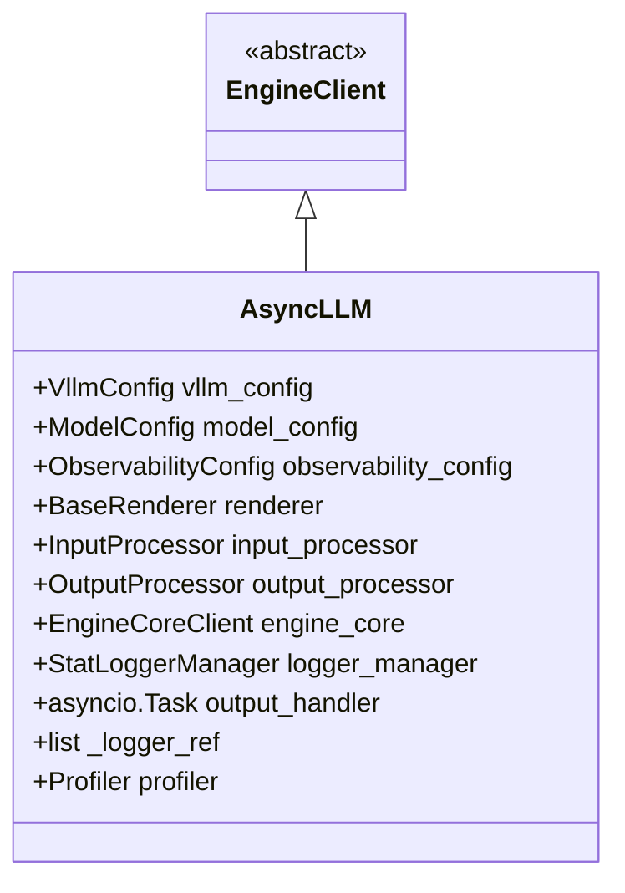
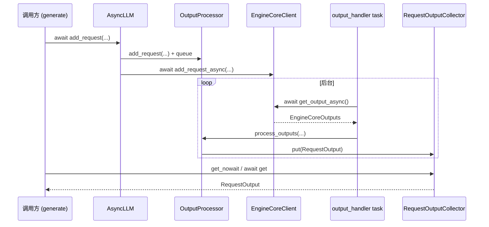

# `AsyncLLM` (v1)

## Summary

`AsyncLLM` 实现 [`EngineClient`](d:\design\vllm\vllm\engine\protocol.py) 协议，在**前端进程**内组合 [`InputProcessor`](d:\design\vllm\vllm\v1\engine\async_llm.py)（[136-137](d:\design\vllm\vllm\v1\engine\async_llm.py)）、[`OutputProcessor`](d:\design\vllm\vllm\v1\engine\async_llm.py)（[139-145](d:\design\vllm\vllm\v1\engine\async_llm.py)）与 [`EngineCoreClient.make_async_mp_client`](d:\design\vllm\vllm\v1\engine\async_llm.py)（[147-155](d:\design\vllm\vllm\v1\engine\async_llm.py)），并用常驻 **`asyncio.create_task` 的 `output_handler`** 循环 [`await engine_core.get_output_async()`](d:\design\vllm\vllm\v1\engine\async_llm.py)（[656-657](d:\design\vllm\vllm\v1\engine\async_llm.py)）→ [`output_processor.process_outputs`](d:\design\vllm\vllm\v1\engine\async_llm.py)（[672-674](d:\design\vllm\vllm\v1\engine\async_llm.py)），把结果写入每请求的 [`RequestOutputCollector`](d:\design\vllm\vllm\v1\engine\async_llm.py)（[375](d:\design\vllm\vllm\v1\engine\async_llm.py)）。对外主入口为 [`generate`](d:\design\vllm\vllm\v1\engine\async_llm.py)（[523-632](d:\design\vllm\vllm\v1\engine\async_llm.py)）/ [`encode`](d:\design\vllm\vllm\v1\engine\async_llm.py)（[771-852](d:\design\vllm\vllm\v1\engine\async_llm.py)）异步生成器与 [`add_request`](d:\design\vllm\vllm\v1\engine\async_llm.py)（[282-397](d:\design\vllm\vllm\v1\engine\async_llm.py)）。

## Sources

- 全文：[d:\design\vllm\vllm\v1\engine\async_llm.py](d:\design\vllm\vllm\v1\engine\async_llm.py)（约 1067 行）
- `RequestOutputCollector`：[d:\design\vllm\vllm\v1\engine\output_processor.py:45-107](d:\design\vllm\vllm\v1\engine\output_processor.py)
- 同步对照 `LLMEngine`：[d:\design\vllm\vllm\v1\engine\llm_engine.py](d:\design\vllm\vllm\v1\engine\llm_engine.py)
- 公开别名：`AsyncLLMEngine` → `AsyncLLM`：[d:\design\vllm\vllm\engine\async_llm_engine.py](d:\design\vllm\vllm\engine\async_llm_engine.py)
- OpenAI 入口装配：[d:\design\vllm\vllm\entrypoints\openai\api_server.py:108-155](d:\design\vllm\vllm\entrypoints\openai\api_server.py)

## 类层次 + 字段表

- **继承**：`class AsyncLLM(EngineClient)`（[70-71](d:\design\vllm\vllm\v1\engine\async_llm.py)）
- **公开别名**：`AsyncLLMEngine = AsyncLLM`（[4-7](d:\design\vllm\vllm\engine\async_llm_engine.py)）

| 字段 / 属性 | 类型（源码） | 说明 |
|---|---|---|
| `vllm_config` / `model_config` / `observability_config` | 配置 | [async_llm.py:112-114](d:\design\vllm\vllm\v1\engine\async_llm.py) |
| `renderer` | renderer | [async_llm.py:134](d:\design\vllm\vllm\v1\engine\async_llm.py) |
| `input_processor` | `InputProcessor` | [async_llm.py:136-137](d:\design\vllm\vllm\v1\engine\async_llm.py) |
| `output_processor` | `OutputProcessor` | [async_llm.py:139-145](d:\design\vllm\vllm\v1\engine\async_llm.py) |
| `engine_core` | `EngineCoreClient` | `EngineCoreClient.make_async_mp_client` [147-155](d:\design\vllm\vllm\v1\engine\async_llm.py) |
| `logger_manager` | `StatLoggerManager \| None` | [async_llm.py:158-168](d:\design\vllm\vllm\v1\engine\async_llm.py) |
| `output_handler` | `asyncio.Task \| None` | [async_llm.py:172](d:\design\vllm\vllm\v1\engine\async_llm.py)、`_run_output_handler` [634-704](d:\design\vllm\vllm\v1\engine\async_llm.py) |
| `_logger_ref` | `list`（惰性创建） | 供 `output_handler` 间接引用 logger，避免环引用；`scale_elastic_ep` 会更新 [645-648](d:\design\vllm\vllm\v1\engine\async_llm.py) |
| `profiler` | `torch.profiler.profile \| None` | [async_llm.py:184-202](d:\design\vllm\vllm\v1\engine\async_llm.py) |
| `_supported_tasks` | 惰性缓存 | `get_supported_tasks` [275-280](d:\design\vllm\vllm\v1\engine\async_llm.py) |
| `tokenizer` / `get_tokenizer` | 委托 `renderer` | [async_llm.py:854-859](d:\design\vllm\vllm\v1\engine\async_llm.py) |

**async vs sync（`LLMEngine`）**：`LLMEngine` 用 `EngineCoreClient.make_client(..., asyncio_mode=False)`（[llm_engine.py:104-111](d:\design\vllm\vllm\v1\engine\llm_engine.py)），无 `output_handler` 任务；`AsyncLLM` 用 `make_async_mp_client`（[async_llm.py:147-155](d:\design\vllm\vllm\v1\engine\async_llm.py)）并启动前述异步拉取循环。`LLMEngine.add_request` 为同步、返回 `str` request id（[llm_engine.py:210-268](d:\design\vllm\vllm\v1\engine\llm_engine.py)）；`AsyncLLM.add_request` 为 `async def`，返回 `RequestOutputCollector`（[async_llm.py:298-397](d:\design\vllm\vllm\v1\engine\async_llm.py)）。

## 主 API

| API | 行号 | sync/async | 作用 |
|---|---|---|---|
| `__init__` | [73-202](d:\design\vllm\vllm\v1\engine\async_llm.py) | sync（内联 `try: asyncio.get_running_loop()` 时可能**同步**启动 `_run_output_handler`） | 组装 processor / `EngineCoreClient` / 统计 / profiler；[172-178](d:\design\vllm\vllm\v1\engine\async_llm.py) |
| `from_vllm_config` | [205-231](d:\design\vllm\vllm\v1\engine\async_llm.py) | sync `@classmethod` | 选 `Executor.get_class` 并构造 |
| `from_engine_args` | [234-256](d:\design\vllm\vllm\v1\engine\async_llm.py) | sync `@classmethod` | 从 `AsyncEngineArgs` 建配置 |
| `shutdown` | [261-273](d:\design\vllm\vllm\v1\engine\async_llm.py) | sync | `shutdown_prometheus`、`renderer.shutdown` [265-266](d:\design\vllm\vllm\v1\engine\async_llm.py)、`engine_core.shutdown` [268-269](d:\design\vllm\vllm\v1\engine\async_llm.py)、`cancel_task_threadsafe(output_handler)` [271-273](d:\design\vllm\vllm\v1\engine\async_llm.py) |
| `get_supported_tasks` | [275-280](d:\design\vllm\vllm\v1\engine\async_llm.py) | **async** | 缓存 `_supported_tasks` |
| `add_request` | [282-397](d:\design\vllm\vllm\v1\engine\async_llm.py) | **async** | 输入处理、`n>1` 扇出、返回 `RequestOutputCollector`；流式输入走 `_add_streaming_input_request` [416-500](d:\design\vllm\vllm\v1\engine\async_llm.py) |
| `generate` | [523-632](d:\design\vllm\vllm\v1\engine\async_llm.py) | **async generator** | 迭代 collector 直至 `finished` |
| `encode` | [771-852](d:\design\vllm\vllm\v1\engine\async_llm.py) | **async generator** | pooling 流式输出 |
| `abort` | [706-718](d:\design\vllm\vllm\v1\engine\async_llm.py) | **async** | `output_processor` + `engine_core.abort_requests_async` |
| `pause_generation` / `resume_generation` / `is_paused` | [720-769](d:\design\vllm\vllm\v1\engine\async_llm.py) | **async** | 委托 `engine_core` 调度暂停 |
| `check_health` / `do_log_stats` / `is_tracing_enabled` | [861-866](d:\design\vllm\vllm\v1\engine\async_llm.py) | **async** | 健康与统计 |
| `start_profile` / `stop_profile` | [873-883](d:\design\vllm\vllm\v1\engine\async_llm.py) | **async** | `engine_core.profile_async` + 可选 CPU profiler |
| `reset_mm_cache` / `reset_prefix_cache` / `reset_encoder_cache` | [885-897](d:\design\vllm\vllm\v1\engine\async_llm.py) | **async** | 运维 |
| `sleep` / `wake_up` / `is_sleeping` | [899-912](d:\design\vllm\vllm\v1\engine\async_llm.py) | **async** | 委托 core |
| LoRA：`add_lora` / `remove_lora` / `list_loras` / `pin_lora` | [914-928](d:\design\vllm\vllm\v1\engine\async_llm.py) | **async** | 委托 core |
| `collective_rpc` | [930-942](d:\design\vllm\vllm\v1\engine\async_llm.py) | **async** | 分布式 RPC |
| `wait_for_requests_to_drain` / `scale_elastic_ep` | [944-1008](d:\design\vllm\vllm\v1\engine\async_llm.py) | **async** | DP / 弹性 EP |
| `is_running` / `is_stopped` / `errored` / `dead_error` | [1010-1025](d:\design\vllm\vllm\v1\engine\async_llm.py) | sync `@property` | 状态；`errored` 综合 `engine_core.resources.engine_dead` 与 `is_running` [1019-1021](d:\design\vllm\vllm\v1\engine\async_llm.py) |
| `init_weight_transfer_engine` / `update_weights` | [1027-1066](d:\design\vllm\vllm\v1\engine\async_llm.py) | **async** | RL 权重更新 |
| `_run_output_handler` | [634-704](d:\design\vllm\vllm\v1\engine\async_llm.py) | sync（内部 `async def output_handler` + **`asyncio.create_task`**） | 后台拉取 core 输出 |

## 异步运行模型

1. **启动时机**：`__init__` [172-178](d:\design\vllm\vllm\v1\engine\async_llm.py) 若已有 running loop 则调用 `_run_output_handler` [634-704](d:\design\vllm\vllm\v1\engine\async_llm.py)；否则延迟到首次 `add_request` [369-372](d:\design\vllm\vllm\v1\engine\async_llm.py)（注释说明允许在 **无 event loop** 下构造，便于 OpenAI server 捕获启动失败）。
2. **`output_handler` 协程**：死循环 `await engine_core.get_output_async()` [656-657](d:\design\vllm\vllm\v1\engine\async_llm.py)，按 `VLLM_V1_OUTPUT_PROC_CHUNK_SIZE` [651](d:\design\vllm\vllm\v1\engine\async_llm.py) 分块调用 `output_processor.process_outputs` [672-674](d:\design\vllm\vllm\v1\engine\async_llm.py)，块间 `await asyncio.sleep(0)` [678-680](d:\design\vllm\vllm\v1\engine\async_llm.py)；异常时 `output_processor.propagate_error` [700-702](d:\design\vllm\vllm\v1\engine\async_llm.py)。
3. **派发至请求**：`OutputProcessor.process_outputs` 将 `RequestOutput` 写入对应 `RequestOutputCollector.put` [output_processor.py:62-76](d:\design\vllm\vllm\v1\engine\output_processor.py)（非 `asyncio.Queue`，而是 **`asyncio.Event` + 单槽** `output` [output_processor.py:54-58](d:\design\vllm\vllm\v1\engine\output_processor.py)）。
4. **消费者**：`generate` 中 `q.get_nowait() or await q.get()` [574-576](d:\design\vllm\vllm\v1\engine\async_llm.py)（优先非阻塞取，减少负载下任务切换）。

## `generate()` async generator 完整流程

1. `await add_request(...)` [557-568](d:\design\vllm\vllm\v1\engine\async_llm.py) 得到 `RequestOutputCollector` `q`。
2. `while not finished` [572-583](d:\design\vllm\vllm\v1\engine\async_llm.py)：`out = q.get_nowait() or await q.get()`，`yield out` [582-583](d:\design\vllm\vllm\v1\engine\async_llm.py)（`STREAM_FINISHED` 不 yield）。
3. 取消 / 断开：`asyncio.CancelledError` / `GeneratorExit` → `await abort(q.request_id, internal=True)` [588-593](d:\design\vllm\vllm\v1\engine\async_llm.py)。
4. `EngineDeadError` [595-599](d:\design\vllm\vllm\v1\engine\async_llm.py)、`ValueError` [601-605](d:\design\vllm\vllm\v1\engine\async_llm.py)、`InputStreamError` [607-613](d:\design\vllm\vllm\v1\engine\async_llm.py)、其他 `Exception` → `EngineGenerateError` [615-629](d:\design\vllm\vllm\v1\engine\async_llm.py)。
5. `finally: q.close()` [630-632](d:\design\vllm\vllm\v1\engine\async_llm.py)。

## `abort` / `shutdown` 流程

- **`abort`**：`output_processor.abort_requests` [714-715](d:\design\vllm\vllm\v1\engine\async_llm.py) 后 `await engine_core.abort_requests_async` [715](d:\design\vllm\vllm\v1\engine\async_llm.py)。
- **`shutdown`**：顺序 Prometheus → renderer → `engine_core.shutdown` [261-269](d:\design\vllm\vllm\v1\engine\async_llm.py)，再 `cancel_task_threadsafe(handler)` [271-273](d:\design\vllm\vllm\v1\engine\async_llm.py)。析构 `__del__` 调 `shutdown()` [258-259](d:\design\vllm\vllm\v1\engine\async_llm.py)。

## hidden state（§9）

| 类别 | 成员 / 模式 | 锚点 |
|---|---|---|
| **asyncio.Task（真异步）** | `output_handler` | `asyncio.create_task(output_handler())` [704](d:\design\vllm\vllm\v1\engine\async_llm.py) |
| | 流式输入 `handle_inputs` | `asyncio.create_task(handle_inputs())` [499](d:\design\vllm\vllm\v1\engine\async_llm.py)，挂 `queue._input_stream_task` [499](d:\design\vllm\vllm\v1\engine\async_llm.py) |
| **asyncio.Event** | `RequestOutputCollector.ready` | [output_processor.py:58](d:\design\vllm\vllm\v1\engine\output_processor.py) |
| **asyncio.Queue** | **本类路径无**每请求 `asyncio.Queue`；跨进程输出队列在 `EngineCoreProc` / `EngineCoreClient` 侧（见 `EngineCore` entity） | synthesis: 与 `RequestOutputCollector` 设计 [output_processor.py:45-52](d:\design\vllm\vllm\v1\engine\output_processor.py) 对照 |
| **Lock / Semaphore** | `AsyncLLM` 源文件内**无** | 基于 grep，`async_llm.py` 未出现 `Lock`/`Semaphore` |
| **可变间接引用** | `_logger_ref` 列表避免 `output_handler` 闭包直接持有 `self` | [async_llm.py:640-648](d:\design\vllm\vllm\v1\engine\async_llm.py) |

## 与 `LLMEngine` 的对比表

| 维度 | `LLMEngine` (sync) | `AsyncLLM` (async) |
|---|---|---|
| `EngineCoreClient` 工厂 | `make_client(..., asyncio_mode=False)` [llm_engine.py:104-111](d:\design\vllm\vllm\v1\engine\llm_engine.py) | `make_async_mp_client` [async_llm.py:147-155](d:\design\vllm\vllm\v1\engine\async_llm.py) |
| 前台输出泵 | 无 `output_handler` 任务 | `_run_output_handler` + `get_output_async` 循环 [634-704](d:\design\vllm\vllm\v1\engine\async_llm.py) |
| 添加请求 | `add_request` 同步，返回 `str` [llm_engine.py:210-268](d:\design\vllm\vllm\v1\engine\llm_engine.py) | `add_request` async，返回 `RequestOutputCollector` [async_llm.py:282-397](d:\design\vllm\vllm\v1\engine\async_llm.py) |
| 流式输入 | 本文件未提供 `AsyncGenerator` 分支 | `_add_streaming_input_request` [416-500](d:\design\vllm\vllm\v1\engine\async_llm.py) |

## §5 step 3 hidden cross-reference grep 结果

| # | 类别 | 强论断 |
|---:|---|---|
| 1 | 跨语言绑定 | `AsyncLLM`：在 `d:\design\vllm\csrc\` 全 C++/CUDA 树 grep **0** 命中。 |
| 2 | 协作伙伴跨子系统 | `AsyncLLM`：在 `d:\design\vllm\vllm\entrypoints\openai\` 全树 grep **6** 命中（`server_utils.py` 1 + `api_server.py` 5）；`d:\design\vllm\vllm\entrypoints\api_server.py`（legacy）grep **0** 命中（该文件使用 `AsyncLLMEngine` 旧模块路径，见 [api_server.py:23](d:\design\vllm\vllm\entrypoints\api_server.py)）；`d:\design\vllm\vllm\entrypoints\cli\` 对上述三符号 grep **0** 命中；`d:\design\vllm\vllm\benchmarks\` grep **0** 命中；`d:\design\vllm\tests\` 中 `AsyncLLM` grep **141** 命中（跨多测试文件累加 per-file 计数）。`AsyncEngineClient`：在 `d:\design\vllm\` 全仓库 `*.py` grep **0** 命中（代码库无此符号；前端协议为 `EngineClient` [protocol.py:40](d:\design\vllm\vllm\engine\protocol.py)）。`OpenAIServing`：在 `d:\design\vllm\vllm\entrypoints\openai\` 全树 grep **91** 命中；`tests/` 中 **106** 命中；`benchmarks/` **0**。synthesis: **V1 OpenAI 服务**通过 `build_async_engine_client_from_engine_args` 构造并 `yield` `AsyncLLM` [api_server.py:126-151](d:\design\vllm\vllm\entrypoints\openai\api_server.py)，serving 层将其实例作为 `EngineClient` 注入各 `OpenAIServing*`。 |
| 3 | 配置 / IPC 共享数据结构 | `RequestStream`：在 `d:\design\vllm\` 全仓库 `*.py` grep **0** 命中。`AsyncEngineDeadError`：grep **0** 命中；异常类型为 `EngineDeadError` [`v1/engine/exceptions.py`](d:\design\vllm\vllm\v1\engine\exceptions.py)。`output_queue`：在 `d:\design\vllm\` 全仓库 `*.py` grep **32** 命中，分布于 `core.py`、`core_client.py`、`multiproc_executor.py`；**`async_llm.py` 自身 0 命中**（前台 per-request 为 `RequestOutputCollector` + `Event`，非 `asyncio.Queue`）。`AsyncMicroBatcher`：grep **0** 命中。 |
| 4 | 测试覆盖反查 | `AsyncLLM`：在 `d:\design\vllm\tests\` 全树 **141** 命中；专项 `tests/v1/engine/test_async_llm.py`、`tests/v1/e2e/general/test_streaming_input.py`、`tests/v1/shutdown/*.py` 等。 |
| 5 | doc / config 反查 | `AsyncLLM`：在 `d:\design\vllm\docs\` 全树 **23** 命中（含 `custom_logitsprocs.md`、`io_processor_plugins.md`、`metrics.md` 等）；在 `d:\design\vllm\examples\` **29** 命中（如 `async_llm_streaming.py`、`pause_resume.py`）。 |

## Notes / Caveats

> ~~[!todo] VERIFY: `start_engine_loop` 出现在 `from_vllm_config`/`from_engine_args` 参数 [208-256](d:\design\vllm\vllm\v1\engine\async_llm.py) 与 `__init__` 签名 [82](d:\design\vllm\vllm\v1\engine\async_llm.py) 中，但当前 `__init__` 正文**未读取**该参数；是否由 `EngineCoreClient` 侧消费需对照 [`core_client.py`](d:\design\vllm\vllm\v1\engine\core_client.py) 单独验证。~~
>
> **RESOLVED 2026-04-18**：`start_engine_loop` 在 [async_llm.py:82](d:\design\vllm\vllm\v1\engine\async_llm.py) 及工厂 [async_llm.py:222-223, 253-254](d:\design\vllm\vllm\v1\engine\async_llm.py) 传入，但 `__init__` 正文 [async_llm.py:109-202](d:\design\vllm\vllm\v1\engine\async_llm.py) **未引用**；`core_client.py` 全文 grep `start_engine_loop` **0 命中**（`make_async_mp_client` 见 [core_client.py:107-114](d:\design\vllm\vllm\v1\engine\core_client.py)）。**未被 EngineCoreClient 消费** —— dead parameter / 未接线参数。

> [!warning] CONTRADICTION: [docs/design/arch_overview.md:173-177](d:\design\vllm\docs\design\arch_overview.md) 仍描述「`AsyncLLMEngine` 包装 `LLMEngine`」并指向旧路径（**verify 2026-04-18 仍为旧表述**）；当前实现中 `AsyncLLMEngine` 仅为 `AsyncLLM` 别名（[async_llm_engine.py:4-7](d:\design\vllm\vllm\engine\async_llm_engine.py)），与 v1 `LLMEngine` 为并列前端而非包装关系（见上文对比表）。待上游 docs 修订后改 RESOLVED。

## See also

- [vllm/entities/EngineCore.md](EngineCore.md)
- [vllm/entities/EngineCoreClient.md](EngineCoreClient.md)
- [vllm/entities/LLMEngine.md](LLMEngine.md)
- [vllm/entities/OutputProcessor.md](OutputProcessor.md)（同批 P1 ingest）
- [vllm/topics/request-lifecycle.md](../topics/request-lifecycle.md)
- [vllm/topics/multiproc-ipc.md](../topics/multiproc-ipc.md)
- [vllm/modules/engine.md](../modules/engine.md)
