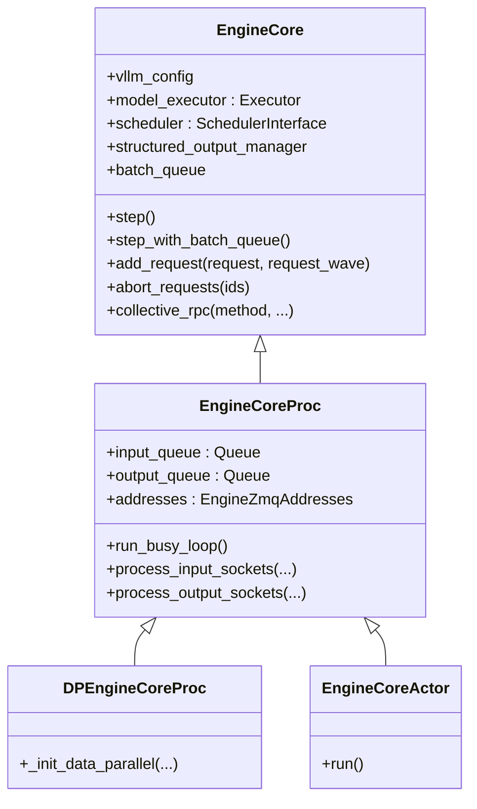

# `EngineCore` (and `EngineCoreProc`, `DPEngineCoreProc`, `EngineCoreActor`)

## Summary
`EngineCore` 是 vLLM v1 的"引擎内循环"——拥有 scheduler、executor、KV cache 配置，提供 `step()` / `add_request()` / `abort_requests()` 等 API（[core.py:89-227](d:\design\vllm\vllm\v1\engine\core.py)）。`EngineCoreProc` 在外面再套一层，把 `EngineCore` 跑在独立进程，用 ZMQ socket + 后台 IO 线程与前端通信（[core.py:802-915](d:\design\vllm\vllm\v1\engine\core.py)）。`DPEngineCoreProc` 是 DP 多 engine 版本，`EngineCoreActor` 是 Ray actor 版本。

## Sources
- 全文：[d:\design\vllm\vllm\v1\engine\core.py](d:\design\vllm\vllm\v1\engine\core.py)（2072 行）

## 类层次



## EngineCore 基类（[core.py:89](d:\design\vllm\vllm\v1\engine\core.py)）

### 构造（[core.py:92-228](d:\design\vllm\vllm\v1\engine\core.py)）

构造顺序（按代码出现顺序）：

1. 加载 plugins（[core.py:101-103](d:\design\vllm\vllm\v1\engine\core.py)）
2. 创建 `model_executor = executor_class(vllm_config)` ([core.py:116](d:\design\vllm\vllm\v1\engine\core.py))
3. 注册 executor 失败回调（[core.py:117-118](d:\design\vllm\vllm\v1\engine\core.py)）
4. EEP scale-up before KV init（[core.py:122-123](d:\design\vllm\vllm\v1\engine\core.py)）
5. **memory profile + KV cache 初始化**：`_initialize_kv_caches(vllm_config)`（[core.py:126](d:\design\vllm\vllm\v1\engine\core.py)，详见下文）
6. 创建 `structured_output_manager`（[core.py:127](d:\design\vllm\vllm\v1\engine\core.py)）
7. 创建 `scheduler`（类由 `vllm_config.scheduler_config.get_scheduler_cls()` 决定，[core.py:130, 145-152](d:\design\vllm\vllm\v1\engine\core.py)）
8. KV connector handshake：把每个 worker 的 transfer metadata 收回并 set 给 connector（[core.py:165-181](d:\design\vllm\vllm\v1\engine\core.py)）— **这是 PD 分离的入口**
9. 创建 PP batch queue：`batch_queue_size = self.model_executor.max_concurrent_batches`，>1 时建 deque（[core.py:187-193](d:\design\vllm\vllm\v1\engine\core.py)）
10. 决定 `step_fn`：默认 `self.step`，PP 时切到 `self.step_with_batch_queue`（[core.py:212-214](d:\design\vllm\vllm\v1\engine\core.py)）
11. `freeze_gc_heap()` + `enable_envs_cache()`（[core.py:223-228](d:\design\vllm\vllm\v1\engine\core.py)）

### `_initialize_kv_caches` （[core.py:231-313](d:\design\vllm\vllm\v1\engine\core.py)）

- `kv_cache_specs = self.model_executor.get_kv_cache_specs()` ([core.py:235](d:\design\vllm\vllm\v1\engine\core.py))
- `available_gpu_memory = self.model_executor.determine_available_memory()` ([core.py:249](d:\design\vllm\vllm\v1\engine\core.py))
- 计算 `kv_cache_configs` ([core.py:260-262](d:\design\vllm\vllm\v1\engine\core.py))
- 通过 `collective_rpc("update_max_model_len", ...)` 把 auto-fit 后的 `max_model_len` 同步到 worker（[core.py:264-269](d:\design\vllm\vllm\v1\engine\core.py)）
- `self.model_executor.initialize_from_config(kv_cache_configs)` 触发 worker 创建 KV cache + warmup ([core.py:282](d:\design\vllm\vllm\v1\engine\core.py))

### `step` （[core.py:404-433](d:\design\vllm\vllm\v1\engine\core.py)）

普通同步步骤：

1. `if not self.scheduler.has_requests(): return {}, False` ([core.py:413-414](d:\design\vllm\vllm\v1\engine\core.py))
2. `scheduler_output = self.scheduler.schedule()` ([core.py:415](d:\design\vllm\vllm\v1\engine\core.py))
3. `future = self.model_executor.execute_model(scheduler_output, non_block=True)` — **non-block + Future** ([core.py:416](d:\design\vllm\vllm\v1\engine\core.py))
4. `grammar_output = self.scheduler.get_grammar_bitmask(scheduler_output)` ([core.py:417](d:\design\vllm\vllm\v1\engine\core.py))
5. `model_output = future.result()` 阻塞等执行完 ([core.py:422](d:\design\vllm\vllm\v1\engine\core.py))
6. 若执行返回 None（v1 的 prepare-only 阶段），再 `self.model_executor.sample_tokens(grammar_output)` ([core.py:423-424](d:\design\vllm\vllm\v1\engine\core.py))
7. `_process_aborts_queue()` 处理 model 执行期间到达的 abort ([core.py:428](d:\design\vllm\vllm\v1\engine\core.py))
8. `engine_core_outputs = self.scheduler.update_from_output(scheduler_output, model_output)` ([core.py:429-431](d:\design\vllm\vllm\v1\engine\core.py))

### `step_with_batch_queue` （[core.py:445-561](d:\design\vllm\vllm\v1\engine\core.py)）

PP 流水线版本。要点：

- 当 `batch_queue` 未满时，先尝试 schedule 新 batch 并 enqueue future，立刻返回（不等结果）— [core.py:472-509](d:\design\vllm\vllm\v1\engine\core.py)
- 队列满或没新请求时，从队尾 `pop` 一个 future 阻塞等结果 — [core.py:518-528](d:\design\vllm\vllm\v1\engine\core.py)
- structured output + spec decode 时支持 deferred sampling — [core.py:485-497, 540-559](d:\design\vllm\vllm\v1\engine\core.py)

### 其他 API

| 方法 | 行号 | 说明 |
|---|---|---|
| `get_supported_tasks()` | [314](d:\design\vllm\vllm\v1\engine\core.py) | 返回 executor 支持的 task |
| `add_request(request, request_wave)` | [317](d:\design\vllm\vllm\v1\engine\core.py) | 加入 scheduler |
| `abort_requests(ids)` | [350](d:\design\vllm\vllm\v1\engine\core.py) | 中止 |
| `post_step(model_executed)` | [435-443](d:\design\vllm\vllm\v1\engine\core.py) | 取 draft token（spec decode 非 async 模式） |
| `shutdown()` | [573](d:\design\vllm\vllm\v1\engine\core.py) | 关 executor + 销毁 distributed group |
| `profile / reset_mm_cache / reset_prefix_cache / reset_encoder_cache` | [580-624](d:\design\vllm\vllm\v1\engine\core.py) | 运维 |
| `pause_scheduler / resume_scheduler / is_scheduler_paused` | [630-667](d:\design\vllm\vllm\v1\engine\core.py) | 暂停调度 |
| `sleep / wake_up / is_sleeping` | [669-725](d:\design\vllm\vllm\v1\engine\core.py) | 内存释放 |
| `add_lora / remove_lora / list_loras / pin_lora` | [730-741](d:\design\vllm\vllm\v1\engine\core.py) | LoRA |
| `collective_rpc(...)` | [752](d:\design\vllm\vllm\v1\engine\core.py) | 转发到 executor |
| `preprocess_add_request(request)` | [761](d:\design\vllm\vllm\v1\engine\core.py) | 把 `EngineCoreRequest` 转 `Request` |

## EngineCoreProc（[core.py:802-1609](d:\design\vllm\vllm\v1\engine\core.py)）

### 关键属性

- `input_queue: queue.Queue[(EngineCoreRequestType, Any)]` — 来自客户端的请求 ([core.py:821](d:\design\vllm\vllm\v1\engine\core.py))
- `output_queue: queue.Queue[(int, EngineCoreOutputs) | bytes]` — 给客户端的输出 ([core.py:822](d:\design\vllm\vllm\v1\engine\core.py))
- `addresses: EngineZmqAddresses` — handshake 时拿到的 ZMQ 地址簿 ([core.py:806, 863](d:\design\vllm\vllm\v1\engine\core.py))
- `tensor_ipc_receiver: TensorIpcReceiver | None` — 多模态 tensor 共享内存接收器 ([core.py:833-836](d:\design\vllm\vllm\v1\engine\core.py))
- `engines_running: bool` ([core.py:829](d:\design\vllm\vllm\v1\engine\core.py))
- `shutdown_state: EngineShutdownState` ([core.py:830, 796-800](d:\design\vllm\vllm\v1\engine\core.py))

### 构造序列（[core.py:809-915](d:\design\vllm\vllm\v1\engine\core.py)）

1. 创建 `input_queue` / `output_queue` ([core.py:821-822](d:\design\vllm\vllm\v1\engine\core.py))
2. `executor_fail_callback` 把失败转成 `EXECUTOR_FAILED` 入 input_queue ([core.py:823-825](d:\design\vllm\vllm\v1\engine\core.py))
3. **Handshake**：`_perform_handshakes(...)` 与前端协商 ZMQ 地址簿 ([core.py:838-844](d:\design\vllm\vllm\v1\engine\core.py))
4. `_init_data_parallel(vllm_config)` ([core.py:870](d:\design\vllm\vllm\v1\engine\core.py))
5. `super().__init__(...)` 启动基类 EngineCore（创建 executor、scheduler 等） ([core.py:872-878](d:\design\vllm\vllm\v1\engine\core.py))
6. **启动 input_thread**：`process_input_sockets` ([core.py:886-896](d:\design\vllm\vllm\v1\engine\core.py))
7. **启动 output_thread**：`process_output_sockets` ([core.py:898-907](d:\design\vllm\vllm\v1\engine\core.py))
8. 等 DP coordinator READY ([core.py:909-915](d:\design\vllm\vllm\v1\engine\core.py))

### `run_busy_loop` （[core.py:1160-1168](d:\design\vllm\vllm\v1\engine\core.py)）

```python
while self._handle_shutdown():
    self._process_input_queue()
    self._process_engine_step()
raise SystemExit
```

- `_process_input_queue` ([core.py:1170-1199](d:\design\vllm\vllm\v1\engine\core.py))：从 `input_queue` 取请求 → 分派到 `_handle_client_request`。**会阻塞**直到有 work 或 input 到来。
- `_process_engine_step` ([core.py:1201-1219](d:\design\vllm\vllm\v1\engine\core.py))：调 `self.step_fn()`（即 `step` 或 `step_with_batch_queue`）→ 把输出 put 到 `output_queue`。**额外细节**：当无 model 执行但有 waiting requests（如 NIXL handshake）时 `time.sleep(0.001)` 让出 GIL（[core.py:1216-1217](d:\design\vllm\vllm\v1\engine\core.py)）。

### `_handle_client_request` （[core.py:1262-1295](d:\design\vllm\vllm\v1\engine\core.py)）

按 `EngineCoreRequestType` 分派：

| Type | 动作 |
|---|---|
| `WAKEUP` | no-op return ([core.py:1267-1268](d:\design\vllm\vllm\v1\engine\core.py)) |
| `ADD` | `add_request(req, request_wave)` ([core.py:1269-1273](d:\design\vllm\vllm\v1\engine\core.py)) |
| `ABORT` | `abort_requests(ids)` ([core.py:1274-1275](d:\design\vllm\vllm\v1\engine\core.py)) |
| `UTILITY` | 反射调用 self 上的方法（用 msgspec 转参，支持 Future） ([core.py:1276-1289](d:\design\vllm\vllm\v1\engine\core.py)) |
| `EXECUTOR_FAILED` | 抛 `RuntimeError("Executor failed.")` ([core.py:1290-1291](d:\design\vllm\vllm\v1\engine\core.py)) |

### `process_input_sockets` IO 线程（[core.py:1368-1460](d:\design\vllm\vllm\v1\engine\core.py)）

- 在所有 `input_addresses` 上 `make_zmq_socket(..., zmq.DEALER, ...)` ([core.py:1383-1391](d:\design\vllm\vllm\v1\engine\core.py))
- DP 协调 socket：`zmq.XSUB`（订阅模式） ([core.py:1395-1405](d:\design\vllm\vllm\v1\engine\core.py))
- 启动时给每个前端 send `EngineCoreReadyResponse` ([core.py:1409-1419](d:\design\vllm\vllm\v1\engine\core.py))
- 注册到 `zmq.Poller`，多路复用 ([core.py:1408, 1420, 1425](d:\design\vllm\vllm\v1\engine\core.py))
- 收到消息后用 msgspec 解码 → put 入 `input_queue` ([core.py:1429-1460](d:\design\vllm\vllm\v1\engine\core.py))
- **abort 走双路**：abort 同时入 `aborts_queue`（让 `step` 中能立即处理）和 `input_queue`（保证顺序）([core.py:1452-1457](d:\design\vllm\vllm\v1\engine\core.py))

### `process_output_sockets` IO 线程（[core.py:1462-1527](d:\design\vllm\vllm\v1\engine\core.py)）

- `zmq.PUSH` socket，每个客户端一个 ([core.py:1479-1484](d:\design\vllm\vllm\v1\engine\core.py))
- `linger=4000` 确保 ENGINE_CORE_DEAD 消息能发出 ([core.py:1481, 1488](d:\design\vllm\vllm\v1\engine\core.py))
- 从 `output_queue.get()` 阻塞拿输出 ([core.py:1497](d:\design\vllm\vllm\v1\engine\core.py))
- ENGINE_CORE_DEAD 时 broadcast 给所有 socket 后 break ([core.py:1498-1501](d:\design\vllm\vllm\v1\engine\core.py))
- **零拷贝优化**：`encode_into(outputs, buffer)` 复用 buffer + `send_multipart(copy=False, track=True)` ([core.py:1517-1527](d:\design\vllm\vllm\v1\engine\core.py))

### 静态入口 `run_engine_core` （[core.py:1060-1144](d:\design\vllm\vllm\v1\engine\core.py)）

被 `EngineCoreClient` 用 `multiprocessing.Process` 启动，是子进程的入口函数。

## DPEngineCoreProc（[core.py:1610-1905](d:\design\vllm\vllm\v1\engine\core.py)）

DP（Data Parallel）场景，每个 DP rank 一个 EngineCore。新增：

- `_init_data_parallel` 实际配置 ([core.py:1651](d:\design\vllm\vllm\v1\engine\core.py))
- `add_request` 维护 `request_wave`（避免 wave 跨 rank 不一致） ([core.py:1671](d:\design\vllm\vllm\v1\engine\core.py))
- `_has_global_unfinished_reqs` 跨 rank all-reduce ([core.py:1783](d:\design\vllm\vllm\v1\engine\core.py))
- **弹性 EP**：`reinitialize_distributed`、`_eep_send_engine_core_notification`、`eep_handle_engine_core_notification`、`_eep_scale_up_before_kv_init`（[core.py:1791-1905](d:\design\vllm\vllm\v1\engine\core.py)）

## EngineCoreActor（[core.py:1907-2071](d:\design\vllm\vllm\v1\engine\core.py)）

`EngineCoreActorMixin` + 两个具体 Actor：

- `EngineCoreActor` = `Mixin` + `EngineCoreProc`（[core.py:2043](d:\design\vllm\vllm\v1\engine\core.py)）
- `DPMoEEngineCoreActor` = `Mixin` + `DPEngineCoreProc`（[core.py:2020](d:\design\vllm\vllm\v1\engine\core.py)）

Mixin 关键点：

- `_set_visible_devices` / `_set_cuda_visible_devices`（[core.py:1949-1977](d:\design\vllm\vllm\v1\engine\core.py)）
- Ray actor 包装的 `run()`（[core.py:2004](d:\design\vllm\vllm\v1\engine\core.py)）

## Notes / Caveats
> [!todo] VERIFY: `EngineCoreClient` 详细 API（`core_client.py` 未细读）。
> [!todo] VERIFY: `_handle_shutdown` 的精确状态机（[core.py:1226-1260](d:\design\vllm\vllm\v1\engine\core.py)）。
> [!todo] VERIFY: structured output + spec decode 的 deferred sampling 边界条件 ([core.py:485-497](d:\design\vllm\vllm\v1\engine\core.py))。

## See also
- [modules/engine.md](../modules/engine.md)
- [entities/MultiprocExecutor.md](MultiprocExecutor.md)
- [topics/request-lifecycle.md](../topics/request-lifecycle.md)
- [topics/multiproc-ipc.md](../topics/multiproc-ipc.md)
