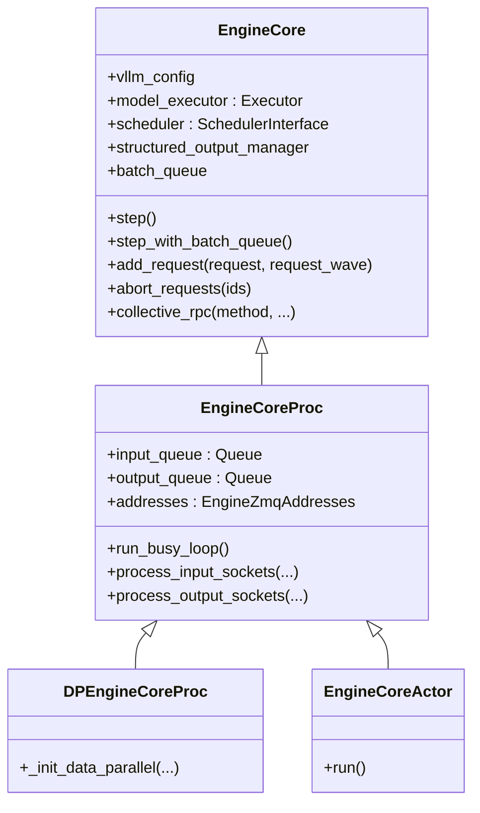

# `EngineCore` (and `EngineCoreProc`, `DPEngineCoreProc`, `EngineCoreActor`)

## Summary
`EngineCore` 是 vLLM v1 的"引擎内循环"——拥有 scheduler、executor、KV cache 配置，提供 `step()` / `add_request()` / `abort_requests()` 等 API（[core.py:104-251](d:\design\vllm\vllm\v1\engine\core.py)）。`EngineCoreProc` 在外面再套一层，把 `EngineCore` 跑在独立进程，用 ZMQ socket + 后台 IO 线程与前端通信（[core.py:1007-1127](d:\design\vllm\vllm\v1\engine\core.py)）。`DPEngineCoreProc` 是 DP 多 engine 版本，`EngineCoreActor` 是 Ray actor 版本。

## Sources
- 全文：[d:\design\vllm\vllm\v1\engine\core.py](d:\design\vllm\vllm\v1\engine\core.py)（2536 行，增量前 2072 行）

## 类层次



## EngineCore 基类（[core.py:104](d:\design\vllm\vllm\v1\engine\core.py)）

### 构造（[core.py:107-251](d:\design\vllm\vllm\v1\engine\core.py)）

构造顺序（按代码出现顺序）：

1. 加载 plugins（[core.py:115-118](d:\design\vllm\vllm\v1\engine\core.py)）
2. 创建 `model_executor = executor_class(vllm_config)` ([core.py:133](d:\design\vllm\vllm\v1\engine\core.py))
3. 注册 executor 失败回调（[core.py:135-136](d:\design\vllm\vllm\v1\engine\core.py)）
4. EEP scale-up before KV init（[core.py:140-141](d:\design\vllm\vllm\v1\engine\core.py)）
5. **memory profile + KV cache 初始化**：`_initialize_kv_caches(vllm_config)`（[core.py:144](d:\design\vllm\vllm\v1\engine\core.py)，详见下文）
6. 创建 `structured_output_manager`（[core.py:145](d:\design\vllm\vllm\v1\engine\core.py)）
7. 创建 `scheduler`（类由 `vllm_config.scheduler_config.get_scheduler_cls()` 决定，[core.py:148, 161-169](d:\design\vllm\vllm\v1\engine\core.py)；本期新增 `resolve_kv_cache_block_sizes` 拆出 `scheduler_block_size` / `hash_block_size` 两个 block size，[core.py:157-159](d:\design\vllm\vllm\v1\engine\core.py)）
8. KV connector handshake：把每个 worker 的 transfer metadata 收回并 set 给 connector（[core.py:187-203](d:\design\vllm\vllm\v1\engine\core.py)）— **这是 PD 分离的入口**；本期改为 **PP-aware**：worker dict 以 `(pp_rank, tp_rank)` 为 key 合并后调 `set_xfer_handshake_metadata_pp_aware`（[core.py:196-203](d:\design\vllm\vllm\v1\engine\core.py)）
9. 创建 PP batch queue：~~`batch_queue_size = self.model_executor.max_concurrent_batches`~~ **RESOLVED 2026-08-18**：来源已迁移为 `vllm_config.max_concurrent_batches`（[core.py:209](d:\design\vllm\vllm\v1\engine\core.py)，上游 commit `cab5c9a2a9` "Move max_concurrent_batches to VllmConfig"）；>1 时建 deque（[core.py:209-215](d:\design\vllm\vllm\v1\engine\core.py)）
10. 决定 `step_fn`：默认 `self.step`，PP 时切到 `self.step_with_batch_queue`（[core.py:234-236](d:\design\vllm\vllm\v1\engine\core.py)）
11. `freeze_gc_heap()` + `enable_envs_cache()`（[core.py:243-250](d:\design\vllm\vllm\v1\engine\core.py)）

### `_initialize_kv_caches` （[core.py:253-358](d:\design\vllm\vllm\v1\engine\core.py)）

- `kv_cache_specs = self.model_executor.get_kv_cache_specs()` ([core.py:260](d:\design\vllm\vllm\v1\engine\core.py))；本期入口先跑 `register_all_kvcache_specs(vllm_config)`（可插拔 KVCacheSpec，[core.py:257](d:\design\vllm\vllm\v1\engine\core.py)）
- 新增 non-causal attention 检测：spec 带 `non_causal=True` 时禁用 chunked prefill 与 prefix caching（[core.py:268-282](d:\design\vllm\vllm\v1\engine\core.py)）
- `available_gpu_memory = self.model_executor.determine_available_memory()` ([core.py:296](d:\design\vllm\vllm\v1\engine\core.py))
- 计算 `kv_cache_configs` ([core.py:307-309](d:\design\vllm\vllm\v1\engine\core.py))
- 通过 `collective_rpc("update_max_model_len", ...)` 把 auto-fit 后的 `max_model_len` 同步到 worker（[core.py:314-316](d:\design\vllm\vllm\v1\engine\core.py)）
- 新增：block-size resolve 后回写 `cache_config.block_size` 并 `update_kv_cache_capacity`（[core.py:318-327](d:\design\vllm\vllm\v1\engine\core.py)）
- `self.model_executor.initialize_from_config(kv_cache_configs)` 触发 worker 创建 KV cache + warmup ([core.py:329-331](d:\design\vllm\vllm\v1\engine\core.py))

### `step` （[core.py:583-613](d:\design\vllm\vllm\v1\engine\core.py)）

普通同步步骤：

1. `if not self.scheduler.has_requests(): return {}, False` ([core.py:592-593](d:\design\vllm\vllm\v1\engine\core.py))
2. `scheduler_output = self.scheduler.schedule(self._should_throttle_prefills())` ([core.py:594](d:\design\vllm\vllm\v1\engine\core.py))——本期 `schedule()` 新增 prefill 节流参数，基类恒 False、DP 子类按 prefill cadence 覆盖（[core.py:578-581, 2143-2151](d:\design\vllm\vllm\v1\engine\core.py)）
3. `future = self.model_executor.execute_model(scheduler_output, non_block=True)` — **non-block + Future** ([core.py:595](d:\design\vllm\vllm\v1\engine\core.py))
4. `grammar_output = self.scheduler.get_grammar_bitmask(scheduler_output)` ([core.py:596](d:\design\vllm\vllm\v1\engine\core.py))
5. `model_output = future.result()` 阻塞等执行完 ([core.py:601](d:\design\vllm\vllm\v1\engine\core.py))；本期包进 `capture_iteration_details` + `log_error_detail` 两个 context manager（[core.py:597-600](d:\design\vllm\vllm\v1\engine\core.py)）
6. 若执行返回 None（v1 的 prepare-only 阶段），再 `self.model_executor.sample_tokens(grammar_output)` ([core.py:602-603](d:\design\vllm\vllm\v1\engine\core.py))
7. `_process_aborts_queue()` 处理 model 执行期间到达的 abort ([core.py:607](d:\design\vllm\vllm\v1\engine\core.py))
8. `engine_core_outputs = self.scheduler.update_from_output(scheduler_output, model_output)` ([core.py:608-610](d:\design\vllm\vllm\v1\engine\core.py))；随后 `_attach_iteration_details` 把迭代明细贴到 outputs 上交由前端打日志（[core.py:611](d:\design\vllm\vllm\v1\engine\core.py)）

### `step_with_batch_queue` （[core.py:624-738](d:\design\vllm\vllm\v1\engine\core.py)）

PP 流水线版本。要点：

- 当 `batch_queue` 未满时，先尝试 schedule 新 batch 并 enqueue future，立刻返回（不等结果）— [core.py:644-686](d:\design\vllm\vllm\v1\engine\core.py)；本期队列元素从二元组扩为三元组 `(future, scheduler_output, exec_future)`，保留 `execute_model` 的原始 future 用于错误回溯（[core.py:680, 695-705](d:\design\vllm\vllm\v1\engine\core.py)）
- 队列满或没新请求时，从队尾 `pop` 一个 future 阻塞等结果 — [core.py:694-705](d:\design\vllm\vllm\v1\engine\core.py)
- structured output + spec decode 时支持 deferred sampling — [core.py:664-676, 715-736](d:\design\vllm\vllm\v1\engine\core.py)；deferred 分支本期新增 draft token 校验（`update_draft_token_ids_in_output`，[core.py:721-729](d:\design\vllm\vllm\v1\engine\core.py)）

### 其他 API

| 方法 | 行号 | 说明 |
|---|---|---|
| `get_supported_tasks()` | [360](d:\design\vllm\vllm\v1\engine\core.py) | 返回 executor 支持的 task（本期新增 `_log_pooler_config` 联动，[365](d:\design\vllm\vllm\v1\engine\core.py)） |
| `get_kv_cache_group_metadata()` | [419-436](d:\design\vllm\vllm\v1\engine\core.py) | **本期新增**：scheduler KV cache group 元数据（供 metrics / KV events） |
| `add_request(request, request_wave)` | [438](d:\design\vllm\vllm\v1\engine\core.py) | 加入 scheduler；本期新增 `abort_immediately` 立即中止路径（NIXL pre-admission rejection，[479-482](d:\design\vllm\vllm\v1\engine\core.py)） |
| `abort_requests(ids)` | [484](d:\design\vllm\vllm\v1\engine\core.py) | 中止 |
| `post_step(model_executed)` | [615-622](d:\design\vllm\vllm\v1\engine\core.py) | 取 draft token（spec decode 非 async 模式；本期条件扩为 `check_for_draft_tokens` = spec decode 或 diffusion 模型，[170-173](d:\design\vllm\vllm\v1\engine\core.py)） |
| `shutdown()` | [750](d:\design\vllm\vllm\v1\engine\core.py) | 关 executor + scheduler；本期新增 `gc.unfreeze()` 防止进程内引擎泄漏 GPU 内存（[758-762](d:\design\vllm\vllm\v1\engine\core.py)） |
| `profile / reset_mm_cache / reset_prefix_cache / reset_encoder_cache / _reset_caches` | [768-826](d:\design\vllm\vllm\v1\engine\core.py) | 运维；`reset_prefix_cache` 本期支持 reset_cache 级联到 KV connector |
| `pause_scheduler / resume_scheduler / is_scheduler_paused` | [828-865](d:\design\vllm\vllm\v1\engine\core.py) | 暂停调度；本期签名改为 `pause_scheduler(mode: PauseMode = "abort", clear_cache=True) -> Future \| None`，支持 `abort` / `wait` / `keep` 三种模式（两阶段 pause 防死锁，[828-857](d:\design\vllm\vllm\v1\engine\core.py)） |
| `sleep / wake_up / is_sleeping` | [867-925](d:\design\vllm\vllm\v1\engine\core.py) | 内存释放；本期 `sleep` 新增 level 0（仅暂停调度）与 `mode` 参数，可返回 Future；`wake_up` 支持 partial wake（executor 仍 sleeping 时不恢复调度，[918-921](d:\design\vllm\vllm\v1\engine\core.py)） |
| `add_lora / remove_lora / list_loras / pin_lora` | [930-940](d:\design\vllm\vllm\v1\engine\core.py) | LoRA |
| `collective_rpc(...)` | [952](d:\design\vllm\vllm\v1\engine\core.py) | 转发到 executor |
| `set_weight_version / get_weight_version` | [961-966](d:\design\vllm\vllm\v1\engine\core.py) | **本期新增**：RL rollout 权重版本标签 |
| `preprocess_add_request(request)` | [968](d:\design\vllm\vllm\v1\engine\core.py) | 把 `EngineCoreRequest` 转 `Request`（返回 `tuple[Request, int]`） |

## EngineCoreProc（[core.py:1007-1968](d:\design\vllm\vllm\v1\engine\core.py)）

### 关键属性

- `input_queue: queue.Queue[(EngineCoreRequestType, Any)]` — 来自客户端的请求 ([core.py:1026](d:\design\vllm\vllm\v1\engine\core.py))
- `output_queue: queue.Queue[(int, EngineCoreOutputs) | bytes]` — 给客户端的输出 ([core.py:1027](d:\design\vllm\vllm\v1\engine\core.py))
- `addresses: EngineZmqAddresses` — handshake 时拿到的 ZMQ 地址簿 ([core.py:1011, 1069](d:\design\vllm\vllm\v1\engine\core.py))
- `tensor_ipc_receiver: TensorIpcReceiver | None` — 多模态 tensor 共享内存接收器 ([core.py:1038-1041](d:\design\vllm\vllm\v1\engine\core.py))
- `engines_running: bool` ([core.py:1034](d:\design\vllm\vllm\v1\engine\core.py))
- `shutdown_state: EngineShutdownState` ([core.py:1035, 1001-1004](d:\design\vllm\vllm\v1\engine\core.py))
- `ft_sentinel: EngineCoreSentinel` — **本期新增**：fault tolerance 哨兵（`enable_fault_tolerance` 时创建，[core.py:1082-1089](d:\design\vllm\vllm\v1\engine\core.py)）

### 构造序列（[core.py:1014-1127](d:\design\vllm\vllm\v1\engine\core.py)）

1. 创建 `input_queue` / `output_queue` ([core.py:1026-1027](d:\design\vllm\vllm\v1\engine\core.py))
2. `executor_fail_callback` 把失败转成 `EXECUTOR_FAILED` 入 input_queue ([core.py:1028-1030](d:\design\vllm\vllm\v1\engine\core.py))
3. **Handshake**：`_perform_handshakes(...)` 与前端协商 ZMQ 地址簿 ([core.py:1043-1049](d:\design\vllm\vllm\v1\engine\core.py))
4. `_init_data_parallel(vllm_config)` ([core.py:1071](d:\design\vllm\vllm\v1\engine\core.py))
5. `super().__init__(...)` 启动基类 EngineCore（创建 executor、scheduler 等） ([core.py:1073-1079](d:\design\vllm\vllm\v1\engine\core.py))
6. fault tolerance 初始化（如启用，[core.py:1081-1089](d:\design\vllm\vllm\v1\engine\core.py)）
7. **启动 input_thread**：`process_input_sockets` ([core.py:1096-1107](d:\design\vllm\vllm\v1\engine\core.py))
8. **启动 output_thread**：`process_output_sockets` ([core.py:1109-1118](d:\design\vllm\vllm\v1\engine\core.py))
9. 等 DP coordinator READY ([core.py:1120-1126](d:\design\vllm\vllm\v1\engine\core.py))

### `run_busy_loop` （[core.py:1374-1386](d:\design\vllm\vllm\v1\engine\core.py)）

```python
while self._handle_shutdown():
    self._process_input_queue()
    self._maybe_publish_request_counts()
    self._process_engine_step()
    self._maybe_publish_request_counts()
raise SystemExit
```

本期变化：加 `@fault_tolerant_wrapper` 装饰器（[core.py:1374](d:\design\vllm\vllm\v1\engine\core.py)）；步前/步后各发布一次 request counts 给 DP coordinator 保证新鲜度（`_maybe_publish_request_counts`，[core.py:1388-1399](d:\design\vllm\vllm\v1\engine\core.py)，原逻辑在 DP 子类，现上提到 `EngineCoreProc` 由 `publish_dp_lb_stats` 开关）。

- `_process_input_queue` ([core.py:1401-1430](d:\design\vllm\vllm\v1\engine\core.py))：从 `input_queue` 取请求 → 分派到 `_handle_client_request`。**会阻塞**直到有 work 或 input 到来（阻塞与否由 `process_input_queue_block` 控制，[core.py:1415](d:\design\vllm\vllm\v1\engine\core.py)）；空转时清空 `aborts_queue` 并通知 idle 回调（[core.py:1405-1411](d:\design\vllm\vllm\v1\engine\core.py)）。
- `_process_engine_step` ([core.py:1432-1449](d:\design\vllm\vllm\v1\engine\core.py))：调 `self.step_fn()`（即 `step` 或 `step_with_batch_queue`）→ 把输出 put 到 `output_queue`。**额外细节**：当无 model 执行但有 waiting requests（如 NIXL handshake、delayed KV connector frees）时 `time.sleep(0.001)` 让出 GIL（[core.py:1446-1447](d:\design\vllm\vllm\v1\engine\core.py)）。
- `_handle_shutdown` ([core.py:1456-1502](d:\design\vllm\vllm\v1\engine\core.py))：**本期实现了优雅 shutdown 状态机**——`REQUESTED` 时按 `vllm_config.shutdown_timeout` 分 abort（=0，立即中止所有请求并发 abort outputs）或 drain（>0，排空在途请求）两种模式，转入 `SHUTTING_DOWN`；无 work 后退出循环。

### `_handle_client_request` （[core.py:1504-1537](d:\design\vllm\vllm\v1\engine\core.py)）

按 `EngineCoreRequestType` 分派：

| Type | 动作 |
|---|---|
| `WAKEUP` | no-op return ([core.py:1509-1510](d:\design\vllm\vllm\v1\engine\core.py)) |
| `ADD` | `add_request(req, request_wave)`；shutdown 中先经 `_reject_add_in_shutdown` 拒绝并回 abort output ([core.py:1511-1515, 1539-1548](d:\design\vllm\vllm\v1\engine\core.py)) |
| `ABORT` | `abort_requests(ids)` ([core.py:1516-1517](d:\design\vllm\vllm\v1\engine\core.py)) |
| `UTILITY` | 反射调用 self 上的方法（用 msgspec 转参，支持 Future）；shutdown 中经 `_reject_utility_in_shutdown` 拒绝 ([core.py:1518-1531, 1550-1583](d:\design\vllm\vllm\v1\engine\core.py)) |
| `EXECUTOR_FAILED` | 抛 `RuntimeError("Executor failed.")` ([core.py:1532-1533](d:\design\vllm\vllm\v1\engine\core.py)) |

### `process_input_sockets` IO 线程（[core.py:1657-1758](d:\design\vllm\vllm\v1\engine\core.py)）

- 在所有 `input_addresses` 上 `make_zmq_socket(..., zmq.DEALER, ...)` ([core.py:1673-1680](d:\design\vllm\vllm\v1\engine\core.py))
- DP 协调 socket：`zmq.XSUB`（订阅模式） ([core.py:1681-1694](d:\design\vllm\vllm\v1\engine\core.py))
- 启动时给每个前端 send `EngineCoreReadyResponse` ([core.py:1698-1705](d:\design\vllm\vllm\v1\engine\core.py))
- 注册到 `zmq.Poller`，多路复用 ([core.py:1697, 1705, 1710, 1714-1715](d:\design\vllm\vllm\v1\engine\core.py))
- 收到消息后用 msgspec 解码 → put 入 `input_queue` ([core.py:1717-1758](d:\design\vllm\vllm\v1\engine\core.py))；本期新增两个 ADD 解码失败分支：多模态 P0/P1 cache drift 走 `_handle_mm_cache_miss` 回可重试信号（[core.py:1731-1735, 1829](d:\design\vllm\vllm\v1\engine\core.py)），一般预处理异常走 `_handle_request_preproc_error`（[core.py:1736-1738, 1880](d:\design\vllm\vllm\v1\engine\core.py)）；UTILITY 中 fault tolerance 命令直接在 IO 线程交给 `ft_sentinel.handle_command`（[core.py:1742-1746](d:\design\vllm\vllm\v1\engine\core.py)）
- **abort 走双路**：abort 同时入 `aborts_queue`（让 `step` 中能立即处理）和 `input_queue`（保证顺序）([core.py:1750-1755](d:\design\vllm\vllm\v1\engine\core.py))

### `process_output_sockets` IO 线程（[core.py:1760-1827](d:\design\vllm\vllm\v1\engine\core.py)）

- `zmq.PUSH` socket，每个客户端一个 ([core.py:1778-1783](d:\design\vllm\vllm\v1\engine\core.py))
- `linger=4000` 确保 ENGINE_CORE_DEAD 消息能发出 ([core.py:1780, 1787](d:\design\vllm\vllm\v1\engine\core.py))
- 从 `output_queue.get()` 阻塞拿输出 ([core.py:1796](d:\design\vllm\vllm\v1\engine\core.py))
- ENGINE_CORE_DEAD 时 broadcast 给所有 socket 后 break ([core.py:1797-1800](d:\design\vllm\vllm\v1\engine\core.py))
- **零拷贝优化**：`encode_into(outputs, buffer)` 复用 buffer + `send_multipart(copy=False, track=True)`；本期修复 buffer 生命周期——用 `zmq.MessageTracker` 的 `pending` deque 跟踪 zmq 仍在发送的 payload buffer，发送完成后才回收进 `reuse_buffers`（[core.py:1768-1773, 1812-1827](d:\design\vllm\vllm\v1\engine\core.py)，上游 commit `6453fc0b8c`）

### 静态入口 `run_engine_core` （[core.py:1270-1357](d:\design\vllm\vllm\v1\engine\core.py)）

被 `EngineCoreClient` 用 `multiprocessing.Process` 启动，是子进程的入口函数。本期两处重要变化：

- **非 MoE 的 DP rank 走独立 `EngineCoreProc`**：只有 `data_parallel and vllm_config.model_config.is_moe` 才实例化 `DPEngineCoreProc`；dense 模型 DP rank 调 `reconfigure_for_independent_dp_rank()` 后按 DP=1 独立引擎处理（[core.py:1306-1315](d:\design\vllm\vllm\v1\engine\core.py)，上游 commit `8cfa01cdd2` "Dense multinode DP rescope"）。
- SIGTERM/SIGINT handler 不再直接杀进程，而是置 `shutdown_state = REQUESTED` + `SignalCallback` 经 WAKEUP 唤醒 busy loop，进入上述优雅 shutdown 状态机（[core.py:1319-1337](d:\design\vllm\vllm\v1\engine\core.py)）。

## DPEngineCoreProc（[core.py:1969-2355](d:\design\vllm\vllm\v1\engine\core.py)）

DP（Data Parallel）场景，每个 DP rank 一个 EngineCore（**本期起仅 MoE 模型 DP 用本类**，见上文 `run_engine_core`）。新增/覆盖：

- `_init_data_parallel` 实际配置 ([core.py:2020](d:\design\vllm\vllm\v1\engine\core.py))
- `add_request` 维护 `request_wave`（避免 wave 跨 rank 不一致） ([core.py:2059](d:\design\vllm\vllm\v1\engine\core.py))
- `_has_global_unfinished_reqs` 跨 rank all-reduce ([core.py:2222](d:\design\vllm\vllm\v1\engine\core.py))
- **本期新增** `barrier()`（跨 rank 同步 utility，[core.py:2100](d:\design\vllm\vllm\v1\engine\core.py)）、`_should_throttle_prefills`（DP prefill cadence 均衡，[core.py:2143-2151](d:\design\vllm\vllm\v1\engine\core.py)）、`_pause_complete` / `shutdown` / `resume_scheduler` 覆盖（[core.py:2036-2099](d:\design\vllm\vllm\v1\engine\core.py)）
- **弹性 EP**：`reinitialize_distributed`（[core.py:2241](d:\design\vllm\vllm\v1\engine\core.py)）、`commit_prepared_elastic_ep`（**本期新增**，异步准备两段式，[core.py:2295](d:\design\vllm\vllm\v1\engine\core.py)）、`_eep_send_engine_core_notification`（[core.py:2303](d:\design\vllm\vllm\v1\engine\core.py)）、`_eep_scale_up_before_kv_init`（[core.py:2336](d:\design\vllm\vllm\v1\engine\core.py)）
- ~~`eep_handle_engine_core_notification`~~ **RESOLVED 2026-08-18**：该方法已从 core.py 移除（旧 pin L1879）；通知处理迁到客户端侧 `DPLBAsyncMPClient.eep_process_engine_core_notification`（[core_client.py:1545](d:\design\vllm\vllm\v1\engine\core_client.py)，上游 commit `35efdf6b34` "Elastic EP Async preparation"）

## EngineCoreActor（[core.py:2356-2536](d:\design\vllm\vllm\v1\engine\core.py)）

`EngineCoreActorMixin` + 两个具体 Actor：

- `EngineCoreActor` = `Mixin` + `EngineCoreProc`（[core.py:2511](d:\design\vllm\vllm\v1\engine\core.py)，非 MoE / 非 DP；构造时同样 `reconfigure_for_independent_dp_rank`，[core.py:2524](d:\design\vllm\vllm\v1\engine\core.py)）
- `DPMoEEngineCoreActor` = `Mixin` + `DPEngineCoreProc`（[core.py:2488](d:\design\vllm\vllm\v1\engine\core.py)）

Mixin 关键点：

- `_set_visible_devices` / `_set_assigned_physical_gpu_ids`（[core.py:2410-2444](d:\design\vllm\vllm\v1\engine\core.py)）；~~`_set_cuda_visible_devices`~~ **RESOLVED 2026-08-18**：该方法已删除——vLLM 不再内部设置 `CUDA_VISIBLE_DEVICES`，改为计算 `assigned_physical_gpu_ids` 写入 `parallel_config`（上游 commit `ebfbcfe46a`）
- **本期新增** `_set_nixl_side_channel_host`：actor 本地补 `VLLM_NIXL_SIDE_CHANNEL_HOST` 默认值（[core.py:2400-2408](d:\design\vllm\vllm\v1\engine\core.py)）
- Ray actor 包装的 `run()`（[core.py:2472](d:\design\vllm\vllm\v1\engine\core.py)）、`wait_for_init()`（[core.py:2462](d:\design\vllm\vllm\v1\engine\core.py)）

## Increment 2026-08-18 (vLLM 5f7fab88 → d29dc3ab)

本文件本期 +640/-175（46 commits），文件 2072 → 2536 行。类层次不变（`EngineCore` → `EngineCoreProc` → `DPEngineCoreProc` / `EngineCoreActorMixin`），全部行号锚点已按 HEAD 重校。除上文已 inline 标注的细节外，值得单列的新增功能块：

- **优雅 shutdown 状态机**：`EngineShutdownState`（RUNNING/REQUESTED/SHUTTING_DOWN，[core.py:1001-1004](d:\design\vllm\vllm\v1\engine\core.py)）+ `_handle_shutdown` 的 abort/drain 双模式（[core.py:1456-1502](d:\design\vllm\vllm\v1\engine\core.py)）+ shutdown 中拒收新请求（[core.py:1539-1564](d:\design\vllm\vllm\v1\engine\core.py)）+ `_send_finish/abort/error_outputs_to_client` 一组回执方法（[core.py:1938-1967](d:\design\vllm\vllm\v1\engine\core.py)）。
- **Fault tolerance 框架**（DP+EP external LB 场景，上游 commit `0b0bd2b5f6`）：`EngineCoreSentinel` 挂在 `EngineCoreProc.__init__`（[core.py:1082-1089](d:\design\vllm\vllm\v1\engine\core.py)），`run_busy_loop` 加 `@fault_tolerant_wrapper`（[core.py:1374, 2152](d:\design\vllm\vllm\v1\engine\core.py)），FT 命令在输入 IO 线程直接分派（[core.py:1742-1746](d:\design\vllm\vllm\v1\engine\core.py)）。
- **迭代日志前移**：`capture_iteration_details` / `_attach_iteration_details`（[core.py:509-577](d:\design\vllm\vllm\v1\engine\core.py)）把 iteration details 附到 `EngineCoreOutputs`，由前端负责打日志（上游 commit `5a65ba5f17`）；`log_error_detail` context manager 在执行失败时 dump 引擎状态（[core.py:492-506](d:\design\vllm\vllm\v1\engine\core.py)）。
- **两阶段 pause / level-0 sleep**：`pause_scheduler(mode, clear_cache)` 三模式 + `sleep(level=0)` 仅停调度（[core.py:828-903](d:\design\vllm\vllm\v1\engine\core.py)，上游 commit `0335316a9b`）。
- **DP 负载均衡强化**：request counts 每步前后发布（[core.py:1388-1399](d:\design\vllm\vllm\v1\engine\core.py)，commit `f60c6b33a5`）+ prefill cadence 节流（[core.py:2143-2151](d:\design\vllm\vllm\v1\engine\core.py)，commit `d8d95998dc`）+ dense DP rescope（commit `8cfa01cdd2`）。
- **多模态 cache drift 恢复**：`MultiModalCacheMissError` → `_handle_mm_cache_miss` 回 `mm_cache_miss_hashes` 让客户端重发（[core.py:1829-1863](d:\design\vllm\vllm\v1\engine\core.py)，commit `3962042304`）。
- **EC (encoder cache) connector**：构造期 `init_ec_output_aggregator`（[core.py:176-177](d:\design\vllm\vllm\v1\engine\core.py)）、`is_ec_consumer` 影响 `step_with_batch_queue` 的 model_executed 判定（[core.py:217-220, 657-658](d:\design\vllm\vllm\v1\engine\core.py)）、`add_request` 校验 `ec_transfer_params`（[core.py:469-476](d:\design\vllm\vllm\v1\engine\core.py)）。
- **RL 支撑**：`_weight_version` 字段与 `set_weight_version` / `get_weight_version`（[core.py:130, 961-966](d:\design\vllm\vllm\v1\engine\core.py)，commit `9069a57139`）。
- synthesis: 本页关注的 engine 层对 executor/worker 的接口（`execute_model(non_block=True)` / `sample_tokens` / Future 协议）在本期**未变**；新增的 `vllm/v1/worker/gpu/` 新一代 model runner 在 executor 之下，不改变 `EngineCore` 的调用面（对 worker 重构的影响见 executor/worker 相关页）。

## Notes / Caveats
> [!todo] VERIFY: `EngineCoreClient` 详细 API（`core_client.py` 未细读；另见 [EngineCoreClient.md](EngineCoreClient.md)）。
> ~~[!todo] VERIFY: `_handle_shutdown` 的精确状态机。~~ **RESOLVED 2026-08-18**：本期上游已实现完整状态机，见上文 `_handle_shutdown`（[core.py:1456-1502](d:\design\vllm\vllm\v1\engine\core.py)）。
> [!todo] VERIFY: structured output + spec decode 的 deferred sampling 边界条件 ([core.py:664-676, 715-736](d:\design\vllm\vllm\v1\engine\core.py))。
> [!todo] VERIFY: `EngineCoreSentinel` / `fault_tolerant_wrapper` 的内部实现（定义在 `vllm/v1/engine/utils.py`，本页仅覆盖 core.py 侧接线）。

## See also
- [modules/engine.md](../modules/engine.md)
- [entities/MultiprocExecutor.md](MultiprocExecutor.md)
- [topics/request-lifecycle.md](../topics/request-lifecycle.md)
- [topics/multiproc-ipc.md](../topics/multiproc-ipc.md)
