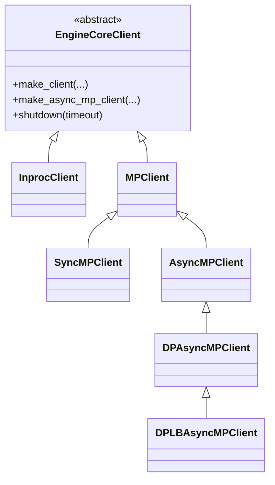

# `EngineCoreClient`（及 `InprocClient` / `MPClient` / `SyncMPClient` / `AsyncMPClient` / `DPAsyncMPClient` / `DPLBAsyncMPClient`）

## Summary

[`EngineCoreClient`](d:\design\vllm\vllm\v1\engine\core_client.py) 是 vLLM v1 前端与 [`EngineCore`](d:\design\vllm\vllm\v1\engine\core.py) / 子进程内 `EngineCoreProc` 之间的抽象边界：工厂 `make_client` / `make_async_mp_client` 在同进程、同步多进程（线程收包）与 asyncio 多进程（`asyncio.Task` 收包）之间选型。多进程路径下由 `MPClient` 建立 **ZMQ `ROUTER`（入）+ `PULL`（出）**，与 `EngineCoreProc` 侧的 **`DEALER` / `PUSH`** 配对；DP 场景下再叠加 coordinator 统计与负载均衡逻辑。

## Sources

- 主源全文：[d:\design\vllm\vllm\v1\engine\core_client.py](d:\design\vllm\vllm\v1\engine\core_client.py)（1874 行，增量前约 1696 行）
- ZMQ 地址与引擎拉起：[d:\design\vllm\vllm\v1\engine\utils.py](d:\design\vllm\vllm\v1\engine\utils.py)（如 `get_engine_zmq_addresses`、`launch_core_engines`）
- 引擎进程侧 socket 与 busy loop：[d:\design\vllm\vllm\v1\engine\core.py](d:\design\vllm\vllm\v1\engine\core.py)（如 `EngineCoreProc.process_input_sockets` / `process_output_sockets`）
- 聚合调用方：[d:\design\vllm\vllm\v1\engine\llm_engine.py](d:\design\vllm\vllm\v1\engine\llm_engine.py)、[d:\design\vllm\vllm\v1\engine\async_llm.py](d:\design\vllm\vllm\v1\engine\async_llm.py)

## 类层次（mermaid classDiagram）



说明：中间基类 `MPClient` 承载 ZMQ、就绪握手与引擎监控；用户常问的「四种子类」通常对应 `InprocClient`、`SyncMPClient`、`AsyncMPClient`、`DPLBAsyncMPClient`；**DP + 外部 LB** 时工厂返回 `DPAsyncMPClient` 而非 `DPLBAsyncMPClient`（见 `make_async_mp_client` [L133-L136](d:\design\vllm\vllm\v1\engine\core_client.py)）。源码中**无**名为 `RayDPClient` 的类；Ray 相关弹性 EP 通过 `CoreEngineActorManager`（[utils.py](d:\design\vllm\vllm\v1\engine\utils.py)）等在 `DPLBAsyncMPClient` 内使用（如 `prepare_elastic_ep` [L1628-L1649](d:\design\vllm\vllm\v1\engine\core_client.py)）。

## 工厂与选型

| 入口 | 条件 | 返回类型 | 锚点 |
|------|------|----------|------|
| `make_client` | `asyncio_mode and not multiprocess_mode` | （不支持） | [L98-L102](d:\design\vllm\vllm\v1\engine\core_client.py) |
| | `multiprocess_mode and asyncio_mode` | `make_async_mp_client` | [L104-L107](d:\design\vllm\vllm\v1\engine\core_client.py) |
| | `multiprocess_mode and not asyncio_mode` | `SyncMPClient` | [L109-L110](d:\design\vllm\vllm\v1\engine\core_client.py) |
| | 否则 | `InprocClient` | [L112](d:\design\vllm\vllm\v1\engine\core_client.py) |
| `make_async_mp_client` | `data_parallel_size > 1` 且 `data_parallel_external_lb` | `DPAsyncMPClient` | [L133-L136](d:\design\vllm\vllm\v1\engine\core_client.py) |
| | `data_parallel_size > 1` 且非 external LB | `DPLBAsyncMPClient` | [L137-L138](d:\design\vllm\vllm\v1\engine\core_client.py) |
| | 否则 | `AsyncMPClient` | [L139](d:\design\vllm\vllm\v1\engine\core_client.py) |

聚合方：[`LLMEngine`](d:\design\vllm\vllm\v1\engine\llm_engine.py) 调用 `EngineCoreClient.make_client`（[L105-L111](d:\design\vllm\vllm\v1\engine\llm_engine.py)）；[`AsyncLLM`](d:\design\vllm\vllm\v1\engine\async_llm.py) 调用 `EngineCoreClient.make_async_mp_client`（[L149-L156](d:\design\vllm\vllm\v1\engine\async_llm.py)）。

## 4（+1）子类对照表

| 子类 | 进程模型 | IPC（本 client） | sync/async | 适用场景 / 说明 | 关键方法（示例） |
|------|----------|------------------|------------|-----------------|------------------|
| `InprocClient` | 同进程 | 无 ZMQ；直接持 `EngineCore` | sync | 兼容 V0 风格 `add_request` + `step`（`get_output` 调 `step_fn` + `post_step`，[L319-L322](d:\design\vllm\vllm\v1\engine\core_client.py)） | `add_request`、`get_output`、`shutdown` |
| `SyncMPClient` | 子进程 `EngineCoreProc` + 本进程 | ZMQ：`ROUTER`→引擎 `DEALER`，`PULL`←引擎 `PUSH`（对端见 topic 页） | sync | `LLMEngine` 多进程 | `get_output`、`_send_input`、`call_utility` |
| `AsyncMPClient` | 同上 | 同上（`zmq.asyncio`） | **async I/O** | `AsyncLLM` 单 DP rank | `get_output_async`、`add_request_async`、`_send_input_message` |
| `DPAsyncMPClient` | 多引擎 DP + 外部 LB | 同上 + **`XSUB` 统计**、**`PAIR` first_req** | async | 每 DP rank 一 client；`get_core_engine_for_request` 默认单引擎（[L1430-L1431](d:\design\vllm\vllm\v1\engine\core_client.py)） | `add_request_async`、`_ensure_stats_update_task` |
| `DPLBAsyncMPClient` | 多引擎 DP + **内部** LB | 同上 + 负载状态 + abort 路由 | async | 单前端在本地多引擎间分票 | `get_core_engine_for_request`、`abort_requests_async`、`process_engine_outputs` |

`synthesis:` **Executor↔Worker 的 `MessageQueue` 共享内存**不在 `core_client.py` 内实现；见 [`MultiprocExecutor`](MultiprocExecutor.md) 与 [multiproc-ipc topic](../topics/multiproc-ipc.md)。

## hidden state（§9）：threads / asyncio tasks / queues / ZMQ sockets

### `InprocClient`

| 类别 | 列表 | 行号 |
|------|------|------|
| 无本类自管 ZMQ/线程 | 仅 `self.engine_core = EngineCore(...)` | [L316-L317](d:\design\vllm\vllm\v1\engine\core_client.py) |
| queue / asyncio | 无（并发由 `EngineCore` 内部决定） | — |

### `MPClient`（`SyncMPClient` / `AsyncMPClient` / DP 子类共用）

| 类别 | 列表 | 行号 |
|------|------|------|
| ZMQ `Context` | `sync_ctx`；async 模式下 `zmq.asyncio.Context(sync_ctx)` | [L527-L528](d:\design\vllm\vllm\v1\engine\core_client.py) |
| 套接字 | `input_socket`：`ROUTER` bind（本期新增 `router_handover=enable_elastic_ep`，允许 EEP 场景同 identity 重连，[L540-L543](d:\design\vllm\vllm\v1\engine\core_client.py)）；`output_socket`：`PULL`（外部注入地址 [L554-L563](d:\design\vllm\vllm\v1\engine\core_client.py) 或 `get_engine_zmq_addresses` [L588-L598](d:\design\vllm\vllm\v1\engine\core_client.py)） | [L554-L598](d:\design\vllm\vllm\v1\engine\core_client.py) |
| 析构与资源 | `BackgroundResources` + `weakref.finalize` | [L405-L493](d:\design\vllm\vllm\v1\engine\core_client.py)、[L533-L534](d:\design\vllm\vllm\v1\engine\core_client.py) |
| 共享状态 | `utility_results`；~~`pending_messages`~~ **RESOLVED 2026-08-18**：`pending_messages` 已移除——零拷贝帧生命周期由 zmq 自身持有 ref chain 保证，无需 client 侧跟踪（[L887-L894, L1123-L1126](d:\design\vllm\vllm\v1\engine\core_client.py) 注释） | [L675](d:\design\vllm\vllm\v1\engine\core_client.py) |
| 后台线程 | `Thread` `MPClientEngineMonitor`（守护线程监控 `engine_manager` 存活，死亡时置 `engine_dead` + `shutdown`） | [L711-L738](d:\design\vllm\vllm\v1\engine\core_client.py) |
| 进程 | 由 `launch_core_engines` / 外部 manager 创建子进程（非本类内 `Process(...)` 字面量） | [L609-L616](d:\design\vllm\vllm\v1\engine\core_client.py) |
| ready 同步 | **本期新增** `_apply_ready_response`：把引擎侧 auto-fit 后的 `max_model_len`、`num_gpu_blocks`、hybrid Mamba 对齐后的 `block_size`、DP stats 地址回写进前端 `vllm_config` | [L654-L672, L740-L780](d:\design\vllm\vllm\v1\engine\core_client.py) |

### `SyncMPClient`

| 类别 | 列表 | 行号 |
|------|------|------|
| `queue.Queue` | `outputs_queue` | [L820](d:\design\vllm\vllm\v1\engine\core_client.py) |
| 线程 | `EngineCoreOutputQueueThread`：`process_outputs_socket` | [L834-L870](d:\design\vllm\vllm\v1\engine\core_client.py) |
| ZMQ | 输出线程内 `zmq.Poller` 监听 **`PAIR` shutdown** 与 **`PULL` output**；`shutdown_path` 为 inproc | [L830-L848](d:\design\vllm\vllm\v1\engine\core_client.py) |
| 所有权转移 | 输出套接字交线程关闭：`resources.output_socket = None` | [L873](d:\design\vllm\vllm\v1\engine\core_client.py) |

### `AsyncMPClient`

| 类别 | 列表 | 行号 |
|------|------|------|
| `asyncio.Queue` | `outputs_queue` | [L1000](d:\design\vllm\vllm\v1\engine\core_client.py) |
| asyncio Task | `process_outputs_socket` coroutine → `asyncio.create_task`（`EngineCoreOutputQueueTask`），封装在 `_ensure_output_queue_task` | [L1019-L1094](d:\design\vllm\vllm\v1\engine\core_client.py) |
| ZMQ | `await output_socket.recv_multipart`（`zmq.asyncio.Socket`） | [L1043](d:\design\vllm\vllm\v1\engine\core_client.py) |
| 真异步判定 | **是**：独立协程持续 `await` ZMQ；与业务协程通过 `asyncio.Queue` 解耦（`get_output_async` 用 `await outputs_queue.get()`） | [L1096-L1105](d:\design\vllm\vllm\v1\engine\core_client.py) |
| EEP 通知 | utility 输出 `call_id == EEP_NOTIFICATION_CALL_ID` 时 `asyncio.create_task(notification_callback_handler...)` | [L1046-L1062](d:\design\vllm\vllm\v1\engine\core_client.py) |
| FT 状态缓存 | **本期新增** `_engine_status` dict（fault tolerance 启用时按 rank 缓存 healthy 状态；`FT_STATUS_CALL_ID` 输出更新之） | [L1002-L1008, L1063-L1070](d:\design\vllm\vllm\v1\engine\core_client.py) |

### `DPAsyncMPClient`（含 `DPLBAsyncMPClient` 继承）

| 类别 | 列表 | 行号 |
|------|------|------|
| ZMQ `PAIR` | `first_req_send_socket` bind | [L1284-L1287](d:\design\vllm\vllm\v1\engine\core_client.py) |
| asyncio Task | `run_engine_stats_update_task` → `stats_update_task`，封装在 `_ensure_stats_update_task` | [L1296-L1411](d:\design\vllm\vllm\v1\engine\core_client.py) |
| ZMQ `XSUB` + `PAIR` | 统计任务内 `make_zmq_socket(..., zmq.XSUB)` 与 `first_req_rcv_socket` `PAIR` | [L1305-L1315](d:\design\vllm\vllm\v1\engine\core_client.py) |
| 负载状态 | `lb_engines`（本期扩为三元组 `[waiting, running, kv_cache_usage]`）、`current_wave` | [L1276-L1280](d:\design\vllm\vllm\v1\engine\core_client.py)、[L1265](d:\design\vllm\vllm\v1\engine\core_client.py) |

### `DPLBAsyncMPClient` 额外状态

| 类别 | 列表 | 行号 |
|------|------|------|
| 请求→引擎映射 | `reqs_in_flight: dict[str, EngineIdentity]` | [L1450](d:\design\vllm\vllm\v1\engine\core_client.py) |
| 本地在途计数 | **本期新增** `engine_inflight: Counter[EngineIdentity]`（精确 per-engine 在途数，作 LB 下界） | [L1453, L1495-L1496, L1521](d:\design\vllm\vllm\v1\engine\core_client.py) |
| 轮询起点 | `eng_start_index`（本期起每次选完后自旋 +1 消除平局偏置） | [L1467-L1469, L1516](d:\design\vllm\vllm\v1\engine\core_client.py) |
| 弹性 EP 缓存 | `eep_scaling_cache: ElasticScalingCache \| None`（**本期新增** dataclass，[L496-L500](d:\design\vllm\vllm\v1\engine\core_client.py)）、`_prepared_elastic_ep` | [L1282](d:\design\vllm\vllm\v1\engine\core_client.py)、[L1465](d:\design\vllm\vllm\v1\engine\core_client.py) |

回调 / 注册：utility 完成通过 `_process_utility_output` 写入 `utility_results` 中的 `Future`（[L783-L802](d:\design\vllm\vllm\v1\engine\core_client.py)）。

## 主调用链

### 同步：`SyncMPClient`

1. `add_request → _send_input(ADD, ...)`（[L907-L910](d:\design\vllm\vllm\v1\engine\core_client.py)、[L887-L894](d:\design\vllm\vllm\v1\engine\core_client.py)）：`input_socket.send_multipart` 带 engine identity。
2. 引擎侧：`EngineCoreProc.process_input_sockets`（[core.py](d:\design\vllm\vllm\v1\engine\core.py)）在 **`DEALER`** 上收包并入 `input_queue`（见 [EngineCore.md](EngineCore.md) / [multiproc-ipc](../topics/multiproc-ipc.md)）。
3. `get_output`：后台线程从 **`PULL`** 解码 `EngineCoreOutputs` → `outputs_queue`（[L875-L885](d:\design\vllm\vllm\v1\engine\core_client.py)）。

### 异步：`AsyncMPClient`

1. `add_request_async → await _send_input(ADD, ...)`（[L1148-L1151](d:\design\vllm\vllm\v1\engine\core_client.py)）。
2. `process_outputs_socket` 协程 `await recv_multipart`（[L1043](d:\design\vllm\vllm\v1\engine\core_client.py)）→ `outputs_queue.put_nowait`（本期加条件 `outputs.outputs or outputs.scheduler_stats`，纯 utility 帧不入队，[L1085-L1086](d:\design\vllm\vllm\v1\engine\core_client.py)）。
3. `get_output_async → await outputs_queue.get()`（[L1096-L1105](d:\design\vllm\vllm\v1\engine\core_client.py)）。

```mermaid
sequenceDiagram
    participant Client as SyncMPClient / AsyncMPClient
    participant Zin as ZMQ ROUTER (client)
    participant EC as EngineCoreProc input_thread
    participant Loop as EngineCore busy loop
    participant Zout as ZMQ PUSH (engine)
    participant Zpull as ZMQ PULL (client)

    Client->>Zin: send_multipart(identity, ADD, ...)
    Zin->>EC: DEALER recv input_queue
    EC->>Loop: step / schedule
    Loop->>Zout: output_queue PUSH EngineCoreOutputs
    Zout->>Zpull: multipart frames
    alt SyncMPClient
        Zpull->>Client: thread recv queue.Queue
    else AsyncMPClient
        Zpull->>Client: Task recv asyncio.Queue
    end
```

## `DPLBAsyncMPClient` 负载均衡

- **策略（本期重写，上游 commit `59a6b0411d` "Fix internal LB load-balancing"）**：若 `request.data_parallel_rank` 或 late interaction 索引已指定则用之；否则对每个 engine 计算 `score = max(client_count * engine_inflight[idx], waiting + running)`，并在 `waiting > 0` 时按 KV cache 压力加罚 `waiting * 6.0 * max(0, kv_cache_usage - 0.5)`，取最小分（[L1471-L1516](d:\design\vllm\vllm\v1\engine\core_client.py)）。~~旧算法 `score = waiting*4 + running`~~ **RESOLVED 2026-08-18**：已被上述 inflight 下界 + KV 压力惩罚模型取代；选中后本地 `waiting += client_count` 预记账（[L1508-L1510](d:\design\vllm\vllm\v1\engine\core_client.py)），`eng_start_index` 每次自旋消除平局偏置（[L1511-L1516](d:\design\vllm\vllm\v1\engine\core_client.py)）。注释仍标明未来更大 DP 可用 P2C（[L1479](d:\design\vllm\vllm\v1\engine\core_client.py)）。
- **Coordinator**：`DPAsyncMPClient._ensure_stats_update_task` 通过 **`XSUB`** 收集中统计并更新 `lb_engines`（[L1383-L1404](d:\design\vllm\vllm\v1\engine\core_client.py)）；首次请求且引擎未跑时经 `first_req_send_socket` / `PAIR` 唤醒路径（[L1372-L1381, L1421-L1424](d:\design\vllm\vllm\v1\engine\core_client.py)）。
- **Abort**：`reqs_in_flight` 将请求映射到正确 engine identity，再 `_abort_requests`（[L1590-L1610](d:\design\vllm\vllm\v1\engine\core_client.py)）；完成的请求经 `process_engine_outputs` 递减 `engine_inflight`（[L1535-L1542](d:\design\vllm\vllm\v1\engine\core_client.py)）。

## abort / shutdown 时序

- **Abort**：`SyncMPClient.abort_requests` 在引擎仍存活时 `_send_input(ABORT, ids)`（[L912-L914](d:\design\vllm\vllm\v1\engine\core_client.py)）；异步对称（`AsyncMPClient.abort_requests_async` [L1153-L1155](d:\design\vllm\vllm\v1\engine\core_client.py)）。
- **Shutdown**：`MPClient.shutdown(timeout)` detach finalizer 后调 `engine_manager.shutdown(timeout=...)` 与 `BackgroundResources.__call__`（[L685-L696](d:\design\vllm\vllm\v1\engine\core_client.py)）；**本期新增 `timeout` 参数**，从 `AsyncLLM.shutdown(timeout=)` 贯通到引擎优雅 drain（基类签名 [L142](d:\design\vllm\vllm\v1\engine\core_client.py)）。
- **同步输出线程退出**：`BackgroundResources` 在 sync 分支经 **`PAIR` inproc** 向 `process_outputs_socket` 发空帧触发 poller 退出（[L473-L487](d:\design\vllm\vllm\v1\engine\core_client.py) 与 [L836-L848](d:\design\vllm\vllm\v1\engine\core_client.py)）。
- **异步**：同一 `BackgroundResources` 在 async 分支 `call_soon_threadsafe` 关闭套接字并 **cancel** `output_queue_task` / `stats_update_task`（[L440-L472](d:\design\vllm\vllm\v1\engine\core_client.py)）。

引擎侧 `ENGINE_CORE_DEAD` 帧与 `linger` 行为见 [multiproc-ipc.md](../topics/multiproc-ipc.md)（HEAD 对应 [core.py L1795-L1800](d:\design\vllm\vllm\v1\engine\core.py)），此处不重复字节布局。

## 与 `multiproc-ipc.md` topic 页的分工

| 本页（`EngineCoreClient` entity） | Topic [multiproc-ipc.md](../topics/multiproc-ipc.md) |
|----------------------------------|----------------------------------------------------------------------|
| 类层次、工厂、子类差异、client 内线程/Task/队列 | ZMQ 拓扑与多帧协议、EngineCoreProc 内 `queue.Queue`、`MessageQueue` 热路径、Pipe/信号 |
| `ROUTER`/`PULL`/`PAIR`/`XSUB` 在 **前端进程** 的角色 | `DEALER`/`PUSH` 在 **引擎进程** 的角色及零拷贝 |

## Increment 2026-08-18 (vLLM 5f7fab88 → d29dc3ab)

本文件本期 +381/-202，约 1696 → 1874 行；类层次与 ZMQ 拓扑（ROUTER/PULL ↔ DEALER/PUSH）**未变**，全部行号锚点已重校。结构性变化与新增功能：

- **内部 LB 算法重写**（[L1471-L1522](d:\design\vllm\vllm\v1\engine\core_client.py)，commit `59a6b0411d`）：`lb_engines` 从 `[waiting, running]` 扩为 `[waiting, running, kv_cache_usage]`（[L1276-L1280](d:\design\vllm\vllm\v1\engine\core_client.py)），打分改为「本地 inflight 精确下界 + coordinator 快照 + KV 压力惩罚」，新增 `engine_inflight` Counter 与 finished_requests 回收路径 `process_engine_outputs`（[L1535-L1542](d:\design\vllm\vllm\v1\engine\core_client.py)）。
- **EEP 两段式 scaling**：~~`scale_elastic_ep`~~ **RESOLVED 2026-08-18**：单方法已拆为 `prepare_elastic_ep`（[L1628-L1649](d:\design\vllm\vllm\v1\engine\core_client.py)）+ `commit_elastic_ep`（[L1612-L1626](d:\design\vllm\vllm\v1\engine\core_client.py)），配套 `ElasticScalingCache`（[L496-L500](d:\design\vllm\vllm\v1\engine\core_client.py)）、`eep_process_engine_core_notification`（从 core.py 移入客户端侧，[L1544-L1588](d:\design\vllm\vllm\v1\engine\core_client.py)）与 ROUTER `router_handover`（[L540-L543](d:\design\vllm\vllm\v1\engine\core_client.py)，commit `35efdf6b34`）。
- **Fault tolerance**（commit `0b0bd2b5f6`）：基类新增 `handle_fault` / `get_status`（[L297-L303](d:\design\vllm\vllm\v1\engine\core_client.py)），`AsyncMPClient` 实现 `_engine_status` 缓存与 `FT_STATUS_CALL_ID` 旁路（[L1002-L1008, L1063-L1070, L1232-L1249](d:\design\vllm\vllm\v1\engine\core_client.py)）。
- **ready 握手回写**：`_apply_ready_response` 把引擎侧 `max_model_len` / `num_gpu_blocks` / `block_size` / KV capacity 同步回前端 config（[L740-L780](d:\design\vllm\vllm\v1\engine\core_client.py)，commits `654bd2bca4`、`b7f9b6ab27`）。
- **shutdown timeout 贯通**：`shutdown(timeout)` 全链路（基类 [L142](d:\design\vllm\vllm\v1\engine\core_client.py) → `MPClient` [L685-L696](d:\design\vllm\vllm\v1\engine\core_client.py) → `engine_manager.shutdown(timeout=)`），支撑引擎侧 drain 模式优雅退出。
- **调度暂停 API**：`pause_scheduler_async(mode, clear_cache)` / `resume_scheduler_async` / `is_scheduler_paused_async`（[L1157-L1166](d:\design\vllm\vllm\v1\engine\core_client.py)，commit `0335316a9b`）。
- **RL 权重版本**：`set_weight_version(_async)` / `get_weight_version(_async)` utility 透传（[L179-L192, L956-L960, L1198-L1202](d:\design\vllm\vllm\v1\engine\core_client.py)，commit `9069a57139`）。
- **多模态 tensor IPC**：`MPClient` 构造期按 `mm_tensor_ipc == "torch_shm"` 创建 `TensorIpcSender` 并接入 `MsgpackEncoder(oob_tensor_consumer=...)`（[L624-L632](d:\design\vllm\vllm\v1\engine\core_client.py)）。
- **发送 buffer 跟踪移除**：`pending_messages` 删除，零拷贝帧生命周期改由 zmq ref chain 保证（[L887-L894, L1119-L1126](d:\design\vllm\vllm\v1\engine\core_client.py)；引擎侧输出改用 `MessageTracker`，见 [EngineCore.md](EngineCore.md)，commit `6453fc0b8c`）。
- synthesis: 本页涉及的前端↔引擎消息契约（`EngineCoreRequestType` 五类 + `EngineCoreOutputs`）本期只增字段未改拓扑；`vllm/v1/worker/gpu/` 新 model runner 重构不触及本层。

## Notes / Caveats

> ~~[!todo] VERIFY: `InprocClient` **未实现**基类上大量 `async def` API（仍默认 `NotImplementedError`），与 `AsyncMPClient` 不同。~~
>
> **RESOLVED 2026-04-18（2026-08-18 重验，锚点更新）**：`InprocClient`（[core_client.py:306-402](d:\design\vllm\vllm\v1\engine\core_client.py)）未覆盖任何协程 API；基类中 `async def ...` 默认体仍为 `raise NotImplementedError`（[core_client.py:185-303](d:\design\vllm\vllm\v1\engine\core_client.py)）。**重要**：基类**仅** `shutdown` 为 `@abstractmethod`（[core_client.py:141-142](d:\design\vllm\vllm\v1\engine\core_client.py)）——抽象方法只有 `shutdown` 一个。`synthesis:` 调用 `InprocClient.get_output_async` / `add_request_async` 等仍会落到默认 `raise NotImplementedError`，但因 `LLMEngine` 始终 `asyncio_mode=False` 调 `make_client`（[llm_engine.py:105-111](d:\design\vllm\vllm\v1\engine\llm_engine.py)），同进程模式不会触发该路径。

> ~~[!todo] VERIFY: DP 下 `SyncMPClient.add_request` 置 `engines_running = True`；与 async DP 的 coordinator 语义不同源。~~
>
> **RESOLVED 2026-04-18（2026-08-18 重验，锚点更新）**：`SyncMPClient.add_request` 在 `is_dp` 时置 `engines_running`（[core_client.py:907-910](d:\design\vllm\vllm\v1\engine\core_client.py)），`get_output` 遇 `wave_complete` 清零（[core_client.py:883-885](d:\design\vllm\vllm\v1\engine\core_client.py)）。`is_dp` 条件为 `data_parallel_size > 1`（[core_client.py:819](d:\design\vllm\vllm\v1\engine\core_client.py)）。`LLMEngine` 固定 `asyncio_mode=False` 调 `make_client`（[llm_engine.py:105-111](d:\design\vllm\vllm\v1\engine\llm_engine.py)），多进程时返回 `SyncMPClient`（[core_client.py:109-110](d:\design\vllm\vllm\v1\engine\core_client.py)），**未按 dp 大小切换** —— 故 **DP>1 + 同步多进程仍走 `SyncMPClient`**，并非"sync 聚合路径仅在 `data_parallel_size==1`"（原 VERIFY 假设有误，2026-04-18 已纠正）。DP 异步路径仅经 `make_async_mp_client`（[core_client.py:133-139](d:\design\vllm\vllm\v1\engine\core_client.py)）；`DPAsyncMPClient` 通过 `XSUB` / `FIRST_REQ` 维护 `engines_running`（[core_client.py:1372-1381, 1393-1396](d:\design\vllm\vllm\v1\engine\core_client.py)），与 sync 路径**不同源但语义对偶**。

## See also

- [vllm/entities/EngineCore.md](EngineCore.md)
- [vllm/entities/LLMEngine.md](LLMEngine.md)
- [vllm/entities/AsyncLLM.md](AsyncLLM.md)
- [vllm/topics/multiproc-ipc.md](../topics/multiproc-ipc.md)
- [vllm/topics/request-lifecycle.md](../topics/request-lifecycle.md)
- [vllm/modules/engine.md](../modules/engine.md)
- `comparison/topics/multiproc-ipc.md`（TODO：占位，待建）
