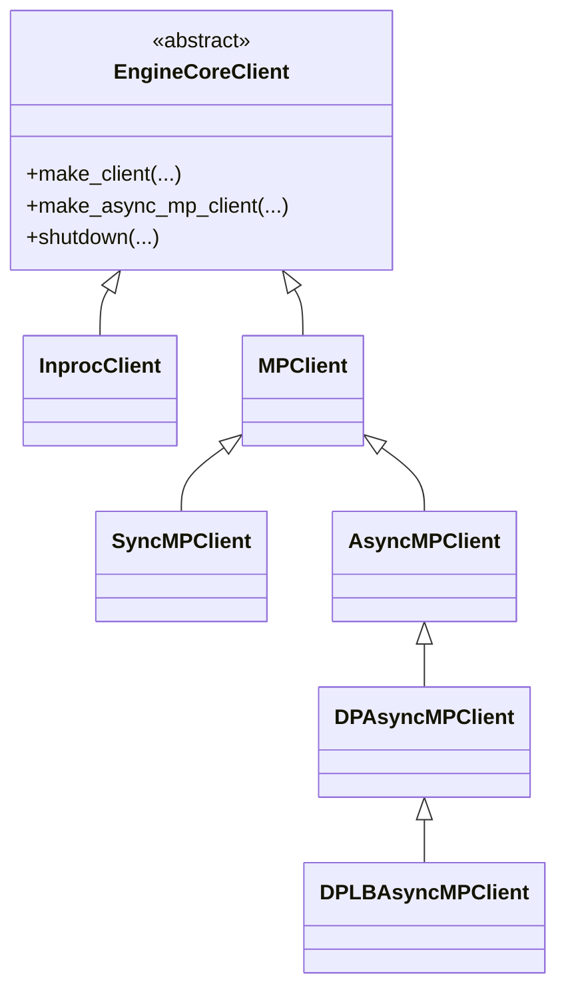

# `EngineCoreClient`（及 `InprocClient` / `MPClient` / `SyncMPClient` / `AsyncMPClient` / `DPAsyncMPClient` / `DPLBAsyncMPClient`）

## Summary

[`EngineCoreClient`](d:\design\vllm\vllm\v1\engine\core_client.py) 是 vLLM v1 前端与 [`EngineCore`](d:\design\vllm\vllm\v1\engine\core.py) / 子进程内 `EngineCoreProc` 之间的抽象边界：工厂 `make_client` / `make_async_mp_client` 在同进程、同步多进程（线程收包）与 asyncio 多进程（`asyncio.Task` 收包）之间选型。多进程路径下由 `MPClient` 建立 **ZMQ `ROUTER`（入）+ `PULL`（出）**，与 `EngineCoreProc` 侧的 **`DEALER` / `PUSH`** 配对；DP 场景下再叠加 coordinator 统计与负载均衡逻辑。

## Sources

- 主源全文：[d:\design\vllm\vllm\v1\engine\core_client.py](d:\design\vllm\vllm\v1\engine\core_client.py)（约 L1–L1696）
- ZMQ 地址与引擎拉起：[d:\design\vllm\vllm\v1\engine\utils.py](d:\design\vllm\vllm\v1\engine\utils.py)（如 `get_engine_zmq_addresses`、`launch_core_engines`）
- 引擎进程侧 socket 与 busy loop：[d:\design\vllm\vllm\v1\engine\core.py](d:\design\vllm\vllm\v1\engine\core.py)（如 `EngineCoreProc.process_input_sockets` / `process_output_sockets`）
- 聚合调用方：[d:\design\vllm\vllm\v1\engine\llm_engine.py](d:\design\vllm\vllm\v1\engine\llm_engine.py)、[d:\design\vllm\vllm\v1\engine\async_llm.py](d:\design\vllm\vllm\v1\engine\async_llm.py)

## 类层次（mermaid classDiagram）



说明：中间基类 `MPClient` 承载 ZMQ、就绪握手与引擎监控；用户常问的「四种子类」通常对应 `InprocClient`、`SyncMPClient`、`AsyncMPClient`、`DPLBAsyncMPClient`；**DP + 外部 LB** 时工厂返回 `DPAsyncMPClient` 而非 `DPLBAsyncMPClient`（见 `make_async_mp_client` L124–L129）。源码中**无**名为 `RayDPClient` 的类；Ray 相关弹性 EP 通过 `CoreEngineActorManager`（[utils.py](d:\design\vllm\vllm\v1\engine\utils.py)）等在 `DPLBAsyncMPClient` 内使用（如 `scale_elastic_ep` L1491–L1493）。

## 工厂与选型

| 入口 | 条件 | 返回类型 | 锚点 |
|------|------|----------|------|
| `make_client` | `asyncio_mode and not multiprocess_mode` | （不支持） | [L89–L93](d:\design\vllm\vllm\v1\engine\core_client.py) |
| | `multiprocess_mode and asyncio_mode` | `make_async_mp_client` | [L95–L98](d:\design\vllm\vllm\v1\engine\core_client.py) |
| | `multiprocess_mode and not asyncio_mode` | `SyncMPClient` | [L100–L101](d:\design\vllm\vllm\v1\engine\core_client.py) |
| | 否则 | `InprocClient` | [L103](d:\design\vllm\vllm\v1\engine\core_client.py) |
| `make_async_mp_client` | `data_parallel_size > 1` 且 `data_parallel_external_lb` | `DPAsyncMPClient` | [L124–L127](d:\design\vllm\vllm\v1\engine\core_client.py) |
| | `data_parallel_size > 1` 且非 external LB | `DPLBAsyncMPClient` | [L128–L129](d:\design\vllm\vllm\v1\engine\core_client.py) |
| | 否则 | `AsyncMPClient` | [L130](d:\design\vllm\vllm\v1\engine\core_client.py) |

聚合方：[`LLMEngine`](d:\design\vllm\vllm\v1\engine\llm_engine.py) 调用 `EngineCoreClient.make_client`（[L105–L111](d:\design\vllm\vllm\v1\engine\llm_engine.py)）；[`AsyncLLM`](d:\design\vllm\vllm\v1\engine\async_llm.py) 调用 `EngineCoreClient.make_async_mp_client`（[L148–L155](d:\design\vllm\vllm\v1\engine\async_llm.py)）。

## 4（+1）子类对照表

| 子类 | 进程模型 | IPC（本 client） | sync/async | 适用场景 / 说明 | 关键方法（示例） |
|------|----------|------------------|------------|-----------------|------------------|
| `InprocClient` | 同进程 | 无 ZMQ；直接持 `EngineCore` | sync | 兼容 V0 风格 `add_request` + `step`（`get_output` 调 `step_fn`） | `add_request`、`get_output`、`shutdown` |
| `SyncMPClient` | 子进程 `EngineCoreProc` + 本进程 | ZMQ：`ROUTER`→引擎 `DEALER`，`PULL`←引擎 `PUSH`（对端见 topic 页） | sync | `LLMEngine` 多进程 | `get_output`、`_send_input`、`call_utility` |
| `AsyncMPClient` | 同上 | 同上（`zmq.asyncio`） | **async I/O** | `AsyncLLM` 单 DP rank | `get_output_async`、`add_request_async`、`_send_input_message` |
| `DPAsyncMPClient` | 多引擎 DP + 外部 LB | 同上 + **`XSUB` 统计**、**`PAIR` first_req** | async | 每 DP rank 一 client；`get_core_engine_for_request` 默认单引擎 | `add_request_async`、`_ensure_stats_update_task` |
| `DPLBAsyncMPClient` | 多引擎 DP + **内部** LB | 同上 + 负载状态 + abort 路由 | async | 单前端在本地多引擎间分票 | `get_core_engine_for_request`、`abort_requests_async`、`process_engine_outputs` |

`synthesis:` **Executor↔Worker 的 `MessageQueue` 共享内存**不在 `core_client.py` 内实现；见 [`MultiprocExecutor`](MultiprocExecutor.md) 与 [multiproc-ipc topic](../topics/multiproc-ipc.md)。

## hidden state（§9）：threads / asyncio tasks / queues / ZMQ sockets

### `InprocClient`

| 类别 | 列表 | 行号 |
|------|------|------|
| 无本类自管 ZMQ/线程 | 仅 `self.engine_core = EngineCore(...)` | [L284–L285](d:\design\vllm\vllm\v1\engine\core_client.py) |
| queue / asyncio | 无（并发由 `EngineCore` 内部决定） | — |

### `MPClient`（`SyncMPClient` / `AsyncMPClient` / DP 子类共用）

| 类别 | 列表 | 行号 |
|------|------|------|
| ZMQ `Context` | `sync_ctx`；async 模式下 `zmq.asyncio.Context(sync_ctx)` | [L484–L485](d:\design\vllm\vllm\v1\engine\core_client.py) |
| 套接字 | `input_socket`：`ROUTER` bind；`output_socket`：`PULL`（外部注入地址或 `get_engine_zmq_addresses`） | [L511–L532](d:\design\vllm\vllm\v1\engine\core_client.py) |
| 析构与资源 | `BackgroundResources` + `weakref.finalize` | [L367–L447](d:\design\vllm\vllm\v1\engine\core_client.py)、[L490–L492](d:\design\vllm\vllm\v1\engine\core_client.py) |
| 共享状态 | `utility_results`、`pending_messages` | [L598](d:\design\vllm\vllm\v1\engine\core_client.py)、[L603](d:\design\vllm\vllm\v1\engine\core_client.py) |
| 后台线程 | `Thread` `MPClientEngineMonitor`（守护线程监控 `engine_manager`） | [L663–L665](d:\design\vllm\vllm\v1\engine\core_client.py) |
| 进程 | 由 `launch_core_engines` / 外部 manager 创建子进程（非本类内 `Process(...)` 字面量） | [L535–L537](d:\design\vllm\vllm\v1\engine\core_client.py) |

### `SyncMPClient`

| 类别 | 列表 | 行号 |
|------|------|------|
| `queue.Queue` | `outputs_queue` | [L731](d:\design\vllm\vllm\v1\engine\core_client.py) |
| 线程 | `EngineCoreOutputQueueThread`：`process_outputs_socket` | [L745–L781](d:\design\vllm\vllm\v1\engine\core_client.py) |
| ZMQ | 输出线程内 `zmq.Poller` 监听 **`PAIR` shutdown** 与 **`PULL` output**；`shutdown_path` 为 inproc | [L741–L752](d:\design\vllm\vllm\v1\engine\core_client.py) |
| 所有权转移 | 输出套接字交线程关闭：`resources.output_socket = None` | [L784](d:\design\vllm\vllm\v1\engine\core_client.py) |

### `AsyncMPClient`

| 类别 | 列表 | 行号 |
|------|------|------|
| `asyncio.Queue` | `outputs_queue` | [L910](d:\design\vllm\vllm\v1\engine\core_client.py) |
| asyncio Task | `process_outputs_socket` coroutine → `asyncio.create_task`（`EngineCoreOutputQueueTask`） | [L942–L988](d:\design\vllm\vllm\v1\engine\core_client.py) |
| ZMQ | `await output_socket.recv_multipart`（`zmq.asyncio.Socket`） | [L945](d:\design\vllm\vllm\v1\engine\core_client.py) |
| 真异步判定 | **是**：独立协程持续 `await` ZMQ；与业务协程通过 `asyncio.Queue` 解耦（`get_output_async` 用 `await outputs_queue.get()`） | [L990–L999](d:\design\vllm\vllm\v1\engine\core_client.py) |
| EEP 通知 | 对 utility 输出可走 `asyncio.create_task(notification_callback_handler...)` | [L962–L964](d:\design\vllm\vllm\v1\engine\core_client.py) |

### `DPAsyncMPClient`（含 `DPLBAsyncMPClient` 继承）

| 类别 | 列表 | 行号 |
|------|------|------|
| ZMQ `PAIR` | `first_req_send_socket` bind | [L1167–L1170](d:\design\vllm\vllm\v1\engine\core_client.py) |
| asyncio Task | `run_engine_stats_update_task` → `stats_update_task` | [L1188–L1294](d:\design\vllm\vllm\v1\engine\core_client.py) |
| ZMQ `XSUB` + `PAIR` | 统计任务内 `make_zmq_socket(..., zmq.XSUB)` 与 `first_req_rcv_socket` `PAIR` | [L1189–L1198](d:\design\vllm\vllm\v1\engine\core_client.py) |
| 负载状态 | `lb_engines`、`current_wave` | [L1150](d:\design\vllm\vllm\v1\engine\core_client.py)、[L1163](d:\design\vllm\vllm\v1\engine\core_client.py) |

### `DPLBAsyncMPClient` 额外状态

| 类别 | 列表 | 行号 |
|------|------|------|
| 请求→引擎映射 | `reqs_in_flight: dict[str, EngineIdentity]` | [L1333](d:\design\vllm\vllm\v1\engine\core_client.py) |
| 轮询起点 | `eng_start_index` | [L1346–L1348](d:\design\vllm\vllm\v1\engine\core_client.py) |
| 弹性 EP 缓存 | `eep_scaling_cache` | [L1165](d:\design\vllm\vllm\v1\engine\core_client.py)、[L1549](d:\design\vllm\vllm\v1\engine\core_client.py) |

回调 / 注册：utility 完成通过 `_process_utility_output` 写入 `utility_results` 中的 `Future`（[L694–L714](d:\design\vllm\vllm\v1\engine\core_client.py)）。

## 主调用链

### 同步：`SyncMPClient`

1. `add_request → _send_input(ADD, ...)`（[L823–L826](d:\design\vllm\vllm\v1\engine\core_client.py)、[L798–L810](d:\design\vllm\vllm\v1\engine\core_client.py)）：`input_socket.send_multipart` 带 engine identity。
2. 引擎侧：`EngineCoreProc.process_input_sockets`（[core.py](d:\design\vllm\vllm\v1\engine\core.py)）在 **`DEALER`** 上收包并入 `input_queue`（见 [EngineCore.md](EngineCore.md) / [multiproc-ipc](../topics/multiproc-ipc.md)）。
3. `get_output`：后台线程从 **`PULL`** 解码 `EngineCoreOutputs` → `outputs_queue`（[L786–L796](d:\design\vllm\vllm\v1\engine\core_client.py)）。

### 异步：`AsyncMPClient`

1. `add_request_async → await _send_input(ADD, ...)`（[L1058–L1061](d:\design\vllm\vllm\v1\engine\core_client.py)）。
2. `process_outputs_socket` 协程 `await recv_multipart`（[L945](d:\design\vllm\vllm\v1\engine\core_client.py)）→ `outputs_queue.put_nowait`（[L979–L980](d:\design\vllm\vllm\v1\engine\core_client.py)）。
3. `get_output_async → await outputs_queue.get()`（[L990–L996](d:\design\vllm\vllm\v1\engine\core_client.py)）。

```mermaid
sequenceDiagram
    participant Client as SyncMPClient / AsyncMPClient
    participant Zin as ZMQ ROUTER (client)
    participant EC as EngineCoreProc input_thread
    participant Loop as EngineCore busy loop
    participant Zout as ZMQ PUSH (engine)
    participant Zpull as ZMQ PULL (client)

    Client->>Zin: send_multipart(identity, ADD, ...)
    Zin->>EC: DEALER recv input_queue
    EC->>Loop: step / schedule
    Loop->>Zout: output_queue PUSH EngineCoreOutputs
    Zout->>Zpull: multipart frames
    alt SyncMPClient
        Zpull->>Client: thread recv queue.Queue
    else AsyncMPClient
        Zpull->>Client: Task recv asyncio.Queue
    end
```

## `DPLBAsyncMPClient` 负载均衡

- **策略**：若 `request.data_parallel_rank` 或 late interaction 索引已指定则用之；否则用 `lb_engines` 上 **waiting/running** 的加权分 `score = waiting*4 + running`，从 `eng_start_index` 起环形扫描（[L1350–L1373](d:\design\vllm\vllm\v1\engine\core_client.py)）。注释标明未来更大 DP 可用 P2C（[L1358](d:\design\vllm\vllm\v1\engine\core_client.py)）。
- **Coordinator**：`DPAsyncMPClient._ensure_stats_update_task` 通过 **`XSUB`** 收集中统计并更新 `lb_engines`（[L1276–L1287](d:\design\vllm\vllm\v1\engine\core_client.py)）；首次请求且引擎未跑时经 `first_req_send_socket` / `PAIR` 唤醒路径（[L1304–L1308](d:\design\vllm\vllm\v1\engine\core_client.py)）。
- **Abort**：`reqs_in_flight` 将请求映射到正确 engine identity，再 `_abort_requests`（[L1460–L1480](d:\design\vllm\vllm\v1\engine\core_client.py)）。

## abort / shutdown 时序

- **Abort**：`SyncMPClient.abort_requests` 在引擎仍存活时 `_send_input(ABORT, ids)`（[L828–L830](d:\design\vllm\vllm\v1\engine\core_client.py)）；异步对称（`AsyncMPClient.abort_requests_async` [L1063–L1065](d:\design\vllm\vllm\v1\engine\core_client.py)）。
- **Shutdown**：`MPClient.shutdown` detach finalizer 后调 `engine_manager.shutdown` 与 `BackgroundResources.__call__`（[L613–L618](d:\design\vllm\vllm\v1\engine\core_client.py)）。
- **同步输出线程退出**：`BackgroundResources` 在 sync 分支经 **`PAIR` inproc** 向 `process_outputs_socket` 发空帧触发 poller 退出（[L439–L445](d:\design\vllm\vllm\v1\engine\core_client.py) 与 [L757–L759](d:\design\vllm\vllm\v1\engine\core_client.py)）。
- **异步**：同一 `BackgroundResources` 在 async 分支 `call_soon_threadsafe` 关闭套接字并 **cancel** `output_queue_task` / `stats_update_task`（[L399–L418](d:\design\vllm\vllm\v1\engine\core_client.py)）。

引擎侧 `ENGINE_CORE_DEAD` 帧与 `linger` 行为见 [multiproc-ipc.md](../topics/multiproc-ipc.md)（如 ZMQ 节引用 [core.py L1479–L1501](d:\design\vllm\vllm\v1\engine\core.py)），此处不重复字节布局。

## 与 `multiproc-ipc.md` topic 页的分工

| 本页（`EngineCoreClient` entity） | Topic [multiproc-ipc.md](../topics/multiproc-ipc.md) |
|----------------------------------|----------------------------------------------------------------------|
| 类层次、工厂、子类差异、client 内线程/Task/队列 | ZMQ 拓扑与多帧协议、EngineCoreProc 内 `queue.Queue`、`MessageQueue` 热路径、Pipe/信号 |
| `ROUTER`/`PULL`/`PAIR`/`XSUB` 在 **前端进程** 的角色 | `DEALER`/`PUSH` 在 **引擎进程** 的角色及零拷贝 |

## §5 step 3 hidden cross-reference grep 结果

| # | 类别 | 结果（N/A 强论断） |
|---|------|-------------------|
| 1 | 跨语言绑定 | `EngineCoreClient`：在 [d:\design\vllm\csrc\](d:\design\vllm\csrc) 全 C++/CUDA 树 grep **0** 命中 |
| 2 | 协作伙伴跨子系统引用 | `EngineCoreClient` / `AsyncMPClient` / `DPLBAsyncMPClient` / `InprocClient` / `SyncMPClient` / `DPAsyncMPClient`：在 [d:\design\vllm\vllm\entrypoints\](d:\design\vllm\vllm\entrypoints) 全树 grep **0** 命中；在 [d:\design\vllm\benchmarks\](d:\design\vllm\benchmarks) 全树 grep **0** 命中；在 [d:\design\vllm\examples\](d:\design\vllm\examples) 全树 grep **0** 命中；在 [d:\design\vllm\tests\](d:\design\vllm\tests) 全树 grep **30** 命中（分布于 3 个文件：`test_engine_core_client.py`、`test_mamba_prefix_cache.py`、`test_async_llm_dp.py`） |
| 3 | 配置 / IPC 共享数据结构 | 在 [d:\design\vllm\vllm\](d:\design\vllm\vllm) 全 `*.py` 树：`EngineCoreRequest` **81** 命中（12 文件）；`EngineCoreOutputs` **43** 命中（11 文件）；`EngineCoreRequestType` **29** 命中（4 文件）；`EngineZmqAddresses` **16** 命中（2 文件：`utils.py`、`core.py`）；`MessageQueue` **54** 命中（5 文件，**不含** `core_client.py`） |
| 4 | 测试覆盖反查 | 主单测：[d:\design\vllm\tests\v1\engine\test_engine_core_client.py](d:\design\vllm\tests\v1\engine\test_engine_core_client.py)（多路径 `EngineCoreClient.make_client` / async 变体）；DP：[d:\design\vllm\tests\v1\distributed\test_async_llm_dp.py](d:\design\vllm\tests\v1\distributed\test_async_llm_dp.py) 引用 `DPAsyncMPClient`；E2E：[d:\design\vllm\tests\v1\e2e\general\test_mamba_prefix_cache.py](d:\design\vllm\tests\v1\e2e\general\test_mamba_prefix_cache.py) 使用 `InprocClient` |
| 5 | doc / config 反查 | 在 [d:\design\vllm\docs\](d:\design\vllm\docs) 全 `*.md` 中，`core_client.py` / `EngineCoreClient` / 并行 v1 引擎相关：**至少** [multiprocessing.md](d:\design\vllm\docs\design\multiprocessing.md)（含指向 `core_client.py` 行号的链接，如 L93–L95）、[troubleshooting.md](d:\design\vllm\docs\usage\troubleshooting.md)（栈引用 `core_client.py`）、[failures.md](d:\design\vllm\docs\contributing\ci\failures.md)（`test_engine_core_client.py`）；其余 `docs/design/*.md` 中间接出现 multiproc/ZMQ/EngineCore 主题若干（grep 宽模式多文件非零命中） |

## Notes / Caveats

> ~~[!todo] VERIFY: `InprocClient` **未实现**基类上大量 `async def` API（仍默认 `NotImplementedError`），与 `AsyncMPClient` 不同。具体未实现列表与 `EngineCoreClient` 抽象方法清单的差异需按 [L72–L259](d:\design\vllm\vllm\v1\engine\core_client.py) 抽象段落核对。~~
>
> **RESOLVED 2026-04-18**：`InprocClient`（[core_client.py:274-364](d:\design\vllm\vllm\v1\engine\core_client.py)）未覆盖任何协程 API；基类中 `async def ...` 默认体仍为 `raise NotImplementedError`（[core_client.py:170-271](d:\design\vllm\vllm\v1\engine\core_client.py)）。**重要**：基类**仅** `shutdown` 为 `@abstractmethod`（[core_client.py:132-133](d:\design\vllm\vllm\v1\engine\core_client.py)）；故"未实现清单"应对照基类 L170–271 的 `async def` **默认体**而非"抽象方法"——抽象方法只有 `shutdown` 一个。`synthesis:` 调用 `InprocClient.get_output_async` / `add_request_async` 等仍会落到默认 `raise NotImplementedError`，但因 `LLMEngine` 始终 `asyncio_mode=False` 调 `make_client`（[llm_engine.py:105-111](d:\design\vllm\vllm\v1\engine\llm_engine.py)），同进程模式不会触发该路径。

> ~~[!todo] VERIFY: DP 下 `SyncMPClient.add_request` 置 `engines_running = True`（[L824–L826](d:\design\vllm\vllm\v1\engine\core_client.py)）；与 async DP 的 coordinator 语义不同源，阅读时应对照 `DPAsyncMPClient.add_request_async`（DP 是否在 sync 路径仅当 `data_parallel_size==1` 时被聚合方使用，需与 `make_async_mp_client` DP 分支的 async-only 假设交叉）。~~
>
> **RESOLVED 2026-04-18**：`SyncMPClient.add_request` 在 `is_dp` 时置 `engines_running`（[core_client.py:823-826](d:\design\vllm\vllm\v1\engine\core_client.py)），`get_output` 遇 `wave_complete` 清零（[core_client.py:794-796](d:\design\vllm\vllm\v1\engine\core_client.py)）。`is_dp` 条件为 `data_parallel_size > 1`（[core_client.py:730](d:\design\vllm\vllm\v1\engine\core_client.py)）。`LLMEngine` 固定 `asyncio_mode=False` 调 `make_client`（[llm_engine.py:105-111](d:\design\vllm\vllm\v1\engine\llm_engine.py)），多进程时返回 `SyncMPClient`（[core_client.py:100-101](d:\design\vllm\vllm\v1\engine\core_client.py)），**未按 dp 大小切换** —— 故 **DP>1 + 同步多进程仍走 `SyncMPClient`**，并非"sync 聚合路径仅在 `data_parallel_size==1`"（原 VERIFY 假设有误，本次纠正）。DP 异步路径仅经 `make_async_mp_client`（[core_client.py:124-129](d:\design\vllm\vllm\v1\engine\core_client.py)）；`DPAsyncMPClient` 通过 `XSUB` / `FIRST_REQ` 维护 `engines_running`（[core_client.py:1276-1279, 1304-1308](d:\design\vllm\vllm\v1\engine\core_client.py)），与 sync 路径**不同源但语义对偶**。

## See also

- [vllm/entities/EngineCore.md](EngineCore.md)
- [vllm/entities/LLMEngine.md](LLMEngine.md)
- [vllm/entities/AsyncLLM.md](AsyncLLM.md)
- [vllm/topics/multiproc-ipc.md](../topics/multiproc-ipc.md)
- [vllm/topics/request-lifecycle.md](../topics/request-lifecycle.md)
- [vllm/modules/engine.md](../modules/engine.md)
- `comparison/topics/multiproc-ipc.md`（TODO：占位，待建）
